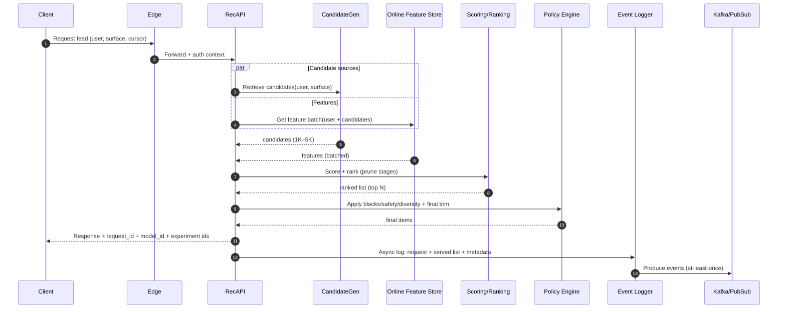

## Overview

A production recommendation system is **two coupled systems**:

1. **Online serving (low latency, high availability)**: candidate generation → scoring → ranking → policy enforcement → response.
2. **Learning loop (high throughput, high correctness)**: event logging → feature pipelines → training → evaluation → deployment → monitoring.

The core infrastructure challenge is maintaining **trustworthy feedback loops** and **feature parity** while meeting strict SLOs. This requires:
- Clear data contracts (schemas, versioning, lineage)
- A feature platform that supports **online/offline consistency**
- Safe rollouts (shadow, canary, A/B) with automated guardrails
- Graceful degradation paths that preserve safety and UX

## Goals & Non-Goals

### Goals
- Serve personalized feeds with deterministic safety/policy enforcement.
- Support multiple candidate sources (graph, embeddings, content, trending).
- Enable rapid iteration with reproducible training and safe deployments.
- Maintain auditability: every served decision can be traced to model + features + config.

### Non-Goals
- Specify a single “best” model architecture (DNN/GBDT/etc.). The focus is infra patterns that support many models.
- Guarantee globally consistent personalization across regions in real time (we optimize for locality + eventual convergence).

## Requirements

### Functional Requirements
- Generate candidates from multiple sources: follow graph, similar content, embeddings ANN, trending, editorial/safety overrides.
- Score and rank candidates using versioned ML models and versioned feature definitions.
- Apply constraints: dedup, freshness, creator diversity, exploration, blocked/muted content, language/region, safety classification.
- Support experiments: A/B, multivariate, interleaving (optional), and staged rollouts (shadow → canary → ramp).
- Log training-grade events with enough context to reconstruct what happened (model/version, experiment variant, served list, policies applied).
- Retrain models periodically (daily/weekly) and support faster incremental updates (minutes–hours) for lightweight features/models.
- Detect drift and data quality issues (feature staleness, schema changes, label leakage, bot traffic).

### Non-Functional Requirements (Concrete Targets)

#### Scale (example “large consumer product”)
- **Users**: 50M DAU, 200M MAU
- **Feed requests**: 40K QPS average, 200K QPS peak (burst factor ~5×)
- **Items returned**: 30 items/request (page); prefetch can increase effective QPS
- **Impression events**: client-side viewport logging, ~300K–2M events/sec peak (depends on client behavior)
- **Click/engagement events**: 5K–50K events/sec peak
- **Candidate set size**: 1K–5K candidates/request (internal), pruned in stages

> Note: logging *all* candidates at full fidelity for every request is typically cost-prohibitive. The design below logs the **served set** for every request and logs **full candidate sets** via sampling + debug triggers.

#### Latency (end-to-end at the edge, per request)
- **P50**: 80 ms
- **P95**: 140 ms
- **P99**: 220 ms
- **Hard timeout**: 300 ms (beyond this, return degraded results)

Typical P99 budget (illustrative; varies by product/region):
- Edge + auth + routing: 20 ms
- Candidate generation (parallel sources): 60 ms
- Feature fetch + assembly: 60 ms
- Scoring (batched inference): 70 ms
- Ranking/post-processing + policy: 30 ms
- Buffer/headroom: 60 ms

#### Availability & Durability
- **Serving API**: 99.99% monthly (regional), 99.95% global (multi-region)
- **Event ingestion**: 99.99% accept rate; **at-least-once** delivery
- **Data loss**: <0.01% of interaction events (measured at client ↔ ingestion boundary)
- **Offline pipelines**: 99.9% (degraded freshness acceptable)

#### Consistency
- **Strong enforcement at serving time** for user safety/privacy actions (blocks/mutes, sensitive content restrictions).
- **Eventual consistency** for derived aggregates and personalization features (seconds–minutes).
- **Deterministic replay** for training: features + labels computed from immutable logs and versioned definitions.

### Constraints & Assumptions
- Multi-region active-active serving with **regional data locality** for latency.
- Small platform team (6–10 engineers): favor managed primitives where they reduce operational load.
- GDPR/CCPA: DSAR deletion, purpose limitation, audit logs, PII minimization/segregation.
- Safety enforcement must work under degradation (no “unsafe fallback”).

## High-Level Architecture

```mermaid
flowchart LR
  %% Online serving path
  subgraph O[Online Serving (Critical Path)]
    C[Client] --> E[Edge / API Gateway]
    E --> A[Recommendation Serving API]

    A -->|parallel| CG[Candidate Generation]
    A -->|batch| FS[(Online Feature Store)]
    A --> R[Scoring + Ranking]
    R --> P[Policy + Constraints]
    P --> RESP[Response]

    A -->|async| EL[Event Logger]
  end

  %% Data/learning path
  subgraph L[Learning Loop (Throughput + Correctness)]
    EL --> K[(Event Bus: Kafka/PubSub)]
    K --> SP[Stream Processing (Flink/Spark)]
    SP --> OFS[(Offline Store / Lakehouse: Iceberg/Delta)]
    OFS --> DS[Dataset Builder + Labeling]
    DS --> TR[Training + Evaluation]
    TR --> MR[Model Registry]
    MR --> DEP[Deployment Controller]
  end

  %% Feedback connections
  DEP --> R
  SP --> FS
```

### Why this separation matters
- Online systems optimize for **bounded latency** and **graceful degradation**.
- Offline/streaming systems optimize for **correctness, replay, lineage, and cost efficiency**.
- The coupling point is **versioned artifacts**: models, feature definitions, and configuration.

## Request Lifecycle (Data Flow)



## Components

### 1) Recommendation Serving API (RecAPI)
**Responsibilities**
- Orchestrate candidate retrieval, feature assembly, scoring/ranking, and policy enforcement.
- Enforce time budgets and return best-effort results.
- Emit structured logs for every request.

**Key design decisions**
- **Parallelism with deadlines**: run retrieval sources concurrently; stop waiting at per-stage deadlines.
- **Partial results are first-class**: if a source times out, rank what you have and record the degradation reason.
- **Non-blocking logging**: request completion must not depend on analytics sinks; log via async buffer + backpressure.

**Implementation notes**
- gRPC internally (low overhead), HTTP/JSON externally (developer friendliness) or gRPC-web for clients.
- Circuit breakers, per-dependency timeouts, and hedged requests only where safe (to avoid load amplification).

### 2) Candidate Generation
**Responsibilities**
- Produce diverse candidates from multiple retrieval strategies.

**Common sources**
- Follow graph / social edges (fast, high precision)
- Embeddings ANN (good recall; higher cost)
- Content similarity / topic match
- Trending / popularity (fallback + cold start)
- Editorial/safety allowlists/denylists

**Key design decisions**
- **Two-phase retrieval**: cheap eligibility filters first, then expensive retrieval (ANN/graph walks).
- **Per-source quotas**: cap contributions to prevent a single source from dominating.
- **Precompute snapshots**: user embeddings, item embeddings, and graph summaries updated streaming/batch.

**Technology options**
- ANN: FAISS/ScaNN in-service, or a managed vector DB (Milvus/Pinecone/etc.) depending on ops tolerance.
- Graph edges: low-latency KV for hot edges (Redis/KeyDB), durable store for full graph (Cassandra/Scylla/DynamoDB).

### 3) Scoring & Ranking
**Responsibilities**
- Compute features, run models, produce an ordered list, and enforce ranking constraints.

**Key design decisions**
- **Multi-stage ranking** (typical):
  - Stage 0: eligibility + cheap heuristics (5K → 2K)
  - Stage 1: lightweight model (2K → 300)
  - Stage 2: heavy model + re-rank (300 → 50)
- **Batch inference per request**: treat candidates as a batch to reduce per-item overhead.
- **Reproducibility contracts**: every score is tied to:
  - `model_id`
  - `feature_view_versions`
  - `ranker_config_version` (business rules + weights)
  - `schema_hash` (for serialized feature vectors)

**Serving tech options**
- GBDT: LightGBM/XGBoost native on CPU (often excellent latency/cost).
- DNN: ONNX Runtime / TensorRT / TF Serving / TorchServe depending on stack.
- Admission control for GPU pools (queues + max in-flight) to avoid tail-latency collapse.

### 4) Policy / Safety / Trust Layer
**Responsibilities**
- Enforce blocks/mutes, sensitive content rules, regional compliance, and creator/item restrictions.

**Key design decisions**
- Safety is not a post-hoc filter only: it participates in **eligibility** and **final enforcement**.
- “Unsafe fallback” is prohibited: degraded mode must still honor policy.

**Data requirements**
- Block/mute lists must be available with low latency and high freshness.
- Safety labels and enforcement config must be versioned and auditable.

### 5) Event Ingestion & Streaming Features
**Responsibilities**
- Ingest client + server events, enrich them, compute aggregates, and publish to offline storage and online feature store.

**Key design decisions**
- **At-least-once ingestion** + **idempotent consumers**:
  - Deduplicate by `event_id` and (when needed) `(request_id, user_id, item_id, event_type)` within a time window.
- **Raw immutable logs** are the source of truth (audit + replay).
- Separate topics for different partition keys (user vs item) to avoid partitioning conflicts.

**Pipeline pattern**
- Ingest → validate schema → enrich → write raw → compute derived aggregates → publish to online store.

### 6) Training, Evaluation, and Model Registry
**Responsibilities**
- Build datasets, train models, evaluate, and safely deploy.

**Key design decisions**
- **Feature parity**: training uses the same feature definitions as serving (same transformation logic, versioned).
- **Continuous evaluation**:
  - Offline: AUC/logloss/precision@K, calibration, bias metrics
  - Online: CTR/dwell/hides, retention proxies, latency, error rate
- **Guardrails + auto-rollback**: deploy controller can roll back on metric regressions or SLO violations.

**Tooling options**
- Orchestration: Airflow/Dagster
- Registry/metadata: MLflow / SageMaker / Vertex AI
- Training: Spark + XGBoost, Ray, or framework-native distributed training

## Data Model

### Core Identifiers
- `request_id`: unique per feed response; used to join served list ↔ engagement.
- `event_id`: unique per interaction event; supports idempotency.
- `model_id`: immutable model artifact identifier.
- `feature_set_id`: identifier for the feature definition bundle used (or per-view versions).

### Event Schemas (High Level)

#### 1) Request Log (server-side, one per response)
Stored in a durable log/lake (not necessarily the event bus hot path).

Fields:
- `request_id`, `ts_ms`, `user_id`, `surface`, `cursor`, `limit`
- `region`, `device_class`, `app_version`
- `model_id`, `ranker_config_version`, `feature_set_id`
- `experiment_assignments`: array of `{id, variant}`
- `degradations`: array of `{stage, reason, duration_ms}`
- `served_items`: array of `{item_id, position, score, reason_codes[]}`

> This is the minimum required to compute unbiased “served-but-not-clicked” negatives.

#### 2) Interaction Events (client-side, many per request)
Topic example: `rec_interactions_v1`

Fields:
- `event_id`, `ts_ms`, `user_id`, `request_id`
- `event_type`: `impression|click|dwell|like|hide|follow|share`
- `item_id`, `position`
- Optional: `dwell_ms`, `viewport_ms`, `action_metadata`

#### 3) Candidate Debug (sampled, optional)
Topic example: `rec_candidates_debug_v1` (sampled at 0.1–1% or triggered by issues)

Fields:
- `request_id`, `ts_ms`, `user_id`, `model_id`
- `candidates`: array of `{item_id, source, retrieval_score, eligibility_flags, stage_scores{...}}`

### Feature Store Layout

#### Online Feature Store (low latency KV)
- Keys: `(entity_type, entity_id, feature_view_version)`
- Entities:
  - `user:*` (aggregates, embeddings, preferences)
  - `item:*` (popularity, safety labels, freshness)
  - `user_item:*` (affinity, last_seen, negative feedback)
- Typical constraints:
  - Read P99: 5–15 ms within region
  - TTL per view based on update cadence (seconds for hot item counters; minutes for user aggregates)

#### Offline Store / Lakehouse (Iceberg/Delta)
Tables (examples):
- `events_raw` (append-only; partition by date/hour)
- `requests_served` (append-only; partition by date/hour)
- `features_user_daily`, `features_item_hourly`, `features_user_item_daily`
- `labels_attribution` (joins served items → subsequent engagements)

Partitioning guidance:
- Partition by time (hour/day) to support backfills and retention.
- Cluster/sort by `user_id` or `item_id` for join efficiency.

### Retention & Privacy
- Define explicit retention for each dataset (e.g., 30–90 days for raw interactions; longer for aggregated, non-PII).
- PII segregation: store direct identifiers and sensitive attributes separately with stricter access controls.
- DSAR deletion strategy:
  - Delete/expire user-level online features quickly.
  - In the lakehouse, use table formats that support deletes (Iceberg/Delta) and track deletion requests with audit logs.

## API Design

### 1) Get Recommendations
`POST /v1/recommendations:get`

Using POST avoids oversized query strings and allows richer request context.

Request:
```json
{
  "user_id": "u123",
  "surface": "home",
  "limit": 30,
  "cursor": "opaque",
  "client_context": {
    "locale": "en-US",
    "region": "us-east",
    "device_class": "mobile",
    "app_version": "9.2.1"
  },
  "request_id": "optional-uuid"
}
```

Response:
```json
{
  "request_id": "uuid",
  "items": [
    {
      "item_id": "i123",
      "rank": 1,
      "score": 0.913,
      "reason_codes": ["follow_graph", "fresh"]
    }
  ],
  "next_cursor": "opaque",
  "model_id": "ranker_v17",
  "experiments": [{"id": "exp_42", "variant": "B"}],
  "degraded": false
}
```

Errors:
- `400` invalid schema/inputs
- `401/403` auth/policy
- `429` rate limited
- `503` degraded service (still returns safe fallback when possible)

Idempotency:
- If `request_id` provided, dedupe within a short TTL (e.g., 10–30s) for retry storms and consistent logging.

### 2) Log Interaction Event
`POST /v1/recommendations/events`

Request:
```json
{
  "event_id": "uuid",
  "event_type": "click",
  "ts_ms": 1730000000000,
  "user_id": "u123",
  "request_id": "uuid",
  "item_id": "i123",
  "position": 7,
  "dwell_ms": 12000
}
```

Response:
- `202` accepted (async)
- `409` duplicate `event_id` (safe)

### 3) Admin: Deploy Model
`POST /v1/models/{model_id}/deploy`

Request:
```json
{ "mode": "canary", "traffic_pct": 1, "region": "us-east" }
```

Guardrails:
- Enforce pre-deploy checks (schema compatibility, offline eval thresholds).
- Automated rollback on SLO breach or metric regression beyond thresholds.

## Scaling & Performance

### Key Bottlenecks and Mitigations
- **Tail latency from fan-out dependencies**
  - Parallelize with deadlines; use circuit breakers; cap in-flight requests.
- **Feature fetch cost**
  - Batch reads; keep data in-region; L1/L2 caching for slow-changing features.
- **Model compute**
  - Multi-stage ranking; batch inference; CPU/GPU separation with admission control.
- **Hot keys (celeb accounts / viral items)**
  - Cache hot item features; use approximate counters; apply load shedding for non-critical enrichment.
- **Event ingestion bursts**
  - Client buffering + backoff; topic partitioning; separate critical vs non-critical topics.

### Caching Strategy (Practical)
- **Request cache**: short TTL (5–20s) for retries and thundering herds; include experiment variant in key.
- **Feature cache**:
  - L1 in-process for immutable/slow features
  - L2 Redis/memcache for hot entities
- **Candidate cache**: short TTL (30–120s) for low-activity users; invalidate strongly on block/mute updates.

### Partitioning Strategy
- Online KV: consistent hash on entity id.
- Event bus:
  - User-aggregate topics partitioned by `user_id`
  - Item-aggregate topics partitioned by `item_id`
  - Keep request logs separate from interaction events for cost/throughput control.

## Consistency, Correctness, and Data Contracts

### Serving-Time Safety Consistency
- Blocks/mutes must apply immediately in-region; cross-region propagation target seconds.
- Prefer “home region” routing for user policy state; replicate policy state to other regions with short TTL caching and fast invalidation.

### Idempotency & Dedupe
- Require `event_id` for interactions.
- Consumers dedupe within time windows using compacted stores or stateful stream processing.
- Avoid double-counting by designing aggregations to be idempotent (e.g., upserts keyed by `(user_id, day)`).

### Feature/Model Versioning
- Every request log includes `model_id`, `feature_set_id`, and config versions.
- Feature definitions are code-reviewed and promoted like software releases.

## Trade-offs & Alternatives

### Key Trade-offs
- **Multi-stage retrieval + ranking vs single heavy model**: better latency/cost and debuggability; risk of pruning “long tail” positives.
- **At-least-once ingestion vs end-to-end exactly-once**: simpler and more resilient; requires careful idempotency and dedupe.
- **Unified feature platform vs ad-hoc joins**: reduces skew and accelerates iteration; adds governance and operational surface area.
- **Client-side impression logging vs server-side**: better semantic accuracy (viewport); adds client complexity and sampling considerations.
- **Active-active serving vs primary/secondary**: better latency and resiliency; harder consistency and rollout management.

### Alternative Approaches
- **Batch-only feeds (daily recompute)**: simpler/cheaper; poor freshness and responsiveness.
- **Fully managed recommendation platform**: faster start; potential lock-in and cost at high QPS; less control over safety/experimentation internals.
- **End-to-end retrievalless ranking**: feasible for small catalogs; expensive at large scale.

## Failure Modes & Mitigations

### 1) Online Feature Store Outage
- **Impact**: personalization degraded; latency spikes
- **Mitigation**: serve from stale cache; reduce model complexity; fallback to trending/follow-based; record degradation

### 2) Candidate Source Timeout (ANN/Graph)
- **Impact**: reduced recall; possible homogeneity
- **Mitigation**: per-source deadlines; quotas; fallback sources; keep “always available” candidate stream (trending/editorial)

### 3) Model Serving Saturation (GPU/CPU)
- **Impact**: tail latency collapse, timeouts
- **Mitigation**: admission control; multi-stage pruning; shed to lightweight model; autoscale with queue depth + p99 triggers

### 4) Kafka/PubSub Lag or Partition Skew
- **Impact**: stale aggregates; delayed learning
- **Mitigation**: autoscale consumers; re-partition hot keys; isolate critical topics; replay from raw logs

### 5) Bad Model / Config Deployment
- **Impact**: metric regression, user harm
- **Mitigation**: shadow → canary → ramp; automated guardrails; kill switch to heuristic ranker; fast rollback in deploy controller

### 6) Training Data Corruption / Schema Drift
- **Impact**: invalid model, silent skew
- **Mitigation**: schema registry compatibility; data quality checks (nulls, ranges, distribution drift); block promotion; replay/backfill from raw

### 7) Feedback Loop Bias (Position/Selection Bias, Bots)
- **Impact**: model learns wrong signals; exploitation spirals
- **Mitigation**: exploration buckets; propensity logging; IPS/DR evaluation; bot detection filters; diversity constraints

## Operations

### SLOs, SLIs, and Alerting
Serving SLIs:
- End-to-end latency (P50/P95/P99), error rate, timeout rate
- Stage timings (retrieval, features, scoring, policy)
- Degradation rate (fallback usage), cache hit rates

Quality SLIs (guardrails):
- CTR, long-click/dwell, hides per impression, blocks per impression
- Diversity (creator/item entropy), freshness, repetition rate

Pipeline SLIs:
- Event accept rate, consumer lag, checkpoint health, feature freshness lag
- Training job success rate, dataset build latency, model promotion time

### Deployment Practices
- Blue/green for services, canary for models/configs.
- Shadow scoring to validate distributions before serving.
- Rollouts tied to experiment frameworks; use holdouts for long-term drift detection.

### Disaster Recovery (Example Targets)
- Serving: **RTO 15 min**, **RPO ~0** (stateless, redeployable)
- Event pipeline: **RPO < 1 min** (replicated bus + durable sinks)
- Lakehouse/model artifacts: multi-AZ and multi-region replication, versioned storage

### Security & Compliance
- Least-privilege access to logs/features/models.
- PII segregation, encryption in transit/at rest, audit trails for admin actions.
- DSAR workflows and documented retention policies.
- Protect against training-time leaks (e.g., prevent using post-impression signals in features).

## References & Further Reading
- DLRM (Meta): https://arxiv.org/abs/1906.00091
- Wide & Deep (Google): https://arxiv.org/abs/1606.07792
- Bandits / exploration: https://www.cs.princeton.edu/~rs/banditbook/
- Kafka semantics & design: https://kafka.apache.org/documentation/
- Feature stores (Feast): https://feast.dev/
- Lakehouse table formats (Iceberg): https://iceberg.apache.org/