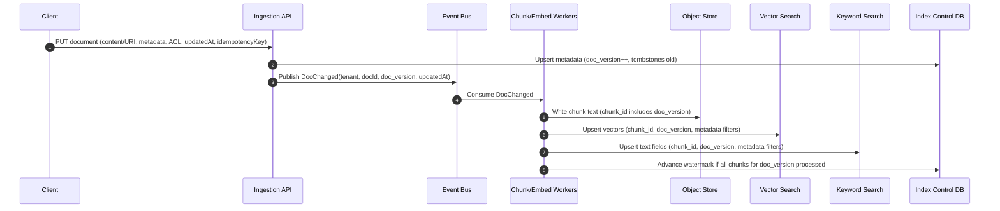
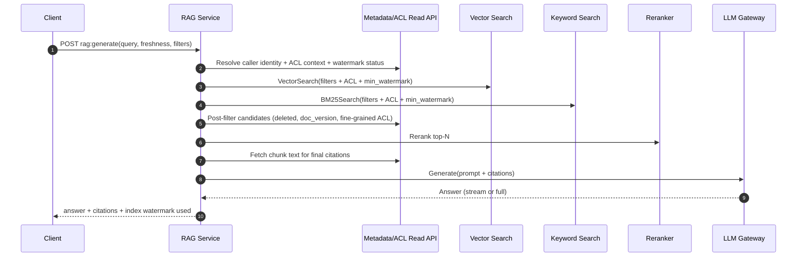

## Overview

Retrieval-Augmented Generation (RAG) improves LLM accuracy by grounding responses in retrieved, domain-specific context (wikis, tickets, runbooks, logs). In production, the hard problems are operational: ingestion throughput, embedding cost, relevance quality, strict security filtering, token-budget packing, and measurable “freshness” guarantees.

Freshness is not “near real-time indexing” in the abstract; it is a contract: **a query must either** (a) retrieve only content indexed up to a stated watermark, **or** (b) fail/degrade explicitly when the contract cannot be met. This requires explicit watermarks, versioned publishing, and query-time policies that prevent silently serving stale or unauthorized content.

---

## Requirements

### Functional Requirements
- Ingest documents (create/update/delete) with metadata: tenant, corpus, ACLs, timestamps, source/URI.
- Chunk documents, generate embeddings, and support re-embedding (model upgrades, new chunking).
- Retrieve context via **hybrid search** (vector + keyword) with strict metadata and ACL filtering.
- Rerank candidates and assemble prompts within a strict token budget with citations.
- Enforce per-request freshness policies (max staleness; optional read-your-writes).
- Provide explainability/debugging: retrieved chunk IDs, scores, index version, watermark, filters applied.
- Support multi-tenancy isolation (quotas, rate limits, noisy-neighbor controls).
- Audit logging for access to retrieved content and LLM requests (with redaction controls).
- Support compliance deletion (GDPR): prevent retrieval immediately after delete is accepted; purge from indexes within SLA.

### Non-Functional Requirements (Concrete Targets)
**Traffic / Data**
- Tenants: up to **1,000**
- Retrieval peak: **10,000 QPS** (retrieve-only)
- RAG generation peak: **1,000 QPS** (retrieve + rerank + LLM)
- Ingestion burst: **10,000 docs/min**
- Corpus size: **500M chunks**
- Chunk text size: **5–20 KB** (raw text); average **~1,000 tokens** is too large for packing, so chunking should target **150–400 tokens** per chunk for retrieval/packing efficiency.

**Latency (per request, steady state)**
- Retrieve-only endpoint:
  - **P50 80 ms**, **P99 250 ms** (hybrid search + filters + lightweight rerank optional)
- RAG generate endpoint (LLM dominates):
  - **P50 1.2 s**, **P99 4.0 s**
- Internal budgets (typical):
  - Query embedding: **5–20 ms** (cached or local model), **50–150 ms** (remote)
  - Vector ANN search: **15–60 ms** (P50), **60–150 ms** (P99, shard fanout dependent)
  - BM25 search: **10–40 ms** (P50), **40–120 ms** (P99)
  - Rerank top-N (cross-encoder): **20–120 ms** depending on N/model/hardware

**Availability**
- Retrieval data plane: **99.99%** (degraded modes allowed: keyword-only, cached-only)
- Ingestion APIs: **99.95%**
- Control plane (index manager/workflows): **99.9%** (may lag without dropping reads)

**Consistency**
- **Strong** for document metadata and ACL decisions (authoritative).
- **Bounded eventual** for index contents with explicit watermarks.
- Optional **read-your-writes** tier via a small “delta” index (last N minutes) merged at query time.

**Durability**
- Metadata DB: **RPO ≤ 1 minute** (PITR), **RTO ≤ 2 hours**
- Chunk storage: object store durability; indexes are rebuildable from stored chunks + metadata + embedding model versioning.

### Constraints & Assumptions
- Team size: **6–10 engineers**; prefer managed services where feasible.
- Compliance: encryption in transit/at rest, audit logs, tenant isolation, deletion workflows.
- LLM accessed through an internal gateway; prompt must be reproducible (inputs + retrieved chunk IDs + model config).
- Freshness SLA:
  - Standard tier: **max staleness ≤ 5 minutes**
  - Optional interactive tier: **read-your-writes ≤ 10 seconds** (scoped to recent edits and typically lower QPS)

---

## Architecture

### High-Level (Data Plane vs Control Plane)

```mermaid
graph TB
  Client[Client] --> APIGW[API Gateway]

  subgraph DataPlane[Data Plane (Low Latency)]
    APIGW --> RAG[RAG / Retrieval Service]
    RAG --> QCache[(Redis: query + doc state cache)]
    RAG --> Vec[Vector Search]
    RAG --> Lex[Keyword Search]
    RAG --> ReRank[Reranker]
    RAG --> LLM[LLM Gateway]
    RAG --> Meta[(Metadata/ACL Read API)]
  end

  subgraph ControlPlane[Control Plane (Indexing + Freshness)]
    APIGW --> Ingest[Ingestion API]
    Ingest --> Bus[Event Bus]
    Bus --> Chunker[Chunk/Normalize Workers]
    Chunker --> Obj[(Object Store: chunk text)]
    Chunker --> Embed[Embedding Workers]
    Embed --> Vec
    Embed --> Lex
    Embed --> Ctrl[(Index Control DB)]
    Ctrl --> IndexMgr[Index Manager / Workflows]
    IndexMgr --> Vec
    IndexMgr --> Lex
  end
```

**Key idea:** the data plane is optimized for reads and correctness at query-time (ACLs, deletes, freshness policy enforcement), while the control plane handles asynchronous ingestion, embedding, and index lifecycle (versioning, compaction, rebuilds).

### Freshness Model (Watermarks + Policy)
- Each corpus (often `tenant_id + corpus_id + embed_model`) maintains a **watermark**: `indexed_through_ts`.
- Queries specify a policy, e.g.:
  - `maxStalenessSeconds = 300` (must use an index whose watermark is ≥ now-300s)
  - optional `requireReadYourWrites = true` (must also consult a delta index for the caller’s recent writes)
- If the policy cannot be met:
  - return `503 freshness_not_met` (strict mode), **or**
  - degrade explicitly (e.g., keyword-only or cached-only) if the client permits.

### Data Flow Diagrams

#### Ingestion + Index Updates



#### Retrieval + RAG Generation



**Why post-filter?** Even if an index is slightly stale, **metadata/ACL must be authoritative** to prevent deleted or unauthorized content from being returned.

---

## Components

### API Gateway
**Responsibilities**
- AuthN/Z (OIDC/JWT), tenant routing, rate limiting, request validation, audit hooks.
- Enforce separate limits for ingestion vs retrieval to prevent backpressure coupling.

**Design notes**
- Put tenant/user identity into signed headers/claims consumed by downstream services.
- Support per-tenant quotas and “hot tenant” isolation.

**Typical tech**
- Envoy + OIDC, or managed API gateway (AWS/GCP) with WAF and rate limiting.

---

### Ingestion API
**Responsibilities**
- Validate and normalize documents, enforce idempotency, manage versions, emit events.
- Apply strong deletes/tombstones at the metadata layer immediately.

**Key decisions**
- Assign a monotonically increasing `doc_version` per `doc_id`.
- Treat ingestion as accepted once metadata is committed and an event is published (async indexing).

**Typical tech**
- Stateless service + Postgres (or Spanner) for metadata; outbox pattern for reliable event publication.

---

### Chunking / Normalization Workers
**Responsibilities**
- Convert content (HTML/PDF/Markdown) to canonical text, chunk into retrieval-friendly sizes, compute checksums/token counts.

**Key decisions**
- Chunk sizes target **150–400 tokens** with overlap (e.g., 20–60 tokens) to preserve context.
- Store chunk text in object storage; indexes store only identifiers + limited fields.

**Typical tech**
- Kubernetes workers; content extraction libs; object store (S3/GCS).

---

### Embedding Workers
**Responsibilities**
- Generate embeddings for chunks; write to vector index; update keyword index fields; report progress.

**Key decisions**
- Batch embedding calls to maximize GPU utilization or provider throughput.
- Track `embed_model` and `chunker_version`; changes trigger re-embedding/re-chunking pipelines.
- Use backpressure controls (per-tenant concurrency + global token budget).

**Typical tech**
- GPU-backed service for high volume; or managed embedding API behind an internal gateway.

---

### Index Manager (Freshness + Lifecycle Control Plane)
**Responsibilities**
- Maintain watermark state, detect lag, manage rebuilds (model upgrades), compaction, and rollback.
- Define what “eligible for retrieval” means for a corpus.

**Key decisions**
- **Watermark** is advanced only when all chunks for a document version are indexed (prevents partial updates).
- Maintain a small **delta window** (optional) for read-your-writes, then compact into the main index.

**Typical tech**
- Workflow orchestrator (Temporal) + Postgres control tables; managed vector DB + OpenSearch; or integrated search (e.g., Vespa) if operating at very large scale.

---

### Retrieval / RAG Service
**Responsibilities**
- Query understanding, embedding, hybrid retrieval, strict filtering, rerank, prompt packing, citation assembly.
- Enforce freshness policy and return explicit errors/degraded responses when unmet.

**Key decisions**
- Hybrid retrieval (BM25 + vector) improves recall for IDs, code symbols, rare terms, and “fresh” entity names.
- Two-stage ranking (retrieve → rerank) maximizes quality under latency budgets.
- Prompt packing uses token-aware selection (diversity + dedup + source balancing).

**Typical tech**
- Stateless Go/Java service; Redis for caches; reranker as local model or separate service.

---

### LLM Gateway
**Responsibilities**
- Unify providers/models; enforce policy (max tokens, allowed models), retries, circuit breakers, cost controls.
- Ensure reproducibility: log model parameters + retrieved chunk IDs + index watermark (with redaction).

**Key decisions**
- Bulkheads per provider/model to prevent cascading failures.
- Store prompts and retrieved text with a configurable retention policy and PII controls.

---

## Data Model

### Canonical Metadata (Postgres / Spanner)

**`documents`**
- `tenant_id` (PK part)
- `doc_id` (PK part)
- `doc_version` (int, monotonic)
- `source` (string), `uri` (string)
- `content_hash` (bytes)
- `updated_at` (timestamp), `deleted_at` (timestamp nullable)
- `corpus_id` (string)
- `acl_policy_id` (FK)
- `metadata_json` (jsonb)

**`chunks`**
- `tenant_id`, `doc_id`, `doc_version`, `chunk_id` (PK)
- `chunk_uri` (object store pointer)
- `token_count` (int), `start_offset`, `end_offset`
- `created_at`, `deleted_at`

**`embeddings`**
- `tenant_id`, `chunk_id`, `embed_model` (PK)
- `dims` (int), `embedding_ref` (optional pointer if not stored in vector DB)
- `created_at`

**`acl_policies`**
- `acl_policy_id` (PK)
- `type` (enum: rbac|abac)
- `rules_json` (jsonb) (e.g., groups, labels, document-level constraints)
- `updated_at`

**`corpus_watermarks`**
- `tenant_id`, `corpus_id`, `embed_model` (PK)
- `indexed_through_ts` (timestamp)
- `lag_seconds` (derived/optional)
- `updated_at`

**`query_audit`**
- `tenant_id`, `user_id`, `request_id` (PK)
- `query_hash`
- `watermark_required_ts`, `watermark_used_ts`
- `retrieved_chunk_ids` (jsonb) (IDs only; text optional with redaction policy)
- `model_id`, `model_params_json`
- `created_at`

### Search Index Records

**Vector Search (per point)**
- ID: `chunk_id` (contains `doc_version`)
- Fields: `tenant_id`, `corpus_id`, `doc_id`, `doc_version`, `updated_at`, `deleted_at`, `acl_tags` (or policy hash), `embed_model`
- Vector: float32/float16/int8 depending on DB and accuracy targets

**Keyword Search (per doc)**
- ID: `chunk_id`
- Fields: `text` (or truncated), plus same filter fields as vector index

### Capacity Reality Check (500M chunks)
- Embeddings storage (example: 1536 dims):
  - float32: 1536 * 4 B ≈ **6 KB/chunk** → **~3 TB** raw vectors
  - float16: ≈ **3 KB/chunk** → **~1.5 TB**
  - plus index overhead (often 1.2–2.5× depending on ANN type and replication)
- This scale typically implies:
  - sharding/partitioning by tenant/corpus,
  - careful replication factors,
  - and/or compression/quantization (with measured recall impact).

---

## API

### Ingestion

`PUT /v1/tenants/{tenantId}/documents/{docId}`

Request (JSON):
```json
{
  "content": "string (inline) or omitted if uri is provided",
  "uri": "s3://bucket/key (optional)",
  "contentType": "text/markdown",
  "metadata": { "product": "billing", "env": "prod" },
  "acl": { "type": "rbac", "groups": ["oncall", "billing-eng"] },
  "updatedAt": "2025-01-01T12:34:56Z",
  "idempotencyKey": "client-generated-uuid"
}
```

Response:
```json
{ "docId": "123", "version": 42, "status": "accepted" }
```

Errors
- `409 conflict` (optional): optimistic concurrency / stale `updatedAt`
- `413 payload_too_large`
- `429 rate_limited`
- `400 invalid_request`

`DELETE /v1/tenants/{tenantId}/documents/{docId}`
- Strongly sets `deleted_at` in metadata immediately.
- Index purge is async but retrieval must enforce deletes via authoritative metadata.

---

### Retrieval / RAG

`POST /v1/tenants/{tenantId}/retrieve`

Request:
```json
{
  "query": "how do I rotate billing encryption keys?",
  "filters": { "corpusId": "runbooks", "tags": ["billing"] },
  "freshness": { "maxStalenessSeconds": 300 },
  "topK": 50,
  "debug": true
}
```

Response:
```json
{
  "results": [
    { "chunkId": "c_..._v42_0007", "score": 0.82, "source": "runbook.md", "snippet": "..." }
  ],
  "indexedThroughTs": "2025-01-01T12:33:10Z",
  "watermarkUsedTs": "2025-01-01T12:33:10Z"
}
```

`POST /v1/tenants/{tenantId}/rag:generate`

Request:
```json
{
  "query": "Summarize the steps to rotate billing encryption keys.",
  "filters": { "corpusId": "runbooks" },
  "freshness": { "maxStalenessSeconds": 300, "requireReadYourWrites": false },
  "contextTokenBudget": 2500,
  "topK": 80,
  "requestId": "optional-dedupe-id"
}
```

Response:
```json
{
  "answer": "…",
  "citations": [
    { "chunkId": "c_..._v42_0007", "snippet": "…" }
  ],
  "indexedThroughTs": "2025-01-01T12:33:10Z",
  "watermarkUsedTs": "2025-01-01T12:33:10Z",
  "model": { "id": "gpt-4.1", "temperature": 0.2 }
}
```

Errors
- `503 freshness_not_met` (required watermark cannot be satisfied within SLA)
- `403 forbidden` (ACL denies)
- `429 rate_limited`
- `502/504` (LLM gateway failures/timeouts)

`GET /v1/tenants/{tenantId}/freshness?corpusId=runbooks`
- Returns current watermark and lag metrics per corpus/model.

---

## Scaling & Performance

### Bottlenecks and Mitigations
- **Vector search latency at 10K QPS**
  - Mitigate with sharding/partitioning, ANN tuning (HNSW/IVF), query-time filters that are index-friendly, and tight timeouts with fallbacks.
- **Embedding throughput and cost**
  - Batch aggressively; use tiered SLAs (bulk vs interactive); prefer smaller embedding models where acceptable; cache query embeddings.
- **Reranking cost**
  - Rerank only top **50–200**; use a small cross-encoder; optionally disable rerank under load (quality/latency knob).
- **Metadata/ACL checks**
  - Avoid per-chunk DB reads: cache `doc_version`, `deleted_at`, and ACL policy hashes in Redis with change streams.
- **Prompt budget**
  - Use token-aware packing and dedup by document/source; cap per-document contributions to improve diversity.

### Partitioning Strategy (Multi-Tenant)
- Default: partition by `tenant_id` and `corpus_id` to:
  - isolate hot tenants,
  - keep filter selectivity high,
  - enable per-tenant reindex/rebuild without global impact.
- For very large tenants: further shard by time or content type.

### Caching
- Query embedding cache (TTL 1–24h): key = `embed_model + normalized_query`.
- Retrieval result cache (TTL 30–300s): key includes `tenant_id + filters + watermark_required_ts_bucket + retrieval_strategy`.
- Document state cache (TTL minutes, event-driven invalidation): key = `tenant_id + doc_id` → `{doc_version, deleted_at, acl_policy_hash}`.
- Prefer **versioned keys** and watermark-aware caching to prevent mixing stale/fresh results.

### Degraded Modes (Explicit)
- Keyword-only retrieval if vector search is unhealthy.
- Cached-only answers for repeated queries (with clear freshness metadata).
- Reduced `topK`, disable rerank, smaller context budget during load shedding.

---

## Trade-offs & Alternatives

### Key Trade-offs
1. **Bounded eventual index consistency + authoritative metadata filtering**
   - Pros: scalable; prevents ACL/delete violations even if indexes lag.
   - Cons: extra post-filter step; requires a reliable doc-state cache to hit latency targets.
2. **Hybrid search (vector + BM25)**
   - Pros: higher recall on real corpora (IDs, code, rare terms, exact phrases).
   - Cons: fanout complexity; more infra and tuning.
3. **Two-stage ranking (retrieve → rerank)**
   - Pros: significant quality lift without reranking the whole corpus.
   - Cons: added compute; needs careful top-N selection under latency SLOs.
4. **Watermarks + explicit freshness errors**
   - Pros: measurable correctness contract; avoids silently stale results.
   - Cons: clients must handle `freshness_not_met`; requires good operational alerting/runbooks.
5. **Delta index for read-your-writes (optional tier)**
   - Pros: can achieve ~seconds-level freshness for recent edits.
   - Cons: more complexity (merge + compaction + duplicates); typically reserved for lower-QPS interactive workloads.

### Alternatives (When to Choose Them)
- **Single system for hybrid retrieval** (e.g., OpenSearch vector search or Vespa)
  - Simpler query path and unified filtering; can reduce operational surface area.
  - Often chosen when you want one relevance stack and can accept its vector performance trade-offs.
- **Postgres + pgvector-only**
  - Great for smaller corpora or early stages; becomes challenging for **hundreds of millions** of vectors and strict latency at high QPS.
- **Streaming “always fresh” indexing**
  - Minimizes staleness but increases correctness and compaction complexity; hard deletes and retries become a frequent source of subtle bugs.

---

## Failure Modes & Mitigations

### Scenarios (At Least 3, With Concrete Responses)

1. **Index watermark falls behind SLA**
   - Impact: strict freshness queries fail; users see stale or degraded results if allowed.
   - Detect: `watermark_age_seconds` per tenant/corpus, bus lag, worker backlog, publish/compaction duration.
   - Mitigate: autoscale workers, prioritize hot tenants, reduce embedding model cost tier, enable delta index for interactive edits, and return `503 freshness_not_met` when required.

2. **Vector search partial outage / tail latency explosion**
   - Impact: P99 breaches, timeouts, increased LLM latency due to delayed context.
   - Detect: per-shard latency histograms, circuit breaker trip rate, timeout count.
   - Mitigate: keyword-only fallback, cached retrieval, lower `topK`, shorter per-stage timeouts, rerank disable under load.

3. **Delete not reflected in indexes (compliance risk)**
   - Impact: deleted content retrievable if relying on index-only filtering.
   - Detect: deletion propagation SLO, periodic scan for `deleted_at` docs present in index, audit alerts on deleted chunk retrieval attempts.
   - Mitigate: authoritative metadata filter must block immediately; expedite purge jobs; maintain a denylist cache for recently deleted IDs.

4. **ACL mismatch or leakage**
   - Impact: unauthorized data exposure (highest severity).
   - Detect: anomaly detection on audit logs, permission canaries, automated ACL regression suites.
   - Mitigate: deny-by-default; enforce ACL filters in both search engines and post-filter; sign/validate filter claims from gateway; minimize dynamic ACL logic in indexes.

5. **Relevance regression after embedding/reranker upgrade**
   - Impact: lower answer quality, user trust erosion.
   - Detect: offline eval sets, online metrics (citation usefulness, “no result” rate), human review.
   - Mitigate: dual-run (shadow) indexes by model, gradual traffic shifting, instant rollback via config + model routing.

### Disaster Recovery
- Targets: **RTO 2h** full service, **15m** degraded retrieval; **RPO 1m** metadata.
- Backups: metadata PITR + snapshots; object store versioning; event bus retention sufficient for replay; indexes rebuildable from chunk store.
- Regional failover: warm standby for metadata/control plane; stateless data plane redeploy; DNS/gateway failover.

---

## Operations

### SLOs and Error Budgets
- Retrieval availability: **99.99%** (budget supports occasional control-plane lag and partial dependency failures with fallbacks).
- Retrieval latency: track stage budgets separately (embed, vector, keyword, post-filter, rerank, pack).
- Freshness: watermark SLO per corpus; alert on sustained breach (e.g., >5 minutes for standard tier).

### Observability (What to Measure)
- Freshness: `watermark_age_seconds{tenant,corpus,model}`, `freshness_not_met_rate`.
- Search: vector/keyword latency (P50/P95/P99), timeout rate, candidate counts, filter selectivity.
- Post-filter: drop counts by reason (`deleted`, `stale_doc_version`, `acl_denied`) to catch indexing drift.
- Quality: reranker lift, citation coverage, “no result” rate, user feedback/accept rate (if applicable).
- Cost: embedding tokens/sec, LLM tokens/sec, reranker GPU utilization, cache hit rates.

### Runbooks (Common Incidents)
- Watermark lag: identify bottleneck (bus lag vs embed throughput vs index health), scale workers, throttle ingestion, enable degraded retrieval policies.
- Vector DB latency: reduce fanout/topK, switch to keyword-only, temporarily disable rerank, investigate hot partitions.
- ACL incident: disable retrieval for affected tenant, audit access, invalidate caches, confirm deny-by-default path.

### Security & Compliance
- Treat retrieved text as **untrusted input**: mitigate prompt injection via instruction hierarchy, content delimiting, and optional “retrieval sanitizer” policies.
- Encrypt at rest/in transit; tenant-level keys where required.
- Audit logs: store identifiers and hashes by default; gate raw text logging behind explicit policy and retention limits.

### Deployment
- Canary or blue/green for retrieval service and gateway; feature flags for retrieval strategy and reranker.
- Backward-compatible schema changes; outbox pattern for ingestion events; safe rollbacks via configuration and traffic shifting.

---

## References & Further Reading
- Pinecone RAG patterns: https://www.pinecone.io/learn/retrieval-augmented-generation/
- Milvus indexing and architecture: https://milvus.io/docs
- OpenSearch filtering and BM25: https://opensearch.org/docs/
- Vespa (large-scale retrieval and ranking): https://vespa.ai/
- Temporal workflows (indexing pipelines): https://temporal.io/
- Prompt injection guidance (general background): https://owasp.org/www-project-top-10-for-large-language-model-applications/