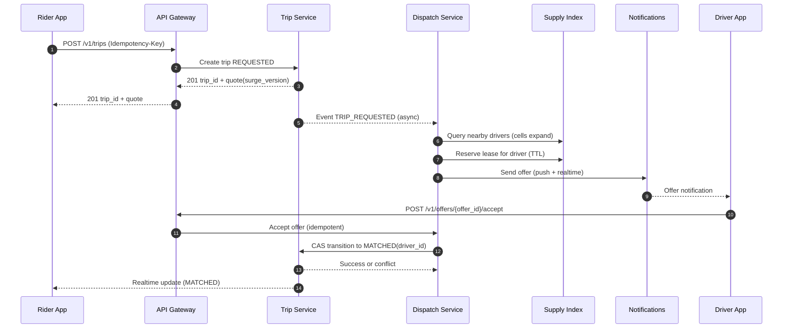

## Overview

Ride-hailing dispatch is a real-time marketplace that continuously matches two moving populations—riders and drivers—under strict service latency constraints, unreliable mobile networks, and adversarial conditions (fraud, GPS noise, churn). The core challenge is not “find nearest driver”, but executing a correct, low-latency, high-QPS matching workflow while handling concurrency (double-offers), partial failures, idempotency, and eventual consistency in location data.

A production-grade design separates:
1. **Fast, ephemeral geospatial supply index** for candidate discovery (tolerant to staleness).
2. **Durable trip state machine** for correctness, auditability, and reconciliation (strong per-trip consistency).
3. **Asynchronous event pipeline** for pricing, ETA, notifications, analytics, and experimentation.

Dispatch becomes a bounded-time workflow with explicit timeouts, short-lived leases, idempotent APIs, and a single authoritative source of truth for trip state transitions.

## Requirements

### Functional Requirements
- Rider requests a ride with pickup/dropoff, product (X/XL/…​), and payment method.
- System returns a **quote** (ETA + price range + surge version) and creates a **trip request**.
- System matches a rider to an eligible driver based on proximity/ETA, constraints (vehicle type, capacity, accessibility), and marketplace policies.
- Driver receives an offer and can accept/decline; system retries on timeout or rejection.
- Trip lifecycle management with reason codes and audit: `REQUESTED → OFFERING → MATCHED → ENROUTE → ARRIVED → IN_TRIP → COMPLETED/CANCELED`.
- Real-time driver location ingestion and live trip updates to rider/driver (ETA, driver position, state changes).
- Surge pricing by geo-region: compute multipliers and attach to quotes; enforce at trip start with a recorded version.
- Cancellations and fees: policy evaluation with grace periods and no-show rules.
- Compliance hooks: immutable event log for state transitions and financial references.

### Non-Functional Requirements

#### Scale (Targets)
Assume a large global service with city-level peaks:
- **DAU**: 20M
- **Peak concurrent sessions** (riders + drivers): 2M
- **Online drivers**: 1M (global peak)
- **Driver location updates**: average 0.2 Hz accepted (rate-limited/deduped), bursts up to 1 Hz in some cities  
  - Target accepted throughput: **200K updates/sec** global peak
- **Ride requests**: **10K requests/sec** global peak; top metro **2K/sec**
- **Trip state transitions**: ~8–20 durable events/trip (request, offers, accept, cancel reasons, status changes)  
  - Peak durable writes: **50K events/sec** (global), concentrated per region/city

#### Latency (SLOs)
Separate “service latency” from “human-in-the-loop” time:
- **Quote (price + ETA)**: P50 **150ms**, P99 **800ms** (region-local)
- **Time to first offer sent** (server-side): P50 **150ms**, P99 **400ms**
- **End-to-end time-to-match** (includes driver response): P50 **5–15s**, P90 **30s** (varies by supply/demand; product-specific)
- **Driver location ingest → queryable in index**: P50 **100ms**, P99 **500ms**

#### Availability (Targets)
- **Dispatch critical path** (quote + offer send): **99.99%** per region (multi-AZ)
- **Trip state machine storage**: **99.99%** per region (multi-AZ)
- **Degraded mode**: when non-critical dependencies fail, continue offering with reduced ranking quality rather than failing closed.

#### Consistency
- **Trip state**: strongly consistent per trip (linearizable transitions; single authoritative writer per trip or CAS)
- **Driver location / supply index**: eventual consistency; staleness tolerance **2–5s**; TTL-based expiry
- **Surge**: eventually consistent by zone; served as **versioned snapshots** for explainability

#### Durability
- **Trip records & financial references**: RPO ~0 within a region via synchronous multi-AZ writes; durable audit trail
- **Raw telemetry/location pings**: best-effort acceptable; small loss tolerated (bounded by monitoring)

### Constraints & Assumptions
- Region-local dispatch to avoid cross-region latency; multi-region used for read-mostly experiences and disaster recovery.
- Operating stack: Kafka/Pulsar, Redis, Postgres/CockroachDB, and a stream processor (Flink/Spark).
- Mobile networks unreliable; clients retry; all write APIs must be idempotent.
- Retention: trip events retained for years (jurisdiction dependent); PII encrypted; GDPR deletion workflows for rider data except legally required financial records.

## Architecture

### High-Level Diagram

```mermaid
flowchart LR
  subgraph Clients
    R[Rider App]
    D[Driver App]
  end

  subgraph Edge
    GW[API Gateway]
    AUTH[Auth + Rate Limits]
    WS[Realtime Gateway\n(WebSocket/SSE)]
  end

  subgraph Core[Core Services]
    TRIP[Trip Service\n(State Machine)]
    DISP[Dispatch Service\n(Offer Workflow)]
    IN[Driver Location Ingest]
    SUP[Supply Index\n(Geo + Availability)]
    ETA[ETA Service]
    PRICE[Pricing/Surge Service]
    POL[Policy Service\n(Cancel/Fees)]
    NOTIF[Notifications\n(Push/SMS/In-app)]
  end

  subgraph Data[Data Stores]
    DB[(Trip DB)]
    REDIS[(Redis / KV)]
    BUS[(Event Bus)]
    DLQ[(DLQ)]
  end

  subgraph Analytics[Async/Offline]
    STREAM[Stream Processor]
    WH[(Warehouse/Lake)]
  end

  R --> GW --> AUTH
  D --> GW --> AUTH
  R <---> WS
  D <---> WS

  AUTH --> TRIP
  AUTH --> DISP
  D --> IN --> SUP
  DISP --> SUP
  DISP --> ETA
  DISP --> PRICE
  DISP --> NOTIF
  TRIP --> DB
  TRIP --> BUS
  DISP --> BUS
  BUS --> STREAM --> WH
  BUS --> DLQ
  TRIP --> POL
```

### Why This Split Works
- **Speed**: the supply index is optimized for low-latency “nearby drivers” queries and high write rate.
- **Correctness**: the Trip Service is the authoritative state machine and the only place where “who is matched to whom” becomes durable truth.
- **Resilience**: most computations (surge aggregation, analytics, experimentation, some ETA features) run asynchronously and don’t inflate the offer latency SLO.
- **Operability**: ephemeral stores can be rebuilt from streams; durable state is auditable and recoverable.

## Components

### Driver Location Ingest

**Responsibilities**
- Accept high-rate GPS pings from drivers.
- Authenticate, validate, normalize coordinates; apply dedupe/backpressure.
- Update the real-time supply index with TTL semantics.

**Key Design Decisions**
- Prefer **bounded degradation**: drop/shed telemetry rather than destabilizing dispatch.
- Enforce per-driver rate limits (token bucket) and dedupe by movement threshold (e.g., update only if cell changes or distance > X meters).
- Reject obviously invalid GPS (impossible speed, jumps, stale timestamps).

**Implementation Notes**
- gRPC/HTTP ingest tier behind L7 load balancer.
- Partition processing by `driver_id` hash for cache locality.
- Optional: publish raw pings to an async topic for offline map-matching/fraud detection; do not block dispatch on it.

**SLO/Sizing**
- Accept peak **200K updates/sec** globally with per-region isolation.
- Payload size target: < 500 bytes average; compress at edge if needed.

### Supply Index (Geospatial + Availability)

**Responsibilities**
- Serve “eligible drivers near pickup” queries with very low latency.
- Track ephemeral driver availability with TTL-based expiry.

**Key Design Decisions**
- Use H3 (or geohash) cell indexing with bounded expansion:
  - Start at a resolution appropriate for city density (e.g., **H3 r9 ~ 174m edge**, **r8 ~ 460m**).
  - Expand ring-by-ring until enough candidates found or a max radius reached.
- Store only what is needed for discovery and coarse ranking:
  - location/cell, last_seen, product flags, availability state
  - authoritative driver/profile and compliance constraints come from cached snapshots or downstream checks

**Technology Choice**
- Redis Cluster (or Aerospike) as an ephemeral index:
  - `cell:{h3}:{product}` → ZSET of `driver_id`, score = `last_seen_epoch`
  - `driver:{driver_id}` → HASH: cell, lat/lng, products, availability, last_seen
- Critical: updates must move drivers between cells atomically to avoid double-counting (use Lua script).

**Hot Key & Density Controls**
- Cap members per cell (e.g., keep freshest **5k** drivers) to bound memory and query cost.
- For very dense cells, use **secondary sharding** (e.g., `cell:{h3}:{product}:{0..N-1}`) and query multiple shards in parallel.

### Dispatch Service (Matching + Offer Workflow)

**Responsibilities**
- Discover candidates via the supply index.
- Rank/filter drivers using ETA, constraints, and policies.
- Execute an offer workflow with timeouts, retries, and bounded fanout.

**Key Design Decisions**
- Model matching as a workflow per trip request:
  - deterministic state: attempt number, candidate cursor, backoff
  - timeouts: offer TTL, retry backoff, max attempts
- Prevent double-offers with **short-lived leases**:
  - best-effort reservation in Redis to reduce conflicts
  - authoritative finalization via Trip Service conditional transition

**Offer Workflow (Typical)**
1. Fetch nearby candidates from supply index.
2. Filter (availability, product, driver constraints).
3. Rank top-N (e.g., **N=30–80**) using fast heuristics first; call ETA only for top-K if needed.
4. Reserve driver lease for **8–12s**; send offer (push + realtime channel).
5. On accept, finalize match via Trip Service CAS; on reject/timeout, release and continue.

**Resiliency**
- If ETA service is slow/unavailable, fall back to distance-based ranking.
- If pricing snapshot unavailable, fall back to last-known with max-age and guardrails.

**Technology Choice**
- Stateless dispatch workers + Redis for leases + event bus for workflow events.
- Optional: a workflow engine (e.g., Temporal) for durable retries and visibility at scale; otherwise implement a lightweight internal workflow with careful idempotency.

### Trip Service (Authoritative State Machine)

**Responsibilities**
- Own the canonical trip record and enforce valid transitions.
- Provide query APIs for current status and trip history.
- Emit immutable domain events for audit and downstream consumers.

**Key Design Decisions**
- Strong per-trip consistency using one of:
  - single-writer per trip (workflow ownership), or
  - optimistic concurrency with `version` and conditional updates (`WHERE trip_id=? AND version=?`)
- Use an **outbox pattern** to reliably publish events to Kafka/Pulsar without losing or duplicating state transitions.

**Technology Choice**
- Postgres (partitioned) or CockroachDB (strong consistency + easier multi-AZ story).
- Events: Kafka/Pulsar with schema registry.

**State Machine Invariants**
- Exactly one terminal state: `COMPLETED` or `CANCELED`.
- A driver can only become durable `MATCHED` if the trip is in an offerable state and the `driver_id` is unset (CAS).

### Pricing/Surge

**Responsibilities**
- Compute multipliers per pricing zone and serve low-latency quote inputs.
- Attach a `surge_version` to quotes for explainability and reconciliation.

**Key Design Decisions**
- Compute surge from aggregated signals (request rate, available supply, acceptance rate) per zone (e.g., **H3 r7–r8**).
- Apply smoothing and guardrails:
  - exponential smoothing window (e.g., 30–120s)
  - caps by city/product; rate-of-change limits
- Serve **versioned snapshots** (e.g., `zone_id + timestamp`) and include `max_age_seconds`.

**Technology Choice**
- Stream processor consumes request/availability events; snapshot written to Redis/KV.
- Quote path reads latest snapshot; falls back to last-known within max age.

## Data Model

### Trip Storage (Relational)

**`trips`**
- `trip_id` (UUID, PK)
- `rider_id` (UUID, index)
- `driver_id` (UUID, nullable, index)
- `status` (enum)
- `pickup_lat` / `pickup_lng` (double)
- `dropoff_lat` / `dropoff_lng` (double)
- `product` (text)
- `region` (text, index)
- `requested_at` (timestamp)
- `updated_at` (timestamp)
- `version` (bigint) — optimistic concurrency
- `quote_id` (UUID)
- `surge_multiplier` (numeric)
- `surge_version` (text)
- `cancel_reason` (text, nullable)

**`trip_events`** (immutable, append-only)
- `event_id` (UUID, PK)
- `trip_id` (UUID, index)
- `type` (text) — e.g., `TRIP_REQUESTED`, `OFFER_SENT`, `DRIVER_ACCEPTED`, `TRIP_CANCELED`
- `created_at` (timestamp)
- `actor` (text: rider/driver/system)
- `payload` (jsonb)
- `idempotency_key` (text, unique per `(trip_id, type, idempotency_key)`)

**`idempotency_keys`** (edge idempotency for write APIs)
- `scope` (text) — e.g., `rider:{rider_id}`
- `key` (text)
- `request_hash` (text)
- `response_blob` (jsonb)
- `created_at` (timestamp)
- Unique: `(scope, key)`

**Outbox (recommended)**: `trip_outbox` table with `(event_id, trip_id, payload, created_at, published_at)` to ensure “DB commit + event publish” reliability.

### Ephemeral Data (Redis / KV)

- `cell:{h3}:{product}` → ZSET members `driver_id`, score = `last_seen_epoch`
- `driver:{driver_id}` → HASH: `cell`, `lat`, `lng`, `products`, `availability`, `last_seen`
- `reserve:{driver_id}` → string `trip_id` with TTL **8–12s**
- `offer:{offer_id}` → HASH: `trip_id`, `driver_id`, `expires_at`, `status` with TTL
- `trip_cache:{trip_id}` → current trip state snapshot (TTL **30–60s**) for polling/realtime fanout

## Data Flow

### Matching (Request → Offer → Match)



### Surge Computation (Async)

```mermaid
flowchart TB
  REQ[Trip Requested Events] --> BUS[(Event Bus)]
  AV[Driver Availability/Location Events] --> BUS
  BUS --> SP[Stream Processor]
  SP --> AGG[Aggregate per Zone\n(demand, supply, accept rate)]
  AGG --> SMOOTH[Smoothing + Guardrails]
  SMOOTH --> SNAP[Write Snapshot\n(zone_id, version, multiplier)]
  SNAP --> KV[(Redis/KV)]
  KV --> QUOTE[Quote Path Reads]
```

## API Design

### Create Trip (Quote + Request)
`POST /v1/trips`
- Headers:
  - `Idempotency-Key: <uuid>`
- Request:
```json
{
  "pickup": {"lat": 37.775, "lng": -122.418},
  "dropoff": {"lat": 37.789, "lng": -122.401},
  "product": "uberx",
  "payment_method_id": "pm_123"
}
```
- Response `201`:
```json
{
  "trip_id": "t_456",
  "status": "REQUESTED",
  "quote": {
    "currency": "USD",
    "estimated_fare_min": 12.30,
    "estimated_fare_max": 15.80,
    "surge_multiplier": 1.3,
    "surge_version": "h3r7:8a2a1072b59ffff:2025-12-17T10:20:30Z",
    "eta_seconds": 240,
    "quote_expires_at": "2025-12-17T10:22:00Z"
  }
}
```
- Errors:
  - `409` idempotency key reused with mismatched body
  - `422` invalid coordinates/product
  - `429` rate limited
- Idempotency:
  - store `(scope=rider:{rider_id}, key) -> cached response` for **24h**

### Driver Location Update
`POST /v1/drivers/me/location`
- Request:
```json
{
  "lat": 37.774,
  "lng": -122.419,
  "heading": 120,
  "speed_mps": 8.0,
  "timestamp_ms": 1734430830000
}
```
- Response `202`
- Notes:
  - accept out-of-order within a small window; reject stale timestamps beyond tolerance
  - clamp accepted frequency; dedupe by cell/movement threshold

### Offer Response (Driver)
`POST /v1/offers/{offer_id}/accept`  
`POST /v1/offers/{offer_id}/decline`
- Response `200`:
```json
{
  "offer_id": "o_789",
  "trip_id": "t_456",
  "status": "MATCHED"
}
```
- Idempotency:
  - `offer_id` is unique; repeated accept returns the same result

### Trip Status
`GET /v1/trips/{trip_id}`
- Response includes:
  - `status`, timestamps, matched driver (redacted), current ETA, cancellation policy summary

### Cancel Trip
`POST /v1/trips/{trip_id}/cancel`
- Headers:
  - `Idempotency-Key: <uuid>`
- Request:
```json
{"reason":"changed_mind"}
```
- Notes:
  - server evaluates fees and returns an explicit cancellation outcome (fee/no-fee + explanation)
  - idempotency required to avoid double fee assessment

### Realtime Updates (Recommended)
- WebSocket/SSE channel keyed by authenticated user:
  - Trip state changes (`MATCHED`, `ARRIVED`, `IN_TRIP`, `COMPLETED`)
  - Driver location (during active trip only; privacy-guarded)
  - Offer updates for driver

## Scaling & Performance

### Capacity Planning (Rule-of-Thumb)
- **Location ingest**: 200K updates/sec globally  
  - Use regional ingest; enforce per-driver limits; prefer shedding telemetry over queueing indefinitely.
- **Supply index**: read-heavy at match time, write-heavy continuously  
  - bound query work via ring expansion, top-N caps, and TTL expirations.
- **Trip DB**: durable writes for state changes  
  - keep event writes append-only; use partitioning by time + region; strict connection pooling.

### Bottlenecks & Mitigations
- **Write amplification in supply index**
  - Dedupe updates; update only on meaningful movement; batch/pipeline Redis writes; cap per cell.
- **Hot cells in dense metros**
  - Multi-resolution expansion; secondary sharding for dense cells; per-city isolation (separate Redis clusters).
- **Offer fanout and timeout storms**
  - bounded candidate list; exponential backoff; circuit breakers; adaptive widening when acceptance rate drops.
- **Dependency tail latency (ETA/pricing)**
  - strict timeouts; hedged requests where appropriate; fall back to heuristics.

### Partitioning Strategy
- Primary: `region` (e.g., `us-west-2`, `eu-central-1`) chosen from pickup location
- Secondary: `city_id` for operational isolation and blast-radius reduction
- Geospatial: H3 cell id (resolution chosen by density; common starting point **r9**, expand outward)

### Caching
- Driver eligibility snapshot in Dispatch (local LRU) TTL **5–15 min**; invalidated by driver profile events.
- Surge snapshot in Redis/KV TTL **60s** with explicit `version`; clients tolerate version changes.
- Current trip state cache TTL **30–60s** to reduce DB reads; realtime updates preferred over polling.

## Trade-offs & Alternatives

### Trade-offs (Chosen Design)
1. **Redis/KV supply index vs durable geo-database**
   - Chosen: Redis-based ephemeral index for ultra-low latency and high write throughput.
   - Cost: index is not authoritative; requires TTLs, caps, and careful atomic updates.
   - Why: dispatch tolerates staleness; correctness is enforced in the Trip Service.

2. **Strong per-trip consistency vs global transactional guarantees**
   - Chosen: linearizable transitions per trip + lease/CAS pattern for driver uniqueness.
   - Cost: “driver matched to only one trip” is probabilistic at reservation time and finalized by CAS (conflicts possible but resolved).
   - Why: global transactions across trips/drivers are expensive and create latency/coupling at scale.

3. **Asynchronous workflow vs synchronous “match in request thread”**
   - Chosen: create trip durably first; match via async workflow with retries/timeouts.
   - Cost: more moving parts (timeouts, DLQs, visibility tooling).
   - Why: prevents cascading failures and allows backpressure without losing durability.

4. **Push-first offers vs websocket-only**
   - Chosen: multi-channel (push + in-app realtime) for deliverability and speed.
   - Cost: duplicated delivery paths and dedupe logic.
   - Why: push can be delayed or suppressed; in-app requires connectivity; combined improves acceptance.

### Alternative Approaches
- **Dispatch-owned in-memory index fed by Kafka**
  - Pros: extremely low latency; avoids Redis hotkeys.
  - Cons: complexity in rebuild/rebalance, warmup, and correctness under partial partitions.
- **Specialized geo engines (Elasticsearch/Mongo geo)**
  - Pros: rich geo queries and filters.
  - Cons: often worse for heavy write rates and strict latency SLOs than purpose-built indexes.
- **Workflow engine (Temporal) for matching**
  - Pros: durable retries, observability, and simplified state handling.
  - Cons: operational footprint; requires careful scaling and partitioning.

## Failure Modes & Mitigations

### Failure Scenarios (Examples)

1. **Supply index partial outage or elevated latency**
   - Impact: candidate discovery fails; time to first offer degrades.
   - Detection: Redis error rate, command latency, hotkey alarms.
   - Mitigation:
     - fall back to cached recent candidates (bounded freshness)
     - widen search radius more slowly; degrade ranking quality
     - multi-AZ Redis with fast failover; isolate cities to reduce blast radius
     - shed new requests if match SLO is unachievable rather than thrash

2. **Duplicate match race (two dispatchers offer the same driver)**
   - Impact: driver sees multiple offers; rider confusion.
   - Detection: CAS conflicts in Trip Service; driver reports multiple active offers.
   - Mitigation:
     - atomic reservation lease in Redis (Lua script)
     - Trip Service CAS rejects second match; Dispatch sends cancel for stale offers
     - enforce “one active offer” per driver in driver app UI with server reconciliation

3. **Trip DB write degradation**
   - Impact: state transitions stall; cancellations/completions delayed; revenue and trust impact.
   - Detection: DB write p99, connection pool saturation, replication health.
   - Mitigation:
     - prioritize critical transitions; shed non-critical writes (e.g., optional metadata)
     - apply bounded queues with backpressure; return explicit “try again” vs silent timeouts
     - multi-AZ failover; automated incident playbooks

4. **Notification delays or provider outage**
   - Impact: offers time out; match rate drops.
   - Detection: push provider latency, delivery/ack rates, accept rate drop.
   - Mitigation:
     - multi-channel delivery (push + in-app realtime)
     - adapt offer TTL and candidate pool size
     - circuit breaker on failing provider; route to secondary channels

5. **Stream processor lag (surge snapshots stale)**
   - Impact: stale pricing; unfair marketplace; increased cancellations.
   - Detection: consumer lag, snapshot age, unusual fare deltas.
   - Mitigation:
     - serve last-known snapshot with `max_age_seconds`; clamp multipliers
     - alert and auto-restart; degrade to conservative multipliers if beyond max age

### Disaster Recovery
- Targets:
  - **RTO**: 30 minutes per region for dispatch; 60 minutes for analytics
  - **RPO**: ~0 for Trip DB within region; minutes acceptable for telemetry streams
- Strategy:
  - Multi-AZ synchronous writes for Trip DB; continuous WAL archival + tested restores
  - Event bus retention **3–7 days** to replay and rebuild derived stores
  - Regional failover:
    - route new requests to nearest healthy region only if latency and compliance allow
    - prioritize allowing in-progress trips to complete; degrade new trip acceptance if necessary

## Operations

### Observability (Golden Signals + Marketplace KPIs)
- Dispatch:
  - time to first offer (p50/p99), time-to-match (p50/p90), match success rate
  - reservation conflict rate, offer timeout rate, accept/decline rate
- Supply index:
  - ops/sec, command latency, memory usage, keyspace growth, hotkey detection
  - TTL expiry rates; cell cardinality distribution (density)
- Trip state machine:
  - transition error rate (invalid transitions vs CAS conflicts)
  - DB write p99, connection pool saturation, replication health
- Pricing:
  - snapshot freshness, zone coverage, multiplier distribution vs guardrails
  - quote-to-complete deltas and cancellation correlations

### Alerting (Examples)
- time to first offer p99 > **600ms** for 5m
- match success rate drops > **X%** vs baseline for 10m (per city)
- Redis error rate > **1%** for 1m (per cluster)
- Trip DB write p99 > **200ms** for 5m
- surge snapshot age > **60s** for 2m

### Deployment & Release
- Canary + gradual rollout per city/region; feature flags for ranking/pricing experiments.
- Backward-compatible APIs; schema migrations with expand/contract.
- Rollback:
  - stateless services: immediate deploy revert
  - DB: avoid destructive migrations; keep old columns until fully migrated; run migrations off-peak

### Security & Compliance (Minimum Bar)
- mTLS service-to-service; least-privilege IAM for data stores.
- Encrypt PII at rest; field-level encryption for sensitive identifiers where appropriate.
- Audit logging for state transitions and administrative actions.
- Rate limits and abuse detection for:
  - rider request spam, driver location spoofing, offer manipulation

## References & Further Reading
- H3: https://h3geo.org/
- Lyft Engineering blog (marketplace, ETA, dispatch): https://eng.lyft.com/
- “Designing Data-Intensive Applications” (Kleppmann) — consistency, streams, idempotency
- Kafka/Pulsar docs — consumer lag, ordering, idempotent producers, DLQs
- Temporal docs — durable workflows, retries, and visibility for distributed systems