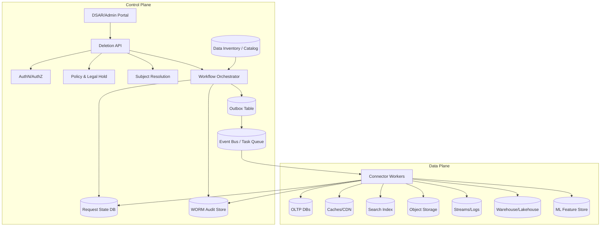
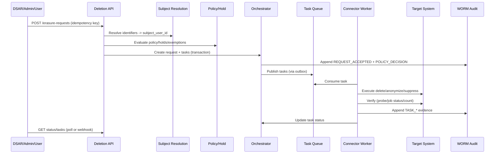

## Overview

The “Right to be Forgotten” (RTBF) is hard because user data is rarely stored in one place. It spreads across OLTP databases, caches, search indexes, object storage, stream processors, logs, analytics warehouses, ML feature stores, and backups—often replicated across regions and copied into downstream systems. A production-grade RTBF solution must:

- Delete or irreversibly anonymize data across heterogeneous systems.
- Prevent erased data from resurfacing (especially from backups and derived datasets).
- Provide auditability: who requested erasure, why it was allowed/blocked, what was done, and evidence that it happened.
- Be safe for production systems: rate-limited, retryable, idempotent, and resilient to partial failures.

The core approach is to treat erasure as a **durable, orchestrated workflow** driven by a **data inventory** (what systems store which user data and how to delete it). Each target system is integrated through a **deletion connector** that implements a common contract (execute + verify + evidence). For immutable/slow-to-purge stores (append-only logs, lakehouse files, backups), the design combines:

- **Immediate logical suppression** (user data no longer served or queryable),
- **Bounded eventual physical purge** (compaction/VACUUM/TTL windows),
- **Crypto-shredding** (destroy per-user keys) where feasible to guarantee irrecoverability.

## Requirements

### Functional Requirements

- Accept RTBF requests for a subject (internal `user_id` and/or external identifiers) with requester identity and reason (DSAR, account deletion, admin action).
- Authenticate and authorize requesters; support admin and user-initiated flows with appropriate proof of identity.
- Enforce eligibility and policy:
  - Jurisdiction-aware rules (GDPR/UK GDPR/CCPA).
  - Legal holds (fraud, investigations).
  - Statutory retention exemptions (billing/tax/chargebacks).
  - Scoped deletion (e.g., delete profile + activity but retain invoices).
- Discover all storage locations for the subject using a **data inventory** and route work to the correct connectors.
- Execute deletion/anonymization across:
  - Primary databases and replicas,
  - Caches and CDNs,
  - Search indexes,
  - Object storage (user uploads, derived artifacts),
  - Streaming/logging systems (topics, sinks),
  - Analytical warehouses/lakehouses,
  - ML feature stores and derived datasets.
- Provide status tracking:
  - Request-level state (pending/running/blocked/completed),
  - Per-target task state, timestamps, and evidence references.
- Guarantee idempotent processing and deduplicate repeated requests (idempotency keys + payload hash).
- Produce immutable, tamper-evident audit records suitable for compliance review and security investigations.
- Support incremental rollout: integrate new systems over time without redesigning the pipeline.

### Non-Functional Requirements

#### Scale (example production target)

- Users: 100M total, 20M DAU.
- Deletion requests:
  - Average: 1M/day (~11.6 RPS sustained),
  - Peak day: 5M/day (~57.9 RPS sustained),
  - Peak intake burst: 500 RPS (e.g., incidents, migrations, UI bugs).
- Fanout: 20–80 target systems per request.
  - Tasks/day at peak: 100M–400M (≈ 1.2k–4.6k tasks/sec).
- Analytics footprint: 5–20 PB; lakehouse file compaction windows in hours–days.

#### Latency & SLOs

- Request acceptance (API): P50 50ms, P99 250ms.
- Status read (API): P50 20ms, P99 100ms.
- Completion SLOs (end-to-end):
  - 99% within 24 hours,
  - 99.9% within 7 days (to accommodate compaction/warehouse/backups/partner SLAs).
- Compliance deadline:
  - Default `deadline_at` aligned to jurisdiction (e.g., 30 days) with pause/extension reasons captured in audit.

#### Availability & Durability

- API and status endpoints: 99.99% (multi-AZ, stateless frontends).
- Orchestration state store: RPO ~ 0 (synchronous replication in-region; multi-region DR).
- Task execution: at-least-once delivery with durable retry; progress preserved across worker restarts.

#### Consistency Model

- Strong consistency for:
  - Request state transitions,
  - Task leasing/claiming,
  - Audit event append.
- Eventual consistency for:
  - Physical deletion in downstream systems,
  - Search reindexing and cache propagation,
  - Warehouse file rewrite/compaction.

### Constraints & Assumptions

- Some records must be retained (e.g., invoices) but may require **pseudonymization** (remove direct identifiers while keeping aggregated financial records).
- Some stores are immutable (append-only logs) or operationally expensive to rewrite; physical purge may be delayed.
- Multi-region active-active for user-facing products; RTBF control plane can be active-active with careful idempotency and a single-writer per request.
- Ownership is federated: product teams own their data systems; platform team provides connectors, policy, orchestration, and audit.

## Architecture

### High-Level Architecture



### Key Principles

- **Control plane vs data plane**: intake and state are fast and highly available; deletion work is asynchronous and durable.
- **Inventory-driven**: the data inventory is the authoritative “where and how to delete” map; it prevents missing systems.
- **Connector contract**: every target system implements execute + verify + evidence in a uniform way.
- **At-least-once + idempotency**: task execution can repeat without causing incorrect behavior.
- **Evidence over assertions**: record verifiable artifacts (job IDs, counts, query hashes) rather than “we think we deleted it.”
- **Prevent resurfacing**: treat backups and derived stores explicitly (restore-time reaper, compaction SLOs, crypto-shred).

## Components

### DSAR/Admin Portal

**Responsibility**: Human workflow for request submission, identity proofing, and exception handling.

- Supports user-submitted DSAR and internal admin actions.
- Captures jurisdiction, reason, and supporting documentation.
- Provides a timeline view from the audit log (read-only projection).

### Deletion API

**Responsibility**: Accept requests, authenticate/authorize, validate input, start workflows, serve status.

- Returns `202 Accepted` with `request_id` quickly; long-running work is asynchronous.
- Requires an `Idempotency-Key` per requester to dedupe retries and repeated submissions.
- Stores a canonical payload hash to detect idempotency key misuse.

**Implementation notes**:
- Stateless service behind an L7 load balancer.
- Rate-limit by requester and tenant; support “burst mode” for incident remediation.

### Subject Resolution Service

**Responsibility**: Map external identifiers to internal subject identifiers (and resolve merges/splits).

- Handles cases where the request provides email/phone/device ID rather than `user_id`.
- Produces a stable `subject_user_id` (and optionally additional linked IDs) used by connectors.
- Must be auditable: resolution inputs and outputs are recorded.

### Policy & Legal Hold Service

**Responsibility**: Decide whether and what to delete now, what must be retained, and what must be suppressed.

- Outputs:
  - `decision`: ALLOW | BLOCK | PARTIAL (exemptions),
  - `exemptions[]`: what cannot be deleted and why (legal basis),
  - `required_actions[]`: e.g., “anonymize invoices,” “suppress from analytics queries,” “crypto-shred keys,”
  - `policy_version` and `rule_trace_id` for audit reproducibility.

**Implementation notes**:
- Policy-as-code (e.g., OPA) with versioning and audit trails.
- Integrates with investigation/hold systems (fraud, trust & safety, legal).

### Data Inventory / Catalog

**Responsibility**: Source of truth for data locations, identifier types, and deletion/verification methods.

Each entry describes:

- `target_system` (owner team, environment, criticality),
- `data_domains` (profile, content, events, billing, etc.),
- supported identifiers (`user_id`, hashed email, device ID),
- deletion mode(s): HARD_DELETE | ANONYMIZE | CRYPTO_SHRED | PURGE_CACHE | TOMBSTONE | SUPPRESS_ONLY,
- verification mode(s): COUNT_CHECK | PROBE_QUERY | JOB_STATUS | FILE_REWRITE_CHECK,
- dependencies/order (e.g., purge sessions cache before profile DB),
- rate limits and concurrency caps,
- SLO class (fast: minutes; slow: hours/days),
- oncall/ownership metadata for escalation.

This can be a Git-backed config with validation plus a runtime service for lookup and caching.

### Workflow Orchestrator

**Responsibility**: Expand a request into tasks, manage dependencies, retries, backoff, and completion criteria.

- Creates per-target tasks with a deterministic task key to ensure idempotent task creation.
- Uses leases for task claiming (prevents duplicate concurrent execution).
- Applies per-target rate limits to protect production systems.
- Tracks:
  - request lifecycle,
  - per-task lifecycle,
  - timeouts and escalation to owning teams.

**Technology choices**:
- Durable workflow engines (Temporal/Cadence) are ideal for complex retries and long-running processes.
- A DB-backed orchestrator is viable with:
  - strict state machine,
  - leasing,
  - outbox pattern for reliable task publication.

### Event Bus / Task Queue

**Responsibility**: Durable, scalable delivery of tasks to connector workers.

- At-least-once delivery is sufficient (idempotent tasks).
- Per-connector topics/queues allow isolating noisy or slow systems.
- Dead-letter queues capture poison messages and non-retryable failures.

### Connector Workers (Deletion Connectors)

**Responsibility**: Execute deletion in a specific target system and report evidence.

Common connector contract:

- `prepare(subject, scope) -> plan` (optional): compute keys/partitions/paths and validate prerequisites.
- `execute(plan) -> execution_result`: perform delete/anonymize/suppress.
- `verify(execution_result) -> verification_result`: confirm effect (within system limits).
- `emit_evidence(...)`: write evidence artifact and return `evidence_ref`.

Deletion modes by system type:

- **OLTP DBs**: transactional deletes; or anonymize PII columns while retaining business records.
- **Caches/CDN**: targeted key deletion; “user epoch” key version bump for broad invalidation.
- **Search**: delete by doc ID; verify by probe queries; handle reindex pipelines.
- **Object storage**: delete objects; for derived artifacts, recompute or delete indices; consider per-user encryption keys.
- **Streams/logs**: tombstone events (compacted topics), suppress in sinks, or rotate/shred per-user keys for encrypted payloads.
- **Warehouses/lakehouses**: partition-aware deletes plus compaction/VACUUM tasks; maintain “suppression list” to block query-time access until physical purge completes.

### Audit & Evidence Store (WORM)

**Responsibility**: Immutable record of request, policy decisions, task execution, and evidence artifacts.

- Stored in WORM/retention-locked object storage (e.g., S3 Object Lock / GCS Bucket Lock).
- Append-only event log with **hash chaining** to make tampering detectable:
  - Each event includes `prev_event_hash` and `event_hash = H(prev_hash || event_payload)`.
- Store evidence metadata (job IDs, query hashes, counts, timestamps), not raw PII.

## Data Model

### Relational State (Postgres)

**`erasure_requests`**
- `request_id` (UUID, PK)
- `idempotency_key` (string, unique per `requester_id`)
- `requester_id` (string, indexed)
- `payload_hash` (bytea, indexed)
- `subject_user_id` (string, indexed, nullable until resolved)
- `subject_identifiers` (jsonb)
- `requested_scope` (jsonb)
- `jurisdiction` (string)
- `reason` (string)
- `policy_version` (string)
- `policy_decision` (enum: ALLOW|PARTIAL|BLOCK)
- `status` (enum: PENDING|RUNNING|BLOCKED|COMPLETED|COMPLETED_WITH_EXEMPTIONS|FAILED)
- `created_at`, `updated_at`, `deadline_at`
- `completed_at` (timestamp, nullable)

**`erasure_tasks`**
- `task_id` (UUID, PK)
- `request_id` (UUID, FK, indexed)
- `target_system` (string, indexed)
- `task_key` (string, unique; deterministic for idempotent creation)
- `operation` (enum: HARD_DELETE|ANONYMIZE|CRYPTO_SHRED|PURGE_CACHE|SUPPRESS|VACUUM|VERIFY_ONLY)
- `status` (enum: PENDING|RUNNING|SUCCEEDED|RETRYING|FAILED|SKIPPED)
- `attempt` (int)
- `lease_owner` (string, nullable)
- `lease_expires_at` (timestamp, nullable)
- `next_run_at` (timestamp)
- `evidence_ref` (string, nullable)
- `last_error_code` (string, nullable)
- `last_error` (text, nullable)
- `updated_at` (timestamp)

**`outbox_events`**
- `event_id` (UUID, PK)
- `aggregate_id` (UUID: `request_id`)
- `event_type` (string)
- `payload` (jsonb)
- `created_at` (timestamp)
- `published_at` (timestamp, nullable)

### Audit Event Schema (WORM object)

Each audit object is append-only (or stored as individual immutable objects):

```json
{
  "event_id": "uuid",
  "request_id": "uuid",
  "event_type": "TASK_SUCCEEDED",
  "ts": "2026-01-16T12:34:56Z",
  "actor": {"type":"SYSTEM","id":"rtbf-worker-warehouse"},
  "data": {
    "target_system": "warehouse",
    "operation": "DELETE+VACUUM",
    "execution": {"job_id":"bq-job-123", "affected_rows": 1823},
    "verification": {"probe_query_hash":"...", "result":"PASS"}
  },
  "prev_event_hash": "hex",
  "event_hash": "hex"
}
```

## API Design

### Create Erasure Request

`POST /v1/erasure-requests`

Headers:
- `Authorization: Bearer <token>`
- `Idempotency-Key: <opaque-string>`

Request:
```json
{
  "subject": {
    "user_id": "u_123",
    "identifiers": { "email": "user@example.com", "phone": "+12065550123" }
  },
  "scope": ["profile", "sessions", "content", "analytics"],
  "reason": "GDPR_ERASURE",
  "jurisdiction": "EU"
}
```

Response (`202 Accepted`):
```json
{
  "request_id": "6e5f3f3c-0e8d-4f19-9e4b-3aa7c6b1b9c2",
  "status": "PENDING",
  "deadline_at": "2026-02-15T12:00:00Z"
}
```

Error cases:
- `400` invalid payload/scope.
- `401/403` unauthorized/forbidden.
- `409` idempotency conflict (same key, different payload hash).
- `423` blocked by legal hold/policy (returns decision and exemptions).
- `429` rate-limited.

Idempotency rules:
- Same (`requester_id`, `Idempotency-Key`) returns the original `request_id`.
- If the payload hash differs, return `409`.

### Get Request Status

`GET /v1/erasure-requests/{request_id}`

Response:
```json
{
  "request_id": "6e5f3f3c-0e8d-4f19-9e4b-3aa7c6b1b9c2",
  "status": "RUNNING",
  "policy_decision": "PARTIAL",
  "exemptions": [
    {"domain":"billing", "reason":"STATUTORY_RETENTION", "until":"2033-01-01"}
  ],
  "progress": { "tasks_total": 42, "tasks_succeeded": 31, "tasks_failed": 1 },
  "updated_at": "2026-01-16T13:00:00Z"
}
```

### List Tasks (Pagination)

`GET /v1/erasure-requests/{request_id}/tasks?cursor=...&limit=100`

Response:
```json
{
  "tasks": [
    {
      "target_system": "user-db",
      "operation": "HARD_DELETE",
      "status": "SUCCEEDED",
      "evidence_ref": "audit/2026/01/16/6e5f.../task-1.json"
    }
  ],
  "next_cursor": "..."
}
```

### Retry Failed Tasks (Privileged)

`POST /v1/erasure-requests/{request_id}/retry`

- Re-enqueues only `FAILED` tasks after re-checking policy and holds.
- Emits an audit event for the retry action and the actor.

## Execution Workflow

### End-to-End Flow



### Completion Semantics

A request is marked:

- `COMPLETED` when all required tasks are `SUCCEEDED` or `SKIPPED` (with explicit policy rationale).
- `COMPLETED_WITH_EXEMPTIONS` when policy allows partial fulfillment (e.g., billing retained but identifiers anonymized).
- `BLOCKED` when legal hold prevents required actions; unblock requires explicit policy change and audit trail.
- `FAILED` only when the system cannot make progress (e.g., persistent internal errors) and escalation is required; do not use `FAILED` for ordinary downstream outages—use retries with backoff.

## Scaling & Performance

### Capacity Planning (Order-of-Magnitude)

At peak day (5M requests/day) with 20–80 targets per request:

- Tasks/day: 100M–400M
- Tasks/sec sustained: ~1.2k–4.6k
- If average connector execution time is 500ms and concurrency per worker is 50, each worker handles ~100 tasks/sec (roughly).
  - Fleet size on peak: ~12–50 workers per “average” connector class, but skew is expected (warehouses are slower; caches are faster).

### Bottlenecks & Mitigations

- **Fanout explosion**: inventory-driven scoping, deterministic task keys, batching per target (e.g., delete multiple tables in one job).
- **Warehouse delete/compaction cost**: partitioning by time + clustering by `user_id`, using suppression lists, scheduling compaction windows, and tracking a compaction SLO separately.
- **Hot state store**: shard by `request_id`, keep task updates small, and use append-only task events with a compacted projection.
- **Downstream rate limits**: per-connector concurrency caps, circuit breakers, and backpressure based on queue lag and error rates.

### Caching

- Cache only:
  - Status reads (5–15s TTL),
  - Data inventory lookups (minutes TTL),
  - Policy decisions within a request.
- Never treat caches as the source of truth for compliance; caches must be explicitly purged or invalidated via epochs.

## Consistency, Correctness, and “No Resurfacing”

### Idempotency & Exactly-Once Effects

- The system uses at-least-once delivery for tasks.
- Every connector must be idempotent:
  - Deletes use deterministic predicates (e.g., `WHERE user_id = ?`) and tolerate “already gone.”
  - Jobs are submitted with stable client tokens where supported (e.g., warehouse job idempotency).
- The orchestrator uses leases to avoid concurrent duplicate execution of the same task.

### Backups and Restore-Time Reappearance

Backups are the primary way erased data can reappear. Mitigations:

- **Restore-time reaper**: on any restore, replay all erasure requests since the backup snapshot time and re-apply deletions/suppressions before bringing systems online.
- **Per-user crypto-shredding** (where feasible): encrypt user blobs/PII with a per-user key; erasure deletes the key so restored bytes are unrecoverable.
- **Short retention for user-data backups** when legally permitted; longer retention for non-user operational state.
- **Drills**: periodic restore exercises that validate reaper correctness (record results in audit).

### Derived Data and Analytics

- Treat analytics as two-phase:
  1. **Immediate suppression** (deny-list / join against suppression table) so erased users are not queryable/servable.
  2. **Physical purge** via delete + compaction/VACUUM within the SLO window.

## Trade-offs & Alternatives

### Key Trade-offs

- **Asynchronous workflow vs synchronous cascades**
  - Chosen: async orchestration with durable retries.
  - Sacrificed: “instant” global deletion.
  - Why: long-tail systems (warehouses, backups) make synchronous guarantees unrealistic and operationally risky.

- **Central policy service vs distributed policy**
  - Chosen: centralized policy/legal hold with versioned rules.
  - Sacrificed: per-team autonomy and local optimizations.
  - Why: compliance requires consistent enforcement and explainable decisions across the company.

- **Evidence-based verification vs proof of absence**
  - Chosen: store tamper-evident evidence (job IDs, counts, hashes, probes).
  - Sacrificed: impossible guarantees (“prove a negative” across distributed systems).
  - Why: auditors assess process controls + evidence trails; cryptographic “absence proofs” are not practical here.

- **Physical purge everywhere vs suppression + eventual purge**
  - Chosen: suppression immediately where physical purge is expensive/slow.
  - Sacrificed: immediate byte-level removal in immutable stores.
  - Why: user-facing and compliance risk is served-by-default; suppression removes exposure quickly while purge follows operational windows.

### Alternative Approaches

- **Single global delete-by-key API used by all teams**
  - Pros: uniformity, simpler orchestration.
  - Cons: expensive migration; unrealistic for heterogeneous legacy environments.

- **Rely on TTL everywhere**
  - Pros: operationally simple.
  - Cons: violates RTBF timelines; does not address backups; poor auditability.

- **Crypto-shredding-first architecture**
  - Pros: strong irrecoverability guarantees for encrypted data.
  - Cons: hard to apply retroactively; not compatible with many search/analytics use cases without redesign.

## Failure Modes & Mitigations

### Failure Scenarios (Examples)

- **Worker crashes mid-delete**
  - Impact: task partially executed; status may be stale.
  - Detection: lease timeout / missed heartbeats.
  - Mitigation: idempotent operations + retry; connectors must handle “already deleted.”

- **Target system unavailable / aggressive rate limiting**
  - Impact: backlog growth; SLO risk.
  - Detection: connector error rate + queue lag + task age percentiles.
  - Mitigation: circuit breaker, exponential backoff, per-target throttles, escalation to owner team, and optional degradation (suppression first).

- **Data inventory is stale or incomplete**
  - Impact: data missed (worst-case compliance breach).
  - Detection: inventory coverage checks (data classification scans, schema registry hooks), periodic audits, and “unknown sink” alerts.
  - Mitigation: enforce onboarding gates for new systems (cannot store PII without inventory entry), automated discovery, and incident runbooks.

- **Warehouse delete runs but compaction/VACUUM not executed**
  - Impact: bytes remain in old files; potential exposure in raw file access.
  - Detection: missing compaction evidence; file rewrite metrics.
  - Mitigation: model compaction as a required task class with its own SLO; keep suppression active until compaction completes.

- **Backups reintroduce erased data after restore**
  - Impact: erased data resurfaces.
  - Detection: restore drills + automated post-restore scan/probe checks.
  - Mitigation: restore-time reaper, crypto-shredding, and strict restore procedures.

- **Audit store write failure**
  - Impact: loss of compliance evidence (unacceptable).
  - Detection: immediate alerts on any append failure.
  - Mitigation: treat audit append as part of the control plane’s critical path for state transitions; queue and retry with strong guarantees, but fail closed for request progression if evidence cannot be recorded.

- **Malicious operator attempts to alter records**
  - Impact: compliance fraud.
  - Detection: WORM retention lock, hash chain verification, access logs, anomaly detection.
  - Mitigation: separation of duties, least privilege, break-glass procedures, periodic independent exports for external audit.

### Disaster Recovery

- Targets:
  - Control plane RTO: 1 hour
  - Control plane RPO: ~0 (synchronous in-region replication)
  - Worker plane RTO: 4 hours (rebuild from queue; idempotent reprocessing)

- Strategy:
  - State DB: multi-AZ with WAL archiving; tested restores.
  - Task queue: replicated or recoverable from outbox/state.
  - Audit store: cross-region replication with retention lock; verify hash chain integrity periodically.

## Operations

### Monitoring & Alerting

Key SLIs:
- Intake: RPS, error rate, P99 latency.
- Orchestrator: state transition latency, outbox publish lag.
- Queue: lag per connector, oldest task age (P50/P95/P99).
- Completion: % completed within 24h / 7d; breach counts by connector/system.
- Audit: append success rate; hash chain verification failures.

Example alerts:
- P99 intake latency > 500ms for 5m.
- Any audit append failure > 0 for 1m (page).
- Oldest task age > 6h for “fast class” connectors.
- Daily SLO breach > 1% for 24h window.

### Security & Privacy Controls

- AuthN/AuthZ: OIDC/SAML for admins; strong identity proofing for DSAR flows.
- Least privilege: connector credentials scoped to deletion predicates only (row-level, prefix-level, or dataset-level where possible).
- Encryption: TLS in transit; KMS-managed encryption at rest for state and audit stores.
- Secret management: short-lived credentials, rotation, break-glass logging.
- Audit access: read-only, tightly controlled; export pipelines for external auditors.

### Deployment & Change Management

- Canary releases for API/orchestrator/workers.
- Version task payloads and connector contracts; allow parallel versions during rollout.
- Feature flags per target system to gradually enable deletions.
- Never mutate audit history; append corrective events if needed.

## References & Further Reading

- GDPR Article 17 (Right to erasure): https://gdpr-info.eu/art-17-gdpr/
- NIST Privacy Framework: https://www.nist.gov/privacy-framework
- Temporal (durable workflows): https://temporal.io/
- Kafka delivery semantics: https://kafka.apache.org/documentation/
- S3 Object Lock (WORM): https://docs.aws.amazon.com/AmazonS3/latest/userguide/object-lock.html
- Delta Lake VACUUM: https://docs.delta.io/latest/delta-utility.html#vacuum
- BigQuery table data deletion: https://cloud.google.com/bigquery/docs/managing-tables