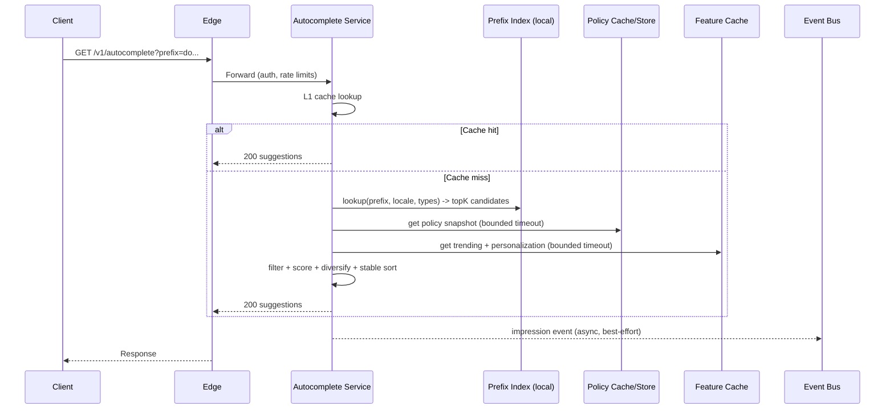

## Overview

Search autocomplete (typeahead) suggests relevant completions as a user types. It sits on the critical path of discovery: every keystroke can trigger a request, so the system must deliver **consistently low tail latency** while handling **bursty, highly skewed traffic** (hot prefixes) and producing high-quality ranked suggestions across multiple entity types (queries, users, hashtags, topics).

A production-grade solution splits serving into two stages:

1. **Candidate generation (fast, deterministic)**: prefix lookup in an in-memory index (e.g., FST/trie) returns a small candidate set.
2. **Ranking (fast, feature-based)**: lightweight scoring uses cached personalization and trending signals plus rule-based constraints (policy, diversity, type caps).

Most requests should be answered via **in-process caching** and **local memory lookups**, with tight timeouts and graceful degradation when dependencies (feature store, policy snapshots) are slow or unavailable.

---

## Requirements

### Functional Requirements

- Suggest completions for a typed prefix across multiple entity types: `QUERY`, `USER`, `HASHTAG`, `TOPIC`.
- Support locale/language awareness (normalization, tokenization, diacritics folding rules per locale).
- Personalize suggestions using user context (recent searches, follows/affinities, recency, session intent).
- Boost trending suggestions that can change within minutes, without destabilizing relevance.
- Return top `N` results (default 10), with deduping and stable ordering as the prefix grows.
- Enforce privacy/policy rules (blocked users, muted topics, restricted content) correctly and quickly.
- Log impressions and selections for analytics, ranking quality, and abuse detection.
- Degrade gracefully when personalization/trending/policy enrichment is unavailable.

### Non-Functional Requirements (SLOs)

- **Latency (server-side, per region)**:
  - p50 < 25ms
  - p95 < 50ms
  - p99 < 90ms
  - Hard timeout budget: 120ms (including dependency timeouts)
- **Availability (serving API)**: 99.99% monthly per region; global availability via multi-region routing.
- **Scale (example target)**:
  - 50M DAU, 8M peak concurrent sessions globally (mobile + web).
  - Average typing bursts: ~6 keystrokes per query, ~1–2 queries/session.
  - Peak autocomplete QPS (global): **150k–250k QPS** (skewed by time-of-day and events).
  - Logging ingest: **5–10×** serving QPS (impressions, accepts, downstream clicks).
- **Payload**: typical response < 20KB; enforce max 50KB.
- **Consistency**:
  - Trending + personalization features: eventual (seconds–minutes).
  - Policy/privacy enforcement: “effectively strong” for user safety actions (blocks/mutes), with rapid propagation and deny-by-default on uncertainty.
- **Durability**:
  - Analytics/logging: RPO ≤ 5 minutes, replayable pipelines.
  - Serving index: can tolerate stale artifacts up to ~15 minutes (quality impact only).

### Constraints & Assumptions

- Multi-region active-active serving (users routed to nearest healthy region).
- Streaming platform available (Kafka/Pulsar) and a stream processor (Flink/Kafka Streams).
- Avoid per-request heavy ML inference; keep scoring CPU-cheap.
- PII minimization: do not store raw queries tied to user identity beyond retention policy; store derived features and/or pseudonymous identifiers.

---

## Architecture

### High-Level Serving & Pipelines

```mermaid
flowchart LR
  %% Client to edge
  C[Client] --> E[Edge / CDN]
  E --> G[API Gateway]

  %% Serving region
  subgraph R[Region (Active-Active)]
    G --> S[Autocomplete Service]

    S --> L1[(In-Process Cache)]
    S --> IDX[(Prefix Index\nFST/Trie in memory)]
    S --> FEAT[(Feature Cache\nRedis/KeyDB)]
    S --> POL[(Policy Snapshot Cache\n+ Policy Store)]
    S --> OBS[(Async Log Buffer)]
  end

  %% Async logging and pipelines
  OBS --> BUS[(Event Bus\nKafka/Pulsar)]
  subgraph P[Streaming & Batch]
    BUS --> STR[Stream Processing\n(windowed aggregates)]
    STR --> FEAT
    STR --> AGG[(Trend Aggregates)]
    AGG --> BUILDER[Index Builder]
    BUILDER --> OBJ[(Object Storage\nversioned artifacts)]
  end

  %% Index distribution
  OBJ --> IDX

  %% Notes: S can refresh IDX by pulling from OBJ; POL refreshed from Policy Store
```

### Serving Data Flow (Per Request)



---

## Key Design Decisions (Why This Works)

- **Local candidate generation** (FST/trie) makes latency predictable: O(length(prefix)) lookup with no network hop in the hot path.
- **Two-stage retrieval** minimizes compute: rank only dozens/hundreds of candidates, not the whole corpus.
- **Short TTL caches** absorb keystroke bursts and hot prefixes while keeping results fresh.
- **Bounded timeouts + fallbacks** protect tail latency: missing features degrade relevance but preserve responsiveness.
- **Versioned, atomic index swaps** prevent partial reads and allow fast rollback.

---

## Components

### 1) Autocomplete Service

**Responsibilities**
- Validate request, normalize prefix, enforce minimum prefix length.
- L1 cache lookup and request coalescing.
- Candidate generation from local prefix index.
- Policy filtering (blocks/mutes/restrictions).
- Feature fetch (trending/personalization) with tight timeouts.
- Scoring, dedupe, diversity constraints, stable ordering.
- Asynchronous logging.

**Key Implementation Notes**
- **Minimum prefix length**: default 2 chars (per locale; e.g., 1 for CJK with different tokenization).
- **Debounce guidance**: return `ttl_ms` and optionally a `debounce_ms` hint; clients should debounce (e.g., 50–100ms).
- **Timeout budget example (p99 target 90ms)**:
  - 5ms: request parsing + normalization
  - 5ms: cache + coalescing overhead
  - 5ms: local index lookup
  - 10ms: policy snapshot fetch (cached; fallback if timeout)
  - 12ms: feature cache fetch (parallel; fallback if timeout)
  - 10ms: scoring + rerank + formatting
  - Remaining: queueing + jitter + network
- **Protocol**: REST at edge; gRPC internally if split services exist.

**Scaling**
- Stateless pods behind L7 LB; autoscale on CPU and p99.
- Partition-aware routing optional (see Index section), but avoid making the service dependent on perfect routing—local index replication is often simpler.

---

### 2) Prefix Index (Candidate Generation)

**Goal**: return top-K candidate IDs for `(prefix, locale, entity_type)` quickly.

**Data Structure**
- **FST (Finite State Transducer)** or compressed trie:
  - Nodes represent prefixes; edges represent characters/byte sequences.
  - Each node stores **topK** candidate IDs with offline base weights.
- Keep separate indexes per locale and optionally per entity type, or store typed postings per node.

**Serving Topology Options**
- **Embedded index** (recommended for tail latency): each Autocomplete pod loads the index into memory (or mmaps it) and refreshes via versioned artifact pulls.
- **Index shard service**: separate tier serving prefix lookups; adds network hop and tail risk but reduces memory per autocomplete pod.

**Sharding**
- If indexes are too large to embed, shard by `(locale, bucket(prefix[:N]))` (e.g., first 2–3 bytes post-normalization) and replicate per AZ.
- Mitigate hot buckets (e.g., “a”, “s”) with:
  - Minimum prefix gating (2+ chars).
  - Adaptive routing across replicas.
  - Per-prefix caching and request coalescing at the service layer.

**Refresh**
- Artifacts are versioned (`index_version`), pulled from object storage, validated (checksum), then swapped atomically.
- Refresh cadence: incremental updates every 1–5 minutes; full rebuild daily (or as needed).

---

### 3) Ranker (Lightweight Scoring + Rules)

**Inputs**
- Candidate list: `candidate_id`, `base_weight`, metadata (type, locale, safety flags).
- Features:
  - Trending: time-decayed popularity per candidate and locale.
  - Personalization: user affinities, recent searches, follows, session signals.
  - Context: device, locale, time-of-day, query length.

**Scoring Approach**
- Keep inference cheap and stable:
  - Linear model or GBDT with small feature set.
  - Optional per-entity-type calibration.
- Apply deterministic post-processing:
  - Policy filters (hard).
  - Diversity constraints (e.g., max 5 queries, max 3 users).
  - Deduping (case/diacritics normalized).
  - Stable ordering across keystrokes: use a tie-breaker (e.g., `candidate_id`) and carryover bias for previously shown items.

**Model Ops**
- Model artifacts versioned and hot-reloaded.
- Support shadow evaluation for new models (compute scores but do not serve).

---

### 4) Feature Cache (Trending + Personalization)

**Technology**
- Redis Cluster / KeyDB (hot, low-latency KV), optional local in-process L1.
- For larger personalization needs, consider a dedicated feature store (still cached aggressively for this endpoint).

**Trending**
- Use time-decayed counters per `(candidate_id, locale, window)`:
  - windows: 5m, 1h, 24h (store multiple to stabilize boosts).
  - decay score: exponential decay to avoid abrupt changes.

**Personalization**
- Store derived, bounded data:
  - recent query IDs (or hashed normalized query tokens),
  - affinity scores to entities/categories,
  - follows graph hints (often precomputed elsewhere).
- Avoid storing raw user-entered strings where possible; store IDs and derived embeddings/scores.

**Timeouts & Fallback**
- Parallel fetches with per-call deadlines (e.g., 10–15ms).
- If feature reads fail: rank using `base_weight` + lightweight heuristics; expose fallback rate metrics.

---

### 5) Policy & Privacy Enforcement

**What Must Be Enforced**
- User blocks/mutes (e.g., do not suggest blocked users).
- Content restrictions (age, geo, legal).
- Abuse/safety filters (banned hashtags/topics, disallowed usernames).

**Design**
- Use a **policy snapshot cache** in the Autocomplete Service:
  - refreshed frequently (e.g., every 30–60 seconds) or via push invalidation,
  - includes block/mute lists or references to a low-latency store.
- For high-severity policies, prefer **deny-by-default** when data is missing or stale beyond a threshold.
- Separate **policy evaluation** (hard constraints) from ranking (soft boosts).

**Storage Options**
- Strongly consistent store per region for user blocks/mutes (e.g., Spanner/Cockroach with regional configs, DynamoDB global tables with careful semantics, or a dedicated policy service with aggressive caching).
- Provide a versioned policy snapshot ID to support debugging and audits.

---

## Data Model

### Core Entities (Conceptual)

**Candidate**
- `candidate_id` (string, stable; e.g., `q:<hash>`, `u:<user_id>`, `t:<topic_id>`)
- `type` (enum: `QUERY|USER|HASHTAG|TOPIC`)
- `display_text` (string)
- `normalized_text` (string; locale-specific normalization)
- `locale` (string; e.g., `en-US`)
- `base_weight` (float; offline relevance prior)
- `entity_ref` (string; e.g., `user_id`, `topic_id`)
- `safety_flags` (bitset; e.g., restricted, adult, banned)
- `updated_at` (timestamp)

**Prefix Index Node Payload**
- Implicit `prefix` from traversal
- `topK`: array of `{candidate_id, base_weight}` with K (e.g., 50)
- Optional `type_topK`: per-type lists for efficient mixed-type results

### Feature Keys (Example)

**Trending**
- Key: `trend:{locale}:{candidate_id}:{window}` → value: `{decay_score, last_updated_ms}`
- TTL: 2–24h depending on window

**Personalization**
- Key: `p13n:{user_id}:recent_candidates` → list of `candidate_id` (bounded, e.g., 50), TTL 7–30d
- Key: `p13n:{user_id}:affinity:{type}` → map `{candidate_id -> score}` (bounded), TTL 7–30d

### Event Log (Stream)

- Topic: `autocomplete_impression`
  - `request_id`, `user_id?` (pseudonymous/hashed), `prefix`, `locale`, `types`, `candidates_shown`, `ts`, `index_version`, `model_version`
- Topic: `autocomplete_accept`
  - `request_id`, `candidate_id`, `ts`
- Topic: `search_submit`
  - `query_normalized`, `ts`, `user_id?` (policy-dependent)
- Topic: `content_trend_signal`
  - `entity_ref`, `action`, `ts`, `locale`

---

## API Design

### 1) Autocomplete

`GET /v1/autocomplete?prefix={string}&limit={int}&locale={string}&types={csv}&session_id={string}`

**Headers**
- `Authorization: Bearer ...` (optional for anonymous mode)
- `X-Request-Id: <uuid>` (optional; echoed back)
- `Accept-Language: ...` (optional; used if `locale` absent)

**Request Rules**
- `prefix` required, length 1–64 (but may return empty for < minimum prefix length).
- `limit` default 10, max 20.
- `types` default `QUERY,USER,HASHTAG,TOPIC`.
- If unauthenticated, personalization is disabled and the response may be edge-cacheable.

**Response (200)**
```json
{
  "request_id": "7b7a2a5a-0c3c-4b90-9da1-2e5b0c7cc3d8",
  "prefix": "do",
  "locale": "en-US",
  "index_version": "2025-12-17T10:05:00Z",
  "model_version": "ranker_v12",
  "suggestions": [
    {
      "candidate_id": "q:donald_trump",
      "type": "QUERY",
      "text": "donald trump",
      "score": 0.87,
      "sources": ["prefix", "trend", "personal"]
    }
  ],
  "ttl_ms": 200,
  "debounce_ms": 75
}
```

**Errors**
- `400` invalid parameters (prefix too long, invalid locale, invalid types)
- `401/403` unauthorized / policy-restricted
- `429` rate limited (may include `Retry-After`)
- `503` overloaded (clients should increase debounce and/or back off)

**Idempotency & Logging**
- Read-only endpoint; logging is asynchronous.
- Use `request_id` (server-generated or `X-Request-Id`) to dedupe impression events in the pipeline.

---

### 2) Accept/Click Signal (Optional)

`POST /v1/autocomplete/accept`

**Request**
```json
{
  "request_id": "7b7a2a5a-0c3c-4b90-9da1-2e5b0c7cc3d8",
  "candidate_id": "q:donald_trump",
  "session_id": "abc123"
}
```

**Response**
- `204 No Content`

---

## Scaling & Performance

### Capacity Planning (Example)

Assumptions:
- Peak 200k QPS global, 3 regions active-active (traffic manager routes to nearest healthy region).
- Per-region peak: ~80k QPS (allowing headroom and uneven distribution).
- Average response CPU work: 0.2–0.6ms (cache hit), 1–3ms (cache miss with local index), 3–8ms (worst-case with ranking + policy + feature fallbacks).

Sizing guidelines:
- Aim for **70% CPU utilization** at peak to preserve tail latency.
- Keep L1 cache hit rate high (target 60–85% depending on min prefix and debounce).

### Caching Strategy

- **Client-side**: cache last result for a short time window (100–250ms); reuse for incremental typing when safe.
- **Edge/CDN**:
  - Cache only **anonymous** responses.
  - Short TTL 1–5s for hot prefixes and locales.
  - Vary by `locale`, `types`, and prefix; never cache personalized responses.
- **Service L1 (in-process)**:
  - Key: `(prefix, locale, types, auth_segment, index_version, model_version, policy_version_bucket)`
  - TTL 100–300ms; negative-cache empty results for 50–150ms.
  - Request coalescing for identical keys to collapse bursty traffic.
- **Feature cache (Redis)**:
  - Trending: short TTL in local L1 (1–5s) and longer in Redis.
  - Personalization: local L1 (5–30s) for stable features, bounded by policy.

### Hot Prefix Mitigation

- Do not serve (or serve minimal) results for prefixes below the locale-specific threshold.
- Use request coalescing at the service.
- Use adaptive edge caching for anonymous traffic during events.
- Apply per-IP and per-user rate limiting (especially for single-character prefixes and high-frequency clients).

---

## Consistency Model

- **Index**: eventual consistency via versioned artifact distribution. Serving uses the newest validated version; falls back to last-known-good on failures.
- **Trending**: eventual, updated via streaming; designed to tolerate lag (minutes) without correctness violations.
- **Personalization**: eventual; stale personalization affects ranking quality, not safety.
- **Policy/Privacy**:
  - Target near-real-time propagation for blocks/mutes/restrictions (seconds).
  - Deny-by-default for high-severity cases if policy data is unavailable or stale beyond a short threshold.
  - Include `policy_version`/`snapshot_id` in internal logs for audits.

---

## Trade-offs & Alternatives

### Key Trade-offs

1. **Embedded in-memory index vs. remote search engine**
   - Pro: predictable latency and cost per keystroke; fewer tail spikes.
   - Con: less flexible matching (e.g., complex fuzzy logic) and heavier artifact distribution.

2. **Eventual consistency for trends/personalization vs. strong consistency**
   - Pro: higher availability and lower latency under dependency failures.
   - Con: ranking may lag behind the latest signals; mitigated by short windows and fast streams.

3. **Lightweight ranker on the serving path vs. heavy ML inference**
   - Pro: protects p99 and simplifies ops (no model-serving RPC dependency).
   - Con: potentially lower relevance ceiling; mitigated by better candidate generation and offline feature engineering.

### Alternatives

- **Elasticsearch/OpenSearch completion suggester**
  - Faster to bootstrap; can work for moderate scale.
  - Often needs heavy caching and careful tuning for 100ms p99 at very high QPS with personalization.

- **Full search per keystroke (BM25 + rescoring)**
  - Maximum flexibility; expensive and prone to tail latency violations at scale.

- **Client-side dictionary (on-device)**
  - Best latency; limited personalization/trending freshness and harder centralized policy enforcement.

---

## Failure Modes & Mitigations

### Failure Scenarios (At Least 3)

1. **Feature cache latency spike/outage (Redis/KeyDB)**
   - Impact: missing personalization/trending; relevance degrades; tail latency risk if unbounded.
   - Detection: Redis p95/p99, timeout rate, fallback rate, request latency correlation.
   - Mitigation: strict timeouts (10–15ms), circuit breaker, local stale cache, degrade to base weights.

2. **Index artifact refresh fails or index corrupted**
   - Impact: cannot load new version; potential empty/incorrect suggestions if swapped incorrectly.
   - Detection: checksum validation failures, load errors, sudden empty-result spikes, version skew alarms.
   - Mitigation: atomic swap only after validation; keep last-known-good; staged rollout; automatic rollback to previous version.

3. **Hot prefix surge (breaking news)**
   - Impact: shard/pod overload, p99 breaches, elevated 429/503.
   - Detection: per-prefix QPS heatmap, p99 by route, CPU saturation, queueing time.
   - Mitigation: minimum prefix gating, request coalescing, adaptive edge caching for anonymous, autoscale, rate limiting.

4. **Policy store or policy snapshot propagation delay**
   - Impact: risk of serving restricted suggestions (high severity).
   - Detection: policy snapshot age, policy fetch failures, audit sampling mismatches.
   - Mitigation: aggressive refresh/push invalidation; deny-by-default on stale/unknown for sensitive entities; decouple safety lists into highly available distribution.

5. **Event bus backlog / stream processor down**
   - Impact: trending becomes stale; index refresh delayed; analytics lag.
   - Detection: consumer lag, processing latency SLOs, publish failure rate.
   - Mitigation: scale consumers, prioritize trend jobs, replay from retained topics, serve stale-but-valid features and indexes.

---

## Operations

### Observability

**Serving Metrics**
- QPS, p50/p95/p99 latency, error rate, timeout rate
- Cache hit ratios (client hints if available, edge cache, service L1)
- Empty-result rate and “short prefix” reject rate
- Dependency metrics: feature fetch latency/timeouts, policy snapshot age
- Result quality proxies: accept-rate, reformulation rate, time-to-search, per-type exposure

**Logging/Tracing**
- Sampled distributed traces for cache miss path.
- Structured logs including: `request_id`, `index_version`, `model_version`, `policy_snapshot_id`, fallback flags.

**Alerting Examples**
- p99 > 90ms for 5m (per region)
- error rate > 1% for 5m
- feature timeout rate > 0.5%
- empty-result rate spike (possible index/policy failure)
- policy snapshot age > threshold

### Deployment & Rollout

- Autocomplete service canary (1–5% traffic), watch p99 and quality metrics.
- Shadow ranking for new models (compute-only) before live ramp.
- Index rollout via versioned artifacts and atomic swaps; rollback by pinning previous version.
- Feature flags to disable personalization/trending quickly if dependencies degrade.

### Disaster Recovery

- **RTO**: 15 minutes for serving (regional failover + warm capacity); **RPO**: ≤ 5 minutes for logs (replayable).
- Multi-region active-active for serving; automated traffic shift on health checks.
- Kafka/Pulsar retention 3–7 days for replay; object storage cross-region replication for index artifacts.

---

## Security, Privacy, and Abuse

- **PII minimization**: store derived features and IDs where possible; limit retention of raw query strings, especially when tied to user identity.
- **Access control**: authenticate feature/policy reads; least privilege for services; encrypt data in transit and at rest.
- **Abuse protections**:
  - Rate limits per IP/user/session.
  - Detect automated scraping (high QPS, low accept rate, unusual prefix patterns).
  - Apply safe-list/deny-list rules for disallowed terms and entities.
- **Auditability**: log policy snapshot versions and decisions for investigation (with appropriate access controls).

---

## References & Further Reading

- Lucene suggesters and FST concepts: https://lucene.apache.org/core/
- Elasticsearch completion suggester: https://www.elastic.co/guide/en/elasticsearch/reference/current/search-suggesters.html
- “The Tail at Scale” (latency tail importance): https://research.google/pubs/pub40801/
- Kafka documentation (windowed aggregates, delivery semantics): https://kafka.apache.org/documentation/
- Practical typeahead patterns (tries, caching, ranking): observe behavior in large consumer apps (Google, Twitter/X, etc.)