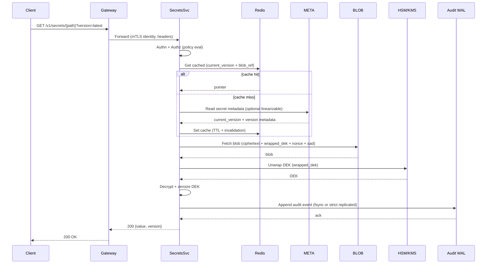
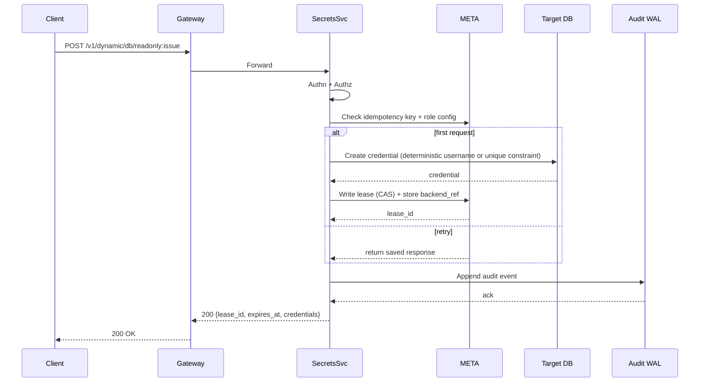
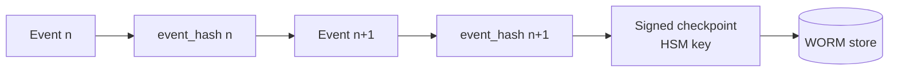

## Overview

A secrets management service (Vault-like) provides a centralized way to store, access, rotate, and audit sensitive material (API keys, DB credentials, certificates, signing keys). The hard parts are not CRUD APIs—they’re enforcing least privilege at scale, minimizing blast radius under compromise, enabling safe rotation without downtime, and producing tamper-evident audit trails that satisfy compliance.

This design separates the **control plane** (authn/z, policies, versions, leases) from the **data plane** (ciphertext storage and cryptographic operations). It uses envelope encryption with HSM/KMS-backed key-encryption keys (KEKs), strongly consistent metadata for correctness, and an audit pipeline that is durable, queryable, and cryptographically verifiable.

## Requirements

### Functional Requirements
- Store and retrieve **versioned** secrets with fine-grained access control (path/namespace, actions, conditions).
- Support rotation: scheduled, on-demand, and safe rollout (overlap windows, multiple active versions, rollback).
- Provide dynamic secrets (e.g., database credentials) issued on-demand with leases; renew and revoke.
- Integrate with HSM/KMS for KEK storage/operations: wrap/unwrap, rotate, attest (where supported).
- Provide a **transit crypto API**: encrypt/decrypt/sign/verify without exposing key material to clients.
- Produce **immutable audit logs** for all access and administrative actions; query and export.
- Support multiple auth methods: OIDC/SAML (humans), Kubernetes/workload identity, cloud IAM, mTLS.
- Multi-tenant isolation: namespaces, quotas, per-tenant cryptographic separation, and per-tenant audit chains.

### Non-Functional Requirements (Targets)
#### Scale (P0 target, single region)
- Tenants: 10,000
- Identities (human + workload): 200,000
- Peak request rate: 50,000 QPS reads, 2,000 QPS writes/rotations, 8,000 QPS lease operations
- Peak audit event rate: up to 60,000 events/sec (≈ one event per request plus background/admin)

**Audit storage sizing (order-of-magnitude)**:
- If average serialized event is ~800 bytes JSON and compresses to ~250 bytes:
  - `60,000 events/s * 86,400 s/day * 250 B ≈ 1.3 TB/day` compressed (peak sustained; typically far lower).
- Practical planning: **0.2–1.5 TB/day compressed** depending on payload, sampling (for non-security telemetry), and peak/average ratio.

#### Latency (in-region)
- Secret read (cache hit for metadata + ciphertext, HSM unwrap with short-lived DEK cache): P50 10–20ms, P99 60–120ms
- Secret write/rotate (includes store write + metadata CAS + audit durability): P50 40–80ms, P99 200–400ms
- Token validation:
  - Local verification (JWT/PASETO + cached policy): P99 ≤ 10ms
  - Introspection fallback: P99 ≤ 30ms

#### Availability and Semantics
- Read path: 99.99% monthly availability (per region, excluding planned maintenance)
- Admin UI / audit search: 99.9% monthly availability
- Consistency:
  - **Strong** for secret version pointers, lease state, policy versions, idempotency keys
  - **Eventual** for audit indexing/search (durability is separate from searchability)
- Durability:
  - Metadata: RPO ≤ 5 minutes, RTO ≤ 30 minutes (multi-region DR)
  - Audit durability: configurable
    - **Standard**: “no-loss for successful responses” within a region assuming node storage survives long enough to ship
    - **Strict**: “no-loss for successful responses even with single-node loss” by requiring replicated audit commit before returning 2xx

### Constraints & Assumptions
- Private network deployment with mTLS between clients and service; optional public exposure through an L7 gateway.
- HSM/KMS throughput is finite and must be treated as a shared, rate-limited dependency.
- Compliance: SOC 2 baseline; optional PCI/HIPAA depending on tenant. Some tenants may require strict audit durability and disabled DEK caching.
- Team size 6–10 engineers; prefer operational simplicity and well-known patterns over exotic cryptography.

## Architecture

### High-Level Diagram

```mermaid
flowchart TB
  %% Clients and edge
  C[Clients] --> GW[API Gateway / L7]
  GW --> S[Secrets Service]

  %% Auth and policy
  S --> IDP[OIDC/SAML IdP]
  S --> PDP[Policy Engine]

  %% Storage
  S --> META[(Strong Metadata Store<br/>etcd/Raft)]
  S --> BLOB[(Ciphertext Blob Store<br/>KV/SQL/Object)]
  S --> RC[(Redis Cache)]

  %% Crypto
  S --> HSM[HSM/KMS<br/>KEK wrap/unwrap<br/>signing]

  %% Audit
  S --> AWAL[Local Audit WAL]
  AWAL --> BUS[Kafka/Pulsar]
  BUS --> WORM[(WORM Object Store<br/>Object Lock)]
  BUS --> IDX[Search Index<br/>(optional)]
```

### Key Architectural Decisions
- **Split metadata from ciphertext blobs**: consensus stores (etcd/Raft) excel at small, strongly consistent state; they are a poor fit for large values at high throughput. Ciphertext blobs live in a scalable blob store; metadata contains pointers and version state.
- **Data-plane crypto via envelope encryption**: per secret version, encrypt with a random DEK (AES-256-GCM), store DEK wrapped by a per-tenant KEK in HSM/KMS.
- **Audit as a first-class system**: every request emits an audit record; audit durability is enforced on the request path, while indexing/search is asynchronous.

## Consistency Model (What Clients Can Rely On)
- `GET ...?version=<n>`: returns exactly version `n` if it exists and is allowed; otherwise `404/410`.
- `GET ...?version=latest`:
  - Default: **read-after-write within bounded staleness** (cache TTL + invalidation; typically seconds).
  - Optional: `X-Consistency: linearizable` to force a quorum read of `current_version` from `META` (higher latency, lower availability).
- Rotation state:
  - A version is never “skipped”: `current_version` increments exactly by 1 using CAS.
  - Overlap windows are enforced by metadata (`not_before/not_after`), not by client behavior.
- Leases:
  - Lease transitions (`active → revoked/expired`) are strongly consistent, idempotent, and monotonic.

## Components

### API Gateway
**Responsibilities**
- Routing, request size limits, WAF, DDoS protections, per-tenant quotas.
- mTLS termination (or passthrough) and client identity propagation.

**Notes**
- Treat the gateway as an enforcement point for coarse-grained controls (rate limiting), not the authority for authorization decisions (which must be enforced by the Secrets Service).

### Secrets Service (Core)
**Responsibilities**
- Authn (via IdP/workload identity), authz enforcement, versioning, leases, rotation workflows.
- Envelope encryption/decryption and transit crypto APIs.
- Audit event creation and durability.

**Implementation Notes**
- Plaintext must never be persisted; memory is zeroized where possible.
- Avoid TOCTOU: the same component that fetches ciphertext must enforce policy and emit audit for that access.
- Enforce strict input constraints: max secret size (e.g., 64KiB default), path normalization, and label limits.

### Policy Engine (PDP)
**Responsibilities**
- Evaluate RBAC/ABAC policies: `(tenant, identity, action, resource_path, context) -> allow/deny`.
- Support policy versioning and safe rollouts.

**Design**
- Policies are versioned documents stored in `META` (or a dedicated policy DB), referenced by `policy_version`.
- Cache policy evaluation results for short TTL (e.g., 5–30s) keyed by `(token_id, policy_version, path, action)`.

### Strong Metadata Store (`META`)
**Responsibilities**
- Source of truth for:
  - secret objects (paths, labels, state)
  - current version pointers and version state windows
  - leases and revocation markers
  - idempotency keys
  - routing directory (tenant → home cluster/region), if used

**Technology Options**
- etcd/Raft for small keys and strict correctness (recommended for the control plane).
- For smaller deployments, PostgreSQL with `SERIALIZABLE` is viable, but the failure modes under partition differ.

### Ciphertext Blob Store (`BLOB`)
**Responsibilities**
- Store ciphertext and wrapped DEKs for each secret version (data plane).

**Technology Options**
- DynamoDB/Spanner/Cassandra for low-latency KV reads at high QPS.
- PostgreSQL with partitioning (works for moderate scale).
- Object store (S3/GCS) if read latency is acceptable and caching is strong.

**Write Pattern (avoids cross-store transactions)**
1. Write blob with a content-addressed key (e.g., `sha256(ciphertext)` or `(tenant,path,version)`), idempotent.
2. CAS update metadata to point `current_version -> v` and store the blob reference.
3. Garbage-collect unreferenced blobs asynchronously.

### HSM/KMS
**Responsibilities**
- Per-tenant KEKs for wrapping/unwrapping DEKs.
- Audit checkpoint signing keys (and optionally transit keys, depending on security tier).
- Key rotation operations and (optionally) attestation.

**Operational Considerations**
- Treat as a rate-limited dependency; use circuit breakers and backpressure.
- For high-security tenants, disable DEK caching and budget QPS accordingly.

### Audit Subsystem
**Responsibilities**
- Create tamper-evident audit records (hash chaining + signed checkpoints).
- Ensure durability on the request path.
- Provide query/export via an asynchronous indexing pipeline.

**Durability Modes**
- **Standard (lower latency)**: append to local WAL with `fsync` before responding, then ship to Kafka and WORM.
- **Strict (strongest)**: require replicated commit (e.g., Kafka `acks=all` with sufficient ISR, or dual-AZ WAL replication) before responding.

**Tamper Evidence**
- Per-tenant (or per-namespace) hash chain: `event_hash = H(prev_hash || canonical_event_bytes)`.
- Periodic checkpoints: every N events or T seconds, sign `(tenant_id, last_event_hash, seq, timestamp)` with an HSM-backed key; store checkpoints in WORM.

## Data Model

### Core Entities (Logical)
#### Secrets (metadata in `META`)
- `tenant_id`, `path`
- `type`: `static | dynamic_engine | transit_key`
- `current_version` (int)
- `state`: `active | deleted`
- `encryption_profile_id` (maps to tenant KEK and rules)
- `labels` (map), `created_at`, `updated_at`, `deleted_at?`

#### Secret Versions (pointer in `META`, blob in `BLOB`)
Metadata fields:
- `tenant_id`, `path`, `version`
- `blob_ref` (pointer into `BLOB`)
- `state`: `active | deprecated | revoked`
- `not_before`, `not_after` (rotation windows)
- `created_at`, `created_by`

Blob fields (in `BLOB` object/value):
- `ciphertext` (bytes)
- `wrapped_dek` (bytes)
- `dek_alg` (e.g., `AES_256_GCM`)
- `nonce` (bytes)
- `aad` (bytes; includes `tenant_id`, `path`, `version`, and metadata hash)

#### Leases (in `META`)
- `lease_id`, `tenant_id`, `engine`, `role`, `path`
- `issued_at`, `expires_at`, `renewable`, `max_ttl`
- `subject` (identity reference), `backend_ref` (e.g., DB username)
- `state`: `active | revoked | expired`

#### Idempotency Keys (in `META`)
- `tenant_id`, `idempotency_key`
- `request_hash`, `response_blob`, `expires_at`

#### Audit Events
- Durability store: append-only WAL segments + WORM
- Optional indexed view (for search):
  - `tenant_id`, `timestamp`, `request_id`, `actor`, `action`, `resource`, `decision`, `latency_ms`, `status_code`
  - `prev_hash`, `event_hash`, `checkpoint_id`

### Data Flows

#### Static Secret Read


#### Dynamic Secret Issue (DB Credentials)


#### Audit Chain and Checkpointing


## API Design

### Conventions
- Auth: `Authorization: Bearer <token>`
- Tenant: `X-Tenant-Id: <id>` (or derived from token/mtls SAN)
- Idempotency: `Idempotency-Key: <uuid>`
- Consistency: `X-Consistency: bounded | linearizable`
- Errors use a consistent envelope:
  - `{ "error": { "code": "...", "message": "...", "request_id": "..." } }`

### Auth
- `POST /v1/auth/oidc/login`
  - Req: `{ "code": "...", "redirect_uri": "..." }`
  - Resp: `{ "token": "...", "expires_in": 900, "renewable": true, "token_type": "Bearer" }`
- `POST /v1/auth/k8s/login`
  - Req: `{ "jwt": "...", "role": "..." }`
  - Resp: same as above

**Token Strategy**
- Prefer short-lived, locally verifiable tokens (JWT/PASETO) with:
  - `exp` ≤ 15 minutes
  - `jti` for audit correlation
  - `policy_version` claim (or server-side lookup keyed by token id)
- Revocation:
  - For high-risk actions, require re-auth or introspection.
  - Maintain a bounded revocation set and “not-before” timestamps per identity/tenant.

### Static Secrets
- `PUT /v1/secrets/{path}`
  - Headers: `Idempotency-Key`
  - Req: `{ "value": "<string|base64>", "encoding": "utf8|base64", "labels": { "env": "prod" } }`
  - Resp: `{ "version": 12, "state": "active", "created_at": "..." }`
  - Errors: `400 invalid_path`, `409 version_conflict`, `413 too_large`, `503 hsm_unavailable`, `503 store_unavailable`, `500 audit_unavailable` (fail-closed)
- `GET /v1/secrets/{path}?version=latest|<int>`
  - Resp: `{ "value": "...", "encoding": "utf8", "version": 12 }`
  - Errors: `404 not_found`, `410 gone` (revoked/deleted), `403 policy_denied`
- `POST /v1/secrets/{path}:rotate`
  - Headers: `Idempotency-Key`
  - Req: `{ "strategy": "new_value|rekey_only", "overlap_seconds": 3600 }`
  - Resp: `{ "new_version": 13, "previous_version": 12, "overlap_until": "..." }`

**Rotation semantics**
- `new_value`: generates a new version with new ciphertext + DEK.
- `rekey_only`: rewraps DEKs under a new KEK (no plaintext change). This is a background-safe operation and should not require clients to change.

### Dynamic Secrets (Leases)
- `POST /v1/dynamic/{engine}/{role}:issue`
  - Headers: `Idempotency-Key` (recommended)
  - Resp: `{ "lease_id": "...", "expires_at": "...", "renewable": true, "credentials": {...} }`
- `POST /v1/leases/{lease_id}:renew`
  - Req: `{ "increment_seconds": 3600 }`
- `POST /v1/leases/{lease_id}:revoke`
  - Idempotent: repeated calls succeed if already revoked.

### Transit Crypto
- `POST /v1/transit/{key}:encrypt`
  - Req: `{ "plaintext": "<base64>", "aad": "<base64>" }`
  - Resp: `{ "ciphertext": "svc:v1:<base64...>" }`
- `POST /v1/transit/{key}:decrypt`
- `POST /v1/transit/{key}:sign`
- `POST /v1/transit/{key}:verify`

**Key isolation**
- Default: per-tenant keys with tenant-scoped ACLs.
- High-security option: store transit private keys inside HSM; otherwise store encrypted key material in `BLOB`/`META` protected by KEK.

## Scaling & Performance

### Critical Bottlenecks
- **HSM/KMS decrypt/unwrap limits** (often the dominant limiter)
  - Mitigations:
    - Short-lived in-process DEK cache (1–5s), strict size caps, tenant opt-out.
    - Reduce unwraps by caching decrypted plaintext for *extremely* hot secrets only if explicitly allowed (generally discouraged).
    - Tenant tiering: dedicate HSM partitions or keys, enforce QPS budgets.
- **Metadata store quorum throughput**
  - Mitigations:
    - Keep metadata small; do not store ciphertext in `META`.
    - Use CAS writes; batch background tasks; avoid lease renew churn (use longer TTL + fewer renewals).
    - Scale out by sharding tenants across clusters (directory-based routing).
- **Audit durability cost**
  - Mitigations:
    - Fast local NVMe for WAL.
    - Group commit for WAL (e.g., fsync every 1–5ms with bounded queue) where compliance allows; otherwise strict mode may need replicated commit.

### Horizontal Scaling Strategy
- Gateway: stateless replicas.
- Secrets Service: stateless replicas; scale on CPU, cache hit rate, and HSM latency; apply backpressure and per-tenant rate limits.
- `META`: fixed-size quorum (3–5 nodes per cluster across AZs); scale by adding clusters and routing tenants to a home cluster.
- `BLOB`: scale independently via chosen storage backend.
- Audit pipeline: separate scaling for transport (Kafka/Pulsar), WORM writes, and indexing/search.

### Caching
- Redis:
  - Cache metadata pointers (`current_version`, `blob_ref`) TTL 30–120s.
  - Cache hot blob payloads (ciphertext + wrapped DEK) TTL 30–300s, size-bounded.
- In-process:
  - Cache policy results TTL 5–30s.
  - Cache unwrapped DEKs TTL 1–5s, opt-out per tenant.
- Invalidation:
  - On write/rotate: publish `(tenant_id, path)` invalidation; TTL is the safety net.
  - Avoid relying on cache invalidation for correctness of explicit version reads.

## Trade-offs & Alternatives

### Key Trade-offs
1. **Strong control-plane metadata (Raft/etcd) vs. single SQL DB**
   - Pros: clear correctness model for CAS/versioning/leases, well-understood partition behavior.
   - Cons: operational overhead, throughput limits, poor fit for large blobs.
   - Mitigation: store ciphertext in `BLOB`, keep metadata small.
2. **Audit fail-closed durability vs. availability**
   - Pros: prevents “silent exfiltration” without trace; supports strict compliance.
   - Cons: disk pressure or audit pipeline incidents can reduce availability.
   - Mitigation: strict SLOs on WAL health, dual AZ replication option, tenant-tiered durability.
3. **HSM/KMS dependency vs. software-only keys**
   - Pros: reduced key-extraction risk, supports regulated environments, central rotation.
   - Cons: latency, cost, throughput ceilings, operational coupling.
   - Mitigation: caching, capacity planning, tenant isolation, fallback modes (explicitly opt-in).

### Alternatives
- **Cloud-managed secrets services** (AWS Secrets Manager, GCP Secret Manager): faster time-to-value, but less control over audit and crypto separation for some tenants.
- **PostgreSQL-only design** with `SERIALIZABLE` transactions: simpler operations; viable at moderate scale; trade-off is different failure behavior under partitions and potentially higher contention at extreme write rates.
- **Client-side encryption**: server stores only ciphertext; reduces server exposure but complicates rotation, transit crypto, and consistent audit/authorization enforcement.
- **No DEK unwrap on read** via derived per-secret keys: reduces HSM calls but increases server key-handling risk; generally not preferred for a “Vault-like” service unless threat model allows.

## Failure Modes & Mitigations

### 1) HSM/KMS Unavailable or Slow
- Impact: decrypt/unwrap stalls; read/write latency spikes; potential partial outage.
- Detection: unwrap latency P99, error rates, queue depth, circuit breaker state.
- Mitigation:
  - Multiple HSM endpoints across AZs; automatic failover.
  - Backpressure + per-tenant rate limits; shed non-critical traffic first.
  - Tenant-tier behavior:
    - High-security: fail closed.
    - Opt-in “degraded reads”: allow reads only if DEK is already in short-lived cache (explicitly documented risk).

### 2) Metadata Store Loses Quorum
- Impact: no writes; linearizable reads may fail; bounded-staleness reads may continue (with risk).
- Detection: quorum health checks, leader churn, commit latency.
- Mitigation:
  - 3–5 node quorum across AZs; anti-affinity; careful maintenance runbooks.
  - Read-only mode: serve explicit-version reads where safe; block `latest` linearizable.
  - Restore from snapshots; promote warm standby quorum in DR region.

### 3) Audit WAL Disk Full / Corruption
- Impact: fail-closed blocks API responses (by design).
- Detection: disk usage, append errors, checksum mismatch, ship lag growth.
- Mitigation:
  - Dedicated NVMe volume, quotas, WAL rotation, compression.
  - Strict mode option: replicated audit commit reduces single-disk risk.
  - Emergency runbook: drain node, preserve WAL for forensics, fail traffic to healthy nodes.

### 4) Compromised Service Node
- Impact: potential plaintext exposure in memory; token abuse; lateral movement.
- Detection: EDR signals, anomalous audit patterns, integrity checks, unusual access rates.
- Mitigation:
  - mTLS, short-lived tokens, least privilege, hardened runtime, no swap, restrictive kernel settings.
  - Disable DEK caching for high-security tenants; isolate tenants to dedicated nodes (optional).
  - Rapid incident response: revoke tokens, rotate policy keys, rotate/rewrap KEKs, drain and reimage nodes.

### 5) Blob Store Partial Outage / High Latency
- Impact: secret reads fail for cache misses; rotation may stall.
- Detection: blob read latency/error rate, cache hit ratio drops.
- Mitigation:
  - Multi-AZ storage; aggressive caching for hot paths.
  - Serve from cache when allowed; retry with jitter; circuit breaker to protect upstream.

## Operations

### Deployment & Migrations
- Deploy via canary or blue/green; per-tenant routing enables safe rollout.
- Backward-compatible storage changes:
  - Dual-read, dual-write where necessary.
  - Never roll back cryptographic formats without explicit dual-format support.
- Feature flags for:
  - strict audit durability
  - DEK caching enablement
  - linearizable `latest` reads

### Observability (SLO-driven)
**Golden signals**
- `p50/p99 latency` by endpoint and tenant tier
- `error_rate` by dependency (HSM, META, BLOB, audit)
- `cache_hit_ratio` (metadata and blob)
- `HSM unwrap p99`, `queue_depth`, `rate_limited_count`
- `META commit_latency_p99`, `leader_changes`, `quorum_unhealthy_seconds`
- `audit_wal_fsync_p99`, `audit_ship_lag_seconds`, `checkpoint_mismatch_count` (must be 0)
- Security signals: deny rate, unusual path access, token anomalies, high-privilege usage

### Key Management Runbooks
- **KEK rotation**: create new KEK in HSM, update `encryption_profile_id`, rewrap DEKs in background, monitor completion, retire old KEK per policy.
- **Transit key rotation**: version keys, support dual-verify during overlap, retire old versions after clients update.
- **Emergency rotation**: break-glass procedure with dual control, time-bounded access, and mandatory audit export.

### Backups & DR
- Metadata snapshots every 5 minutes to cross-region replicated storage.
- Blob store replication per backend capabilities (multi-region where required).
- Audit:
  - WAL shipped continuously; checkpoints stored in WORM with retention.
  - Periodic validation job verifies hash chains against WORM checkpoints.
- DR exercise: quarterly restore drill with measured RTO/RPO and audit chain continuity verification.

### Compliance and Access Governance
- Dual control for high-risk operations (policy changes, key rotation, tenant deletion).
- Separate admin planes for platform operators vs tenant admins.
- Data retention policies:
  - secrets versions retained N days/versions per tenant policy
  - audit retained per compliance (e.g., 1–7 years) in WORM

## References & Further Reading
- HashiCorp Vault architecture and audit devices: https://developer.hashicorp.com/vault/docs
- AWS Secrets Manager (managed alternative): https://docs.aws.amazon.com/secretsmanager/
- GCP Secret Manager: https://cloud.google.com/secret-manager/docs
- Envelope encryption: https://cloud.google.com/kms/docs/envelope-encryption
- NIST SP 800-57 (Key management): https://csrc.nist.gov/publications/detail/sp/800-57-part-1/rev-5/final
- AWS S3 Object Lock (WORM retention): https://docs.aws.amazon.com/AmazonS3/latest/userguide/object-lock.html
- Certificate Transparency (append-only log concepts): https://certificate.transparency.dev/
- SPIFFE/SPIRE (workload identity): https://spiffe.io/