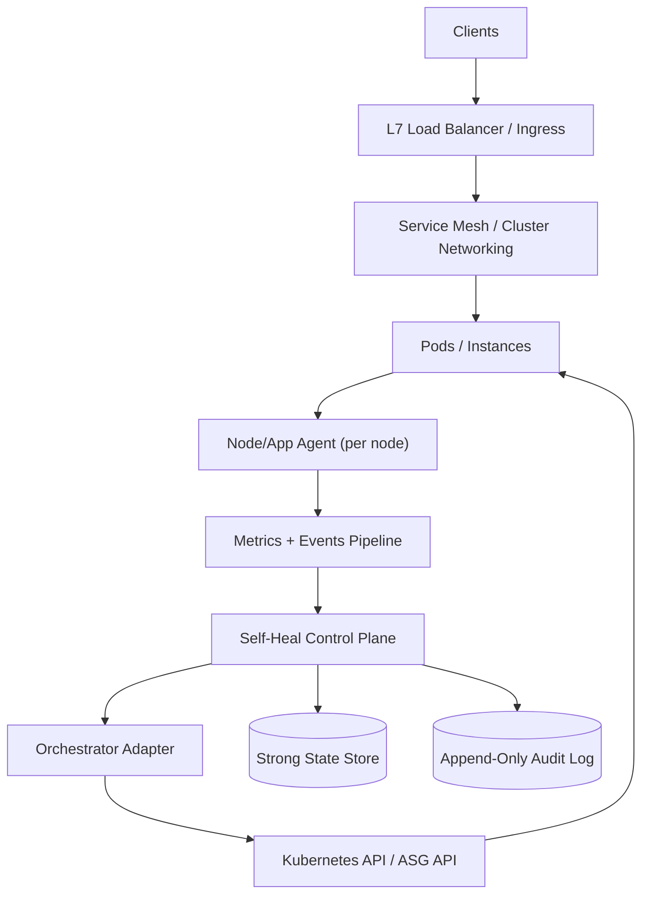
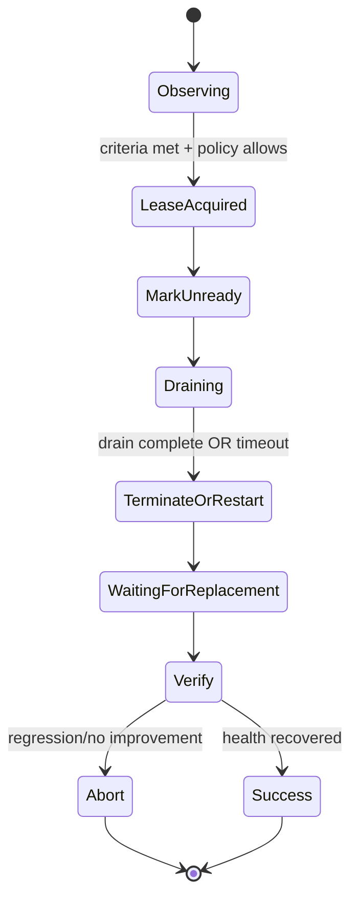
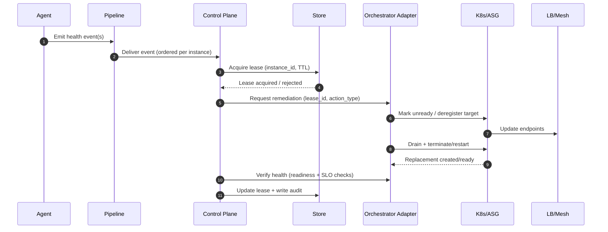

## Overview

Modern services often fail in “soft” ways long before they crash: zombie processes accumulate, memory leaks slowly erode headroom, GC thrashes, file descriptors exhaust, or kernel resources degrade. These issues frequently evade simple liveness checks until latency spikes or nodes fall over—by then, you’re already dropping traffic or paging humans.

The core challenge is building a safe, automated control loop that:
1. **Detects** degradation early with high signal-to-noise (close to the workload).
2. **Decides** the minimal effective remediation (with service/SLO context and guardrails).
3. **Executes** traffic-safe actions (drain, readiness gating, graceful shutdown) while preserving availability.

A production-grade solution separates **detection** (fine-grained, local) from **orchestration** (global, rate-limited) and makes every remediation **traffic-aware**. This document describes a self-healing system integrating node/app agents, a self-heal control plane, and an orchestrator (Kubernetes or VM + Auto Scaling Group) to recycle unhealthy instances with near-zero user-visible impact.

## Goals & Non-Goals

### Goals
- Detect and remediate common soft-failure modes (zombies, memory leaks/pressure, FD exhaustion, GC thrash indicators).
- Ensure remediation is **safe-by-default**: no thundering herds, no capacity collapse, no runaway automation.
- Make automation observable and auditable: every action is explainable and traceable.
- Support gradual adoption: observe-only → limited automation → broad automation.

### Non-Goals
- Replacing full APM/profiling suites; this system triggers remediation and can *integrate* with profiling tools.
- Solving application correctness bugs; automation mitigates symptoms and stabilizes the fleet.
- “Perfect” anomaly detection; the focus is robust, conservative automation with clear guardrails.

## Requirements

### Functional Requirements
- Detect zombie processes (defunct children, unreaped processes) at host/container scope and attribute to owning workload.
- Detect memory leaks and memory pressure using multiple signals:
  - RSS/working-set growth slope, heap growth, GC pause/CPU, cgroup OOM risk, Linux PSI (Pressure Stall Information).
- Detect FD pressure (open FDs nearing limits), thread explosion, and kernel/resource saturation indicators.
- Trigger traffic-safe remediation actions:
  - Soft restart (process/pod), targeted kill, pod/instance recycle, node drain, quarantine (remove from traffic and prevent rescheduling).
- Enforce traffic safety:
  - Readiness gating before drain, connection draining, graceful shutdown with timeouts, and optional surge capacity.
- Apply guardrails:
  - Per-service blast radius limits, per-cluster/global rate limits, and an automation circuit breaker.
- Provide auditability:
  - Record signals, decision context, actions, and outcomes; enable forensics and postmortems.
- Support human override:
  - Pause automation globally/per-service, manual remediation triggers, and runbook links.
- Validate effectiveness:
  - Post-action verification (resource normalization and SLO recovery), otherwise escalate/stop.

### Non-Functional Requirements (Concrete Targets)
- **Fleet Scale (initial target)**:
  - 5,000 nodes, up to 50,000 pods, ~2,000 services.
  - Peak ingest: ~200k metrics samples/sec; ~5k health events/sec (bursty).
  - Remediation actions: steady-state ≤ 10/min; burst ≤ 50/min with strict guardrails.
- **Latency Targets (automation loop)**:
  - Detection-to-decision: P50 ≤ 5s, P99 ≤ 30s for soft failures.
  - Drain initiation-to-fully-drained: P50 ≤ 15s, P99 ≤ 90s (depends on traffic patterns and long-lived connections).
  - Replacement readiness (cold start): P50 ≤ 60s, P99 ≤ 5m.
- **Availability Targets**:
  - Self-heal control plane: 99.99% monthly.
  - Automation must not reduce service availability; default behavior on uncertainty is **no action**.
- **Consistency & Correctness**:
  - Strong consistency for action leases and policy changes (prevent double-remediation).
  - Eventual consistency is acceptable for metrics aggregation/dashboards.
- **Durability**:
  - Actions/audit records: RPO ≈ 0 (no acknowledged action lost).
  - Metrics: RPO up to minutes acceptable.
- **Security/Compliance**:
  - Audit retention 90 days minimum.
  - Least-privilege, mTLS where applicable, signed workload identity, and tamper-evident audit trails.

### Constraints & Assumptions
- Orchestration: Kubernetes (preferred) or VM + L7 load balancer + service discovery.
- Workloads support graceful shutdown (SIGTERM handling), expose readiness endpoints, and can set max connection age / drain settings.
- Team size: 6–10 engineers; prefer managed services (managed Kafka/PubSub, managed Postgres) when possible.
- Budget-aware: avoid always-on deep profiling; enable on-demand eBPF profiling or sampling during incidents.

## Architecture

### High-Level Diagram



### Control Loops (Two-Level Design)
- **Local loop (Agent)**: fast sampling + OS signals to detect degradations early and attribute them correctly.
- **Global loop (Control Plane)**: correlates signals with service health/SLOs, applies guardrails, acquires an action lease, then requests remediation.

This separation keeps detection close to the data (low latency, high fidelity) while keeping decisions centralized (global safety, consistent policies).

### Remediation State Machine



## Components

### 1) Node/App Agent

**Responsibilities**
- Collect local signals and attribute to the correct workload (container/cgroup-aware):
  - Zombies/defunct processes, unreaped children.
  - RSS/working set and growth slope.
  - Linux PSI (memory/CPU I/O pressure), cgroup OOM events.
  - FD utilization, thread count, restart loops, GC indicators (if available).
- Emit:
  - High-volume metrics (for dashboards/trending).
  - Low-volume structured health events (for decisioning).

**Key Design Decisions**
- Prefer attribution via cgroups to avoid host-wide noise.
- Use a multi-signal approach to reduce false positives:
  - Example: treat “memory leak” as (RSS slope) + (increasing GC time or PSI) over N minutes.
- Prioritize critical events (potential remediation triggers) over best-effort telemetry.

**Technology Choice**
- eBPF + small daemon (Go/Rust) for low overhead visibility when permitted.
- Fallback: `/proc` sampling and cgroup filesystem polling when eBPF is not allowed.

**Performance Targets**
- Per-node overhead: CPU < 1%, memory < 100MB.
- Sampling intervals: 5s for lightweight stats, event-driven for OOM/PSI threshold crossings.

**Reliability**
- Local buffering with bounded queues.
- Drop policy: drop non-critical metrics first; never drop acknowledged critical events without retry/backoff.

### 2) Metrics & Events Pipeline

**Responsibilities**
- Ingest, buffer, and route signals to the control plane and observability backends.
- Absorb bursts (incident conditions) without collapsing decisioning.

**Key Design Decisions**
- Separate channels:
  - **Metrics**: high volume, best effort, time-series oriented.
  - **Events**: lower volume, higher value, ordered per instance, durable for audit/debug.

**Technology Choice**
- Events: Kafka/PubSub with 7–14 days retention.
- Metrics: Prometheus remote-write or OpenTelemetry Collector to a managed metrics backend.

**Partitioning & Ordering**
- Events: partition by `cluster_id + service_id + instance_id` to preserve per-instance order.
- Metrics: shard by `cluster_id + node_id` (or scrape/collector topology).

### 3) Self-Heal Control Plane

**Responsibilities**
- Ingest and correlate events.
- Evaluate policies/guardrails and service SLO context.
- Acquire action leases (strong consistency).
- Orchestrate traffic-safe remediation via an adapter.
- Verify outcomes and write audit records.

**Decisioning Model (Conservative by Default)**
A typical remediation decision requires:
- **Signal confidence**: multiple corroborating signals or repeated critical events within a time window.
- **Service safety**: capacity/headroom checks (min healthy percent, PDB, error budget burn).
- **Fleet safety**: per-service and global rate limits; circuit breaker triggers.

**Guardrails (Examples)**
- Per-service:
  - `max_concurrent_remediations`: e.g., 1–3 (depends on replica count).
  - `max_remediations_per_hour`: e.g., 3–10.
  - `min_healthy_percent`: e.g., 90–99 (higher for latency-sensitive tier).
- Global:
  - `max_actions_per_minute`: e.g., 50.
  - Freeze automation if post-action SLO regression crosses a threshold.

**Circuit Breaker (Automation Kill Switch)**
Trigger auto-disable when one or more conditions hold for a sustained window (e.g., 5–10 minutes):
- Remediation success rate < 90%.
- Post-action error rate increases > X% relative to baseline.
- Ready endpoints drop below `min_healthy_percent` across multiple services (suspect platform issue).

### 4) Orchestrator Adapter

**Responsibilities**
- Convert control-plane intent into orchestrator-specific operations.
- Ensure remediation is traffic-safe and idempotent.

**Kubernetes Execution Pattern**
- **Mark unready**:
  - Patch a label/condition consumed by readiness (or `readinessGates`) to stop new traffic.
- **Drain**:
  - Respect `preStop` hooks, mesh drain APIs (if available), and `terminationGracePeriodSeconds`.
- **Terminate/Restart**:
  - Delete pod (or restart container) depending on action type and confidence.
- **Replace**:
  - Let ReplicaSet/Deployment recreate; optionally trigger surge via HPA or temporary replica bump.
- **Quarantine**:
  - Apply taints/node cordon for node-level issues; label workloads to prevent rescheduling onto bad nodes.

**VM/ASG Execution Pattern**
- Deregister from target group, wait for draining, then terminate instance via lifecycle hooks.
- Use warm pools or pre-baked images to reduce P99 replacement time.

**Traffic & Long-Lived Connections**
- Prefer explicit limits:
  - Max connection age, keep-alive timeouts, gRPC graceful shutdown.
- Drain timeouts must reflect reality:
  - If WebSockets exist, either support connection migration or accept longer drains / targeted remediation.

### 5) Strong State Store + Audit

**Responsibilities**
- Strongly consistent storage for:
  - Policies, action leases, and remediation state transitions.
- Append-only audit log for:
  - Signals considered, decision context, actions requested, outcomes observed.

**Technology Choice**
- Leases/policies: HA Postgres (managed) or etcd/Consul.
- Audit: Postgres partitioned tables and/or object storage (immutable blobs) with indexing for search.

**Lease Semantics (Correctness)**
- Exactly one active lease per `instance_id`.
- Lease acquisition is atomic and time-bounded (TTL).
- All remediation calls are idempotent using `{lease_id, action_type}`.

## Data Model

### Tables (Example Schema)

**Table: `service_policy`**
- `service_id` (PK)
- `max_concurrent_remediations` (int)
- `max_remediations_per_hour` (int)
- `min_healthy_percent` (int)
- `drain_timeout_sec` (int)
- `graceful_shutdown_sec` (int)
- `leak_slope_threshold_mb_per_min` (float)
- `zombie_threshold` (int)
- `automation_enabled` (bool)
- `version` (int) — for optimistic concurrency
- `updated_at` (timestamptz)

**Table: `instance_lease`**
- `lease_id` (PK)
- `instance_id` (unique)
- `service_id`
- `action_type` (enum: `DRAIN_TERMINATE`, `RESTART`, `QUARANTINE`)
- `state` (enum: `ACQUIRED`, `MARKING_UNREADY`, `DRAINING`, `TERMINATING`, `WAITING_REPLACEMENT`, `VERIFIED`, `ABORTED`)
- `owner` (string)
- `expires_at` (timestamptz)
- `created_at` (timestamptz)

**Table: `health_event`** (append-only)
- `event_id` (PK)
- `ts` (timestamptz)
- `cluster_id`
- `service_id`
- `instance_id`
- `signal_type` (enum: `ZOMBIE_COUNT`, `RSS_SLOPE`, `PSI_MEM`, `FD_UTIL`, `OOM_KILL`, `LATENCY_SPIKE`, `GC_CPU`, `RESTART_LOOP`)
- `value` (jsonb)
- `severity` (enum: `INFO`, `WARN`, `CRIT`)
- `correlation_id` (string)

**Table: `remediation_audit`** (append-only)
- `audit_id` (PK)
- `ts` (timestamptz)
- `cluster_id`
- `service_id`
- `instance_id`
- `lease_id`
- `action_type`
- `decision_context` (jsonb) — thresholds, SLO state, guardrails, signals
- `result` (enum: `SUCCESS`, `FAILED`, `SKIPPED`, `ABORTED`)
- `error` (text)

### Data Flow



## API Design

> All APIs are internal. External users interact via SRE tooling (CLI/UI) that calls these APIs.

### 1) Report Health Events (Agent → Control Plane)
- `POST /v1/health-events`
- Headers:
  - `Idempotency-Key: <event_batch_hash>`
- Request (example):
  ```json
  {
    "cluster_id": "prod-us-east-1",
    "node_id": "node-123",
    "service_id": "checkout",
    "instance_id": "pod-abc",
    "agent_version": "1.7.0",
    "signals": [
      {"type": "RSS_SLOPE", "severity": "CRIT", "ts": "2025-01-01T12:00:00Z", "value": {"mb_per_min": 80}},
      {"type": "PSI_MEM", "severity": "WARN", "ts": "2025-01-01T12:00:00Z", "value": {"some_avg10": 0.12}}
    ]
  }
  ```
- Response: `202 Accepted` `{ "ingestion_id": "..." }`
- Errors:
  - `400` invalid payload
  - `401/403` authn/authz failure
  - `429` rate limited (agent backoff with jitter)
  - `503` temporary unavailable (retry with jitter)

### 2) Trigger Remediation (Control Plane → Orchestrator Adapter)
- `POST /v1/remediations`
- Headers:
  - `Idempotency-Key: <lease_id>:<action_type>`
- Request (example):
  ```json
  {
    "cluster_id": "prod-us-east-1",
    "service_id": "checkout",
    "instance_id": "pod-abc",
    "lease_id": "lease-789",
    "action_type": "DRAIN_TERMINATE",
    "drain_timeout_sec": 90,
    "graceful_shutdown_sec": 30
  }
  ```
- Response: `200 OK` `{ "remediation_id": "...", "state": "DRAINING" }`
- Errors:
  - `409` lease mismatch / already remediating
  - `412` violates guardrail (e.g., min healthy percent / PDB)
  - `503` orchestrator unavailable (retry; lease prevents duplication)

### 3) Pause/Resume Automation (SRE Tooling → Control Plane)
- `PATCH /v1/service-policies/{service_id}`
- Headers:
  - `If-Match: <policy_version>`
- Request:
  ```json
  { "automation_enabled": false }
  ```
- Response: `200 OK` updated policy with new `version`
- Errors:
  - `403` unauthorized
  - `409` version conflict (client must refetch and retry)

### 4) Manual Remediation (SRE Tooling → Control Plane)
- `POST /v1/manual-remediations`
- Request:
  ```json
  {
    "cluster_id": "prod-us-east-1",
    "service_id": "checkout",
    "instance_id": "pod-abc",
    "action_type": "RESTART",
    "reason": "Oncall observed memory leak; rolling restart subset"
  }
  ```
- Response: `202 Accepted` with `lease_id` and tracking link
- Notes: still enforces guardrails unless explicitly overridden by privileged role with audit logging.

## Scaling & Performance

### Back-of-the-Envelope Sizing
Assume:
- 5,000 nodes, 10 metrics/sec/node (after aggregation) → 50k metrics/sec baseline.
- Bursts and richer telemetry push to ~200k samples/sec peak (as specified).
- 5k events/sec peak with 1KB average payload → ~5MB/sec ingest (~432GB/day raw). With compression and filtering, typically far lower in steady-state.

Implications:
- Keep **events** tight: only actionable signals at CRIT/WARN with summaries; send rich diagnostics on-demand.
- Prefer structured fields over verbose logs; compress at the edge where possible.

### Bottlenecks & Mitigations
- **Event storms (platform incident)**:
  - Mitigate with pipeline buffering, per-cluster quotas, and “platform incident mode” circuit breaker (halt most remediation).
- **False positives (over-aggressive thresholds)**:
  - Multi-signal gating, per-service canary policies, observe-only rollout, and post-action verification.
- **Drain latency (long-lived connections)**:
  - Enforce max connection age; ensure LB/mesh drain settings are correct; tune drain timeout by service tier.
- **State store hot-spotting**:
  - Keep lease rows small; use indexes on `instance_id`; avoid frequent policy reads via caching/watch.

### Horizontal Scaling Strategy
- **Agent**: one per node; scales linearly.
- **Pipeline**: scale partitions/brokers; isolate “critical events” topic with higher priority and lower lag SLO.
- **Control plane**: stateless replicas; shard workers by `hash(service_id)`; bounded queues and backpressure.
- **Orchestrator adapter**: horizontally scalable; rate-limited calls to Kubernetes/ASG APIs.

### Caching Strategy
- Cache `service_policy` in the control plane with TTL (e.g., 30s) plus event-driven invalidation.
- Cache orchestrator-derived “ready endpoints count” briefly (5–10s) to avoid hot loops.
- Never cache leases beyond the immediate request scope.

## Consistency, Idempotency, and Safety

### Action Leases (Strong Consistency)
- Purpose: ensure **at most one** active remediation per instance and enforce blast-radius limits.
- Properties:
  - Acquire lease atomically; if it already exists and is unexpired, do not act.
  - Lease TTL ensures crashes don’t lock an instance indefinitely.
  - State transitions are monotonic and audited.

### Idempotency End-to-End
- Agent ingestion: idempotency key per batch prevents duplicates on retry.
- Remediation calls: idempotency key `{lease_id, action_type}` ensures safe retries.
- Orchestrator actions: operations should be safe if repeated (e.g., patch readiness label to same value, delete same pod).

### Safety Defaults
- If SLO data is missing or store/orchestrator is unstable: default to **observe-only** (no action).
- If platform-level anomalies are detected: freeze automation to avoid amplifying outages.

## Trade-offs & Alternatives

### Key Trade-offs
- **Agent-side detection + centralized decisioning**  
  Trade-off: added component complexity vs. basic liveness probes.  
  Why: zombie/leak/pressure detection requires OS-level attribution and earlier signals than probes provide.
- **Strong-consistency leases**  
  Trade-off: dependency on a reliable store and slightly higher coordination latency.  
  Why: double-termination and remediation loops are more damaging than milliseconds of coordination overhead.
- **Surge-then-drain (when possible)**  
  Trade-off: temporary extra cost/capacity.  
  Why: avoids brownouts when services are near saturation and drains take time.

### Alternatives (When to Choose Them)
- **Kubernetes-only probes and restarts**: simplest for small systems; reacts late and can synchronize failures at scale.
- **Always-on continuous profiling**: best for deep leak/root-cause detection; expensive and operationally heavy—use on-demand escalation.
- **Centralized anomaly detection without agents**: less host access but poorer attribution/timeliness; works better for coarse-grained SLO-based remediation.
- **Service-level self-healing (app restarts itself)**: useful for specific failure modes; lacks fleet-wide guardrails and auditing.

## Failure Modes & Mitigations

### Failure Scenarios (At Least 3)
1. **False positive remediations**
   - Impact: reduced capacity, potential latency increase.
   - Mitigation: multi-signal gating, observe-only rollout, per-service canaries, post-action verification, automation circuit breaker.

2. **Thundering herd remediation (correlated failures)**
   - Impact: cascading brownout/outage.
   - Mitigation: per-service/global concurrency caps, `min_healthy_percent` enforcement, randomized backoff, require surge for hot services.

3. **Control plane outage**
   - Impact: no new remediations; existing drains proceed under orchestrator behavior.
   - Mitigation: HA replicas across AZs, pipeline buffering, safe “do nothing” default, clear manual runbooks.

4. **State store degradation/partition**
   - Impact: lease acquisition fails or becomes slow; decisioning stalls.
   - Mitigation: timeouts, fallback to observe-only, store SLO alerts, keep transactions small, TTL cleanup and backoff.

5. **Orchestrator drain semantics misconfigured**
   - Impact: connection drops during drains → user-visible errors.
   - Mitigation: conformance tests for drain behavior, staged rollout, validate mesh/LB settings, enforce service-tier defaults.

6. **Agent compromised or misbehaving**
   - Impact: noisy pipeline, potential incorrect decisions.
   - Mitigation: workload identity + mTLS, strict schema validation, per-agent rate limits, anomaly detection on agent output, quarantine nodes/agents.

## Operations

### Monitoring & Alerting
**Core SLIs**
- Remediation effectiveness:
  - Success rate, abort rate, MTTR improvement, post-action SLO regression rate.
- Safety:
  - Actions/min (global and per service), concurrent remediations, circuit breaker activations.
- Traffic impact:
  - `drain_duration_p99`, connection resets during drains, ready endpoints vs. `min_healthy_percent`.
- Pipeline health:
  - Critical event consumer lag, dropped events, ingestion error rate.
- Store health:
  - Transaction latency, lock contention, replication lag, error rates.

**Example Alerts**
- Remediation success rate < 90% for 10m (per cluster).
- Critical event consumer lag > 60s for 5m.
- Ready endpoints below `min_healthy_percent` for 5m (per service).
- Circuit breaker triggered (page oncall; automation likely paused).
- Store txn P99 > 100ms for 10m (warn) / > 500ms (page), tuned per environment.

### Deployment & Rollout Strategy
- Progressive delivery:
  - Agents: 1% → 10% → 50% → 100% nodes.
  - Control plane: canary replicas before full rollout.
- Feature flags:
  - Start in observe-only; enable automation per service tier.
- Rollback:
  - Immediate disable automation globally/per service.
  - Short lease TTL ensures stuck actions expire safely.

### Security & Access Control
- Agents authenticate with workload identity (node identity / SPIFFE-like) and mTLS.
- Control plane enforces strict RBAC:
  - Read-only vs. policy edit vs. manual override privileges.
- Audit log is immutable and access-controlled; sensitive payloads minimized and scrubbed.

### Disaster Recovery
- Suggested targets:
  - Control plane RTO ≤ 30 minutes; RPO ≈ 0 for leases/policies.
- Backups:
  - Postgres: daily full + continuous WAL; periodic restore tests.
  - Audit in object storage: versioning + lifecycle policies.
- Multi-region:
  - Optional active-passive with DNS failover; run in observe-only until pipeline/store are confirmed healthy.

### Testing & Game Days
- Conformance tests:
  - Drain behavior (LB/mesh), readiness correctness, graceful shutdown adherence.
- Chaos/game days:
  - Induce memory pressure, FD exhaustion, agent outages, pipeline lag, store partial failures.
- “Stop the world” drill:
  - Validate global automation pause works instantly and predictably.

## References & Further Reading
- Kubernetes: Pod lifecycle, probes, `preStop`, `terminationGracePeriodSeconds`, PodDisruptionBudgets (PDB)
- Envoy/service mesh draining: connection draining, max connection age, graceful gRPC shutdown
- Linux PSI (Pressure Stall Information): early pressure signals for CPU/memory
- eBPF observability toolchains: bcc, libbpf, production eBPF patterns
- Google SRE Workbook: safe automation, error budgets, control loops
- “Automated Rollbacks” and progressive delivery practices (canaries, feature flags)