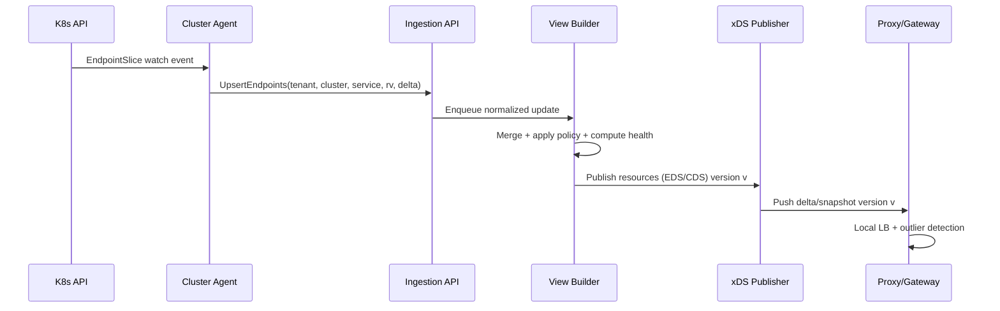
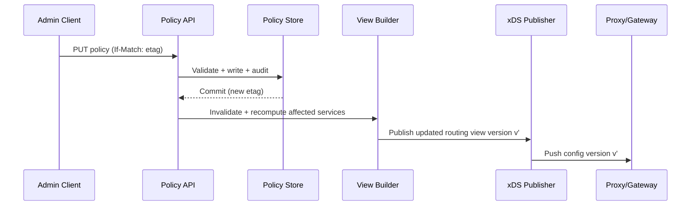

## Overview

Service discovery in a multi-cluster environment is hard because the “truth” about where a service can be reached changes continuously (autoscaling, rollouts, node failures, partitions), while clients expect fast, correct routing. Across clusters and regions, you also inherit imperfect links, variable cluster health, and propagation delays—making global strong consistency impractical at scale.

This design separates the **control plane** (global intent + state aggregation + policy) from the **data plane** (local, low-latency routing). The system favors **eventual consistency with bounded staleness** and uses **multi-signal health**, **outlier detection**, and **explicit degradation rules** so routing remains safe and available even when the control plane is stale or unreachable.

The key idea: discovery is a **continuously reconciled stream of endpoint state** (push-based), not a request/response database lookup (pull-based). Updates are pushed close to where routing happens (gateways/sidecars), and proxies operate correctly with last-known-good config under failure.

---

## Requirements

### Functional Requirements
- Register and discover services across multiple Kubernetes clusters (hundreds+).
- Support endpoint-level and cluster/region-level routing (locality preference, weights, priorities, failover).
- Distribute high-churn endpoint updates efficiently (incremental updates and watches).
- Support multiple consumers: ingress gateways, sidecars, L7 proxies, and internal control-plane clients.
- Incorporate health signals:
  - Kubernetes readiness (fast signal)
  - Optional active probing (detect blackholes)
  - Passive health from data plane (outlier detection / success rate / latency)
- Provide explicit behavior under staleness and partitions (bounded staleness + safe defaults).
- Multi-tenant isolation (tenants/namespaces/projects), RBAC, and policy enforcement.
- Operational tooling:
  - “Why did I route here?” debugging
  - Audit logs for policy changes
  - Snapshot export for incident forensics

### Non-Functional Requirements

#### Scale (Target Capacity)
Assumptions (tunable):
- Up to **200 clusters** across **3–10 regions**
- Up to **20k services** globally
- Up to **2M endpoints** globally (pods/VMs/NEGs)
- Peak churn during large rollouts/incidents:
  - **Sustained**: **5k endpoint updates/sec**
  - **Burst**: **50k endpoint updates/sec** for short windows (seconds to a few minutes)
- Control-plane APIs (policy + debug + ingestion):
  - **5k QPS** sustained (with burst handling)

#### Latency (Targets)
- Endpoint change to proxy availability (end-to-end convergence):
  - **P50 ≤ 2s**, **P99 ≤ 15s** (global, cross-region)
- Proxy routing overhead:
  - **P99 < 2ms** added per request (proxy-local)

#### Availability & Durability
- Data plane availability: **99.99%** (routing continues during control-plane outages)
- Control plane availability: **99.9%** (stale operation is acceptable within staleness bounds)
- Durability:
  - Endpoint state is **reconstructable** from Kubernetes sources
  - Policy/audit data: **RPO ≤ 1 minute**, retained **90 days**

#### Consistency
- Within a cluster, Kubernetes API (etcd) is the source of truth (stronger guarantees).
- Globally, the system is **eventually consistent** with **bounded staleness**.
- Per-proxy session monotonicity: proxies must not “time travel” to older config versions after seeing newer ones.

### Constraints & Assumptions
- Kubernetes is the primary substrate: `Service`, `EndpointSlice`, `Node`, and optional `Gateway API`.
- Cross-cluster networking is partially connected; links can be lossy/high-latency.
- Prefer proven components (Envoy/xDS, PostgreSQL/etcd, Kafka/NATS optional).
- No requirement for global strong consistency; correctness is defined by safety rules under staleness.

---

## Architecture

### High-Level System

```mermaid
flowchart TB
  %% Data plane
  subgraph DP[Data Plane (Per Cluster)]
    Proxy[Envoy Sidecar / Gateway]
    Cache[(Local xDS Cache)]
    Proxy --> Cache
  end

  %% Control plane
  subgraph CP[Global Control Plane (Multi-Region)]
    XDS[Discovery Publisher (xDS/ADS)]
    Ingest[Ingestion API (gRPC)]
    Policy[Policy Service]
    Health[Health Signal Processor]
    View[View Builder (Computed Routing State)]
    Store[(Policy Store: Postgres/etcd)]
    XDS <---> View
    Ingest --> View
    Policy --> Store
    Policy --> View
    Health --> View
  end

  %% Per-cluster sources
  subgraph C1[Cluster A]
    K8sA[Kubernetes API]
    AgentA[Cluster Agent]
    K8sA --> AgentA
  end

  subgraph C2[Cluster B]
    K8sB[Kubernetes API]
    AgentB[Cluster Agent]
    K8sB --> AgentB
  end

  AgentA --> Ingest
  AgentB --> Ingest

  XDS --> Cache
```

### Control Plane vs Data Plane Responsibilities
- **Control plane**
  - Aggregates and normalizes endpoint state from clusters
  - Applies policy (weights, failover, locality) and produces versioned configs
  - Computes and distributes health-informed routing views
- **Data plane**
  - Routes using local configuration without a live control-plane dependency
  - Applies fast local ejection (outlier detection, circuit breaking)
  - Enforces safe behavior when config becomes stale

### Bounded Staleness: What “Correct” Means
This design intentionally does not guarantee a globally current view at all times. Instead, it guarantees:
- **Monotonic configs per proxy session**: versions never decrease on a given xDS stream.
- **Bounded staleness policy**: each service has `maxStalenessSeconds`; after that, proxies degrade deterministically.
- **Safety over freshness**: under uncertainty, avoid routing to clearly unhealthy endpoints; otherwise prefer continuity.

---

## Components

### 1) Cluster Agent

**Responsibility**
- Watch cluster-local Kubernetes resources and send normalized updates to the global control plane.

**Key Design Decisions**
- Watch `EndpointSlice` (preferred) instead of legacy `Endpoints` to scale for high endpoint counts.
- Use **at-least-once** delivery with **idempotent** updates.
- Normalize endpoint identity and metadata:
  - IP/port, zone/region, readiness, topology labels, workload identity, endpoint TTL/expiry.

**Implementation Notes**
- Kubernetes informers with resync (e.g., every 10–30 minutes) to self-heal missed watch events.
- Batch and compress deltas to avoid per-event overhead during churn.
- Heartbeat: periodic “I’m alive + my watch is at resourceVersion X” signals.

**Technology Choice**
- Go controller using client-go informers; gRPC to ingestion API with mTLS.

**Scaling Strategy**
- One agent per cluster (or per tenant/namespace partition if needed).
- CPU scales with churn; apply coalescing windows (e.g., 200–500ms) under burst.

---

### 2) Ingestion API (Agent → Control Plane)

**Responsibility**
- Accept updates from agents, validate/authenticate them, and enqueue them for view computation.

**Key Design Decisions**
- Backpressure and admission control:
  - If compute queues are saturated, respond with `RESOURCE_EXHAUSTED` and a `retry_after_ms`.
  - Prefer dropping superseded deltas over accumulating unbounded backlog (coalescing by `service_key`).
- Authentication and authorization:
  - mTLS + SPIFFE/SPIRE (or equivalent) for agent identity.
  - Agent identity is bound to an allowed `(tenant_id, cluster_id)`.

**Scaling Strategy**
- Horizontal scale via stateless frontends; per-service partitions downstream keep computation deterministic.

---

### 3) View Builder (Discovery + Policy Engine)

**Responsibility**
- Merge multi-cluster endpoint state into routing views, apply policy, and produce resources for xDS distribution.

**Key Design Decisions**
- Separate ingestion from publication to isolate bursty churn from steady xDS streams.
- Partition by `hash(tenant_id, service_key)` so one partition “owns” version generation for that service.
- Versioning model supports leader changes without regression:
  - `version = (epoch, seq)` where `epoch` increments on partition leadership changes and `seq` increments per update.
- Reconciliation loop:
  - Event-driven updates for freshness
  - Periodic full reconciliation (e.g., every 60s) to repair missed signals

**Technology Choice**
- Stateless compute workers + partition leadership (via etcd/consensus or a lightweight coordinator).
- In-memory computed state with periodic snapshots (optional) to accelerate restarts.

---

### 4) Health Signal Processor

**Responsibility**
- Produce endpoint and cluster health inputs for routing decisions.

**Signal Sources**
- **Kubernetes readiness**: fast but can miss network blackholes.
- **Active probing (optional)**: detects blackholes; cost-controlled.
- **Passive health (proxy feedback)**: fastest for real traffic; local signal, may be biased.

**Key Design Decisions**
- Health is time-decayed (avoid flapping):
  - Use hysteresis and minimum observation windows.
- Service-criticality configuration:
  - “Fail-open” for minor uncertainty
  - “Fail-closed” only for clearly unhealthy endpoints or explicitly critical services

**Scaling Strategy**
- Probe budgets (e.g., max probes per cluster/service), shard probes by target hash, exponential backoff on timeouts.

---

### 5) xDS Publisher (Discovery to Data Plane)

**Responsibility**
- Serve Envoy xDS (ADS) streams to gateways and sidecars; push deltas/snapshots with monotonic versions.

**Key Design Decisions**
- Use **ADS over gRPC** with Delta xDS where possible to reduce payload.
- Maintain per-connection state (nonce/version) to handle ACK/NACK correctly.
- Rate-limit pushes to avoid “update storms”:
  - Coalesce within short windows (e.g., 200–500ms)
  - Cap max updates/sec per proxy connection

**Scaling Strategy**
- For large fleets, introduce **regional xDS relays**:
  - Global control plane publishes to relays
  - Relays serve local proxies to reduce WAN fanout and improve latency

---

## Data Model

### Entities

**Stable/Durable (Policy + Audit)**
- Services and routing policies are durable and strongly consistent.
- Policies define behavior under staleness, failover, and health modes.

**Ephemeral/Rebuildable (Endpoint State + Views)**
- Endpoint state is rebuildable from Kubernetes watches.
- Computed routing views are derived data and can be recomputed after restart.

### Storage Schema (Example)

**Policy Store (durable, strongly consistent)** (`PostgreSQL` recommended; `etcd` acceptable for smaller footprints)
- `services`
  - `service_id` (UUID)
  - `tenant_id`
  - `namespace`, `name`
  - `ports` (JSONB)
  - `created_at`, `updated_at`
- `routing_policies`
  - `policy_id` (UUID)
  - `tenant_id`, `service_id`
  - `mode` (`active_active`, `failover`, `locality_prefer`)
  - `cluster_weights` (JSONB: region/cluster → weight)
  - `failover_order` (JSONB array)
  - `max_staleness_seconds` (int)
  - `health_mode` (`k8s_only`, `k8s_plus_active`, `plus_passive`)
  - `updated_by`, `updated_at`
  - `etag` (string) for optimistic concurrency
- `audit_log`
  - `event_id` (UUID)
  - `tenant_id`, `actor`, `action`, `resource`
  - `before` (JSONB), `after` (JSONB)
  - `ts`

**Computed State (fast, rebuildable)** (in-memory per partition + optional snapshots; Redis is acceptable for shared cache but not required)
- `endpoint_set:{tenant_id}:{service_key}:{cluster_id}`
  - `k8s_resource_version` (string)
  - `version` (`epoch:seq`)
  - `endpoints` (compressed: ip, port, zone, readiness, health_score, metadata, expiry_ts)
- `computed_view:{tenant_id}:{service_key}`
  - `version` (`epoch:seq`)
  - `clusters` (health/weight/priority)
  - `endpoints_by_cluster` (references)

### Data Flows

#### Endpoint Update Flow



#### Policy Update Flow



---

## API Design

### Agent → Control Plane (gRPC)

**Semantics**
- At-least-once delivery.
- Idempotency key: `(tenant_id, cluster_id, service_key, k8s_resource_version)`.

**Proto Sketch**
```proto
syntax = "proto3";

package discovery.v1;

message Endpoint {
  string ip = 1;
  uint32 port = 2;
  string zone = 3;
  bool ready = 4;
  map<string, string> metadata = 5;
}

message EndpointsDelta {
  repeated Endpoint added = 1;
  repeated Endpoint removed = 2;
  repeated Endpoint updated = 3;
}

message UpsertEndpointsRequest {
  string tenant_id = 1;
  string cluster_id = 2;
  string service_key = 3; // e.g. "namespace/name:portName"
  string k8s_resource_version = 4;
  EndpointsDelta delta = 5;
  int64 timestamp_unix_ms = 6;
}

message UpsertEndpointsResponse {
  string accepted_version = 1; // "epoch:seq"
  uint32 retry_after_ms = 2;   // 0 if no backpressure
}

service IngestionService {
  rpc UpsertEndpoints(UpsertEndpointsRequest) returns (UpsertEndpointsResponse);
}
```

**Errors**
- `UNAUTHENTICATED` / `PERMISSION_DENIED`: mTLS/RBAC failures.
- `RESOURCE_EXHAUSTED`: backpressure; agent should jittered-backoff and coalesce.
- `FAILED_PRECONDITION`: schema mismatch; requires agent upgrade.

---

### Policy/Admin API (HTTP)

**Update policy**
- `PUT /v1/tenants/{tenantId}/services/{serviceKey}/policy`
- Headers: `If-Match: "{etag}"`
- Body:
```json
{
  "maxStalenessSeconds": 30,
  "mode": "failover",
  "clusterWeights": { "us-east-1": 100, "us-west-2": 0 },
  "failoverOrder": ["us-east-1", "us-west-2"],
  "healthMode": "plus_passive"
}
```

**Responses**
- `200 OK` with `{ "policyId": "...", "updatedAt": "...", "etag": "..." }`
- `400` validation errors (field-level)
- `409` ETag conflict (optimistic concurrency)
- `403` RBAC failure

**Debugging (“why routed?”)**
- `POST /v1/tenants/{tenantId}/debug/route`
  - Input: `serviceKey`, `sourceCluster`, `clientLocality`, `observedVersion`
  - Output: chosen cluster/endpoint set, policy inputs, staleness state, and reason codes

---

### Discovery to Data Plane (xDS)

- Use Envoy **ADS over gRPC**.
- Resources:
  - **EDS** for endpoints
  - **CDS** for upstream cluster definitions (priorities/localities/outlier detection defaults)
  - Optional **RDS/LDS** depending on gateway integration

**Ordering & correctness**
- Proxies ACK/NACK with nonce/version; publisher maintains per-connection state.
- Versions are monotonic; reconnects receive a consistent snapshot before deltas.

---

## Scaling & Performance

### Capacity Planning (Rules of Thumb)
- Endpoint state size (order-of-magnitude):
  - If an endpoint encodes ~100–200 bytes after compression and normalization, **2M endpoints** is **200–400MB** of raw endpoint data (before indexing/overheads).
  - Partition computed state by service to keep working sets manageable.
- Update handling:
  - Coalesce per service and prefer “last-write-wins” for rapidly changing endpoint sets.
  - Avoid full snapshots under churn; send deltas (Delta xDS, or small snapshots per resource).

### Bottlenecks & Mitigations
- **High churn** (rollouts/incidents)
  - Coalescing windows (200–500ms), batching deltas, compression.
  - Priority queues for critical services; cap update frequency per service.
- **Fanout to many proxies**
  - Delta xDS, response caching, connection limits.
  - Add regional relays to reduce WAN fanout and improve reliability.
- **Hot services**
  - Isolate via partitioning and per-service rate limits.
  - Separate compute from publish so slow consumers don’t stall ingestion.

### Horizontal Scaling Strategy
- **Agents**: scale with clusters; independent failure domains.
- **Ingestion API**: stateless frontends; autoscale on CPU/QPS.
- **View Builder**: shard by `hash(tenant_id, service_key)`; partition leaders generate versions.
- **xDS Publisher**: scale by connection count; optionally introduce relays for large fleets.

### Caching Strategy
- **Proxy-local cache**: last-known-good config; enforce staleness rules locally.
- **Publisher cache**: cache serialized xDS resources per `(service, proxy-metadata)` for reconnect storms.
- **Reconciliation**: periodic reconcile (e.g., 60s) to correct missed updates and expire dead endpoints.

---

## Consistency, Staleness, and Safety Rules

### Endpoint Freshness and Expiry
- Each cluster agent provides:
  - `k8s_resource_version` for ordering within a cluster
  - heartbeats to detect stalled watchers
- Control plane assigns expiry:
  - If an endpoint set has not been refreshed within `endpoint_ttl_seconds` (e.g., 30–120s), mark it **stale**.

### Proxy Behavior Under Staleness
Per service policy (`maxStalenessSeconds`):
- **Fresh** (`age ≤ maxStalenessSeconds`): normal routing.
- **Stale** (`age > maxStalenessSeconds`): deterministic degradation:
  - Prefer **same-cluster** endpoints if available and recently refreshed
  - Otherwise route only to clusters marked **healthy** by passive/active signals
  - If no safe endpoints exist, fail fast (configurable) rather than blackholing

### Versioning Guarantees
- Per service partition, versions are monotonic and include an epoch to avoid regressions on leader failover.
- Proxies never accept an older version than already ACKed on the same stream.

---

## Trade-offs & Alternatives

### Trade-offs (Explicit)

1) **Push-based xDS distribution**
- **Chosen**: xDS (ADS) push to proxies with incremental updates
- **Sacrificed**: pull-based “lookup on request” registry
- **Why**: local routing must be fast and independent; push avoids per-request control-plane dependencies and supports rich routing semantics.

2) **Eventual consistency with bounded staleness**
- **Chosen**: eventual consistency globally + explicit staleness behavior
- **Sacrificed**: global strong consistency
- **Why**: cross-region consensus adds latency and fragility; routing must continue through partitions.

3) **Multi-signal health**
- **Chosen**: Kubernetes readiness + optional active probing + passive proxy health
- **Sacrificed**: single-source health simplicity
- **Why**: readiness can miss blackholes; passive health is fastest but localized; active probes improve confidence but must be budgeted.

4) **Partition ownership for version monotonicity**
- **Chosen**: partition leaders generate versions per service key
- **Sacrificed**: fully stateless “any node can publish any service”
- **Why**: simplifies correctness (no version races) and improves cache locality.

### Alternatives (When to Use Them)
- **DNS-based multi-cluster discovery**
  - Good for simple L4 use cases; limited policy/health expressiveness; propagation is slower.
- **Gossip-based registries (Consul-style)**
  - Strong for VM-centric environments; in Kubernetes it duplicates built-in controllers and introduces lifecycle impedance.
- **Mesh-native multi-cluster (Istio multi-primary / similar)**
  - Great if you already operate a mesh; heavier operational footprint if you only need discovery and routing policy.

---

## Failure Modes & Mitigations

### 1) Control Plane Outage
- **Impact**: no new config pushes; routing continues with cached config.
- **Detection**: xDS disconnect rate, publisher error rates, publish-latency SLO.
- **Mitigation**
  - Proxies serve last-known-good config.
  - Staleness enforcement triggers deterministic degradation after `maxStalenessSeconds`.
  - Use multi-region control plane and failover DNS/VIP for xDS endpoints.

### 2) Cross-Cluster Network Partition
- **Impact**: global view becomes stale; clusters can appear incorrectly healthy/unhealthy.
- **Detection**: missing agent heartbeats, region-wide probe failures, link telemetry.
- **Mitigation**
  - Mark cluster state as **unknown** after threshold; apply hysteresis to avoid flapping.
  - Prefer local cluster where possible; otherwise follow configured failover order.
  - Avoid oscillations with minimum dwell times and cooldowns.

### 3) Stale Endpoints Causing Blackholes (IP reuse / security rules / stale NAT)
- **Impact**: elevated timeouts/5xx.
- **Detection**: passive outlier ejections, rising timeout SLOs, probe failures.
- **Mitigation**
  - Fast local outlier detection (eject on consecutive failures).
  - Optional active probes for critical services.
  - Endpoint TTL + periodic refresh to expire unconfirmed endpoints.

### 4) Bad Policy Push (misconfigured weights/failover)
- **Impact**: overload or outage.
- **Detection**: config diff alarms, canary proxies, anomaly detection (traffic skew, error spikes).
- **Mitigation**
  - Policy validation (schema + invariants like “must have at least one non-zero target”).
  - Staged rollout (canary xDS node pool) and automated rollback on error-budget regression.
  - ETag-based optimistic concurrency to prevent accidental overwrites.

### 5) xDS NACK Storm (invalid config or incompatible proxies)
- **Impact**: proxies refuse updates; config drift and operational noise.
- **Detection**: NACK rate spikes, per-resource error reasons.
- **Mitigation**
  - Strict schema validation before publish.
  - Versioned capabilities based on proxy metadata; gradual feature rollout.
  - Circuit-break NACKing clients to protect publisher.

---

## Operations

### SLOs / SLIs (Suggested)
- **Convergence latency**: endpoint event → proxy ACK time (P50/P99).
- **Staleness rate**: % of proxies with config age > `maxStalenessSeconds`.
- **xDS health**: active streams, disconnect rate, ACK vs NACK ratio.
- **Routing health**: upstream success rate, timeouts, outlier ejections.
- **Agent health**: watch lag, relist frequency, heartbeat age, update rejection rate.

### Monitoring & Alerting (Examples)
- Publish latency P99 > 15s for 5m.
- Agent heartbeat missing > 30s for >N clusters or >X% endpoints.
- NACK rate > 1% for 5m (or sudden spike).
- Large unexpected traffic shift to failover regions (>X% within Y minutes).
- Proxy config staleness > `maxStalenessSeconds` for >Z% of fleet.

### Debugging Tooling (High Leverage)
- Route explain API: reasons, policy inputs, staleness state, endpoint health scores.
- Snapshot export:
  - per service: computed view + sources + versions + last update timestamps
  - per proxy: last ACKed version + resource nonces
- Correlation IDs:
  - propagate `config_version` and `route_cluster` in proxy access logs for incident forensics.

### Deployment Strategy
- Multi-region control plane with gradual traffic shift for xDS endpoints.
- Canary:
  - canary control-plane shard + canary proxy pool to validate new logic.
- Rollback:
  - pin previous version for a service partition (short-lived) plus revert policy via ETag.
- Schema evolution:
  - protobuf backward/forward compatibility; feature gates using proxy metadata.

### Disaster Recovery
- **RTO**: 30 minutes for control plane (data plane continues operating).
- **RPO**: 1 minute for policy/audit store.
- **Backups**:
  - PostgreSQL: continuous WAL + periodic full backups to object storage.
  - etcd (if used): frequent snapshots + off-cluster storage.
- **Failover**:
  - restore policy store in secondary region; bring up control plane; agents reconnect and rebuild computed state from watches.

---

## References & Further Reading
- Envoy xDS and ADS: https://www.envoyproxy.io/docs/envoy/latest/api-docs/xds_protocol
- Kubernetes EndpointSlice: https://kubernetes.io/docs/concepts/services-networking/endpoint-slices/
- Envoy outlier detection: https://www.envoyproxy.io/docs/envoy/latest/intro/arch_overview/upstream/outlier
- Google SRE Book (SLIs/SLOs, monitoring): https://sre.google/sre-book/table-of-contents/
- Consul discovery patterns (comparison): https://developer.hashicorp.com/consul/docs/discovery
- Kubernetes Gateway API (for gateways): https://gateway-api.sigs.k8s.io/
- SPIFFE/SPIRE (workload identity for mTLS): https://spiffe.io/