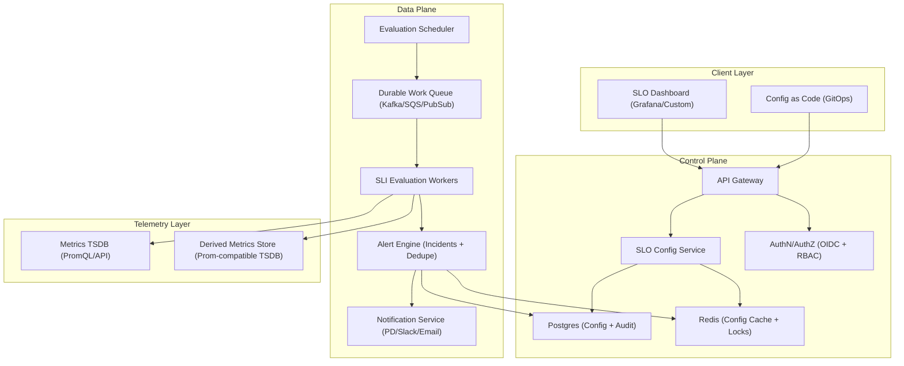
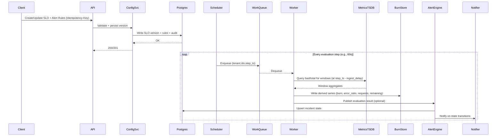

## Overview

SLO/error-budget monitoring turns raw reliability telemetry (requests, errors, latency) into actionable signals: **error budget remaining**, **burn rate** over multiple rolling windows, and **alerts** that page humans only when the SLO is meaningfully at risk.

A production-grade solution must:
1. Support flexible **SLI** definitions per service/tenant (availability, latency, correctness).
2. Compute burn rate **correctly** (counter resets, missing data, low traffic) and **efficiently** at scale.
3. Trigger **multi-window burn-rate alerts** that catch both fast outages and slow regressions while minimizing flapping and false positives.

The key idea is to normalize “badness” by the allowed error budget and alert on **burn rate** (budget consumption speed), not raw error rate.

## Glossary

- **SLO (Service Level Objective)**: Target reliability over a period (e.g., *99.9% over 30 days*).
- **SLI (Service Level Indicator)**: How reliability is measured (e.g., *fraction of requests that are not 5xx*).
- **Error budget**: Allowed unreliability over the period. For objective `O`, allowed error fraction is `1 - O`.
- **Burn rate**: How fast the error budget is being consumed relative to steady-state.
- **Multi-window alert**: Require a short window and a long window to both breach thresholds (fast detection + anti-flake).

## Requirements

### Functional Requirements
- CRUD SLOs with objective (e.g., 99.9% over 30d) and SLI definitions:
  - Availability (errors/total)
  - Latency (good/total using histogram buckets)
  - Correctness (valid/total)
  - Custom (advanced)
- Compute for each SLO:
  - Burn rate across multiple rolling windows (e.g., `5m/1h` and `30m/6h`)
  - Error budget remaining over the SLO period
  - Time-to-exhaustion estimate (ETA) at current burn
- Trigger alerts:
  - Multi-window burn-rate rules (page vs ticket)
  - Remaining-budget and/or exhaustion-ETA rules
  - Incident deduplication, routing, and escalation
- Multi-tenant isolation (org/project), RBAC, and audit logs for config changes.
- Drill-down from alert → underlying SLI query results (and safe breakdowns by region/cluster/endpoint).
- Integrate with existing telemetry stacks via adapters:
  - Prometheus-compatible query API (Prometheus/Mimir/Thanos)
  - OpenTelemetry metrics (via Prometheus bridge or native backend)
  - Vendor APIs (Datadog/New Relic) where needed

### Non-Functional Requirements
- **Scale (target)**:
  - Tenants: 100–1,000 orgs
  - SLOs: 10,000–100,000 total
  - Default evaluation step: 60s (configurable 30–120s)
  - Default windows per SLO: 4–6 (e.g., 5m, 30m, 1h, 6h, 3d)
- **Latency**:
  - Fast-burn paging detection: P50 < 60s, P99 < 180s from *telemetry availability* (includes ingestion delay)
  - API read (current status): P95 < 200ms (cached), P99 < 1s
  - Dashboard queries: P95 < 2s (derived series), P95 < 5s (raw deep dive)
- **Availability**:
  - Data plane (evaluation → incident state): 99.99% within a region (multi-AZ)
  - Control plane (CRUD/config): 99.9%
- **Consistency**:
  - SLO/config writes: strong consistency (single source of truth)
  - Computed burn/status: eventual, bounded by `metrics_ingest_delay + evaluation_step + processing_time`
- **Durability**:
  - Config/audit: RPO ~ 0, RTO < 1 hour
  - Derived burn time series: recomputable; acceptable to lose minutes, not days (support backfill)

### Constraints & Assumptions
- A metrics backend exists (Prometheus-compatible TSDB such as Mimir/Thanos/Prometheus) with query API.
- Team size: 4–8 engineers; prefer operational clarity and proven patterns.
- Compliance: RBAC, audit logs, encryption in transit/at rest; no PII required for SLIs.
- Start **single region, multi-AZ active/active** for the data plane; add multi-region DR later.

## High-Level Architecture



**Control plane vs data plane**:
- The control plane manages SLO definitions, RBAC, and audit logs (strong consistency).
- The data plane continuously evaluates SLIs, computes burn/remaining budget, and manages incidents (eventual consistency with bounded staleness).

**Why derived series?**
- Alerting and dashboards should read **derived burn-rate series** to avoid repeated expensive raw range queries and to standardize semantics across tools. Raw metrics remain the source of truth for deep dives and recomputation/backfill.

## Core Concepts & Algorithms

### SLI and Burn-Rate Computation

For each window `W`:
- `allowed_error_fraction = 1 - objective`
- `total(W) = total_events over window W`
- `bad(W) = bad_events over window W`
- `error_ratio(W) = bad(W) / total(W)` (when `total(W) > 0`)
- `burn_rate(W) = error_ratio(W) / allowed_error_fraction`

Burn rate is interpretable:
- **Time to exhaust budget at burn B** (steady burn): `period / B`
- **Budget consumed over duration T** (steady burn): `B * (T / period)`

Example (99.9% over 30d):
- Error budget = 0.1% of requests (time-equivalent is ~43.2 minutes of total downtime if availability SLI is binary)
- Burn rate `B=1` consumes the full budget over 30d
- Burn rate `B=14.4` consumes ~2% of budget per hour (`14.4 / 720`)

### Low-Traffic and Data Quality Guardrails
Ratios are noisy when traffic is low or missing. Each SLO version defines:
- `min_requests` per window (e.g., 100 for 5m, 1,000 for 1h; configurable)
- Data quality states per window:
  - `OK`
  - `INSUFFICIENT_DATA` (below `min_requests`)
  - `STALE` (no new samples beyond ingest-delay threshold)
  - `QUERY_ERROR` (backend failure/timeouts)
Paging rules should suppress on `INSUFFICIENT_DATA` and typically avoid paging on `QUERY_ERROR` (page the monitoring platform instead).

### Multi-Window Burn Alerts (Proven Default)
A common pattern (for 30d SLOs) is two rules:
- **Fast burn (page)**: `(5m AND 1h)` with high thresholds and a short `for`
- **Slow burn (ticket)**: `(30m AND 6h)` with lower thresholds and a longer `for`

Thresholds can be preset (industry defaults) and/or derived from “budget to consume in time T”:
- `threshold ≈ (budget_fraction_to_consume * period) / T`

## Component Deep-Dive

### SLO Config Service
**Responsibility**: CRUD SLOs, SLI templates, alert policies, routing, RBAC, audit logs.

**Key decisions**
- **Versioned SLOs**: Store immutable versions + an active pointer for safe rollout and reproducibility.
- **Query validation**: Lint + dry-run queries against the metrics backend with cost/complexity checks (timeouts, max selectors, required aggregation).

**Suggested tech**
- Go/Java + Postgres
- Redis for short TTL caches and lightweight coordination (optional)

---

### Evaluation Scheduler
**Responsibility**: Determine what to evaluate, when; enforce per-tenant fairness; enqueue work aligned to evaluation steps.

**Key decisions**
- Align evaluation timestamps (e.g., per-minute boundaries) and apply an **ingestion delay offset** (e.g., evaluate `now - 120s`) to avoid partial windows.
- Maintain per-SLO watermark (`last_evaluated_step`) and support catch-up after downtime with backpressure.

**Suggested tech**
- Stateless schedulers + durable queue (Kafka/SQS/PubSub)
- Partition by `(tenant_id, slo_id)` to keep ordering and simplify dedupe

---

### SLI Evaluation Workers
**Responsibility**: Execute SLI queries for required windows and compute derived values (burn, remaining budget, ETA).

**Key decisions**
- Use counter-safe window aggregation:
  - Prometheus-style: `sum(increase(counter[W]))`
- Limit TSDB impact:
  - Per-tenant and global concurrency caps
  - Query timeouts and exponential backoff
  - Optional result caching keyed by `(query, window, step_ts)`
- Support two execution modes:
  1. **Direct evaluation** (workers query raw SLI counters)
  2. **Recorded base metrics** (preferred at high scale): generate recording rules to precompute `good`/`total` rates per service, then workers only aggregate and normalize

---

### Alert Engine (Incidents + Dedupe)
**Responsibility**: Evaluate alert rules, manage incident state, dedupe notifications, route by ownership.

**Key decisions**
- Deduplicate by stable fingerprint `(tenant_id, slo_id, rule_id)` and only emit notifications on state transitions.
- Flap resistance:
  - Require `for` duration on firing
  - Optional `resolve_for` (minimum healthy duration before resolve)
- Correlation:
  - Group by `(service, region)` to reduce alert storms during shared outages

State storage options:
- Postgres for incident history + correctness
- Redis for hot state and fast failover (with persistence), if needed

---

### Notification Service
**Responsibility**: Deliver notifications and handle provider-specific retries, rate limits, and idempotency.

**Key decisions**
- Provider adapters (PagerDuty/Slack/Email/Webhook) with:
  - Idempotency keys (incident fingerprint + state)
  - Retry with jitter and dead-letter queue
  - Provider rate-limit handling

---

### Derived Metrics Store (Burn Store)
**Responsibility**: Store burn-rate and related derived time series for fast reads and dashboards.

**Key decisions**
- Write a small, controlled set of derived metrics with strict label hygiene to avoid cardinality explosions.
- Retention tiers:
  - 1m resolution for 14–30 days
  - 5m–1h downsample for 90–180 days
- Backfill support: recompute from raw metrics for gaps/outages.

**Note on duplicates**
Prometheus-compatible TSDBs can reject duplicate samples at the same timestamp for a series. Prevent this by ensuring a single writer per `(tenant_id, slo_id, window)` per step timestamp (queue partitioning + in-flight locks), and avoid “retrying identical timestamp writes” without dedupe.

## Data Model

### Control Plane (Postgres)

- `tenants(tenant_id, name, created_at)`
- `slo(slo_id, tenant_id, name, service, objective, period_seconds, enabled, created_at)`
- `slo_version(slo_version_id, slo_id, version, sli_type, good_query, total_query, bad_query, min_requests_json, labels_json, created_at)`
- `alert_policy(policy_id, tenant_id, name, enabled, routing_json, created_at)`
- `alert_rule(rule_id, policy_id, slo_id, rule_type, windows_json, for_seconds, severity, created_at)`
- `incident(incident_id, tenant_id, slo_id, rule_id, state, started_at, ended_at, fingerprint, last_evaluated_at)`
- `audit_log(id, tenant_id, actor, action, resource_type, resource_id, before_json, after_json, created_at)`

Recommended constraints:
- Unique `(tenant_id, slo_id, version)` in `slo_version`
- Unique `(tenant_id, fingerprint, state)` for active incidents (or enforce via application logic)

### Derived Metrics (Burn Store)

Recommended label set (keep small and bounded):
- Required: `tenant`, `slo_id`, `service`
- Optional (bounded): `region`, `cluster`
- Avoid: high-cardinality dimensions like `user_id`, raw `path`, request IDs

Example metrics:
- `slo_burn_rate{window="5m"}`
- `slo_error_ratio{window="5m"}`
- `slo_requests{window="5m"}`
- `slo_budget_remaining` (0..1 over the SLO period)
- `slo_exhaustion_eta_seconds` (optional)

## Data Flow



## API Design

### REST (Control Plane + Reads)

**Create SLO**
- `POST /v1/tenants/{tenantId}/slos`
- Headers: `Idempotency-Key: <uuid>`
- Request:
```json
{
  "name": "checkout-availability",
  "service": "checkout",
  "objective": 0.999,
  "periodSeconds": 2592000,
  "evaluationStepSeconds": 60,
  "sli": {
    "type": "availability",
    "totalQuery": "sum(increase(http_requests_total{service=\"checkout\"}[{{window}}]))",
    "badQuery": "sum(increase(http_requests_total{service=\"checkout\",code=~\"5..\"}[{{window}}]))",
    "minRequests": { "5m": 100, "1h": 1000 }
  }
}
```

**Get SLO status**
- `GET /v1/tenants/{tenantId}/slos/{sloId}/status?windows=5m,1h,6h,3d`
- Response:
```json
{
  "sloId": "uuid",
  "objective": 0.999,
  "periodSeconds": 2592000,
  "asOf": "2025-01-01T00:00:00Z",
  "budgetRemaining": 0.62,
  "burnRates": { "5m": 12.1, "1h": 5.4, "6h": 1.2, "3d": 0.9 },
  "dataQuality": { "5m": "OK", "1h": "OK", "6h": "INSUFFICIENT_DATA", "3d": "OK" },
  "exhaustionEtaSeconds": 172800
}
```

**Create alert policy**
- `POST /v1/tenants/{tenantId}/alert-policies`
- Request:
```json
{
  "name": "checkout-alerts",
  "rules": [
    {
      "type": "multi_window_burn",
      "windows": [
        { "window": "5m", "threshold": 14.4 },
        { "window": "1h", "threshold": 6.0 }
      ],
      "forSeconds": 120,
      "severity": "page"
    },
    {
      "type": "multi_window_burn",
      "windows": [
        { "window": "30m", "threshold": 3.0 },
        { "window": "6h", "threshold": 1.0 }
      ],
      "forSeconds": 600,
      "severity": "ticket"
    }
  ],
  "routing": {
    "pagerdutyIntegrationKeyRef": "secret://pd/checkout",
    "slackChannel": "#oncall-checkout"
  }
}
```

### Error Handling
Consistent envelope:
```json
{ "error": { "code": "INVALID_QUERY", "message": "…", "details": {} } }
```

Semantics to distinguish:
- `INSUFFICIENT_DATA` (not an error; suppress paging)
- `EVAL_DELAYED` (system lag; page internal SRE if sustained)
- `QUERY_ERROR` (metrics backend issues; retry/backoff; alert monitoring platform)

### Idempotency
- `Idempotency-Key` required for creates; store request hash + response for 24h.
- Updates create new `slo_version` and atomically flip active version (idempotent from the client perspective).

## Scaling & Performance

### Primary Bottlenecks
- **TSDB query fanout**: `SLOs × windows × queries`.
  - Mitigations:
    - Prefer recorded base metrics at high scale (record `good`/`total` per service)
    - Batch and cache window aggregates
    - Concurrency caps per tenant and per TSDB shard
- **Cardinality explosion** from unsafe label sets.
  - Mitigations:
    - Enforce aggregation in SLI queries
    - Label allowlists and “no unbounded labels” policy
    - Per-tenant budgets and circuit breakers
- **Alert storms** during shared outages.
  - Mitigations:
    - Correlation/grouping by service/region
    - Rate limits and escalation policies
    - Separate “monitoring platform down” incident that suppresses dependent SLO paging

### Horizontal Scaling Strategy
- **Config/API**: stateless; Postgres primary + replicas; cache reads (TTL 30–60s) with invalidation on writes.
- **Scheduler**: scale horizontally; partition ownership by `(tenant_id, hash(slo_id))`.
- **Workers**: autoscale by queue depth and TSDB latency; shard by `(tenant_id, slo_id)`; enforce per-tenant QPS limits.
- **Alert Engine**: partition by tenant/rule; store hot state in Redis if needed, canonical history in Postgres.

### Partitioning Strategy
- Primary isolation: `tenant_id` (hard fairness and quotas)
- Secondary distribution: `hash(slo_id) mod N` (balance)
- Explicit “noisy tenant” protection:
  - concurrency caps
  - query cost limits
  - priority tiers (page rules > ticket rules > dashboards)

### Caching
- **Config cache**: SLO versions and rules, TTL 30–60s, invalidated via pub/sub event on changes.
- **Query result cache**: short-lived cache keyed by `(query, window, aligned_step_ts)` to dedupe redundant evaluations.
- **Derived series**: alerts and dashboards read derived metrics for fast paths.

## Trade-offs & Alternatives

### Key Trade-offs
- **Derived burn series stored and reused**
  - Cost: additional write amplification and retention management
  - Benefit: predictable alert semantics and much lower raw-query load
- **Custom alert engine vs Prometheus Alertmanager-only**
  - Cost: more code/state to operate
  - Benefit: multi-tenant RBAC, incident dedupe, routing, and governance at scale
- **Guardrails (min traffic, query linting, quotas)**
  - Cost: more configuration and “unknown” states
  - Benefit: dramatically fewer false positives and safer multi-tenant operation
- **Recorded base metrics (optional)**
  - Cost: managing recording rules lifecycle
  - Benefit: order-of-magnitude reduction in expensive range queries at high SLO counts

### Alternative Approaches
- **Prometheus-only (recording rules + Alertmanager; Sloth/Pyrra)**
  - Pros: simplest if already standardized on Prometheus tooling; proven defaults
  - Cons: multi-tenant governance and quota enforcement are harder; rule sprawl at very large scale
- **Streaming aggregation (Kafka + Flink/Samza)**
  - Pros: strong control over aggregation and dimensions at massive throughput
  - Cons: heavier ops, complex correctness; often unnecessary if SLIs already exist as metrics
- **Log-based SLI (ELK/ClickHouse)**
  - Pros: rich slicing and joins
  - Cons: expensive for near-real-time alerting; more moving parts and ingestion cost

## Failure Modes & Mitigations

### Metrics TSDB degraded/unavailable
- **Impact**: late/missed evaluations; risk of blind paging if misconfigured
- **Detection**: query error rate, query latency, evaluation lag, missing-samples rate
- **Mitigation**: retry/backoff; mark SLO windows as `QUERY_ERROR`; page internal “monitoring platform down”; degrade SLO paging (fail closed for SLO alerts, fail open for platform alerts)

### Work queue backlog / scheduler lag
- **Impact**: stale burn rates, delayed alerting
- **Detection**: queue depth, oldest message age, per-tenant lag distribution
- **Mitigation**: autoscale workers; enforce per-tenant fairness; prioritize paging rules; temporarily increase evaluation step; shed low-priority workloads

### Bad SLO query (expensive or incorrect)
- **Impact**: TSDB overload or incorrect alerts
- **Detection**: query lint/cost estimation, dry-run validation, runtime query timeouts, anomaly detection on derived series
- **Mitigation**: guardrails (timeouts, max selectors, required aggregation); per-tenant circuit breaker; version rollback to last known-good; require approval workflow for high-cost queries

### Duplicate/Flapping notifications
- **Impact**: oncall fatigue
- **Detection**: duplicate incident fingerprints; rapid state churn; notifier delivery anomalies
- **Mitigation**: incident state machine with transition-only notifications; `for` on firing; `resolve_for`; idempotent notifier keys; provider rate limits and DLQs

### Low traffic / missing series
- **Impact**: noisy ratios or misleading “healthy”
- **Detection**: `total(W)` below thresholds; stale series; ingestion delay spikes
- **Mitigation**: `min_requests` gating; prefer longer windows for low-traffic services; optionally use statistical confidence (advanced); clearly surface `INSUFFICIENT_DATA` in dashboards and APIs

## Operations

### Monitoring This System
Key internal metrics:
- Evaluation: `eval_lag_seconds` (P50/P99), `eval_success_rate`, `tsdb_query_latency_ms`, `tsdb_query_error_rate`, `worker_utilization`
- Queue: `queue_oldest_age_seconds`, `queue_depth`, per-tenant lag
- Alerting: `incidents_firing`, `incident_state_churn_rate`, `notification_success_rate`, `notification_latency_ms`
- Data quality: `%INSUFFICIENT_DATA`, `%QUERY_ERROR`, missing-series rate, cardinality/quota usage

Example internal alerts:
- Page internal SRE if `eval_lag_seconds_p99 > 180` for 10m
- Page internal SRE if `tsdb_query_error_rate > 5%` for 5m
- Ticket if any tenant exceeds cardinality quota by >10% for 1h

### Deployment & Rollout
- Canary by tenant cohort (e.g., 5% → 25% → 100%)
- Backward-compatible schema migrations (expand → deploy → contract)
- Shadow mode for evaluator changes (run both, compare, then switch)

### Security
- AuthN: OIDC/JWT at gateway; mTLS between services where available
- AuthZ: RBAC scoped to tenant/project; least-privilege for integrations
- Secrets: store notifier integration keys in a secrets manager (references in config)
- Audit: immutable audit log for SLO/rule changes and access to sensitive routing config

### Disaster Recovery
- Control plane: Postgres WAL shipping + snapshots; periodic restore tests; RTO < 1h, RPO ~ 0
- Data plane: stateless services across AZs; queue and cache with multi-AZ support
- Derived metrics: rely on TSDB replication; support backfill from raw metrics after outages

## References & Further Reading
- Google SRE Book: Monitoring Distributed Systems; Managing Incidents
- Google SRE Workbook: SLOs, Error Budgets, and Multi-window Burn-rate Alerting
- Prometheus docs: `rate()`, `increase()`, recording rules, Alertmanager
- Sloth and Pyrra: practical SLO burn-rate alert rule generation
- Cortex/Mimir/Thanos docs: scalable Prometheus-compatible TSDB architectures