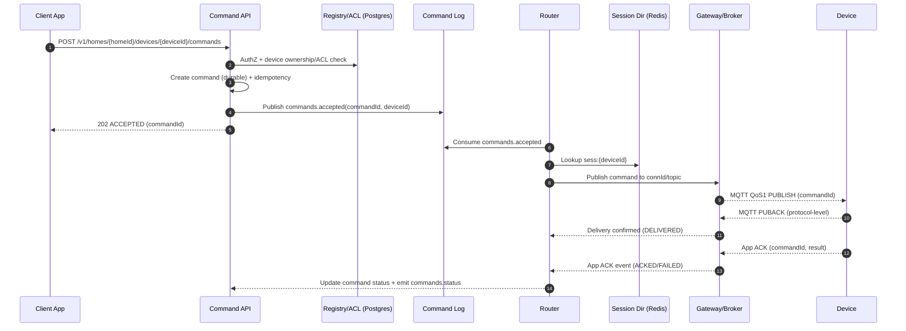
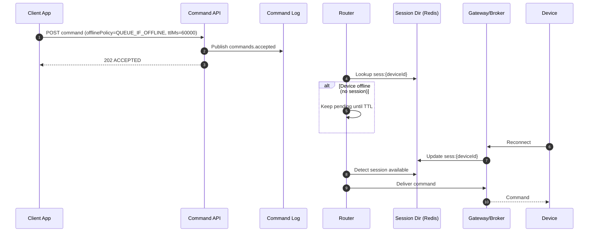

## Overview

A smart home backend must deliver user commands (e.g., “unlock door”, “turn on lights”) to devices that are frequently behind NATs, carrier-grade NAT, and restrictive firewalls—so the cloud generally cannot initiate inbound connections to devices. The core challenge is achieving **reliable command delivery** and a **coherent user experience** while devices roam networks, drop connections, and intermittently go offline.

The standard approach is to invert connectivity: devices maintain **long-lived outbound, authenticated connections** to the cloud (MQTT over TLS, MQTT-over-WebSocket, or HTTP/2). The backend routes commands over those existing sessions. This requires:
- A fast **session directory** (device → which gateway/broker currently holds the connection).
- A **durable command pipeline** with explicit semantics (accepted vs delivered vs acknowledged).
- A **device shadow** model (desired vs reported) to provide eventual convergence and UX continuity.

This document describes a production-ready architecture with concrete scale targets, latency/availability SLOs, failure handling, and operational guidance.

## Goals and Non-Goals

### Goals
- Deliver commands with clear guarantees and observable status transitions.
- Support intermittent connectivity and offline delivery where safe.
- Maintain a device shadow (desired/reported) with conflict-safe updates.
- Scale to millions of concurrent connections with multi-tenant isolation.
- Provide strong security primitives (device identity, least privilege, auditability).

### Non-Goals
- Replacing local LAN control; local-first hubs can be layered on later.
- Real-time hard control loops (e.g., sub-10ms industrial control).
- Performing heavy analytics in the critical path (analytics is eventually consistent).

## Requirements

### Functional Requirements
- Device onboarding and secure provisioning (pairing a device to a home/user).
- Maintain device connectivity through NAT/firewalls via outbound long-lived sessions.
- Send commands to a specific device with **durable acceptance**, delivery attempts, and device acknowledgements.
- Support offline devices: queue *eligible* commands (with TTL) and deliver on reconnect; reject unsafe commands when offline.
- Ingest telemetry and state updates (sensor readings, battery, device presence).
- Provide device shadow (desired/reported) and explain convergence semantics to clients.
- Push real-time events to clients (command status, presence, shadow changes).
- Multi-tenant isolation: users/homes/devices permissions, rate limits, and auditing.

### Non-Functional Requirements

#### Scale (with realism checks)
Assume:
- **10M registered devices**
- **1M concurrently connected** (10% concurrency)
- **Telemetry**: average 0.2 msg/s/connected device, peak 1 msg/s for bursts

Targets:
- **Command API peak**: 20K commands/s (bursty “everyone toggles lights after outage” scenario).  
  Note: 100K QPS is possible but typically requires aggressive partitioning, higher infra cost, and strict rate limits; design should scale horizontally to reach it if needed.
- **Telemetry ingest peak**: 1M msgs/s (short bursts; sustained lower).
- **Shadow updates**: up to 1B/day (~11.6K/s average), bursty.

#### Latency (achievable SLOs)
Separate *cloud internal* from *end-to-end over the Internet*:

- **Cloud internal (API → router → gateway publish)**:
  - P50 20ms, P99 100ms (within region)
- **End-to-end command (client → cloud → device app-level ack)** for online devices:
  - P50 200ms, P99 1.5s (Internet + cellular variability dominates)
- **Shadow read (API)**:
  - P99 75ms (region-local)
- **Telemetry to durable log**:
  - P99 200ms (ack when appended to log/broker)

#### Availability & Durability
- **Command acceptance API**: 99.99% (regional), multi-AZ.
- **Connectivity gateway/broker**: 99.99% (regional), multi-AZ.
- **Event streaming/analytics**: 99.9% acceptable.
- **Durability**:
  - If a command is returned as `ACCEPTED`, it is durably recorded (RPO ≤ 1 minute, typically near-zero).
  - Telemetry is best-effort under overload; drop/sampling is explicit and observable.

#### Consistency Model
- **Strong consistency** for: auth, pairing, ACL enforcement, command creation, idempotency keys.
- **Eventual consistency** for: shadow convergence, presence, analytics aggregates.
- **Ordering**: per-device ordering for commands that require it (via partitioning by `deviceId`).

### Constraints & Assumptions
- Devices cannot accept inbound connections; only outbound TCP/QUIC on commonly open ports (443) is reliable.
- Device CPU/RAM constrained; prefer compact payloads and lightweight protocols.
- Compliance baseline: secure SDLC, auditable sensitive actions, key management, least privilege, basic tenant isolation.

## High-Level Architecture

### Control Plane vs Data Plane
- **Control plane**: onboarding, identity, ACLs, device registry.
- **Data plane**: device connectivity, command routing, telemetry ingestion, shadows.

```mermaid
flowchart TB
  subgraph Clients
    App[Mobile/Web Apps]
    Admin[Admin/Support Tools]
  end

  subgraph Edge["Internet / NAT / CGNAT"]
    Dev[Devices]
  end

  subgraph RegionA["Region (Multi-AZ)"]
    APIGW[API Gateway / WAF]
    Auth[AuthN/AuthZ Service]
    CmdAPI[Command API]
    ShadowAPI[Shadow API]
    Events[Events API (SSE/WebSocket)]

    Broker[MQTT Broker / Connection Gateway Fleet]
    SessDir[(Session Directory: Redis)]
    CmdLog[(Event Log: Kafka/Pulsar)]
    TeleLog[(Telemetry Log)]
    Reg[(Registry & ACL DB: Postgres)]
    ShadowDB[(Shadow Store: DynamoDB/Cassandra)]
    Audit[(Audit Log Store)]
    Router[Command Router / Delivery Workers]
  end

  App --> APIGW
  Admin --> APIGW
  APIGW --> Auth
  APIGW --> CmdAPI
  APIGW --> ShadowAPI
  APIGW --> Events

  CmdAPI --> Reg
  CmdAPI --> CmdLog
  CmdAPI --> Audit

  Router --> CmdLog
  Router --> SessDir
  Router --> Broker
  Router --> CmdAPI

  ShadowAPI --> ShadowDB
  ShadowAPI --> Reg

  Broker <--> Dev
  Broker --> SessDir
  Broker --> TeleLog
  Broker --> CmdLog

  TeleLog --> CmdLog
```

### Key Design Choice
Devices connect outbound to the **Broker/Gateway Fleet** (MQTT/TLS on 443; fallback to MQTT-over-WebSocket on 443). The broker/gateway updates the **Session Directory** so the router can deliver commands directly to the correct node without broadcast fanout.

## Core Concepts (Educational)

### Command Lifecycle (what statuses mean)
- `ACCEPTED`: command is durably stored; delivery may not have occurred yet.
- `DISPATCHED`: router handed the command to the gateway/broker for delivery.
- `DELIVERED`: protocol-level delivery confirmed (e.g., MQTT QoS1 PUBACK from client).
- `ACKED`: device sent an application-level acknowledgement with result.
- `FAILED`: terminal failure (rejected by policy, expired TTL, permanently undeliverable).
- `TIMED_OUT`: device did not ack within `timeoutMs` (delivery may have occurred).

This separation avoids a common anti-pattern: equating “API 200 OK” with “device acted.”

### Offline Policy (safety first)
Commands are classified:
- **Online-only** (e.g., *unlock door*): reject if device offline.
- **Queueable** (e.g., *set thermostat*): queue with TTL and deliver on reconnect.

## Component Deep-Dive

### MQTT Broker / Connection Gateways (Data Plane)
**Responsibilities**
- Terminate device connections and authenticate devices.
- Maintain keepalives and session resumption.
- Deliver commands and receive telemetry/acks.
- Publish presence events (connect/disconnect/last-seen).

**Design Decisions**
- **Outbound long-lived connections** over 443 to traverse NAT/firewalls.
- **Protocol fallback**: MQTT/TLS → MQTT-over-WebSocket → optional HTTP/2 streams (for restrictive proxies).
- **Session semantics**:
  - Use MQTT persistent sessions when appropriate (careful with broker-side queue growth).
  - Prefer storing *server-side offline queue* in a durable system (event log / command store) rather than relying solely on broker offline buffering.

**Technology Choices**
- Managed/self-hosted MQTT broker (EMQX/HiveMQ/Mosquitto+custom extensions) or a custom gateway fleet with MQTT libraries.
- mTLS or token-based device auth (mTLS preferred for high-assurance devices like locks).

**Scaling**
- Scale by concurrent sockets per node; keep per-connection memory bounded.
- Use multi-AZ load balancing; devices reconnect on node failure.
- Emit `deviceId -> nodeId/region/connId` heartbeats into Redis with TTL.

### Session Directory (Redis)
**Responsibility**
- Fast mapping `deviceId -> {region, nodeId, connId, lastSeen, protocol}` for routing.

**Design**
- Keys: `sess:{deviceId}` with TTL of ~2–3× keepalive interval.
- Update on connect, reconnect, disconnect (best-effort) + TTL expiry for safety.
- Add a small in-process cache in router (1–2s TTL) to reduce Redis QPS.

**Failure Consideration**
Redis must be multi-AZ with clear behavior under partition (see Failure Modes).

### Command API Service (Control + Data Plane boundary)
**Responsibilities**
- Authenticate and authorize user requests.
- Enforce per-tenant rate limits and safety policy (online-only vs queueable).
- Create commands durably; enforce idempotency.
- Expose command status to clients and emit events.

**Design**
- **Durable acceptance**: return `ACCEPTED` only after the command is written to durable storage (DB + event log).
- **Idempotency**: `Idempotency-Key` scoped to `(homeId, deviceId, userId)` and hashed request body.
- **Audit**: sensitive commands (locks, alarms) append to an immutable audit log with actor, IP, device, and reason.

**Storage Choices**
- Postgres for registry/ACL/idempotency and command metadata.
- Event log (Kafka/Pulsar) for routing events and status transitions.

### Command Router / Delivery Workers
**Responsibilities**
- Consume accepted commands from the event log.
- Look up current session from Session Directory.
- Deliver to the correct gateway/broker node with retries and backoff.
- Update command status and publish status events to clients.

**Delivery Semantics**
- **At-least-once delivery** to the device connection (network failures cause retries).
- Devices must implement **de-duplication** by `commandId` and **idempotent actuation** (or “exactly-once effect” via dedup + idempotency).

**Retry Policy (example)**
- Online device: exponential backoff (50ms, 200ms, 1s) up to `timeoutMs`.
- Offline device:
  - If `offlinePolicy=QUEUE_IF_OFFLINE`: keep pending until TTL or max attempts on reconnect.
  - If `offlinePolicy=REJECT_IF_OFFLINE`: fail fast with `FAILED:OFFLINE`.

### Shadow Service
**Responsibilities**
- Maintain `{desired, reported, version, timestamps, metadata}` per device.
- Provide list and read APIs for clients and automations.
- Reconcile writes safely and make convergence explicit.

**Design**
- **Optimistic concurrency**: `If-Match: <version>` for desired writes.
- Device updates `reported` and can optionally clear fulfilled desired fields.
- Store metadata: `updatedAt`, `updatedBy`, `source`, and `correlationId` (often `commandId`).

**Storage**
- DynamoDB/Cassandra keyed by `deviceId` for high write throughput.
- Optional GSI/index for `homeId` to list devices; alternatively keep device list in Postgres and fetch shadows by batch.

### Device Registry & Auth/ACL (Postgres)
**Responsibilities**
- Device identity, ownership, capabilities, and enrollment state.
- User/home membership and permissions.
- Certificate/public key management references (actual keys in Vault/HSM).

**Design**
- Device auth via mTLS with per-device certs (or device token bound to hardware key).
- Fine-grained ACL: `user/home -> device -> allowedActions`, with caching.

### Telemetry Ingest (Event Log + Stream Processing)
**Responsibilities**
- Ingest telemetry at high volume without impacting command latency.
- Store durable raw streams (short retention) and derived aggregates (longer retention).
- Apply backpressure and shedding rules explicitly.

**Design**
- Separate topics/streams for telemetry vs commands; enforce quotas so telemetry cannot starve commands.
- Optionally sample high-rate sensors (e.g., power usage) under overload; expose sampling ratios.

## Data Model

### PostgreSQL (Registry / ACL / Commands)

**Table: `devices`**
- `device_id` (PK, ULID)
- `home_id` (FK)
- `model`
- `capabilities` (JSONB)
- `status` (enum: `active`, `blocked`, `decommissioned`)
- `created_at`, `updated_at`

**Table: `device_credentials`**
- `device_id` (PK/FK)
- `cert_fingerprint`
- `public_key_ref` (reference to Vault/HSM)
- `rotated_at`
- `revoked_at` (nullable)

**Table: `home_memberships`**
- `home_id`, `user_id` (composite PK)
- `role` (enum: `owner`, `admin`, `member`, `guest`)
- `created_at`

**Table: `device_acl`** (optional if derived from roles/capabilities)
- `home_id`, `user_id`, `device_id` (composite)
- `allowed_actions` (JSONB/bitset)
- `updated_at`

**Table: `commands`**
- `command_id` (PK, ULID)
- `home_id`, `device_id`, `user_id`
- `type`
- `parameters` (JSONB)
- `offline_policy` (enum: `REJECT_IF_OFFLINE`, `QUEUE_IF_OFFLINE`)
- `timeout_ms`, `ttl_ms`
- `status` (enum lifecycle)
- `created_at`, `updated_at`

**Table: `command_idempotency`**
- `scope_key` (e.g., hash of `homeId+deviceId+userId`)
- `idempotency_key`
- `request_hash`
- `command_id`
- `expires_at`
Unique constraint on `(scope_key, idempotency_key)`.

### Shadow Store (DynamoDB/Cassandra)
**Table: `device_shadow`**
- `device_id` (PK)
- `version` (int)
- `desired` (map/json)
- `reported` (map/json)
- `updated_at`
- `updated_by` (enum: `user`, `device`, `automation`)
- `last_command_id` (nullable, for correlation)

### Redis (Session Directory)
- Key: `sess:{deviceId}`
- Value: `{region, node_id, conn_id, last_seen_ms, protocol, broker_epoch}`
- TTL: 120–180s (assuming 60s keepalive)

### Event Log (Kafka/Pulsar)
- Topic: `commands.accepted` (key: `device_id`)
- Topic: `commands.status` (key: `command_id`)
- Topic: `device.presence` (key: `device_id`)
- Topic: `telemetry.raw` (key: `device_id` or `home_id` depending on ordering needs)
- Topic: `shadow.events` (key: `device_id`)

Retention guidance (example):
- Commands: 7–30 days (for replay/debugging)
- Presence: 1–3 days
- Telemetry raw: 1–7 days (then downsample/aggregate)

## Data Flows

### Online Command (Fast Path)



### Offline Command (Queueable)



## API Design

### Send Command
`POST /v1/homes/{homeId}/devices/{deviceId}/commands`

Headers:
- `Authorization: Bearer <token>`
- `Idempotency-Key: <uuid>` (required)

Request:
```json
{
  "type": "LOCK_SET",
  "parameters": { "locked": true },
  "offlinePolicy": "REJECT_IF_OFFLINE",
  "timeoutMs": 5000,
  "ttlMs": 60000
}
```

Response (accepted):
```json
{
  "commandId": "01J...ULID",
  "status": "ACCEPTED",
  "acceptedAt": "2025-12-17T12:00:00Z"
}
```

Error cases:
- `401/403`: auth or ACL failure
- `404`: device not in home / not found
- `409`: idempotency key reused with different payload
- `412`: conditional policy failure (e.g., `REJECT_IF_OFFLINE` and device offline, if you choose to fail fast)
- `429`: rate limited
- `503`: regional dependency unavailable (no `ACCEPTED` unless durable write succeeded)

Idempotency rule:
- Store `(scope, idempotencyKey) -> commandId + requestHash` for 24h.

### Command Status
`GET /v1/commands/{commandId}`

Response:
```json
{
  "commandId": "01J...ULID",
  "status": "ACCEPTED|DISPATCHED|DELIVERED|ACKED|FAILED|TIMED_OUT",
  "deviceAck": { "code": "OK", "details": { } },
  "timestamps": {
    "acceptedAt": "2025-12-17T12:00:00Z",
    "deliveredAt": "2025-12-17T12:00:00.250Z",
    "ackedAt": "2025-12-17T12:00:00.400Z"
  }
}
```

### Device Shadow
`GET /v1/homes/{homeId}/devices/{deviceId}/shadow`

`PATCH /v1/homes/{homeId}/devices/{deviceId}/shadow/desired`
- Header: `If-Match: <version>` for optimistic concurrency.

### Realtime Events (Clients)
- `GET /v1/events` (SSE) and/or `wss://.../v1/events` (WebSocket)
- Event types:
  - `command.status`
  - `device.presence`
  - `shadow.updated`

## Scaling & Performance

### Critical Hot Paths
- **Session lookup** on every command: Redis + tiny in-process cache.
- **Broker publish** path: ensure low-latency intra-region networking; avoid cross-region routing in the normal path.
- **Per-device ordering**: partition `commands.accepted` by `deviceId` so one consumer processes a device’s commands in order.

### Capacity Planning (back-of-the-envelope)
- **Session directory size**: ~1M sessions × ~200B/value ≈ 200MB raw; plan 2–5× for overhead → a few GB Redis cluster is sufficient.
- **Connections per gateway node**: depends on implementation; plan conservatively (e.g., 50K–150K connections/node) and benchmark.
- **Command log partitions**: start with 256–1024 partitions (depends on peak QPS and consumer scaling).
- **Telemetry**: isolate brokers/topics and enforce quotas so telemetry bursts do not impact commands.

### Backpressure and Load Shedding
- Prioritize commands over telemetry at every shared resource:
  - Separate broker listeners/threads where possible.
  - Separate Kafka topics with quotas.
  - Drop/sampling only on telemetry; never silently drop accepted commands.
- Rate limit per home/user/device to prevent noisy neighbor issues.

### Caching Strategy
- Session cache: Redis source of truth; router LRU cache (1–2s TTL).
- Registry/ACL: cache per `(userId, homeId)` and `(deviceId)` for 30–120s with invalidation via membership change events.
- Shadow reads: short cache (1–5s) and rely on events for freshness.

## Consistency, Ordering, and Idempotency

- **Command creation** is strongly consistent (single primary per region for the relevant Postgres shard/cluster).
- **Delivery** is at-least-once. Devices must:
  - Deduplicate by `commandId`.
  - Make commands idempotent when possible (e.g., `LOCK_SET locked=true`).
  - For non-idempotent actions, implement “exactly-once effect” via device-side state machine and stored last-seen command IDs.
- **Shadow** is eventual. Clients should display:
  - `desired` as intent,
  - `reported` as last known truth,
  - timestamps to avoid misleading UX.

## Security and Privacy

### Device Security
- mTLS with per-device certificates for high-assurance devices (locks/alarms).
- Certificate rotation and revocation; short-lived session tokens layered on top if needed.
- Broker-side authorization:
  - Devices can only publish/subscribe to their own topics (or scoped home topics) using policy checks.

### User Security
- OIDC/OAuth2 for user auth.
- Fine-grained authorization with audit trails for sensitive actions.
- Support “break glass” support tooling with elevated auditing.

### Data Protection
- Encrypt data at rest; restrict access by tenant.
- Minimize PII in telemetry; separate identifiers from user data where possible.
- Retention policies for telemetry and audit logs.

## Trade-offs & Alternatives

### Key Trade-offs Made (at least 3)
1. **Long-lived outbound connections (MQTT/WS)** over direct HTTP to devices  
   - Pros: works through NAT/firewalls, predictable routing, lower latency for online devices  
   - Cons: operational complexity (connection fleets, keepalives), stateful connectivity layer

2. **At-least-once delivery + device de-duplication** over distributed exactly-once  
   - Pros: simpler and more reliable under partitions, easier to scale  
   - Cons: requires careful device implementation; must design commands to be idempotent

3. **Shadow eventual consistency** over strongly consistent “always correct UI”  
   - Pros: realistic for intermittently connected devices; improves UX with clear intent vs truth  
   - Cons: clients must understand desired vs reported; conflict handling needed

4. **Durable server-side command queue** over relying on broker offline buffering  
   - Pros: controlled TTL, observability, consistent policy enforcement  
   - Cons: more moving parts; slightly higher latency for some flows

### Alternative Approaches
- **Managed IoT platforms (AWS IoT Core / Azure IoT Hub)**: fastest time-to-market; strong managed scaling; potential vendor lock-in and less custom routing control.
- **Pure WebSocket gateway (no MQTT)**: simpler protocol stack; typically harder to secure topic-style ACLs and may require more custom work for retries, QoS, and device libraries.
- **Local-first home hub**: excellent LAN latency and resiliency; adds hardware dependency and introduces new failure domains; can complement (not replace) cloud control.

## Failure Modes & Mitigations

### Scenario 1: Gateway/Broker node crash
- **Impact**: devices on the node disconnect; inflight deliveries may be interrupted.
- **Detection**: disconnect spike, node health checks, broker session churn.
- **Mitigation**:
  - Devices reconnect via LB; exponential backoff with jitter.
  - Session directory TTL expires stale entries.
  - Router retries delivery when session reappears (if TTL not expired).

### Scenario 2: Session Directory (Redis) outage or partition
- **Impact**: router cannot locate sessions → higher command latency or failures.
- **Detection**: Redis error rate, lookup latency, router fallback rate.
- **Mitigation**:
  - Multi-AZ Redis cluster with automatic failover.
  - Router uses short-lived local cache for recent lookups.
  - Controlled fallback for critical commands: query broker cluster membership or attempt region-local fanout with strict limits (to avoid broadcast storms).

### Scenario 3: Event log degradation (Kafka/Pulsar)
- **Impact**: command acceptance stalls (if log is in the acceptance path) or routing lag increases.
- **Detection**: producer errors, consumer lag, ISR shrink, high end-to-end command age.
- **Mitigation**:
  - Multi-broker, multi-AZ; enforce quotas and prioritize command topics.
  - Shed telemetry first; keep commands within capacity.
  - If required, allow `ACCEPTED` only when both DB + log write succeed; otherwise fail fast (no false accepts).

### Scenario 4: Duplicate delivery / retries cause double actuation risk
- **Impact**: unsafe outcomes (e.g., door unlock toggled twice in a poorly designed command).
- **Detection**: device reports duplicate `commandId`; audit anomalies.
- **Mitigation**:
  - Require idempotent command shapes (set-state over toggle).
  - Device stores recent `commandId`s and returns the same result on replay.
  - Server retries only with the same `commandId` and immutable payload.

### Scenario 5: Multi-region split-brain for a single device
- **Impact**: device connects to Region A, router in Region B tries to deliver; inconsistent presence.
- **Detection**: conflicting session records with different `broker_epoch`/timestamps.
- **Mitigation**:
  - Prefer “home affinity” or “device affinity” routing: commands routed to the device’s connected region.
  - Session directory includes `region` and a monotonic `broker_epoch`; router rejects stale records.
  - GeoDNS/Anycast with region failover; device re-resolves on failure.

## Disaster Recovery (DR)

- **RTO/RPO**:
  - Regional outage: RTO 15 minutes (target), RPO ≤ 1 minute for commands/registry.
  - Telemetry: best-effort; acceptable loss during major incidents.
- **Backups**:
  - Postgres: PITR via WAL; periodic restore tests.
  - Shadow store: snapshots/exports; replay shadow events if needed.
  - Audit logs: immutable storage with cross-region replication.
- **Failover**:
  - Active-active regions for stateless services.
  - Devices connect to nearest region; on outage they reconnect to secondary via DNS/Anycast.
  - Routers resume from event log offsets; idempotent processing prevents duplicates.

## Operational Considerations

### Monitoring & Alerting
- **Gateway/Broker**
  - Concurrent connections, connect success rate, auth failures, TLS handshake latency
  - Keepalive timeouts, reconnect churn, QoS1 delivery latency
- **Router**
  - Command age (time since accepted), deliver attempts, retry rate, dead-letter count
  - Session lookup latency/hit ratio, consumer lag
- **API**
  - P99 request latency, 4xx/5xx, rate-limit triggers, idempotency conflicts
- **Data Stores**
  - Redis latency/error rate, Postgres replication lag, Kafka ISR/under-replicated partitions
- **Alerts (examples)**
  - Command age P99 > 5s (5m window)
  - Consumer lag > 60s
  - Redis error rate > 1%
  - Gateway disconnects > 3× baseline

### Deployment Strategy
- Canary/blue-green for API/router; gradual rollout by hashed `homeId`.
- Gateways: rolling updates with connection draining (stop accepting new conns, allow existing to age out, enforce max drain time).
- Schema changes: backward compatible; dual-read/write only when necessary.
- Feature flags: protocol fallbacks, offline policy changes, sampling controls.

### Debuggability (what you’ll need in production)
- Correlation IDs across API → log → router → gateway → device ack (`commandId` is a natural correlation key).
- Structured logs for status transitions.
- Per-device timeline view for support (presence changes, command history, shadow diffs).

## References & Further Reading
- MQTT v5 Specification: https://docs.oasis-open.org/mqtt/mqtt/v5.0/mqtt-v5.0.html
- AWS IoT Device Shadow (conceptual model): https://docs.aws.amazon.com/iot/latest/developerguide/iot-device-shadows.html
- “Designing Data-Intensive Applications” (Kleppmann) — logs, consistency, idempotency
- Kafka partitioning and consumer groups: https://kafka.apache.org/documentation/
- TLS/mTLS operational guidance (certificate rotation, revocation, and device identity best practices)