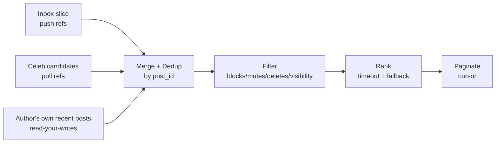
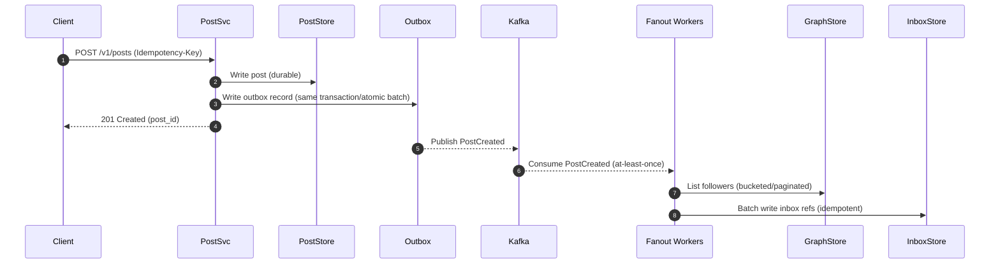
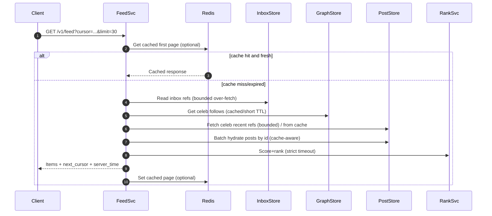

## Overview

A social home feed must feel instantaneous and relevant while handling extreme graph skew: most authors have small follower sets, but a small fraction (“celebrity”/brand accounts) can have millions. This skew breaks one-size-fits-all approaches:

- **Pure fan-out-on-write (push)** makes reads fast but creates catastrophic write amplification for high-fanout authors.
- **Pure fan-out-on-read (pull)** controls write costs but makes reads expensive (many sources to query/merge) and harder to keep within strict P99 latency.

A production-grade solution is a **hybrid feed**:

- **Push**: For the long tail of authors, asynchronously push *post references* into followers’ **materialized inboxes**.
- **Pull**: For high-fanout authors, avoid per-follower writes; instead, fetch their recent posts on-demand (or from a shared author timeline cache) during feed reads.
- **Merge + Rank**: A feed service merges pushed inbox items with pulled candidates, filters (blocks/mutes/deletes), deduplicates, and then ranks.

This separation also decouples **candidate generation** (fast, recall-oriented) from **ranking** (model-driven), allowing frequent iteration on relevance without rewriting storage and fanout mechanics.

---

## Requirements

### Functional Requirements
- Users can create posts (text + media) and have them appear in followers’ home feeds.
- Users can follow/unfollow; block/mute; and those relationships affect feed visibility.
- Feed reads return a ranked list with cursor-based pagination (infinite scroll).
- The system filters deleted/moderated/private content and respects blocks/mutes reliably.
- Users can mark items as seen (optional); the system can reduce repeats and improve session continuity.
- The system supports high-fanout (“celebrity”) authors without overwhelming write capacity.
- Admin/moderation can remove content globally and it disappears quickly from feeds.
- The author should see their own newly created post in their feed immediately (read-your-writes UX).

### Non-Functional Requirements (Targets)
#### Scale (Example Product Assumptions)
- **Users**: 50M DAU, 200M MAU
- **Feed reads**:
  - Average: ~15K QPS (global)
  - Peak: ~80K QPS (global)
  - Typical page size: 30 items
- **Post creates**:
  - Average: ~400 QPS
  - Peak: ~2K QPS
- **Follow/unfollow**:
  - Average: ~300 QPS
  - Peak: ~2K QPS
- **Storage**:
  - 10B posts (multi-year)
  - Inbox materialization retention: 30–90 days (references, not full content)
- **Impressions**: O(1–5T) feed item impressions/year (including scroll/pagination)

#### Latency (Server-Side Budget)
- **Feed read**: P50 80ms, P99 250ms
- **Post create**: P50 120ms, P99 400ms (ack after durable write; fanout async)
- **Follow/unfollow**: P50 80ms, P99 250ms (authoritative edge write)

#### Availability
- **Feed reads**: 99.99% (requires multi-AZ + graceful degradation)
- **Post + follow writes**: 99.95%

#### Consistency
- **Strong (authoritative)**:
  - Post creation durability (ack implies durable storage)
  - Follow/unfollow/block/mute acceptance (edge write is authoritative)
- **Eventual**:
  - Feed propagation (materialized inbox updates)
  - Ranking features/signals, caches, and derived counters

#### Durability / Recovery
- **Posts**: RPO ≈ 0 for acknowledged writes
- **Inbox materialization**: Rebuildable from event log; RPO minutes acceptable

### Constraints & Assumptions
- Single “home” feed (ads can be injected later as another candidate source).
- Small team (6–10 engineers): prefer managed services where they simplify ops.
- GDPR delete + audit logging; region-aware storage optional (but design should not preclude it).
- Ranking iteration is frequent; data model should not require schema rewrites per model.

---

## Back-of-the-Envelope Sizing (Sanity Checks)

These numbers are illustrative—interviewers care more about correctness of reasoning than exact values.

### Feed Read Throughput
- Peak feed page QPS: **80K**
- Items per page: **30**
- Items served per second at peak: **2.4M items/s**

If ~70% of candidates come from inbox and are hydrated by `post_id`, then peak hydration fetches are dominated by:
- **Batch gets** of 30–120 `post_id`s (depending on over-fetch for ranking and filtering)
- Redis reduces hot post reads (trending content) and repeated refreshes.

### Fanout Write Amplification
For push-tier authors:
- Writes per post ≈ number of followers of the author (only for authors below “celebrity” threshold).
- The system must keep **push-tier follower counts bounded** (tiering) and rely on async fanout with backpressure.

A practical goal: ensure >95% of posts are from authors whose follower count is low enough that fanout is affordable, and route the remaining high-fanout volume through pull.

---

## Architecture

### High-Level Components

```mermaid
graph TB
  Client[Clients] --> Edge[CDN/Edge]
  Edge --> APIGW[API Gateway]

  APIGW --> PostSvc[Post Service]
  APIGW --> GraphSvc[Graph Service]
  APIGW --> FeedSvc[Feed Service]

  PostSvc --> PostStore[(Post Store)]
  GraphSvc --> GraphStore[(Graph Store)]

  PostSvc --> Bus[Event Bus (Kafka)]
  Bus --> Fanout[Fanout Workers]
  Fanout --> InboxStore[(Inbox Store)]

  FeedSvc --> InboxStore
  FeedSvc --> PostStore
  FeedSvc --> GraphStore
  FeedSvc --> Cache[(Redis Cache)]
  FeedSvc --> RankSvc[Ranking Service]
  RankSvc --> FeatureStore[(Feature Stores)]
```

### Feed Read Merge (Conceptual)



---

## Core Design Decisions

### 1) Hybrid Push/Pull with Tiering
Authors are assigned tiers based on follower count (and optionally posting rate / engagement):
- **Push tier**: fan-out-on-write into follower inboxes
- **Pull tier**: no per-follower fanout; fetched during feed read

Tiering is **dynamic** (recomputed periodically) to avoid brittleness.

### 2) Materialized Inbox Stores *References*, Not Full Posts
Inbox entries store `post_id` + minimal metadata (author, time, source). Full hydration happens in the feed read path and is cached.

### 3) Candidate Generation vs Ranking
- Candidate generation is optimized for speed and recall (cheap merges, bounded IO).
- Ranking is model-driven with strict timeouts and graceful fallback.

### 4) Idempotency + Ordering Strategy
- Write path uses **idempotency keys** and **outbox pattern** to avoid missing/duplicate events.
- Fanout is **at-least-once**; inbox writes are idempotent; feed merge deduplicates by `post_id`.

---

## Component Deep-Dive

### Feed Service
**Responsibility**
- Serve home timeline: merge push inbox + pull candidates + self posts, dedup, filter, rank, paginate.
- Enforce visibility and safety at read time (blocks/mutes/deletes/moderation).

**Key Behaviors**
- **Bounded over-fetch**: Read `N_inbox` refs (e.g., 200) to produce a 30-item page after filtering.
- **Pull candidates**:
  - Fetch list of celeb follows (cached), then pull recent refs per celeb with a cap (e.g., top 5–20 per celeb) OR use a precomputed per-celeb “recent posts” cache.
  - K-way merge pulled lists by recency for efficiency.
- **Hydration**: Batch fetch post metadata/content by `post_id` (with Redis read-through cache).
- **Latency budgets (example)**:
  - Inbox slice: 10–20ms
  - Pull refs: 10–25ms (bounded)
  - Hydration: 15–40ms (batch + cache)
  - Ranking: 20–40ms (strict timeout)
  - Total P99: ~250ms with degradation

**Degradation**
- If ranking times out: use heuristic ordering (recency + simple affinity).
- If inbox store is degraded: serve cached first page and/or increase pull coverage for recent window.

---

### Fanout Workers (Inbox Builder)
**Responsibility**
- Consume post events and fan-out push-tier posts into follower inboxes with backpressure and retry.

**Key Design Decisions**
- **Tier-aware fanout**: only fan out for authors in push tiers.
- **Follower enumeration**: read followers in paginated segments; avoid unbounded scans per request.
- **Idempotent inbox writes**:
  - Primary key ensures uniqueness per `(user_id, sort_key, post_id)` or use conditional put (DynamoDB) / lightweight transaction sparingly.
  - Write includes a `dedup_key = author_id:post_id` and the feed service also dedups by `post_id` as a final safeguard.
- **Backpressure**:
  - Autoscale by Kafka lag.
  - Apply per-partition rate limiting to protect inbox store.
  - Shed low-priority work first (e.g., backfills, older-than-X fanout).

**Ordering**
- Kafka partition by `author_id` preserves per-author event order (useful for author timeline monotonicity).
- Global ordering is not guaranteed; feed ordering is rank-driven anyway.

---

### Post Service
**Responsibility**
- Create/edit/delete posts, manage media references, publish immutable post events.

**Key Design Decisions**
- **Durable write then publish** via **outbox pattern**:
  - Write post + outbox record in the same DB transaction (or atomic batch where supported).
  - Async publisher reads outbox and produces `PostCreated/PostDeleted/PostVisibilityChanged`.
- **Soft delete / moderation state**:
  - Keep immutable core data; update a `state` field so hydration can reliably filter.
- **Media**:
  - Store media in object storage; post stores only references and metadata.

---

### Graph Service (Follows/Blocks/Mutes)
**Responsibility**
- Authoritative relationship writes and queries for:
  - `following_of(user)` (feed pull candidates)
  - `followers_of(author)` (fanout)

**Key Design Decisions**
- **Two adjacency lists**:
  - `following_by_user`
  - `followers_by_author`
- **Edge state** supports follow + mute + block with clear precedence rules.
- **Read-your-writes for relationship changes**:
  - After a follow/unfollow/block/mute, the feed service consults a short-lived per-user cache/journal to ensure the next feed page reflects the change even if derived data lags.

**Scaling Notes**
- High-degree nodes require pagination and sometimes bucketing (see Data Model) to avoid hot partitions.

---

### Ranking Service
**Responsibility**
- Score and order candidates using features: recency, affinity, engagement, quality, negative signals.

**Key Design Decisions**
- **Strict timeout** (e.g., 30ms budget) with fallback.
- **Feature fetching is bounded**:
  - Prefer precomputed aggregates/caches (Redis) and compact embeddings (feature store).
  - Use circuit breakers to prevent cascading failures into feed latency.

---

## Data Model

The exact storage depends on the stack (Cassandra/ScyllaDB vs DynamoDB vs sharded SQL). The schemas below use a wide-column mental model and highlight partitioning concerns.

### Post Store
**Goals**: lookup by `post_id` (hydration) and list recent posts by author (pull-tier).

- `posts_by_id`
  - **PK**: `post_id`
  - Columns: `author_id`, `created_at`, `content_ref`, `media_refs`, `visibility`, `state`, `version`

- `posts_by_author_time`
  - **PK**: `author_id`
  - **CK (desc)**: `created_at`, `post_id`
  - Columns: `state`, `visibility`

**Notes**
- Hydration should use batch gets by `post_id`.
- Use a cache for popular posts to reduce repeated reads.

---

### Graph Store (Follows/Blocks/Mutes)
**Goals**: fast `following_of(user)` and `followers_of(author)` at scale.

- `following_by_user`
  - **PK**: `user_id`
  - **CK**: `target_id`
  - Columns: `created_at`, `state` (active/muted/blocked)

- `followers_by_author_bucketed`
  - **PK**: `author_id`, `bucket`
  - **CK**: `follower_id`
  - Columns: `created_at`, `state`

**Bucket strategy**
- `bucket = hash(follower_id) mod B` (e.g., B=64/256) to spread very large follower sets across partitions.
- Fanout workers scan buckets in parallel with bounded concurrency.

---

### Inbox Store (Materialized Timeline)
**Goals**: fast per-user feed slice reads with predictable latency and bounded partitions.

A common pitfall is putting *all* inbox rows for a user into a single partition. For heavy users this creates very wide partitions and hotspots. Prefer time-bucketed partitions:

- `inbox_by_user_bucket`
  - **PK**: `user_id`, `bucket_day` (e.g., `YYYYMMDD`)
  - **CK (desc)**: `sort_key`, `post_id`
  - Columns: `author_id`, `event_time`, `source` (push/pull_backfill/self), `dedup_key`
  - TTL: optional, but use with care (tombstones). Many systems rely on time buckets + retention jobs instead.

**Sort key**
- `sort_key = event_time_ms` plus a tiebreaker (e.g., low bits from `post_id`) to ensure stable ordering.

**Read strategy**
- Read newest buckets first; stop when enough candidates are collected.

---

### Seen / Session State (Optional)
- `seen_by_user_day`
  - **PK**: `user_id`, `day`
  - Columns: compact set / bloom filter / count-min sketch of recently seen `post_id`s

**Note**: This is best-effort and mainly for UX/ranking; correctness must not depend on it.

---

## Data Flow

### Post Create (Write Path)



### Feed Read (Hybrid Merge)



---

## API Design

All endpoints assume authentication (e.g., OAuth2/JWT). Rate limiting is applied at the gateway and per-user.

### Create Post
- `POST /v1/posts`
- Headers: `Idempotency-Key: <uuid>`
- Request:
  ```json
  { "text": "string", "media_ids": ["string"], "visibility": "public" }
  ```
- Response `201`:
  ```json
  { "post_id": "p_123", "created_at": "2025-12-17T12:00:00Z" }
  ```
- Errors:
  - `400` invalid payload
  - `401/403` auth/visibility
  - `409` idempotency conflict (same key, different payload)
  - `429` rate limited
- Idempotency: persist `(user_id, idempotency_key) -> request_hash, post_id` for 24h+

### Delete Post
- `DELETE /v1/posts/{post_id}`
- Response `204`
- Behavior: marks post `state=deleted`, emits `PostDeleted` event; feed hydration filters immediately.

### Follow / Unfollow / Block / Mute
- Follow: `PUT /v1/users/{user_id}/following/{target_id}`
- Unfollow: `DELETE /v1/users/{user_id}/following/{target_id}`
- Block: `PUT /v1/users/{user_id}/blocks/{target_id}`
- Mute: `PUT /v1/users/{user_id}/mutes/{target_id}`
- Response `204`
- Errors: `404` target missing, `409` invalid state (e.g., blocked), `429` rate limited
- Consistency: edge write is authoritative immediately; feed materialization eventual.

### Get Feed
- `GET /v1/feed?cursor=<opaque>&limit=30`
- Response `200`:
  ```json
  {
    "items": [
      { "post_id": "p_123", "author_id": "u_9", "created_at": "2025-12-17T12:00:00Z", "text": "…", "media": [] }
    ],
    "next_cursor": "opaque_string",
    "server_time": "2025-12-17T12:00:01Z"
  }
  ```
- Cursor design:
  - Opaque, HMAC-signed blob encoding: `(last_bucket, last_sort_key, last_post_id, pull_state, seen_hint)`
  - Supports stable pagination across merge sources by carrying forward merge state for pull candidates.
- Error handling:
  - Prefer `200` with degraded ranking over `503`.
  - Return `503` only when no safe degraded mode exists (rare).

### Mark Seen (Optional)
- `POST /v1/feed/seen`
- Request:
  ```json
  { "post_ids": ["p_1","p_2"], "seen_at": "2025-12-17T12:00:00Z" }
  ```
- Response `204`
- Best-effort: updates may lag and can be dropped under load.

---

## Consistency & Correctness Notes

### Showing Deleted/Moderated Content
- Feed correctness must not rely on inbox cleanup.
- Hydration enforces `state == active` and visibility rules at read time.
- Cache invalidation:
  - Publish `PostDeleted/PostModerated` to evict `post_id` caches quickly.
  - Still filter on read in case caches are stale.

### Follow/Unfollow Semantics
- In push systems, old inbox entries may remain after unfollow.
- Correctness is ensured by filtering on read:
  - If user no longer follows the author (or is blocked), the item is removed during merge/hydration.
- Optional cleanup:
  - Background compaction for active users or when storage pressure warrants.

### Read-Your-Writes
- For the author’s own new post:
  - Feed service can always include the author’s last `K` posts directly from `posts_by_author_time`, independent of inbox/fanout lag.

---

## Scaling & Performance

### Primary Bottlenecks and Mitigations

#### 1) Fanout Amplification
- **Problem**: one post → many inbox writes.
- **Mitigations**:
  - Celebrity pull tier (no fanout for high-degree authors)
  - Bucketed follower partitions + parallel fanout with bounded concurrency
  - Batch writes, compression, and efficient schemas
  - Backpressure via Kafka lag, and prioritization (recent > old)

#### 2) Feed Hydration Cost
- **Problem**: N refs → N post lookups.
- **Mitigations**:
  - Batch gets for `post_id`
  - Redis read-through cache for hydrated posts
  - Request coalescing for popular posts (single-flight)
  - Hydrate only what survives filtering when possible (two-phase hydration)

#### 3) Ranking Tail Latency
- **Problem**: model/feature fetches can blow P99.
- **Mitigations**:
  - Strict timeouts and partial ranking
  - Circuit breakers; fallback heuristic rank
  - Precomputed features and bounded feature fanout

#### 4) Hot Keys / Hot Partitions
- **Problem**: heavy users/celebs create hotspots.
- **Mitigations**:
  - Bucket partitions for followers and inbox
  - Cache celeb recent refs (shared across followers)
  - Avoid per-follower writes for pull tier

### Caching Strategy
- **Feed page cache**: cache first page per user for 10–30s to absorb refresh storms.
- **Hydrated post cache**: `post_id -> hydrated payload` for 1–10 minutes (longer for trending).
- **Graph cache**: `celebrity_following(user)` for 1–5 minutes.
- **Stale-while-revalidate**: serve slightly stale cached feed when dependencies are slow; refresh asynchronously.

### Partitioning Strategy Summary
- Inbox: shard by `user_id`, bucket by day.
- Followers: shard by `author_id`, bucket by hash.
- Posts: `post_id` for hydration; `author_id` for author timelines.

---

## Trade-offs & Alternatives

### Key Trade-offs Made
- **Hybrid push/pull**
  - Cost: more complex merge/pagination/dedup logic
  - Benefit: bounded write amplification + low-latency reads for most users
- **Eventual feed propagation**
  - Cost: posts may appear with seconds-to-minutes delay under load
  - Benefit: high availability and backpressure-friendly pipelines
- **Materialized inbox references (not full payloads)**
  - Cost: additional hydration reads; more moving parts
  - Benefit: smaller inbox storage and decoupled content schema evolution
- **Strict ranking timeout + fallback**
  - Cost: occasionally less personalized ordering
  - Benefit: protects P99 latency and prevents cascading failures

### Alternative Approaches
- **Pure fan-out-on-write**
  - Pros: fastest reads; simplest merge
  - Cons: infeasible for high-fanout authors; massive write IOPS and storage churn
- **Pure fan-out-on-read**
  - Pros: minimal write amplification
  - Cons: expensive reads (many sources); hard to hit P99 during peak
- **Offline precomputed personalized feed**
  - Pros: strong personalization
  - Cons: freshness challenges, heavy pipelines, still needs online corrections and safety filtering

---

## Failure Modes & Mitigations

### 1) Kafka Lag / Backlog
- **Impact**: delayed push-tier propagation; “freshness gap”
- **Detection**: consumer lag, end-to-end event age (time since post create), inbox write latency
- **Mitigation**:
  - autoscale consumers
  - shed non-critical work (backfills)
  - temporarily increase pull coverage for recent posts in FeedSvc
  - prioritize newest events (separate topics/priority lanes)

### 2) Inbox Store Partial Outage (Shard/AZ)
- **Impact**: slower or failing feed reads for affected users
- **Detection**: read error/latency by shard and AZ; elevated timeouts
- **Mitigation**:
  - multi-AZ replication and client-side failover
  - serve cached first page when safe
  - pull-only fallback for recent window (bounded)
  - degrade to simpler ranking to stay within latency SLO

### 3) Ranking Service / Feature Store Outage
- **Impact**: increased latency or errors; degraded relevance
- **Detection**: gRPC error rate, timeout rate, circuit breaker open rate
- **Mitigation**:
  - fallback heuristic rank
  - cap candidate count under load
  - aggressively bound feature fetches; fail open with defaults

### 4) Graph Write/Read Issues (Follow/Block Inconsistency)
- **Impact**: users briefly see content they shouldn’t, or miss content they expect
- **Detection**: edge-write error budgets, reconciliation sampling, user reports
- **Mitigation**:
  - read-your-writes cache for edge changes (short-lived)
  - apply blocking at hydration time (authoritative checks)
  - background reconciliation for derived stores

### 5) Delete / Moderation Enforcement Lag
- **Impact**: policy breach if removed content still appears
- **Detection**: moderation SLA metrics (time-to-enforcement), audit sampling
- **Mitigation**:
  - hydration-time filtering is the final gate (must be correct)
  - fast cache invalidation on `post_id`
  - optionally maintain a “tombstone set” cache for recently removed content

### 6) Duplicate Events / Partial Fanout Writes
- **Impact**: duplicate inbox entries or missing some pushes
- **Detection**: dedup rate metrics, sampled completeness checks
- **Mitigation**:
  - idempotent inbox writes + feed-time dedup
  - replay Kafka from a point-in-time to rebuild inbox
  - periodic “top-up” jobs for active users if needed

---

## Operations

### SLOs and Error Budgets
- Feed reads: **99.99%** availability, P99 **≤ 250ms**
- Writes (post/follow): **99.95%** availability
- Moderation enforcement: e.g., **99% within 60s** (define per policy)

### Monitoring & Alerting
- FeedSvc: QPS, P50/P95/P99 latency, error rate, dependency timeouts, cache hit rate, fallback rate (heuristic ranking %)
- Kafka: consumer lag, event age, throughput, under-replicated partitions, rebalance frequency
- Stores: read/write latency, error rate, hot partitions, compaction backlog (if Cassandra/Scylla), capacity
- Correctness: delete enforcement latency, block enforcement sampling, dedup ratio, “empty feed” rate

Example alerts:
- FeedSvc P99 > 300ms for 5m
- Kafka event age > 120s for 10m (push tier)
- Inbox read error rate > 0.5% for 1m
- Ranking fallback rate > 20% for 10m

### Deployment & Change Management
- Canary/blue-green per service (5% → 25% → 100%) with automatic rollback on SLO regression
- Feature flags for ranking models and candidate sources
- Backward-compatible schema changes; dual-read/dual-write only when necessary
- Runbooks for:
  - Kafka lag incidents
  - inbox store partial outage
  - ranking/feature outage
  - moderation enforcement issues

### Data Retention, Privacy, Security
- Encrypt data at rest and in transit (TLS everywhere).
- Least-privilege access, audit logs for moderation actions and privileged reads.
- GDPR delete:
  - Post state transitions to deleted and is filtered on hydration immediately.
  - Asynchronous cleanup of derived stores and caches.
- Rate limiting and abuse controls:
  - per-user and per-IP limits on post/create and follow churn
  - spam scoring in write path (optional) to protect downstream fanout.

### Disaster Recovery
- **Targets** (example): RTO 30 minutes, RPO 5 minutes (posts), RPO 30 minutes (inbox)
- **Backups**: daily full + incremental for post/graph stores; Kafka retention 3–7 days (or more) for replay
- **Failover**:
  - Multi-AZ active-active within a region
  - Optional warm-standby region with async replication and event replay to rebuild inbox

---

## References & Further Reading
- Twitter engineering: timelines at scale and hybrid fanout approaches
- Facebook TAO and related graph caching patterns
- Kafka outbox / exactly-once semantics discussions (Confluent docs)
- Cassandra/Scylla wide-row and time-series modeling guides
- Jeff Dean, “The Tail at Scale” (designing for P99)