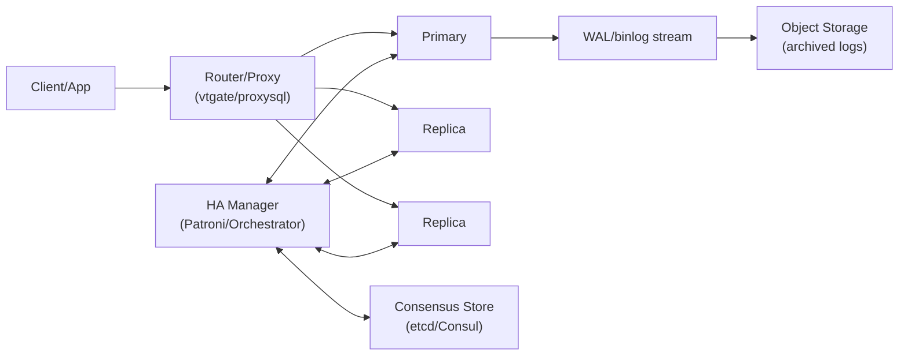
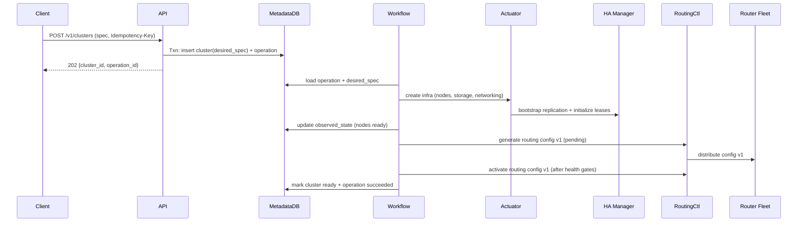
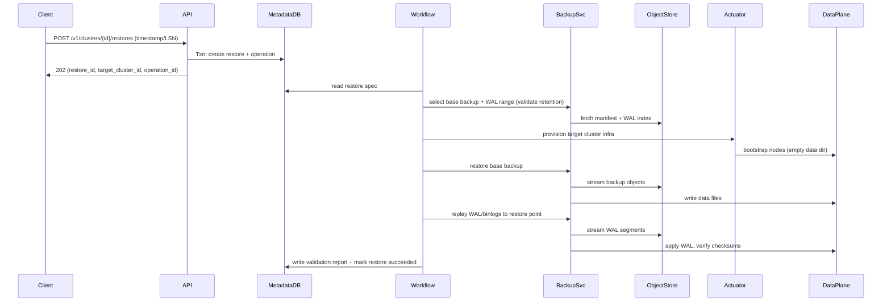

## Overview

A sharded SQL DBaaS control plane translates high-level intent (e.g., “create a 4-shard Postgres cluster with HA and PITR”) into thousands of low-level actions across compute, networking, storage, and orchestration layers—while keeping tenants isolated and operations auditable. The hard part is not creating databases; it’s making provisioning, topology changes, failover, backups, and restores **deterministic, observable, and safe** under partial failures, retries, and concurrent changes.

The core pattern is **intent + reconciliation**:

- The API records **desired state** once in a strongly consistent metadata store.
- A durable workflow engine reconciles desired state into the data plane via **idempotent** steps.
- Every step is observable and auditable; every mutation is tied to an **operation** with an idempotency key.
- Backups and point-in-time restore (PITR) are first-class resources with **immutability** and **integrity verification**.

Terminology:
- **Shard**: A partition of data (by key-range or hash slots) with its own primary + replicas.
- **WAL/binlog**: Write-ahead log (Postgres WAL) / binary log (MySQL) used for replication and PITR.
- **LSN**: Log sequence number; a monotonic position in WAL (Postgres).
- **Split-brain**: Two primaries accepting writes for the same shard.
- **Fencing**: Preventing an old primary from accepting writes after leadership changes (e.g., via leases/tokens).

---

## Requirements

### Functional Requirements

- Provision sharded SQL clusters per tenant with configurable:
  - shard count, shard strategy (range/hash), instance size/class
  - AZ layout, optional multi-region read replicas
  - network policy, private endpoints, TLS settings
- Manage topology changes:
  - add/remove shards, reshard/migrate key ranges, rebalance, and update routing with minimal downtime
- High availability per shard:
  - automatic primary election, replica management, controlled failover/failback
  - safe routing updates that avoid split-brain
- Backups & PITR:
  - scheduled full + (optional) incremental backups
  - continuous WAL/binlog archiving within a retention window
  - track and expose “PITR healthy until” (latest continuous restore point)
- Restores:
  - restore to new cluster from backup
  - PITR restore to a timestamp or LSN with validation and staged cutover
- Async operations:
  - all mutations return `operation_id`, provide progress, logs, and audit history
- Tenant isolation:
  - quotas, rate limits, network boundaries, encryption keys, RBAC, and per-tenant billing meters
- Observability and support tooling:
  - cluster health, events, metrics, config drift detection, runbook-friendly diagnostics

### Non-Functional Requirements

#### Scale (Concrete Targets)

- Tenants: **10,000**
- Clusters: **50,000** (avg 4 shards/cluster)
- Shards: **200,000**
- Shard replicas: **400,000** (avg 2 replicas/shard including primary)
- API traffic:
  - steady-state: **2,000 RPS reads**, **200 RPS writes**
  - incident bursts: **10,000 RPS reads**, **1,000 RPS writes** for up to 15 minutes
- Operations:
  - create/scale/backup/restore: **10–100k operations/day**
  - incident mode: large backlog possible; system must remain safe and debuggable
- Backup storage:
  - object storage: **2–10 PB** total
  - WAL/binlog ingestion (fleet): **10–100 GB/min** sustained peak (regionally partitioned)

#### Latency & SLOs

- Control plane API (authenticated, authorized):
  - `GET` status/list: **P50 50ms**, **P99 200ms**
  - `POST` submit operation: **P50 150ms**, **P99 500ms**
- Provisioning/changes:
  - Create cluster complete: **P95 < 15 min** for “median” cluster (4 shards, 2 AZs, 2 replicas/shard)
  - Backup start latency: **P95 < 2 min** from schedule time
  - PITR restore completion: workload-dependent; publish guidance:
    - metadata + routing setup: minutes
    - data restore: bounded by object-store throughput and WAL size
- Data plane (product SLO examples):
  - Per-shard availability: **99.95%** monthly (multi-AZ)
  - RPO: **≤ 1 minute** intra-region (WAL); cross-region configurable (**0–15 min**) depending on replication mode
  - RTO: automatic failover **< 60s** typical, **< 5 min** worst-case with anti-flap safeguards

#### Availability & Consistency

- Control plane API: **99.99%** (multi-AZ)
- Workflow execution: **99.9%** (degraded mode acceptable; no unsafe actions)
- Consistency model:
  - **Strong** for metadata, operation state, and routing/config versioning
  - **Eventual** for metrics/logs and aggregated health rollups
- Durability:
  - Metadata RPO: **0** for committed operations (synchronous replication or quorum writes)
  - Backups: no silent corruption; integrity verification required
  - During object store degradation: allow **up to 5 minutes** of restore unavailability (control plane remains up)

### Constraints & Assumptions

- Runs on Kubernetes per region (data plane via StatefulSets or VMs; either is acceptable as long as actuation is idempotent).
- Compliance baseline: SOC2; optional HIPAA/GDPR modes:
  - encryption at rest/in transit
  - immutable audit logs
  - retention controls and data residency guardrails
- Small platform team (6–10 engineers): prioritize proven building blocks (Temporal, Postgres, object storage, Patroni/Vitess).
- Tenants are untrusted:
  - all operations require authn/z, quotas, and rate limiting
  - no tenant-provided code runs in control plane

---

## Architecture

### High-Level Components

```mermaid
flowchart TB
  Client["Console / CLI / SDK"] --> GW["API Gateway (WAF, Rate Limits)"]
  GW --> API["Control Plane API"]

  API --> Meta[(Metadata DB\n(Postgres, multi-AZ))]
  API --> Cache[(Redis / Memcache\n(short TTL read cache))]
  API --> Audit[(Audit Log Sink\n(append-only))]
  API --> Events["Event Stream\n(Kafka/PubSub/SNS/SQS)"]

  API --> WF["Workflow Orchestrator\n(Temporal Server)"]
  WF --> W1["Worker Pool: Provisioning"]
  WF --> W2["Worker Pool: Backups/Restore"]
  WF --> W3["Worker Pool: Topology/Reshard"]

  W1 --> Act["Actuators / Controllers\n(K8s operator or VM agent)"]
  W2 --> Bkp["Backup/PITR Service"]
  W3 --> RouteCtl["Routing Controller"]

  Act --> DP["Data Plane\n(Shard Primaries/Replicas)"]
  RouteCtl --> Router["SQL Router/Proxy\n(Vitess vtgate / ProxySQL / custom)"]
  Router --> DP

  DP --> Obj[(Object Storage\n(WORM + checksums))]
  Bkp --> Obj

  DP --> Obs["Metrics/Logs/Traces"]
  API --> Obs
  WF --> Obs
```

Key principles:
- **Metadata DB is the source of truth** for resources, desired state, operation state, and routing versions.
- **Workflows own actuation**, not the API: the API validates and records intent; workers reconcile intent into reality.
- **Routing is versioned** and updated via a controller that ensures safety gates (e.g., “new shard ready”) before cutover.
- **Data plane components (HA managers, routers, backups)** operate autonomously for fast paths, but remain observable and reconcilable.

### Data Plane Subsystem (Per Shard)



- HA manager provides **single-writer** semantics via leader election/leases and enforces promotion rules (lag thresholds, fencing).
- Router uses **routing config versions** to direct writes to the elected primary and reads to replicas.

---

## Requirements Deep-Dive (What Makes This Hard)

### Determinism Under Retries

Any step can fail after partially completing. The system must tolerate:
- API retries (client timeouts)
- workflow retries (worker crashes)
- actuator retries (K8s reconciliation)
- network partitions (object store transient errors)
- concurrent operations (two humans/scripts operating on same cluster)

Therefore:
- every mutating request uses **Idempotency-Key**
- every workflow step is **idempotent** and keyed by `(operation_id, resource_version)`
- routing updates are **two-phase**:
  1) publish config version as “pending”
  2) promote to “active” after readiness gates pass

### Multi-Tenant Safety

- hard quotas (resource counts, vCPU/storage, concurrent operations)
- rate limits per tenant and per route
- blast radius isolation:
  - per-tenant and per-cluster concurrency limits in worker pools
  - priority queues (restores/failovers > backups > creates)

---

## Components

### Control Plane API

**Responsibilities**
- Authn/z (OIDC/JWT), RBAC, policy enforcement (residency, allowed regions)
- Validation (spec schema, shard strategy rules, PITR windows)
- Quotas/rate limits
- Record intent: create/update resource desired spec + create operation
- Read APIs: status/list with bounded fan-out and caching

**Key design decisions**
- **Async-only mutations** (all `POST/PATCH/DELETE` return `operation_id`)
- **Optimistic concurrency** on resources via `resource_version` (ETag)
- **Outbox pattern** (optional but recommended): transactional write to metadata + enqueue workflow start/event to avoid dual-write races

**Technology choices**
- Go/Java + REST/JSON for external API; gRPC internally
- API gateway with WAF + per-tenant rate limiting
- Redis for short-TTL read cache (seconds), never as authority

### Workflow Orchestrator

**Responsibilities**
- Durable, retryable workflows: create, scale, reshard, failover assistance, backup, restore, delete
- Step-level progress and structured logs
- Compensation and cleanup for partial failures

**Key design decisions**
- Workflows are **deterministic state machines**: all external calls are activities with idempotency keys.
- Workflows write authoritative transitions to metadata:
  - operation state
  - resource observed state
  - routing config version changes

**Technology choices**
- Temporal recommended:
  - durable execution, visibility, retries, timers, workflow versioning
- Alternative: custom reconciler + queue (harder to get correctness, auditing, and step replay right)

### Actuators / Provisioners

**Responsibilities**
- Turn metadata “desired spec” into actual infra:
  - compute allocation, storage provisioning, network policies
  - cluster bootstrap, replica setup
  - config push and readiness probes

**Key design decisions**
- Declarative apply: `desired_spec` → reconcile loop
- Idempotent actions keyed by `(cluster_id, shard_id, config_version)`
- Readiness gates before promotion/cutover:
  - replica caught up within threshold
  - health checks green
  - router config validated

**Technology choices**
- Kubernetes operator/controller pattern (CRDs) preferred
- VM-based: lightweight agent + actuator service is also workable

### Shard HA Manager

**Responsibilities**
- Detect failures and coordinate promotions
- Maintain replication topology
- Enforce fencing / single-writer rule

**Key design decisions**
- Primary election uses consensus store leases (e.g., etcd/Consul) to prevent split-brain.
- Promotions require:
  - replica health
  - bounded replication lag
  - anti-flap dampening (cooldowns)

**Technology choices**
- Postgres: Patroni + etcd/Consul (or vendor equivalent)
- MySQL: Orchestrator/MHA
- If using Vitess: leverage its topology + failover patterns where applicable

### Routing Layer (Shard-Aware Proxy)

**Responsibilities**
- Route queries to correct shard(s)
- Send writes to primary; reads to replicas (optional)
- Support topology changes without breaking clients

**Key design decisions**
- Routing config is **versioned** and updated atomically across router fleet.
- During reshard:
  - dual-routing or read-repair strategies may be used (depends on product guarantees)
  - enforce compatibility windows (client drivers, SQL semantics)

**Technology choices**
- Vitess vtgate for Postgres/MySQL sharding model, or custom routing/proxy for narrower SQL subset
- ProxySQL (MySQL) or PgBouncer + shard-aware middleware (Postgres) depending on requirements

### Backup & PITR Service

**Responsibilities**
- Full/incremental backups; continuous WAL/binlog archiving
- Restore point indexing (“PITR healthy until”)
- Verification restores and integrity checks

**Key design decisions**
- Backups are **immutable** with manifest + checksums.
- WAL/binlog ingestion enforces **continuity**:
  - detect gaps
  - only mark PITR healthy when segments are complete and validated
- Priority inversion handling:
  - restores preempt backups (worker priority + object-store request shaping)

**Technology choices**
- Postgres: pgBackRest or WAL-G
- MySQL: xtrabackup + binlog archive
- Object storage with:
  - WORM/object lock where supported
  - SSE-KMS or envelope encryption with per-tenant keys

---

## Data Model

### Key Invariants

- Only one active mutating operation per resource unless explicitly safe (e.g., backup can run during scale if supported).
- Every resource has:
  - `desired_spec` (what user wants)
  - `observed_state` (what system sees)
  - `resource_version` (monotonic integer or UUID-based revision)
- Routing config changes are versioned and roll-forward only (no in-place edits).

### Relational Schema (Illustrative)

**`tenants`**
- `tenant_id` (PK)
- `name`, `plan`, `quota_limits_json`
- `kms_key_ref`
- `created_at`

**`clusters`**
- `cluster_id` (PK)
- `tenant_id` (FK)
- `name`, `engine`, `region`
- `status` (creating/ready/updating/deleting/failed)
- `desired_spec_json` (JSONB)
- `observed_state_json` (JSONB)
- `resource_version` (BIGINT)
- `created_at`, `deleted_at`

**`shards`**
- `shard_id` (PK)
- `cluster_id` (FK)
- `placement` (AZ set / node pool)
- `key_range` (range) or `hash_slot_range`
- `status`
- `resource_version`

**`nodes`**
- `node_id` (PK)
- `shard_id` (FK)
- `az`, `role` (primary/replica)
- `endpoint`
- `instance_type`
- `health_status`
- `replication_lag_ms`
- `last_heartbeat_at`

**`routing_configs`**
- `routing_config_id` (PK)
- `cluster_id` (FK)
- `version` (BIGINT, monotonic per cluster)
- `state` (pending/active/rolled_back)
- `config_json` (JSONB)
- `created_at`, `activated_at`

**`backups`**
- `backup_id` (PK)
- `cluster_id` (FK)
- `type` (full/incremental)
- `base_backup_id` (nullable)
- `started_at`, `completed_at`
- `object_manifest_uri`
- `checksum`
- `status` (running/succeeded/failed)
- `expires_at`

**`wal_segments`** (or `binlog_segments`)
- `segment_id` (PK)
- `cluster_id` (FK)
- `timeline` (or binlog file id)
- `start_lsn`, `end_lsn`
- `object_uri`
- `checksum`
- `created_at`
- `verified_at` (nullable)

**`restores`**
- `restore_id` (PK)
- `source_cluster_id`
- `target_cluster_id`
- `restore_point_type` (timestamp/lsn)
- `restore_point_value`
- `status`
- `started_at`, `completed_at`
- `validation_report_uri`

**`operations`**
- `operation_id` (PK)
- `tenant_id` (FK)
- `resource_type` (cluster/shard/backup/restore)
- `resource_id`
- `type` (create/scale/reshard/backup/restore/delete/failover)
- `idempotency_key`
- `request_hash` (for idempotency conflict detection)
- `status` (queued/running/succeeded/failed/canceled)
- `current_step`
- `progress_pct`
- `error_code`, `error_message`
- `created_at`, `updated_at`
- Unique index: `(tenant_id, idempotency_key)`

**`events`** (append-only)
- `event_id` (PK)
- `tenant_id`
- `cluster_id`
- `severity`
- `type`
- `message`
- `actor`
- `created_at`
- Partition by time for retention and query performance

### Metadata DB Sizing Notes (Concrete)

At stated scale:
- `operations`: assume 100k/day retention 30 days ⇒ ~3M rows
- `events`: potentially higher; partition + TTL recommended
- `wal_segments`: can be large; store only indexed metadata, not payload; partition and/or summarize indices (e.g., hourly “latest continuous LSN” checkpoints)

---

## Data Flows

### Create Cluster (Async Workflow)



Safety gates before activating routing:
- exactly one primary elected per shard (lease verified)
- replicas within lag threshold
- router config validated and distributed

### PITR Restore (Base Backup + WAL Replay)



Restore validation should include:
- checksum/manifest verification
- optional “smoke query” suite (schema checks, counts if feasible)
- explicit “restore point achieved” confirmation (timestamp/LSN)

---

## API Design

All mutating APIs are async and return `operation_id`. Clients poll `GET /v1/operations/{operation_id}` and/or subscribe to an events stream.

### Common Patterns

- **Idempotency**: require `Idempotency-Key` on all mutations; store `request_hash`.
  - If same key + different payload: `409 Conflict`
- **Optimistic concurrency**: support `If-Match: <resource_version>` for updates.
- **Pagination**: list endpoints use `page_size` + `page_token`.
- **RBAC**: roles like `owner`, `admin`, `operator`, `read-only`; scoped to tenant/project.

### Create Cluster

- `POST /v1/clusters`
- Request:
  - `name`, `engine`, `region`
  - `shards`: `{ count, strategy: "range"|"hash", shard_key }`
  - `ha`: `{ replicas_per_shard, failover_mode: "auto"|"manual", max_failovers_per_hour }`
  - `backup`: `{ full_schedule_cron, incremental_schedule_cron?, pitr_retention_hours }`
  - `network`: `{ private_only, allowed_cidrs?, tls_required }`
- Response: `202 { cluster_id, operation_id }`

### Get Cluster

- `GET /v1/clusters/{cluster_id}`
- Response includes:
  - `status`, `endpoint`, `shards`, `routing_config_version`
  - `backup_health`: `{ pitr_healthy_until, last_full_backup_at }`
  - `resource_version`

### List Clusters

- `GET /v1/clusters?page_size=...&page_token=...`
- Returns summaries only; detailed shard/node info behind separate endpoints.

### Update Cluster (Spec Changes)

- `PATCH /v1/clusters/{cluster_id}`
- Requires `If-Match`
- Supports safe fields (e.g., instance class, replicas, backup policy). Unsafe changes require explicit operation types.

### Trigger Backup

- `POST /v1/clusters/{cluster_id}/backups`
- Request: `{ type: "full" | "incremental" }`
- Response: `202 { backup_id, operation_id }`

### PITR Restore

- `POST /v1/clusters/{cluster_id}/restores`
- Request:
  - `restore_type`: `"pitr"`
  - `target`: `{ new_cluster_name, region }`
  - `restore_point`: `{ timestamp }` or `{ lsn }`
- Response: `202 { target_cluster_id, restore_id, operation_id }`
- Guardrails:
  - reject restore points outside retention window
  - enforce residency policy (explicit override + audit when allowed)
  - rate limit restores per tenant; prioritize incident restores

### Operation Status

- `GET /v1/operations/{operation_id}`
- Response: `{ status, current_step, progress_pct, started_at, updated_at, error }`

### Admin/Operator APIs (Optional but Common)

- `POST /v1/clusters/{cluster_id}/failover` (manual failover with safety checks)
- `GET /v1/clusters/{cluster_id}/events`
- `GET /v1/clusters/{cluster_id}/topology` (shards/nodes, may be restricted)
- `POST /v1/clusters/{cluster_id}/reshard` (range moves / slot rebalance)

---

## Scaling & Performance

### Likely Bottlenecks and Mitigations

- **Metadata DB write contention** (incident storms):
  - reduce write amplification (append-only events + summarized state)
  - partition heavy tables (`events`, `wal_segments`)
  - keep hot rows small; avoid frequent updates to large JSON blobs (store derived fields separately)
- **Workflow backlog** (restore storms):
  - priority queues: `restore > failover-reconcile > topology > backup > create`
  - per-tenant concurrency caps; global concurrency caps per region
  - autoscale workers by queue depth and oldest-task age
- **Object storage throttling**:
  - request shaping (token bucket per region/tenant)
  - limit parallel segment fetches per restore
  - cache WAL indices (metadata) aggressively; avoid `LIST` storms

### Horizontal Scaling Strategies

- **API layer**: stateless; scale behind L7 load balancer; cache read summaries for seconds.
- **Workflow workers**: separate pools by function; isolate CPU-heavy verification.
- **Actuators**: reconcile loops are naturally scalable; partition controllers by cluster hash or namespace sharding.
- **Metadata DB**:
  - multi-AZ primary with synchronous replication (or quorum)
  - read replicas for list/status
  - consider active/passive multi-region for the control plane first; only move to multi-region active/active with careful conflict avoidance

### Caching

- Cache cluster status summaries for **5–15s** keyed by `cluster_id`.
- Invalidate via:
  - version-based checks (`resource_version`)
  - event-driven invalidation (pub/sub) where practical
- Never cache:
  - authorization beyond token lifetime
  - quota state for writes (always enforce against authority)

---

## Consistency, Safety, and Concurrency Control

### Consistency Model by Data Type

- **Strongly consistent**
  - operations (`operations.status`, step transitions)
  - resource desired specs and `resource_version`
  - routing configs and active version
- **Eventually consistent**
  - metrics/logs/traces
  - aggregated health rollups (“green/yellow/red”)

### Concurrency Rules

- Default: **one mutating operation at a time per cluster**.
- Allow parallelism only when explicitly safe and modeled (e.g., backup can run during read-only spec changes).
- Implement as:
  - metadata lock row per resource (`cluster_locks`) or
  - compare-and-swap on `resource_version` plus operation admission rules

### Split-Brain Prevention (Practical Approach)

- HA manager uses leases in consensus store to elect primary.
- Router routes writes only to primary that holds valid lease.
- Promotion uses fencing tokens:
  - old primary is demoted and/or blocked from accepting writes (e.g., via `pg_ctl` stop, firewall rules, or storage fencing where available)

---

## Trade-offs & Alternatives

### Key Trade-offs (At Least 3)

1. **Strongly consistent metadata + durable workflows**
   - Pros: deterministic retries, auditable operations, safe restores under partial failures
   - Cons: operational overhead (Temporal + DB), more moving parts
   - Why: correctness and safety dominate in DBaaS control planes

2. **Per-shard HA manager instead of control-plane-driven elections**
   - Pros: fast failover path, proven patterns, reduced blast radius
   - Cons: additional subsystem to operate (etcd/Consul/Patroni/Orchestrator)
   - Why: split-brain risk is existential; rely on mature HA mechanisms

3. **Immutable backups + periodic verification restores**
   - Pros: detects corruption early; PITR is trustworthy
   - Cons: extra storage + compute cost; slower pipelines if verification is too frequent
   - Why: unverified backups are a common real-world failure mode

4. **Versioned routing with safety gates**
   - Pros: controlled cutovers; easier rollback and debugging
   - Cons: more complexity than direct router edits; requires router fleet discipline
   - Why: topology changes are where outages happen; make them mechanical and reversible

### Alternative Approaches

- **Distributed SQL (CockroachDB/YugabyteDB)**
  - Avoids manual sharding but changes product semantics, performance profile, and cost.
- **Kubernetes-CRD-only control plane**
  - Simpler on paper; harder to build strong idempotency, workflows, and cross-service auditing without an additional authoritative metadata store.
- **Single-tenant “RDS-style” clusters**
  - Easier HA/backup but doesn’t meet sharded scale needs; less elasticity for large tenants.

---

## Failure Modes & Mitigations

### Failure Scenarios (At Least 3)

1. **Workflow orchestrator outage**
   - Impact: new operations stall; data plane continues
   - Detection: queue depth/oldest-task age SLO breach
   - Mitigation:
     - multi-AZ Temporal server
     - API may continue recording intent, but enforce admission control to avoid unlimited backlog growth
     - workers resume and reconcile from metadata

2. **Metadata DB failover or inconsistency**
   - Impact: control plane cannot safely act; risk of conflicting operations if writes diverge
   - Detection: replication lag, write errors, integrity checks
   - Mitigation:
     - synchronous replication/quorum writes
     - PITR backups and regular restore drills for metadata DB
     - “safe mode”: freeze mutations if metadata integrity is suspect

3. **Split-brain primary for a shard**
   - Impact: data divergence, possible data loss
   - Detection: dual-leader lease signals, topology anomalies, router mismatch
   - Mitigation:
     - lease-based primaries with fencing tokens
     - router routes writes only to lease-holder
     - automated demotion and incident paging for manual confirmation if needed

4. **WAL/binlog gaps (missing segments)**
   - Impact: PITR not possible beyond last continuous segment
   - Detection: continuity checks during ingest, alerts on missing LSN ranges
   - Mitigation:
     - multi-destination archiving (optional) or retry with backoff and durable local spooling
     - do not claim PITR health until quorum/verification threshold met

5. **Restore to wrong timestamp / unsafe cutover**
   - Impact: correctness incident for tenant
   - Detection: validation reports, optional app-level verification hooks
   - Mitigation:
     - explicit confirmation prompts for destructive actions
     - staged cutover: restore into new cluster, validate, then update DNS/connection strings
     - immutable audit trail of who/what/when

### Disaster Recovery

- **Control plane**
  - RTO: **≤ 1 hour**
  - RPO: **≤ 5 minutes** (metadata PITR), target **0** within region via sync replication
- **Data plane**
  - Intra-region RPO: **≤ 1 minute** (WAL/binlog)
  - Cross-region RPO: **0–15 minutes** depending on replication mode and cost
  - RTO: workload dependent; publish guidance and provide restore throughput limits

---

## Operations

### Monitoring & Alerting (Core Signals)

- API:
  - RPS, error rate (4xx/5xx), authz failures
  - P50/P95/P99 latency per route
- Workflows:
  - queue depth, oldest task age
  - failures by workflow type/step
  - retry counts and stuck operations
- Provisioning:
  - time-to-ready by region/AZ/instance type
  - failure reasons (capacity, quota, cloud errors)
- Backups & PITR:
  - backup success rate
  - WAL ingest lag (time and LSN)
  - continuity gaps
  - verification restore pass rate
- HA:
  - failovers/hour (per shard and fleet)
  - replication lag distributions
  - split-brain detections / lease conflicts
- Suggested alerts:
  - oldest critical workflow task age > **5 min**
  - any cluster PITR unhealthy > **10 min**
  - metadata DB sustained lag > **2s** or write error rate > **0.1%**
  - failover rate anomaly (spike detection)

### Deployment & Change Management

- Canary/blue-green for API and worker pools.
- Workflow versioning: never deploy incompatible changes that break replay; use Temporal workflow versioning patterns.
- Schema migrations: expand/contract; keep backwards compatibility until all components upgraded.
- Feature flags for new workflow steps and routing behaviors.

### Runbooks (Minimum Set)

- Workflow backlog spike (restore storm)
- Metadata DB failover and safe-mode enablement
- Split-brain containment and fencing verification
- PITR unhealthy triage (WAL gap localization)
- Restore performance troubleshooting (object store throttling vs compute)

### Security & Compliance

- TLS everywhere (client-to-router, router-to-DB where applicable, control plane internal mTLS optional).
- Encryption at rest:
  - metadata DB (disk encryption)
  - object store (SSE-KMS / per-tenant keys)
- Audit logging:
  - append-only sink with retention and tamper-evidence
  - record actor, request, resource, and result
- Multi-tenant isolation:
  - network policies per tenant/project
  - least-privilege service accounts
  - quotas and per-tenant concurrency limits

---

## Real-World References & Further Reading

- Vitess (sharding + routing): `https://vitess.io/`
- Temporal (durable workflows): `https://temporal.io/`
- Patroni (Postgres HA): `https://patroni.readthedocs.io/`
- pgBackRest: `https://pgbackrest.org/`
- WAL-G: `https://github.com/wal-g/wal-g`
- AWS RDS operational concepts (backups/restores/control planes): `https://docs.aws.amazon.com/rds/`
- “Designing Data-Intensive Applications” (state machines, consistency, trade-offs): Martin Kleppmann