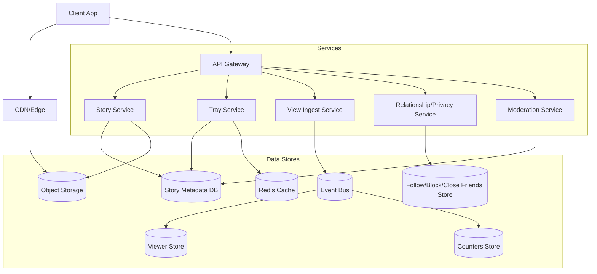
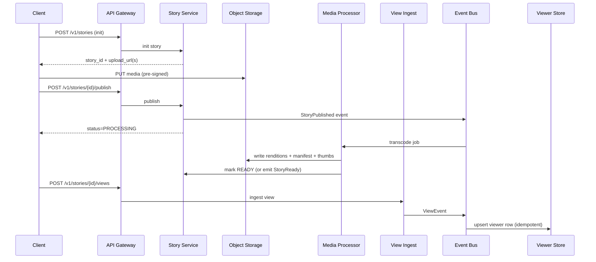
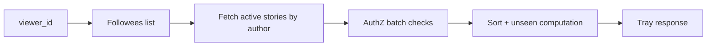

## Overview

Stories are short-lived (24-hour) media posts that combine three hard problems:

1. **Media delivery**: high bandwidth, low startup latency, global distribution (CDN).
2. **Privacy-aware discovery**: access depends on relationship state (follow/friend/block/close friends/custom lists).
3. **View tracking**: very high write QPS with user-facing “near real-time” viewer lists.

A production-grade design splits Stories into two planes:

- **Media plane (throughput/latency optimized)**: object storage + CDN + adaptive streaming (HLS/DASH) + signed access.
- **Metadata & events plane (QPS/consistency optimized)**: NoSQL for story metadata + an event log for views + async materialization for viewer lists and counters.

The critical UX path is: **load tray → open story → start playback quickly**. View tracking must be **asynchronous and idempotent** so playback never waits on a strongly consistent write.

## Goals & Non-Goals

### Goals
- Fast tray and story opens with correct privacy enforcement.
- Reliable 24-hour expiry with minimal operational overhead.
- Near-real-time viewer lists (seconds-level lag acceptable).
- High availability for reads; graceful degradation under spikes.

### Non-Goals (can be added later)
- Full-fledged recommendation/discovery graph for public stories.
- Advanced ML moderation (assume hooks/integration points).
- Permanent archives/highlights (different retention/consistency).

## Requirements

### Functional Requirements
- Create a story (photo/video), optionally caption/stickers/metadata, and publish it.
- Stories expire automatically after 24 hours and are not viewable after expiration.
- Delete a story early; it becomes unavailable for future fetches immediately (media revocation discussed in trade-offs).
- Fetch a “story tray” of accounts with active stories, ordered by recency, with “unseen” indicators.
- Fetch story metadata and playback URLs/manifests.
- Track views; authors can fetch a viewer list per story (with timestamps), and basic counts.
- Privacy per story: `PUBLIC`, `FOLLOWERS/Friends`, `CLOSE_FRIENDS`, `CUSTOM_ALLOW/DENY`, plus blocks.
- Abuse/report hooks: report story; admin/moderation can disable distribution.

### Non-Functional Requirements (Targets)
- **Scale (example)**:
  - 50M DAU, 10M creators/day
  - Avg 1.5 stories/creator/day → ~15M stories/day
  - Avg 2 viewers/story (long tail) but heavy skew; hot stories can have 10M+ viewers
  - Peak tray + metadata reads: ~300K QPS (app open spikes)
  - Peak view events: 1–3M QPS (bursting on hot content)
  - Peak CDN segment requests: 5–20M RPS (global edge)
  - Media ingest/storage: 10–50 TB/day raw uploads; processed renditions can be 2–4× without careful ladder tuning
- **Latency (end-to-end user perceived)**:
  - Tray fetch: P50 50ms, P99 200ms (server-side)
  - Story metadata fetch: P50 30ms, P99 120ms
  - View event ack: P50 20ms, P99 80ms (accepted → async persistence)
  - Playback start (CDN + player): P50 <300ms, P95 <800ms
- **Availability**:
  - Read paths (tray, metadata, playback auth): 99.99%
  - Publish path: 99.9% (processing can be async)
- **Consistency**:
  - Strong consistency for authentication and authorization decisions at request time.
  - Eventual consistency acceptable for viewer lists and counts (seconds-level).
  - Tray freshness can lag up to ~60s.
- **Durability**:
  - Media stored in object storage with high durability.
  - View events processed at-least-once; dedupe to avoid inflation.

### Constraints & Assumptions
- Mobile-first clients; web supported.
- Global footprint; multi-region active-active for reads; region-local writes preferred.
- Operate an event bus (Kafka/Kinesis/PubSub), Redis, and a scalable NoSQL store (DynamoDB/Cassandra/ScyllaDB).
- Compliance: audit logs for moderation; GDPR deletion for user data beyond TTL (viewer lists and events should have strict retention).

## Back-of-the-Envelope Capacity Planning

- **Story metadata size** (per story): ~1–3 KB (IDs, timestamps, privacy pointers, media keys, state).
  - 15M stories/day → ~15–45 GB/day in metadata (before replication/overhead), TTL drops it automatically.
- **View store size** (unique viewers): if average 20 unique viewers/story across long tail (more realistic at scale), 15M × 20 = 300M viewer rows/day.
  - At ~50–100 bytes/row + overhead → tens of GB/day logical; storage overhead and compaction matter (choose schema carefully).
- **Event bus throughput**: 3M view events/sec peak at ~200 bytes/event → ~600 MB/s peak ingress (partition count and compression required).
- **CDN egress** dominates cost; optimize bitrate ladder, segment duration, and caching policies.

## High-Level Architecture



## Key Workflows

### 1) Create → Upload → Publish (Async Media Processing)
- Client requests story creation to get `story_id` and pre-signed upload URL(s).
- Client uploads bytes directly to object storage.
- Client publishes (finalizes) the story; story becomes discoverable once processing is complete (or immediately for images).
- Media pipeline produces ABR renditions + manifest + thumbnails and marks `processing_state=READY`.

### 2) Tray Fetch (Privacy-Aware)
- Client asks for tray of followed accounts with active stories.
- System returns a list of authors with active stories, sorted by last story time, plus “has_unseen”.

### 3) Open Story (Metadata + Signed Playback)
- Client fetches story metadata.
- Server enforces privacy and issues signed access (prefer signed cookies scoped to the story media path; fallback to signed URLs).
- Client loads manifest and segments from CDN.

### 4) View Tracking (Async + Idempotent)
- Client sends `POST /views` (fire-and-forget, retriable).
- Ingest service validates auth + story existence + authorization (cheap check) and publishes to event bus.
- Consumers upsert viewer rows and update counters asynchronously.

### 5) Delete / Disable (Immediate Access Blocking)
- Metadata is tombstoned (`status=DELETED` or `DISABLED`) with strong read-your-writes for the author’s delete request.
- Playback authorization endpoints stop issuing new signed access for deleted stories.
- Media bytes can be lifecycle-expired; optional best-effort purge for faster removal.

## Component Deep-Dive

### Story Service
**Responsibility**
- Create/publish/delete stories.
- Serve story metadata.
- Generate signed playback access (URL/cookie) after authz checks.
- Manage story state machine: `PENDING_UPLOAD → PROCESSING → READY → (DELETED|EXPIRED|DISABLED)`.

**Key Decisions**
- Keep media bytes off the API tier via pre-signed uploads.
- Cache story-by-id reads and tombstones to protect the DB during spikes.
- Separate “listing an author’s stories” from “fetch by story_id” to avoid secondary-index hot spots.

**Tech**
- Stateless service (Go/Java), NoSQL (DynamoDB/Cassandra), Redis for cache.

### Tray Service
**Responsibility**
- Build the tray: “which followed accounts have active stories” + ordering + unseen.
- Batch privacy evaluation efficiently.

**Key Decisions**
- Two viable approaches (often combined):
  1. **Pull model** (simpler): fetch followees + query “active stories by author” for top N; cache results per user for 30–60s.
  2. **Materialized active index** (faster for reads): maintain `active_stories_by_author` and optionally `active_authors_global`/per-segment indexes updated on publish/expire.
- Unseen computation via per-viewer state:
  - Maintain `last_seen_by_viewer_author(viewer_id, author_id) -> last_seen_story_time_or_story_id` with TTL/compaction.
  - `has_unseen = latest_story_time > last_seen_time`.

**Tech**
- Stateless service, Redis cache, NoSQL reads; optional async updater from publish events.

### Relationship/Privacy Service
**Responsibility**
- Determine if viewer can see a story given follows/friends, blocks, close friends, and custom allow/deny lists.

**Key Decisions**
- Server-side enforcement (never rely on “secret URLs”).
- Prefer O(1) membership checks:
  - `is_blocked(viewer, author)`
  - `is_follower(viewer, author)`
  - `is_close_friend(viewer, author)`
  - `in_custom_allow/deny(list_id, viewer)`
- Cache decisions briefly with versioning (e.g., include `relationship_version` or list version) to reduce stale allows.

**Tech**
- Dedicated relationship store/service (existing social graph), Redis for hot caches.

### Media Processor
**Responsibility**
- Transcode videos to ABR ladder (HLS/DASH), generate thumbnails, run lightweight safety checks, and write outputs to object storage.

**Key Decisions**
- Async processing via queue to decouple publish latency from transcode time.
- Use a tuned ABR ladder to control CDN cost (e.g., 240p/360p/540p/720p; avoid unnecessary high bitrates for short-lived content).
- Segment duration (e.g., 2–4s) balancing startup latency vs overhead.

**Tech**
- Worker fleet (Kubernetes), FFmpeg pipeline, queue/event bus, object storage.

### View Ingest + View Materialization
**Responsibility**
- Ingest view events reliably at high QPS.
- Produce viewer lists and counters with eventual consistency.

**Key Decisions**
- At-least-once ingestion + **idempotent storage**:
  - Primary dedupe key: `(story_id, viewer_id)`
  - Store `first_viewed_at`, optionally `last_viewed_at` and `view_count` if replays matter.
- Partition event stream for scalability:
  - Often by `story_id` (good for viewer-list locality); beware “hot partition” for viral stories → mitigate with keyed sub-partitioning (e.g., `hash(viewer_id) % K` for counters) while keeping viewer list fetchable.
- Separate **viewer list store** from **counters**:
  - Viewer list: needs pagination by time and stable ordering.
  - Counters: can be approximate (HyperLogLog / sketches) or exact with sharded counters.

**Tech**
- Stateless ingest service, Kafka/Kinesis, Cassandra/Scylla/DynamoDB for viewer rows, Redis optional for short-term dedupe and rate limiting.

### Moderation Service
**Responsibility**
- Accept reports, apply takedowns/disable distribution, support admin review.
- Audit actions and ensure enforcement across APIs.

**Key Decisions**
- Store a `status=DISABLED` tombstone in metadata; all reads must enforce it.
- Keep moderation logs beyond TTL (separate retention policy).

## Data Model

### Metadata DB (TTL: 24h + grace, e.g., 26h)

**Table: `story_by_id`**
- PK: `story_id`
- Attributes: `author_id`, `created_at`, `expires_at`, `status`, `privacy_type`, `allow_list_id`, `deny_list_id`, `media_manifest_key`, `thumb_key`, `processing_state`, `caption`, `disable_reason` (optional)
- TTL: `expires_at + grace`

**Table: `stories_by_author`**
- PK: `author_id`
- SK: `created_at` (descending if supported via inverted timestamp)
- Attributes: `story_id`, `expires_at`, `status`, `processing_state`
- TTL: align with story expiry

**Table: `audience_list_members`** (for custom allow/deny lists)
- PK: `list_id`
- SK: `member_id`
- Attributes: `added_at`
- TTL: align to maximum story expiry that references the list (or store lists separately with explicit deletion)

**Table: `last_seen_by_viewer_author`** (for unseen indicators)
- PK: `viewer_id`
- SK: `author_id`
- Attributes: `last_seen_at` (or `last_seen_story_created_at`)
- TTL: optional (e.g., 30–90 days) to cap growth

### View Store (TTL: 24h + grace)
**Table: `story_viewers`**
- PK: `story_id`
- SK: `viewed_at#viewer_id` (time-bucketed clustering for pagination; include `viewer_id` to dedupe/order)
- Attributes: `viewer_id`, `first_viewed_at`, `last_viewed_at` (optional)
- TTL: `expires_at + grace`

**Counters (options)**
- Exact: `story_view_count_shards(story_id, shard_id) -> count` (sum on read, cached)
- Approx: HLL/sketch per story (cheap reads, acceptable error)

### Cache (Redis)
- `tray:user_id` → tray items (TTL 30–60s)
- `story:story_id` → story metadata + status (TTL 10–30s; cache tombstones)
- `authz:story_id:viewer_id` → allow/deny (TTL 10–60s; incorporate relationship/list version)
- `count:story_id` → cached count aggregate (TTL 5–30s)

## Data Flow Diagrams

### Publish & View (Sequence)



### Tray Build (Conceptual)



## API Design

**Auth**: OAuth/JWT bearer tokens. All endpoints require auth (public discovery variants, if added, must still enforce privacy rules for non-public stories).

### Create & Publish
- `POST /v1/stories`
  - Request: `{ "media_type": "image|video", "privacy": {...}, "client_request_id": "uuid" }`
  - Response: `{ "story_id": "st_...", "upload_url": "...", "expires_at": "...", "upload_headers": {...} }`
  - Idempotency: `client_request_id` scoped to user for safe retries.
  - Errors: `401`, `429`, `400`, `409` (duplicate request id with conflicting payload)

- `POST /v1/stories/{story_id}/publish`
  - Request: `{ "caption": "...", "client_request_id": "uuid" }`
  - Response: `{ "status": "PROCESSING|READY" }`
  - Notes: if media is still uploading/processing, return `PROCESSING` and allow client polling/backoff.

### Fetch Tray & Story
- `GET /v1/users/{user_id}/story-tray?limit=50&cursor=...`
  - Response: `{ "items": [{ "author_id": "...", "latest_story_id": "...", "latest_created_at": "...", "expires_at": "...", "has_unseen": true }], "next_cursor": "..." }`
  - Errors: `401`, `403`, `429`

- `GET /v1/stories/{story_id}`
  - Response:
    ```json
    {
      "story_id":"...",
      "author_id":"...",
      "created_at":"...",
      "expires_at":"...",
      "status":"READY",
      "media": { "manifest_url":"...", "thumb_url":"..." },
      "processing_state":"READY",
      "privacy":"..."
    }
    ```
  - Notes:
    - Enforce privacy before issuing playback access.
    - Prefer **signed cookies** scoped to a story media path so CDN caching isn’t fragmented by per-URL signatures; otherwise signed URLs with short TTL.

### View Tracking & Viewer List
- `POST /v1/stories/{story_id}/views`
  - Request: `{ "viewer_session_id":"...", "client_request_id":"uuid", "viewed_at":"(optional client time)" }`
  - Response: `{ "accepted": true }`
  - Semantics:
    - Fire-and-forget; accepted means “queued for processing”.
    - Server timestamp is the source of truth for ordering in viewer lists.
  - Idempotency:
    - Primary: dedupe on `(story_id, viewer_id)` for “unique viewers”.
    - Optional: store replays separately if the product needs it.
  - Errors: `401`, `403`, `404` (expired/not found), `409` (deleted/disabled), `429`

- `GET /v1/stories/{story_id}/viewers?limit=50&cursor=...`
  - Response: `{ "total": 1234, "viewers": [{ "viewer_id":"...", "viewed_at":"..." }], "next_cursor":"..." }`
  - Authorization: only the author (or moderation/admin) can access.
  - Consistency: eventual; “may lag by a few seconds”.

### Delete / Disable
- `DELETE /v1/stories/{story_id}`
  - Response: `{ "status":"DELETED" }`
  - Behavior:
    - Marks tombstone in metadata immediately.
    - Stops issuing new playback access immediately.
    - Best-effort CDN purge optional; lifecycle handles eventual byte removal.

- `POST /v1/stories/{story_id}/disable` (moderation)
  - Request: `{ "reason":"..." }`
  - Response: `{ "status":"DISABLED" }`

## Consistency Model (Explicit)

- **Authorization correctness**: always evaluate on the server for story metadata and playback token issuance. Default-deny on failures.
- **Deletion enforcement**:
  - Strong for future API reads (`GET /stories/{id}` returns deleted/disabled).
  - Media revocation is bounded by token TTL and CDN caching; choose short-lived playback authorization to reduce exposure window.
- **Viewer lists**:
  - Eventual: view acceptance is immediate, list reflects within seconds under healthy pipelines.
  - Idempotent upserts prevent double-counting under retries/at-least-once delivery.

## Scaling & Performance

### Hotspots & Mitigations
- **Tray reads at session start**:
  - Redis cache per user (30–60s).
  - Batch NoSQL reads; avoid N+1 relationship checks.
  - Optional materialized “active authors” index updated on publish/expire.
- **Viral stories (hot keys)**:
  - Viewer list writes: partition by `story_id`; ensure store can handle wide partitions via time-bucketing and compaction strategy.
  - Counters: use sharded counters or approximate sketches to avoid single-row contention.
  - Event bus: increase partitions; use consumer autoscaling; apply backpressure/rate limits to abusive clients.
- **Relationship checks**:
  - Batch membership checks for tray.
  - Cache close-friends and blocklists for short TTL; include versioning to reduce stale allows.
- **Playback startup**:
  - Serve manifests and thumbnails via CDN when possible.
  - Keep manifest TTL short but cacheable; tune segment size/duration; use origin shielding.

### Caching Strategy (Correctness vs Performance)
- Tray cache is best-effort; correctness comes from per-story authz at open time.
- Story metadata cache must cache tombstones and `DISABLED` states to prevent “resurrection” during outages.
- Authz cache should be short-lived and versioned; on mismatch, recompute.
- CDN caching is critical; signed cookies are preferred over per-request signed URLs to avoid cache fragmentation.

## Trade-offs & Alternatives

### Trade-offs Chosen
1. **Async view processing**
   - Benefit: protects playback latency and absorbs spikes.
   - Cost: viewer lists/counts are eventually consistent; requires idempotency and monitoring of lag.

2. **TTL/lifecycle-driven expiry**
   - Benefit: avoids delete storms and cron complexity; scales with data volume.
   - Cost: requires careful grace windows and audit tooling to detect misconfiguration.

3. **Server-side privacy enforcement + signed playback authorization**
   - Benefit: prevents URL sharing from bypassing privacy; centralizes policy.
   - Cost: signing and short TTLs can reduce CDN efficiency; needs careful caching (signed cookies) and token TTL tuning.

4. **Unseen computation via `last_seen_by_viewer_author`**
   - Benefit: cheap tray responses without per-story per-viewer joins.
   - Cost: unseen is approximate if clients skip updates or multi-device races; requires clear semantics (“unseen since last open”).

### Alternative Approaches
- **Fan-out-on-write trays** (push active story presence to followers)
  - Pros: fast reads.
  - Cons: massive write amplification for large creators; operationally heavy; hybrid approaches often needed.

- **Strongly consistent viewer lists (OLTP transactions)**
  - Pros: immediate accuracy.
  - Cons: expensive at scale; hot partitions; adds latency to the critical path.

- **Per-segment auth checks at the edge**
  - Pros: stronger media revocation on delete.
  - Cons: complexity and cost; introduces latency and a new failure domain; usually unnecessary if tokens are short-lived.

## Failure Modes & Mitigations

### Failure Scenarios
1. **Event bus backlog / consumer lag**
   - Impact: viewer lists/counts lag.
   - Detection: consumer lag, end-to-end event age, DLQ rate.
   - Mitigation: autoscale consumers, increase partitions, prioritize hot topics, shed non-critical processing, replay from log.

2. **Metadata DB partial outage or elevated latency**
   - Impact: tray/story fetch fails or slows; publish fails.
   - Detection: 5xx rate, P99 latency, DB throttles/timeouts, cache hit drop.
   - Mitigation: aggressive read caching, circuit breakers, multi-region read failover, degrade tray freshness, queue publishes for retry.

3. **CDN/origin issues**
   - Impact: slow playback, rebuffering.
   - Detection: CDN 5xx, origin latency, cache hit rate drop, client QoE metrics.
   - Mitigation: origin shielding, multi-CDN failover (if justified), pre-warm for large creators, fallback to lower bitrate ladder.

4. **Privacy regression (over-sharing)**
   - Impact: severe data leak.
   - Detection: canary tests for privacy matrix, anomaly detection in access patterns, audit logs.
   - Mitigation: default-deny on errors, feature flags, rapid rollback, automated policy tests, tight scoping of signed cookies/URLs.

5. **TTL/lifecycle misconfiguration**
   - Impact: stories persist too long or expire early.
   - Detection: accessibility audits vs `expires_at`, lifecycle rule monitors, sampled end-to-end checks.
   - Mitigation: staged rollout, grace windows, periodic verification jobs, alerts on drift.

### Disaster Recovery
- **RTO/RPO (example)**:
  - Reads: RTO 30 minutes, RPO <5 minutes for metadata (multi-region replication).
  - Views: tolerate partial lag; target RPO <1 minute using replicated event bus and retention-based replay.
- **Backups**:
  - Metadata snapshots (even with TTL) for incident analysis.
  - Relationship store follows its own backup policy.
  - Event bus retention 3–7 days for replay and debugging.

## Operations

### Observability
- **Golden signals**:
  - Tray/metadata: QPS, P50/P99, error rate, cache hit rate.
  - Playback QoE: startup time, rebuffer rate, CDN hit rate, manifest/segment error codes.
  - Publish: processing time, queue depth, success rate, ready latency distribution.
  - Views: ingest QPS, event age, consumer lag, dedupe rate, viewer-store write errors.
  - Privacy: authz error rate, default-deny count, audit events.

### Alert Examples
- Tray P99 > 300ms for 5 min (per region).
- Playback startup P95 > 1.2s for 10 min (QoE-based).
- Event age (now - event_time_processed) > 30s sustained.
- Viewer store write error rate > 0.5% for 5 min.
- Default-deny rate spikes above baseline (potential upstream failure).

### Deployment & Schema Evolution
- Progressive delivery: canary per region (1% → 10% → 50% → 100%).
- Event schema versioning (backward compatible); consumers must tolerate unknown fields.
- Additive DB schema changes; dual-read/dual-write only when unavoidable.

### Security & Privacy Practices
- Signed playback authorization with short TTL; rotate signing keys regularly.
- Strict server-side authz; least privilege for services; audit moderation actions.
- Rate limits per client/user/IP on view ingest and story fetch to mitigate abuse.
- Data retention: viewer rows TTL aligned to story expiry; moderation/audit retained separately per policy.

## References & Further Reading
- CDN signed access: CloudFront Signed URLs/Cookies, Fastly token auth patterns
- Object expiry: S3/GCS lifecycle policies
- NoSQL TTL patterns: DynamoDB TTL, Cassandra TTL and compaction strategies
- Event streaming: Kafka design patterns, at-least-once processing + idempotency
- Designing Data-Intensive Applications (Kleppmann): caching, consistency, stream processing
- Public engineering talks on large-scale media pipelines and edge delivery (high-level patterns)