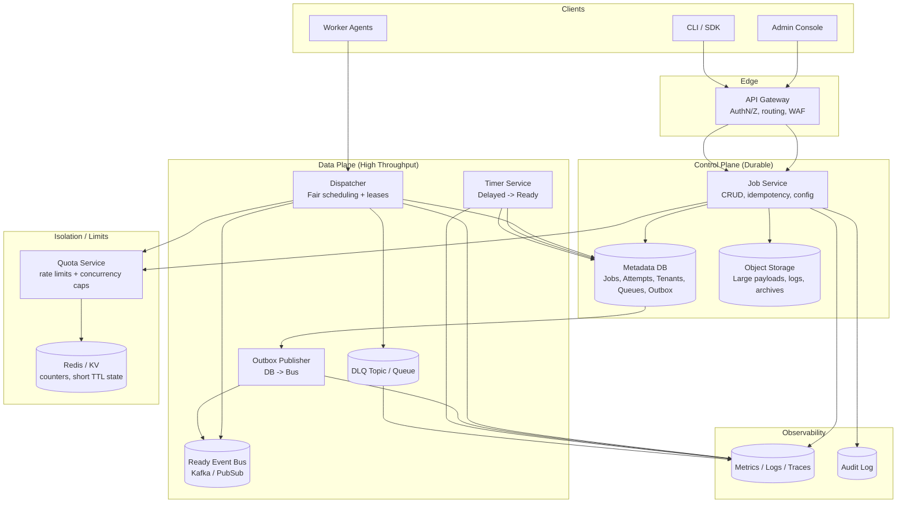

## Overview

A distributed batch task scheduler accepts large volumes of jobs, runs them at (or after) a specified time, enforces priorities and retries, and prevents any single tenant from monopolizing capacity. The core challenges are:

- **Correctness under failures**: no “lost” jobs after an acknowledged enqueue; bounded duplicates (at-least-once).
- **Efficient delayed scheduling**: time-based ordering is expensive at scale; naive polling creates DB hotspots.
- **Fairness and isolation**: enforce tenant/queue limits without destroying throughput.
- **Operational control**: debuggable state, replay, DLQs, auditability.

This design separates a **durable control plane** (job metadata + state transitions) from a **high-throughput data plane** (ready notifications + dispatch). Job state is authoritative in the metadata store; the queue bus is treated as a delivery accelerator, not the source of truth.

---

## Requirements

### Functional Requirements

- Submit jobs with `tenantId`, `queueId`, `priority`, payload, and optional `runAt` (delayed execution).
- Deterministic ordering within a queue:
  - Higher priority first (P0 before P1…).
  - Within the same priority: earlier `runAt` first.
  - Tie-breaker: `jobId` (ULID) ascending for stability.
- Dispatch ready jobs to workers with **leases**, heartbeats, and lease timeouts.
- Retry failures with configurable policy (max attempts, exponential backoff, jitter) and DLQ routing.
- Cancel jobs (best-effort if already running) and pause/resume queues.
- Provide status tracking and attempt history for audit/debug.
- Enforce multi-tenant isolation:
  - Admission rate limits (enqueue/cancel/status).
  - Max queued / max running per tenant and per queue.
  - Fair scheduling across tenants (no starvation).
- Admin controls:
  - Tenant and queue configuration.
  - Requeue/DLQ replay tooling.
  - Observability (metrics/traces/logs) and audit logs.

### Non-Functional Requirements

**Scale targets (example sizing for an educational “big system”)**
- Tenants: ~10,000
- Queues: ~200,000 total (many sparse)
- Enqueue: 5,000 QPS sustained, bursts up to 200,000 QPS for minutes
- Cancel/update: 2,000 QPS sustained, bursts to 20,000 QPS
- Dispatch: peak 1,000,000 jobs/min (~16,700/sec) across all priorities
- Retention:
  - Hot metadata in DB: 7–14 days
  - Long-term history (jobs + attempts): 30–90 days in object storage / warehouse
  - Reasoning: at 5,000 QPS average, you create ~432M jobs/day; storing full-fidelity attempt history for 30 days in an OLTP DB is usually cost-prohibitive.

**Latency / freshness**
- Enqueue API: P50 20ms, P99 150ms (regional)
- Due-to-dispatch (jobs with `runAt <= now`):
  - P50 250ms, P99 2s (under normal load)
  - P99 10s during partial degradation (backpressure allowed)
- Status reads: P99 200ms (with cache), P99 500ms (DB-only)
- Lease heartbeat endpoint: P99 200ms

**Availability**
- Enqueue/status APIs: 99.99% (multi-AZ)
- Dispatch: 99.9% (graceful degradation allowed; workers retry)

**Consistency model**
- **Strong consistency** for job state transitions and idempotent enqueue.
- **At-least-once** execution (duplicates possible); provide primitives for idempotent consumers.
- **Eventual consistency** for aggregated metrics, dashboards, and log-derived views.

**Durability**
- After a successful enqueue response: **no job loss** (RPO ≈ 0).
- RTO: 30–60 minutes for regional failover (configurable).

### Assumptions / Out of Scope

- Jobs are “single-step” tasks; DAG/workflow orchestration is out of scope (Airflow/Temporal/Argo are better fits).
- Worker execution environment and business logic are owned by tenants; the scheduler provides delivery, retry, and isolation.
- Exactly-once execution is not provided end-to-end (typically infeasible without constraining workloads).

---

## Architecture

### High-Level Diagram



### Key Principles

- **DB is the source of truth**: a job is “ready” because the DB says so, not because a message exists.
- **Messages are notifications**: the ready bus accelerates wakeups and load distribution; it is safe to drop or duplicate messages.
- **Leases prevent lost work**: job assignments are time-bounded; timeouts trigger retries.
- **Fairness is enforced at dispatch**: admission control alone cannot prevent queued jobs from monopolizing execution.

---

## Components

### Job Service

**Responsibilities**
- Validate/authenticate requests; enforce tenant and queue policies.
- Idempotent enqueue; persist job records and (optional) payload pointer.
- Expose status, list, cancel, and admin endpoints (pause/resume queue, limits).

**Notes**
- Idempotency is typically `(tenantId, Idempotency-Key)` with a stored request hash.
- Large payloads go to object storage; DB stores `payload_ref` + checksum.

### Timer Service (Delayed Scheduler)

**Responsibilities**
- Promote jobs from `SCHEDULED` to `READY` when `run_at <= now`.
- Avoid global scanning hotspots.

**Implementation approach**
- Partition delayed jobs by `tenantShard` and scan in bounded windows:
  - Example query pattern: “for shard S, fetch next N due jobs ordered by `run_at`”.
- Use **claim/lease** mechanics for scanning ownership (per shard or per time-bucket) to distribute work.

### Outbox Publisher (Reliable DB → Bus)

**Responsibilities**
- Publish “job is ready” notifications reliably after DB commit.

**Why it matters**
- Without an outbox, you risk “DB updated but message not published” (missed wakeup) or “message published but DB not updated” (spurious wakeup). The outbox pattern makes this deterministic.

**Mechanics**
- Transaction writes:
  - Update `jobs.state = READY`
  - Insert `outbox` row (event type `JOB_READY`, key = jobId)
- Publisher reads outbox rows and publishes to the bus, then marks them delivered.

### Ready Event Bus (Kafka/PubSub)

**Responsibilities**
- Carry lightweight ready notifications (`jobId`, `tenantId`, `priority`, `shard`, `runAt`).
- Provide partitioned parallelism and backpressure visibility (lag).

**Partitioning**
- Partition key typically includes `tenantShard` (and optionally priority) to balance load and preserve locality.

### Dispatcher (Fair Scheduling + Leases)

**Responsibilities**
- Consume ready notifications, build an in-memory view of “candidates”.
- When workers poll, pick jobs with fairness + priority, then atomically lease them in the DB.
- Record attempts and completions; schedule retries (backoff) or DLQ.

**Fairness model (practical)**
- Two-stage selection:
  1. Choose a tenant via weighted fairness (e.g., deficit round-robin / WFQ using tenant weights and current running count).
  2. Choose a queue within that tenant (queue weights), then choose highest priority job available.
- Add **anti-starvation** by reserving a small fraction of capacity for lower priorities or using priority aging (optional).

### Quota Service (Isolation)

**Responsibilities**
- Enforce admission rate limits (token buckets).
- Enforce concurrency caps:
  - Tenant-level max running
  - Queue-level max running
- Provide safe degradation:
  - Return `429` (retry with jitter) instead of melting the DB/dispatch layer.

**Implementation**
- Redis for fast counters with TTL; periodic reconciliation from DB to correct drift.

### Workers

**Responsibilities**
- Poll for work, execute job, heartbeat, and complete.
- Must be built assuming at-least-once delivery (idempotent or dedupe downstream).

---

## Data Model

### State Machine

- `SCHEDULED` → `READY` → `RUNNING` → `SUCCEEDED`
- `RUNNING` → `READY` (retry after failure/backoff or lease timeout)
- Any state → `CANCELED` (subject to rules below)
- `RUNNING/READY` → `DLQ` when attempts exhausted or policy says “do not retry”

**Cancel semantics**
- If not yet leased: cancel is authoritative (job will not run).
- If already leased/running: set `cancel_requested=true`; worker cooperatively stops. Late completions are accepted only if they match the active lease and job is not canceled.

### Tables (Illustrative)

**Table: `tenants`**
- `tenant_id` (PK)
- `status` (ACTIVE/SUSPENDED)
- `limits` (jsonb: submit_qps, max_running, max_queued, etc.)
- `weight` (int default 1)
- `created_at`, `updated_at`

**Table: `queues`**
- `tenant_id` (PK part)
- `queue_id` (PK part)
- `weight` (int)
- `paused` (bool)
- `max_running` (int, optional override)
- `created_at`, `updated_at`

**Table: `jobs`**
- `tenant_id` (PK part)
- `job_id` (PK part, ULID)
- `idempotency_key` (unique with tenant_id)
- `queue_id`
- `priority` (smallint, 0 highest)
- `state` (SCHEDULED/READY/RUNNING/SUCCEEDED/FAILED/CANCELED/DLQ)
- `run_at` (timestamp)
- `next_run_at` (timestamp; for backoff scheduling)
- `deadline_at` (timestamp, optional)
- `payload_ref` (uri) + `payload_sha256`
- `attempt` (int current attempt number)
- `max_attempts` (int)
- `backoff_policy` (jsonb)
- `cancel_requested` (bool)
- `active_lease_id` (uuid, nullable)
- `lease_expires_at` (timestamp, nullable)
- `last_error` (text)
- `version` (bigint for CAS)
- `created_at`, `updated_at`

**Table: `attempts`**
- `tenant_id` (PK part)
- `job_id` (PK part)
- `attempt_no` (PK part)
- `lease_id` (uuid)
- `worker_id`
- `started_at`, `heartbeat_at`, `finished_at`
- `result` (SUCCEEDED/FAILED/TIMED_OUT/CANCELED)
- `error_code`, `error_message`
- `runtime_ms`

**Table: `outbox`**
- `event_id` (PK, ULID/UUID)
- `event_type` (e.g., JOB_READY)
- `aggregate_key` (e.g., tenantId/jobId)
- `payload` (jsonb, small)
- `created_at`
- `delivered_at` (nullable)

### Indexing / Partitioning

- Partition/shard by `tenantShard = hash(tenant_id) % N`.
- Hot indexes:
  - `jobs(tenantShard, state, priority, next_run_at)` for scanning due READY/retry work (bounded).
  - `jobs(tenant_id, idempotency_key)` unique for idempotent enqueue.
- Attempts can be partitioned similarly and/or written to cold storage after N days.

---

## Data Flow

```mermaid
sequenceDiagram
  participant Client
  participant API as Job Service
  participant DB as Metadata DB
  participant Timer as Timer Service
  participant Outbox as Outbox Publisher
  participant Bus as Ready Bus
  participant Disp as Dispatcher
  participant Worker

  Client->>API: POST /v1/tenants/{t}/jobs (runAt, priority, payload)
  API->>DB: TXN: insert job (SCHEDULED or READY)
  alt runAt <= now
    API->>DB: TXN: insert outbox event JOB_READY
    API-->>Client: 202 Accepted (jobId, READY)
  else runAt > now
    API-->>Client: 202 Accepted (jobId, SCHEDULED)
  end

  Timer->>DB: Claim shard/bucket lease
  Timer->>DB: TXN: SCHEDULED -> READY for due jobs
  Timer->>DB: TXN: insert outbox JOB_READY (per job)

  Outbox->>DB: Read undelivered outbox rows
  Outbox->>Bus: Publish JOB_READY notifications
  Outbox->>DB: Mark delivered

  Disp->>Bus: Consume JOB_READY notifications
  Worker->>Disp: POST /v1/worker:poll (maxJobs, capabilities)
  Disp->>DB: TXN: CAS READY->RUNNING + set lease (lease_id, expires_at) + insert attempt
  Disp-->>Worker: assignments (jobId, leaseId, payloadRef, deadline)

  Worker->>Disp: POST /v1/worker:heartbeat (leaseId)
  Worker->>Disp: POST /v1/worker:complete (leaseId, success/failure)
  Disp->>DB: TXN: finalize attempt; update job state
  alt failure and retry
    Disp->>DB: set next_run_at (backoff) + state=SCHEDULED
  else attempts exhausted
    Disp->>DB: state=DLQ
    Disp->>Bus: (optional) publish JOB_DLQ event
  end
```

---

## API Design

### Enqueue Job

`POST /v1/tenants/{tenantId}/jobs`  
Headers: `Idempotency-Key: <string>`

Request:
```json
{
  "queueId": "email",
  "priority": 1,
  "runAt": "2025-12-17T12:00:00Z",
  "payload": { "template": "welcome", "userId": "123" },
  "maxAttempts": 10,
  "backoff": { "type": "exponential", "baseMs": 5000, "maxMs": 900000, "jitter": true },
  "deadlineAt": "2025-12-17T13:00:00Z"
}
```

Response `202`:
```json
{ "jobId": "01JFK...ULID", "state": "SCHEDULED" }
```

Errors:
- `409` idempotency key reused with different request hash
- `429` rate-limited / quota exceeded
- `400` invalid policy / timestamps / queue

### Get Job Status

`GET /v1/tenants/{tenantId}/jobs/{jobId}`

Response (example):
```json
{
  "jobId": "01JFK...ULID",
  "queueId": "email",
  "priority": 1,
  "state": "RUNNING",
  "runAt": "2025-12-17T12:00:00Z",
  "attempt": 3,
  "leaseExpiresAt": "2025-12-17T12:01:30Z",
  "lastError": "timeout contacting downstream",
  "updatedAt": "2025-12-17T12:00:40Z"
}
```

### Cancel Job

`POST /v1/tenants/{tenantId}/jobs/{jobId}:cancel`

Behavior:
- If `SCHEDULED/READY`: transition to `CANCELED` (authoritative).
- If `RUNNING`: set `cancel_requested=true` and (optionally) shorten `lease_expires_at` to accelerate reclaim; completion is accepted only if it matches the active lease and job is not canceled.

### Pause / Resume Queue (Admin)

`POST /v1/tenants/{tenantId}/queues/{queueId}:pause`  
`POST /v1/tenants/{tenantId}/queues/{queueId}:resume`

### Worker Poll

`POST /v1/worker:poll`

Request:
```json
{
  "workerId": "w-123",
  "capabilities": ["email"],
  "maxJobs": 5,
  "tenantHints": ["t1", "t2"]
}
```

Response:
```json
{
  "assignments": [
    {
      "jobId": "01JFK...ULID",
      "leaseId": "2f2c2a6a-6f1d-4a10-8c2d-6b0d5b0b9ef1",
      "leaseExpiresAt": "2025-12-17T12:01:30Z",
      "payloadRef": "s3://bucket/payloads/01JFK...",
      "payloadSha256": "..."
    }
  ]
}
```

### Worker Heartbeat / Complete

`POST /v1/worker:heartbeat`  
`POST /v1/worker:complete`

Idempotency:
- `complete` is idempotent by `(leaseId, completionToken)` or by enforcing “only finalize once per leaseId” in the DB.

Error handling:
- `429` if worker exceeds poll rate
- `503` if dispatch is overloaded (worker backs off with jitter)

---

## Scheduling, Isolation, and Correctness

### Leases and Timeouts

- Dispatcher assigns a lease with TTL (e.g., 60–120s) and requires heartbeats (e.g., every 15–30s).
- If heartbeats stop and `lease_expires_at` passes, the job becomes eligible for retry.
- Lease renewals should be lightweight; avoid writing every heartbeat to the DB (store last heartbeat in Redis and write to DB on completion / timeout).

### Retry and Backoff

- On failure:
  - Increment attempt count.
  - Compute `next_run_at = now + backoff(attempt_no)` with jitter.
  - Transition to `SCHEDULED` with `run_at = next_run_at` (so the same delayed path handles retries).
- DLQ when:
  - Attempts exhausted, or
  - Policy marks error as non-retryable (e.g., `error_code` matches denylist).

### Idempotency Guidance for Tenants

Because execution is at-least-once, job handlers should be idempotent using one of:
- A downstream dedupe key (e.g., `jobId`) stored in a database with “insert-if-not-exists”.
- Exactly-once semantics within a single downstream system (e.g., transactional writes keyed by `jobId`).

---

## Scaling & Performance

### Bottlenecks and Mitigations

- **Delayed scheduling scans**
  - Use shard-based bounded scans and bucket leases.
  - Keep queries index-friendly (`state=SCHEDULED AND run_at<=now` on a shard).
- **DB write amplification**
  - Avoid DB writes on every heartbeat; batch or store ephemeral heartbeat in Redis.
  - Keep “hot path” writes limited to state transitions and attempt finalization.
- **Hot tenants / noisy neighbors**
  - Enforce admission limits and dispatch concurrency caps.
  - Isolate heavy tenants into dedicated worker pools or partitions (optional premium tier).
- **Ready-bus lag**
  - Autoscale consumers; increase partitions.
  - Keep messages tiny (IDs + routing), never embed payloads.

### Horizontal Scaling Strategy

- **API layer**: stateless; scale on CPU/QPS.
- **Timer service**: scale by shard count; each instance owns a subset of shards via consistent hashing + leases.
- **Bus**: partitions sized for peak dispatch; monitor lag and rebalance.
- **Dispatcher**: horizontally scale consumers and worker-facing endpoints; shard workers by dispatch group to reduce contention.
- **Workers**: elastic; optionally dedicated pools per tenant for strict isolation.

### Partitioning Recommendations

- `tenantShard = hash(tenantId) % N` (start with N=512–2048, grow with re-sharding strategy)
- Bus topic: `job.ready` with partition key = `tenantShard` (priority in message; dispatcher maintains per-priority queues), or separate per-priority topics if the platform supports strong consumer-side priority poorly.

---

## Trade-offs & Alternatives

### Key Trade-offs

- **At-least-once + leases (chosen)** vs **exactly-once (not chosen)**  
  Exactly-once across distributed workers usually requires constraining workloads or coupling to a single transactional system; most production schedulers rely on idempotency.
- **DB as source of truth + bus as notification (chosen)** vs **queue as source of truth (alternative)**  
  Using the bus as truth complicates cancellation, auditing, and deterministic state transitions; DB truth simplifies correctness at the cost of more DB work.
- **Dedicated Timer path (chosen)** vs **single unified ready queue**  
  Delayed scheduling benefits from specialized scanning/claiming; mixing it into the ready path increases contention and tail latency.
- **Dispatch-time fairness (chosen)** vs **admission-only isolation**  
  Admission limits can’t prevent already-queued work from dominating execution; fairness at dispatch is necessary for true multi-tenant safety.

### Alternative Approaches

- **Redis-only (sorted sets for delay + lists/streams for ready)**  
  Very fast, but durability and multi-AZ correctness are harder at high scale; careful persistence and replay are required.
- **DB-only scheduler (`SELECT ... FOR UPDATE SKIP LOCKED`)**  
  Strong correctness and fewer moving parts, but polling and row-lock contention limit throughput at very high dispatch rates.
- **Kubernetes CronJobs / Argo / Airflow / Temporal**  
  Great for workflows and orchestration; less suitable for ultra-high-QPS multi-tenant priority queues with fine-grained fairness and per-job leases.

---

## Failure Modes & Mitigations

### Failure Scenarios (Examples)

1. **Dispatcher crashes mid-assignment**
   - Impact: jobs remain `RUNNING` until lease expires; workers may retry poll.
   - Mitigation: leases + timeouts; dispatcher stateless restart; worker retries with jitter.

2. **Message published but DB state not updated (or vice versa)**
   - Impact: spurious or missed wakeups.
   - Mitigation: transactional outbox; treat bus as notification; periodic reconciliation for stuck `READY`/due `SCHEDULED`.

3. **Metadata DB partial outage or high latency**
   - Impact: enqueue slows/fails; dispatch cannot lease jobs.
   - Mitigation: shed load (`429`), degrade non-critical reads, prioritize state transitions, circuit breakers, multi-AZ DB, retries with jitter.

4. **Redis/quota store outage**
   - Impact: inability to enforce limits precisely.
   - Mitigation: fail “closed” for abusive endpoints (conservative rate limiting), fall back to DB-based caps for critical paths, short outage tolerance with cached limits.

5. **Clock skew (timer/dispatcher/workers)**
   - Impact: early/late scheduling; incorrect lease expiration.
   - Mitigation: rely on DB `now()` for authoritative comparisons; NTP; keep TTLs with slack.

6. **Bus partition outage / consumer lag**
   - Impact: delayed wakeups; increased due-to-dispatch latency.
   - Mitigation: reconciliation job scans for `READY` jobs older than a threshold and re-enqueues notifications; autoscale consumers; alert on lag.

### Disaster Recovery

- **RPO**: ~0 for acknowledged enqueues (multi-AZ synchronous replication or strongly consistent DB).
- **RTO**: 30–60 minutes for regional failover (depends on DB strategy).
- **Backups**: continuous DB backups + PITR; object storage versioning; bus retention sized for worst-case outage window (24–72h).
- **Failover**: promote standby/global DB, restart stateless services, re-point workers, run reconciliation to republish notifications for eligible jobs.

---

## Operations

### Monitoring & Alerting

Key metrics:
- API: enqueue QPS, P99 latency, 4xx/5xx, `429` rate by tenant
- Scheduling: timer scan lag, due-to-ready lag, outbox undelivered count/age
- Dispatch: due-to-dispatch SLO, active leases, lease timeout rate, worker poll/assignment success
- Bus: per-partition lag, publish errors, consumer rebalance frequency
- DB: P99 txn latency, contention/lock waits, retries/abort rate, connection pool saturation
- Reliability: retry rate, DLQ rate, duplicate completion rate (same job completed multiple times)

Example alerts:
- Due-to-dispatch P99 > 5s for 10m
- Outbox oldest undelivered > 30s for 5m
- Bus lag > 5m behind (any priority) for 10m
- Lease timeout rate > baseline + 3σ for 15m
- DB P99 write latency > 250ms for 10m

### Deployment & Schema Changes

- Canary/blue-green for stateless services; feature flags for scheduling policy changes.
- DB migrations follow expand/contract; keep old/new consumers compatible.
- Version ready messages; prefer backward-compatible additions.

### Debuggability / Tooling

- Per-job timeline: state transitions, attempts, worker IDs, errors, lease history.
- “Stuck job” tools:
  - `READY` too long → republish notification
  - `RUNNING` past lease without heartbeat → force timeout and retry
- DLQ tooling:
  - inspect reason, sample payload pointers, replay with throttling and audit trail

### Security & Compliance

- AuthN/Z: tenant-scoped tokens; admin actions require stronger auth and are audited.
- Encryption:
  - TLS in transit; encryption at rest for DB/object store.
  - Optional tenant-level envelope keys via KMS.
- Abuse protection: WAF, per-tenant quotas, payload size limits, input validation, audit logs.

---

## References & Further Reading

- Celery architecture and delivery semantics: https://docs.celeryq.dev/
- Kafka consumer groups and delivery semantics: https://kafka.apache.org/documentation/
- Transactional outbox pattern: https://microservices.io/patterns/data/transactional-outbox.html
- SQS visibility timeout (lease model): https://docs.aws.amazon.com/AWSSimpleQueueService/latest/SQSDeveloperGuide/sqs-visibility-timeout.html
- Google Cloud Tasks (delays, retries): https://cloud.google.com/tasks/docs/overview