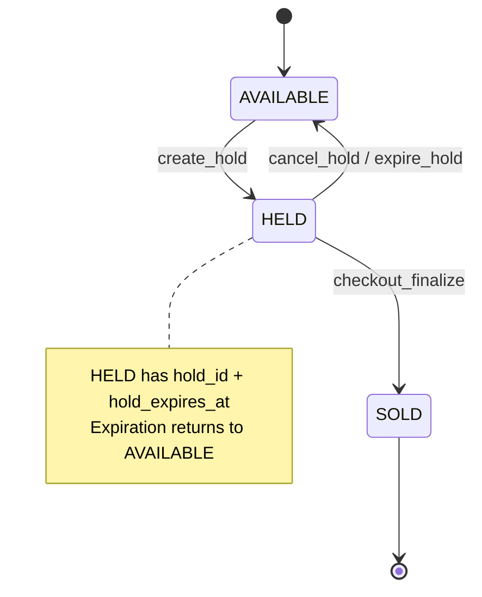
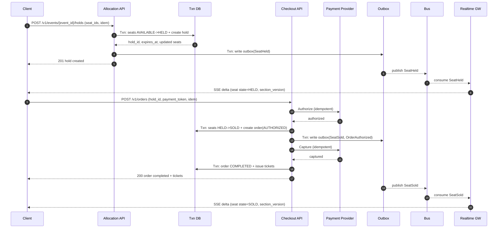

## Overview

A high-demand ticketing system is primarily a contention and fairness problem: a finite inventory (seats) is contested by large volumes of legitimate users and automated abuse within a short on-sale window. The system must prevent double-sells, keep the seat-map experience responsive, and remain operable under bursty load and partial failures.

The core design principle is to model seat inventory as a strongly consistent state machine with explicit lifecycle states and atomic transitions:

- `AVAILABLE → HELD → SOLD` (with a time-bounded hold/TTL)

Everything else (waiting room, caching, realtime updates, bot defenses) exists to protect and scale that transactional core without weakening correctness.

## Requirements

### Functional Requirements

- Browse events, venues, and showtimes; view pricing tiers and seat restrictions.
- View an interactive seat map with near-real-time availability changes.
- Create a temporary seat hold (cart) with expiration (typically 2–5 minutes).
- Enforce selection constraints:
  - contiguous seats / “best available” suggestions
  - accessibility rules and restricted-view labeling
  - per-account/per-household purchase limits
- Checkout that finalizes purchase: payment authorization/capture, ticket issuance, receipt.
- Release held seats on expiration or user cancellation.
- Abuse mitigation:
  - rate limiting and request shaping
  - device/account risk scoring
  - step-up challenges (CAPTCHA / proof-of-work)
  - enforcement of purchase limits across identities where possible
- Operator tooling:
  - event/venue setup, price tiers, seat blocks/holds (e.g., sponsor holds)
  - manual order/ticket actions (void/reissue), customer support lookup
  - immutable audit logs for seat ownership changes

### Non-Functional Requirements (SLO Targets)

#### Scale (Peak On-Sale)
Assumptions: a single “hot” on-sale can dominate traffic; most reads are cacheable; writes concentrate on the on-sale event.

- Concurrent viewers on a single hot event: **0.5–2.0M**
- Browse/read QPS (event pages, seatmap snapshot, metadata): **100–250k QPS**
- Hold attempts QPS (write-heavy): **10–30k QPS**
- Checkout starts QPS: **2–8k QPS**
- Seats per event: up to **100k**
- Events/year: **~50k** (long-tail mostly cold; hot events are rare but extreme)

#### Latency (User-Visible)
- Seat map assets (tiles/layout) via CDN: **P50 50–100ms, P99 250–500ms**
- Seat availability snapshot (cached): **P50 80–150ms, P99 400–800ms**
- Hold attempt (transactional): **P50 120–200ms, P99 600–1200ms** (contention-dependent)
- Checkout confirmation: **P50 500–900ms, P99 2–5s** (payment-provider dependent)

#### Availability
- Browse (mostly cached): **99.99%** monthly
- Holds/Checkout (transactional): **99.95%** monthly
- Realtime updates (best effort): **99.9%** monthly

#### Consistency & Correctness
- Strong consistency required for:
  - seat state transitions (`AVAILABLE/HELD/SOLD`)
  - order finalization (no double-sell)
  - purchase limit enforcement
- Eventual consistency acceptable for:
  - search indexing, analytics, recommendations, dashboards

#### Durability & Recovery
- Completed orders must not be lost.
- Transactional data RPO: **≤ 1 minute** (regional)
- Transactional path RTO: **≤ 30 minutes** (regional failover)
- Audit trail must be tamper-evident and queryable for investigations.

### Constraints & Assumptions

- Global audience; on-sale spikes are predictable (scheduled drops) but bursty in the first minutes.
- PCI scope minimized: rely on a PSP; store only tokens and provider references.
- Small team: prefer managed services (managed Postgres/Spanner, managed Kafka/PubSub, managed WAF).
- Compliance/ops: must support dispute handling, fraud investigations, and customer support workflows.

## Architecture

### High-Level Architecture

```mermaid
graph TB
  U[Web/Mobile Clients] --> CDN[CDN: Static + Seatmap Tiles]
  U --> WAF[WAF + Bot Management]
  WAF --> WR[Waiting Room / Admission Control]
  WR --> APIGW[API Gateway]

  APIGW --> BROWSE[Browse/Seatmap API]
  APIGW --> ALLOC[Seat Allocation API]
  APIGW --> CHECKOUT[Checkout API]
  APIGW --> RTGW[Realtime Gateway (SSE/WS)]

  BROWSE --> RC[(Read Cache: Redis)]
  BROWSE --> RDB[(Transactional DB Read Replica)]

  ALLOC --> RC
  ALLOC --> WDB[(Transactional DB Primary)]

  CHECKOUT --> WDB
  CHECKOUT --> PSP[Payment Provider]
  CHECKOUT --> TIX[Ticket Issuance Service]

  WDB --> OUTBOX[Transactional Outbox]
  OUTBOX --> BUS[Event Bus (Kafka/PubSub)]
  BUS --> RTGW
  BUS --> ANALYTICS[Analytics/Indexing Consumers]
```

### Key Ideas (Interview-Level Summary)

- **Admission control** keeps the transactional tier stable under extreme bursts.
- **One authoritative transactional store** for seat state prevents double-sells.
- **Cache + CDN** makes reads cheap; **push deltas** avoids polling storms.
- **Idempotency everywhere** (holds, orders, payments) enables safe retries.
- **Partition by `event_id`** to localize contention and scale hot events independently.
- **Outbox pattern** makes realtime updates and downstream consumers reliable without coupling to the write transaction.

## Components

### Edge Protection & Waiting Room

**Responsibilities**
- Block obvious abuse at the edge (bots, credential stuffing, scraping).
- Flatten bursts to keep DB and allocation latency within SLO.
- Enforce “fairness” policies (e.g., limit parallel sessions, require login at certain steps).

**Design**
- Token-based admission per event:
  - signed token includes `event_id`, `issued_at`, `expires_at`, and optional `risk_tier`
  - rate-limited issuance keyed by account/device/IP/ASN
- Progressive friction:
  - rate limit → step-up challenge → temporary block → longer ban
- Fail modes:
  - fail-open for **browse** where safe
  - fail-closed (or heavily throttled) for **hold/checkout** to protect correctness

**Notes**
- Keep the waiting room stateless where possible; store queue state in a highly available KV if needed.
- Treat bot detection as probabilistic: optimize for minimizing false positives during on-sale.

---

### Browse & Seat Map Service

**Responsibilities**
- Serve event metadata, pricing tiers, and seatmap layout assets.
- Serve a compact availability snapshot per section/zone.

**Design**
- Seatmap layout delivered via CDN (immutable versioned assets).
- Availability snapshot is a compressed bitmap per section/price tier with a monotonic `section_version`.
- Conditional fetch:
  - `ETag`/`If-None-Match` for metadata
  - `since_version` for availability (if behind or mismatched, return full snapshot)

---

### Seat Allocation Service (Holds)

**Responsibilities**
- Create/cancel/expire holds atomically.
- Enforce selection constraints and purchase limits at hold time where applicable.
- Publish seat state changes for realtime updates.

**Correctness Model**
- The DB is the source of truth.
- A seat can be in exactly one state at a time, enforced by conditional updates.
- All write paths are idempotent.

**Transaction Pattern (Postgres-friendly)**
- Attempt to claim seats using a single conditional update per seat set:
  - `UPDATE seats SET state='HELD', hold_id=$1, hold_expires_at=$2, state_version=state_version+1
     WHERE event_id=$3 AND seat_id = ANY($4) AND state='AVAILABLE';`
- Validate that updated row count equals requested seat count; otherwise rollback and return `409`.
- Create `holds` + `hold_items` in the same transaction.

**Partitioning**
- Route all holds for a given `event_id` to the same shard group (application routing + DB partitioning).
- For very large venues, optionally partition further by `(event_id, section_id)` while preserving correctness.

**Hold Expiration**
- Store `hold_expires_at` durably in the DB.
- Expiration is handled by:
  - a periodic sweeper (`EXPIRED` holds) plus
  - lazy cleanup on read/write (if a seat is `HELD` but expired, treat as reclaimable and fix within the transaction)

---

### Checkout Service (Order Finalization)

**Responsibilities**
- Convert holds into orders; orchestrate payment; issue tickets.
- Provide clear, resumable order state to clients.

**Recommended Flow (Minimize Paid-But-No-Seat Risk)**
1. **Authorize** payment with PSP (idempotent).
2. In a DB transaction:
   - verify hold is `ACTIVE` and not expired
   - transition seats `HELD → SOLD`
   - mark hold `CONVERTED`
   - create/update order row (`AUTHORIZED`)
3. **Capture** payment (idempotent).
4. Mark order `COMPLETED`, issue tickets.

**Compensation**
- If capture fails after seats are marked `SOLD`:
  - mark order `FAILED`
  - attempt to void/cancel authorization (provider-dependent)
  - release seats back to `AVAILABLE` in a compensating DB transaction
  - emit audit log entries for every transition

This design intentionally prefers a brief “reserved” window (seats sold while capture is in-flight) over the worse outcome of capturing funds without securing inventory.

---

### Realtime Availability (SSE / WebSocket)

**Responsibilities**
- Push low-latency deltas to many concurrent viewers.
- Provide resumability and a path to resync.

**Design**
- Clients subscribe by `event_id` and optionally `section_id`.
- Server emits:
  - compact delta events (`seat_id`, `state`, `section_version`, timestamp)
  - periodic “watermark” events per section (helps clients detect gaps)
- Resume:
  - clients send `Last-Event-ID` (SSE) and `since_version`
  - if the client is too far behind, server instructs a full snapshot refresh

**Backpressure**
- Coalesce deltas per section every **100–250ms** during high churn.
- Drop non-critical intermediate updates if necessary, but always converge to correct current state.

## Data Model

### Seat State Machine



### Storage Schema (Relational)

**events**
- `event_id (PK)`, `venue_id`, `name`, `start_time`, `onsale_time`, `status`
- `seatmap_version` (layout asset version), `created_at`, `updated_at`

**seats**
- `event_id (PK part)`, `seat_id (PK part)`
- `section_id`, `row`, `number`, `price_tier_id`
- `attributes JSONB` (accessibility, restricted view, etc.)
- `state ENUM('AVAILABLE','HELD','SOLD')`
- `hold_id NULL`, `hold_expires_at NULL`
- `order_id NULL`
- `state_version BIGINT` (monotonic)
- Indexes:
  - `(event_id, section_id, state)` for availability snapshots
  - `(event_id, hold_id)` for expiry cleanup

**holds**
- `hold_id (PK)`, `event_id`, `user_id`, `device_id`
- `status ENUM('ACTIVE','EXPIRED','CANCELLED','CONVERTED')`
- `expires_at`, `created_at`, `cancelled_at`
- `idempotency_key` (unique with `user_id,event_id`)

**hold_items**
- `(hold_id, seat_id)` (PK), `event_id`
- (store `event_id` for efficient joins and partition pruning)

**orders**
- `order_id (PK)`, `event_id`, `user_id`
- `status ENUM('PENDING','AUTHORIZED','COMPLETED','CANCELLED','FAILED')`
- `total_amount`, `currency`, `created_at`, `updated_at`
- `idempotency_key` (unique with `user_id`)

**payments**
- `payment_id (PK)`, `order_id`
- `provider`, `provider_ref` (unique)
- `status ENUM('INIT','AUTHORIZED','CAPTURED','FAILED','VOIDED','REFUNDED')`
- `amount`, `created_at`, `updated_at`

**tickets**
- `ticket_id (PK)`, `order_id`, `event_id`, `seat_id`
- `barcode_token` (opaque, signed or random), `status ENUM('ISSUED','VOIDED')`
- Unique `(event_id, seat_id)` to enforce single ticket per seat

**audit_log**
- `audit_id (PK)`, `event_id`
- `actor_type`, `actor_id`
- `action` (e.g., `SEAT_HELD`, `SEAT_RELEASED`, `SEAT_SOLD`, `ORDER_FAILED`)
- `payload JSONB`, `created_at`

### Data Flow (Hold → Order → Realtime)



## API

### Browse & Seat Map

- `GET /v1/events?query=&date=&city=&cursor=` → paginated event list (cached; eventual consistency)
- `GET /v1/events/{event_id}` → event metadata + pricing tiers (cached)
- `GET /v1/events/{event_id}/seatmap/layout` → layout asset URLs (CDN, versioned)
- `GET /v1/events/{event_id}/seatmap/availability?section_id=&since_version=` → availability snapshot/delta

### Realtime Stream (SSE)

- `GET /v1/events/{event_id}/availability/stream?section_id=...`
  - Response headers:
    - `Content-Type: text/event-stream`
    - `Cache-Control: no-cache`
  - Example events:
    ```
    id: 90238123
    event: seat_delta
    data: {"event_id":"E1","section_id":"A","seat_id":"S1","state":"HELD","section_version":1842,"ts":"2025-12-17T12:00:00Z"}
    ```

**Common errors**
- `429` rate limited / bot throttled
- `503` admission control active (retry-after)
- `404` unknown event/section

---

### Holds

- `POST /v1/events/{event_id}/holds`
  - Headers: `Idempotency-Key: <uuid>`
  - Request:
    ```json
    { "seat_ids": ["S1","S2"], "client_snapshot_version": 1840 }
    ```
  - Response:
    ```json
    { "hold_id": "H123", "expires_at": "2025-12-17T12:05:00Z", "seats": ["S1","S2"], "section_version": 1842 }
    ```

- `DELETE /v1/holds/{hold_id}`
  - Idempotent cancel; returns `204` even if already cancelled/expired.

**Contention behavior**
- If any seat is not `AVAILABLE`, return:
  - `409 CONFLICT`
  - body includes `unavailable_seat_ids` and (optional) `suggested_seat_ids` for “best available”.

---

### Checkout

- `POST /v1/orders`
  - Headers: `Idempotency-Key: <uuid>`
  - Request:
    ```json
    { "hold_id": "H123", "payment_token": "tok_x" }
    ```
  - Response:
    ```json
    { "order_id": "O123", "status": "COMPLETED", "tickets": [{ "seat_id": "S1", "barcode_token": "..." }] }
    ```

**Checkout errors**
- `402` payment failed (mapped provider code)
- `409` hold expired / already converted
- `422` policy violation (purchase limit, restricted seat rules)
- `503` dependent service unavailable (with safe retry guidance)

## Scaling

### Bottlenecks and Mitigations

**1) Transaction hot-spot on a single event**
- Problem: many concurrent conditional updates to the same event partition.
- Mitigations:
  - route by `event_id` to a dedicated shard group (avoid cross-shard coordination)
  - keep transactions small (single round trip conditional update + minimal writes)
  - batch seat updates in one statement when possible
  - separate browse/read replicas from write primary

**2) Seatmap reads at massive fanout**
- Problem: millions of clients can overwhelm origin if they poll.
- Mitigations:
  - CDN for immutable layout
  - cache availability snapshots in Redis (short TTL, write-through on transitions)
  - SSE/WS deltas to remove polling load
  - provide “section-level” granularity (clients view one section at a time; avoid global updates)

**3) External payment latency and timeouts**
- Problem: PSP is the longest pole and a common failure domain.
- Mitigations:
  - strict timeouts + retries with jitter for safe operations
  - circuit breaker to fail fast during outages
  - clear client state machine (“processing”, “authorized”, “completed”) and resumable order fetch

### Caching Strategy

- CDN:
  - event pages, seatmap layout assets, static pricing rules (TTL minutes–hours, versioned)
- Redis (read cache; DB remains authoritative):
  - `availability:{event_id}:{section_id}` bitmap + `section_version`
  - `hold_meta:{hold_id}` (short TTL) for quick validation and UI countdown
- Drift handling:
  - write-through updates on every seat transition
  - periodic reconciliation job to detect inconsistencies and repopulate cache from DB

### Multi-Region (Optional, Production-Grade)

- Prefer **single-writer per `event_id`** (home region) to avoid split-brain.
- Global routing:
  - route holds/checkout to the event’s home region (GeoDNS/Anycast + lookup)
  - allow browse from any region (cached)
- Failover:
  - lease/fencing to guarantee at most one active writer for an event
  - warm standby that can assume the lease if the primary region fails

## Trade-offs

### Trade-offs Made

1) **Strong consistency in a transactional DB for seat transitions**
- Pros: prevents double-sell; strong auditability; simpler correctness proof.
- Cons: higher write latency and lower peak throughput than pure in-memory inventory.

2) **Admission control (waiting room) during on-sale**
- Pros: protects transactional tier; stabilizes latency; improves perceived fairness.
- Cons: introduces queueing and operational complexity (token issuance, tuning).

3) **Push-based deltas (SSE) instead of polling**
- Pros: dramatically reduces read QPS and bandwidth during churn; better UX.
- Cons: long-lived connections and backpressure handling; requires resync logic.

### Alternatives (When You’d Choose Them)

- **Redis as source of truth (bitmaps + Lua)**
  - Choose for ultra-low latency in exchange for more complex durability, recovery, and audit requirements.
- **Single-writer allocator per event (serialized command log)**
  - Choose when events are small/medium and simplicity is paramount; scale by section for very large venues.
- **Event sourcing for inventory and orders**
  - Choose when replay/forensics and audit are primary requirements and the team can support the operational complexity.

## Failure Modes

### Failure Scenarios and Mitigations

1) **Allocation worker crash during hold**
- Impact: client sees timeout; hold may or may not have been created.
- Mitigation: idempotency key returns the original result on retry; DB transaction boundaries prevent partial seat states.

2) **Redis outage or severe degradation**
- Impact: slower availability snapshots; realtime may be stale; origin load increases.
- Mitigation: fall back to DB reads for critical paths; temporarily disable deltas and require snapshot refresh; rebuild caches from DB.

3) **Payment provider outage/latency spike**
- Impact: checkouts fail or hang; holds expire.
- Mitigation: circuit breaker + fail fast; optional selective hold extension for users already authorized (policy-dependent); multi-PSP fallback if supported.

4) **Message bus / realtime fanout lag**
- Impact: clients see stale seat states.
- Mitigation: include `section_version` in deltas; clients detect gaps and refetch snapshot; treat realtime as best-effort UI enhancement, not correctness source.

5) **DB primary failover during on-sale**
- Impact: short write unavailability; increased latency.
- Mitigation: multi-AZ synchronous replication; automatic failover; allocation service uses retries with bounded timeouts; admission control reduces thundering herd during recovery.

6) **Split-brain risk in multi-region writers**
- Impact: potential conflicting seat transitions if two writers accept writes.
- Mitigation: strict single-writer per `event_id` with leased fencing token; reject writes without a valid lease.

### Disaster Recovery

- Backups: continuous WAL/binlog archiving + daily full backups; quarterly restore drills.
- RPO: ≤ 1 minute (regional); cross-region replication typically async.
- RTO: ≤ 30 minutes for transactional paths via warm standby promotion and global reroute.
- Runbooks: explicit “safe mode” (browse-only), and “hold freeze” if invariants are at risk.

## Operations

### Observability (SLO-Driven)

**Core metrics**
- Holds:
  - hold success rate, `409` contention rate
  - DB transaction latency (P50/P95/P99)
  - expired-hold cleanup lag
- Checkout:
  - authorize/capture success rates, provider latency
  - order completion time distribution
- Realtime:
  - active connections, event lag, drop rate, reconnect rate
- Abuse/Fairness:
  - requests per account/device/IP/ASN
  - challenge pass rate, false-positive reports
  - purchase limit violation rate

**Correctness canaries**
- Invariant: a seat cannot be sold twice
  - periodic query: any `(event_id, seat_id)` mapped to multiple `COMPLETED` orders must be **zero**
- Invariant: `SOLD` seats must have `order_id` set and corresponding `COMPLETED`/`AUTHORIZED` order

### Deployment & Change Management

- Canary or blue/green for stateless services; gradual ramp during non-on-sale windows.
- Change freeze around major on-sales for allocation/checkout (or feature-flag only changes).
- Schema migrations:
  - expand/contract, backward compatible, guarded by feature flags
- Incident controls:
  - “safe mode” toggle (disable holds/checkout, allow browse)
  - per-event throttles and admission rate adjustments

### Security & Compliance (Practical)

- Store no raw card data; use PSP tokens and provider references.
- Protect PII with encryption at rest and strict access controls.
- Audit log is immutable (append-only) and retained per policy.
- Rate limits and anomaly detection are part of the security boundary, not just performance optimization.

## References & Further Reading

- Stripe/Adyen documentation on idempotency and safe retries (payments).
- Transactional Outbox pattern (reliable event publishing with DB transactions).
- Postgres concurrency control: conditional updates, row-level locking, and transaction isolation.
- Kafka/PubSub partitioning strategies (keyed by `event_id`) and consumer lag monitoring.
- CDN/WAF waiting room patterns and bot management guides (Cloudflare/Akamai).
- Lease/fencing patterns for single-writer safety in distributed systems.