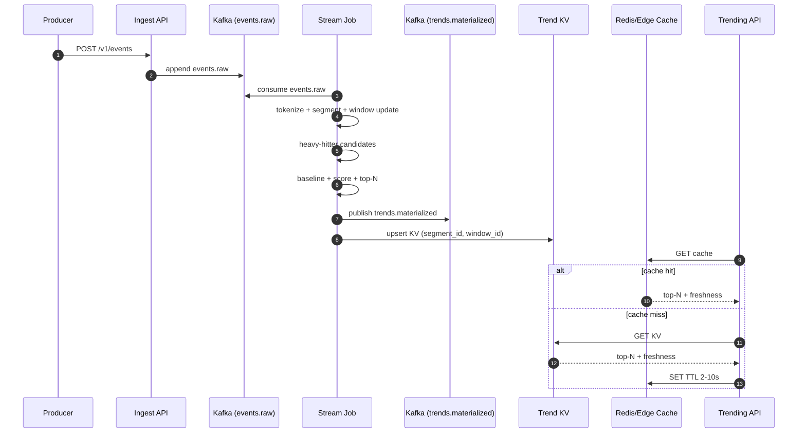

## Overview

A Trending Topics Engine identifies keywords (hashtags, entities, or normalized phrases) whose popularity is *surging now*—not merely those with the highest absolute volume. The system must ingest a high-throughput event stream (posts, searches, clicks), continuously compute statistics over **event-time sliding windows**, and serve top-N results with low latency while remaining robust to spam, duplication, and “always popular” terms.

The core idea is to separate the problem into two layers:

1. **Candidate generation (bounded memory):** Maintain approximate heavy-hitter candidates per segment (e.g., region+language+topic) using stream algorithms with predictable memory/CPU.
2. **Trend scoring (burst vs baseline):** Compare short-term rates to longer-term baselines (or EWMAs) to detect bursts, plus apply quality/abuse signals.

This enables near-real-time updates (seconds), supports replay/backfill from a durable log, and provides operational safety (recoverable state, explicit failure handling, and knobs for degradation).

---

## Requirements

### Functional Requirements
- Ingest high-volume events with timestamps and metadata (region, language, source, optional topic).
- Normalize raw text into tokens/keywords (casefolding, Unicode normalization, hashtag parsing, optional entity extraction), and apply stopword/blocked-term filtering.
- Compute trending tokens using **event-time sliding windows** (e.g., last `1m`, `5m`, `15m`) and rank by a **trend score** (burstiness), not raw count.
- Support segmentation by region and language; optional topic/category with configurable granularity.
- Provide query APIs to fetch top-N trends per segment/window with freshness indicators and stable ordering.
- Anti-abuse controls:
  - Deduplication (idempotent ingestion + downstream idempotency).
  - Rate limits and bot/spam hooks.
  - Allowlist/blocklist and “kill switch” per segment/token class.
- Support replay/backfill from an event log to rebuild state or recompute with new logic.
- Provide explainability metadata per trend: short-window count, baseline estimate, score breakdown, and data-quality flags (e.g., low diversity).

### Non-Functional Requirements
- **Scale (peak):**
  - Ingest: **1,000,000 events/sec** globally; **200,000/sec** average.
  - Token fanout: assume **avg 3 tokens/event** after normalization → **~3,000,000 token-events/sec** peak.
  - Read QPS: **20,000 QPS** global for “get trending” (primarily cache/edge hits).
- **Latency SLOs:**
  - Ingest acknowledgment: **P99 < 100ms** (enqueue to durable log).
  - Trend update availability (event time → queryable): **P50 < 2s, P99 < 10s** for hot segments; less active segments may update every 5–10s.
  - Query API: **P50 < 30ms, P99 < 150ms** (cache hit), **P99 < 400ms** (cache miss).
- **Availability SLOs:**
  - Query APIs: **99.99%** (multi-AZ, cache-first).
  - Ingestion pipeline: **99.9%** (backpressure acceptable; no silent loss).
- **Consistency Model:**
  - Ingestion: **at-least-once** to the event log; downstream must tolerate duplicates.
  - Trending results: **eventual consistency** within update SLA; deterministic ordering within a single materialization.
- **Durability / Retention:**
  - Event log retention: **14–30 days** (replayable; longer if regulatory/business requires).
  - Materialized trends: rebuildable from event log; serving store is a cache/derived view.
  - Target RPO: **≤ 1 minute** for serving state; **0** for event log (with replication).
- **Privacy & Compliance:**
  - No raw PII stored in serving index; only normalized tokens and aggregate stats.
  - Access to raw content (if any) is restricted and audited; trend explainability must not reveal sensitive user data.

### Constraints & Assumptions
- Team can operate Kafka (or equivalent log), a stream processor (Flink/Kafka Streams), and a low-latency KV store + Redis.
- Computation must be in **event time** (not processing time) to handle out-of-order events and regional clock skew.
- Budget favors bounded-memory approximate algorithms over exact global counting for all tokens.

---

## Architecture

### High-Level Diagram

```mermaid
flowchart TB
  subgraph Producers
    A1[Mobile/Web Apps]
    A2[Search/Click Streams]
    A3[Partner Feeds]
  end

  subgraph Ingest
    B1[Edge/LB]
    B2[Ingest API<br/>validate + throttle + enrich]
    B3[(Schema Registry)]
  end

  subgraph Log
    C1[(Kafka: events.raw<br/>RF=3, retention 14-30d)]
    C2[(Kafka: trends.materialized<br/>compacted)]
  end

  subgraph Processing
    D1[Stream Job(s)<br/>tokenize + windowing]
    D2[Heavy-Hitter Candidates<br/>SpaceSaving/CMS]
    D3[Baseline + Scoring<br/>EWMA / long window]
  end

  subgraph Serving
    E1[(Trend KV Store)]
    E2[(Redis Cache)]
    E3[Trending API]
    E4[CDN/Edge Cache]
  end

  subgraph ControlPlane
    F1[(Config Store<br/>stopwords, blocked, params)]
    F2[Admin API<br/>audited]
  end

  A1 --> B1 --> B2
  A2 --> B1
  A3 --> B1
  B2 <--> B3
  B2 --> C1

  C1 --> D1
  D1 --> D2 --> D3
  D3 --> C2
  D3 --> E1

  E3 --> E2 --> E1
  E4 --> E3
  F2 --> F1
  F1 --> D1
  F1 --> E3
```

### Architecture Notes
- **Durable log first:** Ingest acks only after writing to `events.raw` (or equivalent), enabling replay/backfill and simplifying failure recovery.
- **Derived serving state:** The KV store contains only materialized top-N lists and metadata. If lost, it can be rebuilt.
- **Cache-first reads:** Most query traffic is served from Redis/edge cache with short TTLs and freshness metadata.

---

## Components

### 1) Ingest API
- Validates schema and timestamps, applies per-source/user rate limits, and publishes to `events.raw`.
- Enforces idempotency on `(source, event_id)` within a rolling window (e.g., 24h) to reduce duplicates.

### 2) Stream Processing
- Tokenizes/enriches events, assigns segments, and computes windowed aggregates in event time with watermarks and allowed lateness.
- Uses bounded-memory heavy-hitter structures to keep candidate sets small and predictable.

### 3) Trend Scoring
- Computes burst scores vs baseline, applies minimum-support thresholds, and integrates abuse/quality signals (e.g., diversity).

### 4) Materialization + Serving Index
- Writes top-N per `(segment, window)` to a KV store; Redis/edge caches provide low-latency reads.

### 5) Control Plane (Config + Admin)
- Versioned, audited configuration for stopwords, blocked tokens, segmentation rules, scoring parameters, and kill switches.

---

## Detailed Design

### Ingest API & Normalization

**Responsibilities**
- Validate request schema and ensure `event_time_ms` is within acceptable skew (e.g., reject if > 10m in the future; accept late events up to retention policy).
- Attach derived metadata (`segment_id`, `source_type`, optional `topic`) and publish to `events.raw`.
- Enforce abuse controls at the edge: IP/user/source rate limits, payload size limits, and basic anomaly gates.

**Partitioning**
- Partition `events.raw` by a stable key that spreads load but preserves useful locality:
  - Recommended: `partition_key = hash(segment_id) XOR hash(event_id)` (or `user_hash` if present).
  - Avoid partitioning by time buckets (causes artificial hotspots and re-keying issues).

**Idempotency**
- Ingest service: idempotent on `(source, event_id)` with a fast store (in-memory + bounded Redis fallback) for 24h.
- Downstream: treat events as at-least-once; use `event_id` for de-dup where it matters (especially for high-impact sources).

**Technology**
- Stateless service (Go/Java) behind Envoy/NGINX.
- Kafka producer with idempotent producer enabled; schema registry (Protobuf/Avro/JSON Schema) with compatibility rules.

---

### Stream Processing: Windowing + Heavy Hitters

**Event Time and Lateness**
- Watermarks based on observed event-time delay distribution.
- Typical config:
  - Allowed lateness: **30s** (hot paths) to **2m** (global feeds).
  - Emit materializations every **1–2s** for hot segments; every **5–10s** for long tail.

**Windowing**
- Sliding windows (event time), e.g.:
  - `1m` window, slide `1s`
  - `5m` window, slide `2s`
  - `15m` window, slide `5s`
- Maintain windowed counts with incremental updates (avoid recomputing from scratch).

**Heavy-Hitter Candidate Generation (Bounded Memory)**
- Maintain candidates per `(segment_id, window_id, shard)` using one of:
  - **SpaceSaving/Frequent** for top-K candidates with strong practical accuracy.
  - **Count-Min Sketch (CMS)** for frequency estimation when token cardinality is very high, paired with a small heap for top-K extraction.
- Two-stage aggregation to handle hotspots:
  1. **Shard stage:** key by `(segment_id, shard_id)` where `shard_id = hash(token) mod S` for large segments.
  2. **Merge stage:** merge shard top-K into segment top-K; recompute scores on merged candidates.

**State Management**
- RocksDB state backend (Flink) with TTL:
  - Short-window structures: TTL ~ `window + lateness + safety` (e.g., 7–20 minutes).
  - Baseline state: TTL 24–72h depending on baseline method.
- Checkpointing:
  - Periodic checkpoints (e.g., 30–60s) to durable storage for recoverability.
  - Exactly-once sinks can be used for the materialized topic/KV updates if operationally justified; otherwise tolerate duplicates and ensure idempotent upserts.

---

### Trend Scoring & Baselines

**Goal**
- Promote tokens with rapid increases while demoting tokens that are consistently high volume.

**Signals**
- `short_count`: count in short window (e.g., 5m).
- `baseline_rate`: expected rate from one of:
  - Long window rate (e.g., 1h or 24h), or
  - **EWMA** updated continuously (lower state and faster adaptation).
- Optional quality/abuse signals (applied only to candidates to keep state bounded):
  - `unique_users_est`: approximate unique users in short window (e.g., HLL sketch per candidate token, capped).
  - `source_mix`: diversity across sources (post/search/click).
  - `dedup_ratio`: fraction of duplicates for a token.

**Example Scoring**
A practical, stable scoring function that behaves well at different volumes:

- `short_rate = short_count / short_window_seconds`
- `score_raw = (short_rate - baseline_rate) / sqrt(baseline_rate + 1e-3)`
- `support_boost = log1p(short_count)`
- `diversity_factor = clamp(unique_users_est / max(short_count,1), 0.05, 1.0)`
- `score = score_raw * support_boost * diversity_factor`

**Guardrails**
- Minimum support thresholds (per window): e.g., for `5m`, require `short_count >= 200` (tunable by segment).
- Blocklist/allowlist overrides.
- “Always trending” suppression: if token is top-K in baseline for prolonged periods, require a higher burst delta.

**Explainability**
For each token in results, return:
- `short_count`, `baseline_rate`, `score`, `watermark_ms`, and flags (e.g., `low_diversity`, `high_dup`).

---

### Materialization, Serving Index & Cache

**Materialization Output**
- Materialize **top-N lists** per `(segment_id, window_id)` at a fixed cadence (1–10s).
- Store ranking deterministically:
  - Primary: `score` desc
  - Tie-breakers: `short_count` desc, then `token` asc (stable for clients/caches)

**Serving Store**
- KV store holds:
  - Latest materialization per key, plus optional recent history for debug (e.g., last 5 snapshots).
- Redis/edge cache:
  - TTL 2–10s, jittered to avoid thundering herds.
  - `stale-while-revalidate`: allow serving results up to 30s old during partial outages, marked via `as_of_time_ms`.

**Multi-Region**
- Compute can be regional (closest ingestion) with global aggregation optional:
  - Regional trending: simplest and lowest latency.
  - Global trending: add a merge stage that consumes per-region materializations and re-scores globally.
- Query API routes to nearest region; global results served from globally replicated store or a dedicated “global” region.

---

## Data Model

### Identifiers
- `segment_id`: canonical string or integer derived from `{region, language, topic?}` (e.g., `us|en|sports`).
- `window_id`: enum (`1m`, `5m`, `15m`).
- `as_of_time_ms`: event-time aligned materialization timestamp.

### Kafka Topics

**`events.raw` (partitioned, retained)**
```json
{
  "event_id": "uuid",
  "event_time_ms": 1734370000123,
  "source": "post|search|click",
  "region": "us",
  "language": "en",
  "text": "Some text with #hashtag",
  "user_hash": "opaque",
  "metadata": { "topic": "sports" }
}
```

- Retention: 14–30 days
- Replication factor: 3 (rack/AZ-aware)
- Compression: zstd/snappy (based on CPU budget)

**`trends.materialized` (compacted)**
```json
{
  "segment_id": "us|en|sports",
  "window_id": "5m",
  "as_of_time_ms": 1734370009000,
  "watermark_ms": 1734370007000,
  "topk": [
    {
      "token": "worldcup",
      "score": 12.4,
      "short_count": 18200,
      "baseline_rate": 9000.0,
      "rank": 1,
      "flags": ["ok"]
    }
  ],
  "version": "scoring-v3"
}
```

- Compaction: keeps latest value per `(segment_id, window_id)` (or include `as_of_bucket` if you want multiple snapshots)
- Useful as a recovery source and as a fallback read path

### Serving KV (example)

- Key: `segment_id|window_id`
- Value:
  - `as_of_time_ms`
  - `watermark_ms`
  - `topk[]` (token, score, short_count, baseline_rate, rank, flags)
  - `version` (scoring/config version)

### Config Store
- `stopwords:{language}` → set
- `blocked_tokens:{segment_id}` → set + reason/audit metadata
- `scoring_params:{segment_id}` → windows, thresholds, lateness, diversity thresholds
- `kill_switch:{segment_id}` → boolean + reason + expiry

---

## Data Flow



---

## API Design

### Ingestion API (REST)

**POST** `/v1/events`

Request:
```json
{
  "event_id": "uuid",
  "event_time_ms": 1734370000123,
  "source": "post|search|click",
  "region": "us",
  "language": "en",
  "text": "Some text with #hashtag",
  "user_hash": "opaque",
  "metadata": { "topic": "sports" }
}
```

Response:
```json
{ "status": "accepted" }
```

Errors:
- `400` invalid schema/timestamp (e.g., too far in the future)
- `429` rate limited
- `503` cannot enqueue (log unavailable/backpressure)

Idempotency:
- Required `event_id`; idempotent per `(source, event_id)` for a retention window (e.g., 24h).

---

### Trending Query API (REST)

**GET** `/v1/trending`

Query params:
- `region` (required)
- `language` (required)
- `topic` (optional)
- `window=1m|5m|15m` (required)
- `limit` (optional, default 50, max 100)

Response:
```json
{
  "segment": { "region": "us", "language": "en", "topic": "sports" },
  "window": "5m",
  "as_of_time_ms": 1734370009000,
  "watermark_ms": 1734370007000,
  "version": "scoring-v3",
  "results": [
    {
      "token": "worldcup",
      "score": 12.4,
      "short_count": 18200,
      "baseline_rate": 9000.0,
      "rank": 1,
      "flags": ["ok"]
    }
  ]
}
```

Errors:
- `400` invalid params
- `404` unknown segment (optional; many systems return empty list instead)
- `503` backend unavailable (may still return stale if enabled)

Caching:
- Support `ETag` or `Cache-Control: max-age=2, stale-while-revalidate=30`.
- Clients can use `as_of_time_ms` for local caching.

---

### Admin APIs (Audited)

**POST** `/v1/admin/blocked-tokens`

```json
{ "segment_id": "us|en|sports", "tokens": ["..."], "reason": "..." }
```

- Permissioned and audited.
- Changes versioned and propagated to stream jobs within seconds (config broadcast).

---

## Scaling & Performance

### Capacity Sketch
- Peak 1,000,000 events/sec; assuming ~1 KB/event average (compressed on wire/log), log ingress is manageable with sufficient brokers and batching.
- Token fanout (~3,000,000 token-events/sec peak) is typically the dominant compute cost; optimize tokenization and avoid expensive NLP on the hot path unless required.
- Kafka partitions:
  - If a consumer task can sustainably handle ~5,000 events/sec (after batching), 1,000,000/sec implies ~200 partitions at peak for `events.raw` (plus headroom; commonly 2–3× → 400–600 partitions).
  - Validate with load tests using realistic tokenization and window updates.

### Common Bottlenecks and Mitigations
- **Hot segments (skew):** shard hot segments by token hash and use two-stage aggregation; consider separate pipelines for “global” vs “regional”.
- **Token explosion (spam/garbage):** strict normalization rules, stopwords, min/max token length, reject high-entropy tokens, and per-user/token rate limits.
- **State growth:** bounded heavy-hitter structures + TTL; baseline state only for candidates (and recently-trending tokens).
- **Lag during spikes:** autoscale compute, increase parallelism, and degrade gracefully by lengthening emit interval and tightening candidate limits (K).

### Caching Strategy
- Redis/edge cache key: `(segment_id, window_id)`; TTL 2–10s with jitter.
- Prefer TTL-based freshness over explicit invalidation (updates are frequent).
- Optional: push-based cache warming for top segments when new materializations arrive.

---

## Trade-offs & Alternatives

### Key Trade-offs
- **Approximate heavy hitters vs exact counts**
  - Cost: long-tail accuracy and deterministic completeness.
  - Benefit: bounded memory and predictable performance at high throughput.
- **Precomputed top-N materialization vs on-demand aggregation**
  - Cost: less flexible ad-hoc analytics at read time.
  - Benefit: consistent low-latency reads and simple caching.
- **Event-time processing with watermarks vs processing-time**
  - Cost: complexity (lateness handling, watermark tuning).
  - Benefit: correctness under out-of-order delivery and clock skew.
- **Exactly-once end-to-end vs idempotent at-least-once**
  - Cost: operational complexity and throughput overhead for strict exactly-once sinks.
  - Benefit: simpler mental model; often unnecessary if serving writes are idempotent and results are periodically recomputed.

### Alternative Approaches
- **Spark Structured Streaming (micro-batch):** easier for batch-oriented orgs; typically higher freshness latency and different watermark semantics.
- **Search-index aggregations (Elasticsearch/OpenSearch):** convenient for exploration, but expensive for high-ingest sliding windows and burst scoring at second-level cadence.
- **Pure sketching without candidate sets:** minimal memory, but ranking and explainability are harder; tends to be weaker under adversarial/spam conditions.

---

## Failure Modes & Mitigations

### Failure Scenarios
- **Kafka under-replication / broker loss**
  - Impact: backpressure, delayed trend updates.
  - Detection: ISR shrink, produce errors, consumer lag.
  - Mitigation: RF=3, rack/AZ-aware placement, quotas, retry with backoff, and load shedding on ingest.

- **Stream job crash / checkpoint failures**
  - Impact: temporary trend gaps, slower freshness.
  - Detection: job health, checkpoint duration/failures, watermark delay spikes.
  - Mitigation: periodic checkpoints, restart strategies, replay from Kafka, blue/green deployments with parallel validation.

- **Hotkey skew during major events**
  - Impact: lag increases, SLA misses for the hot segment.
  - Detection: per-segment lag, partition-level throughput imbalance, operator backpressure.
  - Mitigation: segment sharding + two-stage merge, adaptive shard counts for hot segments, caps on per-token update work.

- **Spam/bot attack generating artificial trends**
  - Impact: corrupted results and trust loss.
  - Detection: low unique-user ratio, unusual source mix, high duplication, token entropy anomalies.
  - Mitigation: edge rate limits, dedup, diversity thresholds, reputation signals, rapid blocklisting, and segment kill switches.

- **Serving KV partial outage**
  - Impact: query failures or stale results.
  - Detection: elevated P99/5xx, replica lag, timeout rate.
  - Mitigation: cache-first with stale-while-revalidate, multi-AZ replicas, fallback reads from `trends.materialized`.

- **Watermark misconfiguration (too strict or too lax)**
  - Impact: missing late events (too strict) or delayed results (too lax).
  - Detection: late-event drop metrics, watermark delay distribution drift.
  - Mitigation: dynamic watermark tuning per segment/source; expose lateness metrics and enforce reasonable bounds.

### Disaster Recovery
- Targets: **RTO 15 minutes**, **RPO 1 minute** for serving materializations; **RPO 0** for event log with replication.
- Strategy:
  - Kafka: cross-cluster replication (Cluster Linking / MirrorMaker 2) for critical pipelines.
  - Stream state: checkpoints in durable object storage; routine restore drills.
  - Serving KV: snapshots + incremental backups; multi-region replication if needed.
- Procedure:
  - Promote secondary log/compute cluster, restart stream jobs from replicated topics/checkpoints.
  - Route query traffic to healthy region; warm caches from latest materializations.

---

## Operations

### Monitoring & Alerting
- Ingest: RPS, P99 latency, 4xx/5xx, enqueue success rate, rate-limit counts.
- Kafka: consumer lag per group/partition, ISR/URP, throughput, produce/consume errors.
- Stream jobs: watermark delay, late-event rate, checkpoint duration/failures, RocksDB state size, backpressure.
- Serving: cache hit rate, KV P99, stale-serve rate, request error rate, top segment QPS.
- Data quality: tokenization success rate, dropped-event reasons, volatility metrics, “always-trending” suppression stats.

Suggested paging alerts:
- Consumer lag > 60s for top segments (sustained)
- Watermark delay > 30s sustained for hot segments
- Query 5xx > 1% or P99 > 400ms
- Checkpoint failures > 3 in 10 minutes

### Deployment & Change Management
- Blue/green for stream jobs (new consumer group) with dual-publish to validation sinks; promote when metrics match.
- Canary scoring/config changes per segment; rollback via config version pin.
- Schema evolution via registry rules (backward/forward compatibility as appropriate); avoid breaking changes to `events.raw`.

### Safe Degradation
- Increase emit interval (e.g., 1s → 5s) under load.
- Reduce candidate K for heavy hitters (bounded CPU/memory).
- Temporarily disable expensive enrichments (entity extraction) and fall back to simpler tokenization.
- Serve stale results with explicit freshness metadata when serving store is degraded.

---

## References & Further Reading
- SpaceSaving / Frequent algorithm: “Efficient Computation of Frequent and Top-k Elements in Data Streams”
- Count-Min Sketch: “An Improved Data Stream Summary: The Count-Min Sketch and its Applications”
- Apache Flink: event time, watermarks, state backends, checkpoints
- Kafka: partitions, compaction, idempotent producers, consumer groups
- Real-world analogs: Twitter/X Trends (burst + abuse handling), Google Trends (baseline comparisons), Reddit ranking patterns