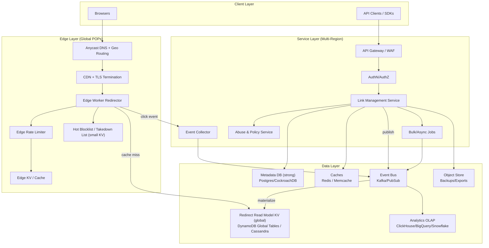
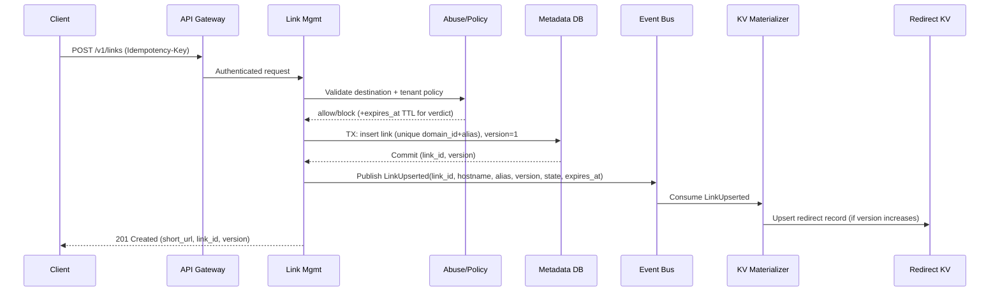
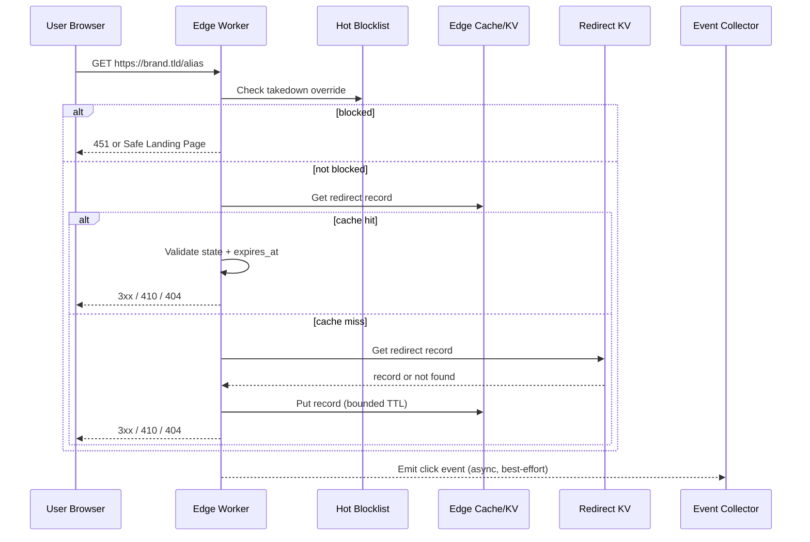
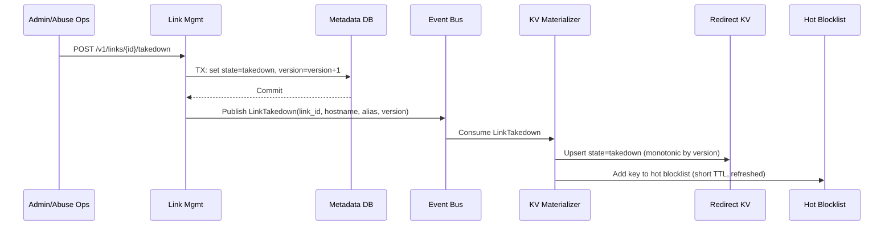

## Overview

A modern URL shortener looks simple—map a short path to a long URL—but production systems are defined by four hard problems:

1. **Extreme read skew + global latency**: redirects can be billions/day and must be fast everywhere.
2. **Correctness under contention**: custom aliases, branded domains, and updates must not race or “hijack” names.
3. **Policy + expiration enforcement**: TTL/disable/takedown must be enforced on every redirect and converge globally quickly.
4. **Abuse resistance**: phishing/malware/spam, link laundering, enumeration, and traffic floods must be handled without breaking legitimate high-volume usage.

The core architectural insight is to split into two planes:

- **Redirect (read) plane**: edge-first lookups (cache/KV), minimal per-request work, resilient to regional failures.
- **Management (write) plane**: strongly consistent metadata + policy enforcement, then asynchronous propagation to the read model.

Redirects are served from an edge cache/KV backed by a globally replicated read model (KV). Writes commit to a transactional metadata store and publish events to update the KV and edge caches.

---

## Requirements

### Functional Requirements

- Create short links with:
  - System-generated codes
  - User-provided **custom aliases** (configurable case and allowed charset)
- Redirect behavior:
  - 301/302/307/308 support
  - Optional query preservation and optional UTM appends
  - Optional “safe landing page” for blocked/takedown outcomes
- Link management:
  - Retrieve/update destination URL
  - Disable/enable/takedown
  - Rotate destination
  - Tags/notes
  - Optional access controls (e.g., password/one-time token) as an extension
- Branded domains:
  - Map `brand.example` → tenant
  - Enforce per-domain alias namespaces
- Abuse prevention:
  - Create-time checks (blocking)
  - Redirect-time checks (fast allow/block/challenge)
  - Rate limiting and takedown workflows
- Analytics:
  - Click event stream (geo/device/referrer, outcome)
  - Aggregated reporting and export APIs
- Bulk operations:
  - Batch create/update/disable
  - Import/export

### Non-Functional Requirements (Concrete Targets)

#### Scale

- Redirects: **5–10B/day** globally  
  - Average QPS: ~58k–116k (10B/day ÷ 86,400 ≈ 115,740 QPS)
  - Peak: **300k QPS** (campaign bursts)
- Writes (create/update): **1k QPS avg**, **5k QPS peak**
- Stored links: **up to 5B total**, with heavy churn (30–70% expire within 7 days)
- Analytics events: same order as redirects (billions/day)

#### Latency

- Redirect lookup at POP (excluding last-mile):
  - **P50 < 10ms**, **P99 < 40ms**
- Create/update:
  - **P50 < 150ms**, **P99 < 500ms**

#### Availability

- Redirect path: **99.99%** (multi-region + edge)
- Management APIs: **99.9%**

#### Consistency

- **Strong**: alias reservation, updates (avoid lost updates / alias hijack)
- **Eventual**: propagation to edge/KV read model, analytics and dashboards

#### Durability / DR

- Metadata (source of truth): **RPO ≈ 0** for acknowledged writes, **RTO < 30 min**
- Analytics: at-least-once ingestion; tolerate duplicates and small loss with idempotent aggregation

### Constraints & Assumptions

- Multi-tenant SaaS; each tenant can have multiple branded domains.
- “Aggressive expiration” means: an expired/disabled/takedown link must stop redirecting **within minutes globally**; takedown should converge faster (target: **< 60s**).
- External reputation services may be expensive or rate-limited; verdicts must be cached.
- Compliance: minimize PII; truncate/hash IPs; configurable retention (30/90/365 days).
- Prefer managed services where they reduce operational load.

---

## Architecture

### High-Level Diagram



### Key Invariants

- **Redirect plane never depends on SQL** on the hot path.
- **SQL is the source of truth** for link state, ownership, and alias uniqueness.
- **Redirect KV is a materialized read model**: rebuilt from SQL + event log if needed.
- **Edge cache entries are validated** using `expires_at` and `state` fields, not only cache TTL.

---

## Components

### Edge Worker Redirector

**Responsibilities**
- Parse `{host, alias}`; apply rate limits and minimal abuse checks.
- Fetch redirect record from edge cache/KV; fall back to global read model KV on miss.
- Enforce state transitions (`active`, `disabled`, `expired`, `takedown`) and expiration on every request.
- Emit click events asynchronously.

**Important design details**
- **Correct expiration**: cache TTL alone is insufficient (clock skew, stale entries). Always compare `now` to `expires_at` stored in the value.
- **Fast takedown**:
  - Maintain a small “hot blocklist” (e.g., `key -> blocked_until`) in edge KV with short TTL.
  - Edge checks this first to override stale redirect records.
- **Stale behavior**:
  - For normal updates, stale-while-revalidate is acceptable if `state` remains `active`.
  - For `takedown`/`disabled`, serve the safe landing page (or 451/403) even if other systems are degraded.

**Typical redirect outcomes**
- `3xx` with `Location` for active links.
- `404` for unknown aliases (policy may choose `404` to reduce enumeration signal).
- `410` for expired links if you want explicit expiry semantics (trade-off with enumeration resistance).
- `451` or safe landing page for takedowns/blocked.

### Link Management Service (Write Plane)

**Responsibilities**
- Create/update links, manage domains, enforce tenant plan limits and policies.
- Support idempotency for create/bulk operations.
- Publish propagation events to build/update the redirect read model.
- Provide control-plane endpoints for takedown, audits, and exports.

**Concurrency model**
- **Alias uniqueness** enforced by the metadata store (unique constraint).
- **Optimistic concurrency** on link updates via `version` (ETag / If-Match).

### Abuse & Policy Service

**Responsibilities**
- Create-time validation: destination URL hygiene (scheme, punycode normalization), allow/deny lists, reputation checks.
- Redirect-time verdicting: fast allow/block/challenge decisions using cached verdicts.
- Continuous rescans and retroactive takedowns.

**Patterns**
- Cache-first with TTL; circuit breakers around external dependencies.
- Store verdict provenance (`source`, `confidence`, `expires_at`) to support explainability and appeals.

### Redirect Read Model KV (Materialized View)

**Role**
- Serve as the origin read model for redirects when edge cache misses.
- Hold denormalized records optimized for O(1) lookups.

**Correctness**
- Records include `version` and `state` so edge can reason about staleness and enforce safe behavior.
- Updates are applied in-order per key using `version` monotonicity.

### Event Bus + Materializer

**Role**
- Deliver `LinkUpserted`, `LinkDisabled`, `LinkTakedown`, `DomainMapped`, etc.
- A consumer (“materializer”) updates the KV and triggers cache invalidation/warm.

**Operational note**
- Because the KV is derived, the event bus retention (e.g., 3–7 days) is critical for replay and recovery.

### Analytics Pipeline

**Goals**
- High-throughput ingestion (billions/day), low coupling to redirect latency.
- Near-real-time rollups (minute-level) for dashboards; exact real-time is not required.

**Approach**
- Edge emits lightweight click events to collector → event bus → OLAP ingestion/rollups.
- Enforce privacy by hashing/truncating identifiers and limiting retention.

---

## Data Model

### Canonical Metadata (SQL)

**`tenants`**
- `tenant_id (pk)`, `name`, `plan`, `created_at`

**`domains`**
- `domain_id (pk)`, `tenant_id (fk)`, `hostname (unique)`, `status`, `created_at`

**`links`**
- `link_id (pk, ULID/UUIDv7)`, `tenant_id (fk)`, `domain_id (fk)`
- `alias (varchar)`, `destination_url (text)`
- `http_status (int)`, `created_at`, `updated_at`
- `expires_at (timestamp, nullable)`
- `state (enum: active|disabled|expired|takedown)`
- `version (bigint)`  
- Indexes:
  - Unique: `(domain_id, alias)`
  - For ops/reporting: `(tenant_id, created_at)`, `(tenant_id, state)`

**`alias_tombstones`**
- `domain_id`, `alias`, `tombstone_until`, `reason`, unique `(domain_id, alias)`

**`abuse_verdicts`**
- `subject_type (link|domain|destination_host|destination_url_hash)`
- `subject_id/hash`
- `verdict (allow|block|challenge)`
- `reason`, `source`, `confidence`
- `expires_at`

**`idempotency_keys`** (recommended)
- `tenant_id`, `key`, `request_hash`, `response_blob`, `created_at`, unique `(tenant_id, key)`
- TTL/cleanup policy: 24h–7d depending on client behavior

### Redirect Read Model KV Record (Denormalized)

- Key: `{hostname}:{alias}`
- Value:
  - `link_id`
  - `tenant_id`
  - `destination_url`
  - `http_status`
  - `state`
  - `expires_at_ms` (epoch)
  - `version`
  - `policy_flags` (e.g., `preserve_query`, `utm_append`, `safe_landing_mode`)
- TTL strategy:
  - Use TTL to reduce storage for naturally expiring links
  - Still enforce `expires_at_ms` at read time for correctness

### Analytics

- Raw event (stream):
  - `{ts, link_id, tenant_id, hostname, alias, pop, country, ua_hash, referrer_hash, outcome, latency_ms}`
- OLAP rollups:
  - Minute/hour/day aggregates keyed by `tenant_id, link_id, dimensions...`
- Idempotency:
  - Include `event_id` (e.g., UUIDv7) or deterministic hash and dedupe in rollups where needed.

---

## Data Flows

### Create Link



### Redirect



### Takedown / Disable (Fast Convergence)



---

## API Design

### Create Link

- `POST /v1/links`
- Headers:
  - `Authorization: Bearer ...`
  - `Idempotency-Key: <uuid>`
- Request:
  ```json
  {
    "domain": "brand.example",
    "alias": "spring-sale",
    "destination_url": "https://shop.example/products?x=1",
    "http_status": 302,
    "expires_at": "2026-01-01T00:00:00Z",
    "preserve_query": true,
    "utm_append": {
      "utm_source": "shortener",
      "utm_campaign": "spring-sale"
    }
  }
  ```
- Response `201`:
  ```json
  {
    "link_id": "01J9...ULID",
    "short_url": "https://brand.example/spring-sale",
    "version": 1,
    "state": "active",
    "expires_at": "2026-01-01T00:00:00Z"
  }
  ```
- Errors (examples):
  - `400 INVALID_URL` / `400 INVALID_EXPIRES_AT` / `400 INVALID_ALIAS`
  - `401 UNAUTHORIZED` / `403 FORBIDDEN`
  - `403 POLICY_VIOLATION` (max TTL, forbidden destination, plan limits)
  - `409 ALIAS_TAKEN` / `409 IDPOTENCY_KEY_CONFLICT`
  - `429 RATE_LIMITED`
  - `451 BLOCKED` (create-time verdict)

**Idempotency**
- Store `(tenant_id, Idempotency-Key) -> response` for 24h+.
- If the same key is reused with a different request hash, return `409 IDPOTENCY_KEY_CONFLICT`.

### Update Link

- `PATCH /v1/links/{link_id}`
- Headers: `If-Match: "<version>"`
- Request:
  ```json
  {
    "destination_url": "https://shop.example/new",
    "expires_at": "2026-02-01T00:00:00Z",
    "http_status": 308
  }
  ```
- Responses:
  - `200 OK` with updated `version`
  - `409 VERSION_CONFLICT` if `If-Match` fails
- Side effects: publishes `LinkUpserted` to propagate to KV/edge.

### Resolve (Debug / Programmatic)

- `GET /v1/resolve/{domain}/{alias}`
- Returns the current redirect record (including `state`, `expires_at`, `version`) without performing a redirect.
- Useful for SDKs, admin tooling, and troubleshooting propagation.

### Bulk Operations (Async)

- `POST /v1/bulk/links`
  - Accepts a list of creates/updates; returns `job_id`
- `GET /v1/bulk/jobs/{job_id}`
  - Status and per-item results (including alias collisions)

### Analytics (Aggregated)

- `GET /v1/analytics/links/{link_id}?from=...&to=...&granularity=hour`
- Returns rollups; raw event access is typically restricted to higher tiers due to cost/PII.

---

## Scaling & Performance

### Capacity Sketch (Order of Magnitude)

- Redirects: 10B/day at peak periods implies sustained high throughput.
  - If an edge cache hit is ~1–2ms compute + KV lookup, you can keep origin reads low with a hit ratio >95%.
  - With 300k QPS peak and 95% hit ratio, origin KV sees ~15k QPS—manageable for a global KV.
- Redirect record size:
  - Assume ~0.5–1.5 KB compressed JSON/binary.
  - 5B links * 1 KB ≈ 5 TB of logical data (KV storage and replication overhead varies by provider).
- Analytics:
  - If events average 200 bytes and you ingest 10B/day, raw is ~2 TB/day before indexing/overhead; prefer rollups and retention policies.

### Bottlenecks & Mitigations

- **Redirect hot keys (viral links)**:
  - Edge caching per POP and request coalescing reduce amplification.
  - Optional “shield POP” can further reduce KV fanout on misses.
- **Propagation lag**:
  - Normal updates tolerate seconds-to-minutes eventual consistency.
  - Takedowns require a fast path via hot blocklist and prioritized events.
- **Abuse checks**:
  - External calls are slow/unreliable → cached verdicts + circuit breakers + async rescans.
- **Enumeration/scanning**:
  - Per-POP rate limits + negative caching + anomaly detection by ASN/prefix.

### Code / Alias Generation (Interview-Relevant)

- Generated codes should be:
  - Short (Base62 or Crockford Base32), URL-safe, configurable length.
  - Non-sequential to reduce enumeration (use random or keyed encoding).
- Common approaches:
  - **Random Base62** (6–8 chars): simple; collision probability managed with retries + unique constraint.
  - **ULID/UUIDv7 + encoding**: sortable IDs for ops, but still expose patterns unless encoded with a keyed transform.
  - **Snowflake-like IDs**: scalable generation, but sequential patterns require obfuscation for public codes.
- Custom aliases always go through the same uniqueness enforcement as generated codes.

### Caching Strategy

- **Edge cache/KV**:
  - Key: `{host}:{alias}`
  - Store the full redirect record with `expires_at_ms` and `state`.
  - TTL: bounded (e.g., min(24h, time_to_expiry)) to balance freshness vs churn.
- **Negative caching**:
  - Cache not-found for 30–120s to dampen scans and reduce origin load.
- **Invalidation**:
  - Prefer versioned reads (refresh if cached version < origin version when detectable).
  - For takedowns: hot blocklist override + prioritized propagation events.

---

## Trade-offs & Alternatives

### Trade-offs (At Least 3)

1. **Edge-first redirects with eventual propagation**
   - Pros: best global latency/availability; SQL outages don’t break redirects.
   - Cons: updates are not instantly visible everywhere; requires careful takedown fast path.

2. **Strong alias uniqueness (unique index / conditional put)**
   - Pros: prevents collisions and security issues; simple correctness story.
   - Cons: slightly higher write latency; write path must handle contention gracefully.

3. **Asynchronous analytics pipeline (at-least-once)**
   - Pros: redirect path stays fast; cost scales better; durable event log supports reprocessing.
   - Cons: dashboards are eventually consistent; duplicates must be handled in aggregation.

4. **Dual-store model (SQL source + KV read model)**
   - Pros: each store is used for what it’s good at (transactions vs massive reads).
   - Cons: requires materialization, replay, and operational tooling to ensure convergence.

### Alternatives

- **Single global SQL for redirects**
  - Simpler, but hard to hit global P99 and risks overload during spikes.
- **CDN-only caching without a KV read model**
  - Fast and cheap for immutable links, but invalidation/state changes become unreliable at scale.
- **Per-region independent namespaces**
  - Improves write locality, but complicates branded domains/custom aliases and user expectations.
- **Redirect service at origin only**
  - Easier debugging, but global latency and availability suffer; edges become underutilized.

---

## Failure Modes & Mitigations

### Failure Scenarios (At Least 3)

1. **Global KV replication lag / partial region impairment**
   - Impact: some POPs may serve stale records.
   - Detection: replication lag metrics, version skew sampling, elevated cache miss + origin latency.
   - Mitigation: version monotonicity; edge refresh on miss; prioritize takedown via hot blocklist; route origin reads to nearest healthy region.

2. **Edge cache poisoning / record tampering**
   - Impact: malicious redirects or incorrect destinations.
   - Detection: validation failures, anomaly detection on destination host shifts, audit logs.
   - Mitigation: only materializer writes to KV; strict URL validation (scheme allowlist, punycode normalization); optionally sign records (HMAC) and verify at edge.

3. **Abuse traffic spike (enumeration, bot floods, credential stuffing)**
   - Impact: increased cost, degraded tail latency, management API disruption.
   - Detection: WAF/rate limit metrics, spikes in unknown-alias requests, per-ASN anomalies.
   - Mitigation: layered rate limiting (edge + gateway), bot challenges, negative caching, adaptive throttles, separate management and redirect capacity pools.

4. **Metadata DB outage**
   - Impact: cannot create/update; redirects continue (read plane decoupled).
   - Detection: DB health checks, elevated 5xx on management endpoints.
   - Mitigation: multi-AZ + PITR; degrade to read-only admin views; queue writes only if business can tolerate delayed creates (often not recommended without strict semantics).

5. **Clock skew impacts expiration**
   - Impact: early/late expiry at some POPs.
   - Detection: skew monitoring, mismatch audits between POP logs and canonical time.
   - Mitigation: enforce expiry using epoch times; NTP discipline; add small safety window (e.g., treat expired if `now_ms >= expires_at_ms - 2000`).

### Disaster Recovery

- Targets:
  - Redirect: **RTO < 15 min**
  - Metadata: **RPO ≈ 0**, **RTO < 30 min**
  - Analytics: **RPO up to 15 min** acceptable
- Backups:
  - Metadata DB: continuous PITR + daily snapshots to object store; regular restore tests.
  - KV: derived; rebuild from SQL + event replay.
  - Event bus: retain 3–7 days for replay; store compacted topics for latest state if supported.

---

## Operations

### Observability (SLO-Driven)

- Redirect:
  - P50/P95/P99 latency per POP
  - Cache hit ratio and origin fallback rate
  - 3xx/4xx/5xx rates by outcome (active/expired/takedown)
- Management:
  - Create/update latency and error rates
  - `409 ALIAS_TAKEN` and `409 VERSION_CONFLICT` rates
  - DB saturation (connections, locks), job queue depth/lag
- Abuse:
  - Block/challenge rates, false-positive appeal rate
  - External reputation API latency/error rate
- Analytics:
  - Ingestion lag, dropped/late events, OLAP query latency, rollup completeness

Example alerts
- Redirect P99 > 60ms for 5 minutes in any top-10 POP.
- Origin fallback > 5% globally for 10 minutes.
- Propagation lag > 2 minutes on `LinkUpserted` topic.
- Sudden spike in unknown-alias requests from a single ASN.

### Deployment & Change Management

- Progressive delivery:
  - Canary by region/POP for edge workers; gradual ramp.
  - Blue/green or rolling deploy for services; feature flags for policy changes.
- Schema evolution:
  - Expand/contract; versioned redirect records; backward-compatible event payloads.
- Rollback:
  - Instant edge worker rollback to previous version.
  - Service rollback with safe degradation (e.g., disable new policy checks via flag).

### Security & Privacy

- Auth:
  - OAuth/JWT for APIs; strict tenant scoping; audit logs for privileged actions.
- Redirect safety:
  - Enforce allowed schemes (`https`, optionally `http`), block `javascript:` etc.
  - Normalize and validate internationalized domains (punycode).
- Privacy:
  - Hash/truncate IP; avoid storing raw user agents where possible; retention controls by tenant/plan.
- Key management:
  - Rotate signing/HMAC keys; short-lived credentials for services.

---

## References & Further Reading

- DynamoDB Global Tables: https://docs.aws.amazon.com/amazondynamodb/latest/developerguide/GlobalTables.html
- Cloudflare Workers & KV: https://developers.cloudflare.com/workers/ and https://developers.cloudflare.com/kv/
- Google Safe Browsing API: https://developers.google.com/safe-browsing
- Rate limiting patterns: https://cloud.google.com/architecture/rate-limiting-strategies-techniques
- Practical URL shortener considerations (Bitly blog): https://bitly.com/blog/