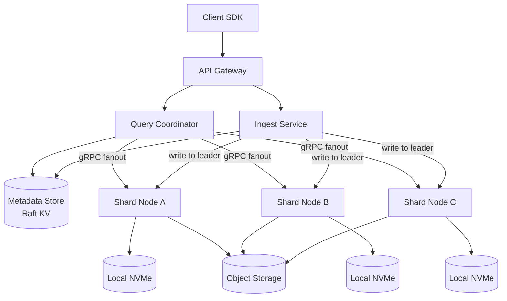
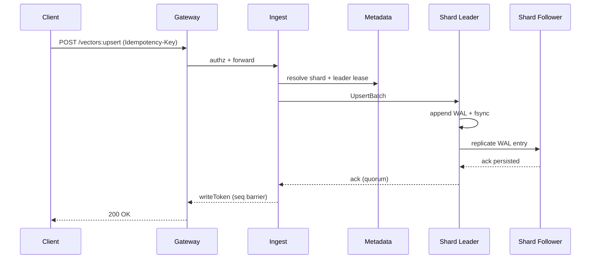

## Overview

A vector database stores high-dimensional embeddings (typically 384–3072 dimensions) and answers “nearest neighbor” queries (topK) efficiently, often with metadata filters (tenant, language, timestamp, ACL tags). The core challenge is that exact k-NN is too expensive at scale, so the system relies on **approximate nearest neighbor (ANN)** indexes while still supporting **upserts, deletes, filtering, replication, and predictable tail latency**.

A production-grade design separates concerns:

- **Control plane**: strongly consistent metadata (collections, schemas, shard placement, segment manifests, membership/leases) so routing and recovery are deterministic.
- **Data plane**: shard replicas store vectors in immutable **segments** and serve queries via per-segment ANN + filter indexes; writes are made durable via a replicated WAL and become query-visible via a small “delta” structure until background index/compaction catches up.

This document describes a design suitable for multi-tenant workloads, large-scale storage, and interview-style reasoning with real-world trade-offs.

---

## Requirements

### Functional Requirements

- Collections:
  - Create/update collection configuration: dimensions, distance metric, index policy, replication factor, TTL, and indexed metadata fields.
  - Schema validation for metadata types and indexed fields.
- Write path:
  - Upsert vectors by ID with metadata; optional per-record version (optimistic concurrency).
  - Delete vectors (soft/hard) and keep tombstones to prevent “resurrection” from older segments.
  - Bulk upsert/delete with backpressure and progress reporting.
  - Idempotency keys for safe retries.
- Read path:
  - ANN search: `topK` nearest neighbors with optional metadata filters and optional reranking.
  - Point read by ID (vector + metadata + version) for debugging/verification.
  - Optional “read-your-writes” (RYW) for clients that need freshness guarantees.
- Multi-tenancy:
  - Per-tenant authn/z, quotas, isolation, and audit logs.
- Maintenance:
  - Compaction, tombstone purge, index build/rebuild, rebalancing, snapshot/restore, and tiering (hot NVMe vs warm object storage).

### Non-Functional Requirements (Targets)

**Workload model (representative, not worst-case simultaneously):**
- Typical collection: **50M vectors**
- Cluster-wide: **up to 10B vectors**
- Search throughput: **10k–50k QPS** (topK ≤ 100; moderate filters)
- Bulk ingest: **50k–200k vectors/sec sustained** (across cluster)

**Latency SLOs (topK=20, dims≈768, moderate filter selectivity 1–20%):**
- P50: **20–50 ms**
- P95: **80–150 ms**
- P99: **150–300 ms**
- Hard timeout budget: **200–500 ms** (client-selectable; server-enforced max)

**Availability:**
- Reads: **99.99%** (multi-AZ)
- Writes: **99.9%** (planned maintenance allowed)

**Durability:**
- No acknowledged write loss: **RPO ≈ 0** for committed writes (quorum persisted)
- May lose in-flight/uncommitted batches only

**Consistency:**
- Control plane metadata: **strong consistency** (Raft)
- Data plane:
  - Point reads: strong within a shard if requested (quorum read) or eventual by default
  - Search freshness: configurable **eventual** vs **RYW** (via write token / sequence barrier)
  - ANN index visibility: eventual; correctness relies on a freshness-aware “delta” layer

### Constraints & Assumptions

- Vectors stored as `float16` (hot) and/or compressed (PQ codes) for cost; distance kernels optimized with SIMD.
- Supported filters are limited and predictable: equality/in-set, numeric/date ranges, boolean, and optional prefix for low-cardinality fields.
- Query vectors are small (≤ 3072 dims), `topK <= 100`, filter selectivity commonly 1–50%.
- Prefer proven components: Raft KV for metadata, object storage for durability/tiering, and a high-performance ANN library/core.
- Security: TLS everywhere, encryption at rest, per-tenant isolation, audit logs, and least-privilege access.

---

## Architecture

### High-Level Diagram



### Control Plane vs Data Plane

- **Control plane (Metadata Store + controllers)**:
  - Stores collection configs, shard maps, replica membership, and immutable segment manifests.
  - Drives placement and rebalancing; issues leases/leadership info.
  - Must remain small and strongly consistent.

- **Data plane (Shard Nodes)**:
  - Serve search and point reads from local segments and indexes (NVMe + page cache).
  - Accept writes to the shard leader, replicate the WAL, and flush immutable segments.
  - Build/merge indexes asynchronously; tier cold data to object storage.

---

## Components

### API Gateway

**Responsibilities**
- TLS termination, authentication/authorization (tenant + collection ACLs)
- Rate limiting and request shaping (batch sizes, filter complexity, timeout caps)
- Routing to query/ingest services

**Notes**
- Enforce strict limits to protect tail latency: max dims, max filter AST depth, max `topK`, max `timeoutMs`, and max metadata size.

**Tech choices**
- Envoy with external authz (OPA) or a stateless Go/Rust gateway.

---

### Query Coordinator

**Responsibilities**
- Query planning (which shards/replicas/segments)
- Fanout and deadline budgeting
- Partial result merging and response shaping (include metadata, scores, debug fields)

**Key mechanisms**
- **Shard/replica selection**: pick one replica per shard by default; use hedged requests for tail latency.
- **Deadline budgeting**: per-shard sub-deadlines (e.g., 60–80% of client timeout) and cancel on completion.
- **Adaptive execution**:
  - If filter is very selective, prefer pre-filter → smaller ANN search space.
  - If filter is broad, prefer ANN first → post-filter + rerank.
- **Partial responses (optional)**: return best-effort when client opts in; otherwise fail closed on insufficient shard coverage.

---

### Ingest Service

**Responsibilities**
- Validate schema, dims, metadata types, and quotas
- Apply idempotency keys and dedupe
- Route writes to the shard leader; enforce write consistency policy

**Write consistency options**
- `quorum`: ACK after WAL entry persisted on a quorum of replicas (recommended default)
- `leader_only`: ACK after leader WAL fsync (lower latency, weaker durability under leader loss)

---

### Shard Node (Data Plane)

**Responsibilities**
- Store and serve shard data: segments, delta store, and indexes
- Execute shard-local search: ANN → filter → rerank
- Replicate writes and perform recovery on restart
- Run background compaction/index build with throttling

**Storage layout (per shard)**
- **Replicated WAL**: ordered log of `{op, vector_id, version, embedding, metadata}`.
- **Memtable / delta store**:
  - Small mutable structure for recent writes (e.g., in-memory HNSW or brute-force buffer + metadata hashmaps/bitmaps).
  - Provides freshness and correct deletes before segments are compacted.
- **Immutable segments** (persisted):
  - `vectors`: vector blocks (float16) and/or PQ codes
  - `docstore/id map`: `vector_id -> doc_id` mapping + Bloom filter
  - `metadata columns`: encoded values for indexed fields
  - `filter indexes`: Roaring bitmaps for categorical/boolean; range index for numeric/date
  - `ann index`: HNSW or IVF(+PQ) per segment

**ANN policy**
- HNSW: best latency/recall for smaller or “hot” segments; higher memory overhead.
- IVF-PQ: better cost at billion-scale; requires training and careful freshness strategy.

---

### Index Builder & Compactor

**Responsibilities**
- Flush memtables into immutable segments
- Build ANN + filter indexes for new segments
- Compact segments (merge, purge tombstones, rewrite metadata/indexes)
- Tier cold segments to object storage and keep hot working set on NVMe

**Guardrails**
- Throttle compaction and index build to protect P99.
- Run with explicit CPU/IO budgets (cgroups / nice / IO priority) and shard-level scheduling.

---

### Metadata Store (Control Plane)

**Responsibilities**
- Strongly consistent source of truth:
  - collections, schemas, shard ranges, replica sets, leadership leases
  - immutable segment manifests and current “head” pointers per shard

**Implementation**
- Etcd/Consul or embedded Raft KV.
- Watch-based invalidation to coordinators/ingest for low-latency routing updates.

---

## Data Model

### Control Plane Schema (Strongly Consistent)

**collections**
- `collection_id` (uuid, pk)
- `tenant_id` (uuid, indexed)
- `name` (string, unique per tenant)
- `dims` (int)
- `distance` (enum: `cosine|dot|l2`)
- `index_policy` (json: ANN type/params, PQ config, segment size targets)
- `replication_factor` (int)
- `write_consistency_default` (enum: `quorum|leader_only`)
- `ttl_seconds` (optional)
- `indexed_fields` (json schema: field name → type + indexing mode)
- `created_at`, `updated_at`

**shards**
- `shard_id` (uuid, pk)
- `collection_id` (uuid, indexed)
- `hash_range_start`, `hash_range_end` (uint64)
- `replicas` (list of node IDs)
- `leader_lease` (node ID + expiry)

**segments**
- `segment_id` (uuid, pk)
- `shard_id` (uuid, indexed)
- `state` (enum: `building|ready|deleting`)
- `vector_count` (bigint)
- `min_seq`, `max_seq` (monotonic WAL sequence range covered)
- `location` (enum: `nvme|object|both`)
- `manifest` (json: file paths, checksums, codec versions, stats/histograms)

### Data Plane Records (Per Shard)

- **Vector primary key**: `(tenant_id, collection_id, vector_id)`
- **Versioning**:
  - Each upsert carries an optional `expectedVersion`; server assigns a new `version` (monotonic per vector ID).
  - Deletes create tombstones with a version to prevent older segment data from reappearing.

---

## Query Execution

### Read Path (Shard-Local)

1. **Candidate generation**:
   - Search delta store (fresh writes) and relevant segments’ ANN indexes.
   - Use an oversampling factor `k'` (e.g., `k' = topK * 5..20`) depending on filter selectivity.
2. **Filter application**:
   - If selective, pre-filter with bitmaps/range index to reduce candidate set.
   - If broad, post-filter candidates and refill from ANN if needed.
3. **Rerank**:
   - Compute exact distance on surviving candidates using float16/float32 (and optionally rescoring if PQ used).
4. **Return** topK results with scores and optional metadata.

### Coordinator Merge

- Collect per-shard topK, merge with a heap, and return global topK.
- Apply shard coverage rules:
  - Default: require all shards for the collection partition range.
  - Optional: allow partial results if client sets `allowPartial=true`.

---

## Write Path & Freshness

### Write Path Diagram



### Freshness / Read-Your-Writes (RYW)

- The leader returns a `writeToken` (e.g., `{shard_id, min_seq}`) representing the minimum WAL sequence that must be visible.
- Query requests can include this token; shard replicas delay or route to a replica that has applied up to `min_seq`.
- Without a token, search is **eventually consistent** w.r.t. very recent writes (but deletes are enforced via tombstones in delta/WAL).

---

## API Design

All APIs are tenant-scoped via auth context; examples show JSON over HTTP.

### Collections

- `POST /v1/collections`
  - Request:
    ```json
    {
      "name": "products",
      "dims": 768,
      "distance": "cosine",
      "replicationFactor": 3,
      "indexPolicy": { "type": "hnsw", "m": 32, "efConstruction": 200 },
      "indexedFields": {
        "lang": { "type": "keyword" },
        "ts": { "type": "int64" },
        "is_public": { "type": "bool" }
      }
    }
    ```
  - Response: `{ "collectionId": "uuid" }`
- `GET /v1/collections/{collectionId}`
- `PATCH /v1/collections/{collectionId}`
  - Index policy changes are async and versioned; requests return an `operationId`.

### Upsert / Delete

- `POST /v1/collections/{collectionId}/vectors:upsert`
  - Headers: `Idempotency-Key: <uuid>`
  - Request:
    ```json
    {
      "vectors": [
        {
          "id": "user:123",
          "embedding": [0.1, 0.2],
          "metadata": { "lang": "en", "ts": 1734390000 }
        }
      ],
      "writeConsistency": "quorum",
      "returnWriteToken": true
    }
    ```
  - Response:
    ```json
    { "accepted": 1, "failed": [], "writeToken": { "shardId": "uuid", "minSeq": 981273 } }
    ```
- `POST /v1/collections/{collectionId}/vectors:delete`
  - Request: `{ "ids": ["user:123"], "mode": "soft" }`
  - Response: `{ "deleted": 1 }`

**Idempotency**
- Deduplicate by `(tenant_id, endpoint, Idempotency-Key)` for a fixed TTL (e.g., 24h), storing a hash of the request body and the final outcome.

### Search

- `POST /v1/collections/{collectionId}/search`
  - Request:
    ```json
    {
      "query": { "embedding": [0.1, 0.2] },
      "topK": 20,
      "filter": {
        "and": [
          { "eq": ["lang", "en"] },
          { "range": ["ts", 1734300000, 1734399999] }
        ]
      },
      "include": ["metadata"],
      "ann": { "efSearch": 64 },
      "timeoutMs": 200,
      "allowPartial": false,
      "readYourWrites": { "writeToken": { "shardId": "uuid", "minSeq": 981273 } }
    }
    ```
  - Response:
    ```json
    {
      "results": [
        { "id": "user:123", "score": 0.83, "metadata": { "lang": "en" } }
      ],
      "tookMs": 41,
      "partial": false
    }
    ```

### Point Read

- `GET /v1/collections/{collectionId}/vectors/{id}`
  - Response: `{ "id": "user:123", "embedding": [0.1, 0.2], "metadata": { "lang": "en" }, "version": 42 }`

---

## Scaling & Performance

### Capacity Estimates (Concrete Numbers)

Assume dims=768:

- **Float16 storage**: `768 * 2 bytes ≈ 1.5 KB/vector` (raw vector payload only)
  - 50M vectors ≈ **75 GB** raw vectors (before indexes/metadata/replication)
  - 10B vectors ≈ **15 TB** raw vectors
- With metadata + indexes:
  - HNSW can add significant memory (graph links + overhead); plan **2–5×** vector payload for hot, low-latency tiers.
  - IVF-PQ reduces vector payload dramatically but adds codebooks and list structures; plan **~0.1–0.4×** payload for PQ codes plus IVF structures (highly workload-dependent).
- With replication RF=3:
  - Multiply persistent storage by **~3×** (plus compaction overhead; budget another **20–50%** headroom).

### Sharding & Fanout

- Primary sharding by `hash(vector_id)` within `(tenant, collection)` to balance load.
- Keep typical fanout small for latency: aim for **8–16 shards** for common collections; very large collections can use more shards but require coordinator optimizations (pruning, hedging, hierarchical fanout).

**Shard splitting triggers (examples)**
- `vector_count` > 200M per shard (IVF-PQ) or > 50M per shard (HNSW-heavy)
- sustained QPS > threshold per shard (e.g., > 1k QPS)
- disk or memory pressure (hot working set cannot be cached)

### Tail Latency Controls

- **Hedged requests** to a second replica when the first exceeds a percentile-based threshold.
- **Load shedding**:
  - reject overly expensive filters and huge `topK` under load
  - enforce max `efSearch` and cap candidate expansions
- **Timeout propagation** with cancellation to stop wasted work.
- **Adaptive candidate sizing** (`k'`) based on filter selectivity and observed hit rate.

### Caching

- Coordinator:
  - cache shard maps/segment heads with watch-based invalidation
- Shard node:
  - mmap ANN/index files; rely on OS page cache for hot segments
  - cache compiled filter bitmaps for frequent predicates (bounded LRU + TTL)
  - cache “hot centroid routing” for IVF to accelerate list selection (if applicable)

---

## Trade-offs & Alternatives

### Trade-offs Made

1. **Immutable segments + background compaction**
   - Gain: predictable read performance, straightforward recovery, safe concurrency.
   - Cost: write amplification, background CPU/IO scheduling complexity.

2. **Delta store for freshness (before full index build)**
   - Gain: high ingest throughput and RYW capability without blocking on index builds.
   - Cost: additional query-time work (search delta + segments) and more moving parts.

3. **Per-segment filter indexes (bitmaps/range)**
   - Gain: efficient filtering at scale; prevents “post-filter explosion” in latency.
   - Cost: extra storage/build time; schema discipline required.

4. **Strong control plane, weaker data-plane search consistency**
   - Gain: reliable routing/placement while allowing high-throughput data operations.
   - Cost: search results are eventually consistent unless RYW token is used.

### Alternative Approaches

- **Fully mutable global HNSW per shard**
  - Pros: excellent latency/recall for medium scale.
  - Cons: costly deletes/updates, fragmentation, harder crash consistency at very large scale.

- **Pure IVF-PQ (no delta)**
  - Pros: best cost efficiency and scalability for multi-billion vectors.
  - Cons: poor freshness; rebuild/training heavy; may degrade recall for some distributions.

- **General-purpose search engines (OpenSearch/Elasticsearch kNN)**
  - Pros: mature ops, hybrid text+vector, rich query language.
  - Cons: less control over memory/index layout, multi-tenant cost isolation can be harder, tail latency less predictable.

---

## Failure Modes & Mitigations

### 1) Shard leader crashes during upsert

- Impact: temporary write unavailability; retry storms possible.
- Detection: lease expiry / missed heartbeats; elevated 5xx/timeout rate.
- Mitigation:
  - fast leader re-election (seconds) among replicas
  - idempotency keys for retries
  - client-side exponential backoff + jitter
  - write routing via fresh leader lease from metadata store

### 2) Replica falls behind (WAL lag) and serves stale reads

- Impact: violates RYW expectations; can return deleted items if not tombstone-aware.
- Detection: per-replica applied-seq lag metrics; RYW token failures.
- Mitigation:
  - route RYW queries only to replicas that satisfy `min_seq`
  - enforce tombstones via delta/WAL replay before serving
  - throttled catch-up and backpressure to avoid thrashing

### 3) Corrupted segment/index file on disk

- Impact: shard degradation; incorrect results if corruption undetected.
- Detection: checksums on load, background scrubbing, canary query regressions.
- Mitigation:
  - fetch segment from object storage or healthy replica
  - mark replica unhealthy; rebuild indexes from vector blocks if needed

### 4) Compaction/index build saturates CPU/IO causing latency spikes

- Impact: P99 search increases; timeouts and partial responses.
- Detection: IO wait, queue depth, CPU steal, tail latency alarms, backlog growth.
- Mitigation:
  - strict resource budgets (cgroups), dynamic throttling, shard-heat-aware scheduling
  - optionally move heavy builds (PQ training) to dedicated workers

### 5) Metadata store quorum loss

- Impact: control-plane freeze; shard moves/leader leases blocked; stale routing risk.
- Detection: quorum health alarms; watch stream failures.
- Mitigation:
  - 3–5 node quorum across AZs, regular snapshots, tested restore procedures
  - coordinators run in **read-only cached mode** for a bounded TTL, then fail closed

### 6) Object storage outage or elevated latency (warm tier)

- Impact: slower recovery/tiering; cache misses for cold segments become expensive.
- Detection: object store SLI alarms; increased segment fetch time.
- Mitigation:
  - keep hot working set on NVMe; prefetch on rebalances
  - local replication of frequently accessed segments
  - circuit breakers and fallback to serving only hot segments if partial allowed

### 7) Hot shard / skewed access pattern

- Impact: overloaded shard dominates tail latency and errors.
- Detection: per-shard QPS/latency heatmaps; queue depth alerts.
- Mitigation:
  - split shard range, add replicas, or add routing keys for co-location and pruning
  - admission control and per-tenant rate limits to prevent noisy neighbors

---

## Operations

### SLOs, SLIs, and On-Call Signals

**Primary SLIs**
- Search latency (P50/P95/P99), QPS, error rate, timeout rate
- Shard coverage / partial response rate
- Recall proxies (canary queries with expected neighbors; drift detection)
- WAL metrics: fsync latency, quorum commit latency, replica lag
- Background work: compaction backlog, index build backlog, segment counts
- Node health: RSS, page faults (mmap), NVMe IO wait, CPU saturation

**Alert examples**
- P99 search > 300ms for 5 minutes
- 5xx > 0.5% for 5 minutes (per tenant and global)
- WAL quorum commit latency > 50ms sustained
- Replica lag > 5s or backlog > threshold
- Metadata quorum degraded / leader flapping

### Deployment Strategy

- Gateways/coordinators: rolling deploy with fast rollback.
- Shard nodes:
  - drain (stop new writes), transfer leadership, deploy, warm caches, re-enable
  - canary by shard group; maintain headroom for failover
- Compatibility:
  - version segment formats; require upgrade windows for incompatible changes
  - support mixed-version clusters for a bounded time during rollout

### Backup & Disaster Recovery

- Metadata store: periodic snapshots + WAL archiving; regularly test restore.
- Segments/manifests: stored durably; object storage lifecycle policies; optional cross-region replication for critical tenants.
- Targets (example):
  - RPO: 0 for committed writes (quorum WAL), 0–5 minutes for cross-region copies
  - RTO: 30–60 minutes for regional recovery (dependent on rehydration capacity)

### Security & Compliance

- TLS for all client and inter-service traffic.
- Encryption at rest:
  - NVMe: per-node disk encryption
  - Object storage: SSE-KMS (per-tenant keys if required)
- Strong tenant isolation:
  - authz at gateway + enforced tenant scoping in shard routing
  - quotas (storage, QPS, write throughput) to prevent noisy neighbors
- Audit logs for control plane operations and data access (configurable retention).

---

## References & Further Reading

- HNSW: “Efficient and robust approximate nearest neighbor search using Hierarchical Navigable Small World graphs” (Malkov & Yashunin)
- FAISS (IVF/PQ): https://github.com/facebookresearch/faiss
- ScaNN: https://github.com/google-research/google-research/tree/master/scann
- Roaring Bitmaps: https://roaringbitmap.org/
- LSM concepts: RocksDB wiki; “The Log-Structured Merge-Tree (LSM-Tree)” (O’Neil et al.)
- Production systems to study: Milvus, Weaviate, Qdrant, Pinecone (architecture blogs/whitepapers)