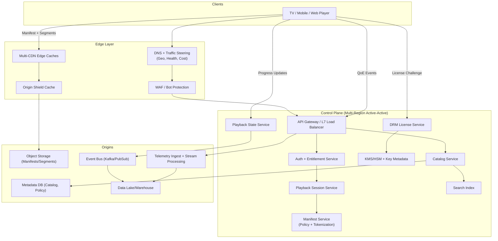
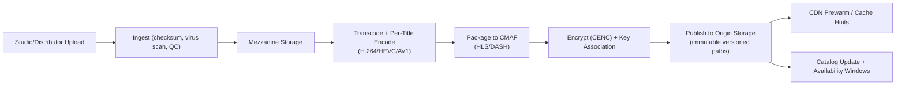
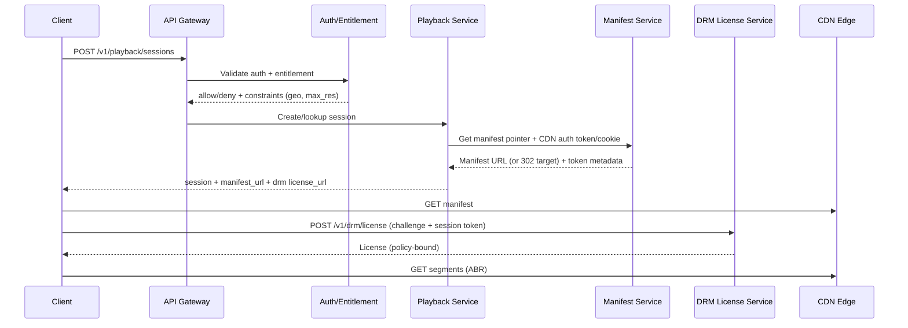

## Overview

A global Video-on-Demand (VoD) platform delivers large volumes of video bytes reliably (the **data plane**) while enforcing rights and providing a fast, resilient user experience through highly available APIs (the **control plane**). The core architectural principle is to push nearly all bandwidth-heavy traffic to CDN edges using HTTP-based adaptive streaming (HLS/DASH with ABR), while keeping the control plane cache-friendly, globally distributed, and secure.

Key challenges:
- **Scale & cost**: egress dominates; cache hit ratio and origin protection are critical.
- **QoE**: fast startup and minimal rebuffering under variable networks and device capabilities.
- **Rights enforcement**: DRM, geo/window policies, and auditability without adding per-segment origin calls.
- **Resilience**: multi-CDN and multi-region failover with graceful degradation.

---

## Requirements

### Functional Requirements
- Browse/search catalog and view metadata (availability windows, locales, age ratings).
- Start playback: validate entitlement, return manifest + session context.
- ABR streaming: smooth quality switches, low rebuffering (HLS/DASH).
- DRM-protected playback: Widevine/PlayReady/FairPlay license acquisition.
- Multi-language audio/subtitles; locale- and policy-driven constraints.
- Resume playback across devices; “Continue Watching” per profile.
- Telemetry: startup time, rebuffering, bitrate, errors, device/network characteristics.
- Optional extension: offline downloads with persistent DRM licenses and expiry.

### Non-Functional Requirements (Targets)
**Scale (example at “Netflix-like” peak)**
- 50M DAU
- 10M peak concurrent streams globally
- Peak playback starts: 150k–300k starts/min (region/time dependent)
- Control plane peak: ~300k QPS (catalog, playback, state reads/writes, auth, telemetry ingestion endpoints)
- Data plane peak egress: **50–150 Tbps** (depends on bitrate mix and 4K adoption)
- Library: ~200k titles; millions of encoded variants (by codec, resolution, audio/subtitle sets)

**Latency (control plane; regional)**
- Start playback API (excluding segment downloads): P50 < 150ms, P99 < 600ms
- DRM license issuance: P50 < 120ms, P99 < 400ms (same-region)
- Resume state read: P99 < 50ms (regional)
- Manifest fetch: typically served from CDN; P99 < 200ms edge-to-client

**Availability**
- Control plane APIs: 99.99% (multi-region active-active)
- DRM license service: 99.995% (multi-region with regional affinity + failover)
- Data plane delivery: 99.995%+ via multi-CDN and origin shielding

**Consistency**
- **Strong**: key management, license policy decisions, entitlement checks.
- **Eventual**: analytics, recommendations, aggregate “continue watching” ordering (but per-title resume checkpoint should be durable and monotonic).

**Durability**
- Media assets: 11 9’s object durability (multi-AZ, cross-region replication)
- Playback progress: RPO ≤ 1 minute (losing the last few seconds is acceptable)

### Assumptions
- HLS and DASH are required for device coverage; CMAF fMP4 improves cache reuse across protocols.
- Segment duration: **4s** (common VoD trade-off between startup, overhead, and cacheability).
- ABR ladder example: 240p@300kbps → 1080p@5Mbps → 4K@15Mbps (codec dependent; AV1/HEVC reduce bitrate at similar quality).
- Multi-region footprint: ~10–20 primary regions; multi-CDN PoP coverage worldwide.

---

## Architecture

### High-Level Architecture (Control Plane vs Data Plane)



Why this works:
- **CDN-first delivery** keeps the hot path (segments) off your compute.
- **Origin shield** absorbs cache-miss bursts and prevents thundering herds against object storage.
- **Separate DRM license service** isolates security-sensitive, latency-critical logic and enables region-local issuance.
- **Small, durable state** supports resume and UI features without coupling to analytics pipelines.

### Media Ingest / Encoding Pipeline (Back Office)



---

## Core Flows

### Playback Start (User Hits “Play”)



### Progress Updates (Resume / Continue Watching)
- Client sends checkpoints every **30–60s**, plus on **pause/stop/background**.
- Server performs **idempotent upserts** and enforces monotonic progress to avoid rewinds due to out-of-order retries.

---

## Components

### 1) API Gateway / Edge Security
**Responsibilities**
- TLS termination, routing, request normalization, authentication enforcement, rate limiting.
- WAF/bot protection for abuse-prone endpoints (login, DRM, telemetry).

**Key practices**
- JWT validation at the edge with cached JWKS; short-lived access tokens.
- Separate domains for API vs CDN delivery; strict CORS for web clients.

---

### 2) Catalog + Search
**Responsibilities**
- Serve title metadata, artwork URLs, availability windows, localized strings.
- Provide search and browse results (often backed by a search index).

**Storage**
- Metadata DB (e.g., Spanner/Aurora/Postgres + read replicas).
- Search index (e.g., OpenSearch/Elastic) updated via event stream.

**Caching**
- CDN/edge cache for public-ish catalog responses where allowed.
- Regional Redis for hot title/rendition metadata.

---

### 3) Playback Session Service
**Responsibilities**
- Validate request context (device capabilities, profile maturity settings, geo).
- Generate a **playback session** record and return a manifest pointer plus DRM info.
- Provide a session token used by DRM and optionally by CDN token auth.

**Design choices**
- Keep sessions small and short-lived (e.g., 10–30 minutes) with refresh.
- Store minimal sensitive data; use signed tokens for most session context.

---

### 4) Manifest Service (Packaging/Policy/Tokenization)
**Responsibilities**
- Serve manifests (HLS/DASH) and apply policy constraints (e.g., max resolution, allowed codecs, audio/subtitle sets).
- Enable CDN access control without per-segment origin authorization.

**Common patterns**
- **Immutable manifests** stored in object storage and cached at CDN.
- **Access control** via CDN signed cookies/tokens (preferred for caching) or signed URLs (simpler but may reduce cache hit rate if query params vary per user).

**DRM signaling**
- DASH/HLS include CENC metadata (KIDs, PSSH where applicable) and point clients to the license endpoint.

---

### 5) CDN + Origin Shield
**Responsibilities**
- Deliver segments/manifests with high cache hit ratio and low latency.
- Protect origin from miss storms and amplification.

**Key knobs**
- Versioned, immutable paths for segments/manifests (cache forever; invalidate by publishing new version).
- Shield tier with request coalescing and strict per-object origin concurrency.
- Multi-CDN steering using real-time health/latency and cost-aware weights.

---

### 6) DRM License + Key Management
**Responsibilities**
- Key management: generate/store encryption keys (HSM/KMS), rotate, audit.
- License issuance: validate session/entitlement, apply policies (HDCP, security level, offline rules), issue licenses.

**Security requirements**
- Separate key management plane from high-QPS license plane.
- Strong audit logs (append-only, WORM-capable storage), strict access controls, key rotation procedures.
- Rate limiting and abuse detection (credential stuffing, replay, device farms).

---

### 7) Playback State Service (Resume / Continue Watching)
**Responsibilities**
- Provide last-known position per (profile_id, title_id), with monotonic updates.
- Support “continue watching” list and per-title progress.

**Write scaling approach (practical)**
- Use a **two-tier model**:
  - Fast ingest (stateless service + Kafka/PubSub) with per-session dedupe.
  - Periodic compaction to a durable store (e.g., DynamoDB/Cassandra) every ~60s or on session end.
- This reduces worst-case write rates while meeting RPO ≤ 1 minute.

---

### 8) Telemetry / QoE Pipeline
**Responsibilities**
- Ingest high-volume client events (startup time, rebuffering, bitrate, errors).
- Real-time dashboards + anomaly detection + long-term analytics.

**Scale sanity check**
- 10M concurrent viewers × 1 event/10s ≈ **1M events/s**.
- Design for burstiness and backpressure; separate ingestion from processing.

---

## Data Model

### Catalog (Relational + Search)
**Relational tables (illustrative)**
- `titles(title_id PK, type, series_id, season, episode, release_year, age_rating, default_locale, created_at, updated_at)`
- `title_localizations(title_id, locale, name, synopsis, artwork_json, PRIMARY KEY(title_id, locale))`
- `availability(title_id, region, window_start, window_end, PRIMARY KEY(title_id, region, window_start))`
- `renditions(rendition_id PK, title_id, codec, container, width, height, bitrate_kbps, audio_group_id, subtitle_group_id, manifest_path, segment_prefix, created_at)`
- `audio_tracks(audio_group_id, lang, channels, codec, role)`
- `subtitle_tracks(subtitle_group_id, lang, forced, format)`

**Search index**
- Document per title with localized fields; updated via event stream from catalog.

---

### Playback State (NoSQL)
**Table: `playback_state`**
- Partition key: `profile_id`
- Sort key: `title_id`
- Attributes:
  - `position_ms`, `duration_ms`, `updated_at`
  - `completed` (bool), `last_device_id`, `last_session_id`
  - `etag` or `version` (monotonic for conflict detection)
  - Optional: `last_write_source` (client/server), `content_version` (to handle re-encodes)

**Update rule**
- Accept updates that advance position or mark completion; reject stale writes by `etag/version` or server-side monotonic logic.

---

### DRM (Secure Stores + Audit)
- Keys stored in KMS/HSM; metadata in DB:
  - `key_id`, `title_id`, `kid`, `created_at`, `rotation_epoch`, `status`
- Append-only audit log:
  - `request_id`, `profile_id_hash`, `device_fingerprint_hash`, `title_id`, `policy_id`, `decision`, `issued_at`, `region`, `latency_ms`

---

## API Design

### Authentication
- User access token: JWT/OAuth2 (short TTL).
- Playback session token: signed token scoped to `session_id`, `title_id`, `exp`, and device constraints.
- Prefer **idempotency** for start session and state updates via `Idempotency-Key`.

---

### Start Playback Session
- `POST /v1/playback/sessions`
- Request:
  ```json
  {
    "profile_id": "p_123",
    "title_id": "t_987",
    "device": {
      "id": "d_1",
      "type": "tv",
      "drm": ["widevine"],
      "max_resolution": "4k",
      "codecs": ["h264", "h265", "av1"]
    },
    "network": { "country": "DE" },
    "resume": { "preferred": true }
  }
  ```
- Response:
  ```json
  {
    "session_id": "s_456",
    "manifest_url": "https://v.example.com/m/t_987/v_2025_01/master.m3u8",
    "cdn_auth": { "type": "cookie", "ttl_seconds": 600 },
    "drm": {
      "scheme": "cenc",
      "license_url": "https://drm.example.com/v1/drm/license",
      "session_token": "eyJhbGciOiJFZERTQSIs..."
    },
    "resume": { "position_ms": 532000 }
  }
  ```
- Errors:
  - `401` unauthenticated
  - `403` entitlement/geo/maturity denied
  - `404` unknown title
  - `409` conflicting device/session constraints (optional)
  - `429` rate limit
  - `503` regional degradation
- Notes:
  - Keep manifest paths **immutable and versioned**; publish new versions instead of invalidating.
  - If using signed URLs instead of cookies, expect lower cache efficiency for manifests/segments.

---

### Update Playback State (Checkpoint)
- `PUT /v1/playback/state`
- Headers: `Idempotency-Key`, optional `If-Match: <etag>`
- Request:
  ```json
  {
    "profile_id": "p_123",
    "title_id": "t_987",
    "session_id": "s_456",
    "position_ms": 540000,
    "duration_ms": 3600000,
    "completed": false,
    "client_time_ms": 1730000000000
  }
  ```
- Responses:
  - `204 No Content` on success
  - `409 Conflict` if `etag`/version is stale (optional)
  - `429` if client is updating too frequently

---

### Continue Watching
- `GET /v1/profiles/{profile_id}/continue-watching?limit=50`
- Cache: `private, max-age=30`
- Response includes title cards + `position_ms`, `updated_at`, `completed`.

---

### DRM License
- `POST /v1/drm/license`
- Request:
  - DRM challenge blob + `session_token`
- Response:
  - License blob (never cache)
- Security:
  - Strict per-IP/per-account rate limits
  - Device attestation where supported
  - Detailed audit logs (success and denial)

---

## Scaling & Performance

### Data Plane (CDN/Origin) Tactics
- **Immutable versioned objects**: `Cache-Control: public, max-age=31536000, immutable`.
- **Origin shielding**: collapse concurrent misses; enforce per-object origin concurrency.
- **Segment duration**: 4s typical; shorter increases overhead and origin pressure; longer increases startup and seek granularity.
- **Multi-CDN steering**:
  - Fast health detection (seconds) using synthetic probes + real user monitoring.
  - Avoid flapping with hysteresis and region-level dampening.
- **Cache warming**: prewarm top titles and new releases by region; use popularity forecasts.

### Control Plane Scaling
- Stateless services with horizontal autoscaling.
- Aggressive caching of:
  - Catalog/rendition metadata
  - JWT JWKS keys
  - Policy bundles/feature flags
- Keep start-session logic lean; push heavy personalization (recommendations) out of the critical path.

### Playback State Write Rate Control
- Client checkpoint interval: 30–60s + on lifecycle events.
- Server-side dedupe by `(session_id, rounded_position_bucket)` to drop near-duplicates.
- Async compaction to durable store; accept ≤1 minute progress loss under failures.

### Telemetry Ingestion
- Separate ingestion endpoint from processing:
  - Ingest → queue → stream processing → storage
- Use sampling and adaptive rate control during incidents to protect core playback APIs.

---

## Consistency, Correctness, and Security

### Consistency Model
- Entitlement decisions are evaluated at playback start and enforced via short-lived session tokens.
- DRM license checks are strongly consistent with policy and key state.
- Playback progress uses monotonic update rules to handle retries/out-of-order events.
- “Continue watching” ordering can be eventually consistent; the per-title checkpoint should be durable.

### Security Model (High Level)
- TLS everywhere; strong cipher suites; HSTS for web.
- Strict separation of duties:
  - Key management (restricted, audited) vs license issuance (scaled, region-local).
- Protect CDN delivery:
  - Signed cookies/tokens or signed URLs; short TTL; bind to region/device where possible.
- PII minimization:
  - Hash device fingerprints in logs; limit retention; GDPR/CCPA compliant deletion workflows.
- DDoS readiness:
  - CDN/WAF absorption, request shaping, circuit breakers, and load shedding.

---

## Trade-offs & Alternatives

### Trade-offs (at least three)
1. **HLS/DASH ABR over custom protocols**
   - Pros: massive device/CDN compatibility, operational simplicity.
   - Cons: higher latency than real-time protocols; overhead of segments/manifests.

2. **Signed cookies/tokens vs per-segment origin authorization**
   - Pros: avoids origin bottlenecks, improves cache hit ratio, scales to millions of concurrent viewers.
   - Cons: mid-stream revocation is coarse-grained (mitigated with short TTL + periodic session refresh).

3. **Two-tier checkpointing (queue + compaction) vs direct DB writes**
   - Pros: reduces hot write rates dramatically, improves resilience under spikes.
   - Cons: introduces small staleness window (bounded by compaction interval).

4. **Multi-CDN vs single-CDN**
   - Pros: higher resilience and pricing leverage.
   - Cons: added complexity in steering, observability, and cache behavior differences.

### Alternatives
- **Global strongly consistent DB for all state** (e.g., Spanner everywhere): simpler semantics, but higher cost and tail latency; unnecessary for analytics and most UI views.
- **Personalized manifests for every user**: strongest policy expression, but can destroy cacheability; prefer policy buckets or cookie-based authorization.
- **Private CDN for top markets**: better cost control at scale, but requires significant capex/ops maturity.

---

## Failure Modes & Mitigations

### Failure Scenario 1: CDN Provider Outage / Severe Degradation
- **Impact**: increased startup failures and segment errors in affected regions.
- **Detection**: per-CDN success rate drops, elevated TTFB, increased rebuffering, POP-level 5xx.
- **Mitigation**:
  - Automated steering to alternate CDN with hysteresis.
  - Multi-CDN manifests or stable hostname with DNS/steering abstraction.
  - Pre-negotiated warm capacity and periodic failover drills.

### Failure Scenario 2: Origin Shield Overload (Miss Storm)
- **Impact**: cascading 503s and elevated origin latency; cache misses amplify.
- **Detection**: shield QPS spikes, coalescing queue depth, origin error rate, object store throttling.
- **Mitigation**:
  - Request coalescing and per-object concurrency limits.
  - Temporary TTL extension for hot objects; controlled prewarm.
  - Load shedding on non-critical endpoints; prioritize manifests and first segments.

### Failure Scenario 3: DRM License Service / KMS Dependency Failure
- **Impact**: DRM clients cannot start playback; widespread startup failures.
- **Detection**: license issuance error rate, KMS/HSM latency/errors, token validation failures.
- **Mitigation**:
  - Multi-region license endpoints with client failover and regional affinity.
  - Cache non-sensitive policy bundles locally; degrade gracefully when allowed (e.g., trailers).
  - Tight circuit breakers and fallback behavior for KMS outages (where compliant).

### Failure Scenario 4: Traffic Steering Misconfiguration
- **Impact**: self-inflicted outage (routing to unhealthy region/CDN).
- **Detection**: sudden global QoE regression correlated with config change; canary alarms.
- **Mitigation**:
  - Progressive rollout for steering policies (canary regions, % traffic).
  - Instant rollback and safety guardrails (max shift per minute).
  - Continuous synthetic tests per region/CDN.

### Disaster Recovery (Example Targets)
- **RTO**: 15 minutes for control plane region loss; seconds-to-minutes for CDN failover.
- **RPO**: ≤ 1 minute for playback progress; near-zero for media objects (replicated).
- **Backups**: PITR for metadata DB; immutable object versioning; audit logs to WORM-capable storage.
- **Game days**: quarterly failover drills for regions, CDNs, and DRM/KMS dependencies.

---

## Operations

### SLOs (Suggested)
- Playback start success rate: ≥ 99.7% (rolling 30d)
- License success rate: ≥ 99.8% (rolling 30d)
- Startup time: P95 < 2s; P99 < 5s (includes first segment fetch; track by region/device)
- Rebuffer ratio: < 1% average; investigate spikes by ISP/POP

### Monitoring & Alerting
- **QoE**: startup time, rebuffering, average bitrate, ABR switches, error codes by device/ISP/region.
- **CDN**: cache hit ratio, 4xx/5xx, TTFB, origin offload, egress by POP, token auth failures.
- **DRM**: success rate, P99 latency, denial reasons, KMS/HSM latency, audit pipeline health.
- **State**: checkpoint ingest lag, compaction backlog, durable store latency, conflict/stale update rates.
- **Alarms (examples)**:
  - License success < 99.5% (5m) per region
  - Startup P99 > 5s (5m) per device class
  - Segment 5xx > 0.5% (5m) per CDN/POP
  - Steering changes correlated with QoE regression (auto-freeze)

### Deployment & Change Management
- Regional canaries with automated rollback on SLO burn.
- Separate deploy pipelines for:
  - Control plane APIs
  - DRM/license plane
  - Steering/config
- API versioning (`/v1`, `/v2`) and backward-compatible manifests.

### Cost Controls
- Optimize cache hit ratio (immutable assets, correct cache keys, shield efficiency).
- Use codec strategy (AV1/HEVC adoption) and per-title encode to reduce bitrate at same quality.
- Popularity-aware prewarming and tiered storage for cold titles.
- Telemetry sampling and compression to control analytics costs.

---

## References & Further Reading
- HLS: https://developer.apple.com/streaming/
- DASH-IF: https://dashif.org/
- CMAF (ISO/IEC 23000-19): https://www.iso.org/standard/71975.html
- CENC (ISO/IEC 23001-7): https://www.iso.org/standard/68042.html
- Netflix Tech Blog: https://netflixtechblog.com/
- Netflix Open Connect: https://openconnect.netflix.com/
- OpenTelemetry: https://opentelemetry.io/