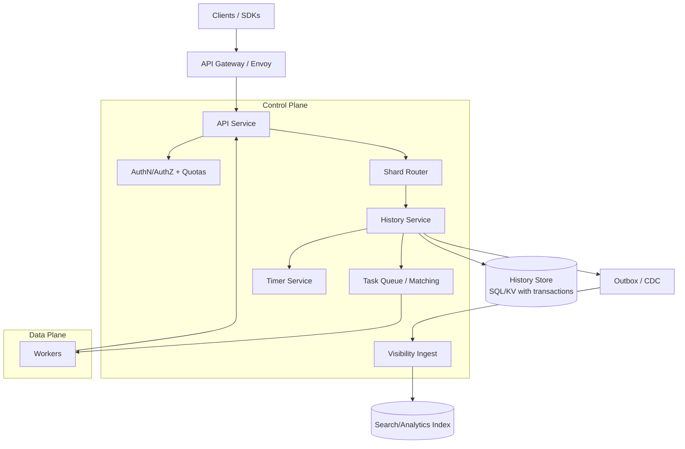
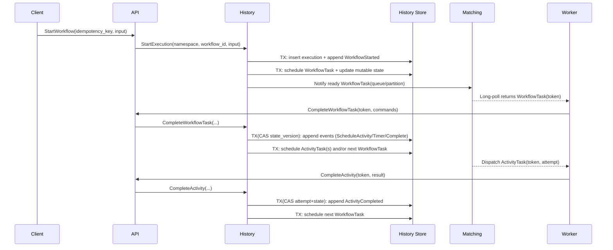

## Overview

A workflow orchestration engine coordinates long-running, multi-step business processes across unreliable services and worker fleets while preserving correctness under retries, crashes, deployments, and partial outages. The hard part is not “running steps”, but making progress **durable**, **deterministic**, and **recoverable** when execution spans minutes to weeks, involves timers and external calls, and must survive any single component failure without losing state or committing the same step twice.

This design models each workflow execution as a deterministic state machine driven by an **append-only event history** (event sourcing). The engine persists every state transition as an immutable event and derives current state by replay (often accelerated by snapshots).

**Exactly-once state transitions** (within the engine) come from combining:
1. **At-least-once task delivery** (workers may receive duplicates),
2. **Idempotent completion commits** using attempt tokens / task tokens, and
3. **Atomic conditional writes** (CAS) in the history store so only one completion wins.

> Important: “exactly-once” applies to the engine’s commit of step results. External side effects still require **idempotency keys**, **transactional outbox**, or compensations.

This is broadly similar to systems like Temporal: correctness lives in the history/store; high-throughput subsystems (matching/visibility) can degrade without corrupting state.

---

## Requirements

### Functional Requirements
- Start, signal, query, cancel, and terminate workflow executions.
- Execute workflows that can run for days/weeks with durable progress and resumability.
- Step primitives:
  - **Workflow tasks** (deterministic decisions based on history),
  - **Activities** (external work executed by workers),
  - **Timers** (sleep, retry backoff, cron),
  - **Child workflows** and fan-out/fan-in patterns.
- Retry policies (exponential backoff, max attempts, non-retryable errors).
- “Exactly-once” commit of step transitions (no double-commit of the same activity attempt).
- Task queues with worker polling, routing by namespace/tenant and queue, optional priority and partitions.
- Versioned workflow definitions with safe rolling upgrades (deterministic replay + compatibility tools).
- Visibility and operations: list/search executions, status, history export/archival, metrics per namespace/queue.
- Multi-tenancy: namespaces, quotas, authn/authz, isolation controls.

### Non-Functional Requirements

#### Scale (example sizing targets)
Pick a “design point” and show how it scales:

- **Control-plane API** (start/signal/query/cancel/terminate): 5k–20k QPS sustained, bursts 5–10×.
- **Concurrent executions**:
  - Active (RUNNING): 200k–2M
  - Total starts/day: 5M–50M (wide range; depends heavily on use cases)
- **Task dispatch** (workflow tasks + activities): 50k–300k deliveries/sec.
- **History volume** (rule-of-thumb; depends on event payloads):
  - Typical event payloads: 200B–2KB (protobuf+compression), occasionally larger for inputs/results.
  - Typical events/execution: 50–2,000 (use **continue-as-new** to bound worst cases).
  - Example: 10M executions/day × 200 events × 600B ≈ **1.2 TB/day** of raw history (before replication).

#### Latency (single region, steady state)
- Start workflow (write path): P50 25–60ms, P99 200–400ms.
- Signal workflow (write path): P50 15–50ms, P99 150–350ms.
- Activity dispatch when a worker is polling:
  - Match latency (poll → task): P50 < 20ms, P99 < 100ms.
  - If no tasks are available: long-poll up to 30s by design.

#### Availability & Durability
- **Availability (regional)**:
  - API write path and task dispatch: 99.99% (4 nines) target.
  - Visibility/search: best-effort; can be degraded without blocking workflow progress.
- **Durability**:
  - No history loss; history is source of truth.
  - RPO: 0 with synchronous quorum replication, or ≤ 60s with async replication (tiered offering).
  - RTO: 30–60 minutes for regional disaster recovery (depends on multi-region mode).

#### Consistency Model
- **Per-execution linearizability** for workflow history and mutable state (strong correctness).
- **At-least-once** delivery for tasks; **exactly-once** commit in history via CAS.
- **Eventual consistency** for visibility indexes and metrics rollups.

### Constraints & Assumptions
- Workers are untrusted and may crash, retry, or process tasks multiple times.
- Workflow code must be deterministic with respect to the recorded history; non-determinism is handled via SDK versioning APIs.
- Prefer proven components and operational simplicity (e.g., Postgres/CockroachDB + Redis + OpenSearch/ClickHouse; Kafka optional).
- Compliance: audit logs for control-plane operations; encryption-at-rest and KMS integration.

---

## Architecture

### High-Level Components



**Control plane** handles correctness and scheduling (API/Auth, History, Task Queues/Matching, Timers, Visibility). **Data plane** is worker fleets running user code via SDKs.

**History Service + History Store** form the correctness core:
- The store is the source of truth (append-only history + mutable execution state).
- All state transitions commit through atomic transactions/CAS.

Subsystems like matching and visibility can be scaled and degraded independently:
- Matching overload should slow dispatch, not corrupt workflow state.
- Visibility outages should not block progress (index lag is acceptable).

---

## Component Deep-Dive

### API Service
**Responsibilities**
- Public endpoints: start/signal/query/cancel/terminate; worker polling and completion.
- Request validation, authn/authz, quotas, and routing to the correct history shard.
- Idempotency handling for client-facing operations.

**Key decisions**
- Stateless API; correctness enforced by History+Store.
- Route by `(namespace_id, workflow_id)` to a stable shard for locality and reduced contention.
- Apply load shedding for non-critical endpoints (e.g., visibility queries) before critical write paths.

**Tech choices**
- Go/Java, gRPC (primary) + REST gateway, Envoy, OIDC/JWT.
- In-memory caches for namespace config and shard maps (TTL + watch refresh).

---

### History Service (Execution Core)
**Responsibilities**
- Workflow state machine: append events, update mutable state, schedule tasks/timers.
- Deterministic replay for workflow tasks; versioning support.
- Exactly-once commit enforcement for activity completions and workflow task completions.

**Key decisions**
- **Event sourcing** for durability and debuggability; immutable history as audit trail.
- **Mutable state** stored alongside history for fast reads (avoids replay on every request).
- **Atomic transitions**: all step completions are conditional on expected `state_version` and/or `attempt_token`.

**Tech choices**
- Strongly consistent transactional store:
  - At smaller scale: Postgres with partitioning and careful indexing.
  - At larger scale / multi-region: CockroachDB / Spanner-like systems, or a KV+txn layer.
- Optional cache (Redis) for hot execution state, guarded by version checks.

**Scaling strategy**
- Shard ownership: `shard_id = hash(namespace_id, workflow_id) % N`.
- Stateless history workers; concurrency limited per shard to control conflict rates.
- Batching: group multiple event appends into a single transaction per workflow task completion.

---

### Task Queue / Matching Service
**Responsibilities**
- Manage task queues, partitions, priorities.
- Match worker long-polls to ready tasks with low latency.
- Provide at-least-once delivery via leases; redelivery on lease expiry.

**Key decisions**
- Separate matching from history so poll traffic scales independently.
- Support **sticky workflow task queues** (optional) to increase cache hit rates for hot executions.
- Durable task records (for recovery) + in-memory matching for low-latency dispatch.

**Tech choices**
- Common patterns:
  - Redis for ready queues + durable task table in the primary store (simple, effective).
  - Or Kafka/log-based tasks + compacted state (higher throughput, higher ops complexity).

**Scaling strategy**
- Partition by `(namespace, queue, partition)`; consistent-hash partitions to matcher nodes.
- Use long-poll (e.g., 30s) to reduce poll QPS; batch dispatch and prefetch.
- Backpressure: per-queue and per-namespace concurrency limits; reject or delay polls under overload.

---

### Timer Service
**Responsibilities**
- Durable timers: sleep, retry backoff, cron schedules.
- Emit timer-fired events into history, exactly-once.

**Key decisions**
- Timers must survive process crashes; do not rely on in-memory heaps alone.
- Use time-bucket scanning with leases to distribute load and avoid duplicate firing.

**Tech choices**
- Timer table indexed by `(bucket, fire_at)`; processors acquire bucket leases.
- Optional near-future wheel in Redis for sub-second resolution (still backed by durable records).

**Scaling strategy**
- Bucket size: 1s–10s depending on scale and acceptable jitter.
- Idempotent firing enforced by history CAS/unique constraints.

---

### Visibility / Search Service
**Responsibilities**
- List/search executions, filters, aggregates (for UI and ops).
- Not on the correctness path; can be eventually consistent.

**Key decisions**
- Async indexing using **outbox/CDC** from the history store.
- Separate index schema from source-of-truth schema; optimize for query patterns.

**Tech choices**
- OpenSearch/Elasticsearch for flexible filtering.
- ClickHouse for analytics-style queries and aggregations (often cheaper at scale).

**Scaling strategy**
- Bulk ingestion; ILM/retention; per-namespace routing and quotas.
- Rebuildable from history if history retention is sufficient.

---

### Worker SDK (Data Plane)
**Responsibilities**
- Provide deterministic workflow APIs (timers, activities, signals).
- Translate workflow code decisions into “commands” sent back to History.
- Expose versioning and non-determinism controls (e.g., patch markers, workflow version APIs).
- Provide activity heartbeats, cancellation, and idempotency helpers.

**Key decisions**
- Workflow code must be replay-safe: time/randomness come from recorded events, not system calls.
- Activities are the escape hatch for side effects; workflow code remains pure relative to history.

---

## Data Model

### Core Tables (Relational Example)

**`namespaces`**
- `namespace_id (pk)`, `name (unique)`
- `config_json`, `quotas_json`
- `created_at`

**`workflow_executions`** (mutable state, single row per run)
- `namespace_id`
- `execution_id (pk)` (UUID/ULID)
- `workflow_id` (user-visible stable id)
- `run_id` (unique per run)
- `state` (RUNNING|COMPLETED|FAILED|CANCELED|TERMINATED)
- `shard_id`
- `state_version` (monotonic; used for optimistic concurrency)
- `next_event_id` (monotonic per execution)
- `sticky_queue` (nullable)
- `last_updated_at`, `started_at`, `closed_at`
- Unique: `(namespace_id, workflow_id, state=RUNNING)` if disallowing duplicate running IDs

**`workflow_history_events`** (append-only)
- `namespace_id`, `execution_id`
- `event_id` (monotonic per execution)
- `event_type`, `event_time`
- `payload` (protobuf bytes; compressed)
- PK: `(namespace_id, execution_id, event_id)`

**`workflow_tasks`** (durable record of scheduled workflow tasks)
- `task_id (pk)`
- `namespace_id`, `execution_id`
- `scheduled_event_id` (for dedupe)
- `status` (READY|LEASED|COMPLETED|CANCELED)
- `lease_owner`, `lease_expires_at`
- Unique: `(namespace_id, execution_id, scheduled_event_id)`

**`activity_tasks`**
- `task_id (pk)`
- `namespace_id`, `execution_id`
- `activity_id` (monotonic within workflow)
- `queue`, `partition`
- `attempt` (int)
- `status` (READY|LEASED|COMPLETED|CANCELED)
- `lease_owner`, `lease_expires_at`
- `completion_token_hash` (for validation without storing raw token)
- Unique: `(namespace_id, execution_id, activity_id, attempt)`

**`timers`**
- `timer_id (pk)`
- `namespace_id`, `execution_id`
- `fire_at`, `bucket`
- `timer_type` (SLEEP|RETRY|CRON)
- `status` (PENDING|FIRED|CANCELED)
- Unique: `(namespace_id, execution_id, timer_id)`; index `(bucket, fire_at, status)`

**`request_dedup`** (client idempotency and signal dedupe)
- `namespace_id`
- `scope` (START|SIGNAL|CANCEL|TERMINATE)
- `key` (e.g., client request_id / idempotency_key)
- `response_blob`
- `expires_at`
- PK: `(namespace_id, scope, key)`

**Derived / external**
- Visibility index documents derived from history and mutable state via outbox/CDC.

### Invariants (Correctness Anchors)
- History is append-only; event IDs are strictly increasing per execution.
- Mutable state updates are guarded by `state_version` (optimistic concurrency).
- A completion commit must prove it is for the current attempt (via task token and expected state).

---

## Data Flow

### Start → Workflow Task → Activity → Completion



**Exactly-once commit detail**: `CompleteActivity(token)` succeeds only if the token maps to the current `(execution_id, activity_id, attempt)` and the mutable state still expects that attempt. Duplicate deliveries or late completions fail with a conflict response (safe to ignore).

---

## API Design

Primary interface: gRPC (preferred for streaming/long-poll) with REST gateway for convenience.

### Start Workflow
`POST /v1/namespaces/{namespace}/workflows:start`

Request:
```json
{
  "workflow_id": "order-123",
  "workflow_type": "OrderFulfillment",
  "task_queue": "orders",
  "input": { "orderId": "123" },
  "idempotency_key": "client-key-abc",
  "workflow_id_reuse_policy": "REJECT_DUPLICATE_RUNNING",
  "retry_policy": { "max_attempts": 3 }
}
```

Response:
```json
{ "run_id": "01J..." }
```

Semantics:
- Idempotent on `(namespace, idempotency_key)` with request-hash validation.
- If `workflow_id` already RUNNING and reuse policy rejects, return `409`.

### Signal Workflow
`POST /v1/namespaces/{namespace}/workflows/{workflow_id}/signals/{signal_name}`

Request:
```json
{ "run_id": "01J...", "payload": { "approved": true }, "request_id": "sig-uuid" }
```

Semantics:
- Deduplicate by `(namespace, execution_id, request_id)`.
- Signals are recorded as history events and processed by the next workflow task.

### Query Workflow
`POST /v1/namespaces/{namespace}/workflows/{workflow_id}:query`

Request:
```json
{ "run_id": "01J...", "query_type": "GetState", "args": {} }
```

Semantics:
- “Strong-ish” read: served from mutable state when available; may be slightly stale if a workflow task is in-flight.
- Optional mode: `QUERY_CONSISTENCY=STRONG` blocks until `state_version >= X` (bounded by timeout).

### Worker Poll for Tasks (Long Poll)
`POST /v1/namespaces/{namespace}/task-queues/{queue}:poll`

Request:
```json
{
  "worker_id": "w-17",
  "task_type": "ACTIVITY",
  "max_wait_ms": 30000,
  "partition": 3
}
```

Response:
```json
{
  "task": {
    "task_id": "t-1",
    "execution_id": "e-1",
    "activity_id": 42,
    "attempt": 1,
    "lease_expires_at": "2025-12-17T12:00:00Z",
    "completion_token": "opaque"
  }
}
```

Semantics:
- At-least-once. Worker must be prepared for duplicates.
- Lease is renewed via heartbeat (for long activities) or expires to trigger redelivery.

### Complete Activity (Exactly-Once Commit)
`POST /v1/activities:complete`

Request:
```json
{
  "completion_token": "opaque",
  "result": { "ok": true },
  "request_id": "complete-uuid"
}
```

Responses:
- `200`: committed and will drive workflow forward.
- `409`: already completed / attempt mismatch (safe to ignore; likely duplicate).
- `410`: token expired / task canceled (worker should stop; result is not accepted).

---

## Scaling & Performance

### Hot Paths and Mitigations
- **History write amplification** (many events):
  - Batch events per workflow task completion into one transaction.
  - Compress payloads; store large inputs/results externally (blob store) and keep references in history.
  - Snapshot mutable state every N events (e.g., 200–1,000) to bound replay.
- **Replay cost for long histories**:
  - Prefer mutable state reads for routing/query.
  - Use **continue-as-new** to cap history length for “forever” workflows.
- **Task queue hotspots** (popular queues):
  - Add partitions; route workers to partitions.
  - Use per-namespace and per-queue concurrency limits.
  - Sticky workflow queues for cache locality (optional).
- **Timer scanning overhead**:
  - Bucket by time; lease buckets; only scan near-future horizon.
  - Accept bounded timer jitter (e.g., bucket size) unless strict SLAs require tighter resolution.

### Partitioning & Sharding
- Routing key: `shard_id = hash(namespace_id, workflow_id) % N`.
- History data locality:
  - Cluster/partition by `(namespace_id, execution_id)` for sequential appends and fast range scans.
- Task queues:
  - Partition key: `(namespace, queue, partition)`; rebalance partitions by moving ownership, not by rewriting history.

### Backpressure and Load Shedding
- Reject or slow non-critical reads (visibility/search) before write paths.
- Apply admission control on history commits when store latency spikes.
- Per-tenant quotas: starts/sec, signals/sec, in-flight activities, history bytes/day, visibility query rate.

### Capacity Planning (Example)
At a design point of **150k task deliveries/sec** and **2k history events/sec per shard worker**:
- Shards required (rough): 150k / 2k = 75 shards worth of throughput (plus headroom → 150–300 shards).
- Store sizing derived from:
  - events/day × avg_event_size × replication_factor × retention_days
  - plus indexes and mutable state overhead.

---

## Trade-offs & Alternatives

### Trade-offs Made
- **Event sourcing + replay**
  - Pros: strong auditability, deterministic recovery, easy debugging (“time travel”).
  - Cons: replay/snapshot complexity, careful schema evolution required.
- **At-least-once delivery + exactly-once commit**
  - Pros: scalable and resilient under failures.
  - Cons: requires tokens, leases, idempotent workers, and careful completion semantics.
- **Separate visibility index (eventual consistency)**
  - Pros: protects correctness path; enables rich queries.
  - Cons: list/search may lag; operational complexity (index lifecycle and rebuilds).
- **Store-backed timers**
  - Pros: correctness under crashes and restarts.
  - Cons: scanning overhead and jitter vs purely in-memory wheels.

### Alternatives (When to Choose Them)
- **Kafka/log-first orchestration**
  - Best for extremely high throughput and streaming-first organizations.
  - Harder to provide transactional per-execution CAS semantics and efficient random access.
- **Database/BPMN-style workflow engines**
  - Strong for human-centric processes and ad-hoc modeling.
  - Often struggles with long-poll and high-frequency state transitions at large scale.
- **Managed step-functions/serverless orchestration**
  - Great for small teams and quick delivery.
  - Cost and flexibility constraints at very high state-transition volume.

---

## Failure Modes & Mitigations

### Worker-Level Failures
- **Worker crashes mid-activity**
  - Detect: lease expiry or missed heartbeats.
  - Mitigate: re-lease task, increment attempt; enforce max attempts; cancellation support.
  - Note: external side effects must be idempotent.
- **Duplicate task delivery**
  - Detect: completion CAS fails (already completed / attempt mismatch).
  - Mitigate: only first completion commits; duplicates return `409` and are ignored.
- **Slow or stuck activities**
  - Detect: heartbeat lag, long leases, high retry counts.
  - Mitigate: timeouts, cancellation, circuit breakers per activity type.

### Control-Plane Failures
- **History instance crash**
  - Impact: transient errors for in-flight requests.
  - Mitigate: stateless replicas; client retries with idempotency keys; store is source of truth.
- **Matching service overload/outage**
  - Impact: dispatch latency increases; workflow progress slows.
  - Mitigate: durable task records prevent loss; autoscale matchers; shed poll load; fallback to simpler FIFO dispatch if needed.
- **Timer processor duplication**
  - Impact: attempted double fire.
  - Mitigate: idempotent timer-fired event append via CAS/unique constraints.

### Storage and Data Integrity
- **Durable store partial outage / network partition**
  - Impact: cannot append events; workflows pause (preferred to corrupting state).
  - Mitigate: quorum replication, circuit breakers, admission control, prioritized queues for critical tenants.
- **High transaction conflict rate (hot workflows)**
  - Impact: elevated latency and retries.
  - Mitigate: serialize per-execution updates, reduce concurrent writers, batch events, avoid cross-execution transactions.

### Determinism and Deployments
- **Poison pill workflow (non-deterministic code)**
  - Detect: deterministic check failure on workflow task completion/replay.
  - Mitigate: SDK versioning APIs (patch markers); fail fast with diagnostics; operator tools to reset/continue-as-new or pin worker versions.
- **Schema evolution bugs**
  - Mitigate: versioned protobufs, forward/back compatibility testing, canarying history writers, feature flags.

### Disaster Recovery
- Targets: RTO 30–60 minutes (regional), RPO 0–60 seconds (tiered).
- Strategy:
  - PITR backups for store; periodic validation restores.
  - Visibility index snapshots or rebuild from history (if retained).
  - Runbooks: promote replica region, reassign shard ownership, restart timers/matching, validate progress with invariants.

---

## Operations

### SLOs and Error Budgets
- Define SLOs separately for:
  - API write path (start/signal/complete): availability + latency
  - Task dispatch: match latency when tasks are available
  - Visibility: freshness lag (e.g., P99 indexing lag < 5 minutes)

### Monitoring & Alerting
Key metrics:
- Store: commit latency (P50/P99), txn retries/conflicts, replication lag, disk utilization.
- History: append rate, mutable-state cache hit rate, workflow task processing latency, CAS failure rate.
- Matching: queue depth per partition, poll QPS, match latency, lease expirations, redelivery rate.
- Timers: timer lag (`now - min(fire_at)`), scan duration, duplicate fire rejects.
- Workflow health: stuck executions (no progress for N minutes), retries by activity type, failure rates.

Alerts (examples):
- P99 start/signal/complete latency exceeds SLO for 5–10 minutes.
- Store error rate > 1% or replication lag exceeds RPO target.
- Queue depth and dispatch latency grow together (sustained backlog).
- Timer lag > 60s (workload-dependent).
- Spike in non-determinism failures after deploy.

### Security and Multi-Tenancy
- Authn: OIDC/JWT; mTLS for internal services.
- Authz: per-namespace roles (admin/operator/worker/client), least privilege.
- Quotas: starts/sec, signals/sec, concurrent activities, history bytes/day, visibility query QPS.
- Data isolation: namespace_id on every row; optional encryption-at-rest and per-tenant KMS keys.
- Audit logs: immutable trail for start/signal/cancel/terminate and policy changes.

### Deployment and Change Management
- Roll API/matching/timers with canary + rollback.
- History changes require strict backward/forward compatibility of event schemas.
- SDK releases must preserve determinism; provide compatibility tooling and staged rollout guidance.
- Runbook for “stuck after deploy”: identify non-determinism, roll back workers, use versioning APIs, then resume.

### Retention and Archival
- History retention by namespace (e.g., 7–90 days) with archival to object storage for long-term compliance.
- Visibility retention aligned with product needs; rebuildable if history retained.

---

## References & Further Reading
- Temporal Concepts and Architecture: https://docs.temporal.io/
- Transactional Outbox pattern: https://microservices.io/patterns/data/transactional-outbox.html
- Event Sourcing pattern: https://martinfowler.com/eaaDev/EventSourcing.html
- “The Log” (data-centric architecture): https://engineering.linkedin.com/distributed-systems/log-what-every-software-engineer-should-know-about-real-time-datas-unifying
- Saga pattern (long-running transactions): https://microservices.io/patterns/data/saga.html