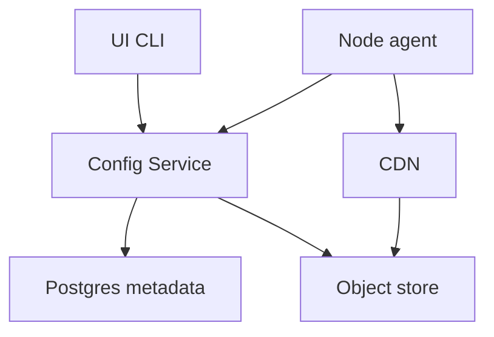

## Overview

This system reliably delivers the right configuration to the right nodes while making configuration changes safe, auditable, and quickly reversible.

It separates two concerns:

- **Mutable pointers (small, strongly consistent)**: what version each environment/service/config key should run, plus rollout state and approvals.
- **Immutable payloads (highly cacheable)**: the configuration content stored once and distributed via CDN.

Agents resolve an *effective* config pointer from a regional serving API, then fetch the immutable payload from CDN/object storage and apply it with a last-known-good (LKG) fallback.

---

## Requirements

### Functional Requirements
- Publish configuration as **immutable versions** with labels (e.g., `candidate`, `stable`, `prod-approved`).
- Enforce **schema validation** and **policy checks**.
- Support **targeting rules** (service, env, region, cluster, stable node attributes).
- Support **progressive rollout** (canary %, steps, regional sequencing, freeze windows, approvals).
- Support **fast rollback** (seconds) with a durable audit trail.
- Support **pull** for correctness plus **push-like hints** to speed convergence.
- Provide **status reporting** (apply success/failure, skew, rollout health).
- Provide **RBAC** integrated with SSO and break-glass.
- Provide **watch/stream APIs** for UIs and automation.

### Non-Functional Requirements (Targets)
- Fleet: **200k nodes**, bursts up to **150k QPS** for metadata resolution (regional).
- Latency (per region): resolve P50 **< 20 ms**, P99 **< 150 ms** (mostly served from memory cache).
- Availability: read path **99.99%**, write path **99.9%**.
- Metadata RPO **≤ 1 min**, RTO **≤ 30 min**.
- Consistency: strong within a region for release pointers/approvals; eventual cross-region; **monotonic per agent** except authorized rollback.

### Constraints & Assumptions
- Multi-region active/active reads; agents keep on-disk **LKG**.
- Config sizes: typical **< 64 KB**, up to **5 MB** (prefer references for very large artifacts).
- Audit retention **≥ 1 year** with immutability guarantees and separation of duties for prod releases.

---

## Simplified Architecture

### High-Level Design

A single **Config Service** provides both:
- **Control plane APIs** (publish, validate, approvals, rollouts, audit)
- **Data plane APIs** (resolve effective config, batch resolve, long-poll “watch”)

It stores all metadata in **PostgreSQL** (history + current release pointers) and stores payloads in **object storage** fronted by a **CDN**.

Serving performance comes from:
- in-memory caching of hot release pointers and targeting rules inside the Config Service
- batch resolve APIs
- long-poll watch (hint) to reduce polling delays during rollouts

### Architecture Diagram



---

## Components

### 1) Config Service (Control + Serving)

**Responsibilities**
- Version creation: validation, content hashing, immutable blob upload.
- Release management: approvals, freeze windows, rollout orchestration, fast rollback.
- Fleet serving: resolve effective version (single/batch), deterministic canary bucketing, long-poll watch hints.
- Auditing: append-only audit records and periodic export to immutable object storage.
- Status ingestion: agent apply reports and aggregated rollout health.

**Deployment**
- Stateless replicas per region across multiple AZs.
- Two internal work loops in the same service:
  - **rollout runner** (advances steps, checks gates, pauses/rolls back)
  - **audit exporter** (ships signed/immutable audit segments to object storage)

**Key Data Contracts**
- Immutable payload addressed by `sha256/{hash}`.
- Mutable release pointer per `(env, service, configKey)` includes:
  - `activeVersionId`, `releaseGeneration`, `blobRef`, `checksum`, `rollbackAllowed`

---

### 2) PostgreSQL (Metadata Store)

**Responsibilities**
- Strongly consistent source of truth for:
  - versions, labels, schemas
  - releases (current pointers) and rollout state
  - approvals and freeze window decisions
  - audit index (pointers to immutable audit segments)
  - agent status (latest) and coarse aggregates

**HA/DR**
- Multi-AZ primary per region (managed HA).
- Cross-region read replicas (async) for local serving reads where applicable.
- PITR backups and periodic restore drills to meet RPO/RTO.

---

### 3) Object Storage + CDN (Payload Distribution)

**Responsibilities**
- Durable storage for:
  - immutable config blobs
  - immutable audit segments (append-only exports)
- CDN caches blobs by content hash with long TTL.

**Integrity**
- Store and return `checksum` (and optional signature) alongside `blobRef`.
- Agents verify checksum/signature before applying.

---

### 4) Node Agent (Apply + Safety)

**Responsibilities**
- Resolve pointer (single/batch), fetch blob from CDN, verify integrity, apply atomically.
- Maintain on-disk LKG and enforce monotonic apply using `releaseGeneration`.
- Report apply outcome and current generation to the Config Service.

---

## Data Model

### Identifiers
- `versionId`: monotonically increasing per `(service, configKey)` (or globally unique).
- `releaseGeneration`: strictly increasing per `(env, service, configKey)` for cache coherence and monotonic apply.
- `blobRef`: `sha256/{hash}`.

### Core Tables (Conceptual)
- `schemas(schema_id, definition_ref, created_by, created_at)`
- `config_versions(service, config_key, version_id, schema_id, blob_ref, checksum, created_by, created_at, description)`
- `version_labels(service, config_key, version_id, label)`
- `releases(env, service, config_key, active_version_id, release_generation, blob_ref, checksum, rollback_allowed, updated_by, updated_at, reason)`
- `rollouts(rollout_id, env, service, config_key, from_version_id, to_version_id, strategy, state, current_step, created_by, created_at)`
- `rollout_steps(rollout_id, step_index, percent, region, wait_seconds, health_gate)`
- `approvals(rollout_id, approver, decision, approved_at, comment)`
- `agent_status(env, service, node_id, config_key, release_generation, version_id, status, updated_at, error_code, error_detail)`
- `audit_segments(segment_id, object_ref, sha256, created_at)` and `audit_index(request_id, actor, action, target, segment_id, created_at)`

---

## Serving Logic

### Targeting & Canary Bucketing
- Targeting inputs: `env`, `region`, `cluster`, `service`, optional stable attributes.
- Canary bucketing:
  - `bucket = hash(nodeId || configKey) % 100`
  - serve canary when `bucket < canaryPercent`
- Rules and rollout parameters are versioned and auditable.

### Push-Like Convergence (Without a Separate Bus)
- Agents call resolve with `knownGeneration`.
- The Config Service supports **long-poll** (e.g., up to 25s) and returns immediately when generation changes; otherwise returns current pointer at timeout.
- A short TTL (e.g., 30s) remains the correctness fallback.

---

## API

### Control Plane
- `POST /v1/services/{service}/configs/{configKey}/versions` (create immutable version)
- `POST /v1/services/{service}/configs/{configKey}/versions/{versionId}:label` (labels)
- `PUT /v1/environments/{env}/releases/{service}/{configKey}` (start rollout / set release)
- `POST /v1/rollouts/{rolloutId}:approve` (approvals)
- `POST /v1/environments/{env}/releases/{service}/{configKey}:rollback` (fast rollback)

### Data Plane
- `GET /v1/environments/{env}/services/{service}/configs/{configKey}/effective?nodeId=...&knownGeneration=...`
- `POST /v1/effective-config:batch`
- `POST /v1/agent-status:report` (apply outcomes; may be sampled/aggregated client-side)

**Auth**
- OIDC bearer tokens for humans; workload identity for agents/services.
- RBAC roles: `viewer`, `publisher`, `approver`, `admin`.

---

## Data Flow

```mermaid
sequenceDiagram
  autonumber
  participant Dev as UI CLI
  participant Svc as Config Service
  participant PG as Postgres
  participant Obj as Object Store
  participant Ag as Agent
  participant CDN as CDN

  Dev->>Svc: Create version
  Svc->>Svc: Validate; hash
  Svc->>Obj: Put sha256/{hash}
  Svc->>PG: Insert version, labels
  Svc-->>Dev: versionId, blobRef, checksum

  Dev->>Svc: Start rollout
  Svc->>PG: Insert rollout; bump gen
  Svc-->>Dev: rolloutId, state

  Ag->>Svc: Resolve config
  Svc-->>Ag: versionId, gen, blobRef, checksum, ttl
  Ag->>CDN: Get blob
  CDN-->>Ag: Payload
  Ag->>Ag: Verify; apply; update LKG
  Ag->>Svc: Report status
```

---

## Scaling & Performance

- **Serving cache**: Config Service caches release pointers and hot targeting rules in memory with short TTL and background refresh.
- **Batch resolve**: agents resolve multiple keys per call to reduce QPS during storms.
- **Load shedding**: 429 with `Retry-After`, plus jitter/backoff guidance for agents.
- **CDN**: immutable blobs cached by hash; no invalidation path required.

---

## Failure Modes

1. **Bad config passes validation**
   - Mitigations: progressive rollout with gates, max-step limits, freeze windows, approvals for prod, fast rollback (pointer change).

2. **Postgres write impairment**
   - Impact: publishes/rollouts stall; serving continues from cached pointers and existing replicas.
   - Mitigations: multi-AZ HA, circuit breakers, serving cache + TTL, agent LKG.

3. **CDN/origin errors fetching blobs**
   - Mitigations: agent disk cache + LKG, rollout runner pauses on elevated fetch failures, multi-region object storage replication (where available).

4. **Regional isolation**
   - Mitigations: agents continue on LKG; Config Service serves cached pointers; operators can fail over serving to another region if required.

---

## Operations

### Monitoring (Golden Signals)
- Resolve QPS/latency, cache hit rate, error rates, long-poll duration/timeout rate.
- Postgres replication lag, query latency, connection saturation.
- CDN hit ratio, origin 5xx, egress.
- Agent apply success rate, time-to-update, LKG usage rate.

### Security & Compliance
- Encrypt in transit and at rest; least-privilege RBAC.
- Optional payload signing for higher-assurance fleets (agent verifies).
- Audit events written append-only and exported to immutable object storage with ≥ 1 year retention.

### Retention & GC
- Retain LKG versions and active releases; retain last N versions per key with time-based retention for non-critical keys.
- GC operates only on blobs unreferenced by any active release/retention policy and never removes audit segments.

---

## Simplification Notes

- Removed: API gateway; routing handled by the Config Service behind a standard L7 load balancer.
- Removed: separate validator service; validation and policy checks run inside the Config Service for a single write path.
- Removed: dedicated serving metadata KV; release pointers and rollout state stored in Postgres with in-service caching for read scale.
- Removed: event bus + notifier; convergence uses long-poll resolve/watch and TTL refresh as the correctness fallback.
- Merged: control-plane orchestration and read-serving into one codebase (Config Service) with separate scaling via replicas/roles.
- Complexity retained: CDN/object storage for bursty payload delivery, Postgres HA/DR for correctness, monotonic generations + LKG for safe agent behavior, and rollout controls for blast-radius management.
