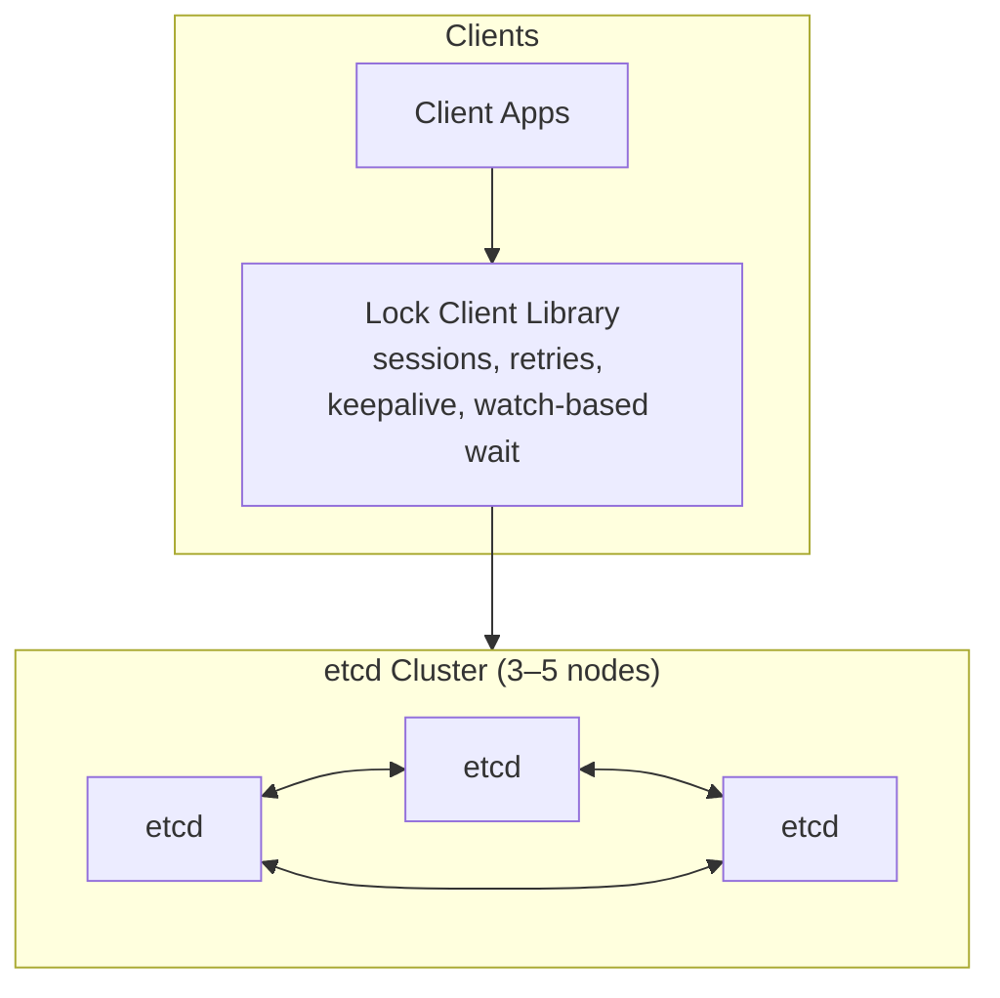

## Overview

This distributed lock service provides **mutual exclusion** with **linearizable semantics** across unreliable clients. It is built on a small **etcd** cluster (3–5 nodes) and a **client library** that implements lock operations using etcd’s proven primitives:

- **Consensus-backed linearizable writes** (transactions)
- **Leases** for liveness and automatic cleanup
- **Watches** to wait efficiently without polling
- **Fencing tokens** derived from committed revisions to protect downstream resources

The service is “safe” when downstream systems enforce the fencing token (or an equivalent monotonic guard).

---

## Requirements

### Functional Requirements

- **Sessions with leases (TTL-based)**: implemented as etcd leases (`LeaseGrant`, `KeepAlive`).
- **Acquire/Release of named locks (linearizable)**: implemented as etcd transactions on a lock key.
- **Fencing token on successful acquire**: use the committed **modRevision** (or response header revision) of the lock key write.
- **Automatic revoke on session expiry**: lock keys are attached to the session’s lease and are removed automatically by etcd.
- **Watch/notify**: clients watch lock keys (or prefixes) and retry acquires on change.
- Support:
  - `TryAcquire` (no wait)
  - `Acquire(wait, timeout)` (watch + retry)
  - Reentrancy (optional): handled in the client library as in-process reentrancy when using one session per process.
- Primitives atop leases:
  - ephemeral membership/presence keys under a lease
  - leader election recipes using standard etcd patterns
- Admin endpoints:
  - health/readiness, metrics: provided by etcd and its tooling
  - membership changes, snapshots/backups: etcd maintenance operations

### Non-Functional Requirements (single region)

- **Sessions**: 50,000 concurrent (leases)
- **Active locks**: 200,000 (keys)
- **Total keys**: up to 5,000,000
- **Traffic**:
  - Reads/watches: ~20,000 QPS
  - Writes: ~7,000 QPS peak (dominated by keepalive)

Latency and availability are governed by a healthy quorum of the etcd cluster (3 nodes typical; 5 nodes when a second fault domain is required).

---

## Simplified Architecture

### Core invariants

1. **Single authoritative history**: all lock state changes occur via etcd transactions and are ordered by consensus.
2. **Lease-driven liveness**: a session is valid while its lease is kept alive; expired leases remove attached keys.
3. **Monotonic fencing tokens**: tokens are taken from the committed revision of the successful lock write.
4. **Watches are advisory**: clients treat watch events as hints and re-check state via a transaction retry.

---

## Components

### 1) etcd Cluster

**Responsibility**: Provide a linearizable KV store with leases and watches.

**Deployment**
- 3 nodes across 3 AZs for typical cost/latency.
- 5 nodes when tolerating an additional fault is required (higher write latency).
- SSD/NVMe-backed storage with predictable fsync performance.

**Operations**
- Membership changes and upgrades are performed using etcd’s supported procedures (one node at a time while maintaining quorum).
- Snapshots/maintenance use etcd tools and APIs.

### 2) Lock Client Library

**Responsibility**: Provide a small, consistent API for sessions, locks, waiting, retries, and timeouts.

**Client contract**
- Maintain one session (lease) per process.
- Keep a keepalive stream open; reconnect with exponential backoff + jitter.
- Expose a “lease lost” signal; application must stop using any lock-derived authority and re-acquire.
- Use watch-based waiting; avoid busy loops.

---

## Data Model (Keys)

All keys are stored in etcd. Values are small blobs (JSON/protobuf) that include the session identity for verification.

### Sessions (leases)

- `session_id`: the etcd `lease_id` returned from `LeaseGrant`.
- No separate session table is required; liveness is determined by lease state.

### Locks

- Lock key: `/locks/<lock_name>`
- Value (example): `{ "session_id": "<lease_id>", "client_id": "<string>" }`
- The **fencing token** is the key’s **modRevision** from the successful acquire write.

### Ephemeral membership/presence (optional)

- Presence key: `/members/<group>/<member_id>` attached to the same lease.

---

## Request/Response Flows

### Session lifecycle

- **CreateSession**: `LeaseGrant(TTL)` → returns `lease_id` (session_id).
- **KeepAlive**: streaming keepalive for the lease.
- **Expiry**: if keepalive stops, the lease expires and etcd deletes all keys attached to it (locks, presence keys).

### AcquireLock (TryAcquire)

**Goal**: create `/locks/<name>` if it does not exist, attached to the caller’s lease.

Transaction outline:
1. Compare: key does not exist (`version(key) == 0`)
2. Success: `Put(key, value, lease=session_lease)`
3. Failure: read current key/value (optional for debugging / idempotent behavior)

Response:
- `acquired=true` on success and `fencing_token = modRevision` of the lock key write.
- `acquired=false` on failure.

### AcquireLock (wait with timeout)

Client-side loop:
1. TryAcquire transaction.
2. If not acquired:
   - Watch `/locks/<name>` for delete/put events starting from the current revision.
   - On event (or watch reconnect), retry TryAcquire.
3. Stop when acquired or timeout.

This avoids server-side waiter state and keeps contention behavior bounded.

### ReleaseLock

Transaction outline:
1. Compare: key exists AND value’s `session_id` matches caller’s session
2. Success: `Delete(key)`
3. Failure: return `released=false`

This is idempotent: repeating release after a successful delete remains a no-op.

---

## API Design

The “API” is the client library surface; it uses etcd’s native gRPC API under the hood.

### Library API

- `CreateSession(ttl) -> session`
- `KeepAlive(session) -> stream/status`
- `TryAcquire(session, lock_name) -> {acquired, fencing_token}`
- `Acquire(session, lock_name, timeout) -> {acquired, fencing_token}`
- `Release(session, lock_name) -> {released}`
- `Watch(prefix or key, start_revision) -> stream`

### Error handling

- Quorum unavailable / leader issues: surface as `UNAVAILABLE` and retry with backoff.
- Lease expired: surface as terminal “lease lost”; force session recreation and re-acquire.

---

## Fencing Tokens (Downstream Enforcement)

On a successful acquire, the client receives a fencing token equal to the lock key’s committed revision (monotonic). Downstream systems enforce monotonicity per resource.

Examples:
- Database row guard: `UPDATE resource SET token=? WHERE token < ?`
- Scheduler/worker guard: accept commands only when token ≥ last applied token
- Metadata guard: store last token and reject stale writes

---

## Scaling & Performance

- Keepalive traffic dominates writes; a 10s keepalive interval yields ~5,000 writes/s at 50k sessions.
- Use SSD/NVMe and monitor fsync latency; tail latency is often the primary driver of P99 for transactional writes.
- Contention is handled by watch-based waiting and jittered retries in the client library.

Horizontal scaling uses multiple independent etcd clusters partitioned by environment/tenant/prefix when needed.

---

## Availability, Recovery, and DR

### In-region

- RPO: 0 for committed entries.
- RTO: typically seconds for leader change; under a minute for node restart.

### Cross-region (optional)

- Periodic snapshots and WAL shipping to object storage.
- Restore procedure brings up a new etcd cluster; clients recreate sessions and re-acquire locks.

---

## Operations

### Monitoring

- etcd health and leader status
- commit/apply latency (P50/P99)
- WAL fsync latency (P50/P99)
- leader changes / elections
- watch stream count and reconnect rate
- lease count and keepalive rate
- keyspace size and compaction/snapshot timings

### Deployment

- Rolling upgrades one node at a time while maintaining quorum.
- Regular snapshots and compaction per etcd best practices.

---

## Simplification Notes

- Removed: custom Raft layer, replicated state machine, watch dispatcher, lease/session manager, and lock manager; etcd provides these primitives with consensus, leases, and watches.
- Merged: session management, lock state, fencing token ordering, and watch delivery into a single etcd-backed model accessed by one client library.
- Complexity that remains: quorum-based writes and fencing-token enforcement are necessary to keep lock ownership linearizable and safe under partitions, crashes, and long client pauses.
