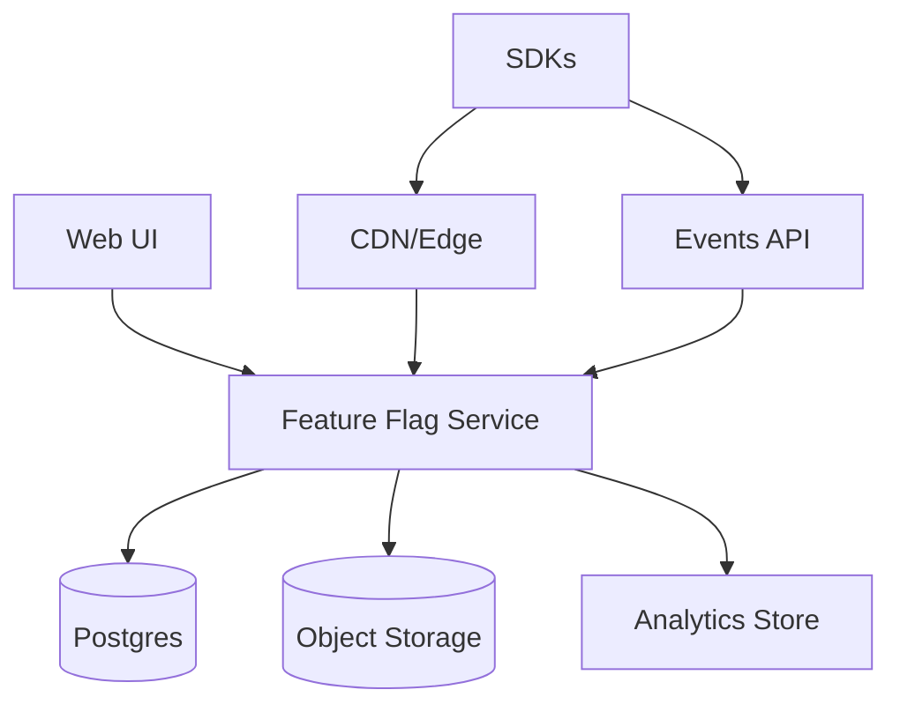
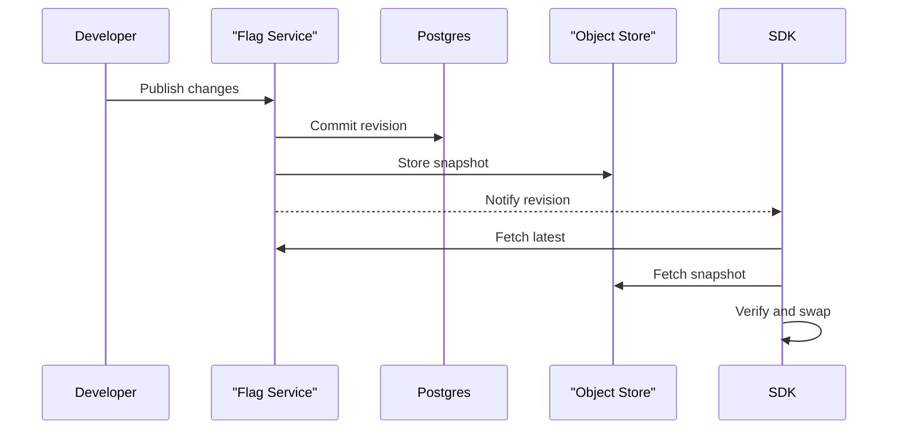
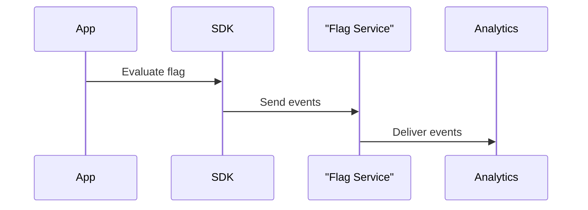

## Overview

This system provides safe, fast feature flagging and experimentation for multi-tenant applications. Flags are evaluated locally in SDKs using a versioned ruleset, so application request paths do not depend on a network call. The platform focuses on:

- Strongly consistent authoring and publishing per `(org, env)` with immutable revision history
- Rapid, reliable propagation of new revisions to SDKs
- Deterministic rollouts/experiments with exposure logging for analysis
- Operational safety: auditability, approvals/guardrails, and emergency kill switches

The design is built around **immutable snapshots** and a small **latest pointer**:
- Every publish produces a new immutable snapshot `(org, env, revision)`
- SDKs fetch `latest`, then fetch the referenced snapshot, verify it, and atomically swap it in-memory
- Server SDKs can optionally hold a stream to receive revision notifications for faster propagation

---

## Requirements

### Functional Requirements

- Create, update, archive feature flags across environments (dev/stage/prod) with immutable revision history.
- Target flags based on context attributes (e.g., `userId`, `orgId`, geo, plan, app version), including reusable segments.
- Support deterministic percentage rollouts and ramp schedules (e.g., 1% → 5% → 25% → 100%).
- Support experiments (A/B, multivariate) with stable bucketing and exposure logging.
- Provide emergency kill switches (global and scoped) with fast propagation and safe defaults.
- Provide server and client SDKs with:
  - local evaluation
  - offline mode
  - last-known-good behavior
  - reason metadata (why a value was returned)
- Provide RBAC, audit logs, optional approvals, and guardrails to reduce blast radius.
- Provide operational tooling: search, change history, diffs, and rollback to a prior revision.

### Non-Functional Requirements

#### Scale (example target)

- Tenants: up to 2,000 orgs
- Flags: up to 100k total, ~1k–10k per large org across environments
- SDK instances (servers): ~50,000 concurrent (pods/VMs)
- Client devices (mobile/web): up to 5–20 million daily active clients (intermittent connectivity)
- Data plane connections:
  - ~50k concurrent streams (server SDKs)
  - client SDKs prefer pull with longer TTL
- Control plane traffic: low/moderate (e.g., 10–200 QPS steady, bursty publishes during incidents)
- Event ingestion (exposures + diagnostics): up to 200k events/sec peak (bursty), with batching

#### Latency

- **Evaluation (in-process)**:
  - Server SDK: P50 < 50µs, P99 < 200µs
  - Client SDK: P50 < 0.5ms, P99 < 2ms
- **Config propagation (publish → applied by SDK)**:
  - P50 < 1s, P99 < 10s for server SDKs using streams
  - P99 < 60s for client SDKs using pull

#### Availability & Durability

- Data plane (config pull + stream): 99.99% (regional), with multi-region failover
- Control plane (UI/API): 99.9%
- Flag definitions + audit logs: durable (RPO ≤ 1 minute)
- Event pipeline: at-least-once ingestion; allow sampling/dropping under extreme backpressure with explicit accounting

#### Consistency Model

- **Authoring/publish**: strong consistency per `(org, env)` for revision sequencing (linearizable “latest revision”).
- **Distribution**: eventual consistency; SDKs apply **versioned immutable snapshots** and expose their applied `revision`.
- **Runtime evaluation**: deterministic given `(snapshot revision, context)`.

### Constraints & Assumptions

- Multi-tenant (org/project/environment) with strict isolation.
- Some customers require data residency (EU/US) and audit retention (1–7 years).
- Client SDKs must not receive secrets; sensitive targeting should be server-side.
- Guardrails are mandatory for safe rollouts (approvals, max rollout delta, env scoping).
- Services can reach the data plane; clients may be offline or behind restrictive networks.

---

## Simplified Architecture

A single **Feature Flag Service** handles authoring, publishing, snapshot generation, SDK distribution, and streaming notifications. The system uses:
- **Postgres** for metadata, audit logs, approvals, and the strongly-consistent latest pointer
- **Object storage** for immutable snapshots (and durable event archives)
- **CDN/Edge** in front of SDK endpoints for low-latency global delivery and caching
- **Analytics sink** for experiment analysis (fed by the events endpoint)

### What the service does

- **Control plane**: CRUD for flags/segments/experiments, approvals, validations, audit history, diffs, rollback.
- **Publish path**: assigns the next revision (transactionally), compiles rules, writes an immutable snapshot, advances `latest`, notifies stream subscribers.
- **Data plane**: serves `latest`, serves snapshots (usually via CDN), and provides a stream endpoint for server SDKs.

---

## Core Concepts

### Immutable Snapshots

- Every publish produces an immutable snapshot identified by `(org, env, revision)`.
- Snapshots are content-addressed by checksum and stored as compressed blobs.
- SDKs can always reproduce an evaluation given `(revision, context)`.

### Latest Pointer (Strong Consistency)

- Each `(org, env)` has exactly one “head” revision.
- Reads are cheap and cacheable; writes are linearizable via Postgres transactions.
- Rollback creates a new revision whose snapshot content may match an older revision.

---

## Components

## Feature Flag Service (API + Worker)

**Responsibilities**
- Authoring and governance (RBAC, approvals, audit logs, validation, diffs).
- Publish orchestration: revision assignment, snapshot compilation, signing, storage.
- SDK endpoints:
  - `latest` pointer endpoint (small JSON, short TTL)
  - snapshot download endpoint (immutable, long TTL)
  - stream endpoint (SSE/WebSocket) for revision notifications
- Events ingestion:
  - accept batched exposures/diagnostics
  - apply backpressure controls (limits, sampling with counters)
  - deliver to analytics storage for dashboards and analysis

**Implementation shape**
- One codebase, two runtime roles:
  - **API**: UI + REST + SDK endpoints + stream fanout
  - **Worker**: snapshot compilation and event delivery tasks
- Horizontal scale behind a load balancer; multi-AZ deployment per region.

## Postgres

**Stores**
- Organizations/projects/environments
- Flag/segment/experiment definitions and published revision history
- Approval state and audit events
- Latest pointer per `(org, env)` (strong consistency)

**Why Postgres**
- Transactional publish, linearizable head revision, and a simple operational footprint.

## Object Storage

**Stores**
- Immutable snapshots: `snapshots/{orgId}/{envId}/{revision}.json.zst`
- Optional durable event archive: `events/{orgId}/{envId}/dt=YYYY-MM-DD/hr=HH/*.json.zst`

**Why object storage**
- Cheap, durable, immutable-friendly, and pairs well with CDN caching.

## CDN/Edge

**Responsibilities**
- Cache immutable snapshots for long TTLs.
- Cache `latest` for short TTLs with ETag to reduce origin load.
- Provide a stable global endpoint for SDK pulls.

## Analytics Store

**Responsibilities**
- Near-real-time experiment reporting and long-term analysis.
- Deduplicate exposures by `eventId` during ingestion/load (idempotent processing).
- Support retention policies that meet customer requirements.

---

## SDK + Local Evaluation Engine

**Responsibilities**
- Maintain a local snapshot cache and apply updates atomically.
- Evaluate flags deterministically (no network in the request path).
- Emit exposure/diagnostic events with batching and retry.

**Key design details**
- **Atomic snapshot swap**: updates replace a single in-memory pointer to an immutable compiled structure.
- **Deterministic bucketing**: stable hashing across languages using a published algorithm and canonical encoding.
- **Last-known-good**: if verification or fetch fails, keep the prior verified snapshot.

**Modes**
- **Server SDKs**: stream notifications + periodic pull; optional disk persistence.
- **Client SDKs**: pull-first with longer TTL; strict PII controls.

---

## Data Model (Postgres)

### Core tables (minimal shape)

- `organizations(id, name, created_at)`
- `projects(id, org_id, name)`
- `environments(id, project_id, name, region_policy, created_at)`

- `env_revisions(org_id, env_id, revision, published_at, published_by, checksum, comment)`
- `env_head(org_id, env_id, revision, checksum, updated_at)` (the “latest pointer”)

- `flags(org_id, env_id, key, type, description, owner, archived_at)`
- `segments(org_id, env_id, key, definition_json, updated_at)`
- `experiments(org_id, env_id, key, definition_json, status, start_at, end_at)`

- `audit_events(id, org_id, actor, action, resource_type, resource_key, at, diff_json)`
- `rbac_roles(id, org_id, name, policy_json)`
- `approvals(id, org_id, env_id, revision, status, requested_by, approved_by, at)`

**Invariants**
- Revisions strictly increase per `(org, env)`.
- `env_head` updates occur in the same transaction as revision creation.
- Snapshots are immutable; head moves forward, except by creating a new revision for rollback.

---

## Flag Evaluation Semantics

### Evaluation Order

1. Global kill switch
2. Scoped kill switches (tenant/segment/region)
3. Targeting rules (first match wins)
4. Experiment assignment (if active)
5. Percentage rollout
6. Default (per environment)

### Deterministic Bucketing

- `bucket = hash64(canonical(contextKey) + ":" + flagKey + ":" + salt) mod 100000`
- Rollout `p = 25%` means `bucket < 25000`

Publish test vectors so every SDK implementation produces identical buckets.

### Exposure Logging

- Log exposure when a flag value is used in a user-visible decision.
- Include: `eventId`, `flagKey`, `variation`, `reason`, `revision`, `experimentKey` (if any), and `contextHash` (non-PII).

---

## API Design

### Control Plane (REST; internal auth via OIDC)

- `POST /v1/orgs/{orgId}/envs/{envId}/flags`
- `POST /v1/orgs/{orgId}/envs/{envId}/flags/{flagKey}:publish` (Idempotency-Key; `baseRevision`)
- `POST /v1/orgs/{orgId}/envs/{envId}/flags/{flagKey}:rollback`

### Data Plane (SDK-facing; cacheable)

- `GET /sdk/v1/config/{orgId}/{envId}/latest` (ETag, short TTL)
- `GET /sdk/v1/snapshots/{orgId}/{envId}/{revision}` (immutable, long TTL, signed)
- `GET /sdk/v1/stream/{orgId}/{envId}` (SSE/WebSocket; server SDKs)

### Events

- `POST /sdk/v1/events` (batched; returns `202 Accepted`)
- Deduplication is enforced in the analytics ingestion/load layer using `eventId`.

---

## Data Flows

### Publish → Propagate → Apply

### Exposure Events

---

## Scaling & Performance

- **Snapshot delivery**: CDN + object storage handles large cold-start waves; immutable URLs enable long cache TTLs.
- **Latest pointer**: small JSON + ETag; short TTL; origin reads served from Postgres with strong consistency.
- **Streams (server SDKs)**: SSE/WebSocket tier inside the service; horizontally scale with sticky routing; on reconnect, SDK confirms via `latest`.
- **Events ingestion**: batching + compression + rate limits; allow sampling under sustained overload with explicit counters.
- **Snapshot size control**: compiled predicates, compression, and careful segment representation (avoid unbounded precomputed memberships).

---

## Multi-Region & Residency

- Run one full stack per residency region (EU/US).
- Tenants are pinned to a region via environment policy and enforced at authentication time.
- Multi-region failover uses DNS routing to a warm secondary region with replicated snapshots and replicated metadata sufficient to serve `latest` and snapshots.

---

## Security & Privacy

- **Authn**
  - Server SDKs: short-lived JWT/mTLS scoped to `(org, env)`
  - Client SDKs: public keys with strict scoping and rate limits
- **Authz**
  - RBAC for control plane; approvals for production; audit everything
- **Integrity**
  - Snapshots are signed; SDK verifies signature + schema version before applying
- **PII**
  - Exposure events use `contextHash`; avoid raw targeting attributes in events
  - Sensitive targeting remains server-side

---

## Simplification Notes

- Removed: dedicated distributor tier and separate latest-pointer KV; the Feature Flag Service serves SDK endpoints and stores the head revision in Postgres for strong consistency.
- Removed: Redis/memory cache layer; CDN + immutable snapshots provide the primary caching, and Postgres handles low-QPS control-plane and small `latest` reads.
- Removed: separate event bus plus OLAP/warehouse split; a single events ingestion path feeds an analytics store with idempotent processing by `eventId`.
- Merged: UI/API, snapshot generator, and distribution endpoints into one service with API and worker roles for simpler deployments and operations.
- Complexity that remains: local SDK evaluation, immutable versioned snapshots, cryptographic signing/verification, and multi-region residency/failover; these are necessary for latency, safety, and correctness at the stated scale.