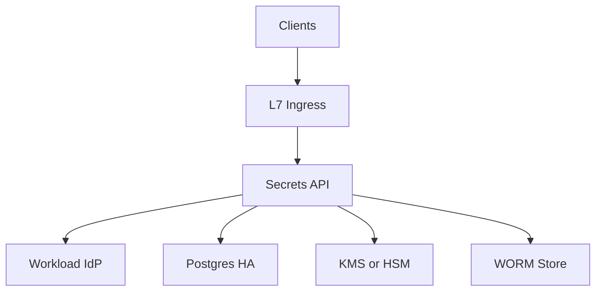
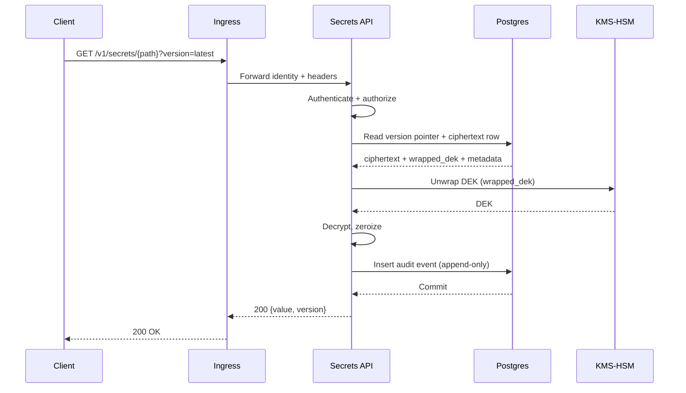
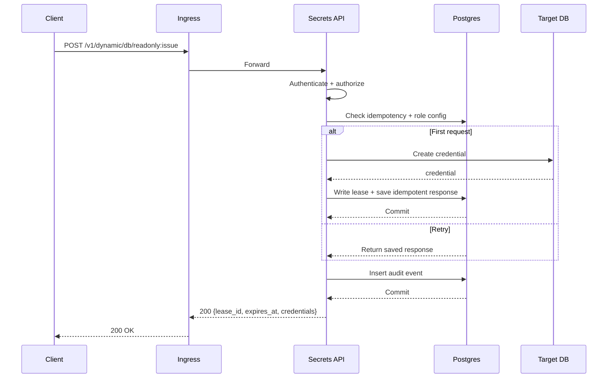

## Overview

A secrets management service (Vault-like) provides a centralized way to store, access, rotate, and audit sensitive material (API keys, DB credentials, certificates, signing keys). The core goals are least-privilege access, safe rotation without downtime, minimal blast radius under compromise, and auditability that stands up to compliance scrutiny.

This design centers on a single stateless Secrets API service backed by a strongly consistent relational store for control-plane and data-plane records, with envelope encryption using HSM/KMS-backed key-encryption keys (KEKs). Audit logs are append-only, tamper-evident, queryable, and continuously archived to WORM storage.

## Requirements

### Functional Requirements
- Store and retrieve **versioned** secrets with fine-grained access control (path/namespace, actions, conditions).
- Rotation: scheduled/on-demand, overlap windows, multiple active versions, rollback.
- Dynamic secrets issued on-demand with leases; renew and revoke.
- Integrate with HSM/KMS for KEK operations (wrap/unwrap, rotate; attestation where available).
- Transit crypto API: encrypt/decrypt/sign/verify without exposing key material to clients.
- Immutable audit logs for access and administrative actions; query and export.
- Auth methods: OIDC/SAML (humans), Kubernetes/workload identity, cloud IAM, mTLS.
- Multi-tenant isolation: namespaces, quotas, per-tenant cryptographic separation, per-tenant audit chains.

### Non-Functional Requirements (Targets)
#### Scale (P0 target, single region)
- Tenants: 10,000
- Identities (human + workload): 200,000
- Peak request rate: 50,000 QPS reads, 2,000 QPS writes/rotations, 8,000 QPS lease operations
- Peak audit event rate: up to 60,000 events/sec

#### Latency (in-region)
- Secret read: P50 10–25ms, P99 80–150ms (HSM unwrap is the dominant dependency)
- Secret write/rotate: P50 50–120ms, P99 250–500ms
- Token validation (local): P99 ≤ 10ms

#### Availability and Semantics
- Read path: 99.99% monthly availability (per region, excluding planned maintenance)
- Admin UI / audit search: 99.9% monthly availability
- Consistency:
  - **Strong** for secret version pointers, lease state, policy versions, idempotency keys
  - **Strong** for audit durability; search is backed by the same store
- Durability:
  - Secrets and metadata: RPO ≤ 5 minutes, RTO ≤ 30 minutes (multi-region DR)
  - Audit:
    - **Standard**: durable on primary commit
    - **Strict**: durable on synchronous replica commit before returning 2xx

### Constraints & Assumptions
- Private network deployment with mTLS between clients and service; optional public exposure through an L7 gateway.
- HSM/KMS throughput is finite and must be treated as a shared, rate-limited dependency.
- Compliance: SOC 2 baseline; optional PCI/HIPAA depending on tenant.
- Team size 6–10 engineers; prioritize operational simplicity and clear correctness.

## Architecture

### High-Level Diagram

### Components

#### Ingress (L7)
- Routes requests, enforces request size limits, and applies coarse-grained rate limits.
- Terminates mTLS (or passes through) and propagates client identity attributes.

#### Secrets API (single service, modular internals)
- Authn: OIDC/SAML, Kubernetes identity, cloud IAM, mTLS.
- Authz: policy evaluation, namespaces, quotas, least privilege enforcement.
- Static secrets: versioning, rotation windows, rollback.
- Dynamic secrets: engines (e.g., DB creds), leases, renew/revoke.
- Transit crypto: encrypt/decrypt/sign/verify APIs.
- Audit: creates tamper-evident records and enforces durability (fail-closed).

#### PostgreSQL (HA)
A single strongly consistent backend for:
- Secrets metadata and version pointers
- Secret version ciphertext records (ciphertext + wrapped DEK + AEAD metadata)
- Policies and policy versions
- Leases and idempotency keys
- Append-only audit events and checkpoint metadata

Operational baseline:
- Primary + synchronous standby across AZs (Strict mode tenants), plus additional async replicas for read scaling.
- `pgbouncer` (or equivalent) for connection pooling.
- Time/tenant partitioning for audit and large tables.

#### HSM/KMS
- Holds per-tenant KEKs used to wrap/unwrap DEKs.
- Optionally holds high-tier transit keys (or signs audit checkpoints).
- Provides rotation primitives and hardware-backed protection where required.

#### WORM Object Store
- Stores periodic signed audit checkpoints and archived audit segments under retention policies (Object Lock / WORM semantics).
- Serves as immutable long-term audit retention and export target.

## Data Model

### Secrets
**Table: `secrets`**
- `(tenant_id, path)` primary key
- `type`: `static | dynamic_engine | transit_key`
- `current_version` (int)
- `state`: `active | deleted`
- `encryption_profile_id` (maps to KEK and tenant crypto rules)
- `labels` (jsonb), `created_at`, `updated_at`, `deleted_at?`

### Secret Versions
**Table: `secret_versions`**
- `(tenant_id, path, version)` primary key
- `state`: `active | deprecated | revoked`
- `not_before`, `not_after`
- `ciphertext` (bytea)
- `wrapped_dek` (bytea)
- `dek_alg` (text), `nonce` (bytea), `aad` (bytea)
- `created_at`, `created_by`

AEAD AAD includes `(tenant_id, path, version)` plus a stable hash of selected metadata to bind context.

### Leases (Dynamic Secrets)
**Table: `leases`**
- `lease_id` primary key
- `tenant_id`, `engine`, `role`, `path`
- `issued_at`, `expires_at`, `renewable`, `max_ttl`
- `subject` (identity reference), `backend_ref` (e.g., DB username)
- `state`: `active | revoked | expired`

### Idempotency
**Table: `idempotency_keys`**
- `(tenant_id, idempotency_key)` primary key
- `request_hash`, `response_json` (jsonb), `expires_at`

### Policies
**Table: `policies`**
- `(tenant_id, policy_name, version)` primary key
- `document` (jsonb), `created_at`, `created_by`
- A “current policy version” pointer stored per policy name.

### Audit (Append-Only + Tamper-Evident)
**Table: `audit_events`** (partitioned by time, optionally sub-partitioned by tenant)
- `event_id` (uuid), `tenant_id`, `timestamp`
- `request_id`, `actor`, `action`, `resource`, `decision`, `status_code`, `latency_ms`
- `canonical_event` (jsonb)
- `prev_hash` (bytea), `event_hash` (bytea)
- `stream_id` (optional; allows multiple independent chains per tenant for high-volume tenants)

**Table: `audit_heads`**
- `(tenant_id, stream_id)` primary key
- `last_event_hash`, `last_seq`

**Table: `audit_checkpoints`**
- `(tenant_id, stream_id, checkpoint_id)` primary key
- `last_seq`, `last_event_hash`, `timestamp`, `signature_ref` (pointer to WORM object)

Hash chaining:
- `event_hash = H(prev_hash || canonical_event_bytes)`, with `prev_hash` sourced from `audit_heads` under row lock.

Checkpointing:
- A background job periodically signs `(tenant_id, stream_id, last_seq, last_event_hash, timestamp)` with an HSM-backed key and writes the signed checkpoint to WORM storage, then records `audit_checkpoints`.

## Core Workflows

### Static Secret Read

### Dynamic Secret Issue (DB Credentials)

## Consistency Model

- `GET ...?version=<n>` returns exactly version `n` if present and allowed; otherwise `404/410`.
- `GET ...?version=latest` is strongly consistent (reads `secrets.current_version` and the corresponding version row in the same store).
- Rotation pointers are monotonic:
  - New version insert is protected by a unique constraint `(tenant_id, path, version)`.
  - Pointer advance uses a single transaction and a conditional update on `current_version`.
- Leases are strongly consistent and idempotent:
  - Renew/revoke operations are monotonic and safe under retries.

## Crypto Design

### Envelope Encryption
- For each secret version:
  - Generate a random DEK (e.g., AES-256-GCM).
  - Encrypt plaintext with DEK + nonce + AAD.
  - Wrap DEK with tenant KEK in HSM/KMS.
  - Store ciphertext + wrapped DEK + AEAD metadata in `secret_versions`.

### Transit Crypto
- Keys are tenant-scoped with policy enforcement.
- High-tier option: keep private keys inside HSM/KMS; otherwise store encrypted key material in Postgres protected by KEK.

### Caching (in-process only)
- JWKS / OIDC metadata cache.
- Policy decision cache (short TTL, e.g., 5–30s).
- Short-lived DEK unwrap cache (1–5s, tenant-configurable; disabled for high-security tenants).

## API Design

### Conventions
- Auth: `Authorization: Bearer <token>`
- Tenant: `X-Tenant-Id: <id>` (or derived from token / mTLS identity)
- Idempotency: `Idempotency-Key: <uuid>`
- Errors:
  - `{ "error": { "code": "...", "message": "...", "request_id": "..." } }`

### Auth
- `POST /v1/auth/oidc/login`
- `POST /v1/auth/k8s/login`

Token strategy:
- Short-lived JWT/PASETO (`exp` ≤ 15 minutes).
- Include `jti` and `policy_version` (or server-side lookup keyed by token id).
- For high-risk actions, require re-auth or step-up checks.

### Static Secrets
- `PUT /v1/secrets/{path}`
- `GET /v1/secrets/{path}?version=latest|<int>`
- `POST /v1/secrets/{path}:rotate`

Rotation semantics:
- `new_value`: creates a new version with new ciphertext + DEK.
- `rekey_only`: rewraps DEKs under a new KEK without changing plaintext.

### Dynamic Secrets (Leases)
- `POST /v1/dynamic/{engine}/{role}:issue`
- `POST /v1/leases/{lease_id}:renew`
- `POST /v1/leases/{lease_id}:revoke` (idempotent)

### Transit
- `POST /v1/transit/{key}:encrypt`
- `POST /v1/transit/{key}:decrypt`
- `POST /v1/transit/{key}:sign`
- `POST /v1/transit/{key}:verify`

## Audit, Retention, and Export

### Audit Durability Modes
- **Standard**: audit event insert commits on primary before returning 2xx.
- **Strict**: audit event insert commits with synchronous replica acknowledgment (per-tenant setting).

### Immutability and Tamper Evidence
- Append-only audit table (no updates; deletes restricted to retention tooling).
- Hash chaining per tenant (and optional `stream_id` sharding).
- Periodic signed checkpoints stored in WORM object storage.
- Background archiver writes sealed, time-partitioned audit segments to WORM (with manifest including first/last hash and sequence).

### Query and Export
- Audit search is served from Postgres (time/tenant partitioned).
- Export is delivered from WORM archives (tenant-scoped, with checkpoint verification support).

## Scaling & Performance

### Primary Bottlenecks
- **HSM/KMS unwrap/sign throughput**
  - Short-lived DEK cache (tenant-configurable).
  - Rate limits and per-tenant budgets.
- **Postgres write amplification for audit + leases**
  - Partitioned tables, batched background maintenance (vacuum/archival), connection pooling.
  - Optional `stream_id` sharding for high-volume audit chains within a tenant.

### Horizontal Scaling
- Secrets API: stateless replicas across AZs.
- Postgres: HA primary/standby + read replicas; partitioning for large tables.
- WORM archiver: separate worker deployment, horizontally scalable.

## Failure Modes & Mitigations

- **HSM/KMS slow/unavailable**: backpressure, per-tenant rate limits, circuit breakers; high-security tenants fail-closed.
- **Postgres failover**: automated failover with strict health checks; Strict-mode tenants rely on synchronous standby.
- **Audit backlog / archive delay**: alerts on checkpoint lag and archival lag; request path remains durable via Postgres commits.
- **Compromised node**: short-lived tokens, least privilege, hardened runtime, no plaintext persistence, rapid credential/key rotation workflows.

## Operations

- Blue/green or canary deploy for Secrets API.
- Schema migrations are backward-compatible; avoid crypto format rollbacks without dual-format support.
- Backups:
  - Postgres base backups + WAL archiving; cross-region copy for DR.
  - WORM retention policies for checkpoints and archives.
- DR:
  - Regular restore drills meeting RPO/RTO targets.
  - Audit continuity validated via checkpoint verification.

## Simplification Notes

- Removed: separate `META` (etcd/Raft) and `BLOB` stores; PostgreSQL stores metadata and ciphertext records with transactional CAS for version pointers and leases.
- Removed: Redis cache; in-process TTL caches cover hot-path identity/policy/DEK lookups without cross-service invalidation.
- Removed: Kafka/Pulsar and a dedicated search index; audit is written durably to PostgreSQL for query and continuously archived with signed checkpoints to WORM storage for immutability and long-term retention.
- Merged: policy engine and audit subsystem into the Secrets API service as internal modules, keeping the external surface area to one service plus managed dependencies.
- Complexity that remains: HSM/KMS-backed envelope encryption and tamper-evident audit chains are retained because they directly enforce key protection, least-privilege guarantees, and compliance-grade auditability.