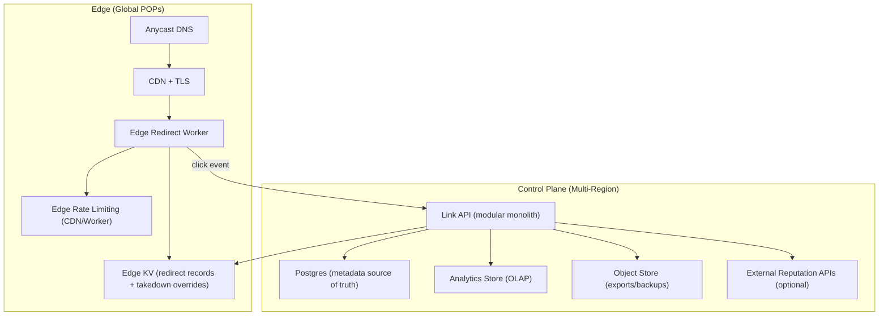
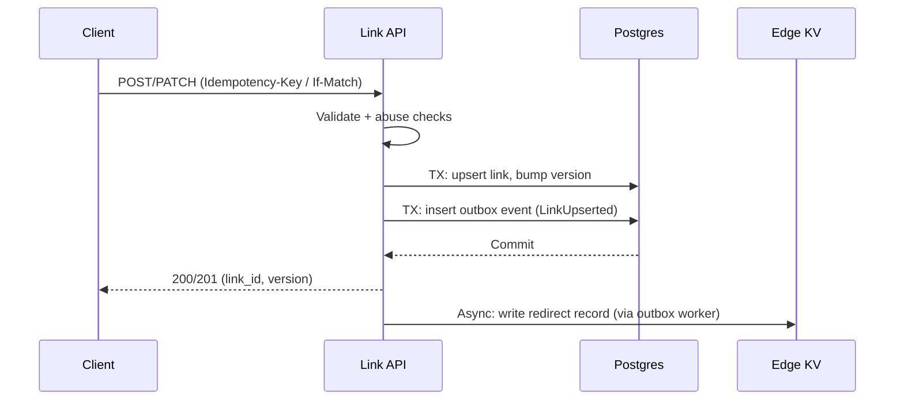
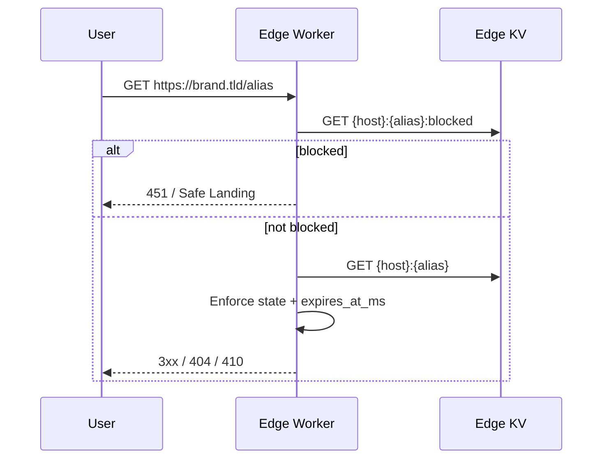
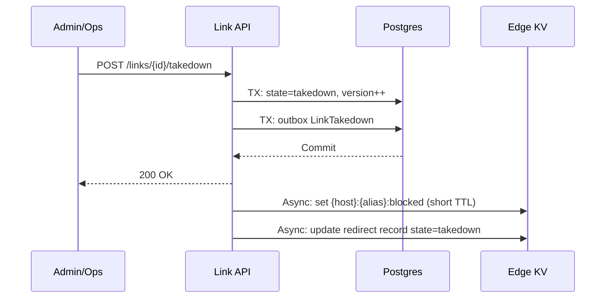

## Overview

This system provides a multi-tenant URL shortener with branded domains, custom aliases, fast global redirects, enforcement of expiration/disable/takedown, abuse controls, and analytics.

The design separates two concerns:

- **Redirect path (read-heavy):** served at the edge for low latency and high availability.
- **Management path (write-heavy):** strongly consistent updates with reliable propagation to the edge.

## Requirements

### Functional Requirements
- Create short links with system-generated codes and user-provided custom aliases.
- Redirect support for 301/302/307/308; optional query preservation; optional UTM appends.
- Link management: retrieve/update destination, enable/disable/takedown, rotate destination, tags/notes.
- Branded domains: map hostname → tenant; alias namespaces per domain.
- Abuse prevention: create-time checks; redirect-time allow/block/challenge; rate limiting; takedown workflows.
- Analytics: click events and aggregated reporting/export APIs.
- Bulk operations: batch create/update/disable; import/export.

### Non-Functional Targets
- Redirects: 5–10B/day globally, ~300k QPS peak.
- Writes: 1k QPS avg, 5k QPS peak.
- Redirect lookup at POP: P50 < 10ms, P99 < 40ms (excluding last-mile).
- Availability: redirects 99.99%, management APIs 99.9%.
- Consistency: strong for alias reservation/updates; eventual for edge propagation and analytics.
- Aggressive enforcement: disabled/expired/takedown converge globally within minutes; takedown target < 60s.

---

## Simplified Architecture

### Key Invariants
- Redirects are served from the **edge** using a single **edge KV** read model.
- Alias uniqueness and link state changes are **strongly consistent** in Postgres.
- Edge KV records include `state`, `expires_at`, and `version` so edge can enforce correctness independently of cache TTL.

---

## Merged Components

- **Link API (single service):** auth, tenants/domains/links, abuse policy, bulk jobs, propagation worker, analytics APIs.
- **Propagation as an internal worker:** a background loop in the Link API uses a Postgres outbox to push changes to edge KV and keep it converged.
- **Analytics ingestion as an API endpoint:** the edge worker posts lightweight click events to the Link API, which batches into OLAP.

---

## Removed Dependencies

- **No external event bus required:** propagation uses a Postgres outbox table and a background worker.
- **No separate “materializer” service:** KV updates are performed by the Link API worker.
- **No dedicated cache cluster required:** redirect lookups use edge KV; control-plane caching is handled with small in-process caches and TTL tables in Postgres.

---

## Justified Complexity

- **Edge execution + edge KV** is required to meet global redirect latency and availability targets at very high QPS.
- **Postgres as source of truth** is required for correctness under contention (custom aliases, branded domains) and auditability.
- **Outbox-based propagation** is required for reliable, replayable convergence from strong writes to an eventually consistent edge read model.
- **An OLAP store** is required to query billions/day of events efficiently without impacting redirect latency.

---

## Components

### Edge Redirect Worker
**Responsibilities**
- Parse `{hostname, alias}` and apply rate limiting.
- Read a **takedown override key** first for fast enforcement.
- Fetch redirect record from edge KV and enforce `state` and `expires_at` on every request.
- Emit click events asynchronously (best-effort) to the analytics ingest endpoint.

**Redirect outcomes**
- `3xx` for active links.
- `404` for unknown aliases (optionally used to reduce enumeration signals).
- `410` for expired links (optional policy).
- `451` (or a safe landing page) for takedown/blocked.

**Fast takedown**
- Edge KV stores a small override key per `{hostname, alias}` (e.g., `blocked_until_ms`) with short TTL; the Link API refreshes it while a takedown is active.

### Link API (Modular Monolith)
**Responsibilities**
- Create/update/disable/takedown links; manage domains and tenants.
- Enforce alias uniqueness and optimistic concurrency (`version`).
- Run create-time abuse checks (normalization, allow/deny lists, reputation checks).
- Maintain an outbox to propagate redirect records and takedowns to edge KV.
- Provide bulk job endpoints and export APIs.
- Ingest click events and write rollups to OLAP.

**Concurrency**
- Alias uniqueness: Postgres unique constraint on `(domain_id, alias)`.
- Updates: `If-Match` / `version` optimistic concurrency to prevent lost updates.
- Idempotency: store `(tenant_id, key) -> response` for safe retries.

---

## Data Model

### Postgres (Source of Truth)

**`tenants`**
- `tenant_id (pk)`, `name`, `plan`, `created_at`

**`domains`**
- `domain_id (pk)`, `tenant_id (fk)`, `hostname (unique)`, `status`, `created_at`

**`links`**
- `link_id (pk, ULID/UUIDv7)`, `tenant_id (fk)`, `domain_id (fk)`
- `alias (varchar)`, `destination_url (text)`
- `http_status (int)`, `preserve_query (bool)`, `utm_append (jsonb, nullable)`
- `state (enum: active|disabled|expired|takedown)`
- `expires_at (timestamp, nullable)`
- `version (bigint)`, `created_at`, `updated_at`
- Indexes:
  - Unique: `(domain_id, alias)`
  - Ops: `(tenant_id, created_at)`, `(tenant_id, state)`

**`alias_tombstones`**
- `(domain_id, alias)` unique, `tombstone_until`, `reason`
- Prevents immediate alias reuse after deletion/expiry per policy.

**`abuse_verdicts`** (optional but practical)
- `subject_type`, `subject_key`, `verdict (allow|block|challenge)`, `reason`, `source`, `confidence`, `expires_at`
- Used for both create-time and operational rescans.

**`idempotency_keys`**
- `(tenant_id, key)` unique, `request_hash`, `response_blob`, `created_at`, `expires_at`

**`outbox_events`**
- `event_id (pk)`, `event_type`, `aggregate_key` (e.g., `{hostname}:{alias}`), `payload (jsonb)`, `created_at`, `processed_at (nullable)`
- Drives reliable propagation to edge KV and takedown overrides.

**`bulk_jobs` / `bulk_job_items`** (optional)
- Tracks async batch operations and per-item results.

### Edge KV Record (Redirect Read Model)
- Key: `{hostname}:{alias}`
- Value:
  - `link_id`, `tenant_id`
  - `destination_url`, `http_status`
  - `preserve_query`, `utm_append`, `safe_landing_mode`
  - `state`, `expires_at_ms`, `version`

### Edge KV Takedown Override
- Key: `{hostname}:{alias}:blocked`
- Value: `{blocked_until_ms, reason_code}`
- Short TTL; refreshed while takedown is active for fast global convergence.

---

## Data Flows

### Create/Update Link (Strong + Propagate)

### Redirect (Edge Only)

### Takedown (Fast Path)

---

## API Design (Minimal)

### Create Link
- `POST /v1/links` with `Idempotency-Key`
- Returns `link_id`, `short_url`, `version`, `state`, `expires_at`

### Update Link
- `PATCH /v1/links/{link_id}` with `If-Match: "<version>"`
- Returns updated `version`

### Takedown / Disable / Enable
- `POST /v1/links/{link_id}/takedown`
- `POST /v1/links/{link_id}/disable`
- `POST /v1/links/{link_id}/enable`

### Resolve (Debug)
- `GET /v1/resolve/{domain}/{alias}`
- Returns the canonical redirect record from Postgres plus current propagated version (useful for troubleshooting).

### Bulk
- `POST /v1/bulk/links` → `job_id`
- `GET /v1/bulk/jobs/{job_id}`

### Analytics (Aggregated)
- `GET /v1/analytics/links/{link_id}?from=...&to=...&granularity=hour`

---

## Scaling & Performance

- **Redirects:** edge worker + edge KV keeps latency low and avoids centralized hot paths.
- **Hot keys (viral links):** edge KV and POP-local caching absorb bursts; rate limiting reduces abuse amplification.
- **Propagation:** outbox worker runs continuously; takedown events are prioritized and set the override key first.
- **Analytics ingestion:** edge posts small events; the Link API batches inserts and rollups to OLAP to keep per-event overhead low.
- **Expiration churn:** edge KV records use TTL aligned to `expires_at` while still enforcing `expires_at_ms` at read time.

---

## Failure Modes & Mitigations

- **Edge KV degraded/unavailable:** edge worker serves stale POP cache where available; otherwise returns a safe error response. Redirect correctness is still enforced via `state`/`expires_at_ms` when cached.
- **Postgres outage:** management APIs fail closed; redirects continue from edge KV.
- **Propagation lag:** metrics track outbox backlog age; takedown uses a dedicated override key with short TTL and prioritized processing.
- **Abuse spikes/enumeration:** edge rate limits, negative caching for not-found, and tenant/domain throttles on management endpoints.

---

## Operations & Security

- **Observability:** redirect latency/codes by POP; edge KV hit/miss; outbox backlog age; management error rates; takedown time-to-effect; analytics ingestion lag.
- **Privacy:** hash/truncate IPs; minimize raw UA storage; retention controls by tenant/plan.
- **Safety:** strict URL validation (scheme allowlist, punycode normalization); audit log for privileged actions; least-privilege credentials for edge KV writes from the Link API.

---

## Simplification Notes

- Removed: `Kafka/PubSub` event bus; propagation uses `outbox_events` in Postgres for reliable replay and operational simplicity.
- Removed: separate `Abuse & Policy Service`, `Bulk/Async Jobs` service, and `KV materializer`; consolidated into the single `Link API` codebase with background workers.
- Removed: dedicated `Redis/Memcache` layer; edge KV is the redirect read model, and control-plane caching uses TTL tables and small in-process caches.
- Merged: click collection into the `Link API` as an ingest endpoint; batching handles throughput while keeping redirect latency isolated at the edge.
- Complexity that remains: edge execution + edge KV (global latency/availability), Postgres constraints/versioning (correctness under contention), outbox propagation (convergence), OLAP analytics store (billions/day queryability).
