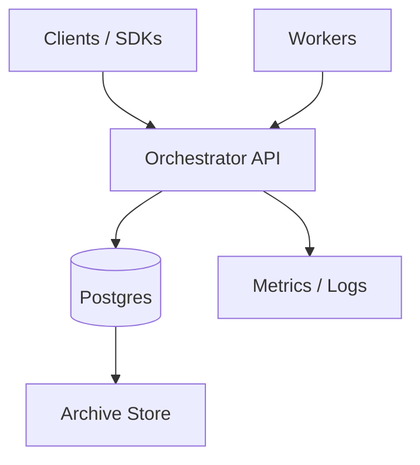

## Overview

A workflow orchestration engine coordinates long-running, multi-step processes across unreliable services and worker fleets while preserving correctness under retries, crashes, deployments, and partial outages. Workflows can run for minutes to weeks and require durable progress, deterministic execution, and recoverable state.

This design models each workflow execution as a deterministic state machine driven by an append-only event history. Every state transition is recorded as an immutable event, and a compact mutable execution row is maintained for fast reads and routing.

“Exactly-once” state transitions (within the engine) come from:
- At-least-once task delivery to workers (duplicates are allowed),
- Idempotent completion using attempt/task tokens, and
- Atomic conditional updates (optimistic concurrency) so only one completion commits.

External side effects still require idempotency keys or compensating actions in user systems.

---

## Requirements

### Functional Requirements
- Start, signal, query, cancel, terminate workflow executions.
- Durable, resumable executions lasting days/weeks.
- Primitives: workflow tasks (deterministic decisions), activities (external work), timers (sleep/retry/cron), child workflows.
- Retries with backoff and max attempts.
- Task queues with worker polling, routing by namespace and queue; optional partitions/priority.
- Versioned workflow code with deterministic replay safeguards.
- Visibility for operations: list/search executions, status, history export/archival, metrics per namespace/queue.
- Multi-tenancy: namespaces, quotas, authn/authz, isolation controls.

### Non-Functional Requirements
- Per-execution linearizability for history and mutable state.
- At-least-once task delivery; exactly-once commit via conditional writes.
- Visibility can be eventually consistent relative to the latest commit.
- High availability for write path and dispatch; durability with no history loss.

---

## Simplified Architecture

A single stateless service handles API, execution state transitions, task dispatch, and timers. One primary database stores history, mutable state, task leases, and timers.

- The Orchestrator is the only correctness gate: all commits go through one transactional path.
- Postgres is the source of truth for history, execution state, tasks, and timers.
- Archive storage is used for long-term retention of history beyond the primary database window.

---

## Components

### Orchestrator API (Single Service)
**Responsibilities**
- Control-plane endpoints: start/signal/query/cancel/terminate.
- Worker endpoints: poll tasks, heartbeat/extend leases, complete workflow tasks and activities.
- Execution core: append history events, update mutable state, schedule tasks, fire timers.
- Multi-tenancy: authn/authz, quotas, per-namespace limits, audit logging.

**Key properties**
- Stateless and horizontally scalable; relies on database transactions for correctness.
- Routes by `(namespace_id, workflow_id)` for stable locality and predictable contention.
- Implements backpressure: protects commit path first, sheds or de-prioritizes expensive queries when needed.

---

### Worker SDK (Data Plane)
**Responsibilities**
- Deterministic workflow API surface (timers, activities, signals).
- Replays history to make decisions; produces “commands” for the next state transition.
- Versioning controls to manage deterministic upgrades.
- Activity helpers: heartbeats, cancellation, idempotency keys.

**Execution model**
- Workflow code is replayed from recorded history; time and randomness come from events, not system calls.
- Activities encapsulate side effects; workflow logic remains deterministic relative to history.

---

### Postgres (Single Source of Truth)
**Stores**
- Append-only history events.
- Mutable execution state (current status, next event id, searchable attributes).
- Durable tasks with leases (workflow tasks and activity tasks).
- Durable timers for sleep/retry/cron.

**Why it works**
- Transactions provide atomic “append events + update state + schedule tasks” commits.
- Conditional updates provide per-execution linearizability without distributed coordination.

---

## Data Model

### Core Tables (Relational)

**`namespaces`**
- `namespace_id (pk)`, `name (unique)`, `config_json`, `quotas_json`, `created_at`

**`workflow_executions`** (mutable state, one row per run)
- `namespace_id`, `execution_id (pk)`, `workflow_id`, `run_id`
- `state` (RUNNING|COMPLETED|FAILED|CANCELED|TERMINATED)
- `state_version` (monotonic), `next_event_id` (monotonic)
- `task_queue`, `search_attrs` (jsonb), `started_at`, `updated_at`, `closed_at`
- Unique policy support (example): `(namespace_id, workflow_id)` where `state = RUNNING`

**`workflow_history_events`** (append-only)
- `namespace_id`, `execution_id`, `event_id`
- `event_type`, `event_time`, `payload` (bytes, compressed)
- PK: `(namespace_id, execution_id, event_id)`

**`tasks`** (workflow + activity tasks)
- `task_id (pk)`
- `namespace_id`, `execution_id`, `task_type` (WORKFLOW|ACTIVITY)
- For workflow tasks: `scheduled_event_id`
- For activity tasks: `activity_id`, `attempt`
- `queue`, `partition`, `priority`
- `status` (READY|LEASED|COMPLETED|CANCELED)
- `lease_owner`, `lease_expires_at`
- Uniques for dedupe:
  - Workflow: `(namespace_id, execution_id, scheduled_event_id)`
  - Activity: `(namespace_id, execution_id, activity_id, attempt)`

**`timers`**
- `timer_id (pk)`, `namespace_id`, `execution_id`
- `fire_at`, `timer_type` (SLEEP|RETRY|CRON), `status` (PENDING|FIRED|CANCELED)
- Index: `(fire_at, status)` for due scans

**`request_dedup`** (client idempotency + signal dedupe)
- `namespace_id`, `scope` (START|SIGNAL|CANCEL|TERMINATE|COMPLETE)
- `key`, `response_blob`, `expires_at`
- PK: `(namespace_id, scope, key)`

### Correctness Invariants
- History is append-only; `event_id` is strictly increasing per execution.
- Mutable state updates require expected `state_version`.
- A completion commit is accepted only for the currently leased task attempt (validated by token + task row + state).

---

## Core Flows

### Start → Workflow Task → Activity → Completion

1. **StartWorkflow**
   - Transaction:
     - Insert `workflow_executions` (or load existing per reuse policy)
     - Append `WorkflowStarted`
     - Create initial WORKFLOW task in `tasks` (READY)
     - Commit

2. **PollTask (long poll)**
   - Select a READY task by `(namespace, queue, partition, priority)` using `FOR UPDATE SKIP LOCKED`
   - Mark it LEASED with `lease_owner` and `lease_expires_at`
   - Return a signed `completion_token` containing `(task_id, execution_id, task_type, attempt fields, state_version, expiry)`

3. **CompleteWorkflowTask**
   - Transaction (conditional):
     - Validate token and load leased task row (must match owner and be unexpired)
     - Validate `workflow_executions.state_version == expected`
     - Append events for emitted commands (schedule activities/timers, signals processed, complete workflow, etc.)
     - Update `workflow_executions` (bump `state_version`, `next_event_id`, state fields)
     - Insert READY tasks/timers derived from commands (deduped by unique constraints)
     - Mark task COMPLETED
     - Commit

4. **CompleteActivity**
   - Same pattern as workflow completion:
     - Validate leased activity task attempt
     - Append `ActivityCompleted` (or `ActivityFailed`)
     - Update mutable state and schedule next WORKFLOW task
     - Commit

### Timers
- A background loop in the Orchestrator periodically selects due timers (`fire_at <= now`, `PENDING`) with `FOR UPDATE SKIP LOCKED`, marks them FIRED, appends `TimerFired`, and schedules the next WORKFLOW task. Duplicate firing attempts become no-ops through conditional state updates and unique constraints.

---

## API Design (Minimal)

- `POST /v1/namespaces/{namespace}/workflows:start`
- `POST /v1/namespaces/{namespace}/workflows/{workflow_id}/signals/{signal}`
- `POST /v1/namespaces/{namespace}/workflows/{workflow_id}:query`
- `POST /v1/namespaces/{namespace}/task-queues/{queue}:poll` (long poll)
- `POST /v1/tasks:heartbeat` (extend lease)
- `POST /v1/workflow-tasks:complete`
- `POST /v1/activity-tasks:complete`

Semantics:
- Client idempotency via `request_dedup` keyed by `(namespace, scope, idempotency_key)`.
- Worker completion returns:
  - `200` committed
  - `409` already completed / attempt mismatch (safe to ignore)
  - `410` canceled/expired token (stop work)

---

## Visibility & Operations

Visibility is served from `workflow_executions` and related indexed columns:
- List by namespace, state, workflow type, time ranges
- Filter by JSONB `search_attrs` (GIN index) for common tags/fields
- History export reads `workflow_history_events` (paged)

This keeps operational queries available without affecting correctness commits; expensive queries can be rate-limited or routed to read replicas.

---

## Scaling & Availability

- **Orchestrator**: stateless replicas behind a load balancer; scale by adding instances.
- **Postgres**: HA with synchronous replication for RPO=0 within a region; read replicas for query-heavy visibility.
- **Partitioning**:
  - Range partition `workflow_history_events` and `workflow_executions` by time or by hashed execution id.
  - Index for append efficiency and per-execution reads.
- **Hot executions**: serialize per-execution commits via `state_version` conflicts; client/workers retry with backoff.
- **Task throughput**: scale by adding queue partitions and polling workers; keep leases short with heartbeats for long work.
- **Retention**: retain hot history in Postgres (e.g., 7–30 days) and archive older history to object storage; restore on-demand for audits.

---

## Security & Multi-Tenancy

- Authn: OIDC/JWT for clients; mTLS or signed worker tokens for worker calls.
- Authz: per-namespace roles (admin/operator/worker/client).
- Quotas: starts/sec, signals/sec, concurrent tasks, history bytes/day, query QPS.
- Isolation: `namespace_id` on every row; optional row-level security; encryption-at-rest and KMS-integrated secrets.
- Audit logs: immutable record of control-plane operations and configuration changes.

---

## Simplification Notes

- **Merged**
  - API Service + History Service + Matching + Timer Service → `Orchestrator API`: one transactional commit path simplifies correctness and deployment; internal modules handle API, execution core, dispatch, and timers.
- **Removed**
  - Separate task-queue system and in-memory matchers: durable tasks and leases live in `tasks` with database locking for safe at-least-once delivery.
  - Outbox/CDC and separate visibility ingest: visibility reads come from `workflow_executions` and indexed attributes, keeping operational search simple and consistent with the primary store.
  - Dedicated search/analytics stores (OpenSearch/ClickHouse): initial visibility needs are met with relational indexes and JSONB fields; advanced analytics can be layered later.
  - Dedicated cache layer: correctness and dispatch rely on transactional state; targeted in-process caching is sufficient for configuration and shard maps.
- **Complexity That Remains (Necessary)**
  - Event-sourced history + determinism: required for replay, durable progress, and safe upgrades of long-running workflows.
  - Tokens, leases, and conditional commits: required to tolerate retries and duplicate delivery while preventing double-commit.
  - Durable timers: required for long waits and retry schedules across crashes and deployments.