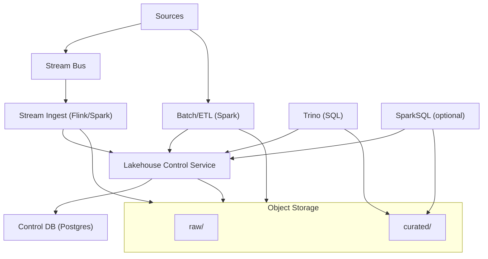

## Overview

This design delivers a **governed lakehouse on cloud object storage** with **warehouse-like correctness** (ACID tables, schema evolution, time travel, incremental reads) while keeping the platform operationally small enough for a 6–10 engineer team.

The core idea is simple:
- **Object storage** holds immutable data files.
- An **Iceberg-compatible transactional catalog** is the source of truth for current table state and commit concurrency.
- A single **control service** provides catalog APIs, governance APIs, and maintenance scheduling.
- **Trino** serves interactive SQL with centralized authorization, and **Spark/Flink** handle batch/stream ingestion plus optimization jobs.

Iceberg is the default table format; **Hudi** is supported for a small set of CDC/upsert-heavy datasets that benefit from its incremental timeline model.

---

## Requirements

### Functional
- Batch + streaming ingestion into object storage, publishing curated tables (Iceberg, and Hudi where needed).
- Table-level ACID semantics, schema/partition evolution, time travel, and incremental reads.
- Automated maintenance: compaction/clustering, snapshot retention, orphan file cleanup.
- Multi-engine access with consistent semantics: writers (Spark/Flink), readers (Trino/SparkSQL).
- Central governance: dataset ownership, classification/PII tags, row/column policies where required, audit logs, lineage hooks.
- Lifecycle management: zone retention, snapshot expiration, orphan cleanup, GDPR delete workflows.
- APIs for discovery and metadata: datasets, schemas, ownership, policies, operational state.

### Non-functional (targets)
- Ingestion: sustained 5k events/sec, peak 50k events/sec.
- Storage: 5–20 PB over 3 years; up to 20k tables.
- Concurrency: up to 2k concurrent query users.
- Latency: ingest→curated P50 2 min / P99 10 min; catalog reads P99 < 200 ms; policy decisions P99 < 50 ms (excluding IdP).
- Availability: control plane 99.95%; ingestion/maintenance 99.9%.
- Durability: object storage durability; catalog DB PITR + multi-AZ (**RPO ≤ 15 min**, **RTO ≤ 2 hrs**).
- Consistency: strong consistency for table commits and “current snapshot” reads via catalog; eventual for discovery/lineage enrichment.

---

## Simplified Architecture

---

## Components

### 1) Object Storage (data plane)
**What it does**
- Stores `raw/` and `curated/` data files (Parquet/ORC) and table metadata artifacts.

**Practices**
- Bucket/prefix separation for `raw/` vs `curated/` to apply distinct IAM, retention, and monitoring.
- Encryption with KMS keys; lifecycle policies per zone.
- Correctness never relies on object listing; readers use Iceberg/Hudi metadata obtained via the catalog APIs.

---

### 2) Table formats (Iceberg default, Hudi by exception)
**Iceberg (default)**
- ACID, schema/partition evolution, time travel, snapshot-based incremental reads.
- Broad interoperability across Spark, Flink, Trino.

**Hudi (targeted use)**
- Selected for CDC/upsert-heavy datasets needing Hudi’s incremental timeline consumption patterns.

**File/layout targets**
- Parquet + ZSTD; **256–512 MB** target file size.
- Partition primarily by time (`dt` or `event_hour`), with clustering/sorting for selective queries.
- Enforced small-file budget per hot partition (alerts on file count and average file size).

---

### 3) Lakehouse Control Service (catalog + governance + maintenance API)
A single, stateless service that exposes:
- **Catalog APIs** (Iceberg REST Catalog; and Hudi table registry metadata where applicable).
- **Governance APIs** (datasets, ownership, classification tags, policies).
- **Maintenance APIs** (optimize requests, retention, cleanup) and a small scheduler/runner interface.

**Storage**
- **Postgres** as the control database:
  - authoritative dataset registry, policy definitions, job state, audit pointers,
  - HA multi-AZ with PITR to meet RPO/RTO targets.

**Performance**
- Hot-path metadata (current snapshot pointer + schema + partition spec) cached in-process with short TTL (30–120s) and bounded staleness.
- Policy evaluation uses compiled rules + cache keyed by `(principal, dataset, query-shape)` to hit the P99 target.

---

### 4) Query plane (Trino + optional SparkSQL)
**Trino (primary interactive engine)**
- Handles BI/ad-hoc/scheduled queries with resource groups/queues.
- Enforces row/column policies centrally via Trino access control and masking/row-filter capabilities driven by the Control Service.

**SparkSQL (optional)**
- Used for power users and large analytical jobs; reads via the same catalog.
- Governance enforcement for user-facing reads is either:
  - enforced by running user SQL through Trino, or
  - enforced by a shared policy evaluation library in Spark plus controlled distribution of credentials.

---

### 5) Ingestion (batch + streaming)
**Batch ingestion (Spark)**
- Periodic ELT/backfills write data files then **atomically publish** via catalog commit.
- Idempotency via job run IDs and deterministic output paths; retries are safe.

**Streaming ingestion (Flink or Spark Structured Streaming)**
- Consumes from a managed stream bus, writes micro-batches to object storage, then commits.
- Checkpoints stored in durable state (object storage or managed backend), aligned with the engine’s exactly-once model and commit idempotency.

**Writer policy**
- One logical writer per hot table to minimize commit conflicts; backfills scheduled in windows or isolated (clone/branch where supported).

---

### 6) Maintenance (optimization + retention + GDPR delete)
**Execution**
- Spark jobs triggered on schedule (per table/class) and on-demand via the Maintenance API.

**Iceberg maintenance**
- `rewriteDataFiles` (compaction/clustering), `rewriteManifests`, `expireSnapshots`, `removeOrphanFiles`.

**Hudi maintenance**
- Compaction/clustering schedules with controls on log growth and rewrite budgets.

**Controls**
- Per-table rewrite budgets and concurrency limits to prevent object-store throttling and cost runaway.

---

## Data Model (Control DB)

Minimal relational schema in Postgres:

- `datasets(dataset_id, name, owner_team, zone, format, location, created_at, updated_at)`
- `schema_versions(dataset_id, version, schema_json, effective_at)`
- `policies(policy_id, dataset_id, type, definition_json, version, updated_by, updated_at)`
- `maintenance_config(dataset_id, target_file_size_mb, compaction_sla_minutes, daily_rewrite_budget_gb, retention_days, updated_at)`
- `audit_events(event_id, ts, actor, action, dataset_id, details_json)` (append-only)
- `jobs(job_id, type, dataset_id, params_json, status, created_at, updated_at)`

Lineage is captured as lightweight events (OpenLineage-compatible payloads) stored in `audit_events` and optionally exported to a dedicated lineage system later.

---

## Data Flows

### Write → Publish (atomic commit)
1. Ingest job validates schema contract and dataset ownership (Control Service).
2. Job writes data files under `curated/` (or temporary paths) in object storage.
3. Job calls catalog commit (`POST /tables/{name}/commit`) with optimistic concurrency.
4. On conflict (`409`), job refreshes table state and retries with bounded backoff/jitter.

### Read (governed)
1. Query engine authenticates user (OIDC/SAML).
2. Query engine requests authorization and row/column rules from Control Service.
3. Query engine reads current table metadata via catalog, then reads data files from object storage.

---

## API Surface (single Control Service)

**Catalog**
- `POST /v1/tables` (create/register)
- `GET /v1/tables/{name}` (hot-path metadata)
- `POST /v1/tables/{name}/commit` (engine commits; conflict via `409`)
- `GET /v1/tables?prefix=...`

**Governance**
- `POST /v1/datasets` / `GET /v1/datasets/{name}`
- `POST /v1/policies` / `GET /v1/policies?dataset=...`
- `GET /v1/audit?dataset=...&from=...&to=...`

**Maintenance**
- `POST /v1/maintenance/optimize` (table/partition-scoped)
- `POST /v1/maintenance/expire-snapshots`
- `POST /v1/maintenance/remove-orphans`
- `POST /v1/gdpr/delete-subject` (tracked workflow + verification)

All write endpoints accept `Idempotency-Key`.

---

## Scaling & Operations

- **Compute separation**: distinct pools for BI/interactive (Trino) vs ingestion/maintenance (Spark/Flink).
- **Concurrency control**: Trino resource groups, query limits, and per-workload queues.
- **Catalog DB**: multi-AZ Postgres, tuned connection pooling, read replicas if needed for metadata-heavy workloads.
- **Object storage protection**: request shaping (engine settings), rewrite budgets, and off-peak maintenance windows.
- **Core monitoring**:
  - catalog commit latency + conflict rate, Postgres health, API P99 latencies,
  - object storage 4xx/5xx + throttling, bytes read/write, request rates,
  - table health: file counts, avg file size, manifests, snapshots,
  - query: queued time, P95/P99 latency per group, spill metrics,
  - governance: policy evaluation latency, deny rates, audit ingestion lag.

---

## Failure Modes & Mitigations

1) **Object storage elevated errors**
- Backoff/jitter, prioritize curated reads, pause maintenance first, protect hot datasets with stricter concurrency caps.

2) **Control DB or Control Service outage**
- No commits; queries may fail when metadata can’t be fetched.
- Multi-AZ failover + PITR; short-lived metadata caching for reads with explicit staleness limits; clear read-only mode for tooling.

3) **Commit conflicts on hot tables**
- Enforced single-writer policy for streaming; isolate backfills; bounded retries with jitter; shard by time/tenant only when conflict metrics justify it.

4) **Governance policy mistakes**
- Versioned policies with approvals; automated “golden query” checks for sensitive datasets; rapid rollback; break-glass role with strict audit.

---

## Simplification Notes

- **Removed**: Separate API gateway, query gateway, search index cluster, dedicated work queue, and standalone workflow orchestrator; a single `Lakehouse Control Service` + Postgres covers catalog/governance/maintenance coordination with scheduled jobs and APIs.
- **Merged**: Catalog and governance into one control plane service to keep authorization, metadata, and maintenance state consistent and fast on the hot path.
- **Reduced dependencies**: No external metadata search system by default; dataset discovery and filtering come from Postgres queries and lightweight indexing.
- **Complexity kept (necessary)**: Transactional catalog semantics (for correctness on object storage), strong HA for the control DB (RPO/RTO), and asynchronous optimization (to meet ingest latency and control rewrite cost at PB scale).