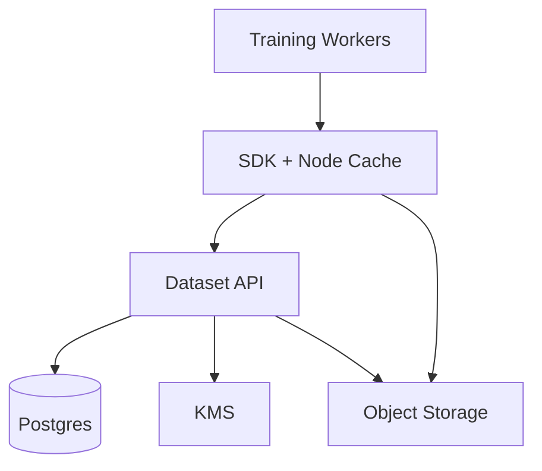
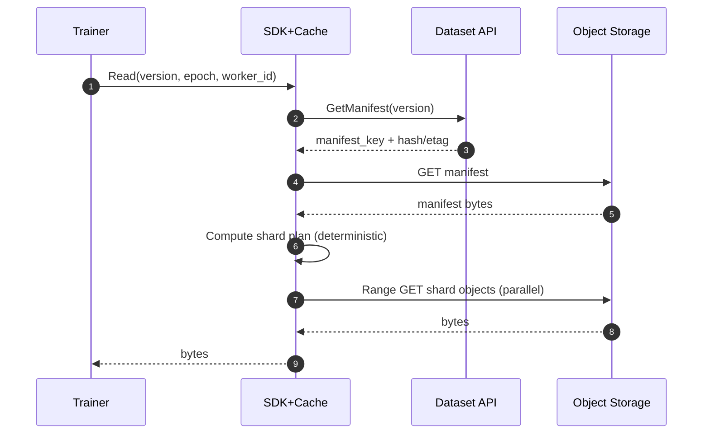

## Overview

This system stores **immutable training shards as objects** and uses **versioned manifests** to make training runs deterministic, auditable, and fast under extreme fan-out.

Core ideas:
- **Objects are immutable** (typically packed shards like WebDataset tar / TFRecord / Parquet files).
- **A dataset version is a committed snapshot** that points to a manifest object and never changes.
- **Reads go directly to object storage** with HTTP range reads; the SDK optimizes throughput and tail latency.
- **Node-local caching** (NVMe/RAM) absorbs repeat epoch reads without requiring invalidation.

---

## Requirements

### Functional
- Versioned datasets with atomic `CommitVersion`
- High-throughput parallel reads with byte-range access
- Efficient listing/shuffling via manifests (no hot metadata scans)
- Multipart ingest + commit
- Multi-tenant isolation: authz, quotas/rate limits, tenant encryption keys, audit logs
- Deterministic shard plans and prefetch hints
- Retention and lifecycle policies; operational visibility

### Non-Functional (Targets)
- Reads: 99.99% availability
- Writes/commit: 99.9% availability
- Strong consistency for version commits and reading committed manifests
- Durability delegated to object storage (target ≥ 11 nines equivalent)

---

## Simplified Architecture

**Roles**
- **Object Storage**: immutable shard objects + manifest objects, range reads, multipart uploads, high durability.
- **Dataset API**: dataset/version metadata, commit atomicity, authz/quotas, audit.
- **Postgres**: strongly consistent metadata store and audit log.
- **SDK + Node Cache**: parallel range reads, retries/hedging, checksum validation, and local caching.

---

## Components

### 1) Dataset API (single stateless service)
**Responsibilities**
- Tenant/dataset/version management
- Atomic `CommitVersion` (the consistency boundary)
- AuthZ enforcement and quota/rate limiting decisions
- Audit log writes
- Issuing upload parameters and (optionally) presigned URLs

**Implementation**
- Stateless replicas behind a load balancer
- Postgres transactions for commit linearizability
- KMS for per-tenant encryption key references (used for object storage SSE-KMS or envelope keys)

### 2) Postgres (HA)
**Responsibilities**
- Store dataset/version metadata and shard registrations
- Provide strongly consistent commit semantics
- Store audit events (append-only)

**Operational posture**
- Managed Postgres or Patroni-style HA with a synchronous replica for commit durability
- Read replicas can serve read-mostly API calls (e.g., listing versions), while commits stay on primary

### 3) Object Storage (S3/GCS/MinIO or equivalent)
**Responsibilities**
- Multipart upload for large shards and manifests
- Range reads at scale
- Durable storage and replication/erasure coding (provided by the object store)

**Layout**
- `s3://bucket/tenant/{tenant_id}/dataset/{dataset_id}/version/{version_id}/shards/...`
- `s3://bucket/tenant/{tenant_id}/dataset/{dataset_id}/version/{version_id}/manifest.jsonl.zst` (or Parquet)

### 4) SDK + Node Cache
**Responsibilities**
- Download manifest once, compute deterministic shard assignment per worker/epoch
- Execute parallel range reads with backpressure and retry budgets
- Validate integrity (ETag/sha256 and optional per-segment checksums when formats support it)
- Maintain a node-local cache directory (NVMe preferred) keyed by `(version_id, object_key, range_hash)`

**Controls**
- Per-host concurrency caps, bandwidth shaping, and connection pooling
- Optional hedged reads (second attempt after a small delay) when tail latency spikes

---

## Workflows

### Read Path (manifest → direct range reads)

### Ingest + Commit (register shards → commit version)
1. `StartVersion(dataset_id)` creates a staging version.
2. Client uploads shard objects (multipart) to the version’s staging prefix.
3. Client calls `RegisterObject(...)` per shard with key, size, and hash/etag.
4. Client uploads the manifest object.
5. `CommitVersion(version_id, manifest_key, expected_counts, manifest_hash)` runs a single Postgres transaction:
   - Validates version is `STAGING`
   - Validates manifest hash and that referenced shard keys match registered objects
   - Marks version `COMMITTED` with `committed_at`
   - Writes an audit event

Committed versions are immutable and safe for massive fan-out.

---

## Data Model (minimal, commit-focused)

### Tables (conceptual)
- `tenants(tenant_id, kms_key_ref, quotas..., created_at)`
- `datasets(dataset_id, tenant_id, name, created_at)`
- `dataset_versions(version_id, dataset_id, status, created_at, committed_at, manifest_key, manifest_hash)`
- `objects(object_id, version_id, object_key, size_bytes, content_hash, etag, created_at)`
- `audit_events(event_id, tenant_id, principal, action, resource, at, request_id, metadata_json)`

### Invariants
- Only `STAGING` versions accept new `objects`.
- `COMMITTED` versions never change.
- `manifest_hash` uniquely identifies the committed content.
- A committed version’s manifest must reference only registered objects for that version.

---

## API (small surface area)

### Control Plane (HTTP or gRPC)
- `CreateDataset(tenant_id, name) -> dataset_id`
- `StartVersion(dataset_id) -> version_id`
- `RegisterObject(version_id, object_key, size_bytes, content_hash, etag) -> object_id`
- `CommitVersion(version_id, manifest_key, manifest_hash, expected_object_count, expected_total_bytes) -> committed_at`
- `GetManifest(version_id) -> manifest_key, manifest_hash, committed_at`
- `ListVersions(dataset_id, page_token) -> versions[]`

### Data Plane
- Direct object storage access for:
  - Multipart upload (shards/manifests)
  - Range GET for training reads

Auth can be enforced by object storage IAM (recommended) or by API-issued short-lived credentials/presigned URLs.

---

## Scaling & Performance

**Primary levers**
- Pack samples into large shards to keep object counts and per-request overhead low.
- Use HTTP range reads with large contiguous reads (e.g., 4–16 MB) and SDK-side coalescing.
- Warm node cache after epoch 1; prefetch next shards based on the deterministic plan.

**Metadata load**
- The hot path is `GetManifest(version_id)` which is a single-row read and cacheable at the SDK.
- Commits are infrequent relative to reads; Postgres handles linearizable commits with standard transactions.

---

## Failure Modes & Mitigations

- **Object storage transient errors**: SDK retries with jitter, bounded budgets, connection reuse, and optional hedging.
- **API outage**: training jobs continue if they already fetched the manifest; new jobs retry `GetManifest`.
- **Postgres failover**: commits briefly unavailable; reads of already-committed manifests continue once API reconnects.
- **Corruption / mismatch**: hash/etag validation fails fast; job surfaces deterministic errors rather than silent corruption.

---

## Operations

- **Deploy**: multiple API replicas; rolling deploys; backward-compatible manifest schema evolution.
- **Backups**: Postgres PITR + daily snapshots; manifests and shards already live in durable object storage.
- **Lifecycle**: retention policies on `dataset_versions` plus object storage lifecycle rules for old version prefixes.
- **Observability**: API request latency/error rates, commit failures, manifest fetch latency, SDK cache hit rate, object storage read throughput and 4xx/5xx.

---

## Simplification Notes

- Removed: custom chunk servers, replica routing, placement groups, repair controller, durable work queue — durability/replication/EC and rebalancing are handled by the object storage layer.
- Removed: separate API router and gateway tiers — a single Dataset API handles authz, quotas, commits, and auditing.
- Merged: shard planning and caching logic into the SDK — deterministic plans come from the manifest and job inputs, and cache management stays node-local.
- Complexity remains: version commits (must be strongly consistent), manifests (must be immutable and auditable), node-local caching (critical for repeated epochs), and HA Postgres/object storage (required to hit availability/durability targets).