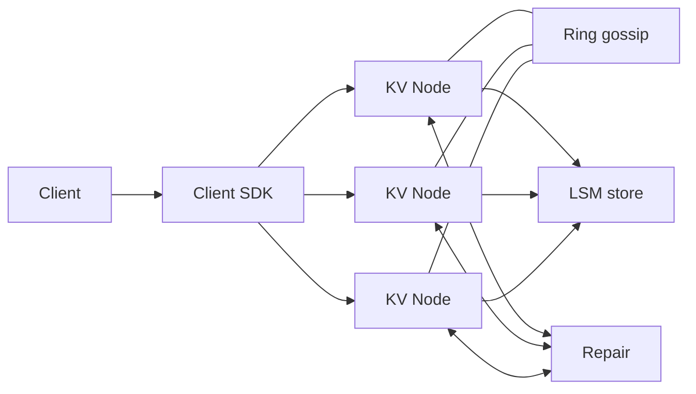
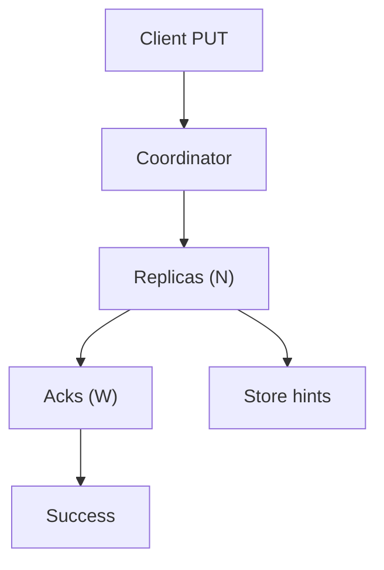
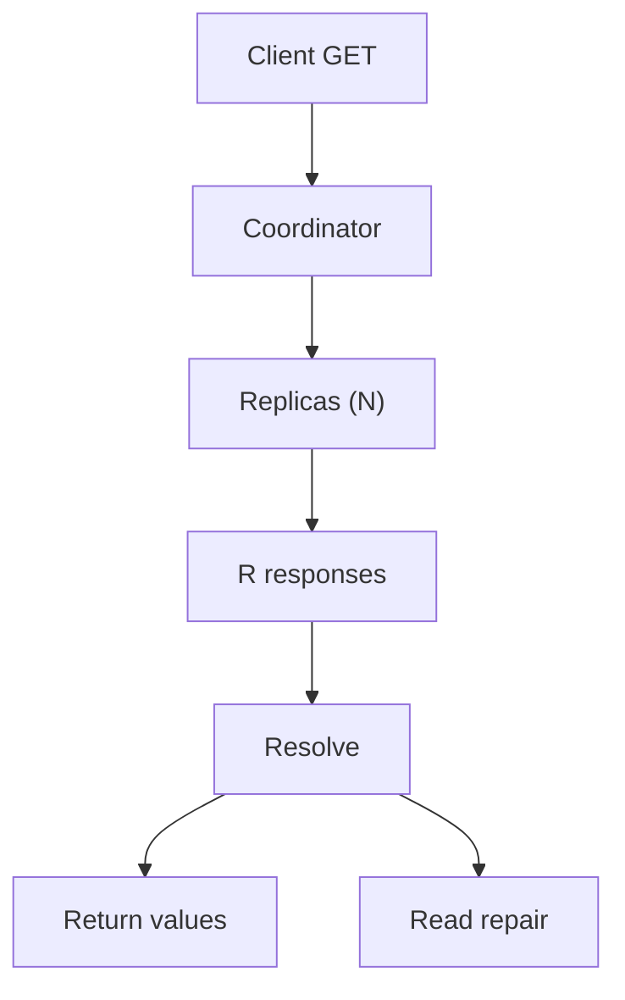

## Overview

This is a Dynamo-style distributed key-value store optimized for **high availability** and **horizontal scale** in a single region. It provides **tunable consistency per request** using quorum parameters:

- `N`: replication factor (replicas per key)
- `W`: write quorum (durable acks required)
- `R`: read quorum (responses required)

The default behavior is **eventual consistency with conflict surfacing** for single-key operations. Conflicts are represented as multiple concurrent versions (“siblings”) and resolved either by the application or by an optional per-namespace policy.

## Requirements

### Functional Requirements
- `Put/Get/Delete` by key with opaque byte values.
- Per-request tunable consistency via `N/R/W` with presets (`ONE`, `QUORUM`, `ALL`).
- Consistent hashing partitioning; automated node add/remove with rebalancing.
- Replica placement across failure domains (AZ-aware).
- Conflict detection and returning multiple versions when needed.
- Conditional writes/deletes using client-provided version context (CAS-like semantics).
- Short-outage handling (hinted handoff), read repair, and background anti-entropy repair.
- Operational APIs: health, membership, stats, repair controls, drains, safe rebalancing.

### Non-Functional Requirements (Targets)
- Single-region cluster: ~500 nodes, 3 AZs, ~200 TB logical data, `N=3`.
- Steady traffic: ~300k read QPS avg / 1.5M peak; ~150k write QPS avg / 500k peak.
- Latency: single-digit ms P50 for `ONE`, cross-AZ tails acceptable for `QUORUM`.
- Availability: 99.99% monthly successful ops for `ONE/QUORUM`.
- Durability: acked writes persisted to at least `W` replicas’ WAL.

## Simplified Architecture

### High-Level Diagram

**Design choices**
- A single deployable **KV Node** binary runs all roles: request handling, coordination, replication, membership, storage, and repair.
- Hints, version metadata, and tombstones are stored in the same embedded LSM engine as regular data (separate column families/prefixes), keeping the runtime footprint small and operationally uniform.
- Repair is one subsystem with two modes: opportunistic (read repair) and continuous (anti-entropy).

### Write Path (Quorum + Hints)

### Read Path (Quorum + Resolve + Repair)

## Components

### KV Node (Single Process, Modular Internals)
**1) API + Auth**
- gRPC API for `Put/Get/Delete`.
- Tenant authn/z, quotas, payload limits, audit hooks.
- Per-request deadlines and bounded retries.

**2) Coordinator**
- Computes replica set from ring state.
- Executes quorum reads/writes, cancels in-flight replica RPCs after quorum.
- Performs digest reads (optional): fetch full value from one replica and digests from others; fetch full values only on mismatch.

**3) Storage Engine**
- Embedded LSM (RocksDB/Pebble) with WAL + group commit.
- Data stored as versioned records; tombstones are regular versions with GC metadata.
- Hints stored locally (same DB, separate prefix/CF) with retention limits and replay throttling.

**4) Membership + Ring**
- SWIM-style gossip for liveness and membership dissemination.
- Consistent hashing with vnodes for even distribution and smoother rebalancing.
- AZ-aware replica selection for `N=3` (one replica per AZ when available).

**5) Repair**
- Read repair: triggered when a read observes divergence.
- Anti-entropy: per-vnode background reconciliation using Merkle-tree (or range-hash) summaries and streaming diffs, rate-limited to protect foreground latency.

## Consistency & Conflict Model

### Tunable Quorums
- `Put`: success after `W` replicas durably append to WAL.
- `Get`: answered after `R` responses; coordinator resolves versions and optionally continues contacting replicas for repair signals.

Quorum overlap (`R + W > N`) increases the chance of reading the latest value in steady state; the system remains **not linearizable**.

### Version Context and Conditional Writes
- `Get` returns `VersionContext` (opaque to clients).
- `Put/Delete` may include `if_match` context to enforce CAS-like semantics.
- Clients that keep and present context get stronger session-level behavior (read-your-writes in common steady-state paths).

### Conflict Detection and Resolution
- Stored versions carry a **causal context** (vector-clock-like metadata encoded into `VersionContext`).
- `Get` returns:
  - a single version when one causally dominates, or
  - multiple siblings when updates are concurrent.
- Operational bounds:
  - sibling cap (e.g., 10 per key) with metrics and administrative tooling for inspection/cleanup.

**Optional namespace policy**
- LWW mode can be enabled per namespace for applications that prefer automatic resolution; it uses a hybrid logical timestamp to reduce clock-skew sensitivity.

## Data Model

### Logical Record (Per Version)
- `key: bytes`
- `value: bytes` (empty for tombstone)
- `context: bytes` (opaque causal metadata)
- `is_tombstone: bool`
- `expires_at_ms: int64?` (TTL)
- `last_modified_ms: int64` (observability only)

### Physical Layout (LSM-Friendly)
- `data`: `(key || version_id) -> value + metadata`
- `head`: `key -> [version_id...]` (bounded sibling list)
- `hints`: `(target_node || key || hint_id) -> write_payload`
- Tombstones live in `data/head` like any other version, with GC grace.

## API Design

Protocol: gRPC.

- `Put(key, value, quorum, if_match?, ttl_seconds?, idempotency_key?) -> context, replica_acks`
- `Get(key, quorum, return_conflicts) -> versions[], resolved`
- `Delete(key, quorum, if_match?) -> context, replica_acks`

Error mapping:
- `INVALID_ARGUMENT`: invalid quorum, size limits.
- `FAILED_PRECONDITION`: conditional context mismatch.
- `UNAVAILABLE` / `DEADLINE_EXCEEDED`: quorum not met within deadline.

Idempotency:
- Coordinators keep a short-lived in-memory outcome cache keyed by `(tenant, client, idempotency_key)`.

## Scaling & Performance

- Primary scaling lever is adding nodes; vnodes enable smooth ownership movement.
- Foreground traffic is protected by strict timeouts, bounded retries, and repair throttles.
- Hot keys are handled via per-key rate limiting and (optional) tiny TTL response caching at the coordinator for extreme bursts.

Rebalancing:
- Node join streams vnode ranges from current owners with bandwidth/IO throttles.
- Planned removal uses drain: transfer ownership, then remove node from membership.

## Failure Modes & Mitigations

- **Single node failure**: `QUORUM` remains available; hints buffer short outages; repair converges on recovery.
- **AZ outage**: with AZ-aware `N=3`, `QUORUM` typically succeeds across remaining AZs.
- **Network partition**: both sides may accept writes; conflicts surfaced and converged via anti-entropy.
- **Compaction stalls / disk pressure**: enforced headroom, alerts on compaction debt, throttled repair/streaming, quotas and TTL cleanup.
- **Hint buildup**: bounded retention, replay rate limits, fallback to repair for expired hints.

## Operations

Key SLIs:
- Availability and latency by operation and consistency level.
- Quorum failure rate, unreachable replicas, timeout rate.
- Conflict rate (siblings per key), digest mismatch rate.
- Repair lag per vnode and repaired bytes.
- Disk usage, compaction backlog, write stalls, WAL fsync latency.

Deployment:
- Rolling upgrades with guarded concurrency to preserve `QUORUM`.
- On-disk format changes behind feature flags with staged migration.

Security:
- mTLS for node-to-node and client-to-node.
- Tenant authn/z, quotas, audit logs.
- Encryption at rest; optional per-tenant keys via KMS.

Backups / DR:
- Periodic SST snapshots + WAL archiving to object storage.
- Continuous restore testing; documented RPO/RTO targets.

## Simplification Notes

- Removed: separate “Hints Queue” service; hints are persisted as part of each node’s local store to keep durability and replay behavior without introducing a new dependency.
- Removed: distinct “Membership + Ring Metadata” component; ring state and liveness are carried by the gossip protocol and exposed via operational APIs.
- Merged: coordinator, replica, storage, membership, and repair into a single `KV Node` binary for unified deployment, debugging, and on-call ownership.
- Complexity kept: tunable quorums, causal contexts, tombstones, and repair remain because they are required to meet the stated availability target under partitions while preserving correctness for deletes and concurrent writes.