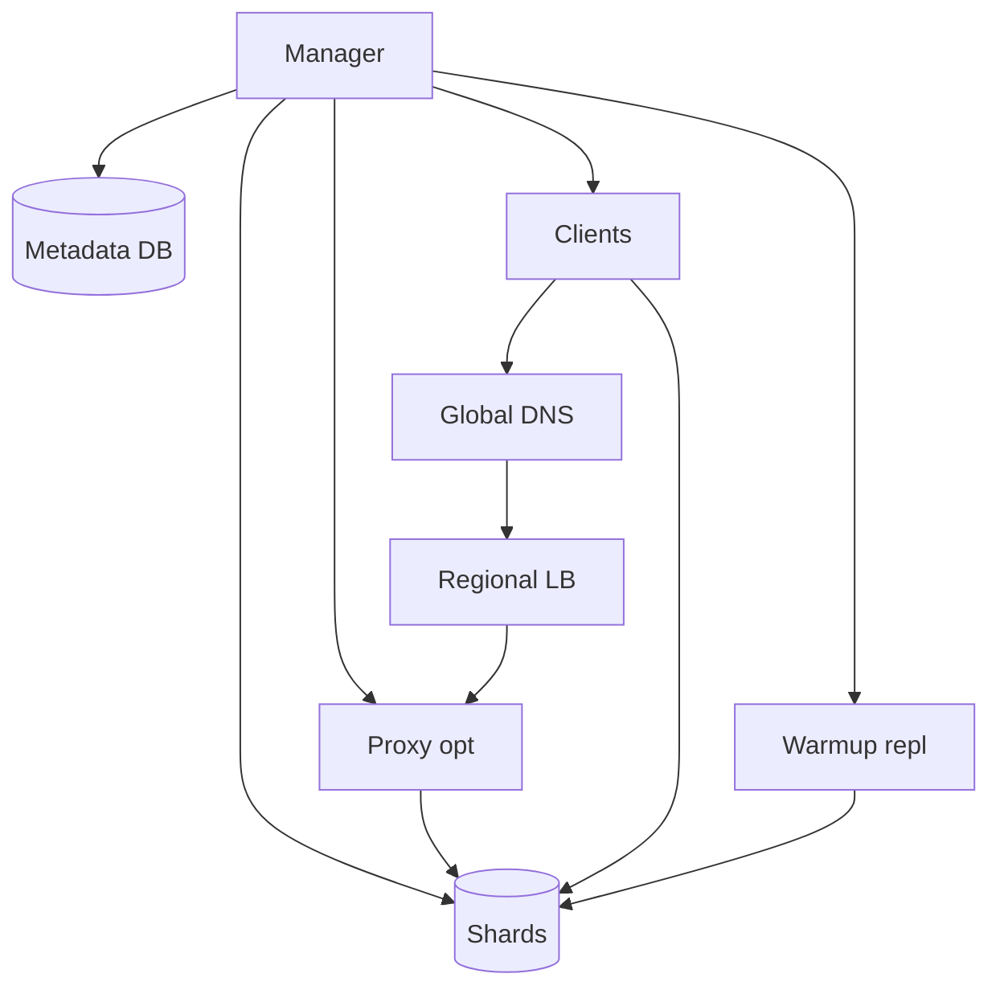
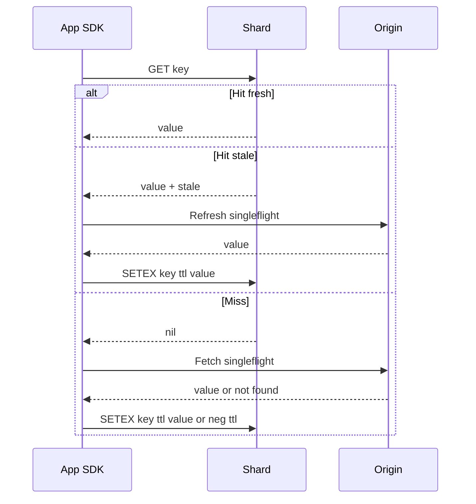

## Overview

This system is a Redis-like, multi-tenant, in-memory cache designed for single-digit millisecond latency at very high QPS. It runs **independent cache clusters per region** for predictable latency and failure isolation, with **optional best-effort cross-region warmup** for workloads that benefit from shared cache state.

The design keeps the hot path simple:
- **Data plane**: shard nodes that own key ranges, enforce TTL/eviction, and replicate within a region.
- **Management plane**: a small **Cluster Manager** that maintains topology (slot map), policies (tenants/quotas), and safe failover/rebalance using a single durable metadata store.

Herd prevention is treated as a product feature: TTL jitter, request coalescing helpers, stale-while-revalidate, and negative caching guard origins during failures and rebalances.

---

## Requirements

### Functional
- **Core commands**: `GET`, `MGET`, `SET`, `SETEX`, `DEL`, `INCR/DECR`, `EXPIRE`, `TTL`, `SCAN`, `PTTL`.
- **Sharding**:
  - Consistent hash slot map with automatic slot → node assignment.
  - Cluster-aware clients with `MOVED`/`ASK`-style redirects and topology propagation.
- **Multi-tenancy**:
  - Namespaces/tenants with quotas (memory/QPS/bandwidth), connection caps, and rate limits.
  - Isolation against hot keys and noisy neighbors.
- **TTL & expiry**: efficient expiry with bounded drift for TTL queries.
- **Herd prevention**: singleflight, stale-while-revalidate, negative caching, optional safe lock primitive.
- **Observability**: per-command latency, hit/miss, evictions, memory, replication lag, hot-key signals.
- **Admin**: namespaces/policies, drain nodes, rebalance slots, controlled failover, rolling upgrades.

### Non-functional targets (per large region)
- **Traffic**: ~2M QPS reads, ~300k QPS writes.
- **Connections**: up to ~200k concurrent per region (proxy fan-in optional).
- **Latency**: `GET` hit P99 ~8–12ms; `SET` (primary ack) P99 ~10–15ms.
- **Availability**: regional reads 99.99%, writes 99.9%; global reads via DNS/GLB failover.
- **Consistency**: within region primary-owner writes; replicas may be stale; across regions eventual (optional warmup).

---

## Simplified Architecture

### What this topology optimizes
- **Low-latency reads/writes**: SDK routes directly to shard owners; proxy is only for fan-in/auth convenience.
- **Operational simplicity**: one manager service and one durable database per region.
- **Fast recovery**: shard failures promote replicas with explicit fencing; clients converge quickly via redirects and topology updates.

---

## Components

### 1) Client SDK (Cluster-aware)
**Responsibilities**
- Maintain a cached slot map; route to shard owners; handle `MOVED` redirects and bounded retries.
- Provide herd controls close to the caller: TTL jitter helpers, singleflight wrappers, stale-while-revalidate helpers, and negative caching conventions.

**Topology distribution**
- SDK fetches the slot map from the Cluster Manager on startup and refreshes on:
  - `MOVED`/epoch mismatch responses
  - periodic jittered refresh (e.g., 5–30s)
  - optional long-poll/stream for updates

### 2) Proxy (optional)
**Use cases**
- Fan-in for very high connection counts.
- Centralized auth, per-tenant rate limiting, and TLS termination.
- Protocol compatibility for “dumb” clients.

**Responsibilities**
- Route requests using the same slot map as the SDK.
- Implement `MGET` scatter-gather with strict per-subrequest timeouts and partial-result semantics.

### 3) Shard Nodes (data plane)
**Storage**
- In-memory hash table keyed by `(namespace_id, key_bytes)`.

**TTL & eviction**
- Lazy expiry on read + background sampling.
- Per-namespace eviction policy and quota enforcement; hard limits on key/value sizes.

**Replication (within a region)**
- Each slot range is served by a **primary** with a **replica in another AZ**.
- Default write durability: **ack on primary commit**; optional mode to wait for one replica ack for stricter behavior.

**Isolation**
- Per-tenant accounting (bytes, ops, bandwidth) and request shedding when budgets are exceeded.

### 4) Cluster Manager (management plane)
A single service (or small HA set) that owns cluster decisions.

**Responsibilities**
- Namespace CRUD and policy validation.
- Slot assignment and rate-limited rebalancing.
- Membership via shard heartbeats, plus health-based routing hints.
- Controlled failover with fencing to avoid split brain.
- Rolling upgrade coordination (drain → restart → rejoin).

**Fencing**
- Manager assigns an **epoch** per slot owner in metadata.
- Shards reject writes if their local epoch is stale; clients receive `MOVED` with the newer epoch.

### 5) Postgres metadata store (durable)
**Stores**
- Namespaces/policies
- Slot map and epochs
- Node inventory and heartbeats
- Admin audit log and idempotency keys

Postgres also supports update propagation via `LISTEN/NOTIFY` (or polling) to keep clients/proxies/shards current.

### 6) Warmup/Replication (optional)
A small worker module (often deployed with the Manager) that improves cold-start behavior across regions.

**Mode**
- Opt-in per namespace.
- Best-effort, backpressured streaming of recent writes (or sampled hot keys) from a source region into a target region.
- Designed to be non-impacting: replication throttles aggressively and never competes with foreground latency.

---

## Data Model

### Cache entry (conceptual)
- `namespace_id`
- `key_bytes`
- `value_bytes`
- `type` (`string`, `int`)
- `expire_at_ms` (0 = none)
- `size_bytes`
- `last_access` (for eviction)

### Metadata tables (minimal)
- `namespaces(id, name, limits..., default_ttl_ms, max_ttl_ms, replication_mode, created_at)`
- `nodes(id, region, az, status, last_heartbeat_at, capacity_mem)`
- `slots(slot_id, primary_node_id, replica_node_id, epoch, updated_at)`
- `audit_log(id, actor, action, resource, request_id, created_at)`

---

## Request Flow

### `GET` with stale-while-revalidate (SDK-managed)

---

## API Design

### Data plane protocol
- RESP2/RESP3-compatible.
- Cluster behavior:
  - `-MOVED slot host:port epoch` for topology changes
  - `-TRYAGAIN` for overload/migration backoff
  - `-NOAUTH` for tenant auth failures

### Core commands
- `GET`, `MGET`, `SET`, `SETEX`, `DEL`, `INCR/DECR`, `EXPIRE`, `TTL`, `PTTL`, `SCAN`

### Optional extensions (kept small)
- `LOCK key token PX ms`
- `UNLOCK key token`

### Admin API (REST/gRPC)
- Namespace management, policy updates, drains, rebalances, controlled failovers.
- Mutating requests require idempotency keys and write an audit record.

---

## Consistency & Availability

### Within a region
- **Single-writer per key**: the primary owner executes writes atomically.
- **Replica lag tolerated**: reads default to primary for strongest behavior; optional replica reads for load shedding.
- **Failover**: manager promotes replica only when it can safely fence the old primary via epoch advancement.

### Across regions
- Default behavior is **regional independence**.
- Optional warmup provides **eventual** cross-region improvement without coupling request latency to cross-region coordination.

---

## Scaling & Operations

### Scaling knobs
- Add shard nodes to increase aggregate CPU/RAM and reduce per-node QPS.
- Use proxy fan-in when connection counts or TLS termination overhead becomes dominant.
- Enable per-namespace replica reads for read-heavy tenants (with staleness expectations).

### Rebalancing
- Move slots with strict rate limits (keys/sec, bytes/sec, concurrent moves).
- Use copy-then-swap ownership and rely on `MOVED` for convergence.

### Observability (minimum set)
- Latency histograms per command (P50/P95/P99)
- Hit/miss/stale-served rates by namespace
- Memory used, eviction rate, fragmentation signals
- Replica lag, failovers, `MOVED`/`TRYAGAIN` rates
- Per-tenant QPS/bytes and top-key sampling signals

### Security
- TLS in transit; mTLS where appropriate.
- Per-tenant auth and quotas enforced in SDK/proxy and shard-side as the final gate.
- Audit logs for admin actions stored durably.

---

## Simplification Notes

- **Removed**: separate coordination stores (etcd/Consul) and multi-store metadata; Postgres serves as the single durable source for config, epochs, and audit because the control-plane workload is modest and benefits from one operational surface.
- **Removed**: external replication log/stream (e.g., Kafka-style) for cross-region cache sharing; optional warmup uses backpressured, best-effort workers because cache replication is not correctness-critical.
- **Merged**: control-plane functions (membership, placement, rebalance, failover, admin API) into one **Cluster Manager** service to reduce moving parts and deployment coordination.
- **Merged**: replication/warmup into a small module alongside the Manager rather than a standalone distributed subsystem.
- **Complexity that remains**: slot map + redirects, primary/replica with fencing epochs, and tenant isolation controls; these are required to meet latency, availability, and noisy-neighbor requirements at the stated scale.