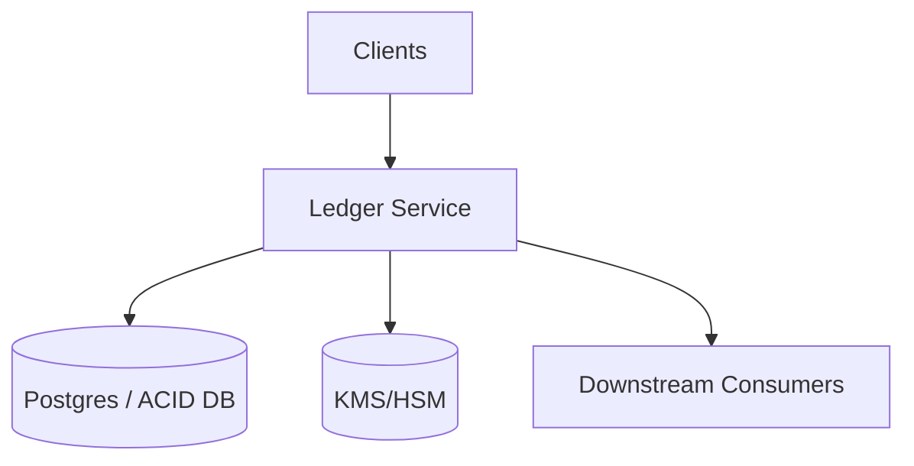

## Overview

This ledger is the system of record for money movement. It stores an immutable, append-only journal of double-entry postings, enforces accounting invariants under concurrency, and produces audit-grade integrity proofs.

The core is a strongly consistent database transaction that:
- validates a journal entry (balanced per currency),
- applies idempotency (safe retries),
- appends the entry + postings (no mutation of history),
- updates current balances for fast reads,
- records an outbox event for downstream consumers.

Tamper-evidence is provided with:
- a per-ledger hash chain across entries, and
- periodic Merkle checkpoints over entry hashes, signed with KMS/HSM keys.

## Requirements

### Functional Requirements
- Create an immutable, append-only journal entry containing one or more postings.
- Enforce double-entry accounting: total debits == total credits per currency for each journal entry.
- Support idempotent writes (safe retries; no duplicate financial effects).
- Retrieve journal entries and postings by ID, account, time range, and correlation/reference IDs.
- Provide fast current balance and available balance reads per account.
- Support reversals/corrections via compensating entries (no mutation of history).
- Provide cryptographic proofs of inclusion and tamper-evidence (hash chain + signed Merkle checkpoint).
- Stream committed ledger events to downstream consumers reliably (statements, risk, AML, warehouse).

### Non-Functional Requirements (Targets)
- Writes: 2,500 journal entries/sec (≈10,000 postings/sec)
- Reads: 50,000 QPS (balances + recent statements)
- Availability: reads 99.99%, writes 99.95% (multi-AZ)
- Consistency: strong for journal writes/idempotency/invariants; reliable event delivery to consumers
- Retention: 7–10 years online + archive

## Simplified Architecture

### Components

#### Ledger Service (single deployable)
One service with clear internal modules:
- **Write API**: validates entries, enforces invariants, idempotency, commits transactions.
- **Read API**: serves balances and journal queries from database tables optimized for reads.
- **Proof API**: serves inclusion proofs using stored checkpoints and Merkle nodes.
- **Background jobs** (inside the same service process or as the same binary in “worker mode”):
  - checkpoint builder (Merkle + signatures),
  - outbox publisher (reliable delivery),
  - reconciliation/verifier (detects tampering or projection drift).

#### Database (single source of truth)
A strongly consistent ACID database (commonly managed Postgres with multi-AZ HA; distributed SQL is a drop-in option if needed later). It stores:
- append-only journal entries + postings,
- idempotency records,
- current balances (updated in the write transaction),
- checkpoints + Merkle nodes for proofs,
- outbox events + consumer offsets.

#### KMS/HSM
Signs checkpoint roots and supports key rotation and audit controls.

#### Downstream consumers
Receive committed-entry events via a simple delivery mechanism:
- **Pull**: consumers read from an `events` API with a cursor (simplest operationally).
- **Push (optional)**: the outbox publisher delivers webhooks with retries and consumer-specific offsets.

## Data Model (Conceptual)

### Core tables

**accounts** (mostly static)
- `(ledger_id, account_id)` PK
- `currency`, `status`, `policy_json`, `created_at`

**journal_entries** (append-only)
- `(ledger_id, entry_id)` PK
- `client_request_id` (idempotency key)
- `effective_time`, `commit_time`
- `description`, `metadata_json`
- `seq` (monotonic per `ledger_id`)
- `prev_entry_hash`, `entry_hash`

**postings** (append-only)
- `(ledger_id, posting_id)` PK
- `entry_id`, `account_id`, `currency`, `direction`, `amount_minor`
- `effective_time`, `commit_time` (denormalized for fast range queries)
- `posting_hash`

**idempotency_keys**
- `(ledger_id, client_request_id)` PK
- `request_hash`, `entry_id`, `response_payload`, `created_at`

**account_balances** (mutable, strongly consistent)
- `(ledger_id, account_id, currency)` PK
- `posted_balance_minor`, `available_balance_minor`
- `last_seq`, `updated_at`

### Integrity tables

**ledger_stream**
- `(ledger_id)` PK
- `last_seq`, `last_entry_hash`, `updated_at`

**ledger_checkpoints** (append-only)
- `(ledger_id, checkpoint_id)` PK
- `seq_start`, `seq_end`
- `merkle_root`, `root_signature`, `signing_key_id`
- `created_at`

**merkle_nodes** (append-only per checkpoint)
- `(ledger_id, checkpoint_id, level, index)` PK
- `node_hash`

### Event delivery tables

**outbox_events** (append-only)
- `(ledger_id, event_id)` PK
- `entry_id`, `seq`, `type`, `payload`, `created_at`

**consumer_offsets** (mutable)
- `(ledger_id, consumer_id)` PK
- `last_event_id` (or `last_seq`)
- `updated_at`

## Write Path (Single Transaction)

A journal entry commit is one database transaction:

1. **Idempotency**
   - `INSERT` `(ledger_id, client_request_id, request_hash, ...)` with a unique constraint.
   - On conflict: if `request_hash` matches, return stored response; else return `409`.

2. **Allocate sequence + hash-chain link**
   - `SELECT ... FOR UPDATE` on `ledger_stream(ledger_id)`, increment `last_seq`, read `last_entry_hash`.

3. **Validate invariants**
   - balanced postings per currency,
   - account status/currency constraints,
   - optional “no negative available balance” policy.

4. **Append journal**
   - Insert into `journal_entries` + `postings` (append-only).

5. **Update balances**
   - Update `account_balances` rows touched by postings, setting `last_seq = entry.seq`.

6. **Record event**
   - Insert into `outbox_events` (committed-entry payload).

This keeps correctness, idempotency, and balances strongly consistent without separate projection infrastructure.

## Read Path

### Balance reads
- Served from `account_balances` (single-row lookup by `(ledger_id, account_id, currency)`).
- For read scaling: route most reads to read replicas; route “read-your-writes” (recent writes) to the primary based on a returned `last_seq` token.

### Statement / journal queries
- Primary queries use `postings` filtered by `(ledger_id, account_id, commit_time)` with pagination.
- For audit-grade retrieval, fetch the `journal_entries` row and all associated `postings` by `entry_id`.

## Integrity Proofs

### Hashing
- `posting_hash`: canonical fields (account_id, currency, direction, amount_minor, instrument/ref if present).
- `entry_hash`: canonical entry fields + ordered posting hashes + `(ledger_id, seq, prev_entry_hash)`.

### Checkpoints (Merkle + signature)
- A background job periodically batches a contiguous range of sequences per ledger: `[seq_start, seq_end]`.
- It builds a Merkle tree over `entry_hash` leaves (in `seq` order), stores the root and required internal `merkle_nodes`, and signs the root via KMS/HSM.
- Proof endpoint returns:
  - the entry’s `entry_hash`,
  - the Merkle sibling path derived from stored `merkle_nodes`,
  - the signed checkpoint metadata.

### Verification (client/auditor)
1. Recompute `posting_hash` and `entry_hash` from canonical fields.
2. Verify hash-chain continuity using `prev_entry_hash` within the ledger stream.
3. Verify Merkle inclusion: `entry_hash + merkle_path => merkle_root`.
4. Verify signature on `merkle_root` against `signing_key_id`.

## API (Minimal)

### Create Journal Entry
`POST /v1/ledgers/{ledger_id}/journal-entries`
- Header: `Idempotency-Key`
- Response includes: `entry_id`, `commit_time`, `seq`, `entry_hash`

### Get Journal Entry
`GET /v1/ledgers/{ledger_id}/journal-entries/{entry_id}`

### List by Account
`GET /v1/ledgers/{ledger_id}/accounts/{account_id}/postings?from=&to=&limit=&cursor=`

### Get Balance
`GET /v1/ledgers/{ledger_id}/accounts/{account_id}/balance`
- Optional: `min_seq` for read-your-writes routing

### Get Proof
`GET /v1/ledgers/{ledger_id}/journal-entries/{entry_id}/proof`

### Consume Events (Pull)
`GET /v1/ledgers/{ledger_id}/events?consumer_id=&cursor=&limit=`
- Returns committed-entry events from `outbox_events` with a stable cursor.

## Operations & Security

- **Append-only enforcement**: application role has `INSERT` on journal, postings, checkpoints, merkle nodes, outbox; no `UPDATE/DELETE` on append-only tables.
- **Balances**: `account_balances` is the only routinely mutable financial state; it is rebuildable from the journal.
- **HA & durability**: managed Postgres multi-AZ, synchronous commit for acknowledged writes, PITR backups, restore drills.
- **Retention**: time-based partitioning for `journal_entries`/`postings`; archive old partitions to immutable storage per policy.
- **Monitoring**: commit latency, idempotency conflicts, balance update failures, checkpoint lag, proof verification failures, outbox delivery lag.

## Simplification Notes

- Removed `Query / Balance Service`, `Proof Service`, `Outbox Relay`, `Projection Workers` by merging into a single `Ledger Service`; it’s acceptable because write/read/proof/outbox responsibilities share the same transaction boundaries and data model.
- Removed separate `Read Store` by serving balances from `account_balances` updated in the write transaction and serving statements from indexed `postings`; it’s acceptable because the primary read workload (balances) becomes a single-row lookup.
- Removed `Event Stream` by using `outbox_events` plus a consumer pull API (and optional webhook push); it’s acceptable because reliability comes from the durable outbox and explicit consumer offsets.
- Removed `Redis / Cache` as a required component by relying on `account_balances` + read replicas; it’s acceptable because balance reads are already O(1) and replica scaling is straightforward.
- Simplified ordering to a single per-ledger `seq` in `ledger_stream`; remaining complexity is necessary to produce a deterministic order for the hash chain and checkpoint windows.
- Kept `KMS/HSM`, hash chain, and signed Merkle checkpoints; remaining complexity is necessary to meet tamper-evidence and audit-proof requirements.