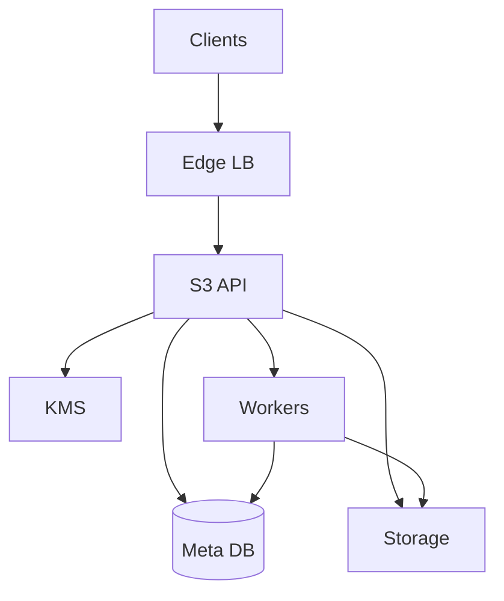
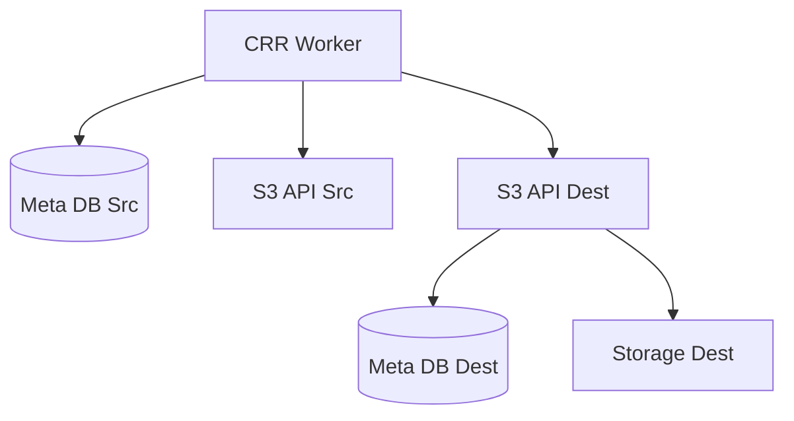

## Overview

This design delivers a production-grade, **S3-compatible**, **multi-tenant** object storage service with:

- **Strong consistency within a region** for `PUT/DELETE` and subsequent `GET/HEAD/LIST` after commit.
- **High durability** via **erasure coding across AZs**, background scrubbing, and repair.
- **Tenant isolation** for authZ, quotas, rate limits, and billing attribution.
- **Cross-region replication (CRR)** with **idempotent application** per immutable `versionId`.

The system is organized around two responsibilities:

- **Metadata + S3 semantics**: correctness of buckets/keys/versions, listings, multipart, conditional requests, and policies.
- **Shard storage**: efficient, durable storage of object bytes with erasure coding and repair.

## Requirements

### Functional Requirements

- **Tenancy**: tenants, buckets, IAM-like policies; isolation for authZ, quotas, billing.
- **S3-compatible APIs** (subset, extensible): `PUT/GET/HEAD/DELETE`, `ListObjectsV2`, multipart upload, range reads, conditional requests, server-side copy (optional).
- **Bucket versioning**: immutable versions per key, delete markers, retrieval by `versionId`.
- **Lifecycle management**: expiration, abort incomplete multipart uploads, transitions, tag/prefix filters.
- **Storage durability**: erasure coding across AZs; online repair and scrubbing.
- **Cross-region replication (CRR)**: replicate selected buckets/prefixes/tags; preserve metadata and version IDs; support backfill/inventory reconciliation.
- **Security**: TLS; encryption at rest (SSE-S3) and optional SSE-KMS; audit logs.
- **Operations**: per-tenant quotas, rate limiting, usage reporting, admin tooling, safe deletes/GC.

### Non-Functional Requirements (Concrete Targets)

**Workload scale (design point per “large region”):**
- Objects: **2–5B objects** per large region (global up to **10B**).
- Data stored: **5–20PB** per large region (global up to **50PB**).
- Request rate: **50–150k req/s** per large region peak; **300k req/s** global peak.
- Ingest bandwidth: **10–30 Gb/s** sustained per large region; burst via backpressure.

**Latency SLOs (intra-region, warm path):**
- `GET` P50 **25ms**, P99 **150ms** (size-dependent).
- `PUT` (≤64MB) P50 **60ms**, P99 **350ms** (encode + commit).
- `ListObjectsV2` (1K keys) P50 **100ms**, P99 **700ms**.

**Availability:**
- Regional read availability: **99.99%**.
- Regional write availability: **99.9%** during single-AZ degradation.

**Consistency model:**
- **Within a region**: strong consistency after commit completes.
- **Across regions**: eventual consistency via CRR; idempotent effects per `(bucket, key, versionId)`.

**Durability:**
- Within region: target **≥ 11 nines** annual durability for committed objects.
- RPO: **0** within region for committed versions; CRR lag target P99 **< 60s**.

### Constraints & Assumptions

- Multi-tenant isolation must prevent noisy neighbors (rate limits, quotas, fairness).
- Public access only through the S3 endpoint; internal calls use **mTLS**.
- Bucket naming is unique per tenant by default.

## Simplified Architecture

### High-Level Diagram (Single Region)

### Components

#### Edge (LB + WAF)
- TLS termination (or pass-through), request routing, basic DDoS/WAF controls.
- Forwards identity context headers only after verification by the S3 Service (no trust in client-provided identity).

#### S3 Service (API + Auth + Metadata Orchestrator)
A stateless service that implements the S3 surface area and coordinates metadata and storage operations.

**Responsibilities**
- S3 parsing/validation, XML error mapping, conditional headers, range handling.
- SigV4 authentication; IAM-like policy evaluation (identity + bucket policies).
- Tenant enforcement: quotas, rate limits (RPS/bandwidth), concurrency caps, hot-prefix throttles.
- Multipart orchestration and server-side copy (optional).
- Audit event emission (who/what/when/result).

**Scaling**
- Horizontally scalable; no durable local state.
- Uses bounded retries with clear retry classification.

#### Metadata DB (Strong Consistency)
A single strongly consistent transactional database backing all metadata and indexing. A distributed SQL system (multi-AZ) fits the strong-consistency and availability targets.

**Responsibilities**
- Buckets, keys, immutable versions, delete markers.
- Listing index for `ListObjectsV2` with keyset pagination.
- Multipart state.
- Lifecycle and replication configurations.
- Outbox table for replication and background tasks.

#### Storage Cluster (Erasure-Coded Shard Store)
A cluster of storage nodes across AZs storing erasure-coded shards on local disks.

**Responsibilities**
- Write path: accept a stream, erasure-code, place shards across AZs, persist with checksums.
- Read path: fetch k shards (latency-aware), reconstruct if needed, validate checksums, serve ranges.
- Background: scrubbing, repair, rebalancing.

**Key decisions**
- **Version-addressed storage**: shard keys derived from immutable `versionId`.
- **Uniform EC scheme** across the cluster (e.g., RS `k+m` placed across 3 AZs with “any AZ loss leaves ≥k shards”).
- **End-to-end checksums**: object checksum + per-shard checksum.

#### Background Workers (Lifecycle, GC, Repair Coordination, CRR)
A worker fleet (often deployed alongside the S3 Service) that runs asynchronous maintenance and replication.

**Responsibilities**
- Lifecycle rule evaluation and execution (expire/transition, abort multipart).
- Safe garbage collection of shards for deleted/noncurrent versions (with grace windows).
- Periodic inventory generation for billing/audit and CRR reconciliation.
- Cross-region replication driven from the metadata outbox.

#### KMS (Optional)
- SSE-S3: envelope encryption with a service-managed master key per region/tenant.
- SSE-KMS: DEK wrapped by external KMS; tenant policies control key usage.

## Core Invariants

- **Visibility rule**: a version is visible to `GET/HEAD/LIST` only after metadata is committed with `commit_state=committed`.
- **Immutability**: object versions are immutable; overwrites create new versions; deletes create delete markers.
- **Stable identity**: `(bucket_id, key, version_id)` uniquely identifies a version for retries and replication.

## Data Model (SQL-like)

- `tenants(tenant_id PK, name, status, created_at)`
- `buckets(bucket_id PK, tenant_id, name, region, versioning_state, created_at)`
- `objects_latest(bucket_id, key, latest_version_id, latest_is_delete_marker, etag, size, updated_at, PK(bucket_id,key))`
- `object_versions(bucket_id, key, version_id, is_delete_marker, etag, size, content_type, user_metadata_json, tags_json, encryption, commit_state, created_at, PK(bucket_id,key,version_id))`
- `shard_manifests(version_id PK, scheme_k, scheme_m, shard_locations_json, shard_checksums_json, object_checksum, committed_at)`
- `multipart_uploads(upload_id PK, bucket_id, key, initiator, created_at, expires_at, state)`
- `multipart_parts(upload_id, part_number, etag, size, part_checksum, staged_ref, created_at, PK(upload_id,part_number))`
- `lifecycle_rules(bucket_id, rule_id, filter_prefix, filter_tags_json, actions_json, status, updated_at, PK(bucket_id,rule_id))`
- `replication_rules(bucket_id, rule_id, dest_region, filter_prefix, filter_tags_json, replicate_delete_markers, status, updated_at, PK(bucket_id,rule_id))`
- `replication_outbox(event_id PK, bucket_id, key, version_id, event_type, ts, payload_json, delivered_at)`

### Listing Index
`ListObjectsV2(prefix, delimiter)` is served from an ordered index over `(bucket_id, key)`:
- Use keyset pagination (`continuation-token` includes last key + tie-breaker).
- Strong consistency follows from transactional updates on commit.

## Key Flows

### PUT Object (Single-Part)
1. S3 Service authenticates, authorizes, and enforces tenant limits.
2. Metadata DB creates a new `version_id` in `staged` state.
3. S3 Service streams bytes to the Storage Cluster to persist shards and returns a manifest (locations + checksums).
4. Metadata DB commits:
   - `object_versions` → `committed`
   - `objects_latest` pointer update
   - `shard_manifests` insert
   - `replication_outbox` event insert (if replication enabled)
5. Client receives `ETag` and `x-amz-version-id`.

### GET / HEAD (Latest or By Version)
1. S3 Service authenticates/authorizes.
2. Metadata DB resolves the committed version:
   - by `versionId` directly, or
   - via `objects_latest` then `object_versions`.
3. Storage Cluster fetches shards (and reconstructs if needed), validates checksums, serves bytes or headers.

### LIST (ListObjectsV2)
1. S3 Service validates policy and rate limits large scans.
2. Metadata DB queries the ordered `(bucket_id, key)` index using keyset pagination.
3. Response encodes S3-compatible XML with strong consistency after commit.

### Multipart Upload
- Each part is staged as an internal immutable blob with checksum.
- `CompleteMultipartUpload` creates a new `version_id`, produces the final manifest, and commits metadata atomically (visibility only after commit).

## Cross-Region Replication (CRR)

### Replication Diagram

**Mechanism**
- Source commit inserts an event into `replication_outbox` keyed by `(bucket_id, key, version_id)`.
- CRR worker reads events, fetches the committed version (metadata + bytes) from the source, and writes to the destination using the destination S3 Service.
- Destination applies idempotently by `version_id`:
  - if metadata/version exists, the operation is a no-op;
  - otherwise, it stores bytes, writes manifest, and commits metadata.

**Backfill / reconciliation**
- Inventory reports (per bucket/prefix) provide periodic comparison points.
- Workers can re-enqueue missing versions by scanning metadata ranges.

## Security

- TLS for all client traffic; **mTLS** for service-to-service calls.
- SigV4 authentication and policy evaluation for every request.
- Encryption at rest:
  - SSE-S3: envelope encryption (per-object DEK) stored with metadata.
  - SSE-KMS: DEK wrapped by tenant-authorized KMS key.
- Audit logs: append-only, capturing tenant identity, decision, resource, and outcome.

## Operations

- **Quotas & rate limiting**: enforced in S3 Service (per-tenant RPS, bandwidth, concurrency); hot-prefix throttles protect listings and small-object storms.
- **Observability**:
  - API: latency percentiles, 4xx/5xx, auth failures, throttling.
  - Metadata DB: transaction latency/contended keys, replica health.
  - Storage: shard IO latency, reconstruction rate, scrub/repair backlog, checksum failures.
  - CRR: lag, backlog, retry counts, per-tenant bandwidth usage.
- **Maintenance**:
  - Scrubbing verifies shard checksums; repair reconstructs missing/corrupt shards.
  - GC deletes shards only after metadata indicates safe deletion and grace windows pass.

## Failure Modes

- **Storage node loss during PUT**
  - Effect: staging fails; commit does not occur; object remains invisible.
  - Handling: retry staging on alternate nodes; background GC removes partial staged shards.

- **Single AZ outage**
  - Effect: reads reconstruct more often; writes may degrade depending on placement.
  - Handling: EC placement guarantees ≥k shards outside any single AZ; admission control reduces load in degraded mode.

- **Metadata DB instability**
  - Effect: commits/listings slow or unavailable.
  - Handling: multi-AZ transactional DB with automatic failover; per-tenant shedding; reads by explicit `versionId` can be served when metadata is available.

## Simplification Notes

- Removed: standalone `Metadata Cache`; acceptable because hot metadata is served via DB indexes plus in-process caching in the S3 Service.
- Removed: separate “Durable Change Log” service; acceptable because `replication_outbox` in the metadata DB provides durable, transactional event production.
- Merged: `Auth` and `S3 API Gateway` into a single stateless `S3 Service`; acceptable because both share request context, policy enforcement, and S3 semantics.
- Merged: lifecycle/GC/inventory/CRR into `Background Workers`; acceptable because these are asynchronous workflows driven from the same metadata source of truth.
- Complexity kept: erasure coding, scrubbing, and repair; necessary to meet PB-scale durability and cost targets while tolerating failures.
- Complexity kept: strongly consistent transactional metadata and listing index; necessary for predictable S3 semantics (versioning, conditional requests, LIST correctness).