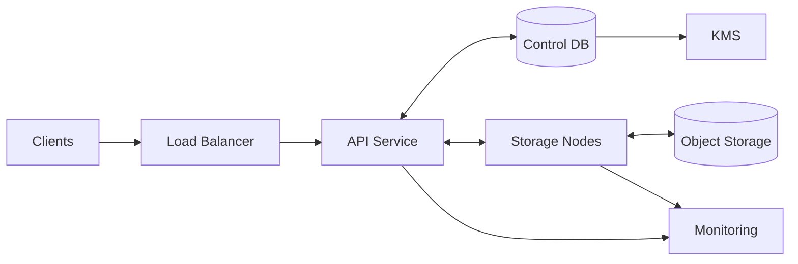

## Overview

This TSDB ingests high-rate, append-heavy telemetry and metrics, stores it efficiently in immutable time-partitioned blocks, and serves low-latency queries for recent ranges while supporting long-range analytics via rollups and tiered retention.

The design focuses on predictable performance under:
- High-cardinality tags (`device_id`, `tenant_id`)
- Skewed traffic and hot series
- Out-of-order and duplicate arrivals
- Background work (compaction, rollups, retention) competing with foreground SLOs
- Multi-tenant isolation and quotas

At a high level:
- **Writes** are routed to a shard, durably replicated to storage nodes, and buffered in a WAL + in-memory “head” before becoming immutable blocks.
- **Reads** use a tag index + block metadata for aggressive pruning and do distributed aggregation across only the shards that matter.
- **Maintenance** (compaction, rollups, retention, tiering) runs inside storage nodes under strict CPU/IO budgets.

## Requirements

### Functional Requirements
- Ingest points: metric name, tags/labels, timestamp, numeric value(s).
- Idempotent writes for retries; configurable de-duplication; tolerate out-of-order within a configurable window (e.g., 2 hours).
- Query by time range with tag filters and aggregations (sum/avg/min/max, rate/increase, percentile approximations).
- Downsampling rollups (raw → 1m → 10m → 1h) with configurable aggregations per metric.
- Retention policies per tenant/namespace; tier older data to cheaper storage.
- Multi-tenancy: authn/authz, per-tenant quotas (ingest rate, max series cardinality), isolation.
- Operational APIs: health, shard status, backpressure signals, compaction/rollup progress.
- Bounded backfill imports and safe deletes (tombstones) for GDPR/tenant offboarding.

### Non-Functional Requirements (SLOs, Scale, and Targets)
- Peak ingest: ~2,000,000 samples/sec cluster-wide (batched).
- Out-of-order window: default 2 hours, configurable per tenant.
- Writes (acknowledged): P50 10–20ms, P99 50–100ms.
- Queries:
  - Recent dashboards (last 1h, selective tags): P50 30–80ms, P99 200–500ms
  - Long range (30d, downsampled): P99 1–3s
- Availability: 99.99% within a region (tolerate single node / single zone failures).
- Durability: no acknowledged write loss within a region.
- Cross-region DR: async replication, RPO 5 minutes, RTO 30 minutes.

## Simplified Architecture

### High-Level Diagram



### What This Cluster Runs
- **API Service**: one deployable service (single binary) that handles both ingest and query frontends, plus admin/ops endpoints.
- **Storage Nodes**: shard-owning nodes that implement the TSDB engine (WAL/head/blocks/index), replication, and maintenance.
- **Control DB**: a small relational database for tenants, limits, retention/rollup policy, and shard placement epochs.
- **Object Storage**: durable, low-cost storage for sealed blocks (warm/cold tiers) and DR artifacts.

## Data Model

### Logical Model
- **Tenant**: isolation boundary for auth, quotas, retention, encryption keys.
- **Series**: unique `(metric_name, sorted tags)` mapped to `series_id`.
- **Sample**: `(series_id, timestamp_ms, value[, field])`.

### Physical Layout (Immutable Blocks)
- Block window: e.g., raw blocks of 2 hours; rollups can use larger windows.
- Store separate resolutions: `raw`, `1m`, `10m`, `1h`.
- Block contents:
  - Chunked per-series samples with time/value encodings (delta-of-delta, Gorilla XOR, etc.).
  - Block metadata: time bounds, series/chunk offsets, stats, checksums.
  - Tag index segments to map `(tag_key, tag_value)` → postings list of `series_id`.

## Core Flows

## Write Path (Ingest)
1. **Authenticate and validate** (tenant, schema, timestamp bounds, payload size).
2. **Determine shard** using a stable hash of `(tenant_id, series_key)` and the current placement epoch from the Control DB (cached in API).
3. **Idempotency and duplicates**
   - Optional `Idempotency-Key` stored with a short TTL in the Control DB (or in-memory per API instance with best-effort if strict semantics aren’t required for every client).
   - Storage nodes apply per-metric duplicate policy within the out-of-order window (last-write-wins for gauges, reject for strict pipelines).
4. **Durable replication**
   - API sends the batch to the shard’s replica set.
   - The shard leader appends to its WAL and replicates to followers.
   - The write is acknowledged after a quorum WAL append succeeds.
5. **Out-of-order handling**
   - Samples within the configured window are applied to the in-memory “head” for the current block window.
   - Samples older than the window are rejected or routed to a bounded backfill mode (tenant-configured).

## Read Path (Query)
1. **Parse and plan**: determine time range, target resolution (raw vs rollup), and filter predicates.
2. **Shard fan-out**: route to only shards that may contain the series.
3. **Prune aggressively** on storage nodes:
   - Use tag index postings lists to find candidate series.
   - Use block metadata time bounds to skip blocks outside the range.
4. **Two-stage aggregation**
   - Storage nodes compute partial aggregates close to data.
   - API merges partials and applies final grouping/limit/pagination.
5. **Tail-latency controls**
   - Per-tenant concurrency limits and query cost limits (series matched, bytes scanned, CPU time).
   - Optional partial results with warnings when a shard times out.

## Background Maintenance (Inside Storage Nodes)
Maintenance runs continuously with explicit resource budgets:
- **Compaction**: merges small blocks, applies tombstones, reduces read amplification.
- **Rollups**: computes downsampled resolutions during/after compaction; stores mergeable sketches for percentiles where needed.
- **Retention and tiering**
  - Hot: recent raw blocks kept locally for low-latency.
  - Warm/cold: sealed blocks uploaded to object storage and optionally evicted locally based on policy.
- **Repair**: detects missing/corrupt replicas and rehydrates from another replica or object storage.

## APIs

### Write API
`POST /v1/write`

Headers:
- `Authorization: Bearer ...`
- `X-Tenant-Id: ...`
- `Idempotency-Key: ...` (optional)

Body:
```json
{
  "points": [
    {
      "metric": "temp_c",
      "tags": { "device_id": "d1", "region": "us" },
      "ts_ms": 1734390000123,
      "value": 21.4
    }
  ],
  "accept_out_of_order_ms": 7200000
}
```

Responses:
- `204` success (durable after quorum WAL append)
- `400/401/403/413` invalid/auth/payload
- `409` idempotency conflict
- `429` tenant throttled
- `503` cluster backpressure (retry with jitter, respect `Retry-After`)

### Query API
`POST /v1/query`

Body:
```json
{
  "start_ms": 1734386400000,
  "end_ms": 1734390000000,
  "filter": { "metric": "temp_c", "tags": { "region": "us" } },
  "downsample": { "resolution": "1m", "agg": "avg" },
  "group_by": ["device_id"],
  "limit_series": 10000
}
```

Errors:
- `400` invalid query
- `413` exceeds cost limits
- `429` tenant budget exceeded
- `504` shard timeout (optionally returns partials with warnings)

### Discovery + Ops
- `GET /v1/labels`
- `GET /v1/label/{key}/values`
- `POST /v1/series`
- `GET /v1/health`
- `GET /v1/shards`
- `PUT /v1/tenants/{id}/retention`

## Partitioning, Replication, and Scaling

### Sharding
- Primary isolation key: `tenant_id`
- Within tenant: `shard = hash(series_key) % N`
- Time partitioning: immutable blocks per time window within each shard

### Replication
- Each shard has a replica set (e.g., RF=3 across zones).
- Writes go to the shard leader and are acknowledged after quorum WAL append.
- Leaders can be re-elected on failure; placement epochs prevent split-brain routing.

### Practical Guardrails
- Per-tenant ingest throttles and “new series” rate limits.
- Cardinality caps per tenant/metric; approximate counting to detect explosions early.
- Query admission control to bound fan-out and bytes scanned.

## Consistency, Deletes, and Backfill

### Durability vs Visibility
- Acknowledgment means the write is durable in a quorum WAL.
- Queries are near-real-time; storage nodes expose a per-shard applied watermark so the API can optionally provide “read-your-writes” within a bounded wait.

### Deletes (GDPR / Offboarding)
- Deletes create tombstones scoped by tenant + time range + tag filter.
- Tombstones are enforced during query and compacted into blocks.
- Hard-delete completion is tracked per block and exposed via ops APIs for auditability.

### Backfill
- Backfill is a separate mode with stricter limits (bytes/day, time range, concurrency).
- Backfilled data is written into dedicated backfill blocks and compacted normally.

## Failure Modes and Recovery

- **Storage node crash**: shard fails over to another replica; WAL replay restores head state.
- **Zone failure**: quorum remains available if replicas span zones; capacity is degraded until repair completes.
- **Corrupt block**: checksum failure triggers repair from another replica or object storage.
- **Compaction backlog**: maintenance budget increases within caps; ingestion/query throttles protect SLOs.

## Disaster Recovery (Cross-Region)
- **Control DB**: periodic snapshots and continuous WAL shipping to the DR region.
- **Blocks**: object storage replication to DR (or dual-write of sealed blocks).
- **Recovery**: restore Control DB, start storage nodes, rehydrate hot working set on demand; meet RPO via shipped WAL/checkpoints and RTO via automated restore + placement bootstrap.

## Operations and Security

### Monitoring
Track:
- Ingest QPS/points/sec, p99 latencies, throttles, error rates
- WAL fsync latency, disk usage, compaction debt, repair rate
- Query fan-out, bytes scanned, timeouts, partial results
- Per-tenant cardinality and “new series/sec”

### Security
- TLS everywhere; mTLS internally where feasible.
- JWT/OIDC auth; tenant isolation enforced at API and storage boundaries.
- Encryption at rest with per-tenant keys (envelope encryption via KMS).
- Audit logs for admin actions and retention/deletion events.

## Simplification Notes

- Removed: replicated external commit log; durability comes from quorum WAL replication inside storage nodes, keeping the write path durable without a separate log system.
- Removed: separate ingest API, query API, and control-plane services; a single API service owns routing, auth, quotas, query planning, and ops endpoints.
- Removed: dedicated compaction/rollup worker fleet; maintenance runs on storage nodes under explicit resource budgets to protect foreground SLOs.
- Removed: external hot chunk cache service; reads rely on storage-node memory structures and the OS page cache, keeping caching operationally simple.
- Merged: placement/shard map and retention/rollup policy management into the Control DB schema with cached epochs for fast routing.
- Complexity kept: sharding + RF=3 replication (availability/durability), immutable blocks + compaction (compression/read efficiency), tag index (selective queries), object storage tiering + DR (cost and recovery targets).