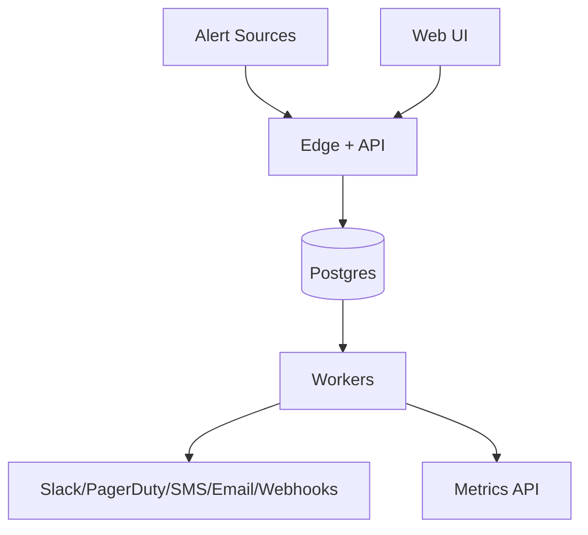

## Overview

This system turns high-volume alert signals into a small number of actionable incidents, routes them to the right responders with the right urgency, and provides the incident lifecycle (open/ack/resolve) with a durable audit trail. It supports multi-tenant ingestion from common sources, configurable deduplication/grouping, silences and inhibition, escalation policies with on-call schedules, SLO burn-rate alerting, and reliable delivery to notification providers and customer webhooks.

The core design principle is to keep correctness and durability inside one strongly consistent store, and to implement background processing and retries using the same database.

---

## Requirements

### Functional Requirements
- Ingest alert events from multiple sources (Prometheus/Alertmanager, CloudWatch, custom webhooks) with authentication and multi-tenancy.
- Normalize events into a canonical schema; validate required fields; reject malformed payloads with actionable errors.
- Deduplicate and group alert events into incidents using stable fingerprinting and configurable grouping keys.
- Apply silences (time-bounded muting) and inhibition (root-cause suppression).
- Route incidents via escalation policies (on-call schedules, rotations, time-based rules) to targets (Slack, PagerDuty, SMS, email, webhook).
- Support SLO alerting:
  - Store SLO definitions (objective, window, SLI query/source, alerting policy).
  - Evaluate burn-rate detectors and emit alert events into the same pipeline.
- Provide incident lifecycle and collaboration: open/ack/resolve, ownership, notes, timeline, attachments/links, and audit trail.
- Provide UI and APIs to manage rules, silences, policies, schedules, SLOs, and to search incidents/history.
- Provide outbound webhooks/events for incident automation (ticketing, auto-remediation, ChatOps).

### Non-Functional Requirements (Targets)
#### Scale (per region)
- Tenants: up to 10,000
- Monitored services: ~200,000
- Alert events ingest: avg ~600/sec, peak 10,000/sec, bursts up to 50,000/sec for 10 minutes
- Incidents: typical ~50,000/day; storms up to 5,000,000/day (requires storm protection and hard quotas)

#### Latency
- Ingest ACK (durable acceptance): P50 < 50ms, P99 < 250ms
- End-to-end routing (ingest → first notification attempt):
  - Critical: P50 < 2s, P99 < 8s
  - Non-critical: P50 < 10s, P99 < 60s (can be deprioritized during storms)
- UI reads (incident list/search): P50 < 200ms, P99 < 1s with pagination

#### Availability & Durability
- Ingest + routing: 99.99% (regional)
- UI/search: 99.9%
- Durability:
  - No loss of accepted alert events (RPO ≈ 0 once ACKed)
  - Incident state transitions are durable and ordered (no “ACK lost”)

#### Consistency Model
- Config writes: strong consistency (transactional, audited, versioned)
- Processing: at-least-once background execution with idempotent side effects
- UI reads: strongly consistent from the primary; optionally read-replica with clear “may lag” UX

### Constraints & Assumptions
- Multi-tenant SaaS with strict tenant isolation (authz, quotas, rate limits).
- Compliance: encryption in transit and at rest; audit logging required; optional data residency per region.
- Notification providers and customer webhooks are unreliable; system must tolerate partial outage.
- Metrics backend is external; SLO evaluation queries are remote and must be rate-limited and cached.

---

## Simplified Architecture

### High-Level

### Component Responsibilities

**Edge + API**
- Serves REST APIs for ingest, config, and incident lifecycle.
- Authn/authz (tenant identity derived from auth, not request payload).
- Rate limits and quotas (per tenant, per endpoint class).
- Validates and normalizes events, then durably records them.

**Postgres (single source of truth)**
- Stores: tenant config, audit log, accepted alert events, incident state, incident timeline, notification jobs, notification attempts.
- Provides: transactional consistency, uniqueness constraints for idempotency, and indexed search for the UI.

**Workers**
- Processor: consumes accepted alert events, applies dedupe/grouping/silences/inhibition, transitions incident state, enqueues notification jobs.
- Notifier: executes notification jobs with retries/backoff, tracks delivery attempts, supports dead-lettering and replay.
- SLO loop: periodically evaluates SLOs against the external metrics API and inserts generated alert events.

---

## Core Invariants (Correctness)

- **Durable acceptance**: an alert is ACKed only after its normalized event is committed in Postgres.
- **Idempotent side effects**: incident upserts and notification job creation are protected by unique constraints so retries or duplicates do not double-page.
- **Ordered incident mutations**: each incident’s state changes are serialized via row-level locking on the incident row inside a transaction.
- **Audited control plane**: every config change is versioned and written with an audit entry in the same transaction.

---

## Data Model (Postgres)

### Canonical Alert Event (conceptual)
- `event_id` (UUID)
- `tenant_id`
- `source`
- `received_at`
- `starts_at`, `ends_at` (nullable)
- `labels` (jsonb), `annotations` (jsonb)
- `fingerprint` (stable hash of normalized identity fields)
- `dedupe_key` (stable per underlying condition; used for incident identity)
- `severity` (enum)
- `raw` (optional: stored payload or reference)

Fingerprinting excludes volatile/high-cardinality labels unless explicitly configured.

### Tables (minimal set)

**Tenancy & Auth**
- `tenants(tenant_id, name, plan, region, created_at, status)`
- `users(user_id, tenant_id, email, role, created_at)`
- `api_keys(key_id, tenant_id, name, hashed_secret, scopes, created_at, last_used_at)`

**Config + Versioning**
- `tenant_config(tenant_id, config_version, updated_at)`
- `routing_rules(rule_id, tenant_id, name, match_expr, group_by_json, policy_id, enabled, version, updated_at)`
- `inhibition_rules(inhibit_id, tenant_id, name, source_match_expr, target_match_expr, equal_labels_json, enabled, version, updated_at)`
- `escalation_policies(policy_id, tenant_id, name, steps_json, repeat_interval_sec, version, updated_at)`
- `schedules(schedule_id, tenant_id, name, timezone, rotation_json, overrides_json, version, updated_at)`
- `silences(silence_id, tenant_id, name, match_expr, starts_at, ends_at, created_by, created_at, status)`
- `slos(slo_id, tenant_id, name, service, sli_query, objective, window_days, alerting_config_json, version, updated_at, enabled)`

**Accepted Events (append-only)**
- `alert_events(event_id, tenant_id, source, received_at, starts_at, ends_at, labels, annotations, fingerprint, dedupe_key, severity, raw, processed_at, processing_attempts)`
- Partition `alert_events` by day (or week) for retention and ingest performance.

**Incident State + Timeline**
- `incidents(incident_id, tenant_id, dedupe_key, status, severity, title, policy_id, owner, created_at, updated_at, last_event_at, config_version, row_version)`
- `incident_events(event_id, tenant_id, incident_id, type, payload_json, created_at)` (timeline entries)

**Notification Execution**
- `notification_jobs(job_id, tenant_id, incident_id, action_key, channel, target, payload_json, run_at, status, attempt, last_error, created_at, updated_at)`
- `notification_attempts(attempt_id, tenant_id, job_id, provider, provider_msg_id, status, error, started_at, finished_at)`

**Audit**
- `audit_log(audit_id, tenant_id, actor, action, object_type, object_id, diff_json, created_at)`

**Idempotency (optional but recommended)**
- `idempotency_keys(tenant_id, scope, key, request_hash, response_json, created_at, expires_at)`
  - Used for safe client retries on ingest and selected control-plane writes.

### Recommended Constraints & Indexes
- Unique: `incidents(tenant_id, dedupe_key)`
- Unique: `notification_jobs(tenant_id, incident_id, action_key)`
- Index: `alert_events(tenant_id, processed_at, received_at)`
- Index: `incidents(tenant_id, status, severity, updated_at desc)`
- GIN index: `incidents.labels` (if materialized) and/or `alert_events.labels` for filtering
- Full-text: `incidents.title` and selected note fields for UI search

---

## Data Flow

### Ingest → Incident → Notification

1. **Ingest (sync, fast)**
   - `POST /v1/alerts` accepts bulk events.
   - The API authenticates, enforces rate limits, normalizes events, computes `fingerprint` + `dedupe_key`, and inserts rows into `alert_events`.
   - Response is `202 Accepted` with an `ingest_id` once the DB transaction commits.

2. **Processing (async, idempotent)**
   - Processor workers claim unprocessed rows:
     - `SELECT ... FROM alert_events WHERE processed_at IS NULL ORDER BY received_at LIMIT N FOR UPDATE SKIP LOCKED`
   - For each event, in a transaction:
     - Load tenant config snapshot by `tenant_config.config_version` (cached in worker memory with short TTL).
     - Apply silences and inhibition.
     - Upsert `incidents` by `(tenant_id, dedupe_key)` and lock the incident row to serialize changes.
     - Append `incident_events` timeline entries.
     - Insert `notification_jobs` as needed (unique `action_key` prevents duplicates).
     - Mark `alert_events.processed_at`.

3. **Notification delivery (async, retried)**
   - Notifier workers claim due jobs:
     - `SELECT ... FROM notification_jobs WHERE status IN ('pending','retry') AND run_at <= now() ORDER BY run_at LIMIT N FOR UPDATE SKIP LOCKED`
   - Execute provider call, write `notification_attempts`, update job status/run_at with exponential backoff + jitter.
   - Dead-letter after max attempts; UI/API supports replay.

### SLO Evaluation
- Workers poll enabled SLOs on a cadence (e.g., every 30–60s) with per-tenant concurrency limits.
- Each evaluation reads from the external Metrics API, applies multi-window/multi-burn-rate logic, then inserts an `alert_events` row with `source='slo'`.

---

## API Design

### Authentication & Tenant Identity
- Tenant identity derived from auth (API key/OAuth/mTLS); `tenant_id` in payload is ignored.
- Scopes: `alerts:write`, `config:read/write`, `incidents:read/write`, `slo:read/write`.

### Ingest API

**POST `/v1/alerts`** (bulk supported)
- Headers:
  - `Authorization: Bearer <token>`
  - `Idempotency-Key: <uuid>` (recommended)
  - `Content-Encoding: gzip` (recommended for bulk)
- Response: `202 Accepted` after commit.

Errors:
- `400` invalid schema (include JSON pointer paths)
- `401/403` authn/authz
- `413` payload too large
- `429` rate limited (`Retry-After`)
- `503` only for true dependency failure (e.g., DB unavailable)

### Control Plane APIs (selected)
- Silences: `POST /v1/silences`, `GET /v1/silences`, `DELETE /v1/silences/{id}`
- Routing rules: `POST /v1/routing-rules`, `PUT /v1/routing-rules/{id}`
- Incidents: `GET /v1/incidents`, `GET /v1/incidents/{id}`, `POST /v1/incidents/{id}:ack`, `POST /v1/incidents/{id}:resolve`, `POST /v1/incidents/{id}:note`
- Concurrency control: `ETag` + `If-Match` on config resources.

Config writes:
- Transactionally write config rows + `audit_log`, bump `tenant_config.config_version`.

### Outbound Webhooks
- Signed payloads (HMAC), include `delivery_id` and `attempt`.
- Retries with backoff/jitter; dead-letter with replay and delivery logs.

---

## Scaling, Overload, and Reliability

### Postgres-first performance strategy
- Partition `alert_events` and `incident_events` by time for predictable retention and write performance.
- Keep ingest transactions small (single insert per event row in bulk, minimal secondary indexes on `alert_events` hot path).
- Use pooled connections and prepared statements; keep payloads small (store large raw payloads optionally).

### Storm protection (tenant guardrails)
- Rate limits at Edge for `/alerts` and `/config` separately.
- Hard caps per tenant (plan-based), enforced by:
  - ingest-side sampling/429 for extreme event rates
  - processor-side safe-mode per tenant when incident creation or notification fanout exceeds thresholds:
    - critical-first routing
    - notify-on-change (suppress repeats/reminders)
    - bounded evaluation cost per event (skip expensive enrichment first)

### Availability & durability
- Stateless API and workers deployed across multiple AZs.
- Managed Postgres HA with automatic failover and PITR (WAL archiving).
- “Accepted” means committed in Postgres; background work is retried until completed or dead-lettered.

### UI search
- Primary approach: indexed queries in Postgres (status/severity/time filters + JSONB/FTS where needed).
- Optional read replica for UI-heavy workloads with clear “may lag” UX.

---

## Operations

### Platform SLOs
- Ingest availability (accept or explicit 429): 99.99%
- Critical time-to-first-notify: P99 < 8s
- Duplicate notification rate: < 0.1% of notifications
- Incident state correctness: no illegal transitions; monotonic timeline ordering per incident

### Monitoring (golden signals)
- Ingest: RPS, P99 latency, 429 rate, DB commit latency, accepted/sec by tenant
- Processing: unprocessed `alert_events` depth/age, processing latency, incident creation/sec, silence/inhibition hit rate
- Notifications: time-to-first-notify, provider success/error rates, pending job depth/age, dead-letter counts
- Control plane: config write latency, config_version bump rate, audit write failures
- SLO loop: metrics query volume, query latency/error rate, per-tenant throttling rate

### Minimum runbooks
- “Backlog rising”: identify top tenants/events, enable tenant safe-mode, tighten rate limits, scale workers
- “Provider degraded”: circuit-break provider, reroute critical channels, pause repeats, communicate status
- “DB failover”: verify failover, watch backlog catch-up, confirm job execution resumes
- “Bad config change”: inspect audit entry, rollback via version history, apply break-glass default route for critical

---

## Simplification Notes

- Removed: separate event bus; durable buffering and at-least-once execution handled by `alert_events` and job claiming via `FOR UPDATE SKIP LOCKED` in Postgres.
- Removed: dedicated cache layer; hot config and rule evaluation use in-worker memory caching with short TTL and `config_version` invalidation.
- Removed: separate search/analytics datastore; UI search uses Postgres indexes (JSONB + full-text) and optional read replicas.
- Merged: data plane and control plane into one service with modules (API + Processor + Notifier + SLO loop) to keep transactions and auditing straightforward.
- Merged: outbox relay into the same job tables; notification enqueue and incident mutation occur in one database transaction.
- Complexity that remains: silences/inhibition/routing logic, idempotency via uniqueness constraints, and storm protection guardrails—these are required for correct incident routing and safe behavior under alert storms.