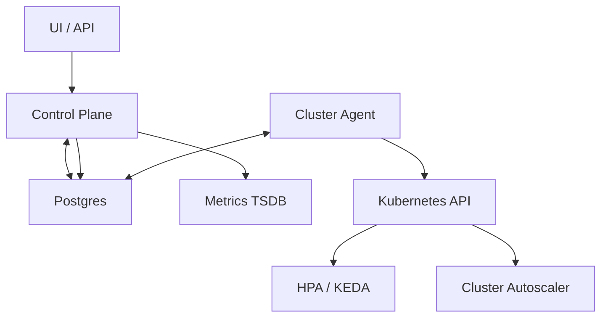
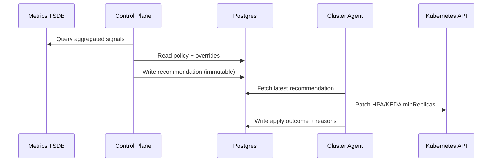

## Overview

Predictive autoscaling provisions compute capacity **ahead of demand** using recent history, longer-term seasonality, and scheduled events. The system runs a simple, safe control loop:

1. **Sense**: read low-cardinality, per-service signals and validate freshness.
2. **Predict**: forecast demand 5–60 minutes ahead with uncertainty (quantiles).
3. **Decide**: convert demand to replicas using a per-service capacity model and safety margins.
4. **Act**: update Kubernetes autoscaler minima within strict guardrails.
5. **Verify**: measure outcomes and continuously backtest for drift.

The design preserves reactive autoscaling for fast spikes by integrating with **HPA/KEDA** and relying on **Cluster Autoscaler/Karpenter** for nodes.

---

## Requirements

### Functional
- Forecast service demand **5–60 minutes ahead** at multiple horizons (e.g., 5/10/30/60).
- Support per-service demand signals (select per workload):
  - **RPS/QPS**, **in-flight concurrency**, **queue depth/backlog**.
  - Context signals: CPU, memory, latency, error rate, saturation indicators.
- Convert forecast demand into capacity using a per-service **capacity model**:
  - QPS-per-pod-at-SLO, concurrency-per-pod-at-SLO, or queue drain model.
- Apply safety margins based on:
  - Forecast uncertainty (quantiles + confidence),
  - Warmup time (pods, nodes, caches),
  - Risk tolerance (service tier / error budget).
- Support scheduled events and overrides.
- Provide backtesting and reporting: accuracy, calibration, SLO impact, and cost impact.
- Enforce actuation guardrails:
  - min/max bounds, rate limits, cooldowns, circuit breakers, and safe modes.
- Provide explainability and auditability for every scaling decision and change.

### Non-Functional (example targets)
- Fleet: **5,000 services** across **200 clusters**.
- Forecast cadence: every **1 minute** per service.
- Recommendation freshness SLO: **P99 < 90s** from minute boundary to persisted recommendation.
- Availability: control-plane API **99.95%** (multi-AZ).
- Safety: fail closed (stop proactive changes) while preserving reactive autoscaling.
- Consistency: strong consistency for policies/overrides/audit; derived computations can be eventually consistent.

---

## Simplified Architecture

### Control Loop
- The **Control Plane** computes and persists recommendations.
- A lightweight **Cluster Agent** applies changes to Kubernetes and records outcomes.
- **HPA/KEDA** handles reactive scaling; **Cluster Autoscaler/Karpenter** handles nodes based on pending pods.

---

## Components

### 1) Signals (TSDB + Events)
**Inputs**
- Aggregated, per-service signals produced via recording rules (preferred):
  - `service:rps_1m`, `service:latency_p99_1m`, `service:error_rate_1m`, `service:inflight_1m`, `service:queue_depth_1m`.
- Scheduled events and overrides (stored in Postgres).

**Freshness & Missingness**
- Treat “no traffic” vs “no data” distinctly.
- Compute a freshness SLI per signal (e.g., last sample age) and feed it into confidence and safety logic.

---

### 2) Control Plane (Forecast + Policy + Reporting)
A single service with three internal modules.

**A. Forecasting**
- Runs every minute, partitioned by `service_id`.
- Production-first model set:
  - Seasonal naive baselines (yesterday/last week same time),
  - EWMA smoothing for recent dynamics,
  - Quantiles derived from recent residuals per horizon (calibrated per service tier when available).
- Outputs per horizon:
  - `p50/p90/p99` (or policy-defined),
  - `confidence_score` (freshness, residual stability, recent error),
  - `model_version`.

**B. Capacity & Risk Policy**
- Converts forecasted demand into desired replicas using the service’s capacity model:
  - **QPS-per-pod-at-SLO**: `replicas = ceil(qps / qps_per_pod_slo)`
  - **Concurrency-per-pod-at-SLO**: `replicas = ceil(concurrency / concurrency_per_pod_slo)`
  - **Queue drain**: `workers = ceil(backlog / (target_drain_time * work_rate_per_worker))`
- Applies safety margins:
  - Quantile selection by service tier and confidence (e.g., default P90; event windows P95/P99),
  - Warmup buffer (pods/nodes/caches),
  - Headroom floor (e.g., +10–20% or +N replicas for critical tiers).
- Enforces guardrails:
  - min/max replicas, scale-up/down rate limits, cooldowns, and change thresholds.
- Persists an immutable recommendation with full decision context for audit/explainability.

**C. Backtesting & Drift Monitoring**
- Nightly (or periodic) jobs that:
  - Compare forecasts vs actuals per horizon and tier,
  - Track calibration (e.g., P90 contains actual ~90%),
  - Track outcomes correlated with applied changes (SLO burn, pending pods, oscillation),
  - Gate model rollouts using stored thresholds.

---

### 3) Cluster Agent (Actuation + Outcomes)
A small per-cluster deployment that:
- Polls for the latest applicable recommendations for services in its cluster.
- Applies changes safely:
  - Primary actuation: patch **HPA/KEDA `minReplicas`** (bounded and rate-limited).
  - Scale-down is conservative and respects cooldown and stabilization windows.
- Records outcomes:
  - apply success/failure, blocked reason codes, observed pending pod duration, and time-to-effective-capacity.
- Safe modes (per service and global):
  - `OBSERVE_ONLY`, `APPLY`, `FREEZE`, `REACTIVE_ONLY`.

---

## Data Flow

---

## Storage Design (Postgres)

Single authoritative store for policies, overrides, recommendations, outcomes, and audit.

### Core Tables
- `services(service_id, cluster_id, namespace, workload_ref, owner_team, tier, created_at)`
- `scaling_policies(service_id, min_replicas, max_replicas, warmup_seconds, cooldown_seconds, scale_up_rate_limit, scale_down_rate_limit, risk_quantile_default, headroom_pct, capacity_model_type, capacity_model_params_json, mode, version, updated_at)`
- `overrides(override_id, service_id, start_time, end_time, forced_min_replicas, risk_quantile, reason, created_by, created_at)`
- `recommendations(rec_id, service_id, generated_at, horizon_minutes, forecast_p50, forecast_p90, forecast_p99, chosen_quantile, desired_min_replicas, confidence_score, model_version, inputs_freshness_seconds, decision_json)`
- `apply_events(event_id, service_id, rec_id, cluster_id, applied_at, result, blocked_reason_code, old_min_replicas, new_min_replicas, k8s_error, pending_pods_observed_seconds)`
- `audit_log(audit_id, service_id, ts, actor, action, request_id, details_json)`

### Retention
- Policies/overrides/audit: per compliance requirements.
- Recommendations/apply_events: 30–90 days online; older data summarized daily into a compact table (optional) and deleted.

---

## API Design

### Control Plane REST
- `PUT /v1/services/{serviceId}/policy` (optimistic concurrency via `version`)
- `POST /v1/services/{serviceId}/overrides` (idempotency via `Idempotency-Key`)
- `GET /v1/services/{serviceId}/recommendations?from=...&to=...`
- `GET /v1/services/{serviceId}/apply-events?from=...&to=...`
- `GET /v1/services/{serviceId}/audit?from=...&to=...`

### Cluster Agent Auth
- Cluster-scoped identity that can:
  - read recommendations for its cluster,
  - write apply outcomes,
  - patch only the permitted HPA/KEDA resources in its namespaces.

---

## Scaling & Performance

### Controlling TSDB Pressure
- Use recording rules to keep inputs low-cardinality and cheap to query.
- Query only the minimum windows needed per minute (recent + seasonal anchors).
- Apply jitter and per-cluster concurrency caps; cache recent query results in-memory within the Control Plane.

### Control Plane Throughput
- Stateless workers partition by `service_id` (shards).
- Store a “work cursor” per shard; retry with backoff on TSDB errors.
- Write recommendations in batches per shard to reduce DB overhead.

### Kubernetes API Safety
- Apply only material changes (e.g., `max(5%, 2 replicas)` threshold).
- Rate-limit per namespace/service; prioritize scale-up over scale-down.
- Backoff and record `K8S_THROTTLED` / `K8S_TIMEOUT` reason codes.

---

## Failure Modes & Mitigations

- **Stale metrics / TSDB outage**
  - Detect via freshness SLIs and TSDB error rate.
  - Response: `FREEZE` proactive changes; preserve HPA/KEDA reactive behavior.
- **Model drift**
  - Detect via backtesting regressions and calibration failures by tier.
  - Response: downgrade to baseline model parameters and/or safer quantile selection; require gated promotion for new model versions.
- **Bad policy / capacity model params**
  - Detect via “max bound hit + SLO burn” and abnormal scale deltas.
  - Response: hard global caps, tier-based limits, and fast rollback via versioned policies.
- **Kubernetes API throttling**
  - Detect via apply failure ratio and retry backoff metrics.
  - Response: slow down writes, prioritize critical tiers, and record blocked reasons for visibility.

---

## Operations

### What to Page On
- Recommendation freshness breach (e.g., >5 minutes for >10% services).
- Apply success rate drop or sustained Kubernetes API throttling.
- Scale-up blocked by max bounds while SLO burn is high for critical tiers.
- Calibration regression for the active model version.

### Dashboards
- Control plane: forecast throughput, shard lag, TSDB latency/errors, DB latency, model version distribution, confidence distribution.
- Actuation: applied vs blocked by reason code, change magnitude, reconcile/apply latency, pending pod durations.
- Outcomes: error budget burn, p99 latency, error rate, estimated headroom and cost impact.

### Rollout
- `OBSERVE_ONLY` → `APPLY` per tier via policy mode.
- Canary by selecting service subsets; promote on “no SLO harm” + stable calibration + acceptable cost.

---

## Simplification Notes

- Removed: separate Feature Builder store and OLAP warehouse; acceptable because the system consumes aggregated TSDB signals and retains only compact, time-bounded recommendations and outcomes in Postgres.
- Removed: dedicated Audit Log system; acceptable because an append-only audit table in Postgres provides durable, queryable history with strong consistency.
- Removed: CRD-based handoff and multiple control-plane services; acceptable because recommendations and apply outcomes are coordinated through Postgres with clear ownership (Control Plane decides, Cluster Agent applies).
- Merged: feature building, forecasting, policy evaluation, and reporting into one Control Plane service; acceptable because these functions share the same inputs and lifecycle and benefit from consistent guardrails and one deployment surface.
- Kept: per-cluster agent; necessary for Kubernetes API locality, least-privilege access, and isolation of apply failures by cluster.
- Kept: quantiles, confidence scoring, and strict guardrails; necessary to make proactive scaling safe under uncertainty and partial failures.