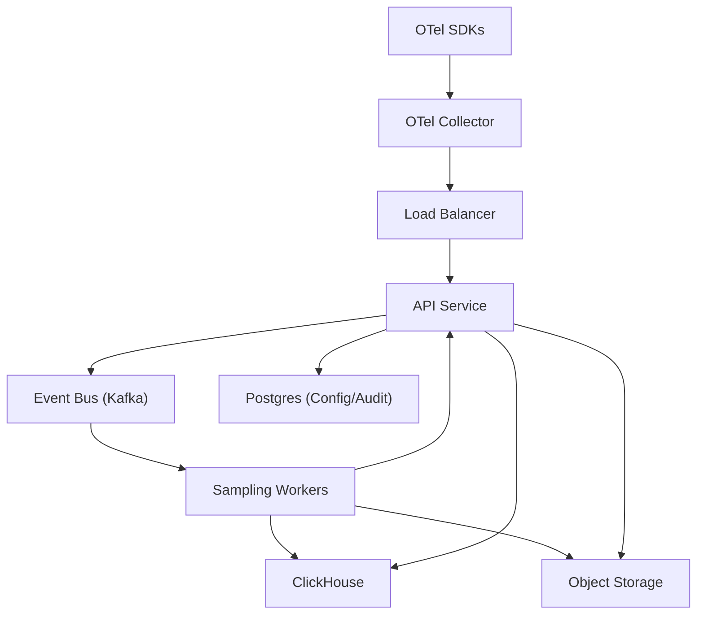

## Overview

This system is a multi-tenant distributed tracing backend that ingests OpenTelemetry spans, applies strict cost and safety controls, performs trace-level (tail) sampling, and serves low-latency search and trace retrieval for debugging and incident response.

The design keeps the ingest path fast and durable, concentrates tail-sampling logic in a small worker tier, and uses a single hot analytics store for search plus object storage for low-cost retention.

---

## Requirements

### Functional
- Ingest OTLP (gRPC/HTTP) from SDKs and collectors.
- Head sampling (probabilistic/rule-based/rate-limited) with per-tenant and per-service/route config.
- Tail sampling policies: error/status, latency thresholds, attribute match, bounded rare-path detection.
- Cost controls: per-tenant budgets (bytes/s, spans/s), payload and span caps, attribute governance, cardinality guards, retention tiers.
- Persist sampled traces for:
  - search by service/operation/time/tags/duration/error
  - retrieval by `trace_id` (full trace)
- Admin APIs/UI support for sampling rules, budgets, transparency (keep/drop reasons), and tenant usage.
- Strict multi-tenancy: authn/z, quotas, noisy-neighbor protection, audit logs.

### Non-functional targets
- Peak ingest: 5M spans/s; peak query: 2,000 QPS.
- Ingest ACK: P50 30ms, P99 150ms (ACK after durable write).
- Tail decision latency: P50 2s, P99 8s.
- Query: search P50 200ms/P99 1.5s; get-by-id (hot) P50 50ms/P99 300ms.
- Availability: ingest 99.99%, query 99.9% (degraded modes allowed).

---

## Simplified Architecture

### Key data paths
- **Ingest**: Collector → API Service → Kafka (durable) → ACK to collector.
- **Tail sampling + persistence**: Sampling Workers consume spans → build trace context → decide keep/drop → write kept data to ClickHouse (hot) and optionally to object storage (cold/archive) → write a compact decision record.
- **Query**:
  - Search: API Service → ClickHouse `trace_index`.
  - Trace-by-id: API Service → ClickHouse (hot spans) → object storage fallback (older traces).

---

## Components

### 1) SDKs & Collectors (Edge)
**Responsibilities**
- OTLP export batching and retries.
- Payload shaping: truncate stacktraces/events, enforce attribute allow/deny lists, cap sizes.
- Deterministic head sampling (hash on `trace_id` + tenant salt) for consistent upstream decisions.
- Disk-backed send queue for short backend disruptions.

**Recommended OpenTelemetry Collector features**
- `batch`, `memory_limiter`, `attributes`/`transform`, disk-backed `sending_queue`.

---

### 2) API Service (Ingest + Query + Admin)
A single stateless service that exposes:
- **Ingest endpoints** (OTLP gRPC/HTTP): authn/z, tenant identification, hard caps, per-tenant rate limiting, schema validation.
- **Query endpoints**: search and trace-by-id with RBAC, admission control, and pagination.
- **Admin endpoints**: sampling rules, budgets, governance settings, and audit visibility.

**Durable ingest semantics**
- ACK after Kafka write (`acks=all`, `min.insync.replicas` set) to meet latency while ensuring durability for successfully acknowledged data.

**Fairness**
- Per-tenant token buckets for bytes/s and spans/s; explicit `429` shedding with `Retry-After`.

---

### 3) Event Bus (Kafka)
Kafka provides:
- Durable decoupling between ingest and tail sampling.
- Short retention for reprocessing (15–60 minutes).
- Partitioning to co-locate spans for a trace: key `tenant_id + trace_id`.

This keeps ingest resilient during downstream storage pressure and bounds tail worker replay needs.

---

### 4) Sampling Workers (Tail Decision Engine)
A horizontally scalable worker tier consuming Kafka partitions.

**Responsibilities**
- Assemble spans into a trace within a bounded window.
- Evaluate tail policies and enforce tenant budgets at the “kept” boundary.
- Persist:
  - kept traces to ClickHouse (hot search + retrieval)
  - optional long retention to object storage
  - decision records for transparency and accounting

**Bounded buffering**
- Maintain per-trace state keyed by `(tenant_id, trace_id)`:
  - dedupe set on `(span_id)` within TTL
  - trace summary (duration, error flags, services/routes)
  - timestamps (first/last seen)
- Decision triggers:
  - inactivity timeout (2–5s)
  - hard max window (10–30s)
  - optional “root ended + grace” when available

**Rare-path detection (bounded)**
- Maintain per-tenant/service sketches over a sliding window (e.g., approximate counts per `http.route` or other governed attribute).
- Mark traces as “rare” only for keys inside the governed attribute set and under strict memory limits.

**Decision records**
- Always write a compact record for kept traces; optionally for drops (configurable) to support “why dropped?”, usage accounting, and anomaly detection.

---

### 5) Storage

#### Hot store: ClickHouse
ClickHouse is the primary query surface:
- Fast search over trace metadata.
- Efficient retrieval of spans by `trace_id`.
- Simple TTL-based retention tiers (hot/warm) per tenant.

#### Cold retention: Object storage
Object storage holds long-retained traces cheaply:
- Stored as time-partitioned files (Parquet or compressed protobuf blocks), organized by tenant and date/hour.
- Written asynchronously by Sampling Workers (or a lightweight exporter job) without affecting ingest ACK.

#### Minimal archive lookup
A small ClickHouse table maps `(tenant_id, trace_id)` → `{object_key, offsets, ts}` for cold retrieval, keeping trace-by-id reliable without a separate cache/index service.

---

### 6) Config & Audit: Postgres
Postgres stores:
- Tenant definitions, RBAC mappings, sampling policies, budgets, governance allow/deny lists, retention tiers.
- Immutable audit log of config and incident-mode changes.

Workers fetch versioned config from the API Service (ETag/versioned polling), keeping data plane dependencies minimal.

---

## Data Model (Hot + Archive)

### ClickHouse tables (core)
- `trace_index`: one row per kept trace (search surface).
- `spans`: kept spans for trace retrieval.
- `trace_decisions`: `{tenant_id, trace_id, decision, reason, policy_id, effective_rate, ts, budget_state}`.
- `trace_archive`: `{tenant_id, trace_id, object_key, byte_range/offsets, ts}` (only when archived).

**Retention tiers**
- TTL policies on `spans` and `trace_index` implement hot/warm durations.
- `trace_archive` retains as long as object storage retention requires.

---

## APIs

### Ingestion (OTLP)
- OTLP/HTTP: `POST /v1/traces`
- OTLP/gRPC: `TraceService/Export`

**Responses**
- `401/403` auth failures
- `429` tenant over budget/rate limited (`Retry-After`)
- `413` payload too large
- `400` invalid OTLP

**Delivery**
- Successful ACK means spans are durably written to Kafka; downstream is at-least-once with dedupe in workers.

---

### Query
- `GET /api/v1/traces/{traceId}`
- `POST /api/v1/traces/search`

**Query protections**
- Mandatory time range for search, bounded max range.
- Cursor pagination, fixed limits.
- Per-tenant query QPS and scan budget limits (bytes/partitions).

---

### Admin
- `GET/PUT /api/v1/tenants/{tenantId}/sampling-rules` (versioned, atomic replace, supports dry-run)
- `GET/PUT /api/v1/tenants/{tenantId}/budgets`
- `GET/PUT /api/v1/tenants/{tenantId}/governance`
- `GET /api/v1/tenants/{tenantId}/usage` (bytes/spans kept/dropped by reason)

---

## Scaling & Operations

### Horizontal scaling levers
- **API Service**: stateless autoscaling on CPU, ingress bytes, 429 rate, Kafka produce latency.
- **Kafka**: partitions sized to trace concurrency; monitor ISR health and consumer lag.
- **Sampling Workers**: scale with partitions; enforce per-tenant caps on in-flight traces and buffered bytes.
- **ClickHouse**: distributed cluster with ingest-optimized tables; separate query replicas if needed.

### Degraded modes (safety-first)
- Tighten head sampling and payload shaping at collectors via config updates.
- Tighten budgets and max spans/trace at the API Service.
- Reduce search features (stricter tag filters / smaller max range) while preserving trace-by-id for recently kept traces.

### Availability & DR
- Multi-AZ within a region for API/Kafka/ClickHouse.
- Multi-region as a DR/secondary deployment with collectors configured for failover endpoints; config is reproducible from Postgres backups and audit log.

---

## Security & Compliance

- Authn/z: mTLS from collectors; JWT/OAuth for query/admin; RBAC per tenant.
- Tenant isolation: per-tenant quotas, per-tenant query admission control, strict tenant scoping on all storage queries.
- Encryption: TLS in transit; encryption at rest for ClickHouse disks and object storage.
- PII controls: governed allow/deny lists, truncation, hashing for sensitive identifiers as policy.
- Audit logs: all config and incident-mode changes stored immutably in Postgres.

---

## Simplification Notes

- Removed: `Trace Lookup Index + Cache (KV/Redis)`; trace-by-id uses ClickHouse hot tables with a small ClickHouse `trace_archive` mapping for object storage fallback.
- Removed: separate “Control Plane” service; admin/config endpoints live in the API Service, with Postgres as the single config and audit store.
- Merged: ingest gateway + query API + admin API into one stateless `API Service` to reduce deployables and operational surfaces.
- Simplified: cold retention indexing; archive pointers are recorded at write time in `trace_archive`, avoiding separate sidecar index and compaction-index workflows.
- Complexity retained: Kafka (durable ingest decoupling at 5M spans/s), tail sampling workers (trace-level decisions with bounded buffering), ClickHouse (hot search at scale); these directly support durability, latency targets, and multi-tenant cost enforcement.