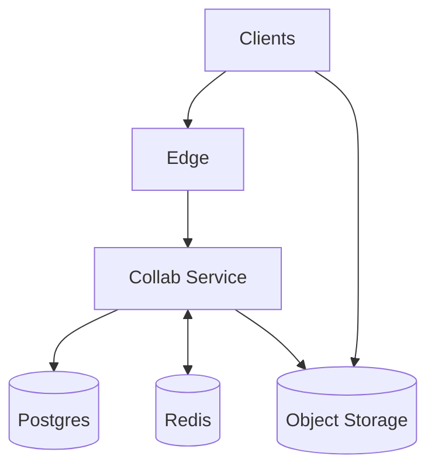
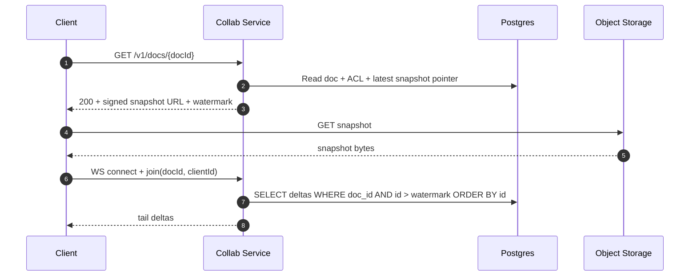
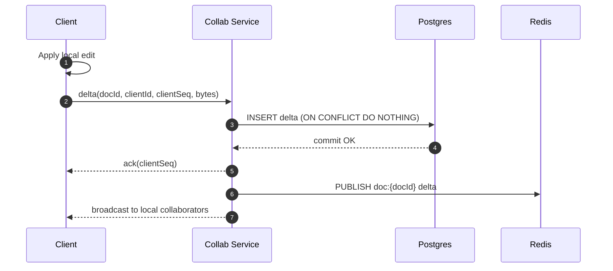

## Overview

This system enables Google Docs–style collaborative editing with real-time updates, offline support, and guaranteed convergence under concurrency, retries, reordering, duplication, and network partitions.

The core idea is:
- Clients apply edits optimistically using a **delta-based CRDT** and send deltas to the server.
- The server durably records deltas, broadcasts them to other connected collaborators, and periodically produces **snapshots** for fast joins and bounded replay.

Strong consistency is required for identity, permissions, and administrative actions. Document content convergence is achieved by the CRDT merge model.

---

## Requirements

### Functional Requirements
- Document lifecycle: create, rename, delete/restore; folders/projects.
- Real-time multi-user editing: concurrent edits, cursor/selection, presence.
- Convergence under concurrency, reordering, duplication, and partitions.
- Offline editing with background sync and automatic reconciliation on reconnect.
- Version history: view timeline and restore a previous version.
- Fine-grained sharing: owner/editor/commenter/viewer; link sharing; revoke access.
- Comments and suggestions mode; resolve/reopen; anchored to document ranges.
- Import/export (PDF/DOCX/Markdown) with best-effort fidelity.
- Security and audit: access logs and admin visibility into sharing and exports.

### Non-Functional Requirements (Targets)
- Low latency: local apply is immediate; remote propagation P50 < 100 ms, P99 < 300 ms (same region).
- Availability: 99.99% for join/read; 99.9% for realtime fanout/ack with graceful degradation.
- Consistency:
  - Strong: auth, ACL checks, membership, export permissions, quotas.
  - Eventual: document content convergence, presence/awareness.
- Durability: no silent data loss; RPO ≤ 1 minute, RTO ≤ 30 minutes.

### Constraints & Assumptions
- Web + mobile; WebSockets supported with fallback to SSE/long-polling.
- Rich text + embeds; binaries stored separately and referenced by ID.
- Managed Postgres, Redis, and object storage are available.

---

## Simplified Architecture

A single backend service handles REST + WebSockets + background jobs (snapshotting and exports). Postgres stores metadata, ACLs, comments, audit logs, and the append-only delta log. Object storage stores snapshots and binary attachments. Redis provides best-effort presence and cross-instance fanout.

### What Each Part Does
- **Edge**: TLS termination, WAF/rate limits, routing, CDN behavior for large immutable objects (snapshots/blobs).
- **Collab Service**: REST APIs, WebSocket sessions, authorization checks, durable delta ingestion, real-time fanout, snapshotting, export jobs.
- **Postgres**: system of record for metadata + ACLs + comments + audit + delta log + snapshot pointers.
- **Redis**: ephemeral presence (TTL), doc-channel pub/sub for cross-instance broadcasts, lightweight routing hints.
- **Object Storage**: immutable CRDT snapshots and document attachments (served via signed URLs).

---

## Core Design

### Document Content Model (CRDT)
- Clients run a proven rich-text CRDT engine (Yjs-like).
- Edits produce **compact deltas** that are mergeable in any order and safe under duplication.
- Clients maintain a per-device identity (`clientId`) and a monotonic `clientSeq` to support idempotent retries.

### Durable Delta Log (in Postgres)
- Every accepted delta is inserted into an append-only table inside a transaction.
- The server acknowledges a delta only after commit (“durable-first ACK”).
- A unique constraint on `(doc_id, client_id, client_seq)` makes retries safe.

### Snapshots
- Snapshots are immutable serialized CRDT states stored in object storage.
- Postgres tracks the latest snapshot pointer and a **watermark** (last delta log row included).
- Joining a document typically loads: snapshot → deltas after watermark.

### Presence and Cursors
- Presence is best-effort and isolated from durability.
- Presence updates are rate-limited and stored in Redis with short TTLs.

---

## Components

### 1) Client (Editor + CRDT Engine)
**Responsibilities**
- Apply local edits instantly and generate CRDT deltas.
- Queue offline deltas and resend on reconnect (idempotent via `clientSeq`).
- Merge remote deltas and render collaboratively.
- Send presence/cursor updates at a controlled frequency.

### 2) Collab Service (REST + WebSockets + Workers)
**Responsibilities**
- Authenticate and authorize every join and every durable write.
- Maintain WebSocket sessions and per-document rooms.
- Insert deltas into Postgres with idempotency and durable ACKs.
- Broadcast deltas to collaborators (local sessions + Redis pub/sub).
- Run background jobs:
  - Snapshot creation/rotation
  - Export jobs (PDF/DOCX/Markdown)

### 3) Postgres (Metadata + ACL + Deltas)
**Responsibilities**
- Strongly consistent ACL decisions and auditing.
- Append-only delta log for replay, debugging, and recovery.
- Snapshot pointers and version history metadata.

### 4) Redis (Ephemeral Realtime Support)
**Responsibilities**
- Presence state with TTL (`presence:{docId}`).
- Pub/Sub channels per doc (`doc:{docId}`) to fan out deltas across service instances.

### 5) Object Storage (Snapshots + Blobs)
**Responsibilities**
- Immutable snapshots and attachments.
- Signed URLs for client download/upload.
- Optional CDN caching for immutable snapshot objects.

---

## Data Model (Postgres)

### documents
- `doc_id (uuid, pk)`
- `owner_id (uuid, indexed)`
- `title (text)`
- `created_at, updated_at (timestamptz)`
- `latest_snapshot_id (uuid, null)`
- `latest_snapshot_watermark (bigint, null)` — last included delta row id
- `deleted_at (timestamptz, null)`

### document_acl
- `doc_id (uuid, pk part, indexed)`
- `principal_type (user|group|link)`
- `principal_id (uuid/text, pk part)`
- `role (owner|editor|commenter|viewer)`
- `created_at, updated_at`

### doc_deltas (append-only)
- `id (bigserial, pk)`
- `doc_id (uuid, indexed)`
- `client_id (uuid)`
- `client_seq (bigint)`
- `delta_bytes (bytea)` — compressed
- `ts (timestamptz)`
- Unique: `(doc_id, client_id, client_seq)`
- Index: `(doc_id, id)`

### snapshots
- `snapshot_id (uuid, pk)`
- `doc_id (uuid, indexed)`
- `watermark_id (bigint)` — last delta id included
- `object_key (text)` — location in object storage
- `sha256 (bytea)`
- `size_bytes (bigint)`
- `created_at (timestamptz)`

### comments
- `comment_id (uuid, pk)`
- `doc_id (uuid, indexed)`
- `author_id (uuid)`
- `anchor (jsonb)` — CRDT-relative anchor
- `body (text)`
- `status (open|resolved)`
- `created_at, updated_at`

### versions (optional named checkpoints)
- `version_id (uuid, pk)`
- `doc_id (uuid, indexed)`
- `snapshot_id (uuid)`
- `label (text, null)`
- `created_at`
- `created_by (uuid)`

### export_jobs
- `job_id (uuid, pk)`
- `doc_id (uuid, indexed)`
- `format (pdf|docx|markdown)`
- `status (queued|running|done|failed)`
- `result_object_key (text, null)`
- `created_at, updated_at`

### audit_log
- `event_id (uuid, pk)`
- `doc_id (uuid, indexed)`
- `actor_id (uuid, indexed)`
- `action (share|revoke|edit_session|comment|export|delete|restore)`
- `ts (timestamptz, indexed)`
- `metadata (jsonb)`

---

## Data Flow

### Join + Catch-up

### Editing (Durable + Fanout)

---

## API

### REST (Examples)
- `POST /v1/docs` — create document
- `GET /v1/docs/{docId}` — metadata + role + signed snapshot URL + watermark
- `POST /v1/docs/{docId}:share` — grant role (Idempotency-Key supported)
- `POST /v1/docs/{docId}:revoke` — revoke access
- `POST /v1/docs/{docId}:export` — enqueue export job
- `GET /v1/exports/{jobId}` — poll job status + download URL
- `POST /v1/docs/{docId}/comments` / `PATCH /v1/comments/{commentId}` — comment lifecycle

### WebSocket (Conceptual)
- `join`: `{ type, docId, clientId, schemaVer }`
- `delta`: `{ type, docId, clientId, clientSeq, bytes }`
- `ack`: `{ type, clientSeq }`
- `delta_broadcast`: `{ type, bytes }`
- `presence`: `{ type, cursor, selection, state }` (best-effort)

### Error Handling
- `{ type: "error", code, message, retryable }`
- Common codes: `UNAUTHORIZED`, `FORBIDDEN`, `DOC_NOT_FOUND`, `RATE_LIMITED`, `PAYLOAD_TOO_LARGE`, `SCHEMA_MISMATCH`, `TEMPORARY_UNAVAILABLE`.

---

## Snapshotting & History

### Snapshot Policy
- Trigger when either threshold is exceeded:
  - `N` deltas since last snapshot, or
  - `T` minutes since last snapshot for active docs
- Snapshot job steps:
  1. Load latest snapshot + apply deltas after watermark
  2. Serialize CRDT state and upload to object storage
  3. Insert snapshot row and atomically update `documents.latest_snapshot_*`

### Version History
- Timeline is derived from snapshots + delta ranges.
- “Restore” creates a new head state from a chosen snapshot (and records an audit event).

---

## Scaling & Performance

- **Horizontal scale**: Collab Service instances are stateless; WebSockets are handled by the instance a client is connected to; Redis Pub/Sub bridges instances for per-doc broadcasts.
- **Database throughput**: `doc_deltas` is append-only and indexed by `(doc_id, id)`; partitions by hash(doc_id) can be used when table growth demands it.
- **Join latency**: immutable snapshots are served directly from object storage (optionally via CDN), minimizing load on the service.
- **Backpressure**:
  - Per-connection send buffers with caps
  - Slow clients are disconnected and rejoin via snapshot + tail deltas
  - Presence is throttled and dropped before content

---

## Failure Modes

- **Service instance crash**: clients reconnect; idempotent inserts prevent duplicate deltas; catch-up via snapshot + tail deltas.
- **Postgres unavailable**: durable writes fail; clients continue offline and retry; server does not ACK unsaved edits.
- **Redis unavailable**: presence is degraded and cross-instance fanout falls back to “local only”; clients still converge via the durable delta log on reconnect/join.
- **Object storage degradation**: joins may be slower; the service can serve older snapshot pointers while snapshotting is paused.

---

## Operations

### SLOs (Example)
- Join interactive P99 < 2.0s (metadata + snapshot download + tail)
- Same-region edit propagation P99 < 300ms
- Durable ACK P99 bounded by Postgres commit latency
- Snapshot freshness P99 age < 10 minutes for active docs

### Monitoring
- WebSocket: active connections, reconnect rate, send buffer utilization, broadcast latency
- Postgres: commit latency, inserts/sec, replication health, table/partition growth
- Snapshotting: job lag, snapshot age, failures, object storage latency
- Correctness: CRDT apply errors, schema mismatch rate, duplicate insert rate

### Security & Privacy
- TLS everywhere; short-lived tokens; strict origin checks for WebSockets.
- ACL enforcement on join and on every durable delta write.
- Signed URLs for snapshots and blobs with short TTL.
- Audit log for share/revoke/export/delete/restore actions.
- Retention policies for deltas and snapshots aligned with compliance needs.

---

## Simplification Notes

- Removed: separate WebSocket gateway, collaboration shards, and presence service; a single `Collab Service` handles REST, WebSockets, fanout, and background jobs to reduce moving parts.
- Removed: dedicated event log (Kafka) and separate compaction/snapshot workers; Postgres provides the durable append-only delta log and job orchestration while object storage holds immutable snapshots.
- Merged: control plane and realtime plane into one deployable service with clear internal modules (auth/ACL, realtime sessions, durability, snapshots, exports).
- Complexity remains: CRDT merge logic and snapshotting are necessary for offline-first concurrency and bounded replay; strong ACL checks and auditing are necessary for security and administrative correctness; Redis-backed presence and pub/sub remain as best-effort realtime support with clean degradation paths.