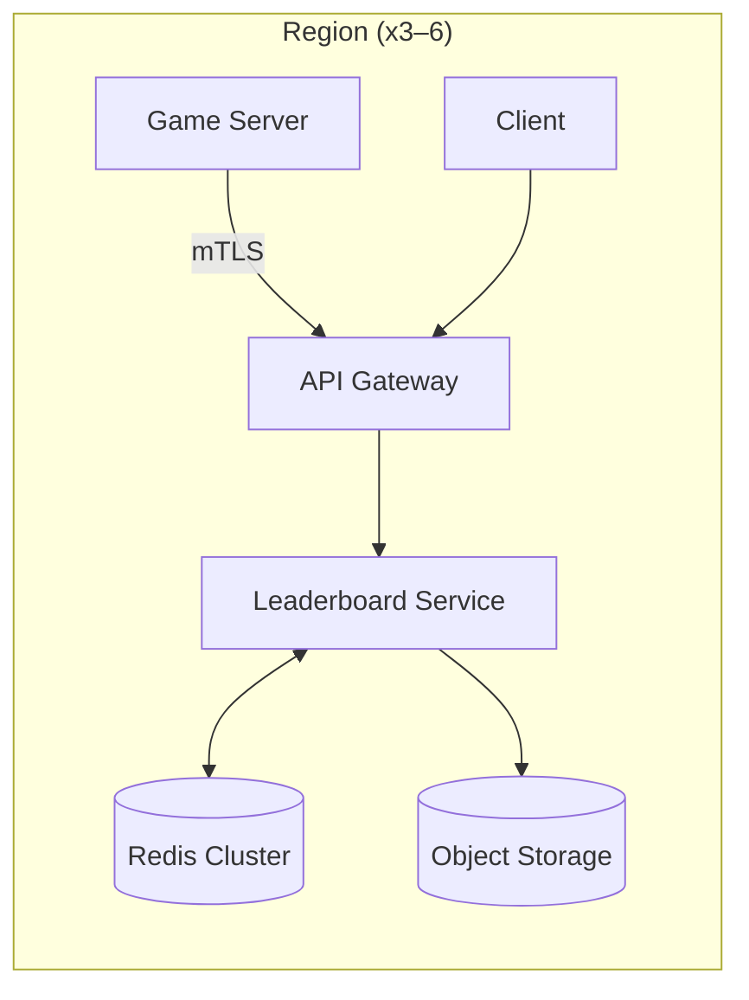

## Overview

This leaderboard system maintains ranked lists of players whose scores change frequently, across multiple leaderboard variants (global/region/mode) and time windows (daily/weekly/season/all-time). It prioritizes low-latency reads (top N, rank lookup, “around me”) while safely ingesting a high volume of score updates with deterministic application and simple recovery.

Active leaderboards are served from Redis Sorted Sets for speed. Score updates are ingested quickly, buffered briefly, and applied asynchronously so reads can stay fast under spikes. Closed windows are frozen, retained in Redis for a short period, and exported to object storage for long-term history.

---

## Requirements

### Functional Requirements
- Update a player’s score for one or more leaderboards (e.g., global, region, game mode).
- Fetch top N players for a leaderboard and time window (daily/weekly/season/“all-time”).
- Fetch a player’s rank and score, and “players around me” (±K positions).
- Support pagination for top lists.
- Support tie-breaking rules (e.g., higher score wins; ties broken deterministically).
- Support anti-cheat/validation hooks (rate limits, sanity checks, server-authoritative updates).
- Support automatic window rollover (daily/weekly) and historical querying for closed windows.
- Optionally support near-real-time client updates (polling and/or push).

### Non-Functional Requirements (Targets)
- **Scale**
  - 50M MAU, 5M DAU
  - Peak **200k score updates/sec** globally (across all leaderboards/windows)
  - Peak **300k read QPS** globally (top N / around-me / rank)
  - Largest active leaderboard/window cardinality: **up to 10M users**
  - Regions: **3–6** (geo-routed)
- **Latency (regional)**
  - Reads: **P50 20ms**, **P99 120ms**
  - Writes (ingestion ack): **P50 15ms**, **P99 80ms**
  - “Time to reflect update” (ingested → visible in reads): **P99 ≤ 3s** for hot boards
- **Availability**
  - Reads: **99.99%**
  - Writes: **99.9%** (degraded modes allowed)
- **Consistency**
  - Leaderboard rank/position: **eventual consistency** (seconds) acceptable
  - Auth, identity, entitlements: **strong consistency**
  - Updates must be **idempotent** and **deterministically applied**
- **Durability**
  - Active windows: **RPO ≤ 1 minute**, **RTO ≤ 30 minutes** (regional)
  - Closed windows: durable snapshots with **no post-close loss**

### Constraints & Assumptions
- Game servers are authoritative for score submissions (clients cannot write scores directly).
- Most leaderboards use **“max”** or **“set”** semantics (best score / latest score).
- Minimal PII in leaderboard core. Display name/avatar come from a separate profile service.
- “Global” leaderboards can be regionalized; cross-region convergence is eventually consistent.

---

## Simplified Architecture



### Components

#### API Gateway
- AuthN/AuthZ (clients for reads; game servers for writes via mTLS/service identity).
- Rate limiting and request shaping.
- Geo-routing clients to a region.

#### Leaderboard Service (single deployable)
One service owns:
- Read APIs (top N / rank / around-me).
- Write ingestion (validation + buffering).
- Background application of score updates to Redis.
- Window rollover and snapshot export.

This is implemented as a modular codebase (e.g., `reads`, `writes`, `windows`, `snapshots`) that deploys as one unit.

#### Redis Cluster (active leaderboards)
Redis is the serving store for active windows:
- ZSET per `(lbId, windowId)` for ranking.
- HASH per `(lbId, windowId, userId)` for per-user metadata.
- Redis Streams for short-lived buffering of score events and consumer replay.

Redis is deployed multi-AZ with persistence enabled to meet regional durability targets.

#### Object Storage (history)
- Immutable snapshots for closed windows (top-K and optional full export).
- Served via CDN for top list reads of older windows.

---

## Data Flow

### Write Path (server-authoritative, fast ack)
1. Game server calls `POST /v1/scores` with `eventId`, `lbId`, `windowId`, `userId`, `mode`, `score`.
2. Leaderboard Service validates (auth, window validity, bounds, rate limits).
3. Service appends the update to a Redis Stream (trimmed retention) and returns `202 Accepted`.
4. Background consumers read from the stream and apply updates to the relevant ZSET/HASH using a single atomic Lua script.

This keeps ingestion latency low and allows smoothing spikes while meeting the “visible within seconds” target through consumer lag SLOs and autoscaling.

### Read Path (low-latency)
- **Active / recently closed windows**: served directly from Redis.
- **Older closed windows**: served from object storage snapshots (typically top-K); for rank/around-me on older windows, keep a longer Redis retention for selected high-value windows or generate full exports.

---

## Data Model

### Redis Keys (Active + Retained Closed Windows)

**ZSET (ranking)**
- Key: `lb:{lbId}:{windowId}:z`
- Member: `userId`
- Score: `score` (stored as integer-like numeric)

**HASH (user state)**
- Key: `lb:{lbId}:{windowId}:u:{userId}`
- Fields:
  - `score` (int64)
  - `updatedAtMs` (int64)
  - `lastEventId` (string)
  - `mode` (max|set)

**Stream (buffer)**
- Key: `lb:events:{shard}`
- Entry fields: `eventId`, `lbId`, `windowId`, `userId`, `mode`, `score`, `eventTimeMs`, `source`

Retention:
- Streams are trimmed aggressively (time-based and/or maxlen) to support retries/replay during incidents without becoming a long-term log.

---

## Update Semantics and Correctness

### Supported modes
- `max`: accept only if `score` is greater than current score; ties resolved deterministically.
- `set`: accept only if `eventTimeMs` is newer than current `updatedAtMs` (or a server sequence if preferred).

A single Redis Lua script enforces deterministic acceptance and applies:
- Update HASH (`score`, `updatedAtMs`, `lastEventId`)
- Update ZSET (member `userId`, score `score`)
- No-op when the update is stale or redundant

### Idempotency
- Retries with the same `eventId` are safe because applying the same accepted value is a no-op and stale/redundant updates are rejected by the acceptance rule.
- If strict “exactly once per increment” is required, keep increments out of the API by having game servers compute absolute scores and submit via `set`/`max`.

### Tie-breaking
- Primary ordering: higher score wins.
- Deterministic tie: `userId` lexical ordering (Redis ZSET member ordering).
- If a product needs “earliest achieved time wins”, store `updatedAtMs` in the HASH and apply a deterministic secondary sort in the service for tied entries within the returned page (top N / around-me), keeping Redis as the fast index.

---

## Windowing and History

### Window IDs
- Daily: `YYYY-MM-DD`
- Weekly: `YYYY-WW`
- Seasonal: configured ranges with explicit IDs (e.g., `S2025-01`)

### Rollover
The Leaderboard Service maintains a simple window schedule:
- Writes allowed for `active` and `closing` (grace period).
- After close: reject new updates for that window.

### Retention
- Keep recently closed windows in Redis for fast rank/around-me (e.g., 7–30 days).
- Export snapshots at close for long-term storage.

### Snapshots
At close, export:
- `snapshots/{lbId}/{windowId}/topK.json` (or parquet)
- `snapshots/{lbId}/{windowId}/meta.json` (window info + generation time)

---

## API Design

### Read APIs (REST)

**Get top N**
- `GET /v1/leaderboards/{lbId}/windows/{windowId}/top?limit=100&cursor=...`
- Cursor: `(lastScore,lastUserId)` for stable pagination

**Get user rank**
- `GET /v1/leaderboards/{lbId}/windows/{windowId}/users/{userId}`

**Around me**
- `GET /v1/leaderboards/{lbId}/windows/{windowId}/users/{userId}/around?above=25&below=25`

### Write API (server-authoritative)

**Submit score**
- `POST /v1/scores`
```json
{
  "eventId": "uuid",
  "userId": "u9",
  "lbId": "global",
  "windowId": "2025-12-17",
  "mode": "max",
  "score": 12345,
  "eventTimeMs": 1734400000000
}
```
- Response: `202 Accepted`
```json
{ "eventId": "uuid", "ingestedAtMs": 1734400001234 }
```

---

## Scaling and Performance

### Partitioning
- Partition Redis by `(lbId, windowId)` so each active window maps predictably to a shard.
- Allocate dedicated Redis capacity for the hottest windows (e.g., “global daily”) by routing those keys to a dedicated shard group.

### Read hotspots
- Cache `GET top` responses at the edge for 1–5s for extreme fanout (optional).
- Keep `limit` capped (e.g., 200) to control tail latency.

### Write throughput
- Redis Streams buffer ingest spikes; consumer groups scale horizontally.
- Apply updates with Lua to minimize round-trips and keep per-update work constant.

---

## Failure Modes and Recovery

### Redis shard failure
- Multi-AZ replicas with automatic failover keep reads/writes available within a region.
- Persistence allows restore; retained streams allow controlled catch-up after transient consumer outages.

### Consumer lag
- Track “time to reflect update” via consumer lag and per-shard backlog.
- Autoscale consumers and prioritize hot leaderboards when backlog grows.

### Snapshot/export failures
- Closed windows remain queryable from retained Redis until export succeeds.
- Snapshot jobs are idempotent and re-runnable.

---

## Operations

### Key metrics
- API: QPS, P50/P95/P99 latency, 4xx/5xx, rate-limit hits
- Redis: command latency, ops/sec, memory, replication health, evictions
- Streams/consumers: consumer lag (seconds), pending entries, retry rate
- Product correctness: update acceptance rate, stale write rate, snapshot completion SLO

### Alerts (examples)
- P99 read latency > 120ms sustained
- Consumer lag P99 > 3s on hot windows
- Redis evictions > 0 sustained
- Snapshot export missed window-close SLO

---

## Simplification Notes

- Removed: standalone event bus and separate worker fleet; Redis Streams provides buffering/replay and consumer groups with one operational datastore.
- Removed: separate durable per-user state store; Redis persistence + replicas provide regional durability for active windows, with snapshots as long-term history.
- Merged: read API, write ingestion, window manager, and snapshot exporter into one `Leaderboard Service` deployment to reduce coordination and deployment overhead.
- Complexity remains: Redis Cluster with sorted sets (required for low-latency ranking queries at this scale), multi-AZ deployment (required for availability/durability targets), and window snapshotting (required for immutable historical results).