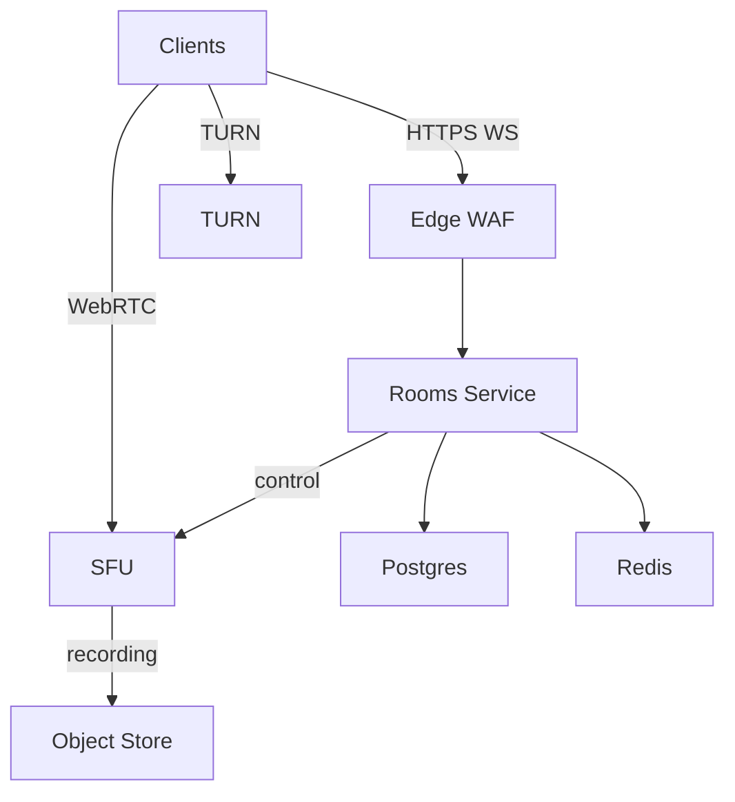

## Overview

Live audio rooms have two core responsibilities:

- **Control plane**: an ordered, authoritative room state (roles, hand-raises, mutes, kicks, locks) with deterministic moderation under concurrency.
- **Media plane**: low-latency audio delivery with high fan-out and resilience to mobile network loss.

This design keeps the separation of concerns, but implements it with a small set of operational building blocks:
- a single backend service for room lifecycle + real-time state,
- one primary database for durability and audit,
- one in-memory datastore for fast resume/idempotency,
- a regional WebRTC SFU cluster (plus TURN fallback),
- optional recording to object storage.

---

## Requirements

### Functional

- Create/schedule rooms; start/end rooms; visibility (public / followers / invite-only).
- Join as listener; raise hand; promote/demote speakers.
- Host/co-host moderation: mute/unmute, kick, lock room, approve/deny speaker requests, ban/block with audit trail.
- Real-time room state: roles, ordered hand-raise queue, speaking indicators, participant counts (and optionally participant lists).
- Low-latency audio: speaker uplink to SFU; listener downlink from SFU.
- Abuse controls: rate limits, spam prevention, ban-evasion friction, reporting and moderation tooling.
- Optional: recording + replay, captions/transcription, analytics.

### Non-Functional Targets (Example)

- Scale: 10M MAU, 1M DAU; peak 200K concurrent listeners, 20K concurrent rooms; mega room up to 20 speakers / 100K listeners.
- Latency:
  - Join → first audio: P50 800ms, P99 2.5s
  - Speaker → listener audio (nearby region): P50 150–200ms, P99 400–600ms
  - Control events delivered: P50 80ms, P99 250ms
- Availability: control plane 99.99% monthly; media plane 99.95% monthly.
- Consistency: strong ordering per room; idempotent commands; eventual consistency acceptable for feeds/analytics.

---

## Simplified Architecture

### High-Level

- **Rooms Service** handles:
  - REST for room lifecycle/discovery endpoints
  - WebSocket for real-time room state + commands
  - the authoritative room state machine (single-writer per room)
  - orchestration calls to the SFU (join permissions, kicks, mutes)
- **Postgres** stores durable metadata and an append-only moderation/audit log.
- **Redis** stores hot room snapshots and idempotency/command dedupe to make reconnects fast and failover predictable.
- **SFU Cluster** delivers WebRTC audio; **TURN** provides fallback relay for restrictive NATs.
- **Object Storage (optional)** stores recording artifacts.

### Architecture Diagram



---

## Control Plane Design (Rooms Service)

### Authoritative Ordering

- Each room has a **single active writer** that processes all commands and assigns an increasing `seq`.
- The writer:
  1. validates authz + current state
  2. applies the state transition
  3. increments `seq`
  4. persists an audit event in Postgres
  5. updates the Redis snapshot and idempotency keys
  6. broadcasts the state diff to connected clients

### Single-Writer Implementation

- **Room sharding**: deterministic routing by `room_id` to a Rooms Service shard (keeps most rooms “single-node local” for WebSocket fan-out).
- **Lease/ownership**: the shard instance acquires a per-room lease using **Postgres advisory locks** (automatic release on crash) to prevent split-brain.

### WebSocket State Sync

- Clients receive:
  - an initial `snapshot` with `seq`
  - incremental `state_diff` messages (strictly increasing `seq`)
- If a client detects a gap, it requests `resync`. The server replies with:
  - a compact diff replay if available, otherwise a full snapshot.

### Large-Room Behavior

- Keep the hot path small:
  - send **counts + stage roster** by default (hosts/speakers + limited recent speakers)
  - paginate full participant lists via REST only when needed
  - coalesce speaking indicators into ticks (e.g., 100ms) and drop updates under backpressure

---

## Media Plane Design (SFU + TURN)

### WebRTC Topology

- Speakers publish Opus audio to the SFU.
- Listeners receive either:
  - a small set of speaker tracks (small/medium rooms), or
  - a **single mixed track** for very large rooms (optional mixer capability within the SFU cluster).

### TURN

- Provide TURN (e.g., coturn) as an ICE fallback for restrictive NATs.
- Track and budget relay usage separately from direct connectivity.

---

## Key Workflows

### 1) Join Room (Listener)

1. Client calls `POST /v1/rooms/{room_id}/join`.
2. Server returns:
   - `ws_url`, `ws_token`, `resume_token`
   - best SFU endpoint + `sfu_token` (room-scoped, short-lived)
3. Client connects WebSocket, sends `HELLO(resume_token)` and receives `snapshot(seq, state)`.
4. Client establishes WebRTC to the SFU and starts receiving audio.

### 2) Raise Hand → Become Speaker

1. Client sends WS command `raise_hand`.
2. Host sends WS command `accept_speaker`.
3. Rooms Service updates state, then calls SFU to allow uplink.
4. Client starts sending audio.

### 3) Moderation (Mute / Kick)

- Moderator action is applied by the Rooms Service and sequenced.
- Enforcement happens in two places:
  - control plane state (UI + permissions)
  - media plane (SFU permission change / termination) for server-enforced mute/kick

---

## API Design

### REST

- `POST /v1/rooms`
- `POST /v1/rooms/{room_id}/join` (supports `Idempotency-Key`)
- `POST /v1/rooms/{room_id}/leave`
- `GET /v1/rooms?feed=trending|following&cursor=...`
- `GET /v1/rooms/{room_id}`

**Errors**
- `401/403` auth/role violations
- `404` room not found
- `409` invalid transition (include current `seq` for resync)
- `429` rate limited
- `503` overloaded (retry with backoff + jitter)

### WebSocket (Room State + Commands)

**Client → Server**
```json
{ "type": "raise_hand", "room_id": "r_123", "client_msg_id": "c_1" }
```

**Server → Client**
```json
{ "type": "snapshot", "room_id": "r_123", "seq": 1020, "state": { "...": "..." } }
```

**Idempotency**
- Commands are deduped by `(room_id, user_id, client_msg_id)` with a short TTL in Redis.

---

## Data Model

### Postgres (Durable)

- `rooms(room_id, creator_id, title, visibility, status, region, scheduled_at, started_at, ended_at, recording_enabled, ...)`
- `room_participants(room_id, user_id, role, joined_at, left_at, last_seen_at, UNIQUE(room_id, user_id))`
- `room_bans(room_id, user_id, banned_until, reason, created_at, actor_id)`
- `moderation_actions(action_id, room_id, actor_id, target_id, action_type, reason, created_at, idempotency_key, seq)`
- `room_events(event_id, room_id, seq, ts, type, actor_id, target_id, payload_jsonb, idempotency_key)` (append-only)

### Redis (Hot)

- `room:{room_id}:snapshot` → `{ seq, state }` (TTL; refreshed during activity)
- `room:{room_id}:dedupe:{user_id}` → recent `client_msg_id` set (TTL ~10 minutes)

---

## Scaling & Performance

### Rooms Service

- Scale horizontally by `room_id` sharding.
- Keep per-room processing single-threaded (one writer) to preserve ordering.
- Degrade gracefully under load:
  - reduce speaking-indicator tick frequency
  - switch to counts-only presence
  - cap per-connection outbound buffer and drop non-critical updates

### SFU Cluster

- Capacity planning is driven by egress bandwidth and per-connection overhead.
- For mega rooms:
  - prefer mixed track distribution for listeners
  - distribute listeners across SFU nodes
  - keep headroom (30–40%) for bursts and failover

### Postgres

- Use read replicas for discovery-heavy reads.
- Keep hot-path writes minimal and append-only where possible (events/audit).

---

## Failure Modes & Resilience

1. **Rooms Service instance crash**
   - Clients reconnect via `resume_token`; room ownership re-established via routing + advisory lock.
   - State restored from Redis snapshot; audit trail remains in Postgres.

2. **SFU node failure**
   - Affected clients ICE-restart to another SFU node; room continues.

3. **Redis degradation**
   - New joins and resumes may be slower; Rooms Service falls back to in-memory state for active rooms and rebuild-from-Postgres for cold rooms.

4. **Postgres failover**
   - Control plane enters a guarded mode (reject state-changing commands with `503`) until the primary is healthy, preserving correctness for moderation/audit.

---

## Operations

### Core SLIs

- Join success: audio starts within 3s
- Join latency: join response → first audio frame
- Control latency: WS command → delivered `state_diff`
- ICE success rate and TURN relay percentage
- Audio quality: RTT, jitter, packet loss, concealment time

### Key Alerts

- WS connect failures, reconnect loops, per-room hot-spot detection
- Redis latency/errors; Postgres saturation/replication lag
- SFU egress Gbps, ICE failures, DTLS handshake errors
- TURN relay spikes by region

---

## Simplification Notes

- Removed: separate API gateway, auth/token service, discovery service, and join service; consolidated into `Rooms Service` to keep lifecycle, real-time state, and authorization in one deployment unit.
- Removed: Kafka/Pulsar event bus and stream-processing/OLAP pipeline; durable audit and replay are captured in Postgres `room_events` and `moderation_actions`, with optional downstream exports added later as needed.
- Removed: external lease systems (etcd/Consul/ZooKeeper); per-room single-writer ownership uses Postgres advisory locks.
- Merged: “room snapshots”, “dedupe”, and “resume” support into Redis to keep reconnect paths fast while keeping Postgres as the durable system of record.
- Complexity that remains: WebRTC SFU + TURN (required for low-latency conversational audio on real networks) and per-room ordered state (required for deterministic moderation semantics).