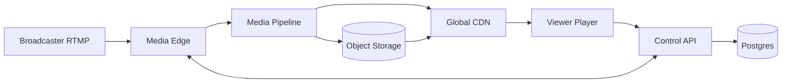
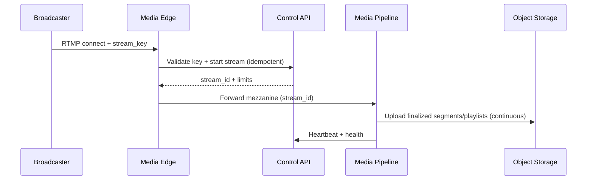
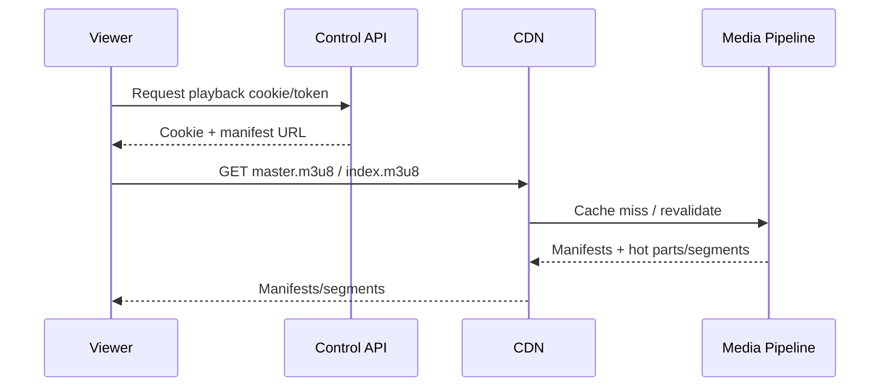

# Live Video Streaming (Twitch-like)

## Overview

This system supports live broadcasting with low-latency playback, adaptive bitrate (ABR), and DVR rewind within a retention window. The core idea is a single regional media pipeline that turns one broadcaster feed into packaged LL-HLS output, with a CDN handling global fan-out and an object store providing durable DVR storage.

## Requirements

### Functional
- RTMP(S) ingest using stream keys.
- ABR playback via HLS with Low-Latency HLS (LL-HLS) using CMAF/fMP4.
- Transcoding ladder (multiple renditions + audio-only).
- DVR rewind within a rolling window (example: 2 hours) and return to live.
- Stream lifecycle: LIVE/ENDED, health, and basic viewer-visible status.
- Entitlements: public/private/subscriber-only, geo/device restrictions (optional DRM).
- Optional VOD export by extending retention beyond the DVR window.

### Non-Functional (Targets)
- Glass-to-glass latency: P50 2–3s, P99 < 7s (LL-HLS tuned).
- Playback SLO: 99.99% at CDN edge (excluding client/network).
- Ingest SLO: 99.9% (uplink instability expected).
- DVR durability: stored in object storage; tolerate ≤2s loss during transient failures.

## Simplified Architecture

- **Media Edge** terminates RTMP(S), authenticates stream keys via the Control API, and forwards the mezzanine feed internally.
- **Media Pipeline** performs transcoding + LL-HLS packaging and serves as the CDN origin for manifests and the hot live edge; it continuously uploads finalized segments for DVR/VOD to object storage.
- **CDN** provides global delivery, caching, and authorization enforcement (signed cookies/JWT).
- **Control API + Postgres** handle stream lifecycle, entitlements, and token/cookie issuance.

## Components

### 1) Control API (Lifecycle + Auth)
**Responsibilities**
- Validate ingest stream keys and enforce “one active stream per channel”.
- Maintain stream state (`LIVE`, `ENDED`, optional `RECOVERING`).
- Issue short-lived playback tokens/cookies and return manifest URLs.
- Enforce entitlements (subscriber/geo/device rules) for token issuance.
- Accept health/heartbeat updates from Media Edge/Pipeline.

**Storage**
- Postgres as the single source of truth for channel/stream metadata and entitlements.

### 2) Media Edge (RTMP Ingest)
**Responsibilities**
- Accept RTMP(S) connections, apply basic policy limits, and track session liveness.
- Call Control API to start/confirm a stream and to report health.
- Forward mezzanine video to the Media Pipeline over an internal protocol (SRT/RIST/TCP).

**Operational shape**
- Stateless beyond live connection state; horizontally scaled behind geo-steering (DNS/Anycast).

### 3) Media Pipeline (Transcode + Packager + Origin)
**Responsibilities**
- Decode mezzanine input and produce an ABR ladder with GOP alignment.
- Package CMAF and produce LL-HLS manifests (master + renditions with parts/preload hints).
- Keep a small hot buffer (memory/disk) for the newest parts/segments to satisfy LL-HLS polling efficiently.
- Upload finalized segments and playlists to object storage for DVR retention and optional VOD export.
- Serve manifests and hot content as the CDN origin with low latency.

**DVR behavior**
- Playlists include `EXT-X-PROGRAM-DATE-TIME` so clients can map wall-clock time to media.
- Requests for older segments within retention are served by fetching from object storage (or redirecting with signed URLs if preferred).

### 4) Object Storage (DVR/VOD)
**Responsibilities**
- Durable storage for finalized CMAF init + segments and periodically updated playlists.
- Lifecycle policies enforce DVR retention (e.g., delete after 2 hours) and longer VOD retention if enabled.

### 5) CDN (Delivery + Authorization)
**Responsibilities**
- Cache manifests and segments globally.
- Enforce access control using signed cookies or JWT at the edge.
- Collapse origin requests and absorb LL-HLS polling load at scale.

**Caching**
- Segments: long TTL once finalized.
- Manifests: very short TTL with `ETag` and `stale-while-revalidate`.

## Data Model (Postgres)

Tables (illustrative):
- `channels(channel_id, owner_user_id, title, category, created_at, updated_at)`
- `stream_keys(key_id, channel_id, key_hash, created_at, revoked_at)`
- `streams(stream_id, channel_id, state, region, started_at, ended_at, dvr_retention_seconds, record_vod, mezzanine_profile)`
- `entitlements(entitlement_id, channel_id, policy_json, updated_at)`

Constraints:
- Unique active stream per channel (e.g., partial unique index on `streams(channel_id)` where `state in ('LIVE','RECOVERING')`).
- Idempotent start via `(channel_id, started_at_bucket)` or explicit `Idempotency-Key` table.

## Storage Layout (Object Storage)

- `live/{h}/{stream_id}/{rendition}/init.mp4`
- `live/{h}/{stream_id}/{rendition}/seg_{sequence}.m4s`
- `live/{h}/{stream_id}/master.m3u8`
- `live/{h}/{stream_id}/{rendition}/index.m3u8`

`{h}` is a short hash prefix to distribute load.

## Core Flows

### Broadcaster Goes Live

### Viewer Joins Live

## API Design (Control API)

- `POST /v1/streams:start` (called by Media Edge)
  - Idempotent start, returns `stream_id`, policy limits, and region anchoring.
- `POST /v1/playback:token`
  - Validates entitlement, returns short-lived signed cookie/JWT and the manifest URL.
- `GET /v1/channels/{channel_id}/live`
  - Returns `is_live`, `stream_id`, `started_at`, `region`.

Error semantics:
- `403` invalid/expired token or entitlement denied
- `404` segment not yet available (client retries)
- `410` outside DVR window

## Scaling & Performance

- **Primary bottleneck: transcoding capacity.** Scale the Media Pipeline by active streams; prioritize baseline+audio under pressure and shed higher renditions first.
- **LL-HLS request rate handled by CDN.** Use short manifest TTLs with `ETag` and rely on edge caching/collapsed forwarding to keep origin load stream-proportional.
- **Hot buffer avoids per-part object writes.** Finalized segments go to object storage; parts are served from the pipeline’s hot buffer to control storage request rates.
- **Single-region media, multi-AZ deployment.** Region anchoring keeps the hot path predictable; multi-region can be added later for DR and event capacity.

## Failure Modes & Mitigations

1) **Ingest node loss / POP issue**
- Detect via disconnect spike and heartbeat loss.
- Mitigate via geo-steering to healthy edge nodes and fast reconnect; keep stream in `RECOVERING` briefly before ending.

2) **Transcode saturation**
- Detect via encode latency, dropped frames, and rising join latency.
- Mitigate via ladder degradation, admission control for new streams, and reserved capacity for key events.

3) **Packaging/origin regression**
- Detect via synthetic playback checks and manifest validation.
- Mitigate with canary by stream cohort, fast rollback, and a safe default ladder/profile.

4) **Object storage impairment**
- Detect via elevated origin fetch failures for older segments.
- Mitigate by continuing live edge from the hot buffer and accepting bounded DVR impairment until storage recovers.

## Operations

- Observability: per-stream health, publish latency, join latency, rebuffer rate, origin error rate, CDN hit ratio.
- Deployments: canary media changes by stream cohort; canary control API by traffic percentage.
- Security: hash stream keys at rest; short-lived playback cookies; key rotation; rate limits on token issuance; WAF on Control API.

## Simplification Notes

- Removed: separate Redis presence/session layer; stream state and entitlements are handled directly in Postgres with short-lived tokens/cookies.
- Removed: event bus, analytics pipeline, and notifications as first-class services; operational metrics and CDN logs provide the initial visibility needed, with downstream processing added only when required.
- Removed: dedicated origin-shield cache service; CDN shielding/collapsed forwarding is used, and the Media Pipeline maintains a small hot buffer for the live edge.
- Merged: transcoding, packaging, and live origin into a single Media Pipeline component to reduce cross-service coordination on the hot path.
- Merged: stream coordinator functionality into the Control API to keep lifecycle, entitlement, and token logic in one place.
- Remaining complexity: LL-HLS packaging and transcoding capacity management are necessary to meet low-latency and ABR requirements; CDN authorization is necessary to enforce entitlements at global scale.