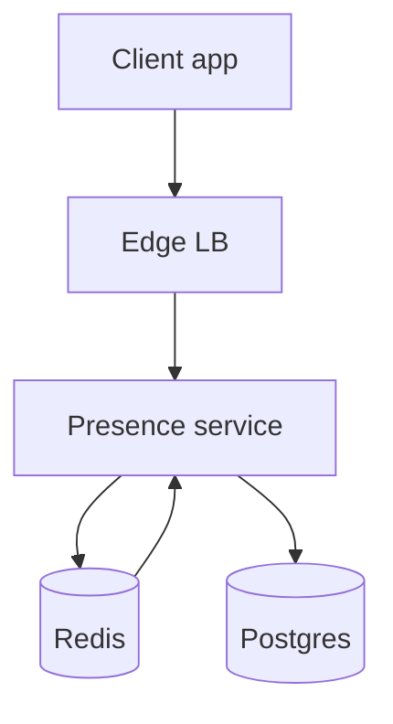
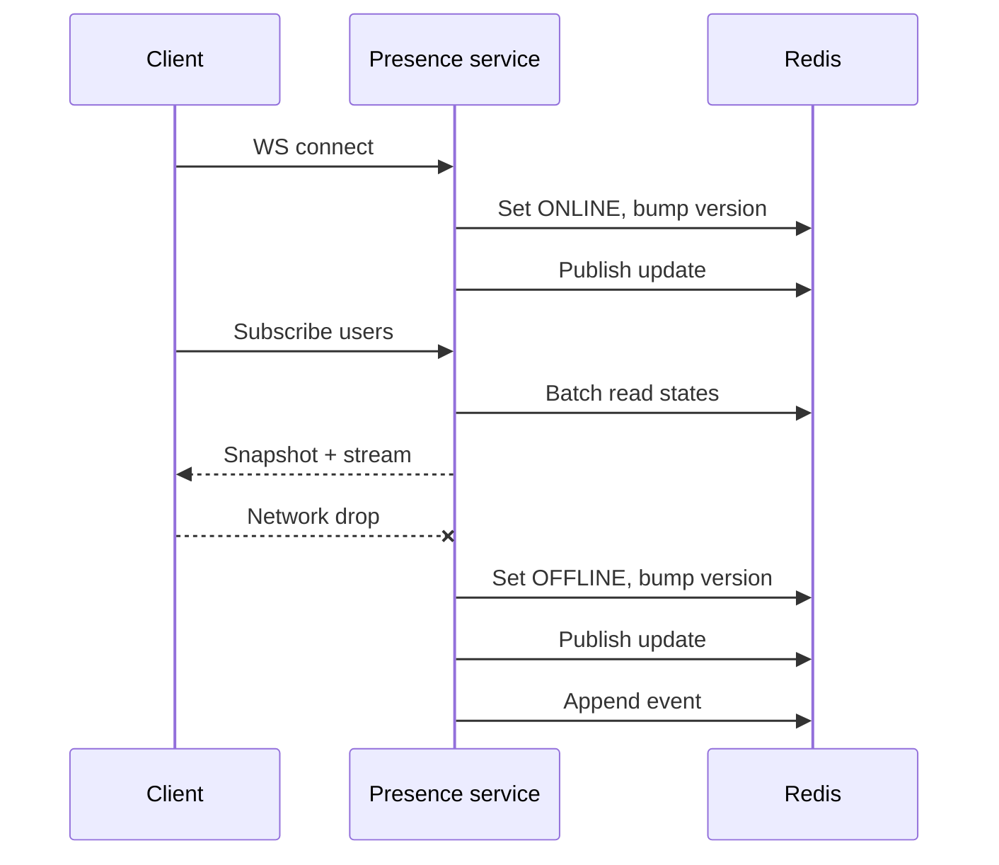

## Overview

A real-time presence service answers two questions:

1. **Is user X online right now?**
2. **When was user X last seen online?**

“Online” is ephemeral and best-effort under unreliable networks. “Last seen” is durable, user-facing, and must be **monotonic** (never moves backward). The design focuses durable writes on meaningful transitions (connect/offline/timeout), not heartbeats.

---

## Requirements

### Functional
- Return `ONLINE` / `OFFLINE` (optionally `UNKNOWN`) and `last_seen`.
- Multi-device presence: user is online if any active session exists.
- Clients can subscribe to presence updates for a list (contacts).
- Batch presence lookup with pagination and rate limits.
- Privacy controls:
  - visibility: everyone / contacts / nobody
  - per-viewer blocking
  - hide `last_seen` independently from online indicator
- Emit presence events to downstream systems with **ordering per user** (via monotonic version).
- Admin tooling: session inspection, forced disconnect, replay/backfill within retention.

### Targets (example)
- Batch read P50 20ms, P99 150ms (in-region)
- Subscription propagation P99 ≤ 500ms (in-region)
- Query API 99.99% monthly (degraded modes allowed)
- Subscription delivery 99.9% monthly (best-effort, reconnectable)

---

## Simplified Architecture

A single **Presence Service** owns WebSockets, the presence state machine, the query API, subscriptions, and admin endpoints. Redis provides fast shared state and lightweight messaging. Postgres stores durable `last_seen` and privacy/relationship data.



### What each piece does
- **Presence Service**
  - WebSocket lifecycle (auth, keepalive, reconnect hints)
  - Presence state machine (multi-session aggregation per user)
  - Subscriptions (push updates to connected clients)
  - Batch query API (viewer-aware, privacy filtered)
  - Admin endpoints (inspect, force disconnect, replay within retention)
- **Redis**
  - Ephemeral presence read store (`ONLINE/OFFLINE`, `version`, `owner`)
  - Pub/Sub for cross-node update fanout
  - Redis Streams as an integration/event log with retention (downstream + replay window)
- **Postgres**
  - Durable `user_last_seen` with monotonic updates
  - Privacy settings, blocks, and contacts/relationships

---

## Core Concepts

### Presence state machine (per user)
- `session_count`: number of active sessions (across devices) owned by the current shard/instance
- `state`: `ONLINE` if `session_count > 0`, else `OFFLINE`
- `version`: monotonic integer, incremented on externally visible state changes

Transitions:
- `CONNECT`: increment; if goes `0 → 1`, set `ONLINE`, `version++`, publish update
- `DISCONNECT/TIMEOUT`: decrement; if goes `1 → 0`, set `OFFLINE`, `version++`, publish update and last-seen candidate

### Ownership & routing
- WebSocket connections use consistent routing by `user_id` (sticky hashing) so a user’s sessions usually land on the same Presence Service shard.
- Redis stores `owner_id` and `owner_epoch_ms` with the presence record for observability and stale detection.

### Crash safety without per-user heartbeat writes
- Each Presence Service instance periodically refreshes a Redis lease key `instance_live:{instance_id}` with a short TTL.
- Readers treat presence records owned by a non-live instance as stale and return `UNKNOWN` (or `OFFLINE_AFTER_GRACE` if the product prefers).

---

## Data Model

### Redis
Key: `presence:{user_id}` (Hash)
- `state`: `"ONLINE" | "OFFLINE"`
- `version`: integer
- `session_count`: integer (optional, for debugging)
- `last_change_ms`: epoch ms
- `owner_instance_id`: string
- `owner_epoch_ms`: epoch ms (last transition time)

Key: `instance_live:{instance_id}` (String)
- Value: epoch ms
- TTL: e.g., 15s, refreshed every 5s

Channel: `presence_updates` (Pub/Sub)
- Message: `{user_id, state, version, last_change_ms}`

Stream: `presence_events` (Redis Streams)
- Append transition events for downstream consumption and replay within retention:
  - `{event_id, user_id, version, new_state, event_time_ms, reason}`

### Postgres
Table: `user_last_seen`
- `user_id` (PK)
- `last_seen_ms` (bigint) — monotonic
- `last_applied_version` (bigint) — idempotency guard
- `updated_at_ms` (bigint)
- `deleted_at_ms` (nullable)

Tables: `privacy_settings`, `blocks`, `contacts` (minimal schema per product needs)

Monotonic update rule (conceptual):
- Apply only if `version > last_applied_version`
- Set `last_seen_ms = max(existing.last_seen_ms, candidate_last_seen_ms)`

---

## Data Flows

### Connect / Disconnect / Subscribe


### Batch presence lookup (viewer-aware)
1. API receives `(viewer_id, user_ids, include_last_seen)`.
2. Load privacy/relationship data from Postgres (with a small in-process TTL cache).
3. Pipeline Redis reads for `presence:{user_ids}` and (if needed) `instance_live:{owners}`.
4. For stale/unknown presence, return `UNKNOWN` (or `OFFLINE_AFTER_GRACE`) and fall back to Postgres `last_seen` when allowed by privacy.
5. Return filtered results.

---

## APIs

### Batch lookup
`POST /v1/presence:batch`
- Hard caps: request size (e.g., 200 userIds), rate limits, and per-connection quotas
- Response includes `{state, version, last_change_ms, last_seen_ms?}` with privacy filtering

### WebSocket
Client → Server:
```json
{ "type": "subscribe", "request_id": "r1", "user_ids": ["u2","u3"], "since_version": 0 }
```

Server → Client:
- `subscribed` with a snapshot
- `presence_update` events at-least-once

Client dedupe rule:
- Ignore updates where `version <= last_seen_version[user_id]`

### Admin
- `GET /admin/sessions?user_id=...`
- `POST /admin/force_disconnect {user_id}`
- `POST /admin/replay_last_seen {from_ms,to_ms}` (replay from Redis Stream within retention)

---

## Ordering, Consistency, and Correctness

- **Per-user ordering**: every externally visible change increments `version`. Downstream systems and clients converge by applying only the latest `version`.
- **Durable monotonic last-seen**: Postgres updates are conditional on `version` and use `max()` semantics for timestamps.
- **Subscription delivery**: at-least-once; duplicates are expected and handled by `version` dedupe.
- **Cross-region behavior**: in a multi-region setup, online presence is regional; last-seen reads come from a nearby Postgres replica with async replication (seconds-level staleness acceptable).

---

## Scaling & Performance

- **WebSocket concurrency**: Presence Service scales horizontally; keep per-connection state minimal and cap watched lists.
- **Fanout**: Redis Pub/Sub broadcasts updates to all instances; each instance filters to its local subscribers.
- **Batch reads**: pipeline Redis calls; coalesce requests and use a short in-process cache (1–5s) for hot reads.
- **Storms**: OFFLINE transitions are appended to `presence_events` quickly; Postgres `last_seen` writes are performed by a bounded background consumer to smooth spikes.

---

## Failure Modes & Mitigations

- **Presence Service crash**
  - Subscriptions rebuild on reconnect.
  - Stale ownership detected via `instance_live:*` leases; callers receive `UNKNOWN` until sessions reestablish.
- **Redis outage**
  - Batch API serves `last_seen` from Postgres (privacy-filtered) and returns `UNKNOWN` for online.
  - WebSocket subscriptions degrade (clients poll or reconnect).
- **Postgres outage**
  - Online presence continues from Redis.
  - Last-seen updates buffer via `presence_events` and catch up when Postgres recovers (within stream retention).
- **Hot-user fanout**
  - Per-target subscriber caps, debounce flaps, and per-connection watch limits.
  - Optionally degrade hot targets to polling responses.

---

## Security, Abuse, and Compliance

- Auth at WebSocket connect and API calls (JWT/OAuth); internal auth between services.
- Rate limits: connects, subscribes, batch size/QPS.
- Presence scraping protection: quotas + privacy defaults + anomaly detection.
- GDPR/CCPA: delete `user_last_seen` and privacy/relationship rows; ephemeral Redis presence is short-lived and not treated as compliance storage.

---

## Simplification Notes

- Removed: dedicated event stream and last-seen writer; Redis Streams provides ordered append per user versioning and short-to-medium retention replay.
- Removed: separate internal fanout bus; Redis Pub/Sub broadcasts updates and each Presence Service instance filters to local subscribers.
- Removed: specialized durable store; Postgres stores `last_seen` and privacy/relationships with conditional monotonic updates.
- Merged: gateway, presence shards, query API, subscription handling, and admin tooling into one Presence Service deployment to reduce moving parts.
- Complexity that remains: Redis-backed ephemeral state, monotonic `version` semantics, instance liveness leases, and privacy enforcement are necessary for correctness, low latency, and safe degradation.