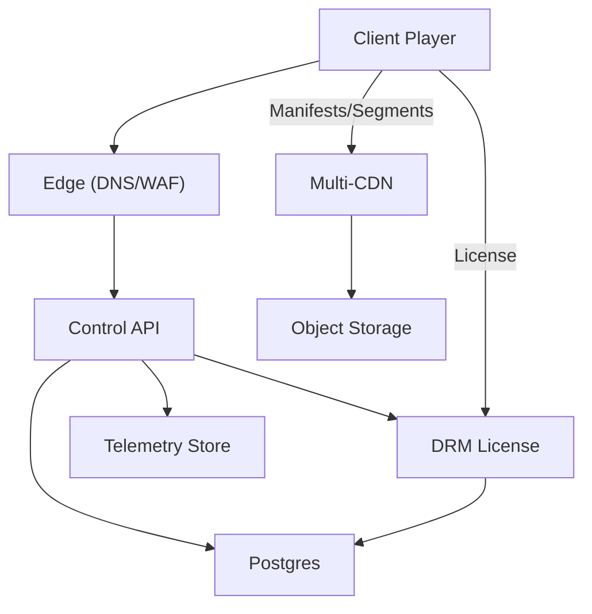
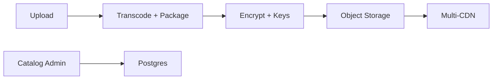
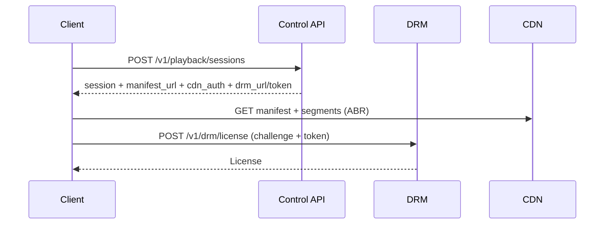

## Overview

A global Video-on-Demand (VoD) platform has two distinct paths:

- **Data plane**: deliver manifests and video segments at massive scale with low latency and high cache hit ratio.
- **Control plane**: authenticate users, enforce entitlements and policies, start playback sessions, issue DRM licenses, and store lightweight playback state.

The design keeps the data plane CDN-first (HTTP HLS/DASH with ABR) and keeps the control plane small, cache-friendly, and multi-region.

Key challenges:
- **Scale & cost**: egress dominates; CDN caching and origin protection determine cost and reliability.
- **QoE**: fast startup and minimal rebuffering across devices and networks.
- **Rights enforcement**: DRM + geo/window policy without per-segment origin calls.
- **Resilience**: multi-region control plane and multi-CDN delivery with graceful degradation.

---

## Requirements

### Functional Requirements
- Browse/search catalog and view metadata (availability windows, locales, age ratings).
- Start playback: validate entitlement, return manifest + session context.
- ABR streaming: smooth quality switches, low rebuffering (HLS/DASH).
- DRM-protected playback: Widevine/PlayReady/FairPlay license acquisition.
- Multi-language audio/subtitles; locale- and policy-driven constraints.
- Resume playback across devices; “Continue Watching” per profile.
- Telemetry: startup time, rebuffering, bitrate, errors, device/network characteristics.
- Optional extension: offline downloads with persistent DRM licenses and expiry.

### Non-Functional Requirements (Targets)
**Scale (example at “Netflix-like” peak)**
- 50M DAU
- 10M peak concurrent streams globally
- Peak playback starts: 150k–300k starts/min
- Control plane peak: ~300k QPS
- Data plane peak egress: **50–150 Tbps**
- Library: ~200k titles; millions of encoded variants

**Latency (control plane; regional)**
- Start playback API (excluding segment downloads): P50 < 150ms, P99 < 600ms
- DRM license issuance: P50 < 120ms, P99 < 400ms (same-region)
- Resume state read: P99 < 50ms (regional)
- Manifest fetch: typically served from CDN; P99 < 200ms edge-to-client

**Availability**
- Control plane APIs: 99.99% (multi-region active-active)
- DRM license service: 99.995% (multi-region with regional affinity + failover)
- Data plane delivery: 99.995%+ via multi-CDN and origin shielding

**Consistency**
- **Strong**: key management, license policy decisions, entitlement checks.
- **Eventual**: analytics, recommendations, aggregate “continue watching” ordering (per-title resume checkpoint should be durable and monotonic).

**Durability**
- Media assets: 11 9’s object durability (multi-AZ, cross-region replication)
- Playback progress: RPO ≤ 1 minute

### Assumptions
- HLS and DASH are required; CMAF fMP4 improves cache reuse across protocols.
- Segment duration: **4s**.
- ABR ladder varies by codec/resolution; AV1/HEVC reduce bitrate at similar quality.
- Multi-region footprint: ~10–20 primary regions; multi-CDN PoP coverage worldwide.

---

## Simplified Architecture

### High-Level (Control + Data Plane)

What this provides:
- CDN serves nearly all bytes (manifests/segments) and protects the origin using built-in shielding and request coalescing.
- One **Control API** (modular monolith) owns catalog, search, playback start, and playback state.
- DRM stays isolated as a dedicated service with a small surface area and strict security controls.
- Postgres is the primary control-plane datastore; object storage is the media origin; telemetry lands in a purpose-built analytics store.

### Media Ingest / Encoding (Back Office)

---

## Core Flows

### Playback Start

### Progress Updates (Resume / Continue Watching)
- Client checkpoints every **30–60s**, plus on **pause/stop/background**.
- Server enforces **monotonic progress** per `(profile_id, title_id)` and de-duplicates near-identical updates per session.

---

## Components

### 1) Edge (DNS/WAF)
**Responsibilities**
- Traffic steering by region/health, TLS termination, WAF/bot controls, coarse rate limits.
- Separate hostnames for API vs video delivery to keep caching and security policies clean.

**Notes on simplification**
- Traffic steering and WAF are treated as one edge layer with clear policies and guardrails.

---

### 2) Multi-CDN Delivery
**Responsibilities**
- Serve manifests/segments with high cache hit ratio.
- Origin shielding (request coalescing, per-object concurrency limits) to protect object storage.

**Key practices**
- Immutable, versioned object paths; cache “forever” with `immutable`.
- CDN token auth via signed cookies/tokens with short TTL to preserve cacheability.

---

### 3) Control API (Modular Monolith, Multi-Region)
A single service deployed per region, split internally into modules:
- **Auth + Entitlement**: JWT validation, subscription checks, geo/maturity rules.
- **Catalog + Search**: metadata reads and search over Postgres (full-text + trigram).
- **Playback Sessions**: create/refresh short-lived sessions; compute policy bucket; return manifest URL and CDN auth.
- **Playback State**: resume checkpoints and continue-watching list.
- **Telemetry Ingest**: accept client QoE events and forward to analytics storage.

**Multi-region pattern**
- **Active-active stateless API** everywhere.
- **Profile home region** for writes (playback state, session bookkeeping); reads served locally with replication for fast UI, bounded by the RPO target.

**Notes on simplification**
- Related control-plane services deploy together as one unit; separation is by module and endpoint, not by separate services.

---

### 4) Postgres (Catalog + State + Policy Metadata)
**Responsibilities**
- Catalog tables, availability windows, rendition pointers.
- Playback state (resume and continue-watching).
- DRM policy metadata and key identifiers (keys remain in KMS/HSM).

**Scaling approach**
- Partition hot tables by `profile_id` (state) and by `title_id` (renditions).
- Use read replicas per region for catalog-heavy traffic.
- Use connection pooling and prepared statements to keep tail latency low.

---

### 5) DRM License Service + KMS/HSM
**Responsibilities**
- Validate session token + entitlement and issue DRM licenses (Widevine/PlayReady/FairPlay).
- Pull key material from KMS/HSM; keep strong audit logs and strict rate limits.

**Notes on simplification**
- DRM remains a dedicated service for security isolation, latency predictability, and access control boundaries.

---

### 6) Telemetry Store
**Responsibilities**
- Durable ingestion and long-term storage for QoE events, dashboards, anomaly detection, and analytics.
- Support backpressure and sampling during incidents to protect playback start and DRM.

**Notes on simplification**
- Telemetry uses a single managed ingestion-to-storage path (one dependency in diagrams) rather than a custom queue + stream processing stack.

---

## Data Model

### Catalog (Postgres)
- `titles(title_id PK, type, series_id, season, episode, release_year, age_rating, default_locale, created_at, updated_at)`
- `title_localizations(title_id, locale, name, synopsis, artwork_json, PRIMARY KEY(title_id, locale))`
- `availability(title_id, region, window_start, window_end, PRIMARY KEY(title_id, region, window_start))`
- `renditions(rendition_id PK, title_id, codec, container, width, height, bitrate_kbps, audio_group_id, subtitle_group_id, manifest_path, segment_prefix, created_at)`
- `audio_tracks(audio_group_id, lang, channels, codec, role)`
- `subtitle_tracks(subtitle_group_id, lang, forced, format)`

Search:
- Full-text index over localized fields (`title_localizations`) plus trigram index for typo tolerance.

### Playback State (Postgres)
- `playback_state(profile_id, title_id, position_ms, duration_ms, completed, updated_at, last_device_id, last_session_id, version, PRIMARY KEY(profile_id, title_id))`

Update rule:
- Accept updates that advance `position_ms` or set `completed=true`.
- Use `version` (or `updated_at` with compare-and-swap) to reject stale writes.

### DRM Metadata + Audit (Postgres + KMS/HSM)
- `drm_keys(key_id PK, title_id, kid, kms_key_ref, created_at, status, rotation_epoch)`
- `drm_audit(request_id PK, profile_id_hash, device_hash, title_id, policy_id, decision, issued_at, region, latency_ms)`

---

## API Design

### Authentication
- User access token: JWT/OAuth2 (short TTL).
- Playback session token: signed token scoped to `session_id`, `profile_id`, `title_id`, `exp`, and device constraints.
- Idempotency via `Idempotency-Key` for session creation and state updates.

### Start Playback Session
- `POST /v1/playback/sessions`
- Returns:
  - `session_id`
  - `manifest_url` (immutable, versioned)
  - `cdn_auth` (cookie/token + TTL)
  - `drm.license_url` + `drm.session_token`
  - optional `resume.position_ms`

### Update Playback State
- `PUT /v1/playback/state`
- Behavior:
  - de-duplicate frequent updates per session
  - monotonic position enforcement
  - optional `If-Match` or server-side `version` check

### Continue Watching
- `GET /v1/profiles/{profile_id}/continue-watching?limit=50`
- Cache: `private, max-age=30`

### DRM License
- `POST /v1/drm/license`
- Strict rate limits, replay protections, and detailed auditing; never cached.

---

## Scaling & Performance

### Data Plane
- Immutable objects with `Cache-Control: public, max-age=31536000, immutable`.
- Versioned publish model for updates (new version paths, no mass invalidation).
- Origin shielding in CDN configuration: request coalescing + per-object concurrency caps.
- Multi-CDN steering driven by health + latency, with hysteresis to prevent flapping.

### Control Plane
- Stateless horizontal scaling for `Control API` and `DRM`.
- Cache aggressively where safe:
  - JWKS keys, policy bundles, title/rendition metadata (short TTL)
- Keep playback-start work minimal and deterministic; personalization stays off the critical path.

### Playback State
- Client checkpoint interval is the primary write-rate governor (30–60s + lifecycle).
- Server drops near-duplicate updates and compresses writes per `(session_id, position_bucket)`.

### Telemetry
- Sampling and adaptive rate control during incidents.
- Separate ingestion SLOs from control-plane SLOs so telemetry can degrade independently.

---

## Consistency, Correctness, and Security

- Entitlement is evaluated at playback start and bound into short-lived session tokens.
- DRM license decisions are strongly consistent with policy and key status.
- Playback progress is monotonic and idempotent to tolerate retries and out-of-order delivery.
- PII minimization: hash device/account identifiers in logs; enforce retention and deletion workflows.

---

## Failure Modes & Mitigations

### CDN Degradation / Outage
- Automated steering to alternate CDN; regional dampening and rollback guardrails.
- Prioritize manifests and first segments during partial outages.

### Control-Plane Region Loss
- Active-active API with regional failover.
- Profile home-region mapping reassigns during failover; replication bounds progress loss to the RPO target.

### DRM/KMS Issues
- Multi-region DRM endpoints with client failover.
- Local caching of non-sensitive policy bundles; circuit breakers around KMS/HSM calls.

### Misconfiguration (Steering/Policy)
- Progressive rollout and canarying for config.
- Automated rollback on SLO burn, plus hard limits on traffic shifts.

---

## Operations

### Suggested SLOs
- Playback start success rate: ≥ 99.7% (30d)
- License success rate: ≥ 99.8% (30d)
- Startup time: P95 < 2s; P99 < 5s (region/device segmented)
- Rebuffer ratio: < 1% average

### Monitoring
- QoE by region/device/ISP: startup, rebuffering, bitrate, errors.
- CDN: cache hit ratio, 4xx/5xx, TTFB, origin offload.
- DRM: success rate, P99 latency, denial reasons, KMS/HSM latency.
- Postgres: p95/p99 query latency, replication lag, connection pool saturation, hot partitions.

### Deployment
- Regional canaries with automated rollback.
- Separate rollout streams for edge config and application releases.

### Cost Controls
- Maximize cache hit ratio with immutable assets and stable cache keys.
- Codec strategy (AV1/HEVC) + per-title encode to reduce bitrate at equal quality.
- Telemetry sampling and compression to control analytics spend.

---

## Simplification Notes

- **Removed**: explicit event bus and state compaction pipeline; playback state writes go directly to `Postgres` with checkpoint throttling, de-dupe, and monotonic updates (meets RPO target via replication and bounded write frequency).
- **Removed**: separate catalog, playback session, manifest, and state services; combined into a single `Control API` deployed per region (reduces cross-service latency and operational overhead).
- **Removed**: dedicated search cluster; `Postgres` full-text + trigram indexing handles catalog search at the stated library size (keeps one primary datastore for control-plane reads).
- **Merged**: origin shield into CDN configuration (kept as a delivery capability rather than a standalone service).
- **Merged**: telemetry ingest + processing topology into a single managed `Telemetry Store` integration (keeps core playback and DRM isolated from analytics load).
- **Complexity kept**: multi-CDN delivery and DRM licensing remain because they directly drive availability, QoE, and rights enforcement at global scale.