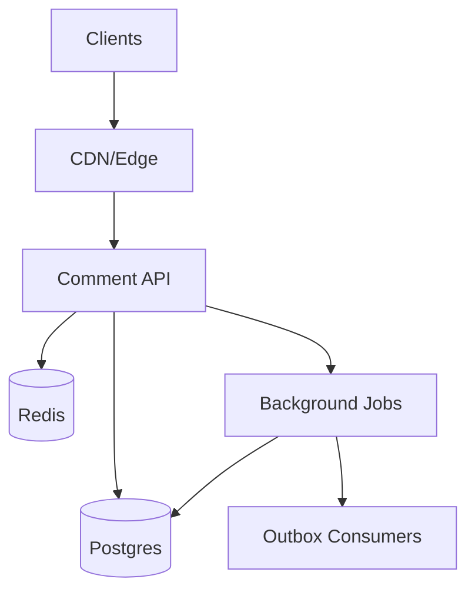
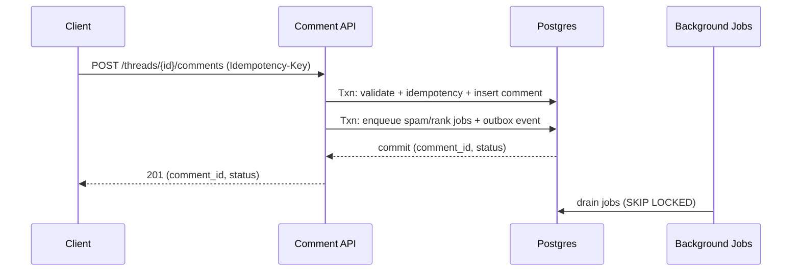

# Comment System

## Overview

This system supports deeply threaded conversations with stable pagination (`new`, `top`), strong consistency for comment visibility and moderation, and near-real-time updates. The core is a single service with a strongly consistent Postgres write path, plus lightweight caching and background jobs for enrichment (spam scoring, ranking updates, outbound integrations).

## Requirements

### Functional
- Create comments and replies with deep nesting.
- Read threads with pagination:
  - top-level pages
  - paged “load more replies” per subtree
- Edit and soft-delete by author; remove/restore by moderators; lock/unlock threads.
- Reporting + review queue; user sanctions (ban, shadow-ban).
- Anti-spam: rate limits, heuristics, ML scoring, quarantine.
- Sort modes: `new`, `top` with stable pagination.
- Auditability: immutable moderation log; comment revision history.
- Near-real-time updates via polling or SSE.

### Non-Functional
- Scale: ~50K read QPS peak, ~5K write QPS peak; multi-year retention up to ~10B comments.
- Latency (server-side): thread page P99 ≤ 150ms; replies page P99 ≤ 200ms; create P99 ≤ 250ms.
- Availability: reads 99.99% (degrade allowed), writes 99.9%.
- Consistency: strong for hierarchy + visibility + moderation + idempotency; eventual for spam/ranking/caches.
- DR: RPO ≤ 1 minute, RTO ≤ 15 minutes.

## Simplified Architecture

### What each node does
- `Comment API`: public comment endpoints + moderation endpoints; enforces visibility semantics and idempotency.
- `Postgres`: source of truth for threads, comments, revisions, reports, audit log, and job/outbox tables.
- `Redis`: rate limiting + short-lived response caching for hot pages.
- `Background Jobs`: in-process worker pool (or separate deployment of the same codebase) that drains Postgres jobs for spam scoring and ranking refresh.
- `Outbox Consumers`: optional downstream integrations (notifications/search/analytics) reading the outbox without impacting core UX.

## Components

### Comment API (user + moderation)
**Responsibilities**
- Comment lifecycle: create/edit/delete (soft).
- Thread reads: top-level pages + subtree reply pages (paged).
- Moderation: report ingestion, review queue, remove/restore, lock/unlock, user sanctions.
- Visibility evaluation: `visible`, `quarantined`, `deleted_user`, `deleted_mod`.
- Idempotency for create and moderation actions.
- Writes to the outbox for best-effort downstream side effects.

**Key behaviors**
- All correctness-critical actions run in a single Postgres transaction:
  - create comment + idempotency key
  - edit comment + revision insert
  - moderation action + audit append + visibility update
  - lock/unlock thread + audit append

### Postgres (single logical model, sharded by `thread_id`)
**Data modeling**
- Use materialized path (`ltree`) for subtree reads and deterministic reply pagination.
- Partition/shard by `thread_id` to keep hot threads localized and to scale to multi-year retention.
- Read replicas serve high-QPS reads; primaries serve writes.

### Redis (cache + rate limiting)
- Rate limiting keyed by `(user_id, ip_hash, thread_id)` with short windows.
- Cache assembled, page-shaped responses:
  - `thread:{thread_id}:top:{mode}:{cursor_or_anchor}`
  - `replies:{comment_id}:{cursor_or_anchor}`
- TTL 10–120s with jitter; cache keys include the sort mode and pagination anchor (`as_of`) to keep pagination stable.

### Background Jobs (spam + ranking + maintenance)
- Postgres-backed job queue (transactional enqueue; `FOR UPDATE SKIP LOCKED` drain).
- Primary tasks:
  - spam scoring + quarantine decisions
  - `rank_top` refresh (time-decay + score) for stable `top` pagination
  - cache soft-invalidation signals (best-effort; TTL remains the correctness boundary)

### Outbox (optional integrations)
- An `outbox_events` table stores durable events (e.g., `CommentCreated`, `CommentEdited`, `ModerationApplied`).
- External systems consume independently; core reads/writes do not wait on them.

## Data Model

### Comment and thread states
- Comment `status`: `visible`, `quarantined`, `deleted_user`, `deleted_mod`
- Thread `status`: `open`, `locked`, `archived`

### Logical schema (Postgres)
**threads**
- `thread_id` (PK), `content_id` (unique), `status`, `created_at`, `last_activity_at`

**comments**
- `comment_id` (PK; UUIDv7/Snowflake), `thread_id` (indexed), `parent_id` (nullable)
- `path` (`ltree`, indexed), `depth`
- `author_id`, `created_at`, `updated_at`, `edited_at`
- `status`, `body`, `score`
- `rank_top` (denormalized ordering key), `version`

**comment_revisions**
- `revision_id` (PK), `comment_id` (indexed), `editor_id`, `body`, `created_at`

**reports**
- `report_id` (PK), `thread_id`, `comment_id`, `reporter_id`, `reason`, `status`, `created_at`

**moderation_actions** (append-only audit log)
- `action_id` (PK), `actor_id`, `target_type`, `target_id`, `action`, `metadata` (jsonb), `created_at`

**idempotency_keys**
- `user_id`, `idempotency_key`, `request_hash`, `result_ref`, `created_at`
- PK `(user_id, idempotency_key)`

**jobs**
- `job_id` (PK), `type`, `payload` (jsonb), `run_at`, `attempts`, `locked_at`, `status`

**outbox_events**
- `event_id` (PK), `type`, `aggregate_id`, `payload` (jsonb), `created_at`, `published_at` (nullable)

### Indexing (core shapes)
- Top-level (`new`): `(thread_id, parent_id, created_at DESC, comment_id DESC)`
- Subtree replies: `GIST(path)` plus `(thread_id, path, comment_id)`
- Moderation queues: partial indexes by `status` and time (e.g., quarantined/reported recent)

## API (core endpoints)

### Create comment
`POST /v1/threads/{thread_id}/comments` with `Idempotency-Key`

- Validates thread, parent, sanctions, and lock state.
- Inserts idempotency record + comment in one transaction.
- Sets initial `status` as `visible` or `quarantined` based on heuristics.
- Enqueues a spam-scoring job and writes an outbox event.

### Edit / delete
- `PATCH /v1/comments/{comment_id}` inserts into `comment_revisions`, updates `comments`, bumps `version`.
- `DELETE /v1/comments/{comment_id}` sets `status=deleted_user` and keeps tombstone.

### Read thread
`GET /v1/threads/{thread_id}?sort={new|top}&limit=20&cursor=...`

- Keyset pagination only.
- For `top`, cursor includes an `as_of` anchor so subsequent pages remain stable.

### Read replies (subtree)
`GET /v1/comments/{comment_id}/replies?limit=50&cursor=...`

- Deterministic traversal order with keyset cursor `(parent_path, last_path, last_comment_id)`.

### Moderation
- `POST /v1/mod/comments/{comment_id}/actions` (remove/restore)
- `POST /v1/mod/threads/{thread_id}/actions` (lock/unlock)
- `POST /v1/comments/{comment_id}/reports`

All moderation actions append to `moderation_actions` and update the target state in the same transaction.

## Data Flows

### Create comment (strong write, async enrichment)

### Read thread page (cache-first)
- `CDN/Edge` caches anonymous first pages briefly (seconds) with `stale-while-revalidate`.
- `Redis` caches assembled pages with short TTL; on miss, `Postgres` serves keyset queries.

## Scaling & Performance

- **Hot threads**: page-shaped caching + bounded reply previews; degrade by disabling previews per thread if needed.
- **Postgres growth**: shard/partition by `thread_id`; keep per-shard primaries with replicas; archive very old threads to read-only storage policies.
- **`top` stability**: `rank_top` refreshed by jobs; pagination anchored by `as_of` carried in the cursor.
- **Tail latency control**: short DB transactions, connection pooling, and strict timeouts around cache calls.

## Availability, DR, and Degradation

- Multi-region: one primary write region per shard; cross-region replica supports failover and read locality.
- Backups: continuous WAL archiving + periodic restore drills to validate RTO.
- Graceful degradation:
  - Redis down: bypass cache and reduce reply previews.
  - Job lag: keep safe defaults (quarantine more aggressively) and rely on TTL for cached pages.

## Simplification Notes

- Removed: separate `Moderation Service` and `Moderation DB` by placing moderation endpoints and the append-only audit log in the same `Comment API` + `Postgres` schema; acceptable because moderation correctness depends on the same visibility state and benefits from single-transaction updates.
- Removed: external `Event Bus` and dedicated `Cache Invalidation Workers` by using a Postgres `outbox_events` table plus short TTL caching; acceptable because core UX does not require immediate downstream processing and cache staleness is bounded by TTL.
- Removed: dedicated `Search Indexer` by keeping moderator-facing queries on indexed Postgres tables (and optional Postgres full-text search); acceptable because moderation query patterns are bounded and can be supported with targeted indexes and partitions.
- Merged: `Spam Scoring Workers` into `Background Jobs` using a Postgres job table; acceptable because spam scoring is eventually consistent and fits a durable, transactional queue.
- Remaining complexity: Postgres sharding/partitioning, materialized paths for subtree pagination, stable `top` pagination anchoring, and multi-region replication; these are required to meet the scale, latency, correctness, and DR targets.