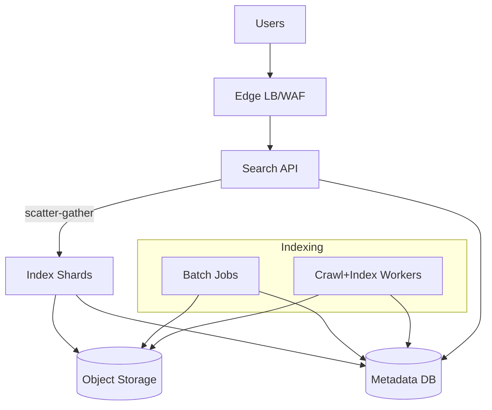
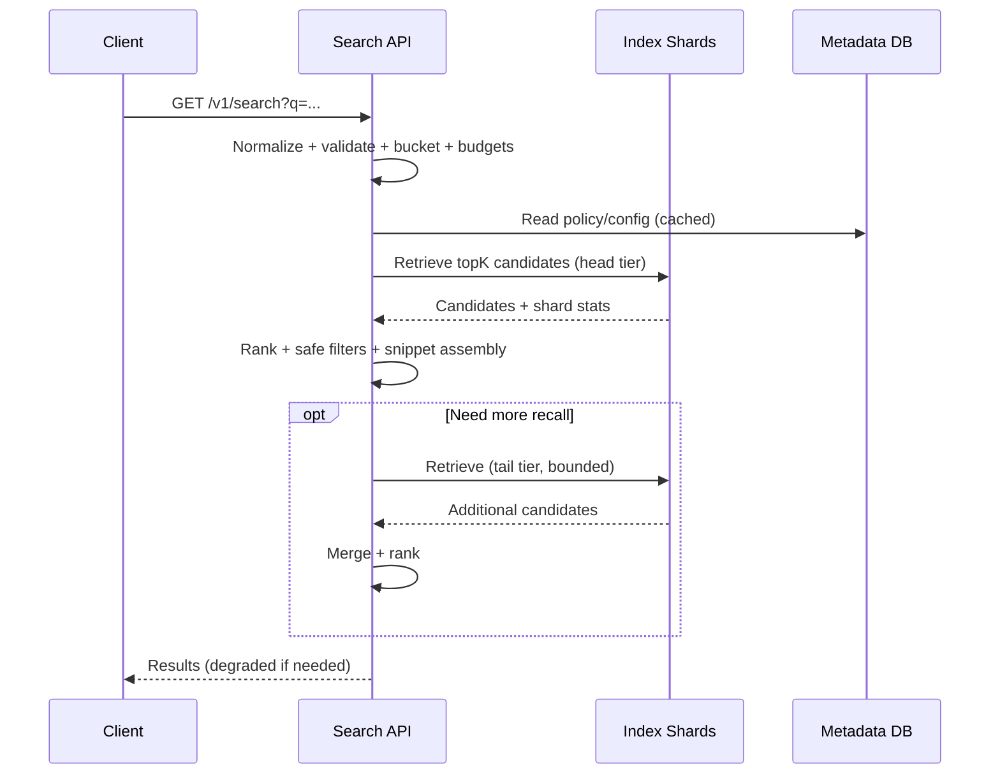
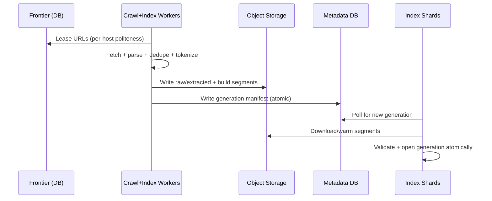

## Overview

This search engine has two systems that evolve together:

1. **Indexing**: crawl the web, extract canonical text, deduplicate, compute signals, and publish immutable index generations.
2. **Serving**: answer queries with low latency by retrieving candidates from sharded indexes, ranking them within strict budgets, and returning snippets safely under partial failures.

The design keeps the data plane simple (few online dependencies) and uses immutable artifacts plus atomic publishing for operational correctness and fast rollback.

## Requirements

### Functional Requirements
- Crawl and refresh documents at scale with politeness (`robots.txt`, per-host rate limits, crawl-delay, adaptive scheduling).
- Extract canonical content from heterogeneous formats (HTML, PDF, feeds), normalize, and deduplicate (exact and near-duplicate).
- Tokenize language-aware text and build an inverted index with positions (phrase queries) and field awareness.
- Support incremental updates (adds/updates/deletes), with atomic publishing and fast rollback.
- Serve search with top-K results, snippets/highlights, safe-search filtering, and operators (`site:`, quotes, time filters).
- Provide autocomplete/suggestions driven by query logs and corpus statistics.
- Provide observability and controls: pause domains, force recrawls, backfill, reindex with schema/versioning.
- Support experimentation (A/B buckets) and controlled rollouts of ranking models and schema versions.

### Non-Functional Requirements (SLOs and Scale)
- **Corpus**: 50B documents; raw fetched content ~5 PB compressed in object storage.
- **Change rate**: 250M–500M docs/day.
- **Crawl throughput**: 100K–300K fetches/sec sustained.
- **Query load**: 50K QPS average, 200K QPS peak (global).
- **Latency**: Search P50 ≤ 60 ms, P95 ≤ 150 ms, P99 ≤ 300 ms (per region); autocomplete P99 ≤ 50 ms.
- **Availability**: serving 99.99% per region with multi-region failover; indexing 99.9%.
- **Durability**: immutable content and index artifacts in replicated object storage; ingestion/control metadata RPO ≤ 5 minutes.
- **Consistency**: serving consistent within a shard generation; freshness eventual; configs/flags strongly consistent.

## Simplified Architecture

### High-Level Diagram

### Serving Flow (Online)

### Indexing Flow (Crawl → Publish)

## Components

### 1) Search API
**Responsibilities**
- Search endpoint, operator parsing, safe-search policy, rate limiting, and request tracing.
- Scatter-gather retrieval to shards, ranking within per-stage budgets, and degraded-mode behavior.
- Autocomplete/suggestions served from an in-memory artifact periodically refreshed from object storage.

**Key design choices**
- **Single online dependency for serving**: the shard cluster; configs/policies are cached locally with TTL.
- **Ranking in one place**: lexical scoring + lightweight LTR in-process; optional neural re-rank is bounded and skipped under load.
- **Snippets from stored fields**: snippets/highlights are assembled from stored fields in the index (or compact snippet source fields), keeping the request path tight.

### 2) Index Shards (Search Cluster)
**Responsibilities**
- Serve retrieval (term dictionary + postings) and stored fields (title/url/snippet source) for top-K.
- Maintain multiple replicas per shard for latency/availability.

**Key design choices**
- **Immutable segments + generations**: shards open new generations atomically after checksum and schema validation.
- **Head/tail tiers**: two index tiers (head then tail) to control fanout and keep typical queries fast at 50B docs.
- **Local warmup**: shards keep hot segments on local SSD/NVMe and use memory-mapped files where appropriate.

### 3) Metadata DB (Control + Metadata)
A strongly consistent relational store (commonly Postgres) holds small but critical state:
- URL frontier queues, host politeness state, and crawl outcomes.
- Index generation manifests, schema versions, rollout state, and rollback controls.
- Domain controls and legal removals.
- Experiment definitions and model/version pins.
- Aggregated query logs for suggestions and guardrails (raw logs kept in object storage with retention).

### 4) Object Storage (Immutable Artifacts)
- Raw fetched content (compressed) and optional extracted text (retention-controlled).
- Index segments, generation manifests, model files, and suggestion artifacts.
- Replicated storage is the durability anchor and the distribution mechanism to regions.

### 5) Crawl+Index Workers
A single worker fleet runs the full ingestion loop:
- Frontier leasing with politeness and adaptive scheduling.
- Fetching with strict limits (timeouts, size caps, MIME allowlists), and robots enforcement.
- Parsing/extraction, canonicalization, and exact/near-duplicate detection.
- Segment building and publishing new generations.

### 6) Batch Jobs (Signals)
Periodic jobs compute signals that improve ranking and safety:
- Link-based metrics, host/domain quality, spam/safety labels, embeddings, and query-derived statistics.
- Outputs are versioned and written to object storage/metadata tables, then incorporated into the next index generation.

## Data Model (Minimal)

### Tables (Metadata DB)
**`hosts`**
- `host_key` (PK), `robots_etag`, `robots_fetched_at`, `crawl_delay_ms`, `next_fetch_at`, `backoff_until`, `error_rate`, `avg_latency_ms`

**`frontier_urls`**
- `url_key` (PK), `url`, `host_key`, `priority`, `next_fetch_at`, `status`, `fail_count`, `last_fetch_at`, `etag`, `last_modified`

**`documents`**
- `doc_id` (PK), `canonical_url`, `url_key`, `fetched_at`, `http_status`, `content_type`, `content_sha256`, `robots_policy`, `parse_version`, `raw_uri`, `extracted_uri`, `dup_of_doc_id`

**`signals`** (versioned, denormalized for index builds)
- `doc_id` (PK), `feature_version`, `pagerank`, `host_quality`, `spam_score`, `freshness`, `safety_labels`, `embedding_uri`

**`index_generations`**
- `tier` (`head|tail`), `shard_id`, `generation`, `schema_version`, `manifest_uri`, `checksum`, `state`, `created_at`  
- Unique key: `(tier, shard_id, generation)`

**`removals`**
- `canonical_url` or `doc_id`, `reason`, `effective_at`, `expires_at`, `requested_by`, `audit_ref`

**`experiments`**
- `experiment_id`, `allocation`, `enabled`, `model_version`, `params_json`, `created_at`

### Index Contents (per shard generation)
- Inverted index (terms → postings with optional positions/fields).
- Stored fields: `url`, `title`, compact snippet source, timestamps.
- Doc values: quality/spam/safety labels and other ranking features (from `signals` at build time).

## API Design

### Search API (REST)
**GET** `/v1/search?q={query}&limit=10&lang=en&safe=on&time=all&pageToken={opaque}`

- `limit` capped (e.g., 50).
- `pageToken` encodes boundary + experiment bucket + generation for stable pagination.

### Suggest API
**GET** `/v1/suggest?prefix=sys%20des&limit=8&lang=en`

- Served from an in-memory suggestion artifact refreshed from object storage.

### Internal Control APIs
**POST** `/internal/index/publish`  
**POST** `/internal/serving/rollback`  
**POST** `/internal/crawl/pause-domain`

All are audited and idempotent.

## Scaling & Performance

- **Fanout control**: two-tier retrieval (head first, tail only if needed) plus per-shard deadlines and early termination (WAND/Block-Max WAND).
- **Caching**: shard-level OS page cache + in-process caches for dictionaries/postings; optional short-lived per-instance result cache in the Search API for hot queries.
- **Index size management**: immutable segments with merge policies tuned per tier; keep last N generations for rollback.
- **Multi-region**: each region runs Search API + shard replicas; object storage replication distributes segments; regions serve from the last known good generation if the control DB is temporarily unreachable.

## Failure Modes & Mitigations

- **Shard replica failure**: retry another replica within deadline; return partial results with `degraded: true`.
- **Bad generation**: shards refuse to open on checksum/schema mismatch; rollback by generation in `index_generations`.
- **Crawl traps**: host-level caps, depth limits, URL normalization rules, quarantine via domain controls.
- **Load spikes**: edge rate limiting + Search API circuit breakers; skip optional stages; tighten timeouts; prefer head tier.
- **Control-plane issues**: serving continues on cached configs and pinned generations; ingestion pauses publishing until metadata writes succeed.

## Operations

- **Serving SLIs**: availability, P50/P95/P99, error rate, degraded rate, shard fanout, per-shard tail latency.
- **Indexing SLIs**: fetch success, politeness violations, pipeline lag, publish success, merge backlog.
- **Quality guardrails**: spam/safety leak rate, relevance checks, experiment health, rollback time.
- **Rollouts**: canary by experiment bucket and shard subset; publish generations atomically; keep rollback window.

## Simplification Notes

- Removed `Feature Store` by baking versioned signals into doc values at index build time; online ranking reads from shards.
- Removed separate `Doc/Metadata Store` by storing required fields and snippet sources as index stored fields.
- Merged `Query Gateway`, `Retriever/Ranker`, and `Suggest Service` into a single `Search API` for one coherent request path.
- Merged parsing, dedupe, and segment building into `Crawl+Index Workers` with a single publish step.
- Replaced a specialized shard catalog/control store with a single `Metadata DB` that also holds frontier state and operational controls.
- Kept sharded replicas, immutable generations, head/tail tiers, and multi-region serving because they are necessary to hit the stated latency and availability targets at web scale.