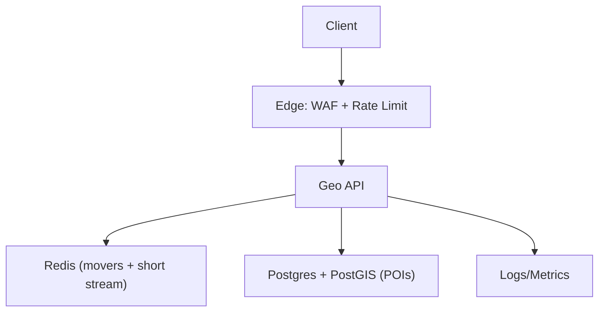
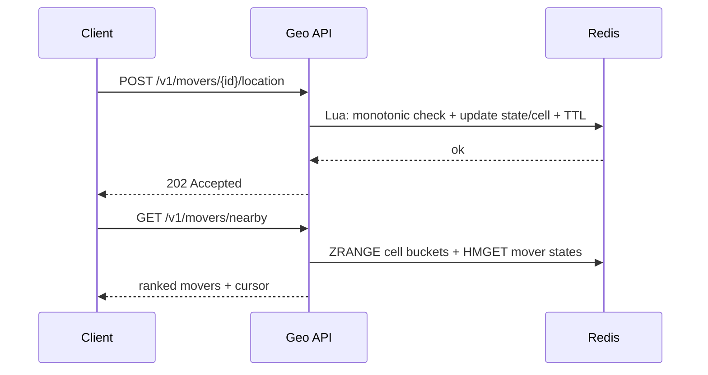
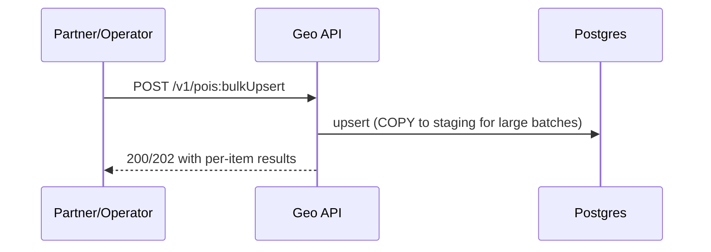

## Overview

Geospatial nearby search powers “what’s near me?” discovery (places, events) and real-time marketplaces (drivers, couriers). The system serves two distinct data shapes:

- **POIs (places/events)**: large, mostly-read dataset requiring geo queries and attribute filters.
- **Movers (drivers/couriers)**: high-frequency location updates requiring freshness guarantees and low-latency nearby lookup.

The design below uses a single backend service with two storage systems:
- **Postgres + PostGIS** for POIs (durable, filterable geo queries).
- **Redis** for movers (fast updates, TTL-based freshness) with a short-retention stream for operational replay.

---

## Requirements

### Functional Requirements
- Nearby POI search within a radius (e.g., 500m–50km) with filters: category, rating, open-now, price, tags.
- Nearby movers search with frequent location updates (e.g., every 1–5s) returning “currently nearby” movers.
- Support circular radius queries and viewport (bounding box) queries.
- Deterministic pagination (stable ordering + cursor).
- Idempotency for client retries (especially location updates).
- Bulk ingestion/upsert for POIs (partner feeds), soft deletes.
- Privacy controls: avoid exposing exact mover location; support rounding/jitter/aggregation as required.

### Non-Functional Requirements (Targets)
**Scale (illustrative, global):**
- POIs: 50M total; active/read-heavy distribution by region.
- POI ingestion: peak 1k writes/s (bulk + incremental updates).
- Movers: 500k concurrent peak; 1–5s updates → peak ~200k updates/s global.
- Queries: 50k QPS global peak (combined POI + movers), bursty.

**Latency (regional, steady state):**
- Nearby query API: P50 ≤ 60ms, P95 ≤ 150ms, P99 ≤ 250ms (excluding client network).
- Location update acknowledgment: P99 ≤ 120ms.
- Freshness goal for movers: median < 2s; worst-case < 5s under normal conditions.

**Availability:**
- Query API: 99.99% (multi-AZ).
- Ingestion pipeline: 99.9% (graceful degradation allowed).

**Consistency:**
- Movers: per-entity monotonicity (ignore out-of-order updates).
- POIs: read-after-write for operator tools; end-user search may be seconds behind during bulk loads.

### Constraints & Assumptions
- Multi-region with clients routed to nearest region; each region serves its own geo-fenced dataset.
- GDPR/CCPA: minimize retention of precise location traces; support deletion/obfuscation.
- Prefer managed services; bounded operational complexity.
- Within-region network is reliable/low-latency; tolerate partial AZ failures.

---

## Simplified Architecture



### What This Architecture Optimizes For
- **Fast mover updates and fresh reads** via Redis TTL state.
- **Flexible POI geo queries and filters** via PostGIS indexes.
- **Simple deployment and on-call** via one backend service and two managed datastores.

---

## Core Concepts

### Movers: Cells → Candidates → Exact Distance
1. Convert query center/viewport into a small set of **covering cells** (Geohash/H3 at a chosen precision).
2. Read mover IDs from those cell buckets in Redis (bounded per bucket).
3. Fetch mover state (lat/lon/timestamp) and compute exact distance in the API.
4. Rank, paginate deterministically, and apply privacy rules.

### POIs: PostGIS Radius/Viewport Queries
- Store a `geography(Point, 4326)` (or `geometry`) column with a GiST index.
- Use `ST_DWithin` for radius and bounding box predicates for viewport queries.
- Use stable ordering and cursor pagination (distance + ID).

---

## Components

### Edge (CDN/WAF/Rate Limit)
**Responsibilities**
- AuthN/AuthZ enforcement, request validation, payload limits.
- Separate quotas for: location updates (writes) and nearby searches (reads).
- Regional routing to the nearest stack; region hint token to reduce bouncing.

---

### Geo API (Single Service)
A single service with two internal modules: **Mover Index** and **POI Search**.

**Responsibilities**
- Location update acceptance with idempotency and monotonicity checks.
- Nearby search for movers and POIs.
- Deterministic pagination and privacy-safe responses.
- Admin/partner endpoints for POI bulk ingestion and soft deletes.

**Key practices**
- Tight time budgets for Redis calls; bounded fanout by design.
- Oversample-then-filter for predicates that are expensive or hard to express in SQL (e.g., `open_now` with complex rules).

---

### Redis (Movers Current State + Short-Retention Stream)
**Responsibilities**
- Store “current location” per mover with TTL freshness.
- Maintain per-cell membership for fast candidate retrieval.
- Keep a short-retention append-only stream (minutes) for operational replay during rebuilds and incident recovery.

**Data structures**
- `mover:{mover_id}` (HASH): `lat`, `lon`, `ts_ms`, `seq`, `cell_id`, `bucket`, `accuracy_m` with `EXPIRE` (e.g., 60s)
- `cell:{cell_id}:{bucket}` (ZSET): member=`mover_id`, score=`ts_ms` (recentness and pruning)
- `stream:locations` (Redis Stream): short retention (e.g., 10 minutes), access-restricted

**Atomic update**
- Use a Redis Lua script to:
  - Reject out-of-order updates using `(seq, ts_ms)`.
  - Move the mover between cell keys when the cell changes.
  - Update the mover hash + TTL.
  - Append to the short-retention stream.

---

### Postgres + PostGIS (POIs)
**Responsibilities**
- Source of truth for POI metadata and geo queries.
- Bulk upsert and soft delete.
- Optional denormalized columns to keep queries fast (e.g., `quality_score`, `is_active`, `popularity`).

**Indexing**
- GiST index on `location` (geography/geometry).
- B-tree indexes for common filters (`region_id`, `price_level`, `rating`, `is_active`).
- GIN index where needed (e.g., `categories` array, `tags` array, `attributes` JSONB).

---

## Data Model

### Movers (Redis)
- `MoverLocation(mover_id, lat, lon, ts_ms, seq, accuracy_m, heading_deg, speed_mps)`
- TTL is the freshness contract (e.g., 60s); reads filter out movers older than a stricter product threshold (e.g., 5s) when required.

**Invariants**
- For each `mover_id`, accepted updates are monotonic by `(seq, ts_ms)`.
- A mover is a member of at most one current cell bucket (best-effort; repaired by periodic pruning).

---

### POIs (Postgres)
**Table: `pois`**
- `poi_id` (PK)
- `region_id`
- `name`
- `location` (PostGIS `geography(Point,4326)` or `geometry`)
- `categories` (text[])
- `rating` (float)
- `price_level` (smallint)
- `tags` (text[])
- `hours_rules` (jsonb)
- `is_active` (bool)
- `updated_at`, `deleted_at` (nullable)

---

## Data Flows

### Movers: Update → Visible in Nearby Search


### POIs: Bulk Upsert → Searchable


---

## API Design

### Location Update (Movers)
`POST /v1/movers/{mover_id}/location`

Request:
```json
{
  "lat": 37.775,
  "lon": -122.418,
  "ts_ms": 1734390000123,
  "seq": 88421,
  "accuracy_m": 8,
  "heading_deg": 120,
  "speed_mps": 7.2
}
```

Response:
- `202 Accepted`
```json
{ "status": "accepted", "effective_ts_ms": 1734390000123 }
```

Behavior
- Enforce monotonicity by `(seq, ts_ms)`; stale updates no-op (optionally return `409`).
- Validate coordinates and basic timestamp sanity; apply per-mover rate limits.

---

### Nearby Movers Search
`GET /v1/movers/nearby?lat={lat}&lon={lon}&radius_m={r}&limit={n}&cursor={token}`

Response:
```json
{
  "results": [
    { "mover_id": "d123", "distance_m": 120, "eta_s": 45, "last_update_age_s": 2 }
  ],
  "next_cursor": "eyJzb3J0X2tleSI6Wy4uLl19"
}
```

Notes
- Server-side caps (example): `radius_m <= 20000`, `limit <= 100`.
- Default response omits coordinates; return distance/ETA and optionally a coarse cell.

---

### Nearby POI Search
`GET /v1/pois/nearby?lat={lat}&lon={lon}&radius_m={r}&categories=coffee&open_now=true&limit=20&cursor={token}`

Response:
```json
{
  "results": [
    { "poi_id": "p9", "name": "Atlas Cafe", "distance_m": 240, "rating": 4.6, "price_level": 2 }
  ],
  "facets": { "categories": [{ "k": "coffee", "count": 120 }] },
  "next_cursor": "eyJzb3J0X2tleSI6Wy4uLl19"
}
```

Implementation detail
- For `open_now=true`, fetch an oversampled candidate set using PostGIS distance ordering, then evaluate `hours_rules` in the API and return the first `limit` matches.

---

### Bulk POI Upsert (Operator/Partner)
`POST /v1/pois:bulkUpsert`
- Authenticated and scoped.
- For large feeds: `COPY` into a staging table then merge into `pois`.
- Supports soft deletes via `deleted_at` and `is_active`.

---

## Scaling & Performance

### Movers (Redis)
- **Write path**: single Lua script keeps updates atomic and low-latency.
- **Hotspot mitigation**:
  - Bucket within a cell: `bucket = hash(mover_id) % B`
  - Candidate caps per bucket (e.g., 200) and bounded number of cells per query.
- **Freshness**:
  - TTL (e.g., 60s) for cleanup.
  - Query-time freshness filter (e.g., exclude `last_update_age_s > 5`).

### POIs (Postgres/PostGIS)
- **Primary pattern**: `ST_DWithin` + indexed location + selective filters.
- **Partitioning**: partition by `region_id` (or shard per region at the service boundary).
- **Bulk ingestion**: staging + merge; throttle to protect query latency.

### Deterministic Pagination
- Movers: sort by `(distance_m, mover_id)`; cursor stores last tuple.
- POIs: sort by `(distance_m, poi_id)`; cursor stores last tuple.

---

## Failure Modes & Resilience

### Redis node/shard outage
- Impact: partial mover visibility.
- Mitigation: multi-AZ Redis, tight timeouts, partial-result behavior, and natural recovery as movers send the next update.
- Operational replay: short-retention stream supports rebuilding cell sets after a failover or during repairs.

### Postgres impairment
- Impact: POI search degradation.
- Mitigation: multi-AZ managed Postgres, read replicas for query load, admission control on expensive filters, and bulk-ingest throttling.

### Surge (downtown / event)
- Impact: hot cells and tail latency spikes.
- Mitigation: cell bucketing + candidate caps, strict radius/limit caps, and load shedding for abusive clients.

### Out-of-order/spoofed mover updates
- Mitigation: auth binding, monotonic `seq`, plausibility checks (speed/teleport), and quarantine tooling for suspicious entities.

---

## Operations

### SLOs (Example)
- Nearby Query: 99.99% availability; P99 ≤ 250ms (regional).
- Mover Freshness: 99% of returned results have `last_update_age_s ≤ 5`.
- Ingest Acceptance: 99.9% availability; P99 ack ≤ 120ms.

### Monitoring
- API: QPS, latency percentiles, error rate, timeouts, per-endpoint saturation.
- Redis: ops/sec, p99 latency, hot keys, memory, evictions, replication health.
- Postgres: query latency, slow queries, CPU/IO, connection pool saturation, replication lag.

### Privacy & Security Controls
- Store only current mover state + short-retention stream (minutes), access-restricted and audited.
- Default responses avoid exact mover coordinates; apply rounding/jitter/aggregation per policy.
- Support deletion workflows (mover state, stream retention policies, and POI records).
- TLS everywhere; least-privilege credentials and strong auth binding of `mover_id`.

---

## Simplification Notes

- Removed: separate API gateway/query service/ingest service split; a single `Geo API` keeps ownership and deployments simple while preserving distinct read/write paths internally.
- Removed: external event bus and dedicated processor; Redis atomic updates plus a short-retention Redis stream provide durability for incident replay and keep mover freshness fast.
- Removed: separate POI search index and metadata DB; Postgres + PostGIS stores canonical POIs and serves geo queries and filters with one operational surface.
- Removed: response cache layer; low-latency comes from bounded Redis fanout for movers and indexed PostGIS queries for POIs (caching remains an optional optimization).
- Merged: mover ingestion + mover query + POI search + POI ingestion into one service to simplify correctness, rollout, and on-call.
- Complexity kept: cell-based indexing and bucketing for movers (required to bound fanout and handle hotspots), and PostGIS geo indexing (required for fast POI radius/viewport queries).