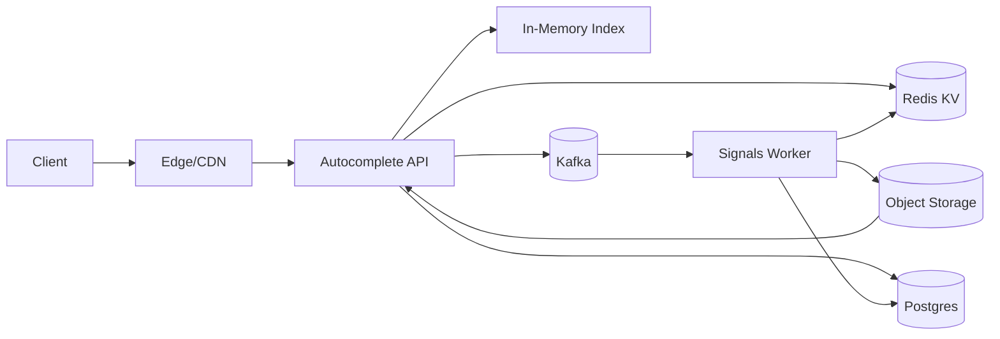
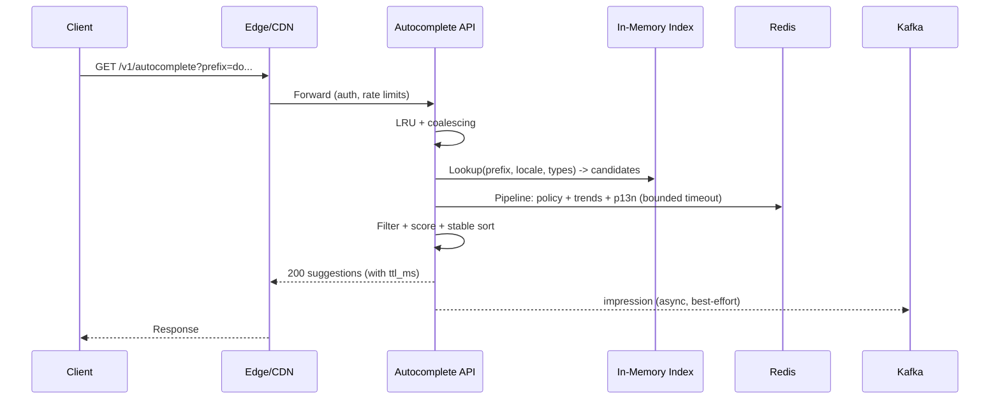

## Overview

Search autocomplete (typeahead) returns ranked suggestions as the user types. The core challenge is serving **very low tail latency** under **bursty, skewed traffic** (hot prefixes) while enforcing **policy/privacy** and incorporating **fresh signals** (trends + lightweight personalization).

This design keeps the serving path tight and local:
1. **Candidate generation**: an in-memory prefix index (FST/trie) returns a small candidate set.
2. **Ranking + rules**: cheap scoring with optional signals, plus hard policy filters and stable ordering.

Signals and indexes update asynchronously; serving always returns a best-effort result within a fixed timeout budget.

---

## Requirements

### Functional
- Suggestions across `QUERY`, `USER`, `HASHTAG`, `TOPIC`.
- Locale-aware normalization (tokenization, diacritics folding, case rules).
- Personalization using bounded user context (recent interactions, affinities).
- Trending boosts that react within minutes.
- Stable top `N` results (default 10) with dedupe and type caps.
- Correct policy/privacy enforcement (blocks/mutes/restrictions), fast and safe.
- Log impressions and accepts for analytics, quality, and abuse detection.
- Graceful degradation when signals are unavailable.

### Non-Functional (SLOs)
- **Latency (server-side, per region)**: p50 < 25ms, p95 < 50ms, p99 < 90ms; hard timeout 120ms.
- **Availability (serving API)**: 99.99% per region; multi-region routing for global availability.
- **Scale (example)**: 150k–250k QPS global autocomplete at peak; logging ingest 5–10× serving QPS.
- **Payload**: typical < 20KB; max 50KB.
- **Consistency**: trends/personalization eventual (seconds–minutes); policy “effectively strong” with rapid propagation and safe fallback.
- **Durability**: analytics RPO ≤ 5 minutes; index artifacts can be up to ~15 minutes stale.

---

## Simplified Architecture

### High-Level Diagram



### Components (Minimal Set)

#### 1) Autocomplete API (Single Serving Service)
A stateless service responsible for the full request lifecycle:
- Normalize prefix (locale rules), validate params, enforce minimum prefix length.
- LRU cache + request coalescing for hot `(prefix, locale, types, auth_segment)`.
- Candidate generation from **local in-memory index**.
- Policy filtering using fast lookups from Redis (with strict fallbacks).
- Lightweight scoring using optional signals from Redis (trending + personalization).
- Post-processing: dedupe, type caps, diversity rules, stable ordering.
- Best-effort async logging to Kafka.

**Timeout budget (example, 90ms p99 target)**
- 5ms parse/normalize
- 5ms LRU + coalescing
- 5ms local index lookup
- 10–15ms Redis (policy + signals, pipelined)
- 10ms scoring + formatting
- remainder for queueing + network

#### 2) In-Memory Prefix Index (Candidate Generation)
- Per locale (and optionally per entity type) FST/trie storing `topK` candidate IDs per node (K ~ 50).
- Loaded on startup from versioned artifacts; refreshed periodically.
- Supports **atomic swaps**: download → checksum validate → mmap/load → flip pointer.

This keeps the hot path free of network calls for candidate generation.

#### 3) Redis KV (Hot Data for Serving)
One Redis deployment per region provides fast, bounded lookups:
- **Policy** (hard constraints): block/mute sets, restricted entity flags, deny/allow lists.
- **Trending**: time-decayed popularity scores by `(locale, candidate_id)`.
- **Personalization**: small, derived per-user features (recent candidate IDs, affinities), with TTLs.
- Optional shared cache entries for very hot anonymous prefixes (edge caching still preferred for anonymous).

Autocomplete calls Redis in a single pipelined batch per request when needed.

#### 4) Kafka (Event Log)
A durable, replayable event stream for:
- `autocomplete_impression`
- `autocomplete_accept`
- upstream trend signals (optional, if produced elsewhere)

Serving publishes asynchronously with a small in-memory buffer; failures do not block responses.

#### 5) Signals Worker (Single Background Processor)
One logical worker (horizontally scalable consumer group) that:
- Consumes Kafka events.
- Updates trend counters/scores in Redis (windowed/decayed).
- Periodically rebuilds the prefix index artifacts (or applies incremental updates) and writes to object storage.
- Writes audit/metadata to Postgres (versions, job status, checkpoints).

Implementation can be a straightforward service using Kafka consumer offsets + periodic timers (no separate stream-processing tier required).

#### 6) Postgres (Source of Truth + Audit)
Postgres stores durable configuration and audit data:
- Candidate catalog metadata needed for index builds (IDs, display text, locale, base weights, safety flags).
- Policy source-of-truth records (blocks/mutes/restrictions) and replication/export jobs into Redis.
- Version history: `index_version`, `model_version`, job status, and rollbacks.

Serving does not depend on Postgres for the p99 path; it’s used for admin workflows and background jobs.

#### 7) Object Storage (Index Artifacts)
- Versioned index artifacts per locale/type.
- Stored with checksums; Autocomplete API pulls latest validated version and atomically swaps.
- Supports fast rollback by pinning a prior version.

---

## Request Flow



---

## Data Model (Conceptual)

### Candidate (Index + Metadata)
- `candidate_id` (stable string, e.g. `q:<hash>`, `u:<id>`)
- `type` (`QUERY|USER|HASHTAG|TOPIC`)
- `display_text`
- `normalized_text`
- `locale`
- `base_weight`
- `safety_flags`
- `updated_at`

### Redis Keys (Examples)
- Policy:
  - `block:{user_id}` → set of blocked `user_id`s (TTL refreshed)
  - `mute_topic:{user_id}` → set of muted `topic_id`s
  - `restricted:{candidate_id}` → boolean/flag
- Trending:
  - `trend:{locale}:{candidate_id}` → `{score, updated_at_ms}` (TTL hours)
- Personalization:
  - `p13n:{user_id}:recent` → list of candidate IDs (bounded, TTL days)
  - `p13n:{user_id}:affinity` → small map of `{candidate_id -> score}` (bounded, TTL days)

### Events (Kafka)
- `autocomplete_impression`: `request_id`, `user_id?` (pseudonymous), `prefix`, `locale`, `types`, `shown`, `ts`, `index_version`, `model_version`, `fallback_flags`
- `autocomplete_accept`: `request_id`, `candidate_id`, `ts`

---

## API

### Autocomplete
`GET /v1/autocomplete?prefix={string}&limit={int}&locale={string}&types={csv}&session_id={string}`

- `limit` default 10, max 20.
- Client guidance: debounce 50–100ms; respect `ttl_ms`.
- Anonymous responses may be edge-cacheable with a very short TTL.

Response:
```json
{
  "request_id": "uuid",
  "prefix": "do",
  "locale": "en-US",
  "index_version": "2025-12-17T10:05:00Z",
  "model_version": "ranker_v1",
  "suggestions": [
    { "candidate_id": "q:donald_trump", "type": "QUERY", "text": "donald trump", "score": 0.87 }
  ],
  "ttl_ms": 200,
  "debounce_ms": 75
}
```

### Accept Signal (Optional)
`POST /v1/autocomplete/accept` → `204 No Content`

---

## Ranking & Policy (Serving Logic)

### Ranking (Cheap, Stable)
- Score = `base_weight` + `trend_boost` + `personal_boost` + small heuristics (length, prefix quality).
- Deterministic post-processing:
  - Hard policy filters first.
  - Dedupe by normalized form.
  - Type caps and diversity constraints.
  - Stable tie-breaker (`candidate_id`) and carryover bias for previously shown items.

### Policy Enforcement (Fast, Safe)
- Redis-backed policy lookups with strict deadlines.
- Safe fallback:
  - If policy data is missing/stale for sensitive entities, omit those entities from results.
  - Always prefer correctness over recall for safety-related filters.
- Include `policy_snapshot_id`/`policy_epoch` internally for audits (from worker-exported versions).

---

## Scaling & Performance

- **Hot prefixes**: minimum prefix length (locale-specific), request coalescing, small LRU TTL (100–300ms), and edge caching for anonymous traffic.
- **Service scaling**: stateless autoscaling on CPU + p99; each pod holds the in-memory index.
- **Redis scaling**: cluster/shards per region; keep payloads small and keys bounded.
- **Index size pressure**: split artifacts per locale and entity type; load only relevant locales per region if needed.

---

## Failure Modes & Mitigations

1) **Redis latency/outage**
- Serve using index + base weights only; skip personalization/trends.
- Enforce strict Redis timeouts and circuit breaker.
- Maintain “safe omission” behavior for sensitive policy-dependent suggestions.

2) **Index refresh failure / bad artifact**
- Validate checksum before swap; keep last-known-good loaded.
- Pin prior `index_version` for rollback.

3) **Hot prefix surge**
- Minimum prefix gating, coalescing, short TTL cache.
- Rate limiting at edge (per IP/user) and fast `429/503` with higher debounce hints.

4) **Kafka backlog / worker down**
- Serving unaffected; trends/index freshness degrades gradually.
- Kafka retention enables replay; worker resumes and catches up.

---

## Operations

### Metrics (Serving)
- p50/p95/p99 latency, QPS, error rate
- LRU hit rate + coalescing rate
- Redis timeout rate and fallback rate
- Empty-result and short-prefix rates
- Quality proxies: accept rate, reformulation rate

### Rollouts
- Canary Autocomplete API changes (watch p99 + fallbacks).
- Versioned index/model artifacts with quick rollback.
- Feature flags to disable trend/p13n boosts under dependency stress.

### Privacy & Abuse
- Store derived/pseudonymous identifiers for logs where possible.
- Retention limits for raw prefixes; avoid storing raw user-entered strings tied to identity beyond policy.
- Rate limits + scraping detection based on QPS and accept-rate anomalies.

---

## Simplification Notes

- Removed: separate ranker service and dedicated policy service; serving logic lives in the Autocomplete API for a single hop and simpler deployments.
- Removed: separate stream-processing tier and separate index-builder service; one Signals Worker handles aggregation and index builds.
- Removed: multiple cache layers as standalone components; a small in-process LRU plus a single Redis KV covers the hot data needs.
- Merged: “policy snapshot cache + policy store” into Postgres (source of truth) + Redis (serving projection) with versioning for audits.
- Complexity kept: in-memory index (tail-latency requirement), Redis (fast policy/signals), Kafka (replayable logging and trend freshness), multi-region routing (availability target).