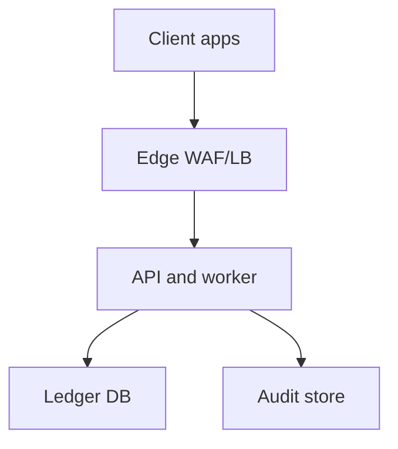
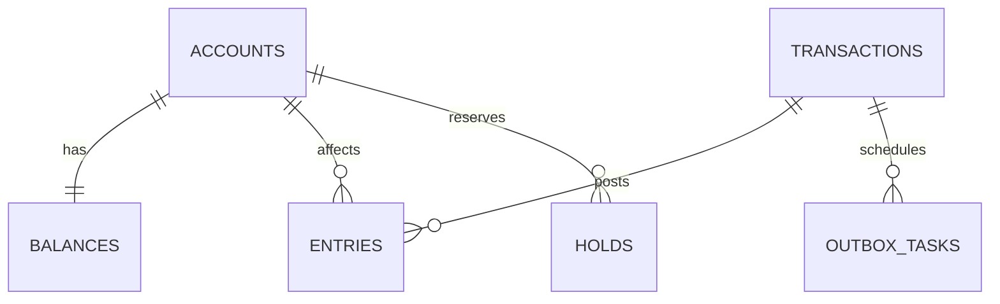
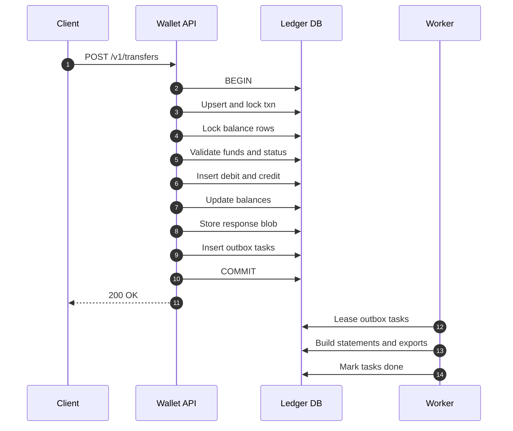

## Overview

A digital wallet maintains user balances while supporting high-throughput peer-to-peer transfers, preventing double-spends/overdraft, and producing an immutable audit trail suitable for investigations and compliance.

The system is built around an **append-only, double-entry ledger** stored in a **strongly consistent SQL database**:
- Every money movement posts **balanced debit/credit entries** (sum per `txn_id` + `currency` equals 0) in a single ACID transaction.
- **Balances are derived from the ledger** and **materialized** in a `balances` table updated transactionally with journal writes for fast reads.
- Auditability comes from **immutability**, **tamper evidence** (hash chaining + signed manifests), and **reconciliation** between `balances` and the journal.

## Requirements

### Functional Requirements
- Create and manage wallet accounts per user and currency.
- Support peer-to-peer transfers with atomic debit/credit posting.
- Prevent double-spend and overdraft (unless explicitly allowed via credit line).
- Provide transaction history and downloadable statements.
- Support idempotent transfer submission (safe retries from clients).
- Support holds/reservations (place/capture/release/expiry).
- Support admin operations: adjustments, reversals, and account freezing.
- Provide audit trails and reconciliation reports.

### Non-Functional Requirements (Targets)
**Scale (illustrative)**
- Users: 10M
- Accounts: 50M (multi-currency)
- Transfers: peak 5,000/sec, sustained 1,000/sec
- Balance reads: peak 50,000/sec
- History/statement reads: 200,000/day
- Ledger writes: plan for **10–30B journal entries/year** (entries + holds + fees)

**Latency (single-region strong consistency)**
- Balance read: P50 20ms, P99 100ms
- Transfer submit (posted): P50 80ms, P99 250ms

**Availability**
- Transfers + balance reads: 99.99% (monthly)
- Statements/reporting: 99.9% (monthly)

**Consistency**
- Transfers/holds: **linearizable** (no double-spend; exactly-once effect via idempotency)
- Balance reads: strong by default; optional bounded-stale for non-critical UI refresh
- Reporting/analytics: eventual consistency

**Durability**
- RPO 0 for committed ledger entries
- RTO 30 minutes (regional failover)
- Retention: ledger entries retained 7–10 years, with immutable exports

### Constraints & Assumptions
- Single legal entity wallet (not a full bank core), but audit-ready.
- Monetary amounts stored as integer **minor units** (no floats).
- No FX inside a transfer; cross-currency flows are separate products.
- Team can operate a strongly consistent SQL database and object storage with retention locks.

## Simplified Architecture

### High-Level Diagram



### Components

#### Edge (WAF/LB)
- TLS termination, routing, request size limits, rate limiting (global and per-user).
- Enforces presence of `Idempotency-Key` on mutating endpoints.
- Propagates `X-Request-Id` for tracing.

#### Wallet API + Worker (single deployable)
One codebase and deployment unit with two execution modes:
- **API**: synchronous, strongly consistent operations (transfers, holds, balance/history reads, admin actions).
- **Worker**: background tasks (statement generation, reconciliation, audit exports, hold expiry).

This keeps the correctness path simple (single service owns invariants) while still supporting async workflows without additional infrastructure.

#### Ledger SQL DB (source of truth)
A strongly consistent SQL database (e.g., Spanner/CockroachDB/YugabyteDB) providing:
- ACID transactions for posting transfers/holds.
- Multi-zone and optional multi-region replication to meet RPO/RTO targets.
- SQL querying for history, admin tools, and reconciliation.

#### WORM Audit Store
Object storage with retention/WORM locks and KMS:
- Immutable exports of journal slices and signed manifests.
- Access-controlled retrieval for investigations and compliance.

## Core Model

### Double-Entry Ledger
Each transfer posts at least two journal entries:
- Debit sender account
- Credit receiver account

Invariant (enforced by application logic + validation query):
- For each `txn_id` and `currency`: `sum(credits) - sum(debits) == 0`

### Append-Only Journal
Journal entries are immutable. Corrections use new transactions:
- **Reversal** transaction (negating prior entries)
- **Adjustment** with admin attribution and reason codes

### Materialized Balances
Balances are stored for fast reads and updated in the same transaction as journal writes:
- `posted_balance_minor`
- `held_balance_minor`
- `available_balance_minor = posted - held (+ credit line if enabled)`

### Idempotency (Exactly-Once Effect at the API Boundary)
Every mutating request carries `Idempotency-Key` scoped to caller + endpoint:
- Same `(scope, key)` + same payload hash returns the stored canonical response.
- Same `(scope, key)` + different payload hash returns `409 idempotency_conflict`.

## Data Model (Authoritative)

### Tables

**accounts**
- `account_id` (UUID, PK)
- `user_id` (UUID, indexed)
- `currency` (CHAR(3))
- `status` (ENUM: active, frozen, closed)
- `created_at` (TIMESTAMP)

**balances** (materialized, authoritative for reads)
- `account_id` (UUID, PK, FK accounts)
- `posted_balance_minor` (BIGINT)
- `held_balance_minor` (BIGINT)
- `available_balance_minor` (BIGINT)
- `updated_at` (TIMESTAMP)
- Constraint (if no overdraft): `available_balance_minor >= 0`

**transactions** (business object; immutable except status transitions)
- `txn_id` (UUID, PK)
- `type` (ENUM: p2p, hold_place, hold_capture, hold_release, adjust, reversal)
- `status` (ENUM: pending, posted, voided)
- `request_scope` (STRING)
- `idempotency_key` (STRING)
- `request_hash` (BYTES)
- `response_blob` (BYTES)
- `created_at` (TIMESTAMP)
- `posted_at` (TIMESTAMP, nullable)
- Unique: `(request_scope, idempotency_key)`

**entries** (append-only journal)
- `entry_id` (UUID, PK)
- `txn_id` (UUID, indexed)
- `account_id` (UUID, indexed)
- `amount_minor` (BIGINT, > 0)
- `currency` (CHAR(3))
- `direction` (ENUM: debit, credit)
- `posted_at` (TIMESTAMP)
- `entry_hash` (BYTES) — `H(entry_fields || prev_entry_hash)`
- `prev_entry_hash` (BYTES, nullable)

**holds**
- `hold_id` (UUID, PK)
- `account_id` (UUID, indexed)
- `amount_minor` (BIGINT, > 0)
- `currency` (CHAR(3))
- `status` (ENUM: active, captured, released, expired)
- `request_scope` (STRING)
- `idempotency_key` (STRING)
- `created_at` (TIMESTAMP)
- `expires_at` (TIMESTAMP)
- Unique: `(request_scope, idempotency_key)`

**outbox_tasks** (internal async work queue in the DB)
- `task_id` (UUID, PK)
- `type` (ENUM: statement_build, notify, audit_export, reconcile)
- `aggregate_id` (UUID, nullable)
- `payload` (JSONB)
- `created_at` (TIMESTAMP)
- `leased_until` (TIMESTAMP, nullable)
- `completed_at` (TIMESTAMP, nullable)

### Relationships



## Key Flows

### Transfer Write Path (Strongly Consistent)



### Balance Read Path
- Default: strong read of `balances` from the Ledger DB.
- Optional: bounded-stale reads for non-critical UI refresh, explicitly requested by clients.

### Holds
- Place hold: increase `held_balance_minor`, decrease `available_balance_minor` (single transaction).
- Capture: convert hold into a posted debit (ledger entries + adjust held/available).
- Release/Expire: reduce held and restore available (single transaction).
- Expiry processing: worker periodically finds `holds` past `expires_at` and expires them transactionally.

## API Design

### Conventions
- Amounts in integer minor units.
- All mutating endpoints require `Idempotency-Key`.
- Standard error envelope:

```json
{
  "error": {
    "code": "insufficient_funds",
    "message": "Available balance is insufficient.",
    "request_id": "string"
  }
}
```

### Create Transfer
`POST /v1/transfers`

Request/response and error semantics follow the input contract, with idempotency enforced via `(request_scope, idempotency_key)` uniqueness and stored `request_hash` + `response_blob`.

### Get Balance
`GET /v1/accounts/{account_id}/balance?consistency=strong|bounded_stale`

Returns `posted/held/available`, `as_of`, and `consistency`.

### List Transactions
`GET /v1/accounts/{account_id}/transactions?limit=50&cursor=...`

Uses cursor pagination over `(posted_at, txn_id)` and joins to entries as needed to present direction and amount from the account perspective.

## Correctness & Invariants

- **No double-spend**: posting requires row locks (or serializable isolation) on the affected `balances` rows.
- **No overdraft**: constraint enforced in the posting transaction (and optionally guarded with a DB check constraint where supported).
- **Balanced entries**: application constructs balanced legs; worker reconciliation verifies invariant continuously.
- **Idempotency**: uniqueness on `(scope,key)` with payload hash validation and stored canonical response.
- **Immutability**: no updates to `entries`; reversals/adjustments are new transactions.

## Scaling & Performance

- **Hot accounts**: lock contention on a single `balances` row is handled with per-account throttles and clear retry semantics (`429` + `Retry-After`).
- **Large journal**: `entries` is time-partitioned (e.g., monthly) and indexed for history queries: `(account_id, posted_at DESC, entry_id)`.
- **Read scaling**: balance reads hit `balances`; history reads use indexes and pagination; optional read replicas (where supported) serve bounded-stale reads.
- **Write scaling**: partition/cluster primary data by `account_id` to reduce cross-partition work; keep secondary indexes minimal on the write path.

## Operations

### Availability & DR
- Wallet API + Worker runs in multiple zones with stateless scaling.
- Ledger DB is deployed with quorum replication across zones; optional multi-region configuration for regional failover with RPO 0 for committed entries and RTO ≤ 30 minutes.
- During uncertain failover states, transfers are paused first; balance reads remain available only when strongly consistent.

### Monitoring (Minimum)
- Transfers: success rate, P99 latency, db lock wait/txn retries.
- Correctness: negative available count (must be 0), unbalanced transaction count (must be 0), reconciliation mismatches.
- Idempotency: conflict rate, in-progress stuck requests.
- Worker: outbox backlog, lease timeouts, task failure rate.
- Audit exports: export lag, manifest verification failures.

### Reconciliation & Audit
- Continuous/periodic job recomputes balances from journal for flagged accounts and samples; scheduled full passes as capacity allows.
- Audit exports create immutable slices (e.g., hourly/daily) with signed manifests (hashes + counts + coverage) stored in the WORM Audit Store.

## Simplification Notes

- Removed `Redis` cache by serving balances from the authoritative `balances` table and offering optional bounded-stale reads for non-critical UI refresh.
- Removed the external `Event Bus` and separate `Outbox Publisher/Consumers` by using a DB-backed `outbox_tasks` table processed by the built-in worker.
- Removed the separate `Analytics Store/Lakehouse` from the core system by keeping operational reporting in the ledger DB and treating external analytics as a downstream export from audit/statement outputs.
- Merged `Wallet Service`, `Outbox Publisher`, and “Consumers” into a single `Wallet API + Worker` deployable to reduce operational surface area while preserving synchronous correctness and asynchronous side effects.
- Kept `Ledger SQL DB` complexity because linearizable transfers/holds, RPO 0 durability, and audit-grade history require a strongly consistent, highly available system of record.
- Kept the `WORM Audit Store` because long retention with immutability guarantees is required for compliance-grade exports and investigations.