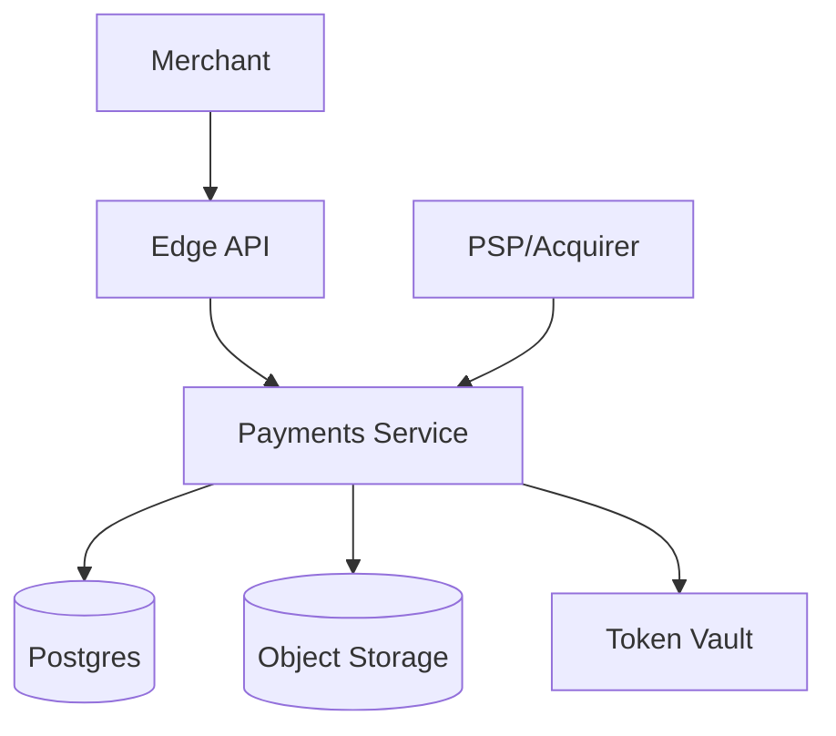
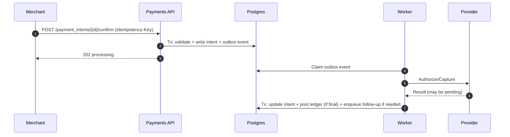
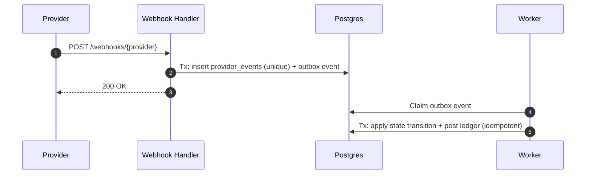

## Overview

This payment gateway provides a merchant-facing API for creating and managing `PaymentIntent`s (authorize, capture, sale), securely handling sensitive payment data, routing transactions to external providers, and producing an auditable financial record.

The core of the design is a single deployable **Payments Service** with clear internal modules:
- **API + state machines** for `PaymentIntent`, refunds, disputes, and payouts
- **Provider orchestration** for routing, retries, timeouts, and SCA/3DS flows
- **Webhook ingestion** with verification, deduplication, and replay safety
- **Double-entry ledger** as the financial system of record
- **Async jobs + projections** for reporting, exports, reconciliation, and operational workflows

Correctness comes from:
- strict **idempotency** for all mutating operations
- deterministic **state transitions**
- an append-only **ledger** with strong invariants
- a DB-backed **outbox/job queue** for durable asynchronous processing

## Requirements

### Functional Requirements
- Create/manage `PaymentIntent` for `authorize`, `capture`, and `sale` flows (automatic or manual capture).
- Support multiple payment methods (cards, wallets) and multiple providers with routing/failover rules.
- Enforce idempotency for all mutating operations: create/confirm/capture/refund/payout.
- Ingest provider webhooks/events with signature verification, deduplication, and correct handling of out-of-order delivery.
- Maintain a double-entry ledger for payments, refunds, fees, disputes/chargebacks, payouts, and adjustments.
- Provide merchant reporting APIs: transactions, balances (available/pending/reserved), settlements, exports.
- Provide operational tools: manual review/override with audited actions, controlled replays, reconciliation exceptions.
- Minimize PCI DSS scope: tokenize PAN; never store CVV; tightly control card data access.

### Non-Functional Requirements

#### Scale
- ~50M successful payments/day (~580 TPS average), with retries and adjacent ops (refunds, captures, disputes).
- API peak ~20k QPS; webhook peak ~5k QPS.
- Data growth: hundreds of millions of append rows/day across ledger + events + projections.

#### Latency
- Create intent: P50 40ms, P99 200ms (gateway excluding provider).
- Confirm intent: P50 60ms, P99 250ms (gateway excluding provider).
- End-to-end confirm including provider: P50 400–800ms, P99 2–5s (SCA/3DS may be async).
- Webhook acknowledgement: P99 200ms (durable write + enqueue).

#### Availability & Semantics
- Public API: 99.99% monthly availability.
- Webhook ingestion: 99.99% monthly availability (ack after durable write).
- Ledger posting: fail-closed for money movement; never acknowledge unless durably committed.
- Strong consistency for idempotency + ledger posting (per merchant/currency partition).
- Eventual consistency for reporting/export projections.

#### Durability & Retention
- Ledger: RPO 0 for acknowledged postings.
- Derived views: rebuildable from authoritative records; RPO ≤ 5 minutes.
- Financial/audit data retention: 7+ years, with WORM controls where required.

## Simplified Architecture

### High-Level Diagram

### What Each Node Does
- **Edge API**: TLS termination, WAF, auth, rate limiting, request normalization.
- **Payments Service**: REST API + webhook endpoint + background workers (one deployable, modular codebase).
- **Postgres**: system of record for payment metadata, idempotency, provider events, ledger, outbox/jobs, reporting projections.
- **Object Storage**: settlement files, dispute evidence, exports, large webhook payload archives (encrypted).
- **Token Vault**: tokenization and restricted PAN access; CVV never stored.
- **PSP/Acquirer**: external payment processing and webhooks.

## Core Service Design (Single Deployable, Clear Modules)

### 1) Public API (PaymentIntents / Refunds / Payouts)
**Responsibilities**
- Merchant-facing endpoints and validation.
- `PaymentIntent` state machine (authorize/capture/sale).
- Idempotency enforcement for every mutation.
- Fast reads from DB projections and snapshots.

**Key behaviors**
- Mutating requests write durable state in Postgres and enqueue work via an outbox/job row in the same transaction.
- Responses return either final state (when known) or `202 processing` when provider outcome is uncertain.

### 2) Provider Orchestration (Inside the Same Service)
**Responsibilities**
- Routing rules, provider adapters, timeouts, retries/backoff, circuit breakers.
- SCA/3DS flows (redirect-based or async completion).
- Canonicalization of provider outcomes into internal events.

**Provider safety**
- Provider idempotency keys when supported.
- Per-provider concurrency limits and retry budgets to prevent retry storms.

### 3) Webhook Ingestion (Same Service, Separate Handler Path)
**Responsibilities**
- Verify signature and timestamp (replay protection).
- Deduplicate by `(provider, provider_event_id)` using a unique constraint.
- Acknowledge `2xx` only after durable write + enqueue.

### 4) Ledger (Financial System of Record)
**Responsibilities**
- Append-only, double-entry postings for all money movement.
- Balance snapshots for fast reads.
- Posting idempotency to guarantee exactly-once effects.

**Correctness model**
- Serialize postings per `(merchant_id, currency)` partition using DB transactions and constraints.
- Model `pending`, `available`, and `reserved` balances explicitly using separate accounts.

### 5) Async Jobs and Projections (DB-Backed)
**Responsibilities**
- Process outbox events and scheduled jobs:
  - provider follow-ups/polling when needed
  - reporting projections and exports
  - reconciliation ingestion/matching
  - dispute lifecycle timers and evidence workflows
- Provide operator tooling for replay and backfill.

**Mechanism**
- `outbox_events` + `jobs` tables; workers use `SELECT ... FOR UPDATE SKIP LOCKED` to claim work.
- Each handler is idempotent via unique constraints and “already applied” markers.

## Data Model (Single Postgres, Partitioned)

### Key Tables (Illustrative)

**Merchant + configuration**
- `merchants(merchant_id, status, default_currency, config_json, created_at)`

**Payment metadata**
- `payment_intents(pi_id, merchant_id, amount, currency, status, capture_method, created_at, updated_at, version)`
- `payment_attempts(attempt_id, pi_id, provider, provider_ref, status, created_at, updated_at)`
  - Unique where possible: `(provider, provider_ref)`
- `refunds(refund_id, pi_id, merchant_id, amount, currency, status, provider_ref, created_at, updated_at)`
- `disputes(dispute_id, pi_id, merchant_id, provider_ref, stage, reason_code, status, due_by, created_at, updated_at)`

**Idempotency**
- `idempotency_keys(merchant_id, idem_key, request_hash, response_blob, status, created_at, expires_at)`
  - Unique: `(merchant_id, idem_key)`

**Provider webhooks (raw + dedup)**
- `provider_events(provider, provider_event_id, received_at, payload_hash, raw_payload_ptr, parsed_type, parsed_ref)`
  - Unique: `(provider, provider_event_id)`

**Outbox + jobs**
- `outbox_events(event_id, merchant_id, type, payload_json, created_at, published_at)`
- `jobs(job_id, type, run_at, attempts, locked_at, payload_json, status)`

**Ledger (append-only)**
- `accounts(account_id, merchant_id, currency, type)`
- `ledger_transactions(ltx_id, merchant_id, currency, type, correlation_id, created_at)`
- `ledger_entries(entry_id, ltx_id, account_id, direction, amount, created_at)` (amounts are integers in minor units)
- `posting_idempotency(merchant_id, posting_key, ltx_id, created_at)` (optional but recommended)
- `balance_snapshots(account_id, as_of_entry_id, balance, updated_at)`

### Ledger Invariants
- For each `ltx_id`: total debits == total credits.
- Ledger entries are immutable; reversals are new transactions.
- `posting_idempotency` (or equivalent unique key) prevents double posting for a business action.

## Key Flows

### Confirm Flow (Async-Safe)

### Webhook Ingestion (Durable + Dedup)

## API Design (REST)

### Conventions
- `Idempotency-Key` required for all POST/PUT/PATCH that mutate state; scoped by `(merchant_id, key)`.
- Store `request_hash`; reuse with different payload returns `409 idempotency_conflict`.
- Use `202 Accepted` when provider outcome is unknown but resolvable asynchronously.
- Money is `amount` in minor units + `currency` ISO code.
- Cursor pagination for listing endpoints.

### Core Endpoints
- `POST /v1/payment_intents`
- `POST /v1/payment_intents/{pi_id}/confirm`
- `POST /v1/payment_intents/{pi_id}/capture`
- `POST /v1/refunds`
- `GET /v1/balance` (available/pending/reserved)
- `GET /v1/transactions`
- `POST /v1/webhooks/{provider}`

### Errors
- `409 idempotency_conflict`
- `422 invalid_state_transition`
- `429 rate_limited`
- `502 provider_unavailable`
- `504 provider_timeout` (prefer `202 processing` when outcome is ambiguous)

## Scaling & Performance

### Database-first scaling (with clear boundaries)
- Partition hot append tables (`ledger_entries`, `provider_events`, `outbox_events`) by time and/or hash of `merchant_id`.
- Index for the primary access paths: per-merchant timelines, intent lookups, ledger correlation lookups.
- Use read replicas for heavy read endpoints (transactions, reporting) while keeping writes on a primary.
- Keep critical write transactions small: validate → write state → enqueue outbox → commit.

### Hot merchants & fairness
- Rate limit per merchant at the edge.
- Provider orchestration enforces per-merchant and per-provider concurrency limits.
- Ledger posting serializes by `(merchant_id, currency)` to preserve invariants while allowing parallelism across merchants.

### Reporting
- Reporting endpoints read from pre-aggregated tables/snapshots maintained by workers.
- Large exports run as jobs and write results to object storage.

## Failure Modes & Resilience

- **Client retries/timeouts**: idempotency keys + request hashes return the original outcome deterministically.
- **Webhook duplication/reordering**: unique constraint on provider event IDs; state machines reject invalid transitions; ledger posting is idempotent.
- **Provider outages**: bounded concurrency, retry budgets, circuit breakers; `202 processing` with follow-up polling/webhook resolution.
- **DB/ledger unavailability**: fail-closed for money movement; API returns errors rather than acknowledging ambiguous state.
- **Reconciliation drift**: daily ingestion/matching jobs; exceptions tracked; adjustments are explicit ledger transactions.

## Security & Compliance

- PCI DSS scope minimized via a **token vault**; PAN access is restricted, logged, and encrypted; CVV never stored.
- Encrypt in transit and at rest; strict RBAC and least privilege for operators and services.
- Webhooks: signature verification + replay protection; secrets rotation; audit logs for sensitive operations.
- Data retention: financial and audit records retained 7+ years; non-financial PII minimized and lifecycle-managed.

## Simplification Notes

- **Removed**: standalone event bus and multiple worker services; durable async work runs via `outbox_events`/`jobs` in Postgres with idempotent handlers.
- **Removed**: Redis cache layer; correctness-critical reads/writes use Postgres, with in-process caching for small configuration reads.
- **Removed**: separate OLAP/search store; reporting uses Postgres projections/snapshots and asynchronous exports to object storage.
- **Merged**: Payments API, orchestrator, webhook ingest, ledger posting, reconciliation, disputes, and reporting projections into a single deployable **Payments Service** with internal modules.
- **Complexity retained**: double-entry ledger invariants, idempotency, webhook verification/dedup, and async-safe payment finality—necessary for financial correctness and provider behavior.