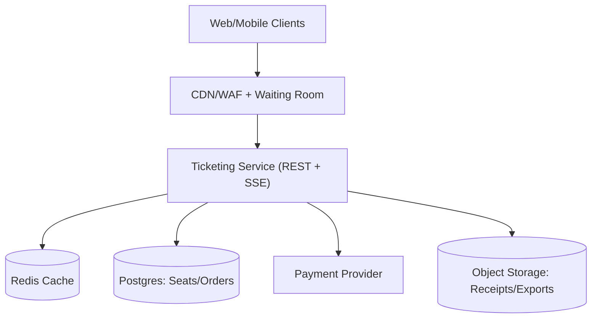
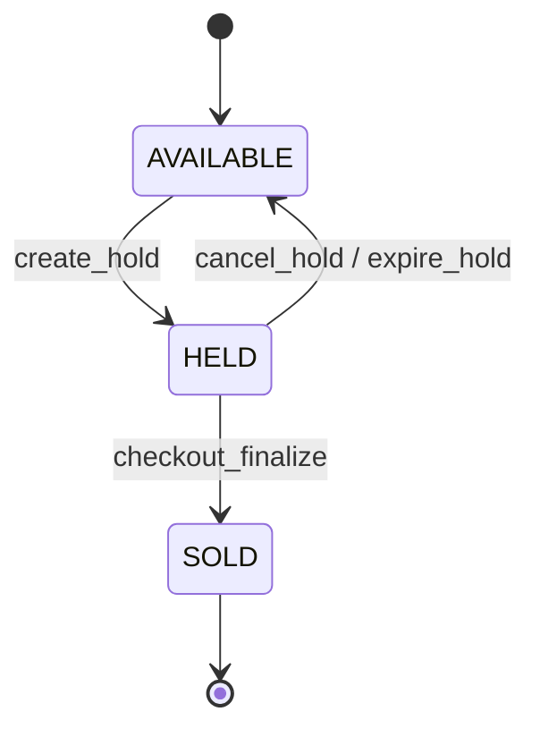

## Overview

A high-demand ticketing system is a contention and fairness problem around a finite, highly contested inventory (seats). The core of the system is a strongly consistent seat state machine with atomic transitions and time-bounded holds:

- `AVAILABLE → HELD → SOLD` (holds expire after 2–5 minutes)

Everything else exists to (1) keep that transactional path stable under bursts and (2) provide a responsive seat-map experience without weakening correctness.

## Requirements

### Functional Requirements
- Browse events, venues, showtimes; view pricing tiers and seat restrictions.
- View an interactive seat map with near-real-time availability changes.
- Create a temporary seat hold (cart) with expiration (2–5 minutes).
- Enforce selection constraints:
  - contiguous seats / “best available”
  - accessibility rules and restricted-view labeling
  - per-account/per-household purchase limits
- Checkout that finalizes purchase: payment authorization/capture, ticket issuance, receipt.
- Release held seats on expiration or user cancellation.
- Abuse mitigation: rate limiting, request shaping, step-up challenges, purchase limit enforcement.
- Operator tooling: event setup, price tiers, seat blocks/holds, manual order/ticket actions, customer support lookup.
- Immutable, queryable audit logs for seat ownership changes.

### Non-Functional Requirements (SLO Targets)

#### Scale (Peak On-Sale)
- Concurrent viewers on a single hot event: **0.5–2.0M**
- Browse/read QPS: **100–250k QPS**
- Hold attempts QPS: **10–30k QPS**
- Checkout starts QPS: **2–8k QPS**
- Seats per event: up to **100k**
- Events/year: **~50k**

#### Latency (User-Visible)
- Seat map assets via CDN: **P50 50–100ms, P99 250–500ms**
- Availability snapshot (cached): **P50 80–150ms, P99 400–800ms**
- Hold attempt (transactional): **P50 120–200ms, P99 600–1200ms**
- Checkout confirmation: **P50 500–900ms, P99 2–5s**

#### Availability
- Browse: **99.99%** monthly
- Holds/Checkout: **99.95%** monthly
- Realtime updates: **99.9%** monthly (best effort)

#### Consistency & Correctness
- Strong consistency for seat transitions, order finalization, purchase limits.
- Eventual consistency acceptable for analytics and search indexing.

#### Durability & Recovery
- Completed orders must not be lost.
- Transactional data RPO: **≤ 1 minute** (regional)
- Transactional path RTO: **≤ 30 minutes** (regional failover)
- Audit trail must be tamper-evident and queryable.

## Simplified Architecture

### Key Ideas
- **One transactional database** (Postgres) is authoritative for seat state and orders.
- **A single Ticketing Service** (modular monolith) serves browse, holds, checkout, operator tools, and realtime SSE.
- **CDN/WAF waiting room** smooths bursts and blocks obvious abuse before it reaches the database.
- **Redis** serves availability snapshots and hot metadata to keep origin load stable during on-sale.
- **Realtime SSE** is best-effort UX; correctness always comes from Postgres transactions.

## Components

### Edge (CDN/WAF + Waiting Room)
**Responsibilities**
- Serve static seatmap layout assets via CDN.
- Provide bot mitigation (WAF rules, managed bot detection, rate limiting).
- Gate the on-sale burst with a per-event waiting room/admission token.

**Design**
- Admission token (signed) contains `event_id`, `issued_at`, `expires_at`, optional `risk_tier`.
- Enforce stricter policies for write endpoints (`/holds`, `/orders`) than for browse.
- Step-up challenge (CAPTCHA) only on elevated risk or suspicious rates.

**Failure Modes**
- Browse can continue from cache during partial edge degradation.
- Holds/checkout are throttled under edge uncertainty to keep the transactional tier within SLO.

---

### Ticketing Service (REST + SSE)
A single deployable service with modules:
- **Browse**: event metadata, pricing tiers, seatmap layout URLs.
- **Availability**: section-level snapshots and deltas.
- **Holds**: create/cancel/expire holds, enforce selection rules.
- **Checkout**: order state machine, payment orchestration, ticket issuance.
- **Ops/Admin**: event setup, seat blocks/holds, customer support tools.
- **Audit**: append-only event log for investigations.

**Idempotency**
- All mutating endpoints accept `Idempotency-Key`.
- The service stores the key and the resulting response (or canonical resource id) to make retries safe.

---

### Postgres (Authoritative Transaction Store)
**Responsibilities**
- Enforce seat state transitions with transactional guarantees.
- Store holds, orders, payments references, tickets, and audit records.
- Provide strong consistency for purchase limits and seat ownership.

**Scaling posture**
- Start with a managed, multi-AZ Postgres cluster.
- Use partitioning by `event_id` for `seats` and seat-related tables to localize contention.
- Add read replicas later for non-critical admin/reporting queries (not required for correctness).

---

### Redis (Read Cache)
**Responsibilities**
- Cache hot, derived read models that are expensive at scale:
  - `availability:{event_id}:{section_id}` → compressed bitmap + `section_version`
  - `event:{event_id}` → metadata/pricing (short TTL)
  - `hold_countdown:{hold_id}` → small hold metadata (optional convenience cache)

**Consistency**
- Postgres remains the source of truth.
- Cache is updated on seat transitions and can be rebuilt from Postgres if lost.

---

### Payment Provider
**Responsibilities**
- Tokenized payment authorization/capture.
- Provider references stored for dispute handling and support workflows.

**Practices**
- Strict timeouts, bounded retries, and idempotent provider calls.
- Store only PSP tokens and provider refs to minimize PCI scope.

---

### Object Storage (Receipts/Exports)
**Responsibilities**
- Store receipts, support exports, and periodic audit exports with retention policies.
- Keep operational access to historical artifacts without loading Postgres with large blobs.

## Data Model

### Seat State Machine

### Storage Schema (Relational)

**events**
- `event_id (PK)`, `venue_id`, `name`, `start_time`, `onsale_time`, `status`
- `seatmap_version`, `created_at`, `updated_at`

**seats**
- `(event_id, seat_id) (PK)`
- `section_id`, `row`, `number`, `price_tier_id`
- `attributes JSONB` (accessibility, restricted view, etc.)
- `state ENUM('AVAILABLE','HELD','SOLD')`
- `hold_id NULL`, `hold_expires_at NULL`
- `order_id NULL`
- `state_version BIGINT` (monotonic)
- Indexes:
  - `(event_id, section_id, state)` for snapshots
  - `(event_id, hold_expires_at)` for expiry sweeps

**holds**
- `hold_id (PK)`, `event_id`, `user_id`, `device_id`
- `status ENUM('ACTIVE','EXPIRED','CANCELLED','CONVERTED')`
- `expires_at`, `created_at`, `cancelled_at`
- `idempotency_key` (unique with `user_id,event_id`)

**hold_items**
- `(hold_id, seat_id) (PK)`, `event_id`

**orders**
- `order_id (PK)`, `event_id`, `user_id`
- `status ENUM('PENDING','AUTHORIZED','COMPLETED','CANCELLED','FAILED')`
- `total_amount`, `currency`, `created_at`, `updated_at`
- `idempotency_key` (unique with `user_id`)

**payments**
- `payment_id (PK)`, `order_id`
- `provider`, `provider_ref` (unique)
- `status ENUM('INIT','AUTHORIZED','CAPTURED','FAILED','VOIDED','REFUNDED')`
- `amount`, `created_at`, `updated_at`

**tickets**
- `ticket_id (PK)`, `order_id`, `event_id`, `seat_id`
- `barcode_token`, `status ENUM('ISSUED','VOIDED')`
- Unique `(event_id, seat_id)`

**audit_log**
- `audit_id (PK)`, `event_id`
- `actor_type`, `actor_id`
- `action`, `payload JSONB`, `created_at`
- `prev_hash`, `entry_hash` (hash-chain for tamper-evidence)

## Core Flows

### Browse & Seat Map
- Seatmap layout is immutable and served via CDN using `seatmap_version`.
- Availability is served at **section-level**:
  - `snapshot`: compressed bitmap + `section_version`
  - `delta`: list of seat changes since `since_version` (best effort; fallback to snapshot)

### Holds (Atomic, Strongly Consistent)
**Transaction pattern (Postgres)**
- In a single transaction:
  1. Validate constraints (purchase limits, accessibility rules, contiguous/best-available logic).
  2. Claim seats with a conditional update:
     - Update all requested seats where `state='AVAILABLE'`.
  3. If updated row count != requested seat count, rollback and return `409`.
  4. Insert `holds` and `hold_items`.

**Expiration**
- Holds store `expires_at` durably.
- A periodic sweeper releases expired holds:
  - `HELD → AVAILABLE` and `holds.status → EXPIRED`
- Lazy cleanup is applied on hold/checkout access when `expires_at` is in the past.

### Checkout (Resumable Order State)
1. **Authorize** payment with PSP (idempotent).
2. In a DB transaction:
   - verify hold is `ACTIVE` and unexpired
   - transition seats `HELD → SOLD`
   - mark hold `CONVERTED`
   - create/update order as `AUTHORIZED`
3. **Capture** payment (idempotent).
4. In a DB transaction:
   - mark order `COMPLETED`
   - issue tickets

**Compensation**
- If capture fails after seats are `SOLD`:
  - mark order `FAILED`
  - attempt void/cancel authorization (provider-dependent)
  - release seats back to `AVAILABLE` in a compensating transaction
  - write audit entries for every transition

### Realtime Availability (SSE)
- Clients subscribe to `/availability/stream?event_id=...&section_id=...`.
- The service emits coalesced updates per section every **100–250ms** during churn.
- Clients send `Last-Event-ID` / `since_version`; if too far behind, the service instructs a snapshot refresh.
- Realtime is treated as a UI acceleration path; snapshots always reconcile the view.

## API (Minimal Surface)

### Browse
- `GET /v1/events?query=&date=&city=&cursor=`
- `GET /v1/events/{event_id}`
- `GET /v1/events/{event_id}/seatmap/layout`
- `GET /v1/events/{event_id}/seatmap/availability?section_id=&since_version=`

### Realtime (SSE)
- `GET /v1/events/{event_id}/availability/stream?section_id=...`

### Holds
- `POST /v1/events/{event_id}/holds` (`Idempotency-Key`)
- `DELETE /v1/holds/{hold_id}`

### Checkout
- `POST /v1/orders` (`Idempotency-Key`)
- `GET /v1/orders/{order_id}` (resumability for clients)

### Ops/Admin
- `POST /v1/admin/events`
- `POST /v1/admin/events/{event_id}/seat_blocks`
- `POST /v1/admin/orders/{order_id}/void`
- `GET /v1/admin/customers/{user_id}/orders`

## Operations

### Observability
- Holds: success rate, `409` contention rate, DB tx latency, expiry sweep lag.
- Checkout: PSP authorize/capture success and latency, order completion time.
- Realtime: active SSE connections, event lag, reconnect rate.
- Abuse: rate limit hits, step-up challenge rates, purchase limit violations.

### Correctness Canaries
- No seat sold twice: ensure unique `(event_id, seat_id)` in `tickets` and validate no duplicates in completed orders.
- SOLD seats must have `order_id` and a corresponding `AUTHORIZED/COMPLETED` order.

### Deployment
- One service deployed horizontally behind a load balancer.
- “Safe mode” switch to disable holds/checkout while keeping browse available.
- Schema migrations use expand/contract and feature flags.

## Simplification Notes
- Removed: separate API gateway and multiple domain services; one `Ticketing Service` handles browse/holds/checkout/realtime/admin to reduce cross-service coordination.
- Removed: event bus/outbox and downstream consumers from the critical path; realtime updates are produced directly by the Ticketing Service and reconciled by snapshots.
- Removed: dedicated ticket issuance service; ticket generation and persistence is part of checkout for a single source of truth.
- Kept: CDN/WAF + waiting room because burst control and bot pressure are essential to meet transactional SLOs during on-sale.
- Kept: Redis because peak read fanout for availability requires a low-latency cache; Postgres remains authoritative for correctness.
- Kept: strong consistency in Postgres and idempotency because double-sell prevention and safe retries are fundamental correctness requirements.