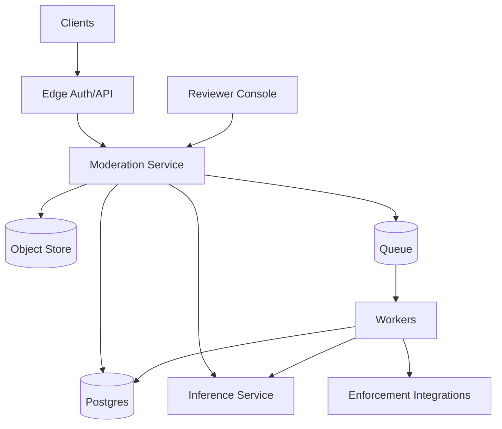
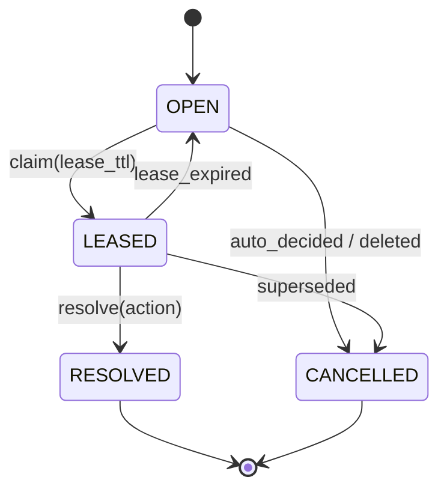

## Overview

This system moderates user-generated content (text, images, video) using a fast automated decision path plus a durable human review workflow for ambiguous or high-impact cases. It supports both **pre-publish gating** (tight latency, immediate decision) and **post-publish scanning** (heavier analysis, retroactive enforcement). Every automated and human action is recorded with policy/model versions and reason codes to produce a strong audit trail and enable safe policy evolution.

Outcomes are unified as: `ALLOW | LIMIT | REMOVE | ESCALATE`.

## Requirements

### Functional
- Ingest and moderate **text**, **images**, **video**, including edits/updates.
- Support:
  - **Pre-publish** decisions within strict latency budgets.
  - **Post-publish** scanning with retroactive actions.
- Deterministic, versioned policy logic based on:
  - account state and prior violations
  - allowlists/blocklists
  - jurisdiction (locale/country)
  - amplification guardrails (high reach / virality)
- Human review workflow:
  - task claiming with lease/TTL
  - evidence viewing and reason-coded actions
  - QC sampling and optional “four-eyes” for sensitive queues
- Appeals:
  - submission, re-review queue, final disposition
- Immutable audit trail:
  - policy/model versions, thresholds, inputs/fingerprints
  - reviewer identity, timing, rationale
- Safe policy updates:
  - versioning, validation, staged rollout, emergency rollback/kill switch

### Non-functional (targets)
- Peak ingestion: 50k req/s; pre-publish decisions: 5k/s.
- Latency SLOs:
  - pre-publish text P99 ≤ 250ms
  - pre-publish image P99 ≤ 800ms on lightweight gating path; heavy analysis async
  - post-publish scanning P99 ≤ 2 minutes end-to-end
- Availability:
  - decision path 99.99% (regional), reviewer tooling 99.9%
- Consistency:
  - strong for task state transitions and finalized decision per `content_id`
  - eventual acceptable for analytics/training exports

## Simplified Architecture

## Core Components

### Moderation Service (single deployable)
One service contains the core modules:
- **Ingest**: validates requests, idempotency, writes content metadata, stores media pointers.
- **Policy**: serves versioned policy bundles and rollout rules; cached in-process.
- **Decisioning**: applies deterministic rules + calibrated model scores to produce final decisions and reason codes.
- **Review & Appeals**: manages tasks, leases, QC sampling, and appeal workflow.
- **Evidence & Audit**: writes evidence references and append-only audit events.
- **Enforcement dispatch**: issues idempotent calls to product surfaces (visibility changes, notifications, indexing).

This keeps operational ownership simple while preserving clear internal module boundaries.

### Inference Service
A dedicated inference tier handles CPU/GPU-heavy model execution:
- Standardizes inputs/outputs for text/vision/video detectors.
- Enforces per-request deadlines and returns partial results when timeouts occur.
- Supports model versioning and basic canary/shadow routing.

### Postgres (primary system of record)
Postgres stores:
- content metadata
- decisions (append-only)
- review tasks and actions
- appeals
- policy versions and rollout configs
- audit log (append-only)
- idempotency keys
- enforcement dispatch dedupe (for idempotent side effects)

### Object Store (media + evidence)
Stores:
- original media
- derived artifacts (thumbnails, frames, OCR, embeddings where used)
- evidence bundles (normalized fingerprints, extracted features, model outputs summary)

Access is always gated through the Moderation Service to enforce authorization, redaction, and retention.

### Queue + Workers (asynchronous lane)
A managed queue buffers asynchronous work:
- post-publish scanning jobs
- heavy image/video analysis
- reprocessing on policy/model changes
- enforcement retries and delayed actions

Workers are stateless and horizontally scalable; they read jobs, call inference, write decisions, and dispatch enforcement.

## Decision Model

### Outcomes
- `ALLOW`: content visible; still eligible for async scanning depending on policy.
- `LIMIT`: restricted distribution / interstitial / disabled features.
- `REMOVE`: taken down; may trigger reporting workflows.
- `ESCALATE`: creates a review task; default visibility is policy-dependent (e.g., limited until review for higher-risk surfaces).

### Determinism and replay
Every decision persists:
- `policy_version`
- `model_bundle` (model name/version + calibration id + score + latency + status)
- normalized inputs/fingerprints
- evidence bundle reference

This enables reproducible re-evaluation during appeals, investigations, and policy rollbacks.

## Data Model (Postgres)

**`content_items`**
- `content_id` (PK), `owner_user_id`, `content_type`, `media_uri`, `text_body_ref`
- `content_fingerprint`, `locale`, `country`, `surface`
- `visibility_state` (`PENDING|VISIBLE|LIMITED|REMOVED`)
- `created_at`, `updated_at`

**`moderation_decisions`** (append-only)
- `decision_id` (PK), `content_id` (FK)
- `decision` (`ALLOW|LIMIT|REMOVE|ESCALATE`)
- `reason_codes` (array or join table)
- `policy_version`
- `model_bundle` (JSON)
- `confidence`, `evidence_ref`
- `created_at`, `finalized_at`, `finalized_by` (`SYSTEM|HUMAN|APPEAL`)

**`review_tasks`**
- `task_id` (PK), `content_id`
- `queue_key` (e.g., `domain:locale:priority:sensitivity`)
- `state` (`OPEN|LEASED|RESOLVED|CANCELLED`)
- `priority`, `sla_deadline_at`
- lease fields: `lease_owner`, `lease_token_hash`, `lease_expires_at`
- `created_at`, `resolved_at`

**`review_actions`** (append-only)
- `action_id` (PK), `task_id`, `content_id`, `reviewer_id`
- `action` (`ALLOW|LIMIT|REMOVE|ESCALATE|REQUEST_MORE_INFO`)
- `reason_codes`, `notes_redacted_ref`, `created_at`

**`appeals`**
- `appeal_id` (PK), `content_id`, `requester_user_id`
- `state` (`OPEN|IN_REVIEW|RESOLVED|REJECTED`)
- `resolution` (decision enum + reason codes)
- `created_at`, `resolved_at`

**`policies`** (versioned)
- `policy_version` (PK), `policy_blob` (JSON), `created_at`, `created_by`
- optional rollout fields (region/locale/surface/user tier)

**`idempotency_keys`**
- `scope_key` (PK), `content_id`, `first_seen_at`, `last_seen_at`, `response_snapshot`

**`audit_log`** (append-only)
- `event_id` (PK), `event_type`, `principal`, `resource_id`
- `policy_version`, `payload_hash`, `created_at`

**`enforcement_dispatch`** (idempotency for side effects)
- `dispatch_key` (unique), `content_id`, `action_type`, `payload_hash`, `created_at`, `completed_at`

## Key Flows

### 1) Pre-publish gating (synchronous)
1. Client submits content with `client_request_id`.
2. Moderation Service writes metadata/media pointers and runs a **lightweight inference set** with strict timeouts.
3. Decisioning applies policy rules + model outputs and returns `ALLOW|LIMIT|REMOVE|ESCALATE`.
4. If the deadline is exceeded, the response is safe-by-default per surface (commonly `PENDING`/`LIMIT`) and an async job is enqueued.

### 2) Post-publish scanning (asynchronous)
1. Content creation enqueues a scan job.
2. Workers run heavier analysis (video frames, OCR, additional detectors).
3. The system writes a new decision row and applies enforcement if the decision changes visibility.
4. Audit events are appended for the decision and enforcement.

### 3) Human review + QC (strongly consistent task state)
Task claiming uses a lease-based model backed by Postgres transactions (single-writer semantics per task).

QC and “four-eyes” are implemented as policy-driven task creation:
- sampling: automatically create secondary tasks for a percentage of resolved items
- four-eyes: require a second resolve before finalization for sensitive queues

### 4) Appeals
Appeals are modeled as a dedicated queue and task type:
- appeal submission creates an appeal record and a review task in an appeal queue
- appeal resolution writes a finalized decision with `finalized_by = APPEAL`

## APIs

### Public REST
- `POST /v1/content`
  - request: `client_request_id`, `content_type`, `text_body` or `media_upload_token`, `locale`, `country`, `surface`, `mode`
  - response: `content_id`, `visibility_state`, `moderation_status`, optional `decision`
- `GET /v1/content/{content_id}/moderation`
  - response: latest decision + review/appeal status
- `POST /v1/content/{content_id}/appeal`
  - response: `{appeal_id, status}`

### Reviewer/Admin (authenticated)
- `POST /v1/review/tasks/claim?queue_key=...`
- `POST /v1/review/tasks/{task_id}/renew`
- `POST /v1/review/tasks/{task_id}/resolve`
- `POST /v1/policies` (create new version; staged rollout controls)
- `POST /v1/policies/{policy_version}/activate`
- `POST /v1/kill-switch` (emergency enforcement posture per surface/domain)

## Scaling, Reliability, and Operations

- **Hot path latency**: pre-publish only runs fast models; policies are in-memory cached; inference uses strict deadlines with graceful partial results.
- **Asynchronous throughput**: workers scale horizontally; queue isolates spikes; heavy video analysis is always async.
- **Strong consistency where it matters**: task leases and final decisions use single-row transactional updates in Postgres.
- **Idempotency everywhere**: content create, job processing, and enforcement dispatch all use unique keys and dedupe tables.
- **Audit durability**: audit log is append-only in Postgres with periodic export to immutable object storage for retention/WORM requirements.
- **Policy safety**: versioned policies with validation, staged rollout, automated guardrails, and fast rollback.

## Simplification Notes

- Removed: separate orchestrator, decision engine, policy config service, review API, and workflow engine; combined into a single `Moderation Service` to reduce deployments and cross-service failure modes while keeping clear module boundaries.
- Removed: dedicated analytics streams and offline training pipelines from the core request path; replaced with batch exports from Postgres/object storage so moderation correctness and latency stay isolated from data/ML workflows.
- Merged: decision store, task store, outbox/audit log, idempotency keys, and appeals into one Postgres-backed system of record for strong consistency and simpler operations.
- Remaining complexity: a separate `Inference Service` is kept because model execution scales differently (CPU/GPU, batching, timeouts) and must be isolated to protect the pre-publish latency SLOs.
- Remaining complexity: an async `Queue + Workers` lane is kept to meet video/heavy-analysis requirements and ensure reliable post-publish enforcement under bursty load.